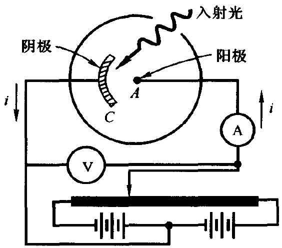
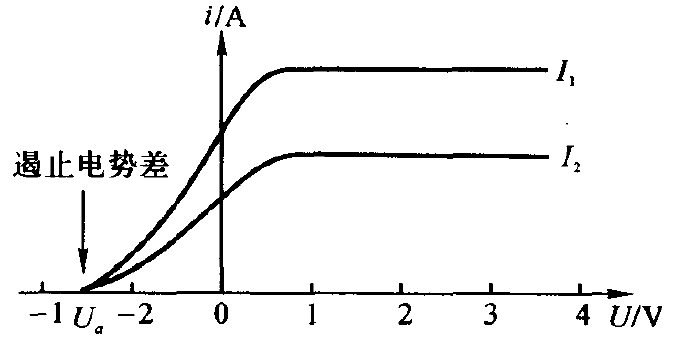
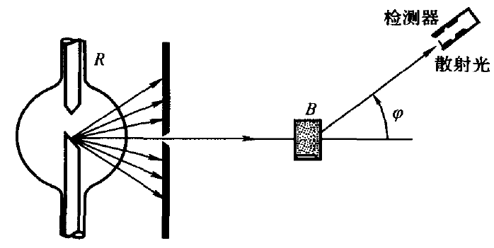
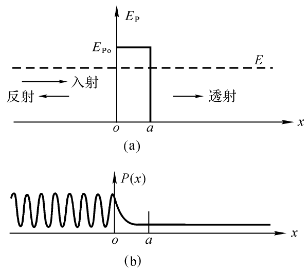

## 第二十章 电磁辐射的量子性
### 辐射出射度
在一定温度下,每单位时间内，从物体单位面积上所发射的各种波长的总辐射能称为辐射出射度,记作$M(T)$。
#### 斯忒藩-玻尔兹曼定律
$$M(T)=\sigma T^4$$
式中$σ = 5.67\times 10^{-8}W/(m^2·K^4)$，$T$为热力学温
标，即以$K$为单位。

#### 维恩位移定律
$$T\lambda_m = b$$

式中$b = 2.898×10^{-3}m·K$，$λ_m$为$M_λ(T)‒λ$曲线的峰值波长。
#### 例题
假设太阳和地球都可当做绝对黑体，地球在吸收太阳的辐射能的同时又发射辐射能，试估算地球表面的温度。已知太阳表面温度为$T$，太阳半径为$R$，地球离开太阳的距离为$d$。

$$M(T)=\sigma T^4$$
地球单位时间单位面积接受到的辐射能
$$M'= \frac{\sigma T^4 \cdot 4\pi R^2}{4\pi d^2} = \frac{\sigma T^4 R^2}{d^2}$$
吸收的辐射能等于发射的辐射能
$$M' \cdot \pi r^2=\sigma t^4 \cdot 4\pi r^2$$
解得$t = \sqrt[4]{\dfrac{T^4R^2}{4d^2}}$
### 光电效应

在光的照射下电子从金属表面逸出的现象叫光电效应。因光照而逸出的电子叫光电子，部分光电子到达阳极而形成的电流叫光电流。使光电流为0的最小反向电势差的大小叫遏止电势差$U_a$
离开金属表面后的光电子的动能有大有小，设最大值为$E_{km}$，有
$$E_{km} = e|U_a|$$
#### 光子的能量与动量
光子的能量
$$E = h \nu = h \frac{c}{\lambda}$$
光子的质量
$$m = \frac{E}{c^2} = \frac{h\nu}{c^2}$$
光子的动量
$$p = mc = \frac{h\nu}{c} = \frac{h}{\lambda}$$
#### $I-U$曲线

图中的$I$为光电流，$U$为阳极和阴极之间的电势差。$I_1>I_2$代表的是入射光的强度。从图中可以看出：
1. 饱和光电流(单位时间内从阴极逸出的光电子数)与入射光强成正比。
2. 遏止电势差$U_a$与入射光强无关

#### $U_a-\nu$曲线

设电子从金属中逸出时为克服表面阻力所需的逸出功为$A$，则有
$$h\nu = A + e|U_a|$$

遏止电势差$U_a$与入射光频率正比。

某频率的光子让电子刚刚能够脱离原子或固体，但已失去动能，该频率称为红限频率
$$\nu_0 = \frac{A}{h}$$
### 康普顿效应

$\text X$射线管$R$发射波长为$\lambda_0$的$\text X$射线，经光栏后变成狭窄的射线束投射到发射物质$B$上，用检测器测量散射光在各方向上的波长及其强度。在散射线中除了有与入射线波长$\lambda_0$相同的成分外，还包含有波长大于$\lambda_0$的成分，而且波长的变
化$\Delta \lambda = \lambda - \lambda_0$随散射角$\varphi$的增大而增大，并与$\lambda_0$和散射物质无关。这种波长改变的散射称康普顿散射，或康普顿效应。
实验结果还表明，散射物质的原子量越小，散射光中波长变大的散射线强度越大，康普顿效应越显著；散射物质的原子量越大，波长变大的散射线相对
较弱。

$$\Delta \lambda = \lambda - \lambda_0 = \frac{h}{m_0c}(1-\cos\varphi)$$

式中$\dfrac{h}{m_0c} = 0.0024nm$，称为康普顿波长，其中$m_0$为电子质量。
## 第二十一章 量子力学简介
### 德布罗意波
实物粒子也具有波粒二象性，能量、动量为$E$、$p$的粒子对应着频率和波长为
$$\nu = \frac{E}{h},\lambda = \frac{h}{p}$$
的波，即德布罗意波。粒子的能量$E$和动量$p$指的是相对论力学中的总能量和动量。
$$
E = mc^2 = \frac{m_0}{\sqrt{1 - v^2 / c^2}}c^2 = m_0c^2 + E_k
$$

$$
p = mv = \frac{m_0 v}{\sqrt{1 - v^2 / c^2}} \quad \quad E^2 = p^2c^2 + m_0^2c^4
$$

$$
p = \sqrt{E^2 / c^2 - m_0^2c^2} = \sqrt{\frac{(m_0c^2 + E_k)^2}{c^2} - m_0^2c^2} = \sqrt{2m_0E_k + \frac{E_k^2}{c^2}}
$$
### 测不准原理
粒子的波动性明显时，同时精确测量坐标$x$和动量$p$是不可能的。
根据量子力学推出，当同时测量一个粒子的位置坐标（设为$x$）及其对应的动量分量(设为$p_x$)时，它们的不确定量$\Delta x$和$\Delta p_x$和之间存在如下关系
$$\Delta x \Delta p_x \geqslant \frac{\hbar}{2}$$
式中$\hbar =\dfrac{h}{2\pi}$
量子力学还导出能量和时间的不确定性关系
$$\Delta E \Delta t \geqslant \frac{\hbar}{2}$$
### 薛定谔方程
设波函数为$\psi(x)$，则概率密度函数为$|\psi(x)|^2$，有
$$\int_{-\infty}^{+\infty}  |\psi(x)|^2 dx= 1$$

### 一维无限深势阱中的粒子

设沿$x$轴势能变化为
$$E_p(x) = 
\begin{cases} 
E_{p0}, & 0 \le x \le a \\ 
0, & x < 0 \text{ 或 } x > a 
\end{cases}$$

$a$称为深势阱的宽度。
#### 粒子能量
$$E = \frac{n^2h^2}{8ma^2}$$
其中$n$为能级。
#### 势垒 隧道效应
按经典理论，入射粒子的能量$E$大于$E_{p0}$时可以越过势垒（即$0<x<a$的区域）；能量小于$E_{p0}$时不能越过势垒。但是量子力学表明入射粒子的能量低于势垒时仍有一定概率穿过势垒。这种量子现象叫隧道效应。
#### 透射率
透射率
$$T=e^{-2ka}$$
其中$k=\dfrac{1}{\hbar}\sqrt{2m(E_{p0}-E)}$
## 第二十二章 氢原子及原子结构初步
### 氢原子光谱
氢原子光谱谱线的波长可概括为一个公式
$$\frac{1}{\lambda}=R(\frac{1}{k^2}-\frac{1}{n^2})$$
其中$R$为里德堡常数，$\dfrac{1}{\lambda}$称为波数，$\dfrac{2\pi}{\lambda}$称为角波数。
根据k的取值，所有谱线可分为若干个线系
|k|线系|
|:-:|:-:|
|1|赖曼系（紫外）|
|2|巴耳末系（可见）|
<!-- |3|帕邢系（红外）|
|4|布喇开系（红外）|
|5|普芳德系（红外）| -->
### 氢原子的能量
$$E_n = \frac{-13.6}{n^2} eV$$
### 量子数
$n$叫主量子数，$l$叫角量子数, $m_l$叫磁量子数。
$$l = 0,1,\cdots n-1\\ m_l = 0,\pm 1,\pm 2,\cdots,\pm l $$
把n相同的所有波函数叫做一个主壳层，共包含$n^2$个波函数
### 角动量
电子处在角量子数为$l$的支壳层时，轨道运动的角动量大小为
$$L = \sqrt{L(L+1)}\hbar$$
角动量 在z轴上的分量为
$$L_z = m_l\hbar$$
$$L_z = L\cos \theta$$
$\theta$为角动量与$z$轴的夹角
### 能层与能级
第一个数对应的是主量子数$n$，第二个字母对应的是角量子数$l$
比如4s对应的是$n = 4, l = 0$，4p对应的是$n = 4, l = 1$