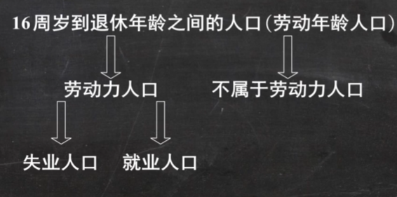
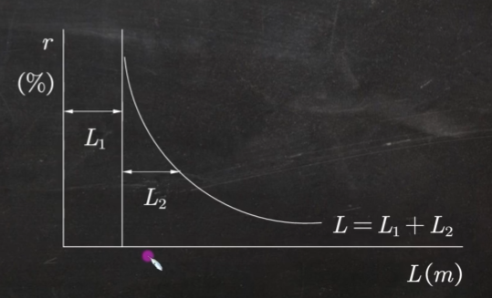
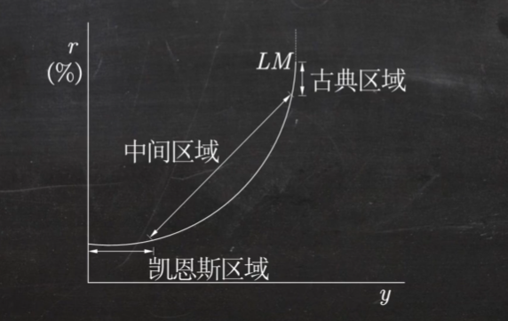
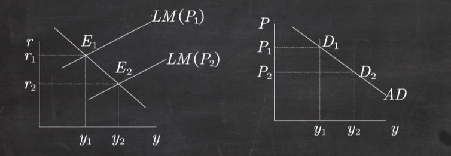

## 宏观经济的基本指标及其衡量
### GDP
国内生产总值，（简称GDP）是指经济社会（即一国或一地区）在一定时期内运用生产要素所生产的全部最终产品（物品和劳务）的市场价值。

看地区，外国的企业在中国的生产也算入GDP，不看哪里人。
### GNP
国民生产总值（简称GNP）是指一国或地区的国民所拥有的全部生产要素在一定时期内所生产的全部最终产品（物品和劳务）的市场价值。

看哪国人，不看在哪，海外中国人也算入GNP

### 例题
某国企业在本国总利润为200亿元，在外国的收益为50亿元；该国国民在本国的劳动收入为120亿元，在外国的劳动收入为10亿元；外国企业在该国的收益为80亿元，外国人在该国的劳动收入为12亿元。求该国的GNP及GDP.

GNP看哪国人/企业
$$GNP = 200+50+120+10=380$$
GDP看生产地在哪
$$GDP = 200+120+80 + 12 = 412$$
### 核算GDP的方法
#### 生产法
生产法是从生产的角度核算GDP，即GDP等于一个国家在一定时期内所新**生产**的**最终产品**和服务的市场价值总和。

- 去年生产，今年卖出的杯子算入去年的GDP。
- 计算了电烤炉进入GDP后就不能重复计算其原料：钢铁、油漆、绝缘材料。
#### 支出法
$$GDP = C+I+G+NX$$
- C:consumption，即消费，指**除购买新住房**（算投资）之外用于物品与劳务的支出，包括耐用品消费支出、非耐用品消费支出和服务支出三个方面。
- I:investment，即投资，固定资产投资、存货投资和住宅投资三大类，**不包括购买债券或上市公句的股票等**，在宏观经济学中，投资是新资本的创造。
- G:government purchase，即政府购买，政府购买物品和劳务的支出，但**不包括政府转移支付。**
- NX=(X-M)：净出口，即出口减进口。
#### 收入法
$$GDP = 工资+利息+租金+利润+间接税和企业转移支付+折旧$$
收入按最终用途可以分为消费、私人储蓄和政府净收入
$$GDP = C+S+T$$

购买公司债券得到的利息收入，应当算入国内生产总值.（√）
#### 国内生产净值NDP
国内生产净值是一个国家在一定时期内（通常为一年）新增加的价值，GDP中扣除资本折旧（总投资-净投资），就得到NDP;即有：NDP=GDP-折旧

#### 国民收入NI
国民收入表示狭义的国民收入（广义的国民收入即GDP，NDP），是指一个国家在一定时期内（通常为一年）用于生产产品和提供劳务的各项生产要素所获得的报酬（收入）的总和;
$$NI = NDP-间接税-企业转移支付+政府给企业的补助金$$

#### 个人收入PI
个人收入是指一个国家所有个人在一定时期内（通常为一年）从各种来源所取得的收入总和。
$$PI = NI-(公司所得税+社会保险税+公司未分配利润)+政府给个人的转移支付$$

#### 个人可支配收入 DPI
$$DPI = PI - 个人所得税$$

或

$$Y_d = NDP+TR-T$$

其中TR是政府转移支付，T是政府税收
#### 个人储蓄S
$$S = Y_d - C$$
其中C为消费
### GDP折算指数（平减指数）
名义GDP是用生产物品和劳务的当年价格计算的全部最终产品的市场价值；实际GDP是指用基期价格计算出来的当期全部最终产品的市场价值。
$$GDP折算指数=\frac{名义GDP}{实际GDP}$$
### 年平均经济增长率
2002年到2004年的年平均经济增长率为
$$年均增长率 = \left(\frac{2004实际GDP}{2002实际GDP}\right)^{\dfrac{1}{2004-2002}}-1$$
### 通货膨胀率
$$通货膨胀率 = (GDP平减指数-1)\times 100\%$$
### 失业
#### 判断失业
正在找工作、没有工作、属于劳动力人口。
#### 财政政策
1. 调节税收
2. 增加或减少政府购买

政府支出减少以及税收调高是紧缩
#### 失业率
$$失业率 = \frac{失业人口}{劳动力人口}\times 100\%$$
#### 劳动参与率
$$劳动参与率= \frac{劳动力人口}{劳动年龄人口}$$

## 收入-支出模型
### 凯恩斯消费理论
随着收入的增加，消费也会增加，但消费的增加不及收入增加得多。
$$C = a + b Y_d(\alpha > 0 ,0<\beta <1)$$
其中$\alpha$为自发消费，$\beta$为边际消费倾向系数，$\beta Y$为引致消费。

二部门经济中$Y=Y_d$
三部门经济中$Y_d = Y -T +T_{tr}$
### 边际储蓄倾向
就是$1-\beta$
### 封闭经济
在封闭经济的收入一支出模型中，假定投资和政府购买支出永远是常量，没有进出口，因此总支出
$$AE = C+I+G$$
均衡产出时
$$Y = AE$$
### 支出、收入、需求、供给
在产品市场上，大家“想买”的总量叫总需求（$AD$）；而大家为了满足这个需求真正“掏钱买单”的动作和金额，就叫总支出（$AE$）。
在模型中，我们通常认为总需求 = 总支出（即 $AD = AE = C + I + G + NX$）。

整个社会生产出来的最终产品和劳务的总和，叫总供给（$AS$），也就是总产出（$Y$）。企业把这些东西卖掉换成钱后，要把钱作为工资发给员工、作为利息给银行、作为利润留给股东。因此，总供给（产出）在价值上必然等于所有生产要素拿到的总收入（$Y$）。
### 三部门经济乘数
$$ Y = \frac{\alpha + I + G -\beta T+\beta T_{tr}}{1-\beta}$$
分别对应
自发支出乘数、投资乘数、政府购买乘数、税收乘数、政府转移支付乘数。
#### 平衡预算乘数
平衡预算乘数是指政府收入（税收收入）和支出（政府购买支出）同时以相等数量增加或减少时国民收入变动对政府收支变动的比率。
可计算得出：无论在定量税还是比例税下，平衡预算乘数均为1。
#### 存货
$$IU = Y-AE$$
## IS-LM模型
投资是利率的减函数。如果利率增加存银行就好了。
利率升高，债券的价格就会变低。利率实际上也是债券的利率，债券的利率升高了说明原来的债券贬值了。
### 投资与利率的关系
$$i = e - dr$$

e为自主投资，即利率为0的时候的投资，r是利率，d是系数

### IS曲线
在两部门经济中，联立
$$\begin{cases}
    Y = C+I\\
    I = e-dr\\
    C = a + bY
\end{cases}$$

可以得到
$$r =\frac{a+e}{d}-\frac{1-\beta}{d}Y$$
均衡国民收入与利率之间存在反向变化关系。

如果是三部门经济，也就是说
$$\begin{cases}
    Y = C+I+G\\
    I = e-dr\\
    C = a + bY_d\\
    Y_d = Y-T+T_{tr}
\end{cases}$$

可以得到

$$Y = \frac{\alpha + I +G -\beta T +\beta T_{tr}}{1-\beta}= \frac{\alpha + e-dr +G -\beta T +\beta T_{tr}}{1-\beta}$$

IS曲线上小下大

紧缩的财政政策让IS向左，扩张的向右
### LM曲线
#### 交易动机和谨慎动机
其货币需求量大致与收入成正比
$$L_1 = ky$$

#### 投机动机
与利率成反比
$$L_2 = -hr$$

$$L = ky-hr$$
货币需求曲线

认为货币供给不变，为常数m
$$m = L = ky - hr$$

$$r = \frac{k}{h}Y-\frac{m}{h}$$

其中$m=\frac{M}{P}$
P:price 价格
M:名义货币供应量

所以P增大m减小。
M增大是扩张型货币政策，M减少是紧缩性
所以紧缩向左，扩张向右
## AD-AS模型
### 总需求AD
总需求曲线说明产品市场和货币市场达到均衡时，总需求与价格水平之间的关系。

#### 总需求曲线的移动
政府采取扩张性财政政策或扩张性货币政策，都会使总需求曲线向右方移动；反之，则向左方移动。
## 失业与通货膨胀

### 自然失业率
自然失业率为经济社会在正常情况下的失业率，它是劳动市场处于供求稳定状态时的失业率。这里的稳定状态被认为是：既不会造成通货膨胀也不会导致通货紧缩的状态。自然失业率是一个长期概念。

$$\frac{U}{N}=\frac{l}{l+f}$$

N代表劳动力、U代表失业工人人数、f代表就职率、代表离职率
## 宏观经济政策
### 目标
(1)充分就业
(2)价格稳定
(3)经济持续均衡增长
(4)平衡国际收支