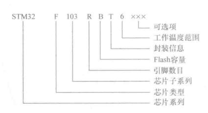
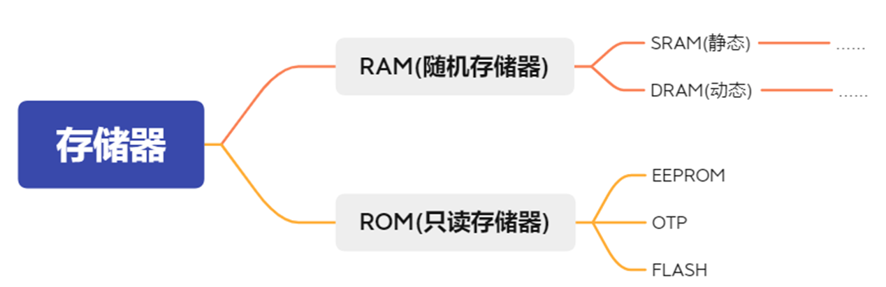
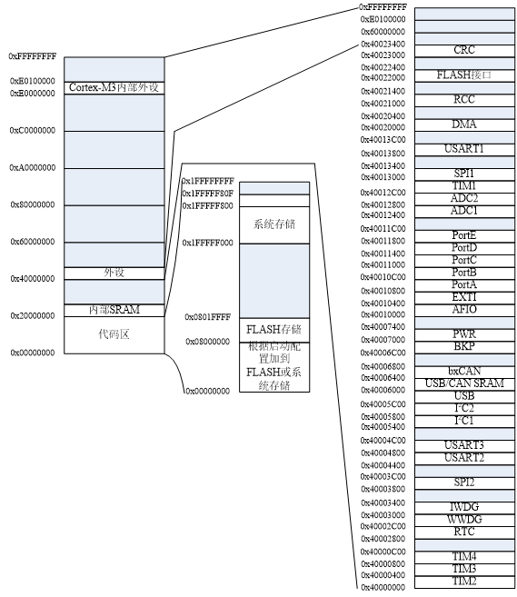
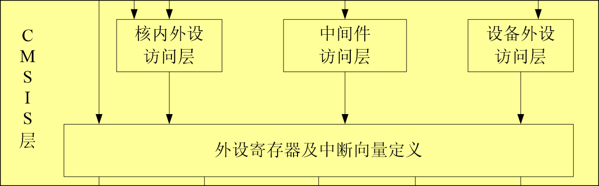
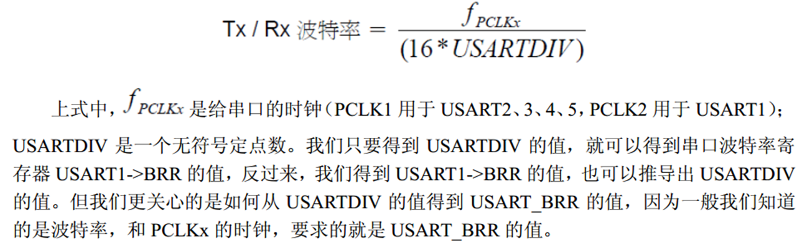
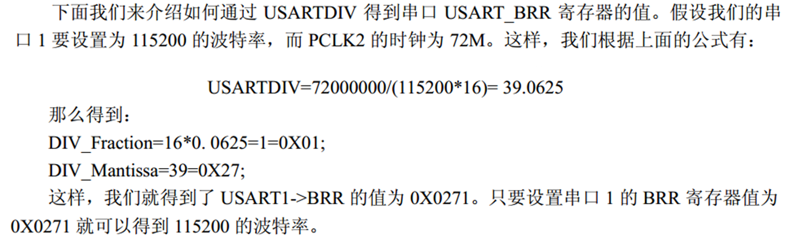

# 嵌入式系统

## 嵌入式系统简介

### 嵌入式系统的定义

- 国际电气和电子工程师协会(IEEE)定义的嵌入式系统是“用于控制、监视或者辅助操作机器和设备运行的装置”
- 目前国内普遍认同的嵌入式系统定义是,以**计算机技术**为基础,以**应用**为中心,软件、硬件可剪裁,适合应用系统对**功能可靠性、成本、体积、功耗严格要求**的**专业计算机系统**。
- 在构成上,嵌入式系统以**微控制器**及**软件**为核心部件,两者缺一不可;
- 在特征上,嵌入式系统具有很强的**可嵌入性**。

### 嵌入式系统与单片机的区别

嵌入式系统区别于传统单片机系统的三个特征：

1. 嵌入式系统的微控制器通常是由 32 位及以上的 RISC 处理器组成的。
2. 嵌入式系统的软件系统通常是以嵌入式操作系统为核心,外加用户应用程序。
3. 嵌入式系统在特征上具有明显的可嵌入性。
<!-- ###  嵌入式系统发展趋势

- 嵌入式系统应用经历了无操作系统、简单操作系统、实时操作系统和面向 Internet 四个阶段。
- 嵌入式系统的广泛应用和互联网的发展导致了物联网概念的诞生。物联网导致大数据成为科技前沿。数据存储、传输、分析等技术的发展无形中催生了人工智能。
- 嵌入式系统正是获取数据的最关键的系统之一。人工智能的发展可以说是嵌入式系统发展的产物。 -->

### 嵌入式系统的特点

1. 功耗限制
2. 低成本
3. 多速率
4. 环境相关性
5. 系统内核小（体积小）
6. 实时性
7. 专业性强
8. 不可垄断
9. 产品相对稳定

### ARM Cortex

- ARM(Advanced RISC Machines)是一家英国公司。主要业务是开发和许可处理器技术，特别是低功耗、高性能的 ARM 架构处理器。作为产品，ARM 是一种基于 RISC 架构的高性能处理器。

| 系列           | 应用领域                                                                               |
| -------------- | -------------------------------------------------------------------------------------- |
| ARM Cortex - A | 针对日益增长的运行需求，包括 Linux、WindowsCE、Android 和 IOS 系统的消费电子和无线产品 |
| ARM Cortex - R | 针对需要运行实时操作系统来进行控制应用的系统                                           |
| ARM Cortex - M | 应用于当前 8/16 位单片机 MCU 的换代产品                                                |

- ARM Cortex - M3 处理器是新一代的 32 位处理器,是一个高性能、低成本的开发平台。

#### 特点

1. 性能丰富成本低。
2. 低功耗。把睡眠模式与状态保留功能结合在一起。
3. 可配置性强。NVIC (Nested Vectored Interrupt Controller, 嵌套向量中断控制器)功能提高了设计的可配置性。供了多达 240 个具有单独优先级、动态重设优先级功能和集成系统时钟的系统中断。
4. 丰富的链接。基于 Cortex - M3 的设备可以有效处理多个 IO 通道和协议标准。

### STM32

意法半导体(ST)生产的 Cortex - M 微控制器。 STM32 系列单片机是目前最流行的 Cortex - M 微控制器。

- STM32 单片机包含低功耗的 STM32Lx 系列、高性能的 STM32F2/4/7 系列及功耗与性能
  均衡的 STM32F0/1/3 系列产品。
- 其中 STM32F1 为目前应用最多的主流微控制器,主要分为 3 个系列:基本型、增强型和互联型。
- 基本型系列是 STM32F1 系列的入门产品,最高主频为 48MHz;
- 增强型系列产品性能较好,主频为 72MHz,能实现高速运算;
- 互联型相对于增强型增加了网络功能,主频为 72MHz

#### stm32f10x

STM32F10x 系列单片机基于 ARM Cortex - M3 内核,STM32F100xx、STM32F101xx 和 STM32F102xx 为基本型系列,分别工作在 24MHz、36MHz 和 48MHz 主频下。STM32F103xx 为增强型系列,STM32F105xx 和 STM32F107xx 为互联型系列,均工作在 72MHz 主频下。

#### stm32 的优点

1. 先进的内核结构
   1. 哈佛结构，使处理器整体性能测试达到 1.25DMIPS/MHz，而功耗仅为 0.19mW/MHz
   2. Thumb-2 指令集以 16 位的代码密度带来了 32 位的性能；
   3. 内置了快速的中断控制器，提供了优越的实时特性，中断的延迟时间降到只需 6 个 CPU 周期，从低功耗模式唤醒的时间也只需 6 个 cpu 周期
   4. 单周期乘法指令和硬件除法指令。
2. 三种功耗控制
   1. 运行模式下高效率的动态耗电机制
   2. 待机状态时极低的电能消耗
   3. 电池供电时的低电压工作能力
3. 最大程度集成整合

   1. STM32 内嵌电源监控器,包括上电复位、低电压检测、掉电检测和自带时钟的看门狗定时器,减少对外部器件的需求。
   2. 使用一个主晶振可以驱动整个系统。低成本的 4~16MHz 晶振即可驱动 CPU、USB 以及所有外设,使用内嵌锁相环产生多种频率,可以为内部实时时钟选择 32kHz 的晶振。
   3. 内嵌出厂前调校好的 8MHz RC 振荡电路,可以作为主时钟源。
   4. 针对 RTC 或看门狗的低频率 RC 电路。
   5. LQPF100 封装芯片的最小系统只需要 7 个外部无源器件。

4. 出众及创新的外设
   USB、USART 、SPI、$I^2C$ 、GPIO 等

<!-- ### 思考题
1. 什么是嵌入式系统?列举三个嵌入式系统的特征,区别于单片机系统和计算机系统

   嵌入式系统是以**计算机技术**为基础,以**应用**为中心,软件、硬件可剪裁,适合应用系统对**功能可靠性、成本、体积、功耗严格要求**的**专业计算机系统**。
   三个特征为
   1. 嵌入式系统的微控制器通常是由32位及以上的RISC处理器组成的。
   2. 嵌入式系统的软件系统通常是以嵌入式操作系统为核心,外加用户应用程序。
   3. 嵌入式系统在特征上具有明显的可嵌入性。
2.  简述嵌入式系统与嵌入式操作系统之间的联系与区别。
   联系：嵌入式操作系统是嵌入式系统的重要组成部分
   区别：嵌入式系统是一个广义的概念，它包括硬件和软件两大部分。嵌入式操作系统则是嵌入式系统软件部分的一个重要组成部分 -->

## 嵌入式单片机 STM32 硬件基础

### stm32 命名规则

### 引脚

#### 电源

VDD_x (x =1, 2, 3, 4)、 VSS_x (x =1, 2, 3, 4), VBAT, VDDA,VSSA

#### 复位

NRST 低电平将导致系统复位

#### 时钟控制

SC_IN、OSC_OUT, OSC32_IN、OSC32_OUT

#### 启动配置

BOOT0、BOOT1(PB2)

#### 输入输出

PAx，PBx，PCx，PDx

### 内部总线结构

STM32F103 的总线系统由**驱动单元**、**被动单元**和**总线矩阵**三部分组成

#### 驱动单元

1. 指令总线(ICode):将 Cortex - M3 内核的指令总线与**Flash 指令接口**相连接,取指操作在该总线上进行。
2. 数据总线(DCode):将 Cortex - M3 内核的数据总线连接到**总线矩阵**,通过**总线矩阵**与 **Flash 数据接口**相连接,用于常量加载和调试访问。
3. 系统总线(System):将 Cortex - M3 内核的系统总线连接到**总线矩阵**,通过**总线矩阵**与**外设**相连。
4. 直接内存访问总线(DMA):将DMA的**AHB 主机接口**连接到**总线矩阵**,通过**总线矩阵**与**外设**相连。

#### 被动单元
被动单元有3个
- 内部 SRAM
- 内部 Flash
- AHB (Advanced High Performance Bus,高级性能总线)/APB(Advanced Peripheral Bus,高级外设总线)桥
####  总线矩阵
- DCode 总线、System 总线和通用 DMA 总线通过总线矩阵与被动单元相连 
- 为了允许 DMA 访问,AHB 外设**通过总线矩阵连接到系统总线**。
### 内部时钟单元

- 在 STM32 中有 5 个时钟源,分别为 HSI 、HSE、 LSE , LSI 、 PLL
- 高速时钟(HSE 和 HSI)提供给芯片主体的主时钟.低速时钟(LSE 和 LSI)只是提供给芯片中的 RTC(实时时钟)及独立看门狗使用。当然高速时钟也可以提供给芯片中的 RTC 使用。
- 内部时钟是在芯片内部 RC 振荡器产生的，起振较快，所以时钟在芯片刚上电的时候，默认使用内部高速时钟。而外部时钟信号是由外部的晶振输入的，在精度和稳定性上都有很大优势，所以上电之后再通过软件配置，转而采用外部时钟信号.
- STM32 还具有系统时钟 SYSCLK。SYSCLK 是供STM32 中绝大部分部件工作的时钟源,系统时钟可选择为PLL 输出、HSI 或者 HSE。

### 内部复位系统

复位以后内部各功能寄存器及 IO 口置于初始值状态。STM32F10x 支持**电源复位、系统复位和备份区域复位**三种复位形式。

#### 电源复位

当 NRST 引脚被拉低时,将产生复位脉冲。要求每一个复位源都能保持至少 20μs 的低电平脉冲延时,电源才能有效复位。
当以下事件发生时将产生电源复位。

1. 上电/掉电复位
2. 从待机模式中返回。

电源复位将复位除了备份区域外的所有寄存器。发生电源复位后,系统的复位入口矢量被固定在地址**0x00000004**,即系统会从该地址重新运行用户程序。

#### 系统复位

当发生以下任一事件时,可以产生一个系统复位。

1. NRST 引脚上的低电平(外部复位)。
2. 窗口看门狗计数终止(WWDG)复位。
3. 独立看门狗计数终止(IWDG)复位。
4. 软件复位(SW 复位)。
5. 低功耗管理复位。

低功耗模式分为三种：睡眠、停止和待机。

通过查看时钟控制器的 RCC_CSR 控制状态寄存器中的复位状态标志位可以识别复位事件来源。除了时钟控制器的 RCC_CSR 寄存器中的复位标志位和备份区域中的寄存器以外,系统复位将其他所有寄存器复位至它们的初始状态。

#### 备份区域复位

1. 软件方式：设置备份区域控制寄存器 RCC_BDCR 中的 BDRST 位；
2. 在 VDD 和 VBAT 两者均掉电情况下，VDD 和 VBAT 上电将触发备份区域复位

### 内部存储器结构

下面这一块只有课件有

- RAM：Random Access Memory，随机存取存储器。是与 CPU 直接交换数据的内部存储器。可随时读写，速度快，操作系统或运行中程序的临时数据存储介质。
- SRAM：Static Random-Access Memory，静态随机存取存储器。只要保持通电，里面储存的数据就可以恒常保持
- DRAM：Dynamic Random Access Memory，动态随机存取存储器。数据想要保持，就需要周期性地更新里面所储存的数据
- ROM：Read-Only Memory，只读存储器。工作状态下只能读取数据，不能即时修改或重新写入数据。程序存储器
- EEPROM：Electrically Erasable Programmable Read Only Memory，带电可擦可编程只读存储器
- OTP：One Time Programmable，一次性可编程存储器。数据写入后，将不可再次更改和清除。
- FLASH：Flash 是一种块擦写型存储器。在某个级别的低电压下，Flash 的内部信息可读不可写，类似于 ROM，而在较高的电压下，其内部信息可以更改和删除，又类似于 RAM。（一般作为存储程序）
  
  STM32F103 的程序存储器、数据存储器、寄存器和 IO 端口被组织到一个 4GB 的线性地址空间；地址空间分为 8 块，每块 512MB

#### 代码区（512MB）

分三部分，启动空间、Flash、系统存储区；

- Flash 存放用户编写的程序，系统存储器存放串口下载程序。系统上电后根据启动配置，把 Flash 或系统存储区映射到启动空间

#### 内部 SRAM

是用来保存程序运行时产生的临时数据的随机存储器。

#### 外设区

外设区是外设寄存器地址空间；

#### Cotex-M3 内部外设区

Cotex-M3 内部外设区又称为“私有外设区”，用于调试组件等私有外设

#### 启动配置

代码区始终从地址 0x0000000 开始，通过 Icode 和 Dcode 总线访问。启动之后，CPU 从地址 0x00000000 获取堆栈顶的地址，并从启动存储器的 0x00000004 指示的地址开始执行代码。而数据区（SRAM）始终从地址 0x20000000 开始，通过系统总线访问。

STM32F103 实现了特殊的机制，系统可以从三个地方进行启动：Flash、系统存储区、内置 SRAM。当系统复位后，SYSCLK 发出的第四个上升沿，BOOT0、BOOT1 的状态进行锁存。

##### 从 Flash 启动

将 Flash 存放的用户程序映射到启动空间 0x00000000，，启动后执行用户程序，但仍能在用户程序原有 0x08000000 访问，即闪存存储器的内容可以在两个地址区域访问；

##### 从系统存储区启动

系统存储器存放芯片出厂时的串口下载程序，这种情动方式将系统存储器 0x1FFF F000 映射到启动空间 0x00000000，启动后将执行串口下载程序，可通过串口把程序下载到 Flash 中，程序下载完再配置从 Flash 启动，因此该启动方式只用于程序下载；

##### 从内置 SRAM 启动

从内置 SRAM 启动:内置 SRAM 一般存放程序运行时产生的临时数据,不存放程序,只能在 0x20000000 开始的地址区访问 SRAM。

### 输入输出口

根据型号不同,STM32F10x 处理器上 10 端口数量不同,STM32F103RBT6 只有 A、B、C、D 四个 IO 端口,而 STM32F103ZET6 有 A、B、C、D、E、F 和 G 七个 IO 端口,每个端口有 16 个引脚,每个引脚可以作为通用功能输入输出 GPIO(General Purpose Input Output),大部分 IO 具有第二功能,即复用功能输入输出 AFIO (Alternate Function Input Output)

### 最小系统设计

最小系统是指仅包含必需的元器件,仅可运行最基本软件的简化系统。无论多么复杂的嵌入式系统都可以认为是由最小系统和扩展功能组成的。最小系统是嵌入式系统硬件设计中复用率最高,也是最基本的功能单元。典型的最小系统由单片机芯片、供电电路、时钟电路、复位电路、启动配置电路和程序下载电路构成,如

#### 时钟

中时钟部分提供了两个时钟源,Y1 为整个系统提供时钟;Y2 为 RTC 提供时钟。

#### 下载

TAG (Joint Test Action Group,联合测试行动小组)是一种国际标准测试协议,主要用于芯片内部测试。ARM、器件,采用 4 线的 JTAG 下载方式,有效节省 IO 口。

#### 电源

STM32F103 系列工作电压在+2.0~+3.6V 之间，电源转换芯片 REG117-3.3 是一款正电压输出的低压降三端线性稳压电路，输入 5V，输出固定 3.3V。
电源引脚必须接电容，增强稳定性。

## 软件开发基础

### Cortex - M3 微控制器软件接口标准 CMSIS

CMSIS层起着承上启下的作用：一方面对硬件寄存器层进行统一实现，另一方面向上层的操作系统及中间件接口层、用户应用层提供接口，简化程序。

CMSIS 层包括核内外设访问层、中间访问层和设备外设访问层。

### 标准外设库

#### Libraries 文件夹下的标准库的源代码及启动文件

- `core_cm3.c` 和 `core_cm3.h`分别是核内外设访问层(CPAL)的源文件和头文件,作用是为采用 Cortex - M3 内核的芯片外设提供进入 M3 内核的接口。
- `stm32f10x.h`是设备外设访问层的头文件,包含了 STM32F10x 系列所有外设寄存器的定义(寄存器的基地址和布局)、位定义、中断向量表、存储空间的地址映射等。
- `system_stm32f10x.c` 和 `system_stm32f10x.h`分别是设备外设访问层(DPAL)的源文件和头文件,包含了两个函数和一个全局变量。函数 `SystemInit()`用来初始化系统时钟(系统时钟源、PLL 倍频因子、AHB/APBx 的预分频及其 Flash),启动文件在完成复位后跳转到 `main()`函数之前调用该函数。函数 `SystemCoreClockUpdate()`用来更新系统时钟,当系统内核时钟变化后必须执行该函数进行更新。全局变量 SystemCoreClock 包含了内核时钟(HCLK),方便用户在程序中设置 `SysTick` 定时器和其他参数。
- `startup_stm32f10x_X.s` 是用汇编写的系统启动文件,X 代表不同的芯片型号,使用时要与芯片对应。启动文件是任何处理器上电复位后首先运行的一段汇编程序,为 C 语言的运行搭建合适的环境。
- `stm32f10x_ppp.c` 和`stm32f10x_ppp.h`分别为外设驱动源文件和头文件,ppp 代表不同的外设,使用时将相应文件加入工程。其包含了相关外设的初始化配置和部分功能应用函数,这部分是进行编程功能实现的重要组成部分。
- `misc.c`和`misc.h` 提供了外设对内核中的嵌套向量中断控制器 NVIC 的访问函数,在配置中断时,必须把这两个文件加到工程中。

#### Project 文件夹下的采用标准库写的工程模板和例子

- `stm32f10x_it.c` 和 `stm32f10x_it.h` 是用来编写中断服务函数的,其中已经定义了一些系统异常的接口,其他普通中断服务函数要自己添加,中断服务函数的接口在启动文件中已经写好。
- `stm32f10x_conf.h` 文件被包含进 `stm32f10x.h` 文件,用来配置使用了哪些外设的头文件,用这个头文件可以方便地增加和删除外设驱动函数。

### 软件开发

#### 创建工程目录

1. 工程文件夹下新建 4 个文件夹,分别命名为 Project、System、User 和 BSP。
2. 复制`stm32F10x_StdPeriph_Driver`文件夹至工程文件夹;
3. 复制` system_stm32f10x.c` 和`startup_stm32f10x_md.s`至`System`文件夹;
4. 复制`main. c`、`stm32f10x_conf.h`、`stm32f10x_it.c`和`stm32f10x_it.h`四个文件至 `User` 文件夹。

#### MDK 图标含义

|                    图标                    |                 含义                 |
| :----------------------------------------: | :----------------------------------: |
|  |   单工程管理，用于建立相应的 Group   |
|  | 工程选项配置，用于配置宏和头文件路径 |

#### 头文件

头文件由三部分组成,即头文件版权和版本声明、预处理块和函数声明。
头文件的作用如下:

1. 通过头文件来调用库功能。
2. 头文件能加强类型安全检查。

#### 源文件

由三部分组成,即源文件版权和版本声明、头文件的引用和程序的实现体。

## 输入输出

64 引脚的 STM32F103RBT6 只有 A、B、C、D 四个 10 端口,而 144 引脚的 STM32F103ZET6 有 A、B、C、D、E、F 和 G 七个 10 端口,每个端口有 16 个引脚,每个引脚可以作为通用功能输入输出(GPIO, General Purpose Input Output),大部分引脚也可作为复用功能输入输出(AFIO, Alternate Function Input Output)

GPIO 管的是数字量的输入输出，AFIO 管的是模拟量的输入输出

### GPIO

GPIO 包括下面 5 种模式:

#### 输入

1. 输入浮空:即呈现高阻态。如果端口什么都不接,复位期间和刚复位后,IO 端口被默认配置成浮空输入模式。
2. 输入上拉:即输入高电平。如果端口接一个上拉电阻(起保护作用),表示该端口在默认情况下输入为高电平。如果输入高电平，没法判断是否有信号输入，如果输入低电平，主控制器可以明确知道低电平信号
3. 输入下拉:即输入低电平。如果端口接一个下拉电阻(起保护作用),表示该端口在默认情况下输入为低电平。如果输入低电平，没有办法判断是否有信号，如果输入高电平，主控会明确得到高电平信号。

上电复位后，GPIO 默认为浮空状态，部分特殊功能引脚为特定状态。

- PA15: JTDI 置于上拉模式;
- PA14: JTCK 置于下拉模式;
- PA13:JTMS 置于上拉模式;
- PB4:JNTRST 置于上拉模式。

#### 输出

1. 开漏输出:本身不输出电压,要想输出高电平**必须接上拉电阻**。
2. 推挽式输出:直接输出高低电平电压。低电平时接地,高电平时输出电源电压。这种方式可以不接上拉电阻。

### AFIO

STM32F10x 的 AFIO 包括默认复用功能和软件重新映射复用功能。

#### 默认复用功能

有复用输入、复用输出和双向复用。复用功能输入输出(AFIO)包括下面几种模式:

1. 复用输入功能:端口必须配置成输入模式(浮空、上拉或下拉)且输入引脚必须由
   外部驱动。
2. 模拟输入:用于 ADC 模拟输入。
3. 推挽式复用输出功能:片内外设的功能,如$I^2C$的 SCL、SDA
4. 开漏复用输出功能:片内外设的功能,如 SPI 的 SCK、MOSI、MISO
5. 双向复用功能:输出时,端口位必须配置成复用功能输出模式(推挽或开漏)。输
   入时,输入驱动器被配置成浮空输入模式。

#### 软件重新映射复用功能

为了使不同器件封装的外设 IO 功能的数量达到最优,可以把一些复用功能重新映射到其他一些引脚上。

#### 外部中断/唤醒功能

所有端口都有外部中断能力,为了使用外部中断线,端口必须配置成输入模式。
中断输入方式可实现单边沿触发(只在上升沿触发或只在下降沿触发)、双边沿触发(上升沿和下降沿均触发)以及电平触发(高电平或低电平触发)的多种中断输入方式。

STM32F10x 处理器的每组 GPIO 端口都对应有:
2 个 32 位配置寄存器（GPIOx-CRL，GPIOx-CRH）
2 个 32 位数据寄存器（GPIOx-IDR，GPIOx-ODR）
1 个 32 位置位/复位寄存器（GPIOx-BSRR）
1 个 16 位复位寄存器（GPIOx-BRR）
1 个 32 位锁定寄存器（GPIOx-LCKR）
一共可以控制一组 GPIO 的 16 个 IO 口，每个 I/O 端口位可以自由编程，然而 I/O 端口寄存器必须按 32 位字被访问(不允许半字或字节访问)

GPIO 功能也可借助标准外设库的函数来实现。

#### 普通 GPIO 配置

1. 声明 GPIO 初始化结构体
2. 使能 GPIO 端口时钟
3. 填充 GPIO 初始化结构体参数
4. 完成 GPIO 端口初始化设置

注：AFIO 配置 ppt 没有，遂不学。

## 外部中断 EXTI

单片机与外设交换数据有三种方式:无条件传输方式、程序查询方式以及中断方式。

1. 无条件传输方式:单片机无须了解外部设备状态,当执行传输数据指令时直接向外部设备发送数据,因此适合于快速设备或者状态明确的外部设备。
2. 程序查询方式:控制器主动对外部设备的状态进行查询,依据查询状态传输数据。查询方式常常使单片机处于等待状态,同时也不能做出快速响应。因此,在单片机任务不太繁忙,对外部设备响应速度要求不高的情况下常采用这种方式。
3. 中断方式:外部设备主动向单片机发送请求,单片机接到请求后立即中断当前工作,处理外部设备的请求,处理完毕后继续处理未完成的工作。这种传输方式提高了 STM32 微处理器的利用率,并且对外部设备有较快的响应速度。因此,中断方式更加适应实时控制的需要。

### 中断相关概念

1. 中断:单片机执行主程序时,由于某个事件的原因,暂停主程序的执行,调用相应的中断处理程序处理该事件,处理完毕后再自动继续执行主程序的过程。
2. 中断源:可以引起中断的事件称为中断源。
3. 中断的优先级:不同事件的重要程度不同,重要的事件可以打断相对不重要的事件的处理,用户可以根据自己的需求对不同的事件即不同的中断源设定重要级别,称为中断的优先级。
4. 中断服务程序与中断向量:为了处理中断而编写的程序称为中断服务程序,对应中断服务程序的入口地址称为中断向量。
5. 中断请求、中断响应、中断服务及中断返回:
   1. 中断源对主程序或中断服务程序提出中断要求称为中断请求;
   2. 主程序或中断服务程序接受中断请求,进入中断服务程序的过程称为中断响应;
   3. 执行中断服务程序的过程称为中断服务;
   4. 中断服务程序执行完毕后回到主程序或者次级别中断服务程序的过程称为中断返回。
   5. 中断处理的整个过程包含了中断请求、中断响应、中断服务及中断返回四个步骤。

6) 中断系统:实现中断处理功能的软件、硬件系统称为中断系统。
7) 中断嵌套:如果在执行一个中断时又被另一个更重要的事件打断,暂停该中断处理

#### 中断嵌套的规则

1. 低优先级的中断服务可被高优先级中断源中断,反之则不能。
2. 任何一种中断一旦得到响应,不会被它的同级中断源的请求所中断。

### STM32F103 中断系统组成结构

#### 中断源及中断向量

STM32F103 中断系统提供 10 个系统异常和 60 个可屏蔽中断源，具有 16 个中断优先级。可屏蔽中断源包括：**串口中断、直接内存访问中断、模数转换中断、集成电路总线中断、串行外设接口中断**等。

优先级从-3 ～ 6 的 10 个中断向量定义为系统异常，编号为负的不能设置优先级。响应优先级从 7 开始的为连接到 NVIC 的中断输入信号线的可屏蔽中断，可被用户设置。

其中,外部中断由嵌套向量中断控制器 NVIC 和外部中断/事件控制器 EXTI 来控制。本章介绍外部中断工作原理和使用方法。
| 位置 | 优先级 | 优先级类型 | 名称 | 说明 |
| ---- | ------ | ---------- | --------- | ------------------ |
| 6 | 13 | 可设置 | EXTI0 | EXTI 线 0 中断 |
| 7 | 14 | 可设置 | EXTI1 | EXTI 线 1 中断 |
| 8 | 15 | 可设置 | EXTI2 | EXTI 线 2 中断 |
| 9 | 16 | 可设置 | EXTI3 | EXTI 线 3 中断 |
| 10 | 17 | 可设置 | EXTI4 | EXTI 线 4 中断 |
| 23 | 30 | 可设置 | EXTI9_5 | EXTI 线[9:5]中断 |
| 40 | 47 | 可设置 | EXTI15_10 | EXTI 线[15:10]中断 |

IO 口外部中断在中断向量表中只分配了 7 个中断向量，也就是只能使用 7 个中断服务函数

#### 外部中断系统结构

中断/事件请求来源：

1. 芯片引脚输入的外部中断/事件
2. 通过软件在软件中断事件寄存器写$\mathbf 1$

##### 中断和事件的区别

从外部激励信号来看,中断和事件的产生源都是一样.之所以分成 2 个部分，是因为：

- 中断是需要 CPU 参与的,需要**软件的中断服务函数**才能完成中断后产生的结果;
- 事件,是靠脉冲发生器产生一个脉冲,进而**由硬件自动完成**这个事件产生的结果,当然相应的联动部件需要先设置好,比如引起 DMA 操作,AD 转换等;

例外部 I/O 触发 AD 转换,来测量外部物品的重量;如果使用传统的中断通道,需要 I/O 触发产生外部中断,外部中断服务程序启动 AD 转换,AD 转换完成中断服务程序提交最后结果;要是使用事件通道,I/O 触发产生事件,然后联动触发 AD 转换,AD 转换完成中断服务程序提交最后结果;相比之下,后者不要软件参与 AD 触发,并且响应速度也更快;

##### 配置软硬件中断/事件请求

1. 硬件中断选择：配置 19 根线为中断源
   ① 配置 19 根中断线的屏蔽位（EXTI_IMR）;
   ② 配置所选中的触发选择位（EXTI_RTSR 和 EXTI_FTSR）
   ③ 配置那些控制映射到外部中断/事件控制器（EXTI）的 NVIC 中断通道的允许位和屏蔽位，使得 19 根中断线中的请求可以被正确响应。
2. 硬件事件选择：配置 19 根线为事件源
   ① 配置 19 根事件请求线的屏蔽位（EXTI_EMR）；
   ② 配置所选中的触发选择位（EXTI_RTSR 和 EXTI_FTSR）
3. 软件中断/事件选择：配置 19 根线为软件中断/事件请求线，进行软件中断
   ① 配置 19 根中断/事件请求线的屏蔽位（EXTI*IMR/ EXTI_EMR ）;
   ② 配置软件中断请求寄存器的请求位（ EXTI* SWIER）
4. 外部中断/事件线路映射:通用 IO 端口可以映射到 16 根外部中断/事件线上。每一组相同编号的 GPIO 端口都被映射到同一个外部中断/事件寄存器中（例如 PA0、PB0、PC0 都映射到 EXTI0 寄存器中）。

另外,其他 3 种外部中断/事件控制器的连接如下:
EXTI 线 16 连接到 PVD 输出。
EXTI 线 17 连接到 RTC 闹钟事件。
EXTI 线 18 连接到 USB 唤醒事件。

### 中断控制

#### 中断屏蔽控制

中断屏蔽控制包括嵌套向量中断控制器(Nested Vectored Interrupt Controller, NVIC)、外部中断/事件控制器 (External Interrupt/Event controller, EXTI)和各外设中断控制器。

##### NVIC

中断总开关，支持 68 个可屏蔽中断。提供 16 个可编程的优先级，支持中断嵌套，提供向量中断处理机制等功能。中断发生时，自动获得服务例程入口地址并直接调用，无需软件判定中断源。主要包括：

1. 中断设置允许寄存器（NVIC_ISER）
2. 中断清除允许寄存器（NVIC_ICER）
3. 中断设置挂起寄存器（NVIC_ISPR）
4. 中断清除挂起寄存器（NVIC_ICPR）
5. 中断状态寄存器（NVIC_IABR）

##### EXTI

由 19 个产生中断/事件要求的边沿检测器组成。每个输入线可以独立地配置输入类型（脉冲或挂起）和对应的事件触发方式（上升沿或下降沿或者双边沿都触发）；每根输入线都可以被独立屏蔽，由挂起寄存器保持着状态线的中断请求

<!-- EXTI 控制器的主要特性如下:
1)每个中断/事件都有独立的触发和屏蔽;
2)每根中断线都有专用的状态位;
3)支持多达19个中断/事件请求;
4)检测脉冲宽度低于APB2 时钟宽度的外部信号。 -->

#### 中断优先级控制

STM32 的中断向量有两个属性，即抢占属性和响应属性，属性编号越小，优先级越高。中断优先级由中断优先级寄存器组 IPR (Interrupt Priority Registers) 控制。这个寄存器组包含 15 个 32 位的寄存器，一个可屏蔽中断占用 8bit，因此一个寄存器可以控制 4 个可屏蔽中断，一共 15\*4=60。在这 8bit 中只实用高 4 位，分 5 组。
| 组 | 分配结果 |
| --- | ------------------------------ |
| 0 | 0 位抢占优先级，4 位响应优先级 |
| 1 | 1 位抢占优先级，3 位响应优先级 |
| 2 | 2 位抢占优先级，2 位响应优先级 |
| 3 | 3 位抢占优先级，1 位响应优先级 |
| 4 | 4 位抢占优先级，0 位响应优先级 |

其中$n$位的意思是该优先级（抢占优先级或响应优先级）可以取$0\sim 2^n-1$这么多值。
上电复位时，中断配置为**4 组**，并且**60 个外部中断都是抢占优先级位 0 级，无响应优先级。**

##### 中断优先级执行规则

1. 高优先级的抢占优先级是可以打断正在进行的低抢占优先级中断的。
2. 抢占优先级相同的中断，高响应优先级不可以打断低响应优先级的中断。
3. 抢占优先级相同的中断，当两个中断同时发生的情况下，哪个响应优先级高，哪个先执行。
4. 如果两个中断的抢占优先级和响应优先级都是一样的话，则看哪个中断先发生就先执行。

##### 外设中断控制器

除 GPIO 由 EXTI 控制中断外,其他外设均有自己的中断屏蔽控制寄存器,如定时器、串口等.

##### 重复设置优先级

一般情况下，系统代码执行过程中，只设置一次中断优先级分组，设置好分组之后，一般不会再改变分组。随意改变分组会导致已经编写好的程序中断管理混乱，程序出现意想不到的执行结果。

### 外部中断使用流程

STM32 中断设计包括三部分，即 NVIC 设置、中断端口配置、中断处理

#### NVIC 设置

1. 根据需要对中断优先级进行分组,确定抢占优先级和响应优先级的个数。
2. 选择中断通道,不同的引脚对应不同的中断通道,在`stm32f10x.h` 中定义了中断通道结构体 IRQn_Type,包含了所有型号芯片的所有中断通道。外部中断 **EXTI0 ~ EXTI4 有独立的中断通道** EXTI0_IRQn ~ EXTI4_IRQn,而 EXTI5 ~ EXTI9 **共用一个中断通道** EXTI9_5_IRQn, EXTI15 ~ EXTI10 **共用一个中断通道** EXTI15_10_IRQn。
3. 设置中断优先级
4. 使能相应的中断,完成 NVIC 配置。

#### 中断端口配置

1.  GPIO 配置
2.  后对外部中断方式进行配置,包括中断线路设置、中断或事件选择、触发方式设置、使能中断线完成设置。

中断线路 EXTI_Line0~EXTI Line15 分别对应 EXTI0 ~ EXTI15,即每个端口的 16 个引脚。EXTI_Line16~ EXTI_Line18 分别对应 PVD 输出事件、RTC 闹钟事件和 USB 唤醒事件。

#### 中断处理

中断处理过程包括**中断请求、中断响应、中断服务程序、及中断返回**

##### 中断请求

响应优先级高的中断。

##### 中断响应

在中断时间产生后，处理器响应中断要满足下列条件。

1. 无同级或高级中断正在服务。
2. 当前指令周期结束，如果查询中断请求的机器周期不是当前指令的最后一个周期，则无法执行当前中断请求。
3. **若处理器正在执行系统指令，则需要执行到当前指令及下一条指令才能响应中断请求。**

如果中断发生，且处理器满足上述条件，系统将按照下面步骤执行 相应中断请求，具体如下：

1. 置位中断优先级有效触发器，即关闭同级和低级中断。
2. 调用入口地址，断点入栈。
3. 进入中断服务程序。

注：对于中段入口，外部中断 EXTI0 ~ EXTI4 有独立的入口 EXTI0_IRQHandler ~ EXTI4_IRQHandler，而 EXTI5 ~ EXTI9 和 EXTI10 ~ EXTI15 共用入口函数 EXTI9_5_IRQHandler 和 EXTI15_10_IRQHandler。在`stm32f10x_it.c` 文件中添加中断服务函数时函数名必须与后面使用的中断服务程序名称一致,无返回值无参数。

##### 中断服务程序

1. 中断现场保护。
2. 处理中断源的请求。
3. 恢复中断现场。

注： 在启动文件 `startup_stm32f10x_hd.s` 中预先为每个中断都写了一个中断服务函数，只是这些中断函数都是为空，为的只是**初始化中断向量表**。实际的中断服务函数都需要用户重新编写， 为了方便管理把中断服务函数统一写在 `stm32f10x_it.c` 这个库文件中。
中断服务函数的函数名必须跟启动文件里面预先设置的一样，如果写错，系统就在中断向量表中找不到中断服务函数的入口，直接跳转到启动文件里面预先写好的空函数，并且在里面**无限循环**，实现不了中断。

##### 中断返回

中断服务完成后，处理器返回到原来程序断点继续执行原来程序。

## 通用同步/异步通信

CPU 与外围设备之间的信息交换称为通信。基本的通信方式有并行通信和串行通信两种。STM32F103 系列单片机提供了功能强大的串行通信模块,即通用同步/异步收发器(Universal Synchronous Asynchronous Receiver Transmitter, USART),其支持同步和异步通信。

### 并行通信

数据字节的各位同时传送的通信方式。并行通信的优点是数据传送速度快，缺点是占用的传输线条数多，适用于**近距离通信**，远距离通信的成本比较高。

### 串行通信

串行通信是数据字节的各位一位一位地依次传送的通信方式。串行通信的速度慢,但占用的传输线条数少,适用于远距离的数据传送。

#### 按硬件分类

从硬件上看,串行通信方式有单工、半双工和全双工通信。
单工通信：数据只允许向一个方向进行传送
半双工通信。数据允许向两个方向进行传送,但是传送数据的过程与接收数据的过程不能同时进行。
全双工通信。数据允许向两个方向进行传送,并且发送数据的过程与接收数据的过程可以同时进行。

#### 串行异步通信和串行同步通信

串行通信按照串行数据的时钟控制方式分为异步通信和同步通信。

- 串行异步通信一次通信传送一个字符帧。在发送字符时,发送的字符之间的时间间隔可以是任意的,接收端时刻做好接收的准备。串行异步通信的优点是通信设备简单、价格低廉,但因为具有起始位和停止位,所以传输效率较低。比如 UART
- 串行同步通信要求设备在进行通信前先建立同步,发送频率和接收方的接收频率要同步。发送信息时,将多个字符加上同步字符组成一个信息帧,由一个统一时钟控制发送端的发送,接收端应能识别同步字符,当检测到有一串数位和同步字符相匹配时,就认为开始一个信息帧,把此后的数位作为实际传输信息来处理,因此串行同步通信的传输速度较快,可**用于点对多点(串行异步通信只适用于点对点)**。其缺点是**需要使用专用的时钟控制线实现同步**,对于长距离的通信,成本较高,通信的速率也会降低。串行同步通信多用于同一 PCB 上芯片级之间的通信。比如$I^C,SPI$

#### 波特率

波特率即数据的传送速率,在串行异步通信中,每秒钟传送的二进制数的位数称为波特率,单位是**比特/秒(bit/s),或波特(baud)**。波特率的倒数就是每一位数的传送时间,称为位传送时间,单位为秒(s)。USART 根据波特率发生器提供宽范围的波特率进行选择。

- 波特率越高，要求的传输通道的频带宽度越宽。
- 串行接口传输距离随传输速度的增加而减小。

#### 异步通信格式

异步通信需指定共同遵守的约定：字长、波特率。
字长可以选择成 8 位或 9 位。起始位为低电平,停止位为高电平,空闲帧为全 1。

#### 奇偶校验（只有 ppt 有）

- 按字符校验，即在发送每个字符数据之后都附加一个奇偶校验 位（0 或 1）。
- 当设置为奇校验时，数据中 1 的个数与校验位的 1 个数之和应为奇数；反 之为偶校验。
- 奇偶校验只能检测到那种影响奇偶位数的错误，比较低级，一般只用在异步通信中。

### USART

USART （Universal Synchronous/Asynchronous Receiver/Transmitter） 通用同步/异步收发器

#### 结构

STM32F103 提供了 5 路的全双工的串口，包括 3 个通用同步/异步收发器 USART 和 2 个通用异步收发器 UART
USART 的主要组成部分包括接收数据输入(RX)和发送数据输出(TX)、清除发送(nCTS)、发送请求(nRTS)和发送器时钟输出(CK)等相应的引脚(与外部设备相连)。
其内部包括发送数据寄存器(TDR)、接收数据寄存器(RDR)、移位寄存器、IDA SIR 编解码模块、硬件数据流控制器、SCLK 控制、发送器控制、唤醒单元、接收器控制、USART 中断控制和波特率控制等。

##### RX 和 TX

任何 USART 双向通信至少需要 2 个引脚:RX 和 TX。RX 通过采样技术来区别数据和噪
声,从而恢复数据。当发送器被禁止时,TX 引脚恢复到其 10 端口配置。当发送器被激活,
并且不发送数据时,TX 引脚处于高电平。在 IrDA 模式下,TX 作为 IRDA_OUT, RX 作为
IRDA_IN。在单线和智能卡模式中, TX 被同时用于数据接收和发送

##### nCTS 和 nRTS

nCTS 和 nRTS 用于调制解调。

- nCTS 为清除发送,若是高电平,则在当前数据传输结束
  时不进行下一次的数据发送。
- nRTS 为发送请求,若是低电平,表明 USART 准备好接收数据
- CK 引脚为发送器时钟输出,此引脚输出用于同步传输的时钟,数据可以在 RX 上同步被接收,这可以用来控制带有移位寄存器的外部设备(例如 LCD 驱动器)。时钟相位和极性都是软件可编程的。在智能卡模式中,CK 可以为智能卡提供时钟。

##### USART 的寄存器 （PPT 没有）

USART 的功能是通过操作相应寄存器来实现的,包括

- 数据寄存器(USART_DR)、
- 控制寄存器 1(USART_CR1)、
- 控制寄存器 2(USART_CR2)、
- 控制寄存器 3 (USART_CR3)、
- 状态寄存器(USART_SR)、
- 波特比率寄存器(USART_BRR)、
- 保护时间和预分频寄存器(USART_GTPR)

#### 串行异步通信的工作方式

##### 数据发送

1.  通过 USART_CR1 寄存器上置位 TE 位来**激活 USART**
2.  编程 USART_CR1 的 M 位来**定义字长**。
3.  在 USART_CR2 中**编程停止位的位数**
4.  如果采用多缓冲器通信，配置 USART_CR3 中的 DMA 使能位（DAMT）。按照多缓冲器通信中的描述配置 DMA 寄存器。
5.  利用 USART_BRR 寄存器选择要求的波特率。
6.  设置 USART_CR1 中的 TE 位，发送一个空闲帧作为第一次数据发送。
7.  把要发送的数据写进 USART_DR 寄存器（此动作清除 TXE 位）。在只有一个缓冲器的情况下，对每个待发送的数据重复本步骤。TDR 数据传输到移位寄存器，再由 TX 引脚输出，相应时钟脉冲在 CK 引脚输出。
8.  USART_DR 寄存器中写入最后一个数据后，要**等待 TC=1**，它表示最后一个数据帧的传输结束。当需要关闭 USART 或需要进入停机模式之前，需要确认传输结束，避免破坏最后一次传输，即等待 TC=1.

注：（只有 PPT 有）STM32F103 系列控制器 USART 支持奇偶校验。使用校验位时，串口传输的长度将在 8 位数据帧上加上 1 位的校验位，总共 9 位，此时 USART_CR1 寄存器的 M 位需要设置位 1，即 9 数据位。将 USART_CR1 寄存器的 PCE 位置 1 就可以启动奇偶校验控制，奇偶校验由硬件自动完成。启动了奇偶校验控制之后，发送数据帧时会自动添加校验位，接收数据自动验证校验位。接收数据时如果出现奇偶校验位验证失败，会将 USART_SR 寄存器的 PE 置 1，并可以产生奇偶校验中断。使用了奇偶校验控制位后，每个字符帧的格式变成了：起始位+数据帧+校验位+停止位。

##### 数据接收

1. 将 USART_CR1 寄存器的 UE 置 1 来**激活 USART**；
2. 编程 USART_CR1 的 M 位来**定义字长**；
3. 在 USART_CR2 中**编写停止位的个数**；
4. 如果需多缓冲器通信，选择 USART_CR3 中的 DMA 使能位（DMAR），按照多缓冲器通信所要求的配置 DMA 寄存器；
5. 利用波特率寄存器 USART_BRR 选择所需的**波特率**；
6. 设置 USART_CR1 的**RE 位，激活接收器**，使它开始寻找起始位。
7. 在 USART 接收期间，数据的最低有效位首先从 RX 引脚移进。当一个字符被接收时，RXNE 位被置位，表示移位寄存器的内容被转移到 RDR；如果 RXNE 的 IE 位被设置，则产生中断。
8. 在接收期间如果检测到帧错误、噪声或溢出错误，错误标志将被置起。

##### 波特率计算

接收器和发送器的波特率在 USARTDIV 的整数和小数寄存器中的值应设置成相同的。

注：USART_BRR 的后 4 位存放小数部分，前 12 位存放整数部分

#### USART 的使用

1. 串口工作方式配置
2. 串口发送
3. 串口接收

串口是 IO 的复用功能,需要根据数据手册将相应的 IO 配置为复用功能。如 USARTI 的发送引脚和 PA9 复用,需将 PA9 配置为复用推挽输出,接收引脚和 PA10 复用,需将 PA10 配置为浮空输入,并开启复用功能时钟。

### 串行通信接口抗干扰设计

STM32 串行口的输入、输出**均为 TTL 电平**。这种以 TTL 电平串行传输数据的方式，抗干扰性差，传输距离短。为了提高串行通信的可靠性，增大串行通信的距离，一般都采用标准串行接口，如 RS-232、RS-422A、RS-485 等来实现串行通信。
| 标准 | RS-232 | RS-485 |
| ---------------- | ------ | ------- |
| 共模抑制比 | 差 | 好 |
| 最大传输电缆长度 | 30 米 | 1000 米 |
| 最大传输速率 | 20Kbps | 10Mbps |

### 定时器

定时和计数可以通过以下方式实现:

1. 软件延时。单片机在一定时钟下运行，可以根据代码所需的时钟周期来完成延时操作，但会导致 CPU 利用率低，仅用于短时间延时。
2. 可编程定时/计数器。单片机中的可编程定时/计数器可以实现定时和计数操作,定时/计数器功能由程序灵活设置,重复利用,设置好后由硬件与 CPU 并行工作,不占用 CPU 时间,这样在软件的控制下,可以实现多个精密定时/计数。

## 缩写及其含义

### ARM

ARM(Advanced RISC Machines)是一家英国公司。主要业务是开发和许可处理器技术，特别是低功耗、高性能的 ARM 架构处理器。作为产品，ARM 是一种基于 RISC 架构的高性能处理器。

### GPIO

GPIO(General Purpose Input Output)通用功能输入输出。

### NVIC

NVIC (Nested Vectored Interrupt Controller, 嵌套向量中断控制器)

