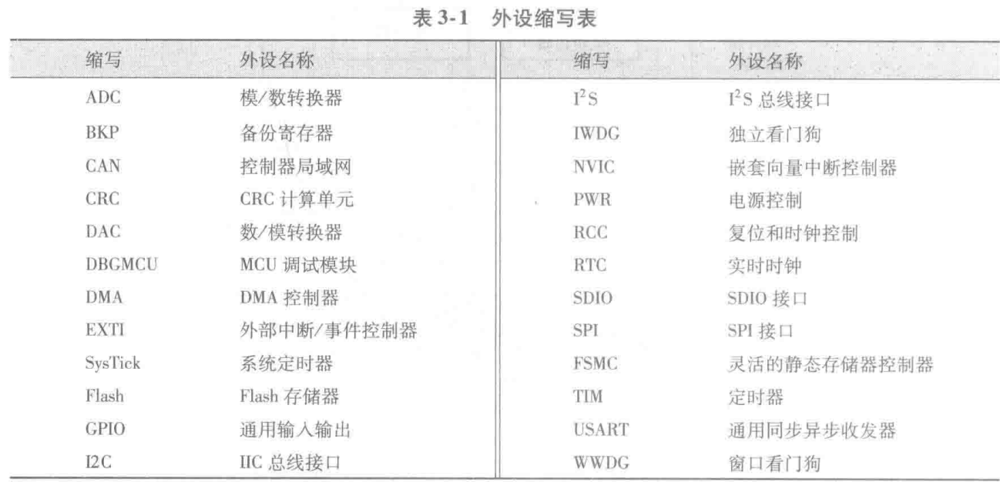

# 嵌入式系统题库
本课程的名称为：
A.嵌入式系统
B.嵌人式系统
C.嵌入式糸统
D.箝人式糸统
## 第一章
### 选择题
1. 以下哪种不属于stm32的能耗优化(C)
A. 运行模式下高效率的动态耗电机制 
B. 待机状态时极低的电能消耗 
C.  低功耗模式下的快速唤醒
D. 电池供电时的低电压供电能力
2. STM32的主时钟源是(D)
A. 内嵌锁相环
B. 32kHz的晶振
C. LQPF100
D. 8MHz RC 振荡电路
3. STM32F10x系列单片机不包括(B)
A. 基本型系列 B.低功耗系列 C. 增强型系列 D. 互联型系列
4. 以下不属于嵌⼊式系统特点的是(A)
A. **⽆**实时性要求 B. 体积⼩ C. 硬件资源限制 D. 专⽤性强
### 判断题
1. 人工智能的发展是嵌入式系统发展的产物(√)
2. Cortex - M系列处理器是**针对需要运行实时操作系统来进行控制应用的系统**(x)
3. ARM Cortex - M3 处理器是新一代的32位处理器,是一个高性能、低成本的开发平台(√)
4. STM32 系列单片机是目前最流行的 **Cortex - B** 微控制器。(x)
5. stm32 使用一个主晶振可以驱动整个系统。(√)
6. cortex处理器采用**冯诺依曼架构**(x)
## 第二章
### 选择题
1. 以下外设不属于STM32F103系列单片机的外设的是(A)
A. HDMI B. CAN C. ADC D. SPI
1. STM32F103 的驱动单元中不包括(C)
A. 指令总线 B. 数据总线 C. 控制总线 D. 直接内存访问内存总线
1. STM32F103 的被动单元中不包括(D)
A. 内部 SRAM B. 内部 Flash C.AHB /APB桥 D.AHB 主机接口
1. 以下不是通过总线矩阵与被动单元相连的是(B)
A.Dcode总线 B.Icode总线 C.通用DMA总线 D.System总线
1. 系统时钟源不能由哪个输出(D)
A. HSI B. HSE C. PLL D. LSE
1. stm32中数据字节以小端模式存放在存储器中，意思是(A)
A. 低地址中存放的是字数据的低字节,高地址中存放的是字数据的高字节。
B. 低地址中存放的是字数据的高字节,高地址中存放的是字数据的低字节。
C. 低地址中存放的是字数据的低字节,高地址中存放的是字数据的低字节。
D. 低地址中存放的是字数据的高字节,高地址中存放的是字数据的高字节。
1. STM32通过（A）访问代码区
A. Icode总线和Dcode总线 B. Icode总线和System总线 C. Dcode总线和System总线 D. System总线和DMA总线
1. STM32通过（C）访问数据区
A. Icode总线 B. Dcode总线 C. System总线 D. DMA总线
### 判断题
1. STM32F103中F代表芯片类型为通用快闪。(√)
2. STM32F103中103**代表芯片的存储器容量为64KB**。(x)
3. VDDA 和VSSA 可为ADC 单独提供电源以避免电路板的噪声干扰(√)
4. VDDA 和 VSSA引脚**可以悬空**(×)
5. 为了允许 DMA 访问,AHB 外设通过总线矩阵连接到系统总线。(√)
6. 系统时钟SYSCLK 是供STM32 中绝大部分部件工作的时钟源(√)
7. PLL输出频率最大不得超过**144MHz**。(x)
8. 当需要使用 USB 时,PLL 必须使能(√)
9. 系统复位将**除了备份区域外的所有寄存器复位至它们的初始状态**。(x)
10. flash 存放用户编写的程序,系统存储区存放串口下载程序。(√)
11. 启动之后,CPU 从地址 0x00000000 获取堆栈顶的地址,**并从该地址**开始执行代码。(x)
12. **内部时钟⽐外部晶振要精确**(x)
### 简答题
1. 简述STM32 系列单片机引脚类型和功能
   各引脚按功能可分为**电源、复位、时钟控制、启动配置和输入输出**
   - 电源：整个系统由VDD_x和VSS_x提供稳定的电源供应。
   - 复位: NRST 引脚出现低电平将导致系统复位
   - 时钟控制:为系统提供稳定的高速外部时钟;为RTC 提供稳定的低速外部时钟。
   - 启动配置:配置 STM32的启动模式
   -  输入输出:可用作GPIO或AFIO.
2. stm32时钟源有哪几个？功能分别是什么？
   1. HSI：可直接用作系统时钟,或者经过2分频后作为PLL 的输入。
   2. HSE：可以通过外部直接提供时钟
   3. LSE：为 RTC 或其他功能提供低功耗且精确的时钟源。
   4. LSI：担当一个低功耗时钟源的角色,它可以在停机和待机模式下保持运行状态。
   5. PLL：对HSE或HSI进行倍频
3. stm32支持哪几种复位形式？分别举一个具体的例子
   电源复位（上电掉电复位），系统复位（NRST复位）和备份区域复位（软件设置寄存器复位）。
4. 什么是最小系统?简述STM32F103 最小系统的组成及各部分功能。
   最小系统是指仅包含必需的元器件,仅可运行最基本软件的简化系统。
   典型的最小系统由单片机芯片、供电电路、时钟电路、复位电路、启动配置电路和程序下载电路构成
   功能随便写点得了，跟引脚差不多
## 第三章
### 选择题
1. `PPP_ITConfig`表示(B)
A. 使能或者失能 PPP外设。 
B. 使能或者失能 PPP外设的中断源。 
C.判断 PPP 外设中断发生与否。 
D.清除 PPP 外设中断待处理标志位。
1. 标准库中配置 Cortex-M 核的文件是(D)
A. `system_stm32f10x.c` B. `startup_stm32f10x_hd.c` C. `stm32f10x.h` D. `core_cm3.c`
1. 标准库中STM32系统启动⽂件是(B)
A. `system_stm32f10x.c` B. `startup_stm32f10x_hd.c` C. `stm32f10x.h` D. `core_cm3.c`
1. 标准库中初始化系统时钟的文件是(A)
A. `system_stm32f10x.c` B. `startup_stm32f10x_hd.c` C. `stm32f10x.h` D. `core_cm3.c`
1. 标准库中包含内核时钟和`Systick`计时器的文件是(A)
A. `system_stm32f10x.c` B. `startup_stm32f10x_hd.c` C. `stm32f10x.h` D. `core_cm3.c`
1. 标准库中包含外设寄存器定义的文件是(C)
A. `system_stm32f10x.c` B. `startup_stm32f10x_hd.c` C. `stm32f10x.h` D. `core_cm3.c`
1. 标准库中提供了外设对内核中的嵌套向量中断控制器 NVIC 的访问函数文件是(B)
A. `system_stm32f10x.c` B. `misc.c` C. `stm32f10x.h` D. `core_cm3.c`
### 判断题
1. 设备外设访问层 DPAL 由 **ARM 公司**实现。(x)
2. 核内外设访问层 CPAL 由 ARM 公司实现。(√)
3. 中间件访问层 MWAL 由**芯片厂商**实现(x)
4. 在使用标准库开发时,**需要修改CMSIS层的文件**(x)
### 简答题
1. 从ARM,GPIO,USART,EXTI,NVIC, DMA,PLL,PWM,ADC,DAC中选五个，写出全称和中⽂意思

ARM: Advanced RISC Machines,是⼀家英国公司。主要业务是开发和许可处理器技术，特别是低功耗、⾼性能的 ARM 架构处理器。作为产品，ARM 是⼀种基于 RISC 架构的⾼性能处理器。
GPIO: General Purpose Input/Output,通用输入输出。
USART: Universal Synchronous/Asynchronous Receiver/Transmitter,通用同步/异步收发器。
EXTI: External Interrupt,外部中断/事件控制器。
NVIC: Nested Vectored Interrupt Controller,嵌套向量中断控制器。
DMA: Direct Memory Access,DMA控制器。
PLL: Phase-Locked Loop,锁相环。
PWM: Pulse Width Modulation,脉冲宽度调制。
ADC: Analog-to-Digital Converter,模数转换器。
DAC: Digital-to-Analog Converter,数模转换器。
1. 创建stm32工程时，宏 `USE_STDPERIPH_DRIVER` 与宏 `STM32F10X_MD` 的作用是什么?
`USE_STDPERIPH_DRIVER`表示使用标准外设库;`M32F10X_MD`指定了 CPU 的容量,本例为中等容量的STM32.
1. CMSIS 层包括什么?CMSIS 层的作用是什么?
    1)核内外设访问层 CPAL 
    2)中间件访问层 MWAL 
    3)设备外设访问层 DPAL 
一方面对硬件寄存器层进行统一实现;另一方面又向上层的操作系统及中间件接口层和用户应用层提供接口
## 第四章
### 选择题
1. 使⽤ ADC 模块的时候 GPIO 引脚配置为什么模式(A)
A. 模拟输入 B. 推挽输出 C. 开漏输出 D. 输入浮空
### 判断题
1. 实际应用时, I-O的JTAG 引脚常被置为**浮空**模式(x)
2. GPIO端口被设置为开漏输出时，输出高电平**可以不接上拉电阻**。(x)
3. 使用外部中断线时,端口必须配置成**输入**模式。(x)
4. STM32F10x 单片机的所有功能均是通过读写寄存器实现的(√)
### 简答题
1. 简述stm32的IO口可以设置为哪些模式，分别有什么功能
   GPIO:
   -  输入浮空:即呈现高阻态
   -  输入上拉:即输入高电平
   -  输入下拉:即输入低电平
   -  开漏输出:本身不输出电压,要想输出高电平必须接上拉电阻。
   -  推挽式输出:直接输出高低电平电压。
    AFIO:
    -  复用输入
    -  模拟输入:用于ADC 模拟输入。
    -  推挽式复用输出功能:片内外设的功能
    -  开漏复用输出功能:片内外设的功能
    -  双向复用功能
2. 简述GPIO配置过程
    1. 配置 GPIO 时钟,完成初始化。
    2. 利用初始化结构体配置引脚,包括引脚名称、引脚传输速率、引脚工作模式。
    3. 完成GPIO_Init 的设置。
##  第五章
### 选择题
1. 下列关于EXTI的说法错误的是(B)
A. 每个中断/事件都有独立的触发和屏蔽; B. 检测脉冲宽度低于**APB1**时钟宽度的外部信号。
C. 支持多达19个中断/事件请求; D. 每根中断线都有专用的状态位;
1. 中断入口在哪个文件中可以找到(B)
A. `system_stm32f10x.c` B. `startup_stm32f10x_hd.c` C. `stm32f10x.h` D. `core_cm3.c`
1. 关于中断服务函数描述错误的是(A)
A. 中断服务函数可以**直接调用** B. 中断服务函数不能有返回值 C. 中断服务函数不能有参数 D. 中断服务函数必须在中断向量表中声明
### 判断题
1. 如果在执行一个中断时又被另一个更重要的事件打断,暂停该中断处理过程转去处理这个更重要的事件,处理完毕后**不会再继续处理本中断**(x)
2. 编号为负的中断不能被设置优先级(√)
3. EXTI5 ~ **EXTI10** 共用一个入口函数(x)
4. 在stm32f10x_it.h 文件中添加中断服务函数时函数名必须与后面使用的中断服务程序名称一致,无返回值无参数。(√)
### 简答题
1. 什么是中断?什么是中断优先级?什么是中断嵌套?描述中断处理过程
   1. 中断:单片机执行主程序时,由于某个事件的原因,暂停主程序的执行,调用相应的中断处理程序处理该事件,处理完毕后再自动继续执行主程序的过程。
   2. 中断的优先级：重要的事件可以打断相对不重要的事件的处理,用户可以根据自己的需求对不同的事件即不同的中断源设定重要级别。
   3. 中断嵌套：如果在执行一个中断时又被另一个更重要的事件打断,暂停该中断处理程转去处理这个更重要的事件,处理完毕后再继续处理本中断的过程称为中断的嵌套。
2. stm32常见中断源种类
   中断源分为系统异常和可屏蔽中断，其中可屏蔽中断源包括**外部中断、定时器中断、串口中断、直接内存访问中断**、模/数转换中断、集成电路总线中断、串行外设接口中断等。
3. 简述嵌套向量中断控制器(NVIC)的主要特性
   NVIC 是一个在 Cortex - M3 中内建的中断控制器。中断发生时,自动获得服务例程入口地址并直接调用,无需软件判定中断源,大大缩短了中断延时时间。
4. 简述中断处理过程
   中断处理的整个过程包括中断请求、中断响应、中断服务程序及中断返回4个步骤。
   1. 中断请求
    如果系统中存在多个中断源,处理器要先对当前中断的优先级进行判断,先响应优先级高的中断。当多个中断请求同时到达且抢占优先级相同时,则先处理响应优先级高的中断。
    2. 中断响应
      1. 置位中断优先级有效触发器,即关闭同级和低级中断。
      2. 调用入口地址,断点入栈
      3. 进入中断服务程序。
    3. 执行中断服务程序
    4. 中断返回：中断服务完成后,处理器返回到原来程序断点处继续执行原来程序。
## 第六章
### 选择题
1. 下面选项中关于波特率的定义和单位，正确的是(C)
A. 每秒钟传送的字节数，Byte/s
B. 每秒钟传送的字符数，char/s
C. 每秒钟传送的二进制数的位数，bit/s
D. 每秒钟传送的二进制数的字节数，bit/Byte
1. 在常见的串行异步通信中，数据帧的构成通常为“8位数据位，1位停止位”。以下哪个选项描述了错误的数据帧构成？(D)
A：8位数据位，1位停止位
B：8位数据位，2位停止位
C：9位数据位，1位停止位
D：8位数据位，**无停止位**
### 判断题
1. **串行通信**是数据字节的各位同时传送的通信方式。(×)
2. 串行通信的速度慢,但占用的传输线条数少,适用于远距离的数据传送。(√)
3. 半双工通信中。数据允许向两个方向进行传送，**并且发送数据的过程与接收数据的过程可以同时进行**。(x)
4. 串行**同步**通信因为具有起始位和停止位,所以传输效率较低。(x)
5. 串行同步通信的传输速度较快,可用于点对多点通信。(√)
6. STM32 有3~5个**半双工**的串行异步通信接口 USART。(x)
7. nCTS 为清除发送,若是高电平,则在当前数据传输结束时不进行下一次的数据发送。(√)
8. nRTS 为发送请求,若是**高**电平,表明 USART 准备好接收数据(x)
9. 当需要关闭 USART 或需要进入停机模式之前,为了避免破坏最后一次传输。需要确认传输结束再进行停机,即**并行**发送最后一个数据后,要等待 TC =1, 它表示最后一个数据帧的传输结束。(x)
10.  RS-232最大传输距离可达**1000m**。(x)
11.   TTL 电平通信的传输距离一般在**30m**以内。(x)
12.    USART 双向通信时，**TX**引脚通过采样技术来区别数据和噪声,从而恢复数据。(x)
### 简答题
1. 简述STM32 串行异步通信的工作方式
   1. 数据发送：发送器根据M位的状态发送8位或9位的数据。当发送使能位(TE)被置位时,发送移位寄存器中的数据在 TX 引脚上输出。
   2. 数据接收：在 USART 接收期间,数据的最低有效位首先从 RX 引脚移进。当一个字符被接收时,RXNE 位被置位。
   3. 接收器和发送器的波特率：在 $USARTDIV$ 的整数和小数寄存器中的值应设置成相同的。公式如下:
   $$波特率= \frac{f_{ck}}{16 \times USARTDIV}$$
   式中,$f_{ck}$为给外设的时钟;$USARTDIV$为一个无符号的定位数,这12位的值在 USART_BRR 寄存器中进行设置。
2. 对USART进行配置时，若串口是IO的复用功能，应注意哪些事项?请举例说明。
   1. 使能GPIO端口的时钟。
   2. 使能USART外设的时钟
   3. 使能AFIO时钟
   4. 发送引脚（TX）：通常配置为复用推挽输出模式
   5. 接收引脚（RX）：通常配置为浮空输入模式
## 第七章
### 选择题
定时/计数器时钟不可由下列哪个时钟源提供(D)
A. 内部时钟 B. 外部时钟1 C. 外部时钟2 D.  外部触发输入 (其实是内部触发输入)
### 判断题
1. 单片机中的可编程定时/计数器在运行时**会完全占用CPU资源，导致CPU无法执行其他任务**。(×)
2. 两个基本定时器,可以为数/模转换器(DAC)提供时钟,在芯片内部直接连接到 DAC 并通过触发输出直接驱动 DAC。(√)
3. 基本定时器计数方向可以设置为向上、向下和双向3种计数方向。(x)
4.  定时器⾃动重装载计时器的影⼦寄存器起到数据备份的作⽤(x)
5.  当系统滴答计数器的数值为0时,定时器产生一个可屏蔽的系统中断。(√)
6.  系统滴答定时器可以被用作标准的**递增**计时器(x)
7.  定时器时钟源为外部时钟1或外部时钟2时，属于计数功能。(√)
8.  时基单元是设置定时器/计数器计数时钟的基本单元。(√)
9.  原始的定时器时钟为**2**分频(x)
10. 高级控制定时器使用的是 APB2 总线,基本定时器和通用定时器使用 APB1 总线。(√)
11. 当时钟源为内部时钟时,计数器对内部时钟脉冲进行计数,属于计数功能(x)
### 简答题
1. TIM通用定时器的功能
STM32 通用定时器的基本功能是定时和计数。当可编程定时/计数器的时钟源来自内部系统时钟时,可以完成精密定时;当时钟源来自外部信号时,可完成外部信号计数。
1. 列举STM32F10x系列单片机的定时器种类及其功能
   - 基本定时器
   - 通用定时器
   - 高级控制定时器
   - 窗口看门狗定时器
   - 独立看门狗定时器
   - 系统滴答定时器
  功能：
    - 定时:通过对内部系统时钟计数,可以实现定时功能。
    - 外部事件计数:可计算外部脉冲个数、频率和宽度。
    - 输入捕获:用来计算脉冲频率和宽度,输出比较用来控制一个输出波形,或者指示一段给定的时间已经到时。
    - 单脉冲输出:响应一个激励,并在一个程序延时后,产生一个宽度可被程序控制的脉冲。
    - 正交编码器:可计算编码器的运行情况。
    - 霍尔传感器输入:可用来捕获霍尔信号,主要用在电动机控制上。
    - 输出比较信号死区产生:高级控制定时器(TIM1 和TIM8)能够输出两路互补信号,并且能够管理输出的瞬时关断和接通,这段时间通常被称为死区,用户应该根据连接的输出器件和它们的特性(电平转换的延时、电源开关的延时等)来调整死区时间。
    - 制动信号输入功能:用来完成紧急停止。
1. 简述通用定时器使用流程
   NVIC 设置、TIM 中断配置、定时器中断服务程序。
2. 什么是系统滴答定时器
     系统滴答定时器专门用于实时操作系统,也可以被用作标准的递减计数器。
3. 通用定时器有哪几种计数模式?别描述这几种模式的计数方式。
   有向上计数模式、向下计数模式和中央对齐模式。
   1. 向上计数模式。在向上计数模式中,计数器从0计数到自动加载值,然后重新从0开始计数并且产生一个计数器向上溢出事件,每次计数器溢出时可以产生更新事件。当发生一个更新事件时,所有的寄存器都被更新,硬件同时设置更新标志位。
   2. 向下计数模式。在向下计数模式中,计数器从自动加载值开始向下计数到0,然后从自动装载值重新开始并且产生一个计数器向下溢出事件,每发生一个更新事件时,所有的寄存器都被更新,硬件同时设置更新标志位。
   3. 中央对齐模式(向上/向下计数)。计数器从0开始计数到自动加载值 -1,产生一个计数器向上溢出事件,最后向下计数到1并且产生一个计数器向下溢出事件,最后再从0开始重新计数。
## 第八章
### 选择题
1. DMA 的主要功能是实现以下哪些类型的数据传输？(ABC)
A. 外设与外设之间
B. 外设与存储器之间
C. 存储器与存储器之间
D. CPU与存储器之间
1. 在微控制器中，以下资源哪项不可以作为DMA的源或目标？(D)
A. SRAM
B. Flash
C. APB1外设
D. CPU寄存器
1. 下面关于DMA优先级的说法正确的是：(C)
A. DMA通道的优先级是固定的，无法通过软件编程改变。
B. DMA通道的优先级可以通过软件编程改变，但不能通过硬件设置。
C. DMA通道的优先级可以通过软件编程和硬件设置来改变，如果优先级相等则由硬件决定。
D. DMA通道的优先级可以通过软件编程和硬件设置来改变，如果优先级相等则由软件决定。
1. 以下哪个事件标志不是DMA每个通道的标准事件标志？(A)
A. DMA开始传输
B. DMA半传输
C. DMA传输完成
D. DMA传输出错
### 判断题
1. STM32 最多拥有2个DMA 控制器(√)
2. 总线矩阵有2个主要特征:循环优先调度、**单**层结构和总线挪用。(x)
### 简答题
1. 简述DMA的工作过程
   1. DMA 传送
当发生一个事件后,外设发送一个事件请求信号到DMA 控制器,DMA 控制器根据通道的优先权来处理请求。当DMA 控制器开始访问外设时,DMA 控制器首先向外设发送一个应答信号;外设得到应答信号后立即撤销请求;外设撤销请求后,DMA 控制器同时撤销应答信号。
   1. 仲裁器
仲裁器根据通道的优先级来管理各通道的请求以及启动外设/存储器访问的顺序。
   1. 指针自增
   通过库函数可以设置下一次传输数据的地址。外设和存储器的指针在每次传输后都可以自增。
   2. 中断
传输一半数据后,半传输标志(HTIF)置1,当设置为半传输中断时,将产生中断请求;在数据传输完成后,传输完成标志(TCIF)置1,当设置为传输完成中断时,将产生中断请求。

1.  简述 DMA 使用流程
    1. NVIC 设置
    2. DMA 模式及中断配置
    3. DMA 中断服务。