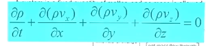
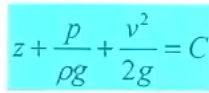
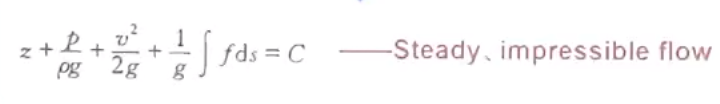
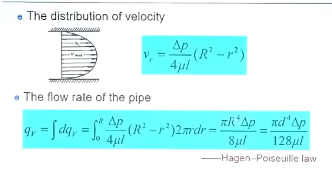

## 第一章
1. 什么叫流体
2. 流体分为哪两种
3. 流体的密度、弹性模量
4. 气体混入液体后会有什么负面影响
   弹性模量减小。会影响流体中的声速。产生空化现象。
5. 饱和蒸气压
   当流体的内部或表面压力变化可能会改变液体沸点。从而产生空化现象。
6. 表面张力：单位N/m
   是表面力，不是指向流体内部，而是流体表面，在表面上形成
7. 粘度
   粘度的本质就是抵抗变形的力。流体在安静的时候不表现粘性，相对运动时才表现其粘性。
8. 牛顿切应力公式
9. 运动粘度和动力粘度 搞清楚单位
   运动粘度：m²/s
   动力粘度：Pa·s
10. 流体随温度变化粘度的变化：气体增大，液体下降。气体粘度是分子热运动引起。温度越高分子热运动越剧烈，所以粘度增加。液体分子间距较小，其粘度产生主要是因为分子间吸引力，温度升高液体膨胀，分子间距离增大，吸引力减小，液体粘度下降。（问答题）
11. 牛顿和非牛顿流体。判断标准：是否符合牛顿切应力公式
12. 如何测量流体粘度：流变仪和毛细计量仪。
13. 所有的流体都可以被压缩。不可压缩的流体认为密度不变。
14. 理想流体没有粘度，与其是否能被压缩无关。
15. 连续体假设：库森数。
## 第二章 流体静力学
1. 三个基本原则
    - 在流体内部收到的各个方向的力相等
    - 在界面上，流体静力的方向是界面的法向。
    - 流体压强可以传递。只能放大力，不能放大功。
2. 绝对压力，表压，真空度
   大气压+表压=绝对压力
   真空度=大气压-绝对压强
3. 测量压力的方法
4. 连通器，博登管，热线仪
5. 1bar = 1e10 5 Pa = 100kPa
   1atm = 101325Pa 
6. 静压力公式
7. 任意形状物体在流体里的受力：竖直方向重力体，水平方向投影面
## 第三章 流体动力学
1. 质量守恒（连续性原理）

后面三个玩意相加不等于0说明$\frac{\partial\rho}{\partial t}\neq 0$，说明是可压缩流体。
2. 能量守恒：伯努利方程。
   
   
   如果不是理想流体就要加损失：沿程阻力损失和局部阻力损失。
3. 动量守恒
4. NS方程
5. 拉格朗日法和欧拉法
   拉格朗日法：跟踪流体粒子，描述粒子运动。
   欧拉法：观察站法。
6. 欧拉法下的加速度公式。
7. 迹线与流线 稳态流动两者重合。
8. 稳态流动与均匀流动
9.  流场可视化 
    - 加一些例子，比如烟雾
    - 偏振光方法
    - 通过流体密度变化产生散射
    - 氢气泡法
10. 流体运动和刚体运动类型的区别
11. 有旋流动
12. 一维二维三维流动
13. 伯努利方程的应用
## 第五章 管道流动
1. 层流、湍流、雷诺数计算：缝隙流动做完之后校验是否属于层流状态。
2. 层流管道的速度分布。哈根泊肃叶。平均流速。切应力分布。压力损失。

3. 湍流：切应力。
4. 水力光滑管和水力粗糙管的定义。
5. 沿程阻力损失的$\lambda$怎么定。尼古拉斯这个图分哪几个阶段。
6. 局部阻力损失。
7. 一个管子流到池子里，流体速度一下降为0，损失为1，如果反过来损失为0.5
8. 总损失：沿程加局部
9. 串联和并联管路：串联流量相等，损失相加；并联两端损失一样，流量叠加。
10. 什么叫液压冲击。怎么改善液压冲击
    - 减慢阀门开启速度
    - 把管子变软。
## 第六章 孔口
1. 孔口流量公式
$$q = C_dA\sqrt{\frac{2\Delta p}{\rho}}$$
2. 自由出流、淹没射流
3. 薄壁孔口和厚壁孔口的分类。
4. 收缩系数定义
5. 厚壁孔口流量系数大于薄壁孔口，为什么？
   - 厚壁孔口收缩区域在厚壁孔内，产生一个负压，增大抽吸量
6. 各种管嘴的出流系数
7. 空化现象（气穴）
   影响：
   1.振动噪声
   2. 腐蚀
   怎么会导致空化现象：
   流体混入气体。
8. 孔口出流很可能考计算题。看书上例题。
## 第七章 缝隙流动
1. 平行平板（zj的公式和书上不太一样）和环形平板。怎么判断正负号
2. 环形平板流动的流量公式
3. 如果装配时平板不平行会带来什么，怎么判定液压卡紧
4. 缝隙流动大题。做完一定要验算雷诺数。