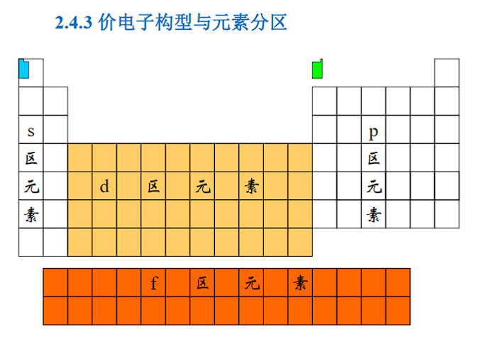
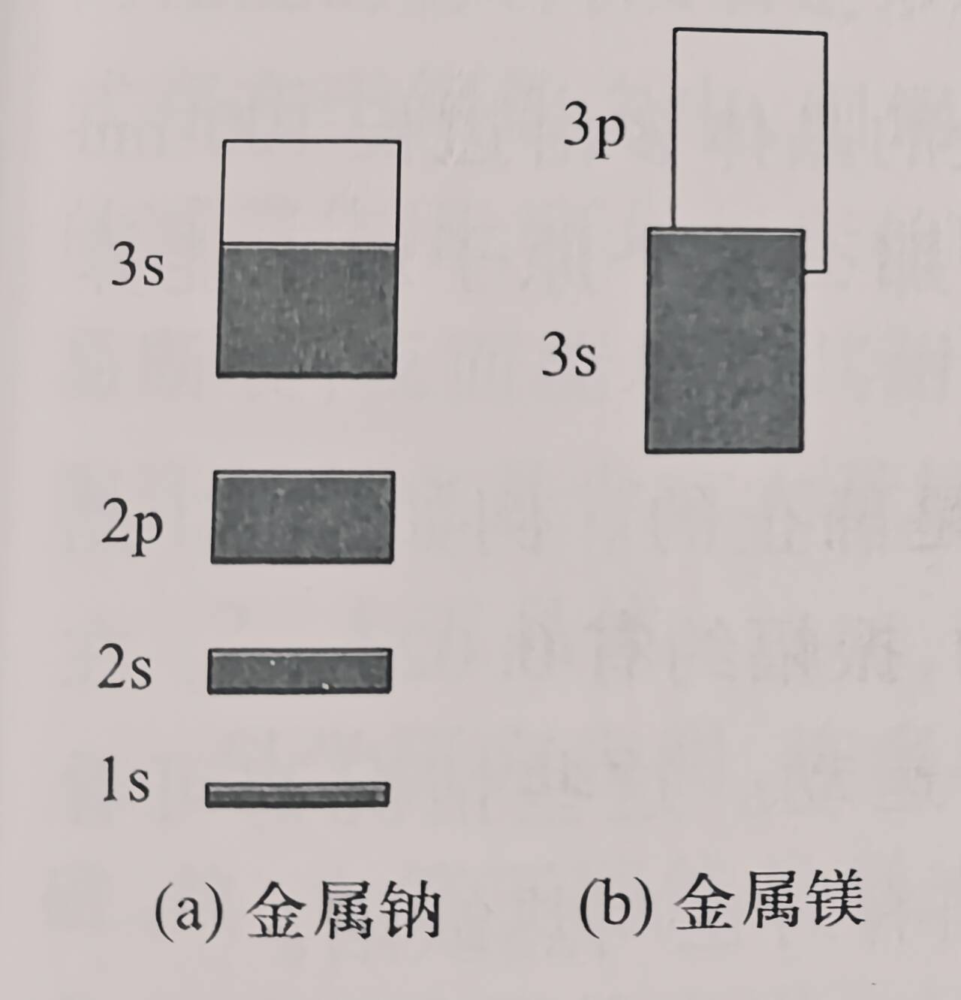
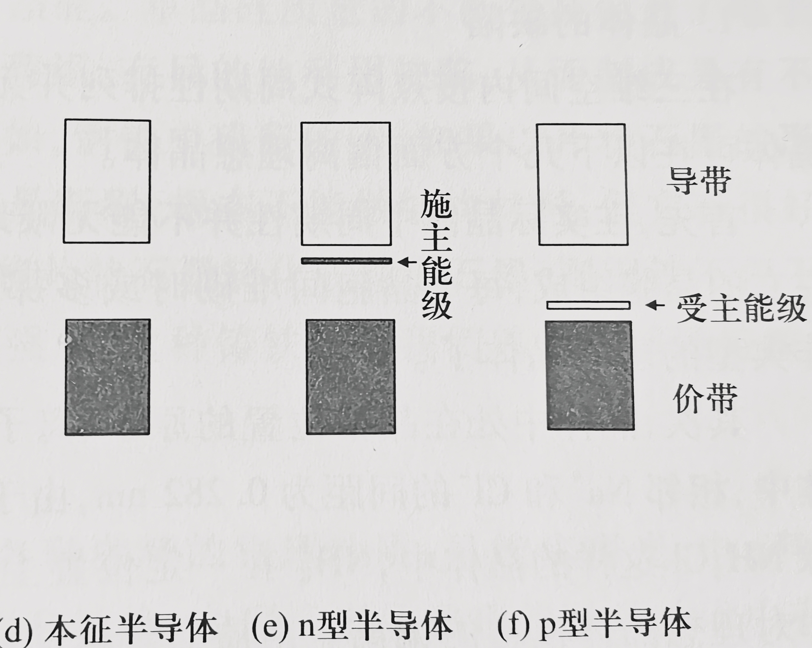

# 工程化学
## 绪论
### 研究层次
- 分子数量级 $10^{-9}m$
- 胶体 $10^{-9}$~$10^{-7}m$
- 粗分散系统 $>10^{-7}m$
### 热力学系统
1. 开放系统：有物质和能量交换
2. 封闭系统：只有能量交换
3. 无物质和能量交换
### 相
系统中任何化学组成均匀，物理和化学性质都相同的，且可用机械方法分离出来的部分。相与相之间存在明显的界面。
### 物质的量
使用物质的量单位$mol$时，要指明物质的基本单元。  
例如：  
$c(KMnO_4)=0.10 mol\cdot L^{-1}$  
$c(\frac{1}{5}KMnO_4)=0.10mol\cdot L^{-1}$  
两种$1L$溶液中所含$KMnO_4$的物质的量$n$是不同的，前者为$0.10mol$，后者为$0.02mol$
### 反应进度
$$\xi=\frac{n_2-n_1}{v}$$
$n_2$ 反应某时刻物质的量
$n_1$ 反应前物质的量  
$v$ 方程式中物质的化学计量数，反应物为负，生成物为正
## 原子结构
### 原子光谱
原子光谱均为不连续光谱，不连续光谱也叫线状或杆状光谱。连续光谱可以简单理解为白光。
### 电磁波能量
$$\lambda = \frac{c}{\nu},\Delta \epsilon = h \nu$$
$\Delta \epsilon$：吸收或释放的能量  
$h$：普朗克常量  
$\nu$：吸收或释放的电磁波频率  
$\lambda$：波长
### Bohr模型
- 氢原子中的电子可处于多种稳定的能量状态(称**定态**，其能量不随时间改变)，其定态能量为：
$$E_n=-2.179\times10^{-18}J/n^2$$
- $n=1$是氢原子能量最低的状态（称基态，其余为激发态，每个原子只有一个基态，多个激发态）
- $n$值越**大**，表示电子离核越远，能量越**高**。当$n=\infty$时，电子不再受核的吸引，即电离。
- 局限性：并未跳出经典力学范畴，电子在固定轨道上绕核运动的模型不符合微观粒子的运动的波粒二象性。
### 波粒二象性
1. 量子化：原子光谱都是不连续光谱，其能量是不连续的，具有微小而分立的能量单位$h\nu$，称量子。
2. 统计性：电子在核外某处出现的概率大小**不随时间而变化**，电子云就是形象地用来描述电子在核外空间出现的概率的一种图示方法。**离核越近，概率密度越大；反之，离核越远，概率密度越小。**
综上所述，微观粒子运动的主要特征是具有波粒二象性，具体体现在**量子化和统计性**上。
### 薛定谔方程量子数
#### 主量子数$n$
|能层|主量子数|
| ---- | ---- |
|K|1|
|L|2|
|M|3|
|N|4|
#### 角量子数$l$和磁量子数$m$
|亚层|角量子数|磁量子数|轨道形状|
| ---- | ---- | ---|---|
|s|0|0|球形|
|p|1|$0,\pm1$|哑铃形|
|d|2|$0,\pm1,\pm2$|四个花瓣形，一个大卡车轮胎形|
|...|...|...|...|
|...|$l$|$0,\pm1,...,\pm l$|...|
#### 自旋磁量子数$m_s$
只能取$\pm\frac{1}{2}$，代表自选的两种状态。
### 电子排布原则
#### 能量最低原理
电子在原子轨道上的排布，必须使整个原子的能量最低。  
1. 主量子数$n$：角量子数相同时，$n $越大，原子轨道的能量越高：$1s< 2s< 3s< 4s$
2. 角量子数$l$：$n$相同时，$l$越大，原子轨道的能量越高，即：$nf>  nd> np>  ns$
3. 当相同能量的简并轨道为全充满或半充满的状态时，能量较低。（Cr和Cu）
#### 泡利不相容原理
同一个原子轨道最多只能容纳两个电子，且自旋相反。
#### 洪特规则
当电子在等价轨道（能量相同轨道）上分布时，将尽可能分占等价轨道，且自旋相同。
#### 外层电子排布式
电子排布=组态
|元素|外层电子排布式|离子|外层电子排布式|
| ---- | ---- | ---|---|
|$_{22}Ti$|$3d^24s^2$|$Ti^{4+}$|$3s^23p^6$|
|$_{24}Cr$|$3d^54s^1$|$Cr^{3+}$|$3s^23p^63d^3$|
|$_{28}Ni$|$3d^84s^2$|$Ni^{2+}$|$3s^23p^63d^8$|
|$_{29}Cu$|$3d^{10}4s^1$|$Cu^{2+}$|$3s^23p^63d^9$|
#### 未成对电子数
在原子或它的结合态中，如果有未成对电子，那么它不仅有较高的化学活性，还一定有磁性。

## 元素周期律
### 原子半径
- 共价半径：同种元素的两个原子以共价单键连接时核间距离的一半。
- 金属半径：把金属晶体看作由球状的金属原子紧密堆积而成的，即认为相邻两个原子彼此互相接触，它们核间距离的一半即为金属半径
- 范德华半径/接触半径：两个原子之间没有形成化学键而只靠分子间作用力互相聚集在一起时，两原子之间距离的一半。  
一般来说，范德华半径>金属半径>共价半径
### 电离能和电子亲和能
常用电离能和电子亲和能来衡量元素金属性和非金属性的强弱。  
在同一周期内，主族元素从左到右，第一电离能逐步增大，表明金属性逐渐减弱；  
副族元素第一电离能变化缓慢，规律性不明显，因此副族元素金属性变换性不大。  
电子亲和能一般为负值，稀有气体等少数元素第一电子亲和能为正值。  
第一电子亲和能记作$A_1$，那么$-A_1$值越大，非金属性越强。
### 电负性
元素的原子在分子中吸引电子能力的相对大小，即对公用电子对的吸引力的相对大小。  
- 电离能和电子亲和能用来讨论离子型化合物形成过程中的能量变化
- 电负性概念则用于讨论共价型化合物的性质，例如对共价键极性的讨论
### 氧化值
同周期主族元素从左到右最高氧化值逐渐升高，并等于元素的最外层电子数，即族序数。  
d区副族元素最高氧化值一般也等于族序数。  
副族元素和p区元素一样，其主要特征是大多有可变氧化值。
### 屏蔽效应
$$Z'=Z-\sigma$$
- $Z'$：有效核电荷
- $Z$：核电荷
- $\sigma$：屏蔽常数  
屏蔽常数由以下几个部分组成：  
1. 轨道分组：(1s),(2s2p),(3s3p),(3d),(4s4p),(4d),(4f),(5s5p)...位于被屏蔽电子右边各组对屏蔽电子的屏蔽常数σ=0，即近似看作对该电子无屏蔽作用；
2. 按上面分组，同组电子间σ=0.35(1s组σ=0.3)；
3. 对(ns)(np)组的电子，(n−1)层的电子对其的屏蔽常数σ=0.85，(n−2)电子层及更内层对其的屏蔽常数σ=1.00；
4. 对nd或nf组的电子，左边各组电子对其的屏蔽常数σ=1.00；  
如计算$Fe$核作用在最外层电子的有效核电荷
$$Z'=26-(10\times 1.00-14\times 0.85-10\times 0.35)=3.75$$
## 化学键和晶体
### 晶体
固体中的原子及其结合态单元在空间中的排布，如果长程短程均有序便称为晶体，长程无序，短程有序称为非晶体。
#### 晶格或点阵
结点按一定规则排列所组成的几何图形
#### 晶胞
晶体三维点阵中存在一个能够完全代表晶格特征的最小单元
#### 单晶体和多晶体
单晶体即一个空间点阵图形贯穿整个晶体的晶体，如金刚石、单晶硅、锗、氯化钠等
### 离子键
判断：一般认为相邻两原子电负性之差大于1.7的为离子键
本质：正负离子间的静电引力  
性质：  
1. 一般来说离子间作用力随离子电荷增加而增大，随离子半径的增大而减小。其中电荷数起主要作用，在电荷数相同的条件下参考半径大小。
2. 离子键的强度越大，相应晶体的熔点、沸点越高，机械强度也越大。
3. 离子键没有方向性和饱和性。
4. 对于同一元素的卤化物、氧化物来说，高价态的倾向于形成共价键为主的分子晶体，熔沸点较低；低价态的倾向于存在离子键为主的离子晶体，熔沸点较高。正离子价态越高，吸引负离子的电子云的能力越强；负离子半径越大，其电子云越容易被正离子吸引。结果减弱了正负离子间作用力。因此有熔点$FeCl_2>FeCl_3,CuCl>CuCl_2$
应用：  
红外光谱仪棱镜：氯化钠、溴化钾  
耐火材料：氧化镁  
建筑材料：碳酸钙  
盐浴剂：氯化钠，氯化钾，氯化钡（这些氯化物的熔融态常被用作高温时的加热介质，它们稳定性好不易受热分解。）
### 共价键
定义：共用电子对形成的化学键。
#### 电子配对理论
如果原子在未化合之前含有未成对电子且自旋方向相反，则可以两两偶合成电子对，每一对电子的偶合形成一个共价键。
1. 共价键结合力大小决定于**原子轨道重叠程度**。重叠程度越大共价键越强。
2. **饱和性**：共价键数目受到未成对电子数的限制
3. **方向性**：相邻原子总是沿着一定方向成键以便满足最大重叠。
#### 杂化轨道理论
如果组合后的一组轨道能量相等，空间分布对称，则称为等性杂化。配位键中，中心原子以空轨道接受配体提供的孤对电子，也是等性杂化。  
其他略。
#### 分子轨道理论
（待完成）
### 金属键和金属
金属键没有方向性和饱和性。  
#### 固体能带理论
众多原子的原子轨道叠加形成结合态轨道时，将形成众多的成键轨道和反键轨道及电子不能出现的禁区。这些轨道和禁区的能级间距都极小，故而几乎是连续的能带。  
价带：价电子（成键的、外层的）所在的满带
满带：被电子填满的能带  
导带：自由电子的能量范围，由许多连续能级组成。导电主力军。  
禁带：不能出现电子的能量区域
  
原子轨道重叠的程度越大，所形成的能带就越宽，甚至造成能带间发生重叠。  
金属钠中，充满电子的那部分3s能带被称为价带，只要轻微的扰动价带中的电子就能进入空着的那部分3s能带（导带）  
金属镁中3s和3p能带发生重叠，充满电子的3s能带（价带）中的电子可以自由地向3p能带（导带）上迁移。  
因此金属钠、镁都是电的良导体。  
总之，金属的一些物理性质均能用能带理论给予较好解释。  
相反，绝缘体中禁带较宽，电子难以跨越。

1. 由于电子的热运动，使得价带中极少数能量极高的电子能越过禁带进入导带中，从而表现出有限的导电能力，这种半导体就叫本征半导体
2. n型半导体：掺入富电子杂质如磷、砷，在禁带范围内形成局部能级（其中含有电子），离导带底部很近，其中的电子可以很容易地激发至导带中，这种能级叫施主能级。
3. p型半导体：掺入缺电子杂质如硼、铟等，在禁带范围内形成能级（其中没有电子），离价带顶部很近，价带的电子很容易迁入，这种能级叫受主能级。