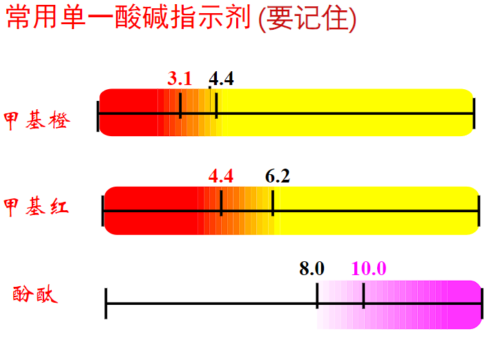
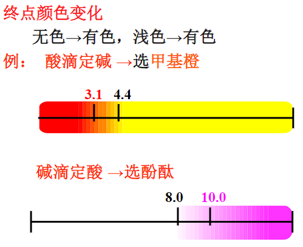
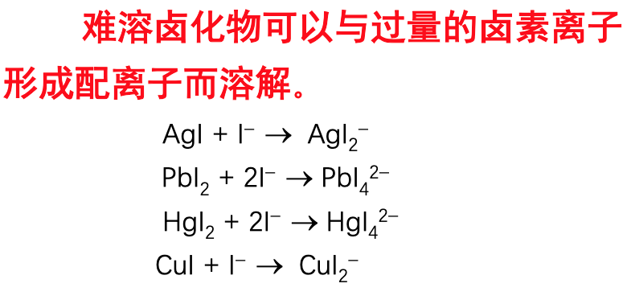

#! https://zhuanlan.zhihu.com/p/694158989
# 工程化学复习
高等教育出版社 陈林根主编的工程化学期末复习  
适合有高中化学选考基础的同学。
## 绪论
### 研究层次
- 分子数量级 $10^{-9}m$
- 胶体 $10^{-9}$~$10^{-7}m$
- 粗分散系统 $>10^{-7}m$
### 热力学系统
1. 开放系统：有物质和能量交换
2. 封闭系统：只有能量交换
3. 孤立系统：无物质和能量交换
### 相
系统中任何化学组成均匀，物理和化学性质都相同的，且可用机械方法分离出来的部分。相与相之间存在明显的界面。
### 物质的量
使用物质的量单位$mol$时，要指明物质的基本单元。  
例如：  
$c(KMnO_4)=0.10 mol\cdot L^{-1}$  
$c(\frac{1}{5}KMnO_4)=0.10mol\cdot L^{-1}$  
两种$1L$溶液中所含$KMnO_4$的物质的量$n$是不同的，前者为$0.10mol$，后者为$0.02mol$
### 反应进度
$$\xi=\frac{n_2-n_1}{\nu}$$
$n_2$ 反应某时刻物质的量
$n_1$ 反应前物质的量  
$\nu$ 方程式中物质的化学计量数，反应物为负，生成物为正
## 原子结构
### *原子光谱
原子光谱均为不连续光谱，不连续光谱也叫线状或杆状光谱。连续光谱可以简单理解为白光。
### 电磁波能量
$$\lambda = \frac{c}{\nu},\Delta \epsilon = h \nu$$
$\Delta \epsilon$：吸收或释放的能量  
$h$：普朗克常量  
$\nu$：吸收或释放的电磁波频率  
$\lambda$：波长
### Bohr模型
- 氢原子中的电子可处于多种稳定的能量状态(称**定态**，其能量不随时间改变)，其定态能量为：
$$E_n=-2.179\times10^{-18}J/n^2$$
- $n=1$是氢原子能量最低的状态（称基态，其余为激发态，每个原子只有一个基态，多个激发态）
- $n$值越**大**，表示电子离核越远，能量越**高**。当$n=\infty$时，电子不再受核的吸引，即电离。
- 局限性：并未跳出经典力学范畴，电子在固定轨道上绕核运动的模型不符合微观粒子的运动的波粒二象性。
### 波粒二象性
1. 量子化：原子光谱都是不连续光谱，其能量是不连续的，具有微小而分立的能量单位$h\nu$，称量子。
2. 统计性：电子在核外某处出现的概率大小**不随时间而变化**，电子云就是形象地用来描述电子在核外空间出现的概率的一种图示方法。**离核越近，概率密度越大；反之，离核越远，概率密度越小。**
综上所述，微观粒子运动的主要特征是具有波粒二象性，具体体现在**量子化和统计性**上。
### 薛定谔方程量子数
#### 主量子数$n$
|能层|主量子数|
| ---- | ---- |
|K|1|
|L|2|
|M|3|
|N|4|
#### 角量子数$l$和磁量子数$m$
|亚层|角量子数|磁量子数|轨道形状|
| ---- | ---- | ---|---|
|s|0|0|球形|
|p|1|$0,\pm1$|哑铃形|
|d|2|$0,\pm1,\pm2$|四个花瓣形，一个大卡车轮胎形|
|...|...|...|...|
|...|$l$|$0,\pm1,...,\pm l$|...|
#### 自旋磁量子数$m_s$
只能取$\pm\frac{1}{2}$，代表自旋的两种状态。
### 电子排布原则
#### 能量最低原理
电子在原子轨道上的排布，必须使整个原子的能量最低。  
1. 主量子数$n$：角量子数相同时，$n $越大，原子轨道的能量越高：$1s< 2s< 3s< 4s$
2. 角量子数$l$：$n$相同时，$l$越大，原子轨道的能量越高，即：$nf>  nd> np>  ns$
3. 当相同能量的简并轨道为全充满或半充满的状态时，能量较低。（Cr和Cu）
#### 泡利不相容原理
同一个原子轨道最多只能容纳两个电子，且自旋相反。
#### 洪特规则
当电子在等价轨道（能量相同轨道）上分布时，将尽可能分占等价轨道，且自旋相同。
#### 外层电子排布式
电子排布=组态
|元素|外层电子排布式|离子|外层电子排布式|
| ---- | ---- | ---|---|
|$_{22}Ti$|$3d^24s^2$|$Ti^{4+}$|$3s^23p^6$|
|$_{24}Cr$|$3d^54s^1$|$Cr^{3+}$|$3s^23p^63d^3$|
|$_{28}Ni$|$3d^84s^2$|$Ni^{2+}$|$3s^23p^63d^8$|
|$_{29}Cu$|$3d^{10}4s^1$|$Cu^{2+}$|$3s^23p^63d^9$|
#### 未成对电子数
在原子或它的结合态中，如果有未成对电子，那么它不仅有较高的化学活性，还一定有磁性。

## 元素周期律
### 原子半径
- 共价半径：同种元素的两个原子以共价单键连接时核间距离的一半。
- 金属半径：把金属晶体看作由球状的金属原子紧密堆积而成的，即认为相邻两个原子彼此互相接触，它们核间距离的一半即为金属半径
- 范德华半径/接触半径：两个原子之间没有形成化学键而只靠分子间作用力互相聚集在一起时，两原子之间距离的一半。  
一般来说，范德华半径>金属半径>共价半径
### 电离能和电子亲和能
常用电离能和电子亲和能来衡量元素金属性和非金属性的强弱。  
在同一周期内，主族元素从左到右，第一电离能逐步增大，表明金属性逐渐减弱；  
副族元素第一电离能变化缓慢，规律性不明显，因此副族元素金属性变换性不大。  
电子亲和能一般为负值，稀有气体等少数元素第一电子亲和能为正值。  
第一电子亲和能记作$A_1$，那么$-A_1$值越大，非金属性越强。
### 电负性
元素的原子在分子中吸引电子能力的相对大小，即对公用电子对的吸引力的相对大小。  
- 电离能和电子亲和能用来讨论离子型化合物形成过程中的能量变化
- 电负性概念则用于讨论共价型化合物的性质，例如对共价键极性的讨论
### 氧化值
同周期主族元素从左到右最高氧化值逐渐升高，并等于元素的最外层电子数，即族序数。  
d区副族元素最高氧化值一般也等于族序数。  
副族元素和p区元素一样，其主要特征是大多有可变氧化值。
### 屏蔽效应
$$Z'=Z-\sigma$$
- $Z'$：有效核电荷
- $Z$：核电荷
- $\sigma$：屏蔽常数  
屏蔽常数由以下几个部分组成：  
1. 轨道分组：(1s),(2s2p),(3s3p),(3d),(4s4p),(4d),(4f),(5s5p)...位于被屏蔽电子右边各组对屏蔽电子的屏蔽常数σ=0，即近似看作对该电子无屏蔽作用；
2. 按上面分组，同组电子间σ=0.35(1s组σ=0.3)；
3. 对(ns)(np)组的电子，(n−1)层的电子对其的屏蔽常数σ=0.85，(n−2)电子层及更内层对其的屏蔽常数σ=1.00；
4. 对nd或nf组的电子，左边各组电子对其的屏蔽常数σ=1.00；  
如计算$Fe$核作用在最外层电子的有效核电荷
$$Z'=26-(10\times 1.00-14\times 0.85-10\times 0.35)=3.75$$
## 化学键和晶体
### 晶体
固体中的原子及其结合态单元在空间中的排布，如果长程短程均有序便称为晶体，长程无序，短程有序称为非晶体。
#### 晶格或点阵
结点按一定规则排列所组成的几何图形
#### 晶胞
晶体三维点阵中存在一个能够完全代表晶格特征的最小单元
#### 单晶体和多晶体
单晶体即一个空间点阵图形贯穿整个晶体的晶体，如金刚石、单晶硅、锗、氯化钠等
### 离子键
判断：一般认为相邻两原子电负性之差大于1.7的为离子键
本质：正负离子间的静电引力  
性质：  
1. 一般来说离子间作用力随离子电荷增加而增大，随离子半径的增大而减小。其中电荷数起主要作用，在电荷数相同的条件下参考半径大小。
2. 离子键的强度越大，相应晶体的熔点、沸点越高，机械强度也越大。
3. 离子键没有方向性和饱和性。
4. 对于同一元素的卤化物、氧化物来说，高价态的倾向于形成共价键为主的分子晶体，熔沸点较低；低价态的倾向于存在离子键为主的离子晶体，熔沸点较高。正离子价态越高，吸引负离子的电子云的能力越强；负离子半径越大，其电子云越容易被正离子吸引。结果减弱了正负离子间作用力。因此有熔点$FeCl_2>FeCl_3,CuCl>CuCl_2$  
#### 离子极化作用
1. 正离子的极化能力：极化能力随电荷数增大和半径的减小而增大
2. 负离子的变形性：变形性随电荷数和半径的增大而增大 
3. 附加极化作用：Ag+等18、18+2电子构型离子，不但有较强的极化能力，且本身受负离子的极化也有较大的变形性，由此产生额外极化作用。
4. 示例：  
$NaCl,MgCl_2,AlCl_3,SiCl_4,PCl_5$  
从左到右，阳离子电荷量增大、半径减小，阳离子极化能力增大；阴离子均为$Cl^−$，变形性不变，氯化物的极化作用增大，共价成分增大，熔、沸点减小。  
$NaF,NaCl,NaBr,NaI$  
从左到右，阴离子半径增大，阴离子变形性增大；阳离子均为$Na^+$，极化能力不变，卤化钠的极化作用增大，共价成分增大，熔、沸点减小。
#### 应用
红外光谱仪棱镜：氯化钠、溴化钾  
耐火材料：氧化镁  
建筑材料：碳酸钙  
盐浴剂：氯化钠，氯化钾，氯化钡（这些氯化物的熔融态常被用作高温时的加热介质，它们稳定性好不易受热分解。）
### 共价键
定义：共用电子对形成的化学键。
#### 电子配对理论
如果原子在未化合之前含有未成对电子且自旋方向相反，则可以两两偶合成电子对，每一对电子的偶合形成一个共价键。
1. 共价键结合力大小决定于**原子轨道重叠程度**。重叠程度越大共价键越强。
2. **饱和性**：共价键数目受到未成对电子数的限制
3. **方向性**：相邻原子总是沿着一定方向成键以便满足最大重叠。
#### 杂化轨道理论
如果组合后的一组轨道能量相等，空间分布对称，则称为等性杂化。配位键中，中心原子以空轨道接受配体提供的孤对电子，也是等性杂化。  
其他略。
#### 分子轨道理论

### 金属键和金属晶体
金属键没有方向性和饱和性。  
#### 固体能带理论
众多原子的原子轨道叠加形成结合态轨道时，将形成众多的成键轨道和反键轨道及电子不能出现的禁区。这些轨道和禁区的能级间距都极小，故而几乎是连续的能带。  
价带：价电子（成键的、外层的）所在的满带
满带：被电子填满的能带  
导带：自由电子的能量范围，由许多连续能级组成。导电主力军。  
禁带：不能出现电子的能量区域
  
原子轨道重叠的程度越大，所形成的能带就越宽，甚至造成能带间发生重叠。  
金属钠中，充满电子的那部分3s能带被称为价带，只要轻微的扰动价带中的电子就能进入空着的那部分3s能带（导带）  
金属镁中3s和3p能带发生重叠，充满电子的3s能带（价带）中的电子可以自由地向3p能带（导带）上迁移。  
因此金属钠、镁都是电的良导体。  
总之，金属的一些物理性质均能用能带理论给予较好解释。  
相反，绝缘体中禁带较宽，电子难以跨越。

1. 由于电子的热运动，使得价带中极少数能量极高的电子能越过禁带进入导带中，从而表现出有限的导电能力，这种半导体就叫**本征半导体**
2. n型半导体：掺入富电子杂质如磷、砷，在禁带范围内形成局部能级（其中含有电子），离导带底部很近，其中的电子可以很容易地激发至导带中，这种能级叫**施主能级**。
3. p型半导体：掺入缺电子杂质如硼、铟等，在禁带范围内形成能级（其中没有电子），离价带顶部很近，价带的电子很容易迁入，这种能级叫**受主能级**。
### 金属材料
#### 金属固溶体  
在液态时是均匀的液相，凝固也保持均匀性。
当溶质元素与溶剂元素在原子半径、电负性以及晶格类型等方面都相近时易形成**置换固溶体**。  
当溶质原子半径较小时，则容易形成**间隙固溶体**。

当溶剂元素溶入溶质元素后，能使原来的晶格发生畸变，它们将阻碍外力对材料引起的形变，**因而使固溶体的强度提高，同时其延展性和导电性将会下降。**固溶体的这种现象称为**固溶强化**。

#### 金属间化合物
硼化物、碳化物和氮化物具有某些独特的性能，如高强度、高熔点、高稳定性等。  
**一般来说d电子数越少，则金属元素与硼、碳、氮结合强度就越大，稳定性、硬度、熔点也越大。**  
应用：红硬性，掺入碳后高温下仍能保持硬度。
## 分子间作用力
### 氢键
氢键具有方向性和饱和性。
#### 分子间氢键
相当于形成大分子，使分子间结合力增强，使化合物的熔点、沸点、熔化热、汽化热、粘度等增大，蒸汽压则减小。例如$HF$的熔、沸点比$HCl$高，$H_2O$的熔、沸点比$H_2S$高，分子间氢键还是分子缔合的主要原因。
#### 分子内氢键
使分子内部结合更紧密，分子变形性下降，分子间作用力下降，一般使化合物的熔点、沸点、熔化热、汽化热、升华热等减小。
#### 溶液中的氢键
- 溶质与溶剂形成H键：溶解度上升
- 溶质形成分子间氢键：形成大分子，极性溶剂中溶解度下降，非极性溶剂中溶解度上升
- 溶质形成分子内氢键：分子紧缩变小，极性下降，因此极性溶剂中溶解度下降，非极性溶剂中溶解度上升
- 液体分子形成氢键：分子缔合，密度变大。
### 范德华力
#### 色散力
分子间普遍存在的作用力，大部分分子中分子间作用力以色散力为主。  
色散力随相对分子质量增大而增大。
#### 诱导力
极性分子和非极性分子之间、极性分子和极性分子之间存在诱导力。
#### 取向力
极性分子之间的力。
## 配合物
中心离子用能量相近的空轨道杂化，以杂化的空轨道与配体形成配位键。配位离子的空间结构、配位数、稳定性等，主要决定于杂化轨道的数目和杂化类型。  
*整个内界部分若带有电荷则称为配离子。
### 酸碱电子理论
- Lewis酸：电子对接受体
- Lewis碱：电子对给予体
### 单齿配体

### 多齿配体

### 螯合物 
多齿配体（螯合剂）与中心原子形成具有环状结构的配合物称为螯合物。螯合比：螯合物中，中心原子与螯合剂数目之比。 
#### 螯合效应
由于螯合效应，螯合物的稳定性很强。  
无环的$[Ni(NH_3)_6]^{2+}$稳定性小于$[Ni(en)_3]^{2+}$；
#### 多齿配体的条件
多基配体中两个或两个以上能给出孤电子对的原子应**间隔两个或三个其它原子**。因为这样才有可能形成稳定的五原子环或六原子环。   
例如联氨分子H2N—NH2，虽然有两个配位氮原子，但中间没有间隔其他原子，它与金属离子配位后只能形成一个三原子环，**环的张力很大故不能形成螯合物。**
### 配位数
$$[Co(NH_3)_3Cl_3]^{2+}$$
$Co^{3+}$配位数为6

### 配位化合物的命名
1. 先命名阴离子，后命名阳离子。如果是简单阴离子，命名“某化某”，如果是复杂阴离子，命名“某酸某”。
2. 在内界中，先命名配体，再命名配位中心，两者用“合”连接
3. 配体中先命名负离子再命名中性分子
4. 负离子命名顺序是先简单离子，再复杂离子，最后是有机酸根离子。氢氧根称羟基，亚硝酸根称硝基。中性分子的命名次序也是先简单、常见再复杂，先无机后有机。
5. 每种配体前用数字一、二、三等表示配位数目，并以中心点"$\cdot$"把不同配体分开。
6. 当中心离子可变价时，在其后加括号，用罗马数字I,II,...表明中心离子化合价。

## 高分子化合物
相对分子质量高达几千甚至几百万，是混合物。  
第一个合成高分子是酚醛树脂。   
### 分类
三大合成材料：塑料、橡胶、纤维    
- 碳链高分子化合物：主链中均是C-C键
- 杂链高分子化合物：主链中有C和其他元素
- 元素有机高分子化合物：主链中没有C
### 相关术语 

以有机小分子为单体，通过加成聚合或缩合聚合等反应合成高分子。  
由一种单体进行的加成聚合反应成为均聚反应，两种或两种以上单体进行的加聚反应成为共聚反应。
### 尼龙-66
  
尼龙-66的聚合度为2n，聚合度为总链节数  
其链节为
在聚酰胺化学式中，名称后的第一个数字“6”指二元胺的碳原子数，第二个数字“6”指二元酸的碳原子数。
### 常见高分子化合物及其单体

### 各种状态

玻璃化温度$T_g$：玻璃态向高弹态转变的温度  
黏流化温度$T_f$：高弹态向粘流态转变的温度  
分解温度$T_D$：成型加工的上限温度。  
### 各个参数的应用
1. 把$T_g$大于室温的高分子化合物称为塑料，小于室温的称为橡胶。
2. 塑料要求保持固定形状所以$T_g$越高越好，橡胶要求高度弹性所以$T_g$越低越好。可以采取改变聚合条件、加入增塑剂或用定向聚合等方式改变$T_g$。例如普通聚苯乙烯的$T_g$为$80^\circ C$而定向聚苯乙烯由于分子排列整齐，其$T_g$可达$240^\circ C$
3. 黏流化温度$T_f$是高分子化合物成型加工的下限温度，分解温度$T_d$是高分子化合物成型加工的上限温度。
4. 对高分子材料的加工来说$T_f$越低越好，对耐热性来说$T_f越高越好。
5. $T_g$和$T_f$差值越大，应用温度范围越宽，橡胶的耐热、耐寒性也越好。
### 常见高分子化合物的名称

## 胶体
胶体体系是一种分散系。分散系由分散相和分散介质两部分组成。被分散的物质称为分散相，容纳分散相的物质称为分散介质。  
分散相直径在1～100 nm范围内称为胶体分散体系。
### 生活中的胶体
云雾气溶胶、细胞液、血液、淋巴液  
血液的凝固、血球的沉降、水肿的产生、结石的形成；铁铝锰等胶体沉积矿床之中；水泥。
### 双电层结构
稀$AgNO_3$溶液与过量的稀$KI$溶液反应制备$AgI$胶体，过量的$KI$起稳定剂的作用。

通常$m\approx 10^3$  
胶团的结构表达式
$$\{[AgI]_mnI^-\cdot(n-x)K^+\}^{x-}\cdot yK^+$$

吸附层和扩散层构成双电层。
### 溶胶
分散介质为业态，分散相为固、气或与分散介质互不溶（溶解度很小）的液态物质，则此类胶体系统成为液溶胶，简称溶胶。  
溶胶是多相、高分散体系，具有很大的表面能，因此**具有自发聚集成较大颗粒的趋势，是热力学不稳定体系。**  
溶胶相对稳定的主要原因是布朗运动、胶粒带电及溶剂化作用。溶胶颗粒小，分散程度大，布朗运动剧烈，可以克服重力作用而不易沉降。带有相同种类电荷的胶粒之间，存在静电斥力，这种斥力阻止了胶粒的聚结。因此溶胶又是**动力学稳定体系**。在胶团的双电层结构中，离子都是水化离子，胶粒在这种水化层的保护下难以碰撞而聚沉。
#### 溶胶聚沉
1. 加电解质 反离子进入吸附层 水化层和扩散层变薄，但是加过量后吸附层大量吸附反离子使胶粒又带电
2. 加热 不利于胶核吸附离子，不利于形成水化层
3. 加带相反电荷的溶胶 电荷中和。明矾净水就是利用明矾水解生成带正电$Al(OH)_3$带正电溶胶与水中带负电荷的胶体污物聚沉。

## *团簇
团簇是指由几个至上千个原子、分子或其结合态粒子聚集而形成的相对稳定的**介观聚集体**。
，空间尺度在纳米（$10^{-9}$）左右，团簇是许多纳米材料的基础。
- $C_{60}$的丰度最高
- 碳纳米管密度低但是强度大，韧性和弹性好
- “黑金”石墨烯：触摸屏
## 非整比化合物
原因：晶体缺陷。
- 碳化物、氮化物在钢材中能有效地提高钢材的硬度；
- 记忆合金$Ti_{50}Ni$、$Ti_{51}Ni$,相转变温度是记忆合金重要指标
## *金属有机化合物
金属镍粉与$CO$反应得到液态$Ni(CO)_4$，在稍高温度下分解便得到纯镍。

### *化学气相沉积

## *自由基
共价键发生均裂形成的具有不成对电子的原子和基团。  
首个被发现和证实的自由基是三苯甲基自由基。
## 固体吸附物
- 相同质量的固体物质，颗粒越小，表面积越大，吸附能力也越大
- 固体吸附剂（如活性炭）有很多微孔；同时在活化过程中能在表面非结晶部分形成一些含氧官能团，使其具备化学吸附能力和良好催化活性，加速表面化学反应。
## 水
### 团簇结构

### 冰

### 水的解离

### 溶液浓度的表示方法

### 溶液浓度之间的关系

## 溶液的四个依数性
### 蒸气压
- 溶液蒸气压低于纯溶剂  
- 氯化钙($CaCl_2$)、五氧化二磷($P_2O_5$)等，常用作干燥剂。这是由于它们的强吸水性使其在空气中易潮解成饱和水溶液，因蒸气压比空气中水蒸气的压力小，从而使空气中的水蒸气不断凝结进入溶液。
$$\Delta p =x_Bp_A^*$$
- 在一定温度下，稀溶液的蒸气压降低值等于该稀溶液中难挥发溶质的物质的量分数(摩尔分数)与纯溶剂蒸气压的乘积，而与溶质的性质无关
### 凝固点
- 凝固点在图中的位置：固态与液态蒸气压相同的点  
难挥发物质溶液的凝固点总是低于纯溶剂的凝固点
$$\Delta T_f = T_f^*-T_f=K_fb_B$$
- 在稀溶液中，凝固点下降为凝固点下降常数（取决于溶剂）与质量摩尔浓度的乘积。
### 沸点
- 当液体的蒸气压等于外界压力时，液体就沸腾，这时的温度称为该压力下的沸点。水中加入难挥发性溶质后，沸点升高。
$$\Delta T_b = T_b^*-T_b = K_bb_B$$
- 在稀溶液中，沸点升高为沸点升高常数（取决于溶剂）与质量摩尔浓度的乘积。
### 渗透压
$$\Pi = cRT$$
或
$$\Pi V = nRT$$
注：$0^\circ C = 273.15K,R=8.314Pa\cdot m^{-3}\cdot mol^{-1}\cdot K^{-1}$
- 临床上使用0. 90%的生理盐水和5%葡萄糖溶液等等渗溶液
## 表面活性物质 
### 表面张力
- 加入无机盐，不挥发的酸、碱等表面张力增大
- 加入有机物，由于碳链的疏水性，降低了水溶液的表面张力。
### 性质
- 表面活性物质显著降低水溶液表面张力的物质。  
- 一般是线形分子，分子中同时含亲水的极性基团和憎水的非极性基团
- 增溶作用、润湿作用、发泡作用、乳化作用

## 理想气体
1. 分子不占体积
2. 分子之间没有相互作用力，系统势能可忽略
### 理想气体状态方程
$$pV=nRT$$
### 总压与分压
$$p=\displaystyle\sum_Bp_B=\sum_Bn_B\frac{RT}{V}$$
### 总体积与分体积
$$p=\displaystyle\sum_BV_B=\sum_Bn_B\frac{RT}{p}$$
### 工业用气
钢瓶中的高压气体不能用理想气体状态方程计算，需用更复杂的实际气体状态方程计算。钢瓶用无缝合金钢  或碳素钢制成。  
*爆炸极限是体积分数
### 湿度
#### 绝对湿度
单位体积中水蒸气的质量
$$m=nM=\frac{pVM}{RT}$$
#### 相对湿度
大气中水蒸气的分压和同温度下水的饱和蒸气压比值
$$相对湿度=\frac{p(H_2O)}{p^*(H_2O)}\times 100\%$$
### *等离子体
- 在高温、激光或电磁场等作用下，气体分子电离产生由大量带电粒子，它们和中性粒子所组成的系统，在整体上保持电中性，总的正、负离子电荷数相等，称为等离子体。  
- **并非任何电离气体都是等离子体，只有当电离度大到某一程度，带电粒子密度达到所产生的空间电荷足以限制其自身运动时，才能成为等离子体。**
- 等离子体温度分别用电子温度和离子温度表示，两者相等，称为**热**等离子体；不相等则称为**冷**等离子体。等离子体也分为低温等离子体（$10^3°C$~ $10^4°C$数量级和高温等离子体（如$10^7°C$数量级），应用较多的是低温等离子体。
- 应用：霓虹灯，制备复合材料，切削金属，表面喷涂，磁流体发电，军事用途，可控核聚变。
## 热力学
### 热力学能变化$\Delta U$
$$\Delta U = Q + W$$
### 恒容反应热
由$W=p\Delta V=0$
$$Q_V = \Delta U = U_2-U_1$$
### 恒压反应热
$$\Delta U = Q + W = Q_p-p\Delta V$$
$$Q_p = \Delta U+p\Delta V=\Delta U+(p_2V_2-p_1V_1)=(U_2+p_2V_2)-(U_1+p_1V_1)$$
热力学中定义焓
$$H=U+pV$$
### $\Delta U$和$\Delta H$的关系
#### 无气体等温等压
$$Q_P=\Delta H\\ \Delta U = Q+W = Q_p-p\Delta V$$
得
$$\Delta U = \Delta H-p\Delta V$$
反应物和生成物均为固态和液态时： 
$$\Delta H \approx \Delta U$$
### 有气体等温等压
$$\Delta H = \Delta U + \Delta n(g)RT$$
即使在有气体参加的反应中，$p∆V$与$∆H$相比也只是一个较小的值。一般情况下，可认为$∆H$在数值上近似等于$∆U$。
### 摩尔反应焓变
单位反应进度时的反应焓变
$$\Delta_rH_m = \frac{\Delta H}{\xi}$$
注：因反应进度与计量方程式有关，所以摩尔反应焓变的数值与反应方程式有关，**必须指明具体的反应方程式。**
### 标准摩尔反应焓变
标准状态下的摩尔反应焓变，用$\Delta_rH_m^{\theta}$表示
温度T时，把处于压力100 kPa下的物质状态称为标准状态
### 标准摩尔生成焓
- 定义：在温度T及标准态下，由参考状态$\beta$的单质生成物质B的反应的标准摩尔反应焓变即为物质B在温度T时的标准摩尔生成焓，用$\Delta_fH_m^{\theta}(B,\beta,T)$表示。
- 参考状态：一般指在温度T及标准态下单质的最稳定状态。在书写反应方程式时，应使物质B为唯一生成物，且物质B的化学计量数$ν_B=1$
- 一般物体无相变时温度改变对其标准摩尔生成焓影响不大。
### 标准摩尔反应焓变计算
$$\Delta_rH_m^{\theta}=\sum\nu_生\Delta_fH_m^\theta(生成物)-\sum(-\nu_反)\Delta_fH_m^\theta(反应物)$$
$\nu$ 为方程式中物质的化学计量数，反应物为负，生成物为正
### 标准摩尔燃烧焓
- 定义：在温度T及标准态下物质B完全燃烧(或完全氧化)的化学反应当反应进度为1mol时的标准摩尔反应焓变为物质B的标准摩尔燃烧焓，简称燃烧焓，用符号$\Delta_cH_m^{\theta}$表示。在书写燃烧反应方程式时，应使物质B的化学计量数$ν_B=1$。
- 规定：完全燃烧(或完全氧化)是指反应物中的$C$变为$CO_2(g)$，$H$变为$H_2O(l)$，$S$变为$SO_2(g)$，$N$变为$N_2(g)$，$Cl_2(g)$变为$HCl(aq)$；显然这些燃烧产物的燃烧焓为零。
### 标准摩尔熵
规定在标准状态下1mol物质的熵称为标准摩尔熵$S_m^{\theta}(B,T)$
- $S^*(0K)=0$，其中*表示完美理想晶体。
- 在298.15K，稳定单质的标准摩尔熵$S_m^{\theta}(B)≠0$；
- 对水合离子，其标准摩尔熵是以$S_m^{\theta}(H^+,aq)=0$为基准求得的相对值.
### 标准摩尔熵变
与标准摩尔焓变定义类似，用$\Delta_rS^{\theta}_m$表示
$$\Delta_rS^{\theta}_m=\displaystyle\sum_B\nu_bS_m^{\theta}(B)$$
### 吉布斯函数变
$$\Delta_r G=\Delta _rH-T\Delta_rS$$
$\Delta_r G<0$自发进行  
物理意义：  
$\Delta G$：系统势能变化  
$T\Delta S$：系统动能变化
### 标准摩尔生成吉布斯函数变$\Delta_fG_m^{\theta}$与标准摩尔吉布斯函数变$\Delta_rG_m^{\theta}$
在温度T及标准状态下，由指定单质的元素产生1mol物质B时反应的标准摩尔吉布斯函数变，称为该物质B的标准摩尔生成吉布斯函数变$\Delta_fG_m^{\theta}$
$$\Delta_rG_m^{\theta}=\displaystyle\sum_B\nu_b\Delta_fG_m^{\theta}(B)$$
在标准状态下所有指定单质的$\Delta_fG_m^{\theta}=0$
### 标准平衡常数

和吉布斯自由能的关系
$$\Delta_r G_m = \Delta_r G_m^{\theta}+RT\ln Q$$
容易看出平衡时
$$\Delta_r G_m = 0,Q=K^{\theta}$$
所以
$$\ln K^\theta=-\frac{-\Delta_rG_m^\theta(T)}{RT}$$
也即
$$\ln K^\theta=-\frac{\Delta_rH_m^\theta}{RT}+\frac{\Delta_rS_m^\theta}{R}$$
对同一反应，容易推出
$$\ln \frac{K_1^\theta(T_1)}{K_2^{\theta}(T_2)}=-\frac{\Delta_rH_m^\theta}{R}(\frac{1}{T_1}-\frac{1}{T_2})$$
## 动力学
### 化学反应速率
$$v=\frac{\xi}{V}\\$$

### 过渡态理论

### 阿伦尼乌斯方程
$$\ln k = -\frac{E_a}{RT}+\ln A$$

## 电化学
$$-\Delta G = nFE$$
n为方程式中电子转移地数目。
  
F为法拉第常数，值为$96500C\cdot mol^{-1}$  
氧化态物质：氧化数高的物质。如：$Cu^{2+}、Zn^{2+}$  
还原态物质：氧化数低的物质。如：$Cu、Zn$
### 氧化还原电对
同一种元素不同价态的组合形式，称为氧化还原电对。  
氧化还原电对: [氧化态(Ox)]／[还原态(Red)]

### 原电池图示

### 标准电极电势

规定标准氢电极的电极电势为零
$$E^\theta（H^＋/H2）= 0.0000V$$
标准氢电极准确度高  
甘汞电极可以写为$(Pt)Hg,Hg_2Cl_2(s)|KCl$

### 标准电极电势测定
标准氢电极与待测电极组成原电池后,测其电池反应的电动势E。
  
电极电势代数值越小，电对的还原态物质还原能力越强，氧化态物质氧化能力越弱；电极电势代数值越大，电对的还原态物质还原能力越弱，氧化态物质氧化能力越强。

### 能斯特方程

  
*$p^{\theta}=100kPa$
## 溶液中的反应

  
红、橙、黄和无色、浅红色、红色

## 沉淀溶解
### 盐效应
在难溶电解质溶液中，加入易溶强电解质而使难溶电解质的溶解度增大的作用称为盐效应。
原因：饱和$BaSO_4$溶液中加入$KNO_3$后溶液中的离子总数骤增,由于$SO_4^{2-}$和Ba^{2+}离子被众多的异号离子($K^+，NO_3^-$)所包围，活动性降低，因而$Ba^{2+}$和$SO_4^{2-}$的有效浓度降低。
### 氧化还原反应使沉淀溶解
有些金属硫化物的$K^{\theta}_{sp}$数值特别小，因而不能用盐酸溶解。如CuS($K^{\theta}_{sp}=1.27×10^{−36}$)需用硝酸,HgS($K^{\theta}_{sp}=6.44×10^{−53}$)需用王水才能溶解
### 难溶卤化物

### 应用：
对于某些要求较高的锅炉给水，在水进入高炉前先用$Na_2CO_3$处理，再用$Na_3PO_4$补充处理。因为$Ca_3(PO_4)_2$更难溶解。
## 配位解离平衡

### 应用

