# 工程材料期末复习
## 第一章 工程材料的力学性能
</img>

**弹性**：指标为弹性极限$\sigma_e$，即材料承受最大弹性形变时的应力  
**刚度**：材料受力时抵抗弹性变形的能力，指标为弹性模量$E$
**强度**：材料在外力作用下抵抗变形和破坏的能力
**屈服强度**$\sigma_S$：材料发生微量塑性变形时的应力值 (s stands for start)
**条件屈服强度**$\sigma_{0.2}$：残余变形量为$0.2%$时的应力值
**抗拉强度**$\sigma_b$：材料断裂前所承受的最大应力值 (b stands for break)

**塑性**：材料受力破坏前可承受最大塑性变形的能力，指标为**伸长率**$\delta$和**断面收缩率**$\psi$
**用面缩率表示塑性比伸长率更接近真实变形。**（二维指标准确性大于一维）
</img>

**疲劳强度**：材料在低于$\sigma_S$的重复交变应力作用下发生断裂的现象称为疲劳。
材料在规定次数应力循环后仍不发生断裂的最大应力为疲劳强度$\sigma_r$
**硬度**：材料抵抗表面局部塑性变形压痕、划痕的能力
1. 布氏硬度HB
   </img>
   **压球为钢头时**，布氏硬度用符号$HBS$表示，适用于布氏硬度值450以下的材料
   **压球为硬质合金球时**，布氏硬度用符号$HBW$表示，适用于布氏硬度值650以下的材料
   - 优点： 测量误差小，数据稳定
   - 缺点： 压痕大，不能用于太薄件，成品件
   - 适用场景： 退货，正火，调质钢，铸铁及有色金属的硬度
2. 洛氏硬度HR
   指标：压痕的深度
   根据压头类型和主载荷不同，分为九个标尺，常用的标尺为A、B、C
   - HRA用于测量高硬度材料,如硬质合金、表淬层和渗碳层
   - HRB用于测量低硬度材料，如有色金属和退火、正火钢等。
   - HRC用于测量中等硬度材料，如调质钢、淬火钢等。
   - 优点： 操作简便，压痕小，适用范围广
   - 缺点：测量结果分散度大
3. 维氏硬度HV
**韧性**
**冲击韧性**： 材料抵抗冲击载荷作用而不破坏的能力，指标为冲击韧性值$a_k$（通过冲击实验测得）
**断裂韧性**： 带微裂纹的材料和零件阻止裂纹扩散的能力。
**应力强度因子**$K_1$： 裂纹尖端附近应力场的指标。
* 细晶强化可以同时增强增韧，否则对金属来说强度和韧性负相关
## 纯金属的晶体结构
### 晶格与晶胞
**晶体**：假想的直线将原子中心连接起来所形成的三维空间格架。直线的交点(原子中心)称**结点**。由结点形成的空间点的阵列称**空间点阵**。
**晶胞**： 能代表晶格原子排列规律的最小几何单元。
</img>

**晶格常数** ：晶胞各边的尺寸$a$,$b$,$c$，各棱间的夹角用$\alpha , \beta , \gamma$表示
### 晶系
- 根据晶胞参数不同，将晶体分为七种晶系
- 90%以上的金属具有立方晶系和六方晶系
**立方晶系**： $a=b=c,\alpha = \beta = \gamma = 90 ^\circ$
**六方晶系**： $a_1 = a_2 = a_3\neq c  ,\alpha = \beta = 90^\circ,\gamma = 120^\circ$（高不同）

原子半径**:晶胞中**原子密度最大方向上**相邻原子间距的一半。**

#### 体心立方晶格
</img>
- 原子半径： $r = \dfrac{\sqrt{3}}{4}a$
- 原子数： 2
- 配位数： 8
- 致密度： 0.68
- 常见金属： $\alpha - Fe,\delta - Fe,Cr,W,Mo,V$
- 特点：塑性较差

#### 面心立方晶格
</img>

- 原子半径：$r = \dfrac{\sqrt{2}}{4}a$
- 原子数： 4
- 配位数： 12
- 致密度： 0.74
- 常见金属： $\gamma - Fe, Ni,Al,Cu,Pb,Au$
- 特点：塑性较好（咬金）

#### 密排六方晶格
</img>

- 晶格常数：底面边长$a$和高$c$，有$\dfrac{c}{a}=1.633$
- 原子半径：$\dfrac{1}{2}a$
- 原子个数：6
- 配位数：12
- 致密度：0.74
- 常见金属：$Mg,Zn,Be,Cd$（有色金属）
- 特点：塑性较差
### 立方晶系晶面、晶向表示方法
</img>

#### 晶面和晶面指数
晶面是一系列原子组成的平面。表示晶面的符号称为晶面指数。  
**晶面指数的确定方法**
1. 选坐标，以晶格中某一原子为原点(注意不要把原点放在所求的晶面上)，以晶胞的三个棱边作为三维坐标的坐标轴。

</img>

1. 以相应的晶格常数为单位，求出待定晶面在三个轴上的截距。
2. 求三个截距的倒数
3. 将所得数值化为最小整数，加圆括弧，形式为(xyz) *这里的xyz表示顺序
4. 负数在数字上加横线，如右图
#### 晶向和晶向指数
任意两个原子之间的连线为原子列，其所指方向为晶向。
 
</img>

**晶向指数的确定方法**
1. 确定原点，把晶向起点平移到原点，计算坐标
2. 将比例化为最简，加方括号，形式为[xyz]
#### 晶面族和晶向族
- (hkl)和[uvw]分别表示的是一组平行的晶面和晶向
- 指数虽然不同，但原子排列完全相同的晶向和晶面称作晶向族或晶面族。
- 在立方晶系中，指数相同的晶面与晶向相互垂直。
### 缺陷
#### 点缺陷
空间三维尺寸都很小的缺陷
- 空位
- 间隙原子
- 置换原子
#### 线缺陷
晶体中的位错：格中一部分晶体相对于另一部分晶体发生局部滑移，滑移面上滑移区与未滑移区的交界线称作位错。分为**刃型位错**和**螺型位错**
</img>

**刃型位错**
当一个完整晶体某晶面以上的某处多出半个原子面，该晶面像刀刃一样切入晶体，这个多余原子面的边缘就是刃型位错。
</img>

**位错密度**:单位体积内所包含的位错线总长度。
#### 面缺陷
**晶界**是不同位向晶粒的过渡部位，宽度为5 ~ 10个原子间距，位向差一般为20° ~ 40°
**亚晶粒**是组成晶粒的尺寸很小，位向差也很小(10°~2°)的小晶块。
亚晶粒之间的交界面称**亚晶界**。亚晶界也可看作位错壁。
### 纯金属的结晶
</img>

纯金属都有一个理论结晶温度$T_0$(熔点或平衡结晶温度)。在该温度下,液体和晶体处于**动平衡状态**。
结晶只有在$T_0$以下的实际结晶温度下才能进行。
简单理解，就是水在0℃结成冰
液态金属在理论结晶温度以下开始结晶的现象称**过冷**。
理论结晶温度与实际结晶温度的差$\Delta T$称**过冷度**
过冷度大小与冷却速度有关，**过冷度越大，冷速越大。**
#### 纯金属的结晶过程
1. 晶核形成
形核有两种方式，即**自发形核和非自发形核**。
由液体中排列规则的原子团形成晶核称**自发形核**。
以液体中存在的固态杂质为核心形核称**非自发形核**。
**非自发形核**比自发形核更重要。
*中国足球，只有中国人是自发形核，引入尼哥是非自发形核，非自发形核就比较强（（
2. 晶核长大
- 长大方式分为**均匀长大**和**树枝状长大**
- 晶粒的大小取决于晶核的**形成速度**和**长大速度**
- 单位时间、单位体积内形成的晶核数目叫**形核率(N)**
- 单位时间内晶核生长的长度叫**长大速度(G)**
- N/G比值越大，晶粒越细小。因此，凡是促进形核、抑制长大的因素，都能细化晶粒。

#### 细化铸态金属晶粒的措施
**增加过冷度**：随过冷度增加，N/G值增加，晶粒变细
**变质处理**：又称孕育处理。即有意向液态金属内加入非均匀形核物质从而细化晶粒的方法。所加入的非均匀形核物质叫变质剂(或称孕育剂)
## 第二章 金属的塑性变形与再结晶
### 塑性变形
#### 滑移
- 在切应力作用下，晶体的一部分原子相对另一部分原子，沿着一定的晶面(滑移面)和一定的方向(滑移方向)相对滑动的结果。
- 滑移只有在**切应力**作用下才能进行,只有当作用在晶面上的切应力达到临界值时，材料才会发生塑性变形。
- 晶体的滑移不是只发生在一个晶面上，而是在相邻的一组晶面上同时或先后发生从而形成明显的**滑移带**。
#### 滑移的同时伴随着晶体的转动
转动有两种:滑移面向外力轴方向转动和滑移面上滑移方向向最大切应力方向转动。
</img>

看不懂图思密达
#### 孪生 不做要求 不写了
#### 单晶体金属的塑性变形
</img>

- 单晶体受力后，外力在任何晶面上都可分解为正应力和切应力。正应力只引起晶格弹性伸长进而被拉断;切应力使晶格产生弹性扭曲后滑移。
- 正应力**只能造成晶体的弹性变形**或断裂而**不能引起晶体的塑性变形**
- 滑移**只能在切应力的作用下发生**。产生滑移的最小切应力称**临界切应力**
- 滑移常沿晶体中**原子密度最大**的晶面和晶向发生。**因原子密度最大的晶面和晶向之间原子间距最大，结合力最弱，产生滑移所需切应力最小。**
- 沿其发生滑移的晶面和晶向分别叫做**滑移面**和**滑移方向**。通常是晶体中的密排面和密排方向。
#### 滑移系
一个滑移面和其上的一个滑移方向构成一个滑移系。
</img>

- 滑移系越多，金属发生滑移的可能性越大，**塑性也
越好，其中滑移方向对塑性的贡献比滑移面更大**。  
- 因而金属的塑性，**面心立方晶格好于体心立方晶格
体心立方晶格好于密排六方晶格**
#### 塑性变形的实质
滑移是通过滑移面上位错的运动来实现的，不是刚性整体滑动。  
晶体通过位错运动产生滑移时，**只在位错中心的少数原子发生移动**，它们移动的距离**远小于一个原子间距**，因而所需**临界切应力小**，这种现象称作位错的。
#### 多晶体的塑性变形
##### 晶界的阻碍作用
- 当位错运动到晶界附近时，受到晶界的阻碍而堆积起来,称**位错的塞积**。要使变形继续进行,则必须增加外力，从而使金属的变形抗力提高。
##### 各晶粒变形需要相互协调
由于各相邻晶粒位向不同，当一个晶粒发生塑性变形时，为了保持金属的连续性，周围的晶粒若不发生塑性变形，则必以弹性变形来与之协调。这种弹性变形便成为塑性变形晶粒的变形阻力。由于晶粒间的这种相互约束，**使得多晶体金属的塑性变形抗力提高。**
##### 各晶粒变形的不同时
单个晶粒变形与单晶体相似,多晶体变形比单晶体复杂。
#### 塑性变形对金属组织的影响
##### 纤维组织形成
金属发生塑性变形时，外形发生变化，其内部的晶粒也相应地被拉长或压扁。当变形量很大时，晶粒将被拉长为纤维状。性能趋于各向异性，纵向性能高于横向性能。（纵向晶界多）
</img>

*钢丝吊工件进行热处理，退火之后钢丝断裂，为什么喵
纤维状晶粒被拉回到等轴形状了，强度下降了喵
#### 亚结构形成
塑性变形还使晶粒破碎为亚晶粒。胞壁由高密度位错构成。
#### 形变织构的产生
晶粒的转动，当塑性变形达到一定程度时，会使绝大部分晶粒的某一位向与变形方向趋于一致，这种现象称**织构或择优取向**
#### 塑性变形对金属性能的影响
##### 产生加工硬化现象
随冷塑性变形量增加，金属的**强度、硬度提高，塑性、韧性下降**的现象称**加工硬化。**
#### 使金属的性能产生各向异性
形变织构使金属呈现**各向异性**，在深冲零件时，易产生“制耳”现象，使零件边缘不齐，厚薄不匀。但织构可**提高硅钢片的导磁率**。
</img>

##### 影响金属的物理、化学性能
##### 产生参与内应力

#### 塑性变形后的金属加热加热时组织和性能的变化
金属经冷变形后，组织处于不稳定状态,有自发恢复到稳定状态的倾向。**但在常温下，原子扩散能力小,不稳定状态可长时间维持。**加热可使原子扩散能力增加，金属将依次发生**回复、再结晶和晶粒长大**。
 

##### 回复
</img>

- 回复是指在加热温度较低时，由于金属中的点缺陷及位错近距离迁移而引起的晶内某些变化。如**空位与其他缺陷合并、同一滑移面上的异号位错相遇合并**而使缺陷数量减少等。
- 位错的滑移和攀移运动使位错重新排列为更加稳定的状态。缺陷的减少，使金属的晶格畸变减轻。
- 在**回复阶段**，金属组织变化不明显，其强度、硬度略有下降，塑性略有提高，但**内应力、电阻率等显著下降**。
- 工业上，常利用回复现象**将冷变形金属低温加热**，既**稳定组织又保留加工硬化**，这种热处理方法称**去应力退火**。
##### 再结晶
- 冷变形组织在加热时重新彻底改组的过程称**再结晶**。
- 再结晶也是一个晶核形成和长大的过程，但**不是相变过程**，再结晶前后**新旧晶粒的晶格类型和成分完全相同**。
**影响再结晶温度的因素**
 
 
 

1. 金属的预先变形程度:
</img>

   - **金属预先变形程度越大，再结晶温度越低**。当变形度达到一定值后，再结晶温度趋于某一最低值，称最低再结晶温度。
   - 纯金属的最低再结晶温度与其熔点之间的近似关系:
$$T_再=0.4T_熔(K)$$
   经常考！！！！！
   - 其中$T_再、T_熔$为绝对温度
   - **金属熔点越高，最低再结晶温度也越高**
1. 金属的纯度
   - 金属中的微量杂质或合金元素，尤其高熔点元素起阻碍扩散和晶界迁移作用
2. 再结晶加热速度和加热时间
   - 提高加热速度会使再结晶推迟到较高温度发生，延长加热时间,使原子扩散充分,再结晶温度降低
   - 生产中，把消除加工硬化的热处理称为再结晶退火。**再结晶退火温度**比再结晶温度高100~200℃:显然也高于去应力退火的温度。
##### 晶粒长大
再结晶完成后，若继续升高加热温度或延长保温时间，将发生晶粒长大，这是一个自发的过程。
### 影响再结晶退火后晶粒度的因素
1. 加热温度和保温时间
   加热温度越高，保温时间越长，金属的晶粒越粗大，加热温度的影响尤为显著。
2. 预先变形度
   预先变形度的影响，实质上是变形均匀程度的影响。
   - 当变形度很小时，晶格畸变小，不足以引起再结晶
   - 当变形达到2~10%时，只有部分晶粒变形，变形极不均匀，再结晶晶粒大小相差悬殊，易互相吞并和长大再结晶后晶粒特别粗大，这个变形度称**临界变形度**
#### 金属的热加工
##### 热加工与冷加工
在金属学中，冷热加工的界限是以**再结晶温度**来划分的。低于再结晶温度的加工称为**冷加工**(易产生加工硬化)，而高于再结晶温度的加工称为**热加工**。（铸锻焊）
#### 热加工对金属组织和性能的影响
1. 热加工可使铸态金属与合金中的气孔焊合
2. 使粗大的树枝晶或拄状晶破碎，从而使组织致密、成分均匀、晶粒细化，力学性能提高。
3. 热加工使铸态金属中的非金属夹杂沿变形方向拉长，形成彼此平行的宏观条纹，称作**流线**，由这种流线体现的组织称**纤维组织**。它使钢产生各向异性，在制定加工工艺时，应使流线分布合理，尽量与拉应力方向一致。
4. 在加工亚共析钢时，发现钢中的F与P呈带状分布，这种组织称**带状组织**。带状组织使金属的力学性能呈现方向性，横向的塑性、韧性明显降低、并且切削性能也恶化。
#### 形变强化
- 金属经冷塑性变形提高强度、硬度的方法。特别适合于**不能用热处理来强化**的金属。
- 常用的形变强化方法:冷挤、冷拉、冷轧、冷镦、冷压、滚压和喷丸。
### 金属的晶粒度对材料性能的影响
#### 晶粒大小的控制
- 晶粒的大小称为晶粒度，通常用晶粒的平均面积或平均直径来表示。晶粒的大小取决于形核率和长大平均直径。速率的相对大小，即N/G比值越大，晶粒越细小可见。凡是能促进形核、抑制长大的因素，都能细化晶粒
- **晶粒愈细，晶界愈多，位错运动愈困难，强度与硬度愈高。同时，细小的晶粒使金属具有较好的塑性和韧性**
- 晶粒细化可提高金属强度、硬度而不降低塑性、韧性。
##### 过冷度
- **形核率**和**长大速率**都随过冷度的增大而增大。但两者的增加速率不同，形核率的增长率大于长大速率的增长率。在通常金属结晶时的过冷度范围内，过冷度越大，则N/G比值越大因而晶粒越细小。增加过冷度的方法是**提高液态金属的冷却速度**。
- 如，选用吸热和导热性较强的铸型材料(用金属型代替砂型);采用水冷铸型;降低浇注温度等。但这些措施只对小型或薄壁的铸件有效。
##### 异质晶核
是在浇注前往液态金属中加入某些难熔的固态粉末(变质剂)，促进非均匀形核来细化晶粒。
### 细晶强化的主要方法
1. 提高过冷度
2. 变质处理
3. 振动，增加晶核数目
#### 细晶强化的应用
主要应用于铸造生产领域。
- 灰铸铁的孕育处理
- 铝活塞采用金属型铸造。
### 金属的合金化
#### 固溶强化
溶质原子溶入金属基体而形成固溶体，使金属的**强度、硬度升高，塑性、韧性有所下降**，这一现象称为固溶强化。例如**单相**的黄铜单相锡青铜和铝青铜都是以固溶强化为主来提高合金强度和硬度的。(如置换型溶质原子或面心立方晶体中的间隙型溶质原子或体心立方晶体中的间隙型溶质原子造成点阵畸变，其应力场将与位错应力场发生弹性交互作用并阻碍位错运动，这是产生固溶强化的主要原因。)
### 第二相强化（时效强化或弥散强化）
单纯的固溶强化，其强化程度毕竟有限，还必须进一步以第二相或更多的相来强化。当第二相以细小弥散的微粒均匀分布于基体相中时，将阻碍位错运动，产生显著的强化作用
1. **时效强化（沉淀强化）**：第二相微粒是通过过饱和固溶体的时效处理而沉淀析出并产生的强化。
2. **弥散强化**：如果第二相微粒是通过粉末冶金方法加入并起强化作用。

## 第三章 铁碳合金
### 合金的相
- 合金是指由两种或两种以上元素组成的具有金属特性的物质。
- 组成合金的元素可以是全部是金属，也可是金属与非金属。
- 组成合金的元素相互作用可形成不同的相。

### 相和组织
- 所谓**相**是指金属或合金中凡成分相同、结构相同，并与其它部分有界面分开的均匀组成部分。
- **显微组织**实质上是指在显微镜下观察到的金属中各相或各晶粒的形态、数量、大小和分布的组合。
### 相图
相图是用来表示合金系中各合金在**缓冷**条件下结晶过程的简明图解。又称状态图或平衡图，相图的建立一般采用热分析法，即测量不同元素含量的合金随时间的温度变化来判断相变。
### 匀晶反应的合金的结晶
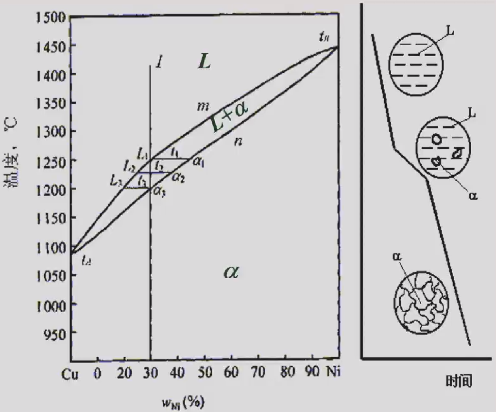

- 两组元在液态和固态下均无限互溶时所构成的相图称二元匀晶相图
- 相图由两条线构成，上面是液相线，下面是固相线。
- 相图被两条线分为三个相区，液相线以上为液相区L，固相线以下为α固溶体区，两条线之间为两相共存的两相区(L+α)
- 除纯组元外，其它成分合金结晶过程相似，以$Cu-Ni$合金为例说明。
- 当液态金属自高温冷却到$t_1$温度时，开始结晶出成分为$\alpha_1$的固溶体，其Ni含量高于合金平均成分
- 这种从液相中结晶出单一固相的转变称为**匀晶转变或匀晶反应**。
- 随温度下降，固溶体重量增加，液相重量减少。同时，液相成分沿液相线变化，固相成分沿固相线变化。
- 成分变化是通过原子扩散完成的。当合金冷却到$t_3$时，最后一滴$L_3$成分的液体也转变为固溶体，此时固溶体的成分又变回到合金成分$\alpha_3$上来
- 液固相线不仅是相区分界线,也是结晶时两相的成分变化线;匀晶转变是变温转变

*二元匀晶结晶过程中液相和固相的成分通过原子扩散分别沿着液相线和固相线变化。(√)
### 杠杆定律
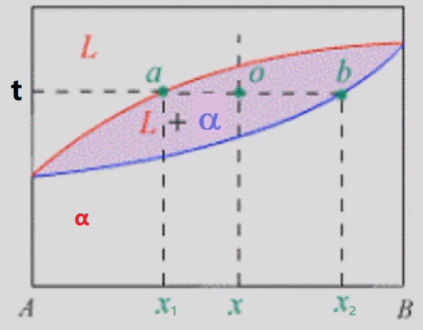

以$Cu-Ni$合金为例
1. 确定两平衡相的成分:设合金成分为x，过x做成分垂线。在成分垂线相当于温度t的o点作水平线，其与液固相线交点a、b所对应的成分$x_1,x_2$即分别为液相和固相的成分。
2. 确定两平衡相的相对重量（**杠杆定律**）：
   设合金的重量为1，液相的重量为$Q_L$，固相的重量为$Q_\alpha$
   $$\begin{cases}
      Q_L+Q\alpha=1\\Q_Lx_1+Q\alpha x_2=x
   \end{cases}$$
   解得
   $$\begin{cases}
      Q_L=\dfrac{x_2-x}{x_2-x_1}\\Q_\alpha=\dfrac{x_1-x}{x_2-x_1}
   \end{cases}$$
   式中$x_2-x,x_2-x_1,x_1-x$分别对应图中$bo,ab,ao$的长度。
   也即
   $$\begin{cases}
      Q_L=\dfrac{bo}{ab}\\ \\ Q_\alpha=\dfrac{ao}{ab}
   \end{cases}$$

- 在杠杆定律中，杠杆的支点是合金的成分，杠杆的端点是所求的两平衡相(或两组织组成物)的成分。
- 注意：**杠杆定律只适用于两相区。**
### 共晶反应的合金的结晶
当两组元在液态下完全互溶，在固态下有限互溶,并发生共晶反应时所构成的相图称作共晶相图。以$Pb-Sn$合金为例
#### 相图分析
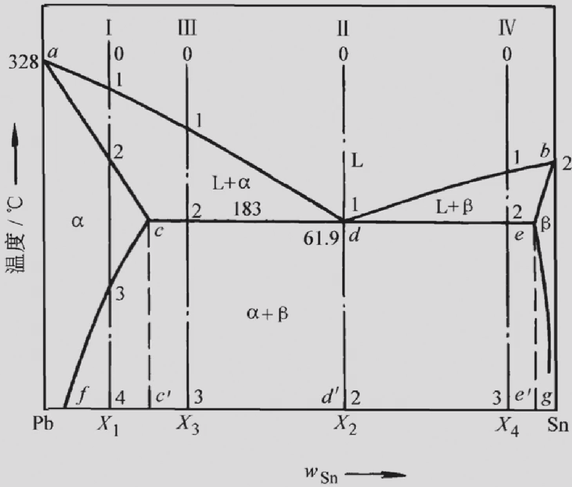</img>

1. 相：相图中有L、α、β三种相，α是溶质Sn在Pb中的固溶体，β是溶质Pb在Sn中的固溶体。
2. 相区：相图中有三个单相区:L、α、β;三个两相区:L+α、L+β、α+β;一个三相区:即水平线cde.
3. 液固相线：液相线adb，固相线acdeb。a、b分别为Pb、Sn的熔点。
4. 固溶线：溶解度点的连线称固溶线。相图中的cf、eg线分别为Sn在Pb中和Pb在Sn中的固溶线。固溶体的溶解度随温度降低而下降。
5. 共晶线：水平线cde叫做共晶线。在共晶线对应的温度下(183°C)，e点成分的合金同时结晶出c点成分的α固溶体和e点成分的β固溶体，形成这两个相的机械混合物:$L_d\ce{<=>}(\alpha_c+\beta_e)$该反应叫**共晶转变或共晶反应**。

- 共晶反应的产物，即两相的机械混合物称共晶体或共晶组织。发生共晶反应的温度称共晶温度。代表共晶温度和共晶成分的点称共晶点
- 具有共晶成分的合金称共晶合金。在共晶线上，凡成分位于共晶点以左的合金称亚共晶合金，位于共晶点以右的合金称过共晶合金。
#### 结晶过程
 
##### 含Sn量小于c点合金(I合金)的结晶过程
- 在3点以前为匀晶转变，结晶出单相α固溶体，这种直接从液相中结晶出的固相称一次相或初生相
- 温度降到3点以下，α固溶体被Sn过饱和，由于晶格不稳，开始析出(相变过程也称析出)新相一β相（记作$\beta_{II}$）由已有固相析出的新固相称二次相或次生相。形成二次相的过程称二次析出，是固态相变的一种
- 随温度下降，α和β相的成分分别沿cf线和eg线变化，$\beta_{II}$的重量增加。

*次生相的晶粒尺寸小于初生相，因为析出温度更低，过冷度更大。
##### 共晶合金(II合金)的结晶过程
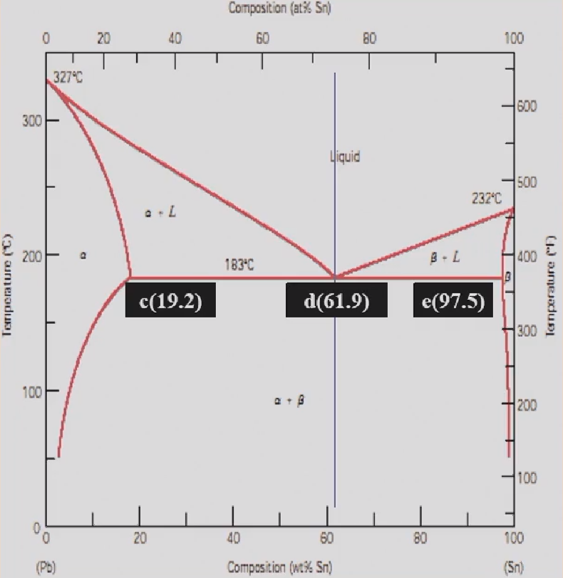</img>

- 液态合金冷却到d点时同时被Pb和Sn饱和，发生共晶反应
- 在共晶转变过程中，L、α、β三相共存,三个相的量在不断变化，但它们各自成分是固定的。
共晶转变结束时，α和β相的相对重量百分比为:
$$Q_\alpha=\frac{de}{ce}\\ \space \\Q_\beta=\frac{cd}{ce}$$
##### 亚共晶合金(Ⅲ合金)的结晶过程
合金液体在2点以前为匀晶转变。冷却到2点，固相成分变化到c点，液相成分变化到d点，此时两相的相对重量为:
$$Q_L=\frac{c2}{cd},Q_\alpha = \frac{d2}{cd}$$
温度继续下降，将从一次相和共晶组织中的α析出β，从共晶中的β固溶体析出$\alpha_{II}$。忽略共晶组织α+β析出的次生相，其室温组织$α +(α+β)+β_{II}$。
##### 过共晶合金（合金Ⅳ）
将亚共晶合金中α和β交换位置，其室温组织为$β +(α+β)+α_{II}$
### 包晶反应的合金的结晶（了解，铁碳相图的包金区域不考）
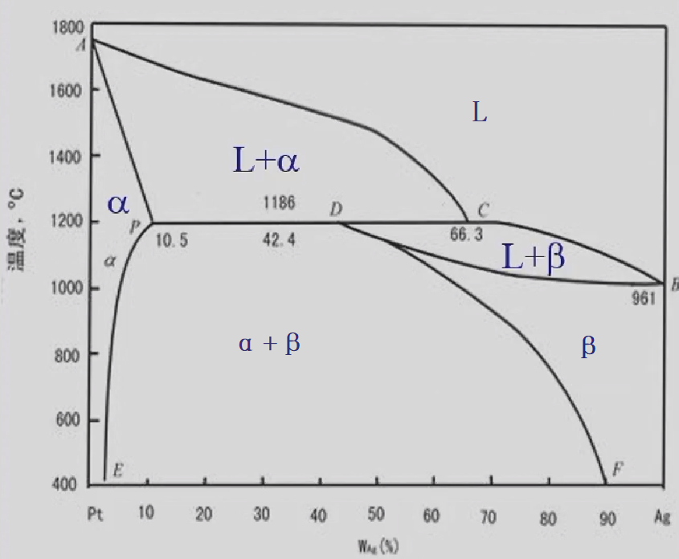</img>
在一定温度下，由一个液相包着一个固相生成另一新固相的反应称包晶转变或包晶反应。
当两组元在液态下完全互溶，在固态下有限互溶并发生包晶反应时所构成的相图称作包晶相图。以$Pt-Ag$合金为例
#### 相图分析
- 单相区：L、α、β
- 二相区：L+α、α+β、L+β
- 三相区：L+α+β（水平线PDC）
- 水平线PDC称包晶线，与该线成分对应的合金在该温度下发生包晶反应:$L_C+\alpha_P\ce{<=>}\beta_D$。该反应是液相L包着固相α、新相β在L与α的界面上形核，并向L和α两个方向长大。
#### 结晶过程（略）

### 共析反应的合金的结晶
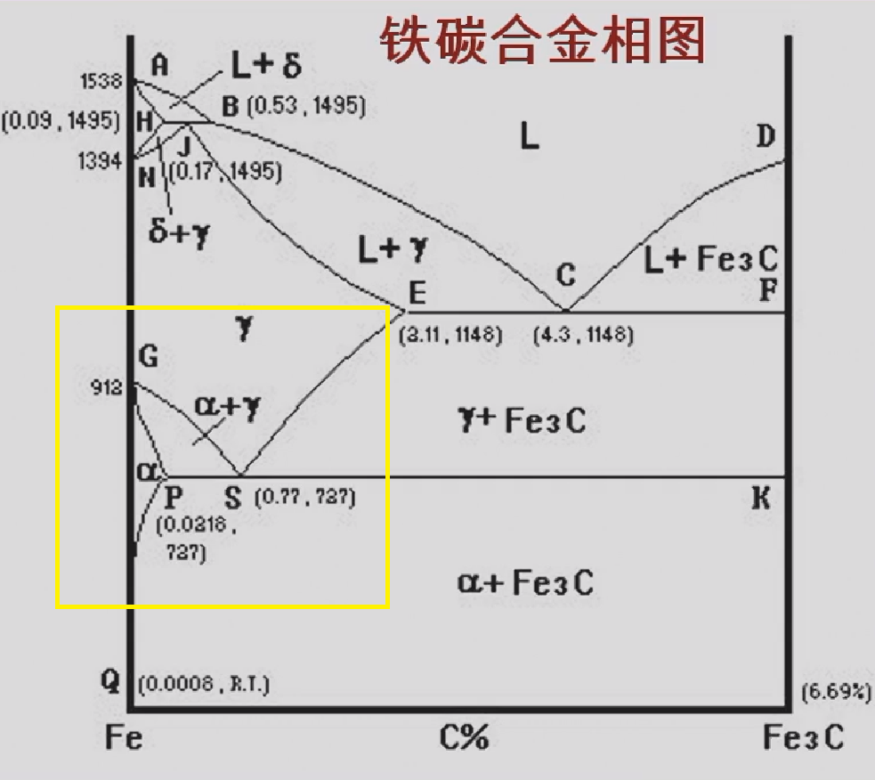</img>

共析反应(共析转变)是指在一定温度下，由一定成分的固相同时析出两个成分和结构完全不同的新固相的过程。共析转变也是固态相变。最常见的共析转变是铁碳合金中的珠光体转变：$\gamma_s\ce{<=>}\alpha_P+Fe_3C$。共析反应的产物是共析体(铁碳合金中的共析体称珠光体)，也是两相的机械混合物(铁素体+渗碳体)。
*铁碳相图中 γ-奥氏体（烧红的铁） α-铁素体 Fe3C-渗碳体
对铁碳合金的淬火退火等处理都在铁碳相图的共析区域
#### 相图分析
共析相图与共晶相图相似，对应的有共析线(PSK线)、共析点(S点)、共析温度、共析成分、共析合金(共析成分合金)、亚共析合金(共析线上共析点以左的合金)、过共析合金(共析线上共析点以右的合金)。
#### 共晶反应和共析反应的区别
- 与共晶反应不同的是，共析反应的母相是固相，而不是液相。
- 另外，由于固态转变过冷度大，因而共析组织比共晶组织细。
### 铁碳合金
铁和碳可形成一系列稳定化合物:$FeC、Fe_2C、Fe_3C$，它们都可以作为纯组元看待。含碳量大于$Fe_3C$成分(6.69%)时，合金太脆，已无实用价值。实际所讨论的铁碳合金相图是$Fe-Fe_3C$相图
#### 铁碳合金的组元
$Fe,Fe_3C$
#### 铁碳合金的相
##### 液相L
##### δ相
高温铁素体，在1394℃以上存在
##### 铁素体
碳在α-Fe中的固溶体称铁素体,用F或α表示。铁素体是体心立方间隙固溶体。
- 铁素体的溶碳能力很低,在727℃时最大为**0.0218%**，室温下仅为**0.0008%**。
- 铁素体的组织为多边形晶粒，性能与纯铁相似。
##### 奥氏体
碳在γ-Fe中的固溶体称奥氏体。用A或γ表示。是面心立方晶格（塑性更好）的间隙固溶体。
- 溶碳能力比铁素体大，1148'C时最大为**2.11%**,727℃时为0.77%。
- 组织为不规则多面体晶粒，晶界较直。强度低、塑性好，钢材**热加工都在γ区进行**.碳钢室温组织中无奥氏体。
##### 渗碳体
即$Fe_3C$,含碳6.69%,用$Fe_3C$或$C_m$表示。
- $Fe_3C$硬度高、强度低，脆性大，塑性几乎为零。
- 由于碳在α-Fe中的溶解度很小，因而常温下碳在铁碳合金中主要以$Fe_3C$或石墨的形式存在。
- $Fe_3C$是一个亚稳相，在一定条件下可发生分解:$Fe_3C\rightarrow3Fe+C(石墨)$,该反应对**铸铁**有重要意义。

*为什么奥氏体溶碳能力大于铁素体
1. 奥氏体温度大于铁素体，温度越高碳的溶解度越大，原子活性也越大
2. 面心立方晶格晶胞中间无占位原子，溶碳能力更高。体心立方晶格中心原子将晶格碎片化，不利于溶碳。
#### 铁的同素异构转变（？）
- 物质在固态下晶体结构随温度变化的现象称**同素异构**转变。同素异构转变属于相变之一：固态相变。
- 铁在固态冷却过程中有两次晶体结构变化，其变化为:
$$\delta-Fe\overset{1394℃}{\ce{<=>}}\gamma-Fe\overset{912℃}{\ce{<=>}}\alpha-Fe$$
#### 铁碳合金的基本组织
##### 铁素体，奥氏体，渗碳体
##### 珠光体（共析组织）
铁素体与$Fe_3C$的机械混合物，用P表示。
- 珠光体的组织特点是两相呈片层相间分布,性能介于两相之间。
- 珠光体在光镜下呈指纹状.
##### 莱氏体（共晶组织）
- 高温莱氏体:727℃以上，奥氏体与渗碳体，以Ld表示
- 低温莱氏体:727℃以下，珠光体与渗碳体，以Ld'表示
- 为蜂窝状,以$Fe_3C$为基，性能硬而脆。
### 简化后的铁碳相图（相图分析）
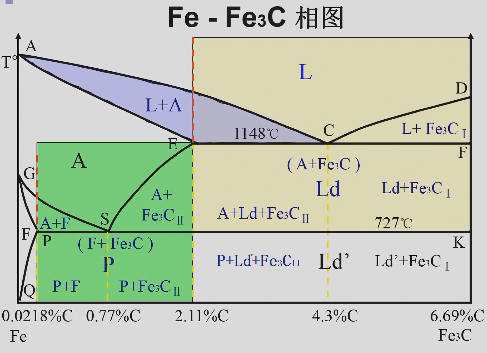
#### 特征点
主要看说明部分，考试时会给出各点温度和碳含量，但是不会给出各相区的成分
|符号|T/℃|C%|说明|
|-|-|-|-|
|A|1538|0|纯铁的熔点|
|C|1148|4.30|共晶点 $L_c\ce{<=>}\gamma_E+Fe_3C$|
|D|1227|6.69|渗碳体的熔点|
|E|1148|2.11|碳在$\gamma-Fe$中的最大溶解度|
|F|1148|6.69|渗碳体的成分点|
|G|912|0|纯铁α和γ转化温度|
|K|727|6.69|渗碳体的成分点|
|P|727|0.0218|碳在$\alpha-Fe$中的最大溶解度|
|S|727|0.77|共析点$\gamma_s\ce{<=>}\alpha_p+Fe_3C$|
#### 特征线
- 液相线：ACD
- 固相线：AECFD
- 共晶线：ECF，共晶产物莱氏体
- 共析线：PSK，又称为$A_1$线，共析产物珠光体
- $A_{cm}$线：碳在$\gamma-Fe$中的固溶线，即$ES$线，记忆方法是随温度升高而增大
- $A_3$线：$\gamma\ce{<=>}\alpha$转化线，即GS线
#### 铁碳合金的分类
|含碳量|合金种类|
|-|-|
|0-0.0218%|工业纯铁|
|0.0218%-0.77%|亚共析钢|
|0.77%|共析钢|
|0.77%-2.11%|过共析钢|
|2.11%-4.3%|亚共晶白口铸铁|
|4.3%|共晶白口铸铁|
|4.3%-6.69%|过共晶白口铸铁|

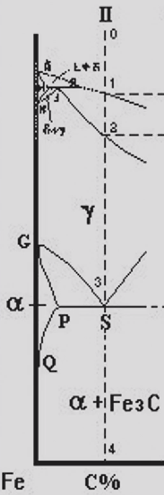</img>
*白口铸铁的铸造性能好，硬而脆
 
 
 

#### 结晶
##### 共析钢的结晶过程
合金液体在1-2点间转变为γ。到S点发生共析转变
$$\gamma_S\ce{<=>}\alpha_P+Fe_3C$$
γ全部转变为珠光体
室温下珠光体两相的相对重量百分比
$$Q_\alpha=\frac{6.69-0.77}{6.69-0.0008}=88.5\%\\Q_{Fe_3C}=1-Q_\alpha=11.5\%$$

##### 亚共析钢的结晶过程 

合金在4点以前通过匀晶一包晶一匀晶反应全部转变为γ。到4点，由γ中析出α。到5点,成分沿GS线变到S点，γ发生共析反应转变为珠光体。

共析温度下**相**的相对质量
$$Q_{Fe_3C}=\frac{P5}{PK}\\\space \\Q_{\alpha}=\frac{5K}{PK}$$
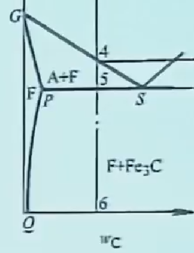</img>

K点在上方完整铁碳相图中，5点为右图
共析温度下**组织**的相对质量
$$Q_{P}=\frac{P5}{PS}\\\space \\Q_{\alpha}=\frac{5S}{PS}$$
*利用平衡组织中珠光体所占的面积百分比，可以近似估算亚共析钢的含碳量:
$$C\%=P_{面积}\%\times0.77\%$$

##### 过共析钢的结晶过程 
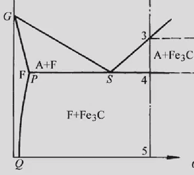</img>

3点,开始析出$Fe_3C$。从奥氏体中析出的$Fe_3C$称二次渗碳体,用$Fe_3C_{II}$表示,其沿晶界呈网状分布
温度下降,$Fe_3C_{II}$量增加。到4点，γ成分沿ES线变化到S点，余下的γ转变为P。
渗碳体（组织）含量随碳含量增加而增加，最大为
$$P_{Fe_3C_{II}}=\frac{2.11-0.77}{6.69-0.77}=22.6\%$$
##### 共晶合金的结晶
合金冷却到C点发生共晶反应全部转变为莱氏体(Le)
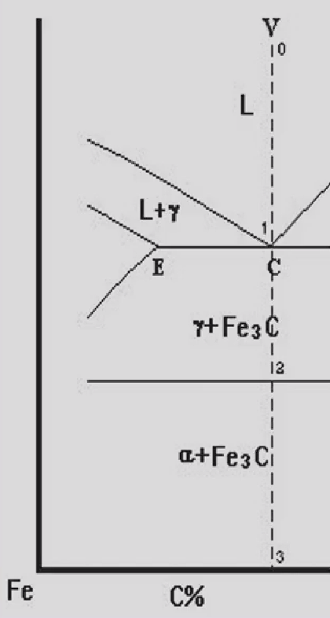</img>

温度降到2点，成分达到0.77%，此时**相**的相对重量:
$$Q_\gamma=\frac{6.69-4.3}{6.69-0.77}=40.4\%,Q_{Fe_3C}=59.6\%$$
在2点，共晶γ发生共析反应，转变为珠光体，这种共晶体称为低温莱氏体
### 含碳量对碳钢组织和性能的影响
#### 含碳量对力学性能的影响
- 亚共析钢随含碳量增加，P量增加，钢的强度、硬度升高，塑性、韧性下降
- 0.77%C时，组织为100%P。钢的性能即P的性能。
- 大于0.9%C，$Fe_3C_{II}$为晶界连续网状。强度下降，但硬度仍上升。
- 大于2.11%C.，组织中有以$Fe_3C$为基的Le’,合金太脆
#### 其他元素的影响
Si、Mn是有益元素，P、S是有害元素
- Mn：生成MnS，降低热脆性;部分溶于铁素体中，固溶强化。
- Si：溶于铁素体中，固溶强化。
- S：S易偏析；形成FeS产生热脆性
- P：P产生冷脆性。有轻微强化作用。
#### 含碳量对工艺性能的影响
- 切削性能:中碳钢合适
- 可锻性能:低碳钢好
- 焊接性能:低碳钢好
- 铸造性能:共晶合金好（熔点最低）
- 含碳量增加，强度和硬度增加，塑性和韧性下降
### 碳素钢
在冶炼过程中不人为加入合金元素的钢种。
与之对应的是合金钢，指在冶炼过程中人为加入合金元素的钢种。
#### 分类
- 按含碳量分类：低碳钢，中碳钢，高碳钢
- 按有害元素含量/钢的质量分类：普通碳素钢，优质碳素钢，高级优质碳素钢
- 按钢的用途分类：碳素结构钢，碳素工具钢
- 按脱氧程度分类：沸腾钢   镇静钢  半镇静钢
#### 碳素钢的编号和用途
##### 普通碳素结构钢
- 牌号：由**屈服强度，质量等级和脱氧方法**组成。方法是由代表屈服点的字母(Q)，屈服强度数值(MPa值)，质量等级符号(A，B，C，D)及脱氧方法符号(F，b，Z)等四部分按顺序组成。如Q235-A.F，表示屈服强度数值为235MPa的A级沸腾钢。质量等级号表示普碳钢中杂质硫磷含量的高低，D级的含量最低，质量好。脱氧方法符号从F起依次分别表示沸腾钢，半镇静钢，镇静钢及特殊镇静钢（镇静钢比沸腾钢好）
- 应用特点：
与优质钢比较，属普通质量钢，价格便宜，应用甚广；
不进行热处理，直接使用，主要考虑力学性能和常存杂质的含量，含碳量仅作参考。
一般在钢厂供应状态下(即热轧状态)直接使用，出厂时**保证机械性能**
- 用途：
工程结构(薄钢板，钢筋，钢管，各种型材);
要求不高的机器零件(铁钉，螺钉，螺栓，手柄，小轴)
- 特点：塑韧性优良
##### 优质碳素结构钢
- 牌号：该类钢的钢号用钢中平均含碳量的两位数字表示单位为**万分之一**。如钢号45，表示平均含碳量为0.45%的钢。这是正常含锰量(按杂质含量)的优质碳素结构钢的钢号表示方法。对含锰量较高的钢，须将锰元素标出。
所谓较高含锰量系指含碳量大于0.6%、含锰量在(0.9-1.2)%者及含碳量小于0.6%、含锰量(0.7-1.0)%者，数字后面附加化学元素符号"Mn"。例如钢号25Mn，表示平均含碳量为0.25%而含锰量为(0.7-1.0)%的钢。
沸腾钢，半镇静钢以及专门用途的优质碳素结构钢，应在钢号后特别标出，如**08F**（结构钢是两位数字）表示含碳量为0.08%的沸腾钢。
##### 用途
- 出厂时保证成分，用来制造较重要的机器零件，**一般都经过热处理以提高力学性能。**
- 法兰盘、齿轮、螺钉、螺母、垫圈、轴、连杆、丝杠、键。
- 55～65：热处理后有良好的弹性。用作**弹簧**、轧辊、钢丝绳。碳素**弹簧钢**。

（只要求能选出来对应材料，不用背的特别清楚）
##### 碳素工具钢
工具钢用于制造各种加工和测量工具，按用途可分为刃具钢模具钢和量具钢。碳素工具钢碳的质量分数较高，0.65%~1.35%。
- 牌号：碳素工具钢是在钢号前加“T”表示，其后跟以表示钢中平均含碳量的**千分之几**的数字。如平均含碳量为0.8%的工具钢，其钢号记为“T8”。含锰量较高者须在钢号后标以“Mn”。若为高级优质碳素工具钢则在钢号末端加“A”，如T10A。
- 应用特点：碳素工具钢分两组，根据有害元素成分划定，一组是高级优质钢，一组是优质钢
  碳素工具钢必**须经过热处理后使用**
- 用途:各种刀具、刃具、量具。冲头、凿子、锻造工具、錾子、锤子、钻头、车刀、丝锥、钢锯条、小冲模、精车刀、量具、锉刀、刮刀
- 碳素工具钢淬透性不高，适合小截面的工具
##### 铸造碳钢
简称铸钢，用于铸造的碳素钢。
- 牌号：ZG加两组数字组成，第一组为屈服强度，第二组数字为抗拉强度。如ZG340-640（旧牌号为ZG55）。
- 应用特点：制造形状复杂，力学性能要求高（如很大冲击），用锻钢难以成型，用铸铁不能满足要求的零件
#### 选材
##### 齿轮
- 受力情况：工作时齿表面承受较大的压力和摩擦，齿部还承受较大的交变应力和冲击力
- 性能要求：较高强度，硬度，优良的综合力学性能
- 材料选择：中碳优质碳素结构钢，如55钢
##### 叶片
- 受力情况：承受较小的冲击载荷和磨檫力
- 性能要求：要求一般的强度，硬度
- 材料选择：普通碳素结构钢，如Q195
##### 锉刀
- 受力情况：承受较大的磨檫力
- 性能要求：要求高的硬度，耐磨性
- 材料选择：碳素工具钢，如T12

例题：
为下列构件选择合适的制造材料
Q215 –A.F    65      40Mn      T12    ZG200-400
|构件名称|材料牌号|
|-|-|
|主轴|40Mn|
|机座|ZG200-400|
|板牙|T12|
|铁钉|Q215 –A.F|
|弹簧|65|
### 铸铁
铸铁是碳含量大于2.11%、并常含有较多的硅、锰、硫、磷等元素的铁碳合金。生产设备和工艺简单，价格便宜，并具有许多优良的使用性能和工艺性能。
它可用于制造各种机器零件，如机床的床身、床头箱；发动机的汽缸体、缸套、活塞环、曲轴、凸轮轴；轧机的轧辊及机器的底座等。
#### 铸铁的分类
##### 白口铸铁
碳全部以渗碳体形式存在的（组织中有Ld'） ，很少使用
##### 灰口铸铁
碳大部分以石墨（G）形式存在的（组织中无Ld'），大量使用，可以看成是在钢的基体上分布着不同形状的石墨
##### 麻口铸铁
碳部分以渗碳体、部分以石墨存在的（组织中有Ld'），废品
##### 灰口铸铁的分类
- 灰铸铁——石墨呈片状灰口铸铁；(性能最差但使用最多)
- 可锻铸铁——石墨呈团絮状的灰口铸铁；
- 球墨铸铁——石墨呈球状的灰口铸铁；（性能最好）
- 蠕墨铸铁——石墨呈蠕虫状的灰口铸铁。
#### 铸铁的石墨化
铸铁中碳原子以石墨形态析出的过程称为石墨化。
铁碳合金按照Fe-G相图（几乎与Fe-Fe3C相图完全相同）进行结晶，则铸铁的石墨化过程可分为如下两个阶段：
第一阶段：共析转变温度以上进行的石墨化；
第二阶段：共析转变进行的石墨化；
一般，铸铁在高温冷却过程中，由于具有较高的原子扩散能力，故其第一阶段的石墨化是较容易进行的，而在较低温度下的第二阶段的石墨化，则常因铸铁的成分及冷却速度等条件的不同，石墨化被部分或全部抑制，从而得到三种不同的组织，即：F+G（第二阶段完全进行），F+P+G（第二阶段部分抑制），P+G（第二阶段完全抑制）
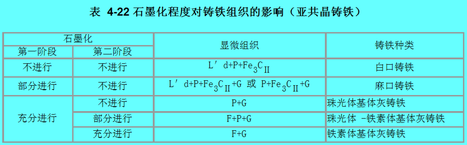
##### 影响石墨化的因素
- 内因：化学成分
C——形成石墨化的元素。
Si——强烈促进石墨化的元素
在灰口铸铁中含有大量的硅，这就是铸铁以灰口组织出现的根本原因
Mn——具有双重作用：本身是阻碍石墨化的元素，但它可以减弱S的有害性
S——严重阻碍石墨化的元素；
P——促进石墨化的元素，但含量很低，影响不大，冷脆性。
- 外因：冷却速度
  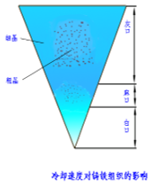</img>
  铸铁的冷却速度越小，或在高温下长时间保温，均有利于石墨化。
  生产过程中铸件壁厚越厚，铸型导热性越差，冷却速度越慢，越有利于石墨化
##### 常见灰口铸铁
**重点关注牌号，别的扫一眼**

**一、灰铸铁**
1. 组织：钢基体+片状石墨
2. 工艺：直接浇注（或经孕育处理）
3. 成分：C： 3.0%～3.8% Si：1.5%～3.0% （不用背）
4. 性能特点：铸造性能最好，力学性能最差
5. 热处理：由于这种铸铁中G的破坏作用很大，一般不进行以提高强度为目的的热处理，主要进行消除内应力退火，有时进行表面淬火 
6. 孕育处理：铸铁石墨细晶强化 为了细化灰铸铁的组织，提高铸铁的机械性能，并使其均匀一致。通常在浇注前往铁水中加和少量强烈促进石墨化的物质，即孕育剂进行处理，这一处理过程称为孕育处理。经过孕育处理的灰铸铁称孕育铸铁
7. 牌号：HTxxx（灰铁）xxx为三位数字，数字越大力学性能越好

**性能特点**
1. 优良的铸造性能 
2. 优良的切削加工性
3. 良好的减摩（擦）性
4. 良好的减震性
5. 较低的缺口敏感性
6. 较低力学性能，但抗压性能不低于钢

**二、球墨铸铁**
1. 组织：钢基体+球状石墨
2. 工艺：液态铁水石墨化、球化处理，球化剂为镁、稀土和稀土镁。为避免白口，并使石墨细小均匀，在球化处理同时还进行孕育处理。
3. 成分：3.6%～3.9%C，2.2%～3.1%Si
4. 性能特点：力学性能最好（有效承载面积可达70-90%），铸造性能较差
5. 热处理：与钢相同，可进行各种热处理。退火、正火、调质、等温淬火等
6. **用途：承受震动、载荷大的零件，如曲轴、传动齿轮等。**
7. 牌号：QTxxx(球铁) 数字越大力学性能越好

**三、可锻铸铁**
1. 组织：钢基体+团絮状石墨
2. 工艺：先浇注成白口铸铁件，再进行石墨化退火
3. 成分：2.4～2.8%C，1.4～1.8%Si 
4. 性能特点：力学性能好，铸造性能差（名字可锻，实际不可锻）
5. 热处理：一般不热处理
6. 用途：用于制造形状复杂且承受振动载荷的薄壁小型件，如汽车、拖拉机的前后轮壳、管接头、低压阀门等。
7. 牌号：KT+数字+数字，后面的两组数字分别表示最低抗拉强度和最低伸长率
8. 性能：强度为碳钢的40~70%，接近于铸钢。
*铁素体基体可锻铸铁又称黑心可锻铸铁。（好像不是很重要）

**四 、蠕墨铸铁**
1. 组织：钢基体+蠕虫状石墨
2. 工艺：蠕墨铸铁是液态铁水经蠕化处理和孕育处理得到的.
3. 成分：碳=3.0%～4.0% 硅=2.0%～3.0% 
4. 性能特点：力学性能较好（耐热性突出），铸造性能稍差。蠕墨铸铁的强度、塑性和抗疲劳性能优于灰铸铁，其力学性能介于灰铸铁与球墨铸铁之间。
5. 热处理：与灰铸铁类似
6. 用途：蠕墨铸铁常用于制造承受热循环载荷的零件和结构复杂、强度要求高的铸件。如钢锭模、玻璃模具、柴油机汽缸、汽缸盖、排气阀、液压阀的阀体、耐压泵
的泵体等。
7. 牌号：RuTxxx

**五、特殊性能铸铁**

**感觉不会考，看看得了**
在铸铁中加入某些元素，以形成具有特殊性能的铸铁(又称合金铸铁)。
（一）耐磨铸铁
灰铸铁中提高磷含量；白口铸铁中加入Cr、Ni、Mo、V等元素。
（二）耐蚀铸铁
向铸铁中加入Si、Al、Cr、Cu、Ni、P等元素。

## 第四章 钢的热处理