# 工程材料
## 第一章 工程材料的力学性能
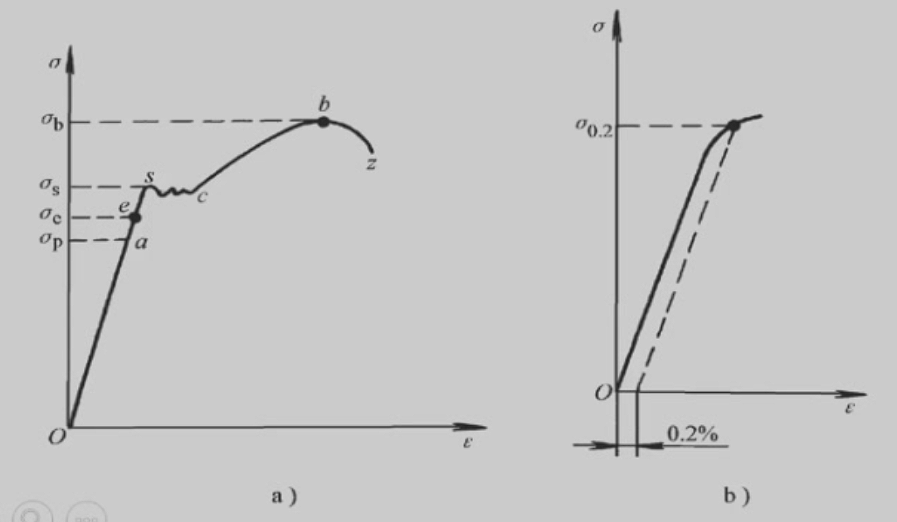</img>

**弹性**：指标为弹性极限$\sigma_e$，即材料承受最大弹性形变时的应力  
**刚度**：材料受力时抵抗弹性变形的能力，指标为弹性模量$E$
**强度**：材料在外力作用下抵抗变形和破坏的能力
**屈服强度**$\sigma_S$：材料发生微量塑性变形时的应力值 (s stands for start)
**条件屈服强度**$\sigma_{0.2}$：残余变形量为$0.2%$时的应力值
**抗拉强度**$\sigma_b$：材料断裂前所承受的最大应力值 (b stands for break)

**塑性**：材料受力破坏前可承受最大塑性变形的能力，指标为伸长率和断面收缩率
**伸长率**$\delta$：$\delta=\dfrac{l_1-l_0}{l_0}\times 100\%$ 
$l_1$为拉断后的长度，$l_0$为原始长度
**断面收缩率**$\psi$：$\psi = \dfrac{A_0-A_k}{A_0}\times 100\%$
$A_0$为试样的原始截面积，$A_k$为试样拉断处的截面积
**用面缩率表示塑性比伸长率更接近真实变形。**（二维指标准确性大于一维）
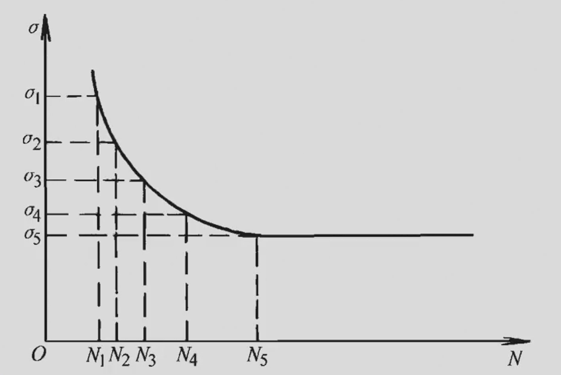</img>

**疲劳强度**：材料在低于$\sigma_S$的重复交变应力作用下发生断裂的现象称为疲劳。
材料在规定次数应力循环后仍不发生断裂的最大应力为疲劳强度$\sigma_r$
**硬度**：材料抵抗表面局部塑性变形压痕、划痕的能力
1. 布氏硬度HB
   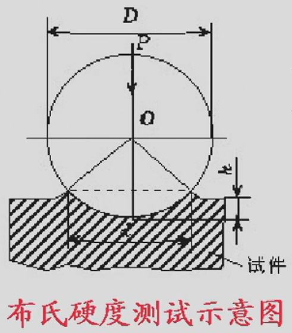</img>
   $$HBS = \dfrac{F}{A} = \dfrac{F}{\pi D h}=\dfrac{F}{\pi D (\dfrac{D}{2}-\sqrt{(\dfrac{D}{2})^2-(\dfrac{d}{2})^2})} = \dfrac{2F}{\pi D (D-\sqrt{D^2-d^2})}$$
   **压球为钢头时**，布氏硬度用符号$HBS$表示，适用于布氏硬度值450以下的材料
   **压球为硬质合金球时**，布氏硬度用符号$HBW$表示，适用于布氏硬度值650以下的材料
   - 优点： 测量误差小，数据稳定
   - 缺点： 压痕大，不能用于太薄件，成品件
   - 适用场景： 退货，正火，调质钢，铸铁及有色金属的硬度
2. 洛氏硬度HR
   指标：压痕的深度
   根据压头类型和主载荷不同，分为九个标尺，常用的标尺为A、B、C
   - HRA用于测量高硬度材料,如硬质合金、表淬层和渗碳层
   - HRB用于测量低硬度材料，如有色金属和退火、正火钢等。
   - HRC用于测量中等硬度材料，如调质钢、淬火钢等。
   - 优点： 操作简便，压痕小，适用范围广
   - 缺点：测量结果分散度大
3. 维氏硬度HV
   $$HV = \dfrac{F}{A} = \dfrac{F}{\dfrac{d^2}{2sin68^{\circ}}}$$
**韧性**
**冲击韧性**： 材料抵抗冲击载荷作用而不破坏的能力，指标为冲击韧性值$a_k$（通过冲击实验测得）
**断裂韧性**： 带微裂纹的材料和零件阻止裂纹扩散的能力。
**应力强度因子**$K_1$： 裂纹尖端附近应力场的指标。
* 细晶强化可以同时增强增韧，否则对金属来说强度和韧性负相关
## 纯金属的晶体结构
### 晶格与晶胞
**晶体**：假想的直线将原子中心连接起来所形成的三维空间格架。直线的交点(原子中心)称**结点**。由结点形成的空间点的阵列称**空间点阵**。
**晶胞**： 能代表晶格原子排列规律的最小几何单元。
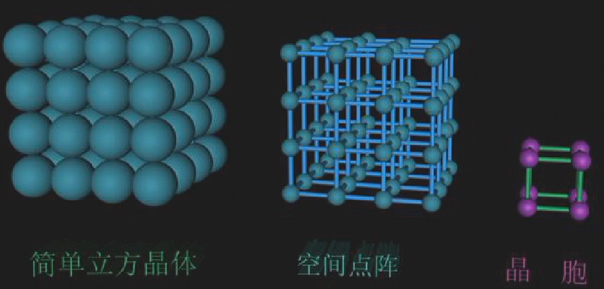</img>

**晶格常数** ：晶胞各边的尺寸$a$,$b$,$c$，各棱间的夹角用$\alpha , \beta , \gamma$表示
### 晶系
- 根据晶胞参数不同，将晶体分为七种晶系
- 90%以上的金属具有立方晶系和六方晶系
**立方晶系**： $a=b=c,\alpha = \beta = \gamma = 90 ^\circ$
**六方晶系**： $a_1 = a_2 = a_3\neq c  ,\alpha = \beta = 90^\circ,\gamma = 120^\circ$（高不同）

原子半径**:晶胞中**原子密度最大方向上**相邻原子间距的一半。**

#### 体心立方晶格
</img>
- 原子半径： $r = \dfrac{\sqrt{3}}{4}a$
- 原子数： 2
- 配位数： 8
- 致密度： 0.68
- 常见金属： $\alpha - Fe,\delta - Fe,Cr,W,Mo,V$
- 特点：塑性较差

#### 面心立方晶格
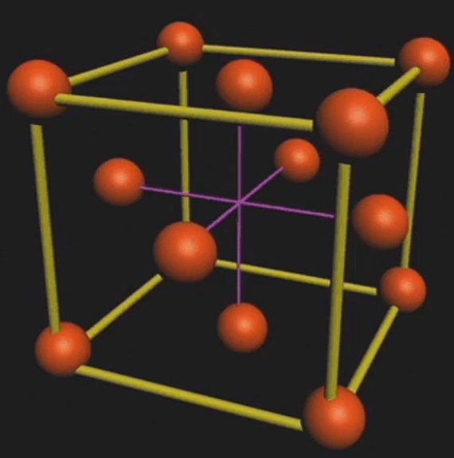</img>

- 原子半径：$r = \dfrac{\sqrt{2}}{4}a$
- 原子数： 4
- 配位数： 12
- 致密度： 0.74
- 常见金属： $\gamma - Fe, Ni,Al,Cu,Pb,Au$
- 特点：塑性较好（咬金）

#### 密排六方晶格
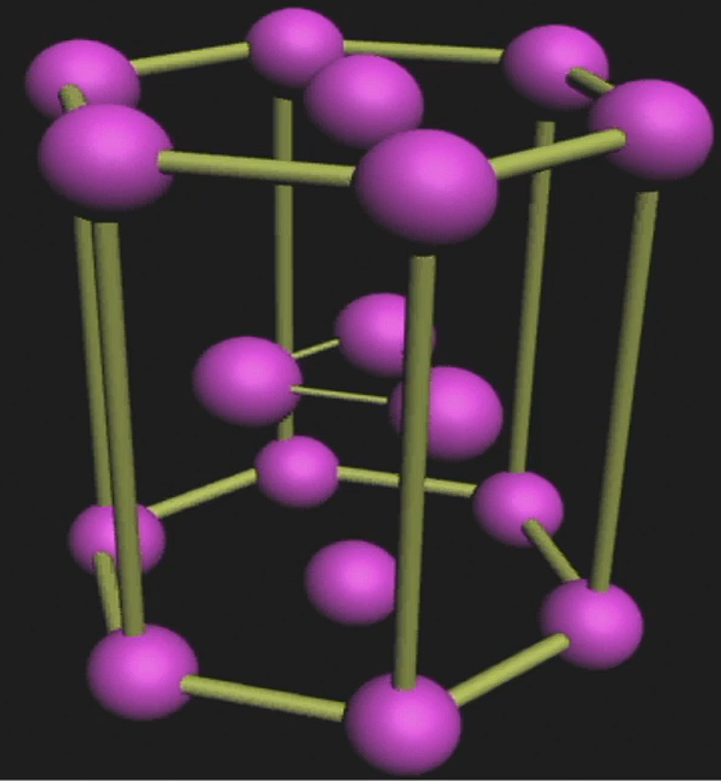</img>

- 晶格常数：底面边长$a$和高$c$，有$\dfrac{c}{a}=1.633$
- 原子半径：$\dfrac{1}{2}a$
- 原子个数：6
- 配位数：12
- 致密度：0.74
- 常见金属：$Mg,Zn,Be,Cd$（有色金属）
- 特点：塑性较差
### 立方晶系晶面、晶向表示方法
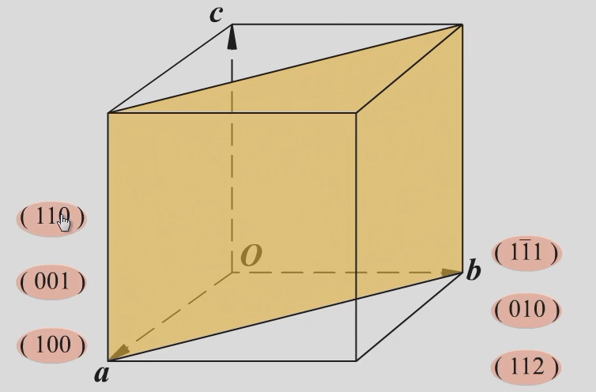</img>

#### 晶面和晶面指数
晶面是一系列原子组成的平面。表示晶面的符号称为晶面指数。  
**晶面指数的确定方法**
1. 选坐标，以晶格中某一原子为原点(注意不要把原点放在所求的晶面上)，以晶胞的三个棱边作为三维坐标的坐标轴。

</img>

1. 以相应的晶格常数为单位，求出待定晶面在三个轴上的截距。
2. 求三个截距的倒数
3. 将所得数值化为最小整数，加圆括弧，形式为(xyz) *这里的xyz表示顺序
4. 负数在数字上加横线，如右图
#### 晶向和晶向指数
任意两个原子之间的连线为原子列，其所指方向为晶向。
 
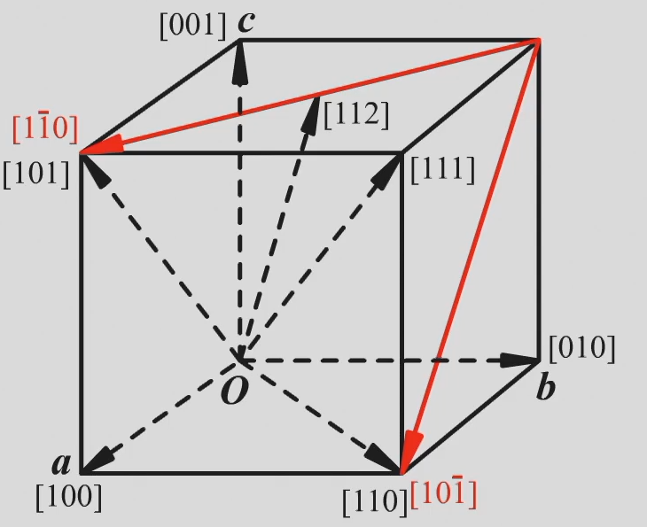</img>

**晶向指数的确定方法**
1. 确定原点，把晶向起点平移到原点，计算坐标
2. 将比例化为最简，加方括号，形式为[xyz]
#### 晶面族和晶向族
- (hkl)和[uvw]分别表示的是一组平行的晶面和晶向
- 指数虽然不同，但原子排列完全相同的晶向和晶面称作晶向族或晶面族。
- 在立方晶系中，指数相同的晶面与晶向相互垂直。
### 缺陷
#### 点缺陷
空间三维尺寸都很小的缺陷
- 空位
- 间隙原子
- 置换原子
#### 线缺陷
晶体中的位错：格中一部分晶体相对于另一部分晶体发生局部滑移，滑移面上滑移区与未滑移区的交界线称作位错。分为**刃型位错**和**螺型位错**
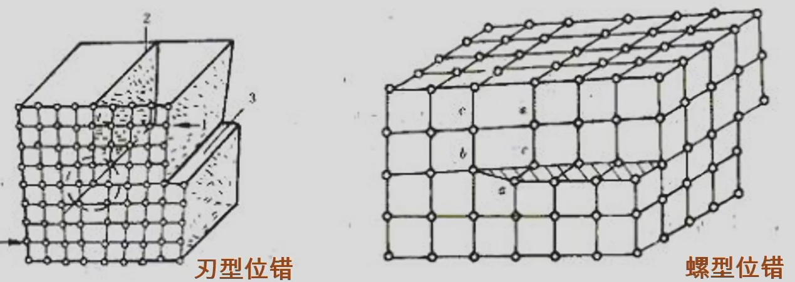</img>

**刃型位错**
当一个完整晶体某晶面以上的某处多出半个原子面，该晶面像刀刃一样切入晶体，这个多余原子面的边缘就是刃型位错。
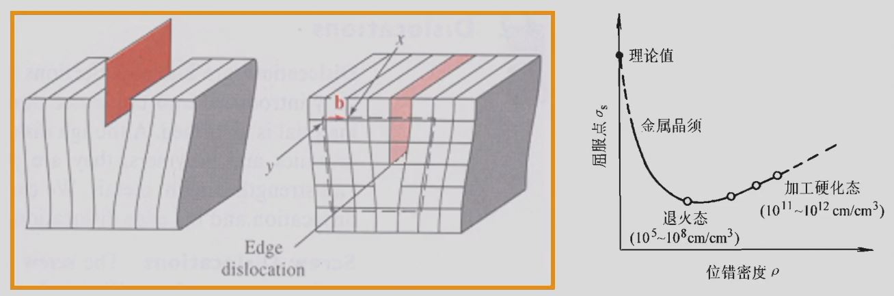</img>

**位错密度**:单位体积内所包含的位错线总长度。
#### 面缺陷
**晶界**是不同位向晶粒的过渡部位，宽度为5 ~ 10个原子间距，位向差一般为20° ~ 40°
**亚晶粒**是组成晶粒的尺寸很小，位向差也很小(10°~2°)的小晶块。
亚晶粒之间的交界面称**亚晶界**。亚晶界也可看作位错壁。
### 纯金属的结晶
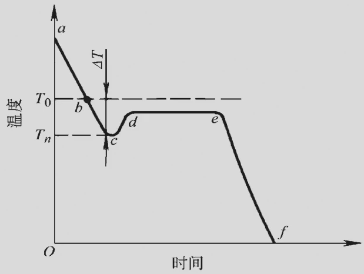</img>

纯金属都有一个理论结晶温度$T_0$(熔点或平衡结晶温度)。在该温度下,液体和晶体处于**动平衡状态**。
结晶只有在$T_0$以下的实际结晶温度下才能进行。
简单理解，就是水在0℃结成冰
液态金属在理论结晶温度以下开始结晶的现象称**过冷**。
理论结晶温度与实际结晶温度的差$\Delta T$称**过冷度**
过冷度大小与冷却速度有关，**过冷度越大，冷速越大。**
#### 纯金属的结晶过程
1. 晶核形成
形核有两种方式，即**自发形核和非自发形核**。
由液体中排列规则的原子团形成晶核称**自发形核**。
以液体中存在的固态杂质为核心形核称**非自发形核**。
**非自发形核**比自发形核更重要。
*中国足球，只有中国人是自发形核，引入尼哥是非自发形核，非自发形核就比较强（（
2. 晶核长大
- 长大方式分为**均匀长大**和**树枝状长大**
- 晶粒的大小取决于晶核的**形成速度**和**长大速度**
- 单位时间、单位体积内形成的晶核数目叫**形核率(N)**
- 单位时间内晶核生长的长度叫**长大速度(G)**
- N/G比值越大，晶粒越细小。因此，凡是促进形核、抑制长大的因素，都能细化晶粒。

#### 细化铸态金属晶粒的措施
**增加过冷度**：随过冷度增加，N/G值增加，晶粒变细
**变质处理**：又称孕育处理。即有意向液态金属内加入非均匀形核物质从而细化晶粒的方法。所加入的非均匀形核物质叫变质剂(或称孕育剂)
# 第二章 金属的塑性变形与再结晶
## 塑性变形
### 滑移
- 在切应力作用下，晶体的一部分原子相对另一部分原子，沿着一定的晶面(滑移面)和一定的方向(滑移方向)相对滑动的结果。
- 滑移只有在**切应力**作用下才能进行,只有当作用在晶面上的切应力达到临界值时，材料才会发生塑性变形。
- 晶体的滑移不是只发生在一个晶面上，而是在相邻的一组晶面上同时或先后发生从而形成明显的**滑移带**。
#### 滑移的同时伴随着晶体的转动
转动有两种:滑移面向外力轴方向转动和滑移面上滑移方向向最大切应力方向转动。
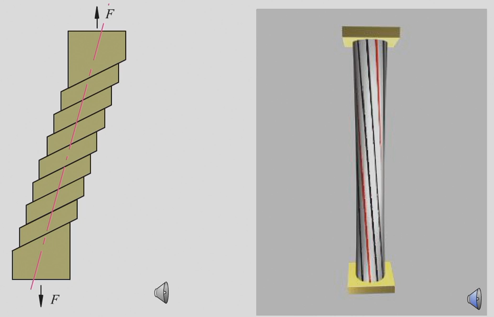</img>

看不懂图思密达
### 孪生 不做要求 不写了
### 单晶体金属的塑性变形
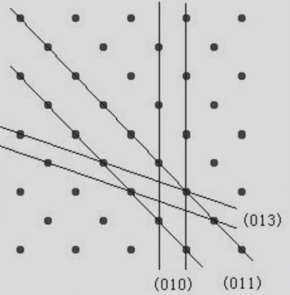</img>

- 单晶体受力后，外力在任何晶面上都可分解为正应力和切应力。正应力只引起晶格弹性伸长进而被拉断;切应力使晶格产生弹性扭曲后滑移。
- 正应力**只能造成晶体的弹性变形**或断裂而**不能引起晶体的塑性变形**
- 滑移**只能在切应力的作用下发生**。产生滑移的最小切应力称**临界切应力**
- 滑移常沿晶体中**原子密度最大**的晶面和晶向发生。**因原子密度最大的晶面和晶向之间原子间距最大，结合力最弱，产生滑移所需切应力最小。**
- 沿其发生滑移的晶面和晶向分别叫做**滑移面**和**滑移方向**。通常是晶体中的密排面和密排方向。
### 滑移系
一个滑移面和其上的一个滑移方向构成一个滑移系。
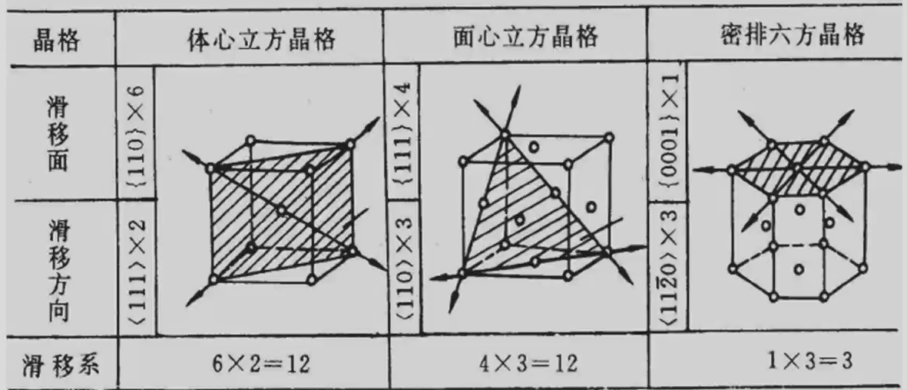</img>

- 滑移系越多，金属发生滑移的可能性越大，**塑性也
越好，其中滑移方向对塑性的贡献比滑移面更大**。  
- 因而金属的塑性，**面心立方晶格好于体心立方晶格
体心立方晶格好于密排六方晶格**
### 塑性变形的实质
滑移是通过滑移面上位错的运动来实现的，不是刚性整体滑动。  
晶体通过位错运动产生滑移时，**只在位错中心的少数原子发生移动**，它们移动的距离**远小于一个原子间距**，因而所需**临界切应力小**，这种现象称作位错的。
### 多晶体的塑性变形
#### 晶界的阻碍作用
- 当位错运动到晶界附近时，受到晶界的阻碍而堆积起来,称**位错的塞积**。要使变形继续进行,则必须增加外力，从而使金属的变形抗力提高。
#### 各晶粒变形需要相互协调
由于各相邻晶粒位向不同，当一个晶粒发生塑性变形时，为了保持金属的连续性，周围的晶粒若不发生塑性变形，则必以弹性变形来与之协调。这种弹性变形便成为塑性变形晶粒的变形阻力。由于晶粒间的这种相互约束，**使得多晶体金属的塑性变形抗力提高。**
#### 各晶粒变形的不同时
单个晶粒变形与单晶体相似,多晶体变形比单晶体复杂。
### 塑性变形对金属组织的影响
#### 纤维组织形成
金属发生塑性变形时，外形发生变化，其内部的晶粒也相应地被拉长或压扁。当变形量很大时，晶粒将被拉长为纤维状。性能趋于各向异性，纵向性能高于横向性能。（纵向晶界多）
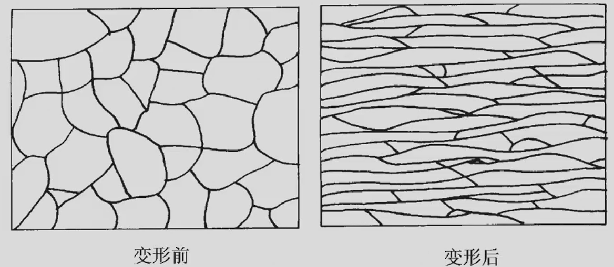</img>

*钢丝吊工件进行热处理，退火之后钢丝断裂，为什么喵
纤维状晶粒被拉回到等轴形状了，强度下降了喵
### 亚结构形成
塑性变形还使晶粒破碎为亚晶粒。胞壁由高密度位错构成。
### 形变织构的产生
晶粒的转动，当塑性变形达到一定程度时，会使绝大部分晶粒的某一位向与变形方向趋于一致，这种现象称**织构或择优取向**
### 塑性变形对金属性能的影响
#### 产生加工硬化现象
随冷塑性变形量增加，金属的**强度、硬度提高，塑性、韧性下降**的现象称**加工硬化。**
#### 使金属的性能产生各向异性
形变织构使金属呈现**各向异性**，在深冲零件时，易产生“制耳”现象，使零件边缘不齐，厚薄不匀。但织构可**提高硅钢片的导磁率**。
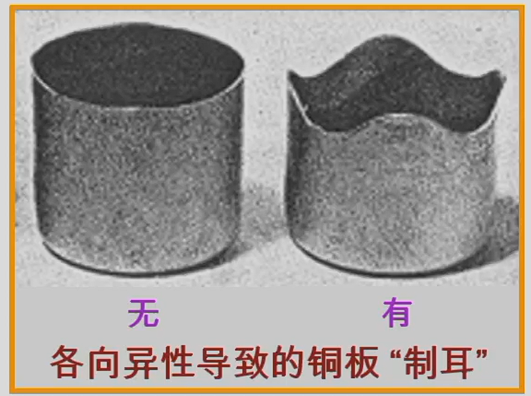</img>

#### 影响金属的物理、化学性能
#### 产生参与内应力

### 塑性变形后的金属加热加热时组织和性能的变化
金属经冷变形后，组织处于不稳定状态,有自发恢复到稳定状态的倾向。**但在常温下，原子扩散能力小,不稳定状态可长时间维持。**加热可使原子扩散能力增加，金属将依次发生**回复、再结晶和晶粒长大**。
 

#### 回复
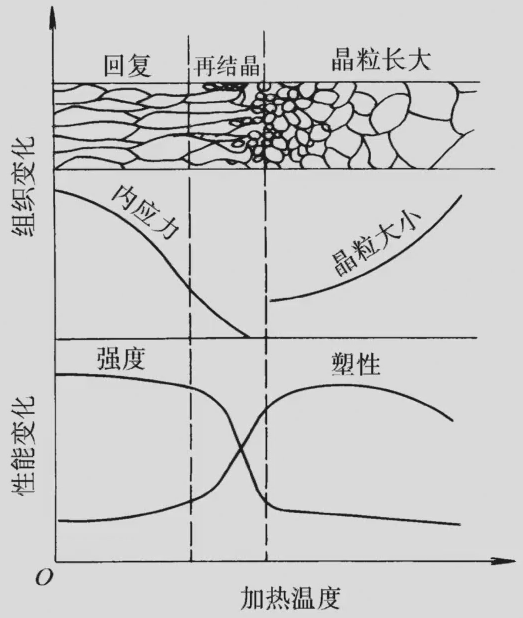</img>

- 回复是指在加热温度较低时，由于金属中的点缺陷及位错近距离迁移而引起的晶内某些变化。如**空位与其他缺陷合并、同一滑移面上的异号位错相遇合并**而使缺陷数量减少等。
- 位错的滑移和攀移运动使位错重新排列为更加稳定的状态。缺陷的减少，使金属的晶格畸变减轻。
- 在**回复阶段**，金属组织变化不明显，其强度、硬度略有下降，塑性略有提高，但**内应力、电阻率等显著下降**。
- 工业上，常利用回复现象**将冷变形金属低温加热**，既**稳定组织又保留加工硬化**，这种热处理方法称**去应力退火**。
#### 再结晶
- 冷变形组织在加热时重新彻底改组的过程称**再结晶**。
- 再结晶也是一个晶核形成和长大的过程，但**不是相变过程**，再结晶前后**新旧晶粒的晶格类型和成分完全相同**。
**影响再结晶温度的因素**
 
 
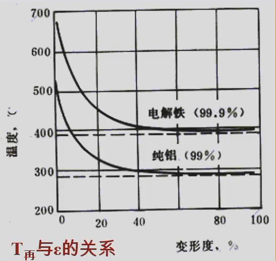</img>

1. 金属的预先变形程度:
   - **金属预先变形程度越大，再结晶温度越低**。当变形度达到一定值后，再结晶温度趋于某一最低值，称最低再结晶温度。
   - 纯金属的最低再结晶温度与其熔点之间的近似关系:
$$T_再=0.4T_熔(K)$$
   经常考！！！！！
   - 其中$T_再、T_熔$为绝对温度
   - **金属熔点越高，最低再结晶温度也越高**
1. 金属的纯度
   - 金属中的微量杂质或合金元素，尤其高熔点元素起阻碍扩散和晶界迁移作用
2. 再结晶加热速度和加热时间
   - 提高加热速度会使再结晶推迟到较高温度发生，延长加热时间,使原子扩散充分,再结晶温度降低
   - 生产中，把消除加工硬化的热处理称为再结晶退火。**再结晶退火温度**比再结晶温度高100~200℃:显然也高于去应力退火的温度。
#### 晶粒长大
再结晶完成后，若继续升高加热温度或延长保温时间，将发生晶粒长大，这是一个自发的过程。
### 影响再结晶退火后晶粒度的因素
1. 加热温度和保温时间
   加热温度越高，保温时间越长，金属的晶粒越粗大，加热温度的影响尤为显著。
2. 预先变形度
   预先变形度的影响，实质上是变形均匀程度的影响。
   - 当变形度很小时，晶格畸变小，不足以引起再结晶
   - 当变形达到2~10%时，只有部分晶粒变形，变形极不均匀，再结晶晶粒大小相差悬殊，易互相吞并和长大再结晶后晶粒特别粗大，这个变形度称**临界变形度**
### 金属的热加工
#### 热加工与冷加工
在金属学中，冷热加工的界限是以**再结晶温度**来划分的。低于再结晶温度的加工称为**冷加工**(易产生加工硬化)，而高于再结晶温度的加工称为**热加工**。（铸锻焊）
#### 热加工对金属组织和性能的影响
1. 热加工可使铸态金属与合金中的气孔焊合
2. 使粗大的树枝晶或拄状晶破碎，从而使组织致密、成分均匀、晶粒细化，力学性能提高。
3. 热加工使铸态金属中的非金属夹杂沿变形方向拉长，形成彼此平行的宏观条纹，称作**流线**，由这种流线体现的组织称**纤维组织**。它使钢产生各向异性，在制定加工工艺时，应使流线分布合理，尽量与拉应力方向一致。
4. 在加工亚共析钢时，发现钢中的F与P呈带状分布，这种组织称**带状组织**。带状组织使金属的力学性能呈现方向性，横向的塑性、韧性明显降低、并且切削性能也恶化。
### 形变强化
- 金属经冷塑性变形提高强度、硬度的方法。特别适合于**不能用热处理来强化**的金属。
- 常用的形变强化方法:冷挤、冷拉、冷轧、冷镦、冷压、滚压和喷丸。
## 金属的晶粒度对材料性能的影响
### 晶粒大小的控制
- 晶粒的大小称为晶粒度，通常用晶粒的平均面积或平均直径来表示。晶粒的大小取决于形核率和长大平均直径。速率的相对大小，即N/G比值越大，晶粒越细小可见。凡是能促进形核、抑制长大的因素，都能细化晶粒
- **晶粒愈细，晶界愈多，位错运动愈困难，强度与硬度愈高。同时，细小的晶粒使金属具有较好的塑性和韧性**
- 晶粒细化可提高金属强度、硬度而不降低塑性、韧性。
#### 过冷度
- **形核率**和**长大速率**都随过冷度的增大而增大。但两者的增加速率不同，形核率的增长率大于长大速率的增长率。在通常金属结晶时的过冷度范围内，过冷度越大，则N/G比值越大因而晶粒越细小。增加过冷度的方法是**提高液态金属的冷却速度**。
- 如，选用吸热和导热性较强的铸型材料(用金属型代替砂型);采用水冷铸型;降低浇注温度等。但这些措施只对小型或薄壁的铸件有效。
#### 异质晶核
是在浇注前往液态金属中加入某些难熔的固态粉末(变质剂)，促进非均匀形核来细化晶粒。
### 细晶强化的主要方法
1. 提高过冷度
2. 变质处理
3. 振动，增加晶核数目
### 细晶强化的应用
主要应用于铸造生产领域。
- 灰铸铁的孕育处理
- 铝活塞采用金属型铸造。
## 金属的合金化
### 固溶强化
溶质原子溶入金属基体而形成固溶体，使金属的**强度、硬度升高，塑性、韧性有所下降**，这一现象称为固溶强化。例如**单相**的黄铜单相锡青铜和铝青铜都是以固溶强化为主来提高合金强度和硬度的。(如置换型溶质原子或面心立方晶体中的间隙型溶质原子或体心立方晶体中的间隙型溶质原子造成点阵畸变，其应力场将与位错应力场发生弹性交互作用并阻碍位错运动，这是产生固溶强化的主要原因。)
### 第二相强化（时效强化或弥散强化）
单纯的固溶强化，其强化程度毕竟有限，还必须进一步以第二相或更多的相来强化。当第二相以细小弥散的微粒均匀分布于基体相中时，将阻碍位错运动，产生显著的强化作用
1. **时效强化（沉淀强化）**：第二相微粒是通过过饱和固溶体的时效处理而沉淀析出并产生的强化。
2. **弥散强化**：如果第二相微粒是通过粉末冶金方法加入并起强化作用。
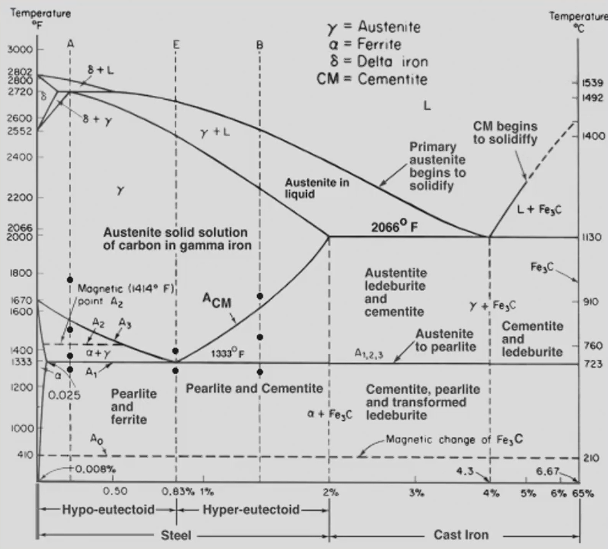</img>

### 铁碳相图
- 铁碳合金一碳钢和铸铁，是工业应用最广的合金。
- **含碳量为0.0218%~2.11%的称钢**
- **含碳量为 2.11%~6.69%的称铸铁**
### 合金的相
- 合金是指由两种或两种以上元素组成的具有金属特性的物质。
- 组成合金的元素可以是全部是金属，也可是金属与非金属。
- 组成合金的元素相互作用可形成不同的相。
### 相和组织
- 所谓**相**是指金属或合金中凡成分相同、结构相同，并与其它部分有界面分开的均匀组成部分。
- **显微组织**实质上是指在显微镜下观察到的金属中各相或各晶粒的形态、数量、大小和分布的组合。