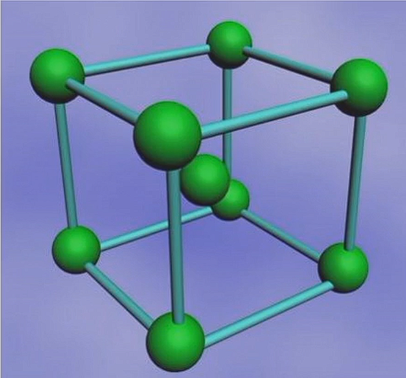

# 工程材料
## 第一章 工程材料的力学性能
</img>

**弹性**：指标为弹性极限$\sigma_e$，即材料承受最大弹性形变时的应力  
**刚度**：材料受力时抵抗弹性变形的能力，指标为弹性模量$E$
**强度**：材料在外力作用下抵抗变形和破坏的能力
**屈服强度**$\sigma_S$：材料发生微量塑性变形时的应力值 (s stands for start)
**条件屈服强度**$\sigma_{0.2}$：残余变形量为$0.2%$时的应力值
**抗拉强度**$\sigma_b$：材料断裂前所承受的最大应力值 (b stands for break)

**塑性**：材料受力破坏前可承受最大塑性变形的能力，指标为伸长率和断面收缩率
**伸长率**$\delta$：$\delta=\dfrac{l_1-l_0}{l_0}\times 100\%$ 
$l_1$为拉断后的长度，$l_0$为原始长度
**断面收缩率**$\psi$：$\psi = \dfrac{A_0-A_k}{A_0}\times 100\%$
$A_0$为试样的原始截面积，$A_k$为试样拉断处的截面积
**用面缩率表示塑性比伸长率更接近真实变形。**（二维指标准确性大于一维）
</img>

**疲劳强度**：材料在低于$\sigma_S$的重复交变应力作用下发生断裂的现象称为疲劳。
材料在规定次数应力循环后仍不发生断裂的最大应力为疲劳强度$\sigma_r$
**硬度**：材料抵抗表面局部塑性变形压痕、划痕的能力
1. 布氏硬度HB
   </img>
   $$HBS = \dfrac{F}{A} = \dfrac{F}{\pi D h}=\dfrac{F}{\pi D (\dfrac{D}{2}-\sqrt{(\dfrac{D}{2})^2-(\dfrac{d}{2})^2})} = \dfrac{2F}{\pi D (D-\sqrt{D^2-d^2})}$$
   **压球为钢头时**，布氏硬度用符号$HBS$表示，适用于布氏硬度值450以下的材料
   **压球为硬质合金球时**，布氏硬度用符号$HBW$表示，适用于布氏硬度值650以下的材料
   - 优点： 测量误差小，数据稳定
   - 缺点： 压痕大，不能用于太薄件，成品件
   - 适用场景： 退货，正火，调质钢，铸铁及有色金属的硬度
2. 洛氏硬度HR
   指标：压痕的深度
   根据压头类型和主载荷不同，分为九个标尺，常用的标尺为A、B、C
   - HRA用于测量高硬度材料,如硬质合金、表淬层和渗碳层
   - HRB用于测量低硬度材料，如有色金属和退火、正火钢等。
   - HRC用于测量中等硬度材料，如调质钢、淬火钢等。
   - 优点： 操作简便，压痕小，适用范围广
   - 缺点：测量结果分散度大
3. 维氏硬度HV
   $$HV = \dfrac{F}{A} = \dfrac{F}{\dfrac{d^2}{2sin68^{\circ}}}$$
**韧性**
**冲击韧性**： 材料抵抗冲击载荷作用而不破坏的能力，指标为冲击韧性值$a_k$（通过冲击实验测得）
**断裂韧性**： 带微裂纹的材料和零件阻止裂纹扩散的能力。
**应力强度因子**$K_1$： 裂纹尖端附近应力场的指标。
* 细晶强化可以同时增强增韧，否则对金属来说强度和韧性负相关
## 纯金属的晶体结构
### 晶格与晶胞
**晶体**：假想的直线将原子中心连接起来所形成的三维空间格架。直线的交点(原子中心)称**结点**。由结点形成的空间点的阵列称**空间点阵**。
**晶胞**： 能代表晶格原子排列规律的最小几何单元。
</img>

**晶格常数** ：晶胞各边的尺寸$a$,$b$,$c$，各棱间的夹角用$\alpha , \beta , \gamma$表示
### 晶系
- 根据晶胞参数不同，将晶体分为七种晶系
- 90%以上的金属具有立方晶系和六方晶系
**立方晶系**： $a=b=c,\alpha = \beta = \gamma = 90 ^\circ$
**六方晶系**： $a_1 = a_2 = a_3\neq c  ,\alpha = \beta = 90^\circ,\gamma = 120^\circ$（高不同）

原子半径**:晶胞中**原子密度最大方向上**相邻原子间距的一半。**

#### 体心立方晶格
</img>
- 原子半径： $r = \dfrac{\sqrt{3}}{4}a$
- 原子数： 2
- 配位数： 8
- 致密度： 0.68
- 常见金属： $\alpha - Fe,\delta - Fe,Cr,W,Mo,V$
- 特点：塑性较差

#### 面心立方晶格
</img>

- 原子半径：$r = \dfrac{\sqrt{2}}{4}a$
- 原子数： 4
- 配位数： 12
- 致密度： 0.74
- 常见金属： $\gamma - Fe, Ni,Al,Cu,Pb,Au$
- 特点：塑性较好（咬金）

#### 密排六方晶格
</img>

- 晶格常数：底面边长$a$和高$c$，有$\dfrac{c}{a}=1.633$
- 原子半径：$\dfrac{1}{2}a$
- 原子个数：6
- 配位数：12
- 致密度：0.74
- 常见金属：$Mg,Zn,Be,Cd$（有色金属）
- 特点：塑性较差
### 立方晶系晶面、晶向表示方法
</img>

#### 晶面和晶面指数
晶面是一系列原子组成的平面。表示晶面的符号称为晶面指数。  
**晶面指数的确定方法**
1. 选坐标，以晶格中某一原子为原点(注意不要把原点放在所求的晶面上)，以晶胞的三个棱边作为三维坐标的坐标轴。
</img>

2. 以相应的晶格常数为单位，求出待定晶面在三个轴上的截距。
3. 求三个截距的倒数
4. 将所得数值化为最小整数，加圆括弧，形式为(xyz) *这里的xyz表示顺序
5. 负数在数字上加横线，如右图
#### 晶向和晶向指数
任意两个原子之间的连线为原子列，其所指方向为晶向。  
**晶向指数的确定方法**
</img>

1. 确定原点，把晶向起点平移到原点，计算坐标
2. 将比例化为最简，加方括号，形式为[xyz]
#### 晶面族和晶向族
- (hkl)和[uvw]分别表示的是一组平行的晶面和晶向
- 指数虽然不同，但原子排列完全相同的晶向和晶面称作晶向族或晶面族。
- 在立方晶系中，指数相同的晶面与晶向相互垂直。
### 缺陷
#### 点缺陷
空间三维尺寸都很小的缺陷
- 空位
- 间隙原子
- 置换原子
#### 线缺陷
晶体中的位错：格中一部分晶体相对于另一部分晶体发生局部滑移，滑移面上滑移区与未滑移区的交界线称作位错。分为**刃型位错**和**螺型位错**
