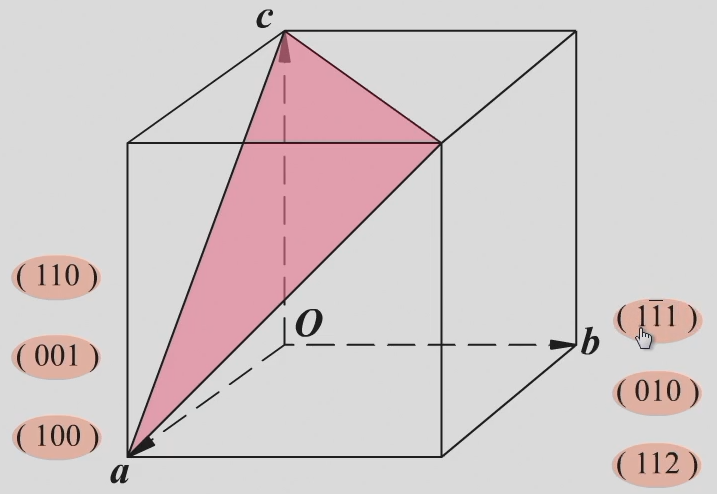
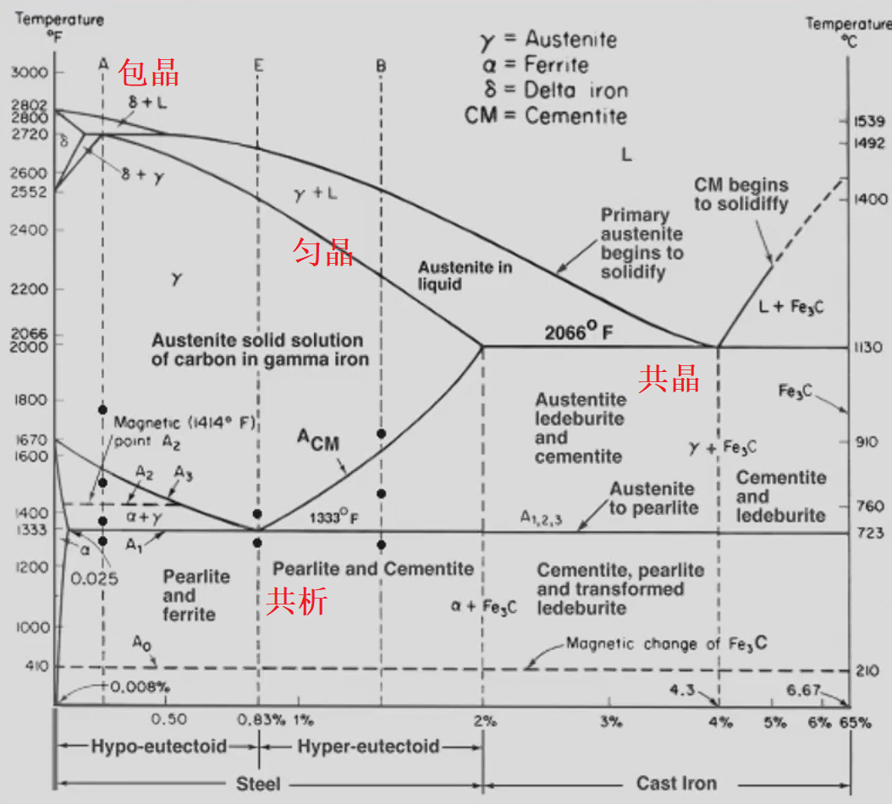
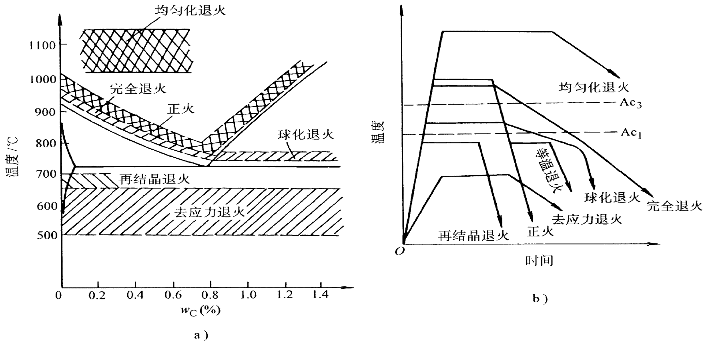

# 工程材料期末复习 by zjuatri
## 第一章 工程材料的力学性能
</img>

**弹性**：指标为弹性极限$\sigma_e$，即材料承受最大弹性形变时的应力  
**刚度**：材料受力时抵抗弹性变形的能力，指标为弹性模量$E$
**强度**：材料在外力作用下抵抗变形和破坏的能力
**屈服强度**$\sigma_S$：材料发生微量塑性变形时的应力值 (s stands for start)
**条件屈服强度**$\sigma_{0.2}$：残余变形量为$0.2%$时的应力值
**抗拉强度**$\sigma_b$：材料断裂前所承受的最大应力值 (b stands for break)

**塑性**：材料受力破坏前可承受最大塑性变形的能力，指标为**伸长率**$\delta$和**断面收缩率**$\psi$
**用面缩率表示塑性比伸长率更接近真实变形。**（二维指标准确性大于一维）
</img>

**疲劳强度**：材料在低于$\sigma_S$的重复交变应力作用下发生断裂的现象称为疲劳。
材料在规定次数应力循环后仍不发生断裂的最大应力为疲劳强度$\sigma_r$
**硬度**：材料抵抗表面局部塑性变形压痕、划痕的能力
1. 布氏硬度HB
   </img>
   **压球为钢头时**，布氏硬度用符号$HBS$表示，适用于布氏硬度值450以下的材料
   **压球为硬质合金球时**，布氏硬度用符号$HBW$表示，适用于布氏硬度值650以下的材料
   - 优点： 测量误差小，数据稳定
   - 缺点： 压痕大，不能用于太薄件，成品件
   - 适用场景： 退货，正火，调质钢，铸铁及有色金属的硬度
2. 洛氏硬度HR
   指标：压痕的深度
   根据压头类型和主载荷不同，分为九个标尺，常用的标尺为A、B、C
   - HRA用于测量高硬度材料,如硬质合金、表淬层和渗碳层
   - HRB用于测量低硬度材料，如有色金属和退火、正火钢等。
   - HRC用于测量中等硬度材料，如调质钢、淬火钢等。
   - 优点： 操作简便，压痕小，适用范围广
   - 缺点：测量结果分散度大
3. 维氏硬度HV
**韧性**
**冲击韧性**： 材料抵抗冲击载荷作用而不破坏的能力，指标为冲击韧性值$a_k$（通过冲击实验测得）
**断裂韧性**： 带微裂纹的材料和零件阻止裂纹扩散的能力。
**应力强度因子**$K_1$： 裂纹尖端附近应力场的指标。
* 细晶强化可以同时增强增韧，否则对金属来说强度和韧性负相关
## 纯金属的晶体结构
### 晶格与晶胞
**晶体**：假想的直线将原子中心连接起来所形成的三维空间格架。直线的交点(原子中心)称**结点**。由结点形成的空间点的阵列称**空间点阵**。
**晶胞**： 能代表晶格原子排列规律的最小几何单元。
</img>

**晶格常数** ：晶胞各边的尺寸$a$,$b$,$c$，各棱间的夹角用$\alpha , \beta , \gamma$表示
### 晶系
- 根据晶胞参数不同，将晶体分为七种晶系
- 90%以上的金属具有立方晶系和六方晶系
**立方晶系**： $a=b=c,\alpha = \beta = \gamma = 90 ^\circ$
**六方晶系**： $a_1 = a_2 = a_3\neq c  ,\alpha = \beta = 90^\circ,\gamma = 120^\circ$（高不同）

原子半径:晶胞中**原子密度最大方向上**相邻原子间距的一半。

#### 体心立方晶格
</img>
- 原子半径： $r = \dfrac{\sqrt{3}}{4}a$
- 原子数： 2
- 配位数： 8
- 致密度： 0.68
- 常见金属： $\alpha - Fe,\delta - Fe$
- 特点：塑性较差

#### 面心立方晶格
</img>

- 原子半径：$r = \dfrac{\sqrt{2}}{4}a$
- 原子数： 4
- 配位数： 12
- 致密度： 0.74
- 常见金属： $\gamma - Fe$
- 特点：塑性较好（咬金）

#### 密排六方晶格
</img>

- 晶格常数：底面边长$a$和高$c$，有$\dfrac{c}{a}=1.633$
- 原子半径：$\dfrac{1}{2}a$
- 原子个数：6
- 配位数：12
- 致密度：0.74
- 常见金属：$Mg,Zn,Be,Cd$（有色金属）
- 特点：塑性较差
### 立方晶系晶面、晶向表示方法
</img>

#### 晶面和晶面指数
晶面是一系列原子组成的平面。表示晶面的符号称为晶面指数。  
**晶面指数的确定方法**
1. 选坐标，以晶格中某一原子为原点(注意不要把原点放在所求的晶面上)，以晶胞的三个棱边作为三维坐标的坐标轴。

</img>

1. 以相应的晶格常数为单位，求出待定晶面在三个轴上的截距。
2. 求三个截距的倒数
3. 将所得数值化为最小整数，加圆括弧，形式为(xyz) *这里的xyz表示顺序
4. 负数在数字上加横线，如右图
#### 晶向和晶向指数
任意两个原子之间的连线为原子列，其所指方向为晶向。
 
</img>

**晶向指数的确定方法**
1. 确定原点，把晶向起点平移到原点，计算坐标
2. 将比例化为最简，加方括号，形式为[xyz]
#### 晶面族和晶向族
- (hkl)和[uvw]分别表示的是一组平行的晶面和晶向
- 指数虽然不同，但原子排列完全相同的晶向和晶面称作晶向族或晶面族。
- 在立方晶系中，指数相同的晶面与晶向相互垂直。
### 缺陷
#### 点缺陷
空间三维尺寸都很小的缺陷
- 空位
- 间隙原子
- 置换原子
#### 线缺陷
晶体中的位错：格中一部分晶体相对于另一部分晶体发生局部滑移，滑移面上滑移区与未滑移区的交界线称作位错。分为**刃型位错**和**螺型位错**
</img>

**刃型位错**
当一个完整晶体某晶面以上的某处多出半个原子面，该晶面像刀刃一样切入晶体，这个多余原子面的边缘就是刃型位错。
</img>

**位错密度**:单位体积内所包含的位错线总长度。
#### 面缺陷
**晶界**是不同位向晶粒的过渡部位，宽度为5 ~ 10个原子间距，位向差一般为20° ~ 40°
**亚晶粒**是组成晶粒的尺寸很小，位向差也很小(10°~2°)的小晶块。
亚晶粒之间的交界面称**亚晶界**。亚晶界也可看作位错壁。
### 纯金属的结晶
</img>

纯金属都有一个理论结晶温度$T_0$(熔点或平衡结晶温度)。在该温度下,液体和晶体处于**动平衡状态**。
结晶只有在$T_0$以下的实际结晶温度下才能进行。
简单理解，就是水在0℃结成冰
液态金属在理论结晶温度以下开始结晶的现象称**过冷**。
理论结晶温度与实际结晶温度的差$\Delta T$称**过冷度**
过冷度大小与冷却速度有关，**过冷度越大，冷速越大。**
#### 纯金属的结晶过程
1. 晶核形成
形核有两种方式，即**自发形核和非自发形核**。
由液体中排列规则的原子团形成晶核称**自发形核**。
以液体中存在的固态杂质为核心形核称**非自发形核**。
**非自发形核**比自发形核更重要。
*中国足球，只有中国人是自发形核，引黑人是非自发形核，非自发形核就比较强（（
1. 晶核长大
- 长大方式分为**均匀长大**和**树枝状长大**
- 晶粒的大小取决于晶核的**形成速度**和**长大速度**
- 单位时间、单位体积内形成的晶核数目叫**形核率(N)**
- 单位时间内晶核生长的长度叫**长大速度(G)**
- N/G比值越大，晶粒越细小。因此，凡是促进形核、抑制长大的因素，都能细化晶粒。

#### 细化铸态金属晶粒的措施
**增加过冷度**：随过冷度增加，N/G值增加，晶粒变细
**变质处理**：又称孕育处理。即有意向液态金属内加入非均匀形核物质从而细化晶粒的方法。所加入的非均匀形核物质叫变质剂(或称孕育剂)
## 第二章 金属的塑性变形与再结晶
### 塑性变形
#### 滑移
- 在切应力作用下，晶体的一部分原子相对另一部分原子，沿着一定的晶面(滑移面)和一定的方向(滑移方向)相对滑动的结果。
- 滑移只有在**切应力**作用下才能进行,只有当作用在晶面上的切应力达到临界值时，材料才会发生塑性变形。
- 晶体的滑移不是只发生在一个晶面上，而是在相邻的一组晶面上同时或先后发生从而形成明显的**滑移带**。
#### 滑移的同时伴随着晶体的转动
转动有两种:滑移面向外力轴方向转动和滑移面上滑移方向向最大切应力方向转动。
</img>

看不懂图思密达
#### 孪生 不做要求 不写了
#### 单晶体金属的塑性变形
</img>

- 单晶体受力后，外力在任何晶面上都可分解为正应力和切应力。正应力只引起晶格弹性伸长进而被拉断;切应力使晶格产生弹性扭曲后滑移。
- 正应力**只能造成晶体的弹性变形**或断裂而**不能引起晶体的塑性变形**
- 滑移**只能在切应力的作用下发生**。产生滑移的最小切应力称**临界切应力**
- 滑移常沿晶体中**原子密度最大**的晶面和晶向发生。**因原子密度最大的晶面和晶向之间原子间距最大，结合力最弱，产生滑移所需切应力最小。**
- 沿其发生滑移的晶面和晶向分别叫做**滑移面**和**滑移方向**。通常是晶体中的密排面和密排方向。
#### 滑移系
一个滑移面和其上的一个滑移方向构成一个滑移系。
</img>

- 滑移系越多，金属发生滑移的可能性越大，**塑性也
越好，其中滑移方向对塑性的贡献比滑移面更大**。  
- 因而金属的塑性，**面心立方晶格好于体心立方晶格
体心立方晶格好于密排六方晶格**
#### 塑性变形的实质
滑移是通过滑移面上位错的运动来实现的，不是刚性整体滑动。  
晶体通过位错运动产生滑移时，**只在位错中心的少数原子发生移动**，它们移动的距离**远小于一个原子间距**，因而所需**临界切应力小**，这种现象称作位错的易动性
。
#### 多晶体的塑性变形
##### 晶界的阻碍作用
- 当位错运动到晶界附近时，受到晶界的阻碍而堆积起来,称**位错的塞积**。要使变形继续进行,则必须增加外力，从而使金属的变形抗力提高。
##### 各晶粒变形需要相互协调
由于各相邻晶粒位向不同，当一个晶粒发生塑性变形时，为了保持金属的连续性，周围的晶粒若不发生塑性变形，则必以弹性变形来与之协调。这种弹性变形便成为塑性变形晶粒的变形阻力。由于晶粒间的这种相互约束，**使得多晶体金属的塑性变形抗力提高。**
##### 各晶粒变形的不同时
单个晶粒变形与单晶体相似,多晶体变形比单晶体复杂。
#### 塑性变形对金属组织的影响
##### 纤维组织形成
金属发生塑性变形时，外形发生变化，其内部的晶粒也相应地被拉长或压扁。当变形量很大时，晶粒将被拉长为纤维状。性能趋于各向异性，纵向性能高于横向性能。（纵向晶界多）
</img>

*钢丝吊工件进行热处理，退火之后钢丝断裂，为什么喵
纤维状晶粒热处理后变回等轴形状了，强度下降了喵（即
再结晶退火）
#### 亚结构形成
塑性变形还使晶粒破碎为亚晶粒。胞壁由高密度位错构成。
#### 形变织构的产生
晶粒的转动，当塑性变形达到一定程度时，会使绝大部分晶粒的某一位向与变形方向趋于一致，这种现象称**织构或择优取向**
#### 塑性变形对金属性能的影响
##### 产生加工硬化现象
随冷塑性变形量增加，金属的**强度、硬度提高，塑性、韧性下降**的现象称**加工硬化。**
#### 使金属的性能产生各向异性
形变织构使金属呈现**各向异性**，在深冲零件时，易产生“制耳”现象，使零件边缘不齐，厚薄不匀。但织构可**提高硅钢片的导磁率**。
</img>

##### 影响金属的物理、化学性能
##### 产生参与内应力

#### 塑性变形后的金属加热加热时组织和性能的变化
金属经冷变形后，组织处于不稳定状态,有自发恢复到稳定状态的倾向。**但在常温下，原子扩散能力小,不稳定状态可长时间维持。**加热可使原子扩散能力增加，金属将依次发生**回复、再结晶和晶粒长大**。
 

##### 回复
</img>

- 回复是指在加热温度较低时，由于金属中的点缺陷及位错近距离迁移而引起的晶内某些变化。如**空位与其他缺陷合并、同一滑移面上的异号位错相遇合并**而使缺陷数量减少等。
- 位错的滑移和攀移运动使位错重新排列为更加稳定的状态。缺陷的减少，使金属的晶格畸变减轻。
- 在**回复阶段**，金属组织变化不明显，其强度、硬度略有下降，塑性略有提高，但**内应力、电阻率等显著下降**。
- 工业上，常利用回复现象**将冷变形金属低温加热**，既**稳定组织又保留加工硬化**，这种热处理方法称**去应力退火**。
##### 再结晶
- 冷变形组织在加热时重新彻底改组的过程称**再结晶**。
- 再结晶也是一个晶核形成和长大的过程，但**不是相变过程**，再结晶前后**新旧晶粒的晶格类型和成分完全相同**。
**影响再结晶温度的因素**
 
 
 

1. 金属的预先变形程度:
</img>

   - **金属预先变形程度越大，再结晶温度越低**。当变形度达到一定值后，再结晶温度趋于某一最低值，称最低再结晶温度。
   - 纯金属的最低再结晶温度与其熔点之间的近似关系:
$$T_再=0.4T_熔(K)$$
   经常考！！！！！
   - 其中$T_再、T_熔$为绝对温度
   - **金属熔点越高，最低再结晶温度也越高**
1. 金属的纯度
   - 金属中的微量杂质或合金元素，尤其高熔点元素起阻碍扩散和晶界迁移作用
2. 再结晶加热速度和加热时间
   - 提高加热速度会使再结晶推迟到较高温度发生，延长加热时间,使原子扩散充分,再结晶温度降低
   - 生产中，把消除加工硬化的热处理称为再结晶退火。**再结晶退火温度**比再结晶温度高100~200℃:显然也高于去应力退火的温度。
##### 晶粒长大
再结晶完成后，若继续升高加热温度或延长保温时间，将发生晶粒长大，这是一个自发的过程。
### 影响再结晶退火后晶粒度的因素
1. 加热温度和保温时间
   加热温度越高，保温时间越长，金属的晶粒越粗大，加热温度的影响尤为显著。
2. 预先变形度
   预先变形度的影响，实质上是变形均匀程度的影响。
   - 当变形度很小时，晶格畸变小，不足以引起再结晶
   - 当变形达到2~10%时，只有部分晶粒变形，变形极不均匀，再结晶晶粒大小相差悬殊，易互相吞并和长大再结晶后晶粒特别粗大，这个变形度称**临界变形度**
#### 金属的热加工
##### 热加工与冷加工
在金属学中，冷热加工的界限是以**再结晶温度**来划分的。低于再结晶温度的加工称为**冷加工**(易产生加工硬化)，而高于再结晶温度的加工称为**热加工**。（铸锻焊）
#### 热加工对金属组织和性能的影响
1. 热加工可使铸态金属与合金中的气孔焊合
2. 使粗大的树枝晶或拄状晶破碎，从而使组织致密、成分均匀、晶粒细化，力学性能提高。
3. 热加工使铸态金属中的非金属夹杂沿变形方向拉长，形成彼此平行的宏观条纹，称作**流线**，由这种流线体现的组织称**纤维组织**。它使钢产生各向异性，在制定加工工艺时，应使流线分布合理，尽量与拉应力方向一致。
4. 在加工亚共析钢时，发现钢中的F与P呈带状分布，这种组织称**带状组织**。带状组织使金属的力学性能呈现方向性，横向的塑性、韧性明显降低、并且切削性能也恶化。
#### 形变强化
- 金属经冷塑性变形提高强度、硬度的方法。特别适合于**不能用热处理来强化**的金属。
- 常用的形变强化方法:冷挤、冷拉、冷轧、冷镦、冷压、滚压和喷丸。
### 金属的晶粒度对材料性能的影响
#### 晶粒大小的控制
- 晶粒的大小称为晶粒度，通常用晶粒的平均面积或平均直径来表示。晶粒的大小取决于形核率和长大平均直径。速率的相对大小，即N/G比值越大，晶粒越细小可见。凡是能促进形核、抑制长大的因素，都能细化晶粒
- **晶粒愈细，晶界愈多，位错运动愈困难，强度与硬度愈高。同时，细小的晶粒使金属具有较好的塑性和韧性**
- 晶粒细化可提高金属强度、硬度而不降低塑性、韧性。
##### 过冷度
- **形核率**和**长大速率**都随过冷度的增大而增大。但两者的增加速率不同，形核率的增长率大于长大速率的增长率。在通常金属结晶时的过冷度范围内，过冷度越大，则N/G比值越大因而晶粒越细小。增加过冷度的方法是**提高液态金属的冷却速度**。
- 如，选用吸热和导热性较强的铸型材料(用金属型代替砂型);采用水冷铸型;降低浇注温度等。但这些措施只对小型或薄壁的铸件有效。
##### 异质晶核
是在浇注前往液态金属中加入某些难熔的固态粉末(变质剂)，促进非均匀形核来细化晶粒。
### 细晶强化的主要方法
1. 提高过冷度
2. 变质处理
3. 振动，增加晶核数目
#### 细晶强化的应用
主要应用于铸造生产领域。
- 灰铸铁的孕育处理
- 铝活塞采用金属型铸造。
### 金属的合金化
#### 固溶强化
溶质原子溶入金属基体而形成固溶体，使金属的**强度、硬度升高，塑性、韧性有所下降**，这一现象称为固溶强化。例如**单相**的黄铜单相锡青铜和铝青铜都是以固溶强化为主来提高合金强度和硬度的。(如置换型溶质原子或面心立方晶体中的间隙型溶质原子或体心立方晶体中的间隙型溶质原子造成点阵畸变，其应力场将与位错应力场发生弹性交互作用并阻碍位错运动，这是产生固溶强化的主要原因。)
### 第二相强化（时效强化或弥散强化）
单纯的固溶强化，其强化程度毕竟有限，还必须进一步以第二相或更多的相来强化。当第二相以细小弥散的微粒均匀分布于基体相中时，将阻碍位错运动，产生显著的强化作用
1. **时效强化（沉淀强化）**：第二相微粒是通过过饱和固溶体的时效处理而沉淀析出并产生的强化。
2. **弥散强化**：如果第二相微粒是通过粉末冶金方法加入并起强化作用。

## 第三章 铁碳合金
### 合金的相
- 合金是指由两种或两种以上元素组成的具有金属特性的物质。
- 组成合金的元素可以是全部是金属，也可是金属与非金属。
- 组成合金的元素相互作用可形成不同的相。

### 相和组织
- 所谓**相**是指金属或合金中凡成分相同、结构相同，并与其它部分有界面分开的均匀组成部分。
- **显微组织**实质上是指在显微镜下观察到的金属中各相或各晶粒的形态、数量、大小和分布的组合。
### 相图
相图是用来表示合金系中各合金在**缓冷**条件下结晶过程的简明图解。又称状态图或平衡图，相图的建立一般采用热分析法，即测量不同元素含量的合金随时间的温度变化来判断相变。
### 匀晶反应的合金的结晶

- 两组元在液态和固态下均无限互溶时所构成的相图称二元匀晶相图
- 相图由两条线构成，上面是液相线，下面是固相线。
- 相图被两条线分为三个相区，液相线以上为液相区L，固相线以下为α固溶体区，两条线之间为两相共存的两相区(L+α)
- 除纯组元外，其它成分合金结晶过程相似，以$Cu-Ni$合金为例说明。
- 当液态金属自高温冷却到$t_1$温度时，开始结晶出成分为$\alpha_1$的固溶体，其Ni含量高于合金平均成分
- 这种从液相中结晶出单一固相的转变称为**匀晶转变或匀晶反应**。
- 随温度下降，固溶体重量增加，液相重量减少。同时，液相成分沿液相线变化，固相成分沿固相线变化。
- 成分变化是通过原子扩散完成的。当合金冷却到$t_3$时，最后一滴$L_3$成分的液体也转变为固溶体，此时固溶体的成分又变回到合金成分$\alpha_3$上来
- 液固相线不仅是相区分界线,也是结晶时两相的成分变化线;匀晶转变是变温转变

*二元匀晶结晶过程中液相和固相的成分通过原子扩散分别沿着液相线和固相线变化。(√)
### 杠杆定律

以$Cu-Ni$合金为例
1. 确定两平衡相的成分:设合金成分为x，过x做成分垂线。在成分垂线相当于温度t的o点作水平线，其与液固相线交点a、b所对应的成分$x_1,x_2$即分别为液相和固相的成分。
2. 确定两平衡相的相对重量（**杠杆定律**）：
   设合金的重量为1，液相的重量为$Q_L$，固相的重量为$Q_\alpha$
   $$\begin{cases}
      Q_L+Q\alpha=1\\Q_Lx_1+Q\alpha x_2=x
   \end{cases}$$
   解得
   $$\begin{cases}
      Q_L=\dfrac{x_2-x}{x_2-x_1}\\Q_\alpha=\dfrac{x_1-x}{x_2-x_1}
   \end{cases}$$
   式中$x_2-x,x_2-x_1,x_1-x$分别对应图中$bo,ab,ao$的长度。
   也即
   $$\begin{cases}
      Q_L=\dfrac{bo}{ab}\\ \\ Q_\alpha=\dfrac{ao}{ab}
   \end{cases}$$

- 在杠杆定律中，杠杆的支点是合金的成分，杠杆的端点是所求的两平衡相(或两组织组成物)的成分。
- 注意：**杠杆定律只适用于两相区。**
### 共晶反应的合金的结晶
当两组元在液态下完全互溶，在固态下有限互溶,并发生共晶反应时所构成的相图称作共晶相图。以$Pb-Sn$合金为例
#### 相图分析
</img>

1. 相：相图中有L、α、β三种相，α是溶质Sn在Pb中的固溶体，β是溶质Pb在Sn中的固溶体。
2. 相区：相图中有三个单相区:L、α、β;三个两相区:L+α、L+β、α+β;一个三相区:即水平线cde.
3. 液固相线：液相线adb，固相线acdeb。a、b分别为Pb、Sn的熔点。
4. 固溶线：溶解度点的连线称固溶线。相图中的cf、eg线分别为Sn在Pb中和Pb在Sn中的固溶线。固溶体的溶解度随温度降低而下降。
5. 共晶线：水平线cde叫做共晶线。在共晶线对应的温度下(183°C)，e点成分的合金同时结晶出c点成分的α固溶体和e点成分的β固溶体，形成这两个相的机械混合物:$L_d\ce{<=>}(\alpha_c+\beta_e)$该反应叫**共晶转变或共晶反应**。

- 共晶反应的产物，即两相的机械混合物称共晶体或共晶组织。发生共晶反应的温度称共晶温度。代表共晶温度和共晶成分的点称共晶点
- 具有共晶成分的合金称共晶合金。在共晶线上，凡成分位于共晶点以左的合金称亚共晶合金，位于共晶点以右的合金称过共晶合金。
#### 结晶过程
 
##### 含Sn量小于c点合金(I合金)的结晶过程
- 在3点以前为匀晶转变，结晶出单相α固溶体，这种直接从液相中结晶出的固相称一次相或初生相
- 温度降到3点以下，α固溶体被Sn过饱和，由于晶格不稳，开始析出(相变过程也称析出)新相一β相（记作$\beta_{II}$）由已有固相析出的新固相称二次相或次生相。形成二次相的过程称二次析出，是固态相变的一种
- 随温度下降，α和β相的成分分别沿cf线和eg线变化，$\beta_{II}$的重量增加。

*次生相的晶粒尺寸小于初生相，因为析出温度更低，过冷度更大。
##### 共晶合金(II合金)的结晶过程
</img>

- 液态合金冷却到d点时同时被Pb和Sn饱和，发生共晶反应
- 在共晶转变过程中，L、α、β三相共存,三个相的量在不断变化，但它们各自成分是固定的。
共晶转变结束时，α和β相的相对重量百分比为:
$$Q_\alpha=\frac{de}{ce}\\ \space \\Q_\beta=\frac{cd}{ce}$$
##### 亚共晶合金(Ⅲ合金)的结晶过程
合金液体在2点以前为匀晶转变。冷却到2点，固相成分变化到c点，液相成分变化到d点，此时两相的相对重量为:
$$Q_L=\frac{c2}{cd},Q_\alpha = \frac{d2}{cd}$$
温度继续下降，将从一次相和共晶组织中的α析出β，从共晶中的β固溶体析出$\alpha_{II}$。忽略共晶组织α+β析出的次生相，其室温组织$α +(α+β)+β_{II}$。
##### 过共晶合金（合金Ⅳ）
将亚共晶合金中α和β交换位置，其室温组织为$β +(α+β)+α_{II}$
### 包晶反应的合金的结晶（了解，铁碳相图的包金区域不考）
</img>
在一定温度下，由一个液相包着一个固相生成另一新固相的反应称包晶转变或包晶反应。
当两组元在液态下完全互溶，在固态下有限互溶并发生包晶反应时所构成的相图称作包晶相图。以$Pt-Ag$合金为例
#### 相图分析
- 单相区：L、α、β
- 二相区：L+α、α+β、L+β
- 三相区：L+α+β（水平线PDC）
- 水平线PDC称包晶线，与该线成分对应的合金在该温度下发生包晶反应:$L_C+\alpha_P\ce{<=>}\beta_D$。该反应是液相L包着固相α、新相β在L与α的界面上形核，并向L和α两个方向长大。
#### 结晶过程（略）

### 共析反应的合金的结晶
</img>

共析反应(共析转变)是指在一定温度下，由一定成分的固相同时析出两个成分和结构完全不同的新固相的过程。共析转变也是固态相变。最常见的共析转变是铁碳合金中的珠光体转变：$\gamma_s\ce{<=>}\alpha_P+Fe_3C$。共析反应的产物是共析体(铁碳合金中的共析体称珠光体)，也是两相的机械混合物(铁素体+渗碳体)。
*铁碳相图中 γ-奥氏体（烧红的铁） α-铁素体 Fe3C-渗碳体
对铁碳合金的淬火退火等处理都在铁碳相图的共析区域
#### 相图分析
共析相图与共晶相图相似，对应的有共析线(PSK线)、共析点(S点)、共析温度、共析成分、共析合金(共析成分合金)、亚共析合金(共析线上共析点以左的合金)、过共析合金(共析线上共析点以右的合金)。
#### 共晶反应和共析反应的区别
- 与共晶反应不同的是，共析反应的母相是固相，而不是液相。
- 另外，由于固态转变过冷度大，因而共析组织比共晶组织细。
### 铁碳合金
铁和碳可形成一系列稳定化合物:$FeC、Fe_2C、Fe_3C$，它们都可以作为纯组元看待。含碳量大于$Fe_3C$成分(6.69%)时，合金太脆，已无实用价值。实际所讨论的铁碳合金相图是$Fe-Fe_3C$相图
#### 铁碳合金的组元
$Fe,Fe_3C$
#### 铁碳合金的相
##### 液相L
##### δ相
高温铁素体，在1394℃以上存在
##### 铁素体
碳在α-Fe中的固溶体称铁素体,用F或α表示。铁素体是体心立方间隙固溶体。
- 铁素体的溶碳能力很低,在727℃时最大为**0.0218%**，室温下仅为**0.0008%**。
- 铁素体的组织为多边形晶粒，性能与纯铁相似。
##### 奥氏体
碳在γ-Fe中的固溶体称奥氏体。用A或γ表示。是面心立方晶格（塑性更好）的间隙固溶体。
- 溶碳能力比铁素体大，1148'C时最大为**2.11%**,727℃时为0.77%。
- 组织为不规则多面体晶粒，晶界较直。强度低、塑性好，钢材**热加工都在γ区进行**.碳钢室温组织中无奥氏体。
##### 渗碳体
即$Fe_3C$,含碳6.69%,用$Fe_3C$或$C_m$表示。
- $Fe_3C$**硬度高**、强度低，脆性大，塑性几乎为零。
- 由于碳在α-Fe中的溶解度很小，因而常温下碳在铁碳合金中主要以$Fe_3C$或石墨的形式存在。
- $Fe_3C$是一个亚稳相，在一定条件下可发生分解:$Fe_3C\rightarrow3Fe+C(石墨)$,该反应对**铸铁**有重要意义。

*为什么奥氏体溶碳能力大于铁素体
1. 奥氏体温度大于铁素体，温度越高碳的溶解度越大，原子活性也越大
2. 面心立方晶格晶胞中间无占位原子，溶碳能力更高。体心立方晶格中心原子将晶格碎片化，不利于溶碳。
#### 铁的同素异构转变（？）
- 物质在固态下晶体结构随温度变化的现象称**同素异构**转变。同素异构转变属于相变之一：固态相变。
- 铁在固态冷却过程中有两次晶体结构变化，其变化为:
$$\delta-Fe\overset{1394℃}{\ce{<=>}}\gamma-Fe\overset{912℃}{\ce{<=>}}\alpha-Fe$$
#### 铁碳合金的基本组织
##### 铁素体，奥氏体，渗碳体
##### 珠光体（共析组织）
铁素体与$Fe_3C$的机械混合物，用P表示。
- 珠光体的组织特点是两相呈片层相间分布,性能介于两相之间。
- 珠光体在光镜下呈指纹状.
##### 莱氏体（共晶组织）
- 高温莱氏体:727℃以上，奥氏体与渗碳体，以Ld表示
- 低温莱氏体:727℃以下，珠光体与渗碳体，以Ld'表示
- 为蜂窝状,以$Fe_3C$为基，性能硬而脆。
### 简化后的铁碳相图（相图分析）

#### 特征点
主要看说明部分，考试时会给出各点温度和碳含量，但是不会给出各相区的成分
|符号|T/℃|C%|说明|
|-|-|-|-|
|A|1538|0|纯铁的熔点|
|C|1148|4.30|共晶点 $L_c\ce{<=>}\gamma_E+Fe_3C$|
|D|1227|6.69|渗碳体的熔点|
|E|1148|2.11|碳在$\gamma-Fe$中的最大溶解度|
|F|1148|6.69|渗碳体的成分点|
|G|912|0|纯铁α和γ转化温度|
|K|727|6.69|渗碳体的成分点|
|P|727|0.0218|碳在$\alpha-Fe$中的最大溶解度|
|S|727|0.77|共析点$\gamma_s\ce{<=>}\alpha_p+Fe_3C$|
#### 特征线
- 液相线：ACD
- 固相线：AECFD
- 共晶线：ECF，共晶产物莱氏体
- 共析线：PSK，又称为$A_1$线，共析产物珠光体
- $A_{cm}$线：碳在$\gamma-Fe$中的固溶线，即$ES$线，记忆方法是随温度升高而增大
- $A_3$线：$\gamma\ce{<=>}\alpha$转化线，即GS线
#### 铁碳合金的分类
|含碳量|合金种类|
|-|-|
|0-0.0218%|工业纯铁|
|0.0218%-0.77%|亚共析钢|
|0.77%|共析钢|
|0.77%-2.11%|过共析钢|
|2.11%-4.3%|亚共晶白口铸铁|
|4.3%|共晶白口铸铁|
|4.3%-6.69%|过共晶白口铸铁|

</img>
*白口铸铁的铸造性能好，硬而脆
 
 
 

#### 结晶
##### 共析钢的结晶过程
合金液体在1-2点间转变为γ。到S点发生共析转变
$$\gamma_S\ce{<=>}\alpha_P+Fe_3C$$
γ全部转变为珠光体
室温下珠光体两相的相对重量百分比
$$Q_\alpha=\frac{6.69-0.77}{6.69-0.0008}=88.5\%\\Q_{Fe_3C}=1-Q_\alpha=11.5\%$$

##### 亚共析钢的结晶过程 

合金在4点以前通过匀晶一包晶一匀晶反应全部转变为γ。到4点，由γ中析出α。到5点,成分沿GS线变到S点，γ发生共析反应转变为珠光体。

共析温度下**相**的相对质量
$$Q_{Fe_3C}=\frac{P5}{PK}\\\space \\Q_{\alpha}=\frac{5K}{PK}$$
</img>

K点在上方完整铁碳相图中，5点为右图
共析温度下**组织**的相对质量
$$Q_{P}=\frac{P5}{PS}\\\space \\Q_{\alpha}=\frac{5S}{PS}$$
*利用平衡组织中珠光体所占的面积百分比，可以近似估算亚共析钢的含碳量:
$$C\%=P_{面积}\%\times0.77\%$$

##### 过共析钢的结晶过程 
</img>

3点,开始析出$Fe_3C$。从奥氏体中析出的$Fe_3C$称二次渗碳体,用$Fe_3C_{II}$表示,其沿晶界呈网状分布
温度下降,$Fe_3C_{II}$量增加。到4点，γ成分沿ES线变化到S点，余下的γ转变为P。
渗碳体（组织）含量随碳含量增加而增加，最大为
$$P_{Fe_3C_{II}}=\frac{2.11-0.77}{6.69-0.77}=22.6\%$$
##### 共晶合金的结晶
合金冷却到C点发生共晶反应全部转变为莱氏体(Le)
</img>

温度降到2点，成分达到0.77%，此时**相**的相对重量:
$$Q_\gamma=\frac{6.69-4.3}{6.69-0.77}=40.4\%,Q_{Fe_3C}=59.6\%$$
在2点，共晶γ发生共析反应，转变为珠光体，这种共晶体称为低温莱氏体
### 含碳量对碳钢组织和性能的影响
#### 含碳量对力学性能的影响
- 亚共析钢随含碳量增加，P量增加，钢的强度、硬度升高，塑性、韧性下降
- 0.77%C时，组织为100%P。钢的性能即P的性能。
- 大于0.9%C，$Fe_3C_{II}$为晶界连续网状。强度下降，但硬度仍上升。
- 大于2.11%C.，组织中有以$Fe_3C$为基的Ld’,合金太脆
#### 其他元素的影响
Si、Mn是有益元素，P、S是有害元素
- Mn：生成MnS，降低热脆性;部分溶于铁素体中，固溶强化。
- Si：溶于铁素体中，固溶强化。
- S：S易偏析；形成FeS产生热脆性
- P：P产生冷脆性。有轻微强化作用。
#### 含碳量对工艺性能的影响
- 切削性能:中碳钢合适
- 可锻性能:低碳钢好
- 焊接性能:低碳钢好
- 铸造性能:共晶合金好（熔点最低）
- 含碳量增加，强度和硬度增加，塑性和韧性下降
### 碳素钢
在冶炼过程中不人为加入合金元素的钢种。
与之对应的是合金钢，指在冶炼过程中人为加入合金元素的钢种。
#### 分类
- 按含碳量分类：低碳钢，中碳钢，高碳钢
- 按有害元素含量/钢的质量分类：普通碳素钢，优质碳素钢，高级优质碳素钢
- 按钢的用途分类：碳素结构钢，碳素工具钢
- 按脱氧程度分类：沸腾钢  镇静钢  半镇静钢
#### 碳素钢的编号和用途
##### 普通碳素结构钢
- 牌号：由**屈服强度，质量等级和脱氧方法**组成。方法是由代表屈服点的字母(Q)，屈服强度数值(MPa值)，质量等级符号(A，B，C，D)及脱氧方法符号(F，b，Z)等四部分按顺序组成。如Q235-A.F，表示屈服强度数值为235MPa的A级沸腾钢。质量等级号表示普碳钢中杂质硫磷含量的高低，D级的含量最低，质量好。脱氧方法符号从F起依次分别表示沸腾钢，半镇静钢，镇静钢及特殊镇静钢（镇静钢比沸腾钢好）
- 应用特点：
与优质钢比较，属普通质量钢，价格便宜，应用甚广；
不进行热处理，直接使用，主要考虑力学性能和常存杂质的含量，含碳量仅作参考。
一般在钢厂供应状态下(即热轧状态)直接使用，出厂时**保证机械性能**
- 用途：
工程结构(薄钢板，钢筋，钢管，各种型材);
要求不高的机器零件(铁钉，螺钉，螺栓，手柄，小轴)
- 特点：塑韧性优良
##### 优质碳素结构钢
- 牌号：该类钢的钢号用钢中平均含碳量的两位数字表示单位为**万分之一**。如钢号45，表示平均含碳量为0.45%的钢。这是正常含锰量(按杂质含量)的优质碳素结构钢的钢号表示方法。对含锰量较高的钢，须将锰元素标出。
所谓较高含锰量系指含碳量大于0.6%、含锰量在(0.9-1.2)%者及含碳量小于0.6%、含锰量(0.7-1.0)%者，数字后面附加化学元素符号"Mn"。例如钢号25Mn，表示平均含碳量为0.25%而含锰量为(0.7-1.0)%的钢。
沸腾钢，半镇静钢以及专门用途的优质碳素结构钢，应在钢号后特别标出，如**08F**（结构钢是两位数字）表示含碳量为0.08%的沸腾钢。
##### 用途
- 出厂时保证成分，用来制造较重要的机器零件，**一般都经过热处理以提高力学性能。**
- 法兰盘、齿轮、螺钉、螺母、垫圈、轴、连杆、丝杠、键。
- 55～65：热处理后有良好的弹性。用作**弹簧**、轧辊、钢丝绳。碳素**弹簧钢**。

（只要求能选出来对应材料，不用背的特别清楚）
##### 碳素工具钢
工具钢用于制造各种加工和测量工具，按用途可分为刃具钢模具钢和量具钢。碳素工具钢**碳的质量分数较高**，0.65%~1.35%。
- 牌号：碳素工具钢是在钢号前加“T”表示，其后跟以表示钢中平均含碳量的**千分之几**的数字。如平均含碳量为0.8%的工具钢，其钢号记为“T8”。含锰量较高者须在钢号后标以“Mn”。若为高级优质碳素工具钢则在钢号末端加“A”，如T10A。
- 应用特点：碳素工具钢分两组，根据有害元素成分划定，一组是高级优质钢，一组是优质钢
  碳素工具钢必**须经过热处理后使用**
- 用途:各种刀具、刃具、量具。冲头、凿子、锻造工具、錾子、锤子、钻头、车刀、丝锥、钢锯条、小冲模、精车刀、量具、锉刀、刮刀
- 碳素工具钢淬透性不高，适合小截面的工具
##### 铸造碳钢
简称铸钢，用于铸造的碳素钢。
- 牌号：ZG加两组数字组成，第一组为屈服强度，第二组数字为抗拉强度。如ZG340-640（旧牌号为ZG55）。
- 应用特点：制造形状复杂，力学性能要求高（如很大冲击），用锻钢难以成型，用铸铁不能满足要求的零件
#### 选材
##### 齿轮
- 受力情况：工作时齿表面承受较大的压力和摩擦，齿部还承受较大的交变应力和冲击力
- 性能要求：较高强度，硬度，优良的综合力学性能
- 材料选择：中碳优质碳素结构钢，如55钢
##### 叶片
- 受力情况：承受较小的冲击载荷和磨檫力
- 性能要求：要求一般的强度，硬度
- 材料选择：普通碳素结构钢，如Q195
##### 锉刀
- 受力情况：承受较大的磨檫力
- 性能要求：要求高的硬度，耐磨性
- 材料选择：碳素工具钢，如T12

例题：
为下列构件选择合适的制造材料
Q215 –A.F    65      40Mn      T12    ZG200-400
|构件名称|材料牌号|
|-|-|
|主轴|40Mn|
|机座|ZG200-400|
|板牙|T12|
|铁钉|Q215 –A.F|
|弹簧|65|
### 铸铁
铸铁是碳含量大于2.11%、并常含有较多的硅、锰、硫、磷等元素的铁碳合金。生产设备和工艺简单，价格便宜，并具有许多优良的使用性能和工艺性能。
它可用于制造各种机器零件，如机床的床身、床头箱；发动机的汽缸体、缸套、活塞环、曲轴、凸轮轴；轧机的轧辊及机器的底座等。
#### 铸铁的分类
##### 白口铸铁
碳全部以渗碳体形式存在的（组织中有Ld'） ，很少使用
##### 灰口铸铁
碳大部分以石墨（G）形式存在的（组织中无Ld'），大量使用，可以看成是在钢的基体上分布着不同形状的石墨
##### 麻口铸铁
碳部分以渗碳体、部分以石墨存在的（组织中有Ld'），废品
##### 灰口铸铁的分类
- 灰铸铁——石墨呈片状灰口铸铁；(性能最差但使用最多)
- 可锻铸铁——石墨呈团絮状的灰口铸铁；
- 球墨铸铁——石墨呈球状的灰口铸铁；（性能最好）
- 蠕墨铸铁——石墨呈蠕虫状的灰口铸铁。
#### 铸铁的石墨化
铸铁中碳原子以石墨形态析出的过程称为石墨化。
铁碳合金按照Fe-G相图（几乎与Fe-Fe3C相图完全相同）进行结晶，则铸铁的石墨化过程可分为如下两个阶段：
第一阶段：共析转变温度以上进行的石墨化；
第二阶段：共析转变进行的石墨化；
一般，铸铁在高温冷却过程中，由于具有较高的原子扩散能力，故其第一阶段的石墨化是较容易进行的，而在较低温度下的第二阶段的石墨化，则常因铸铁的成分及冷却速度等条件的不同，石墨化被部分或全部抑制，从而得到三种不同的组织，即：F+G（第二阶段完全进行），F+P+G（第二阶段部分抑制），P+G（第二阶段完全抑制）

##### 影响石墨化的因素
- 内因：化学成分
C——形成石墨化的元素。
Si——强烈促进石墨化的元素
在灰口铸铁中含有大量的硅，这就是铸铁以灰口组织出现的根本原因
Mn——具有双重作用：本身是阻碍石墨化的元素，但它可以减弱S的有害性
S——严重阻碍石墨化的元素；
P——促进石墨化的元素，但含量很低，影响不大，冷脆性。
- 外因：冷却速度
  </img>
  铸铁的冷却速度越小，或在高温下长时间保温，均有利于石墨化。
  生产过程中铸件壁厚越厚，铸型导热性越差，冷却速度越慢，越有利于石墨化
  解决方法：
  1. 增加壁厚
  2. 使用砂型铸造
##### 常见灰口铸铁
**重点关注牌号，别的扫一眼**

**一、灰铸铁**
1. 组织：钢基体+片状石墨
2. 工艺：直接浇注（或经孕育处理）
3. 成分：C： 3.0%～3.8% Si：1.5%～3.0% （不用背）
4. 性能特点：铸造性能最好，力学性能最差
5. 热处理：由于这种铸铁中G的破坏作用很大，一般不进行以提高强度为目的的热处理，主要进行消除内应力退火，有时进行表面淬火 
6. 孕育处理：铸铁石墨细晶强化 为了细化灰铸铁的组织，提高铸铁的机械性能，并使其均匀一致。通常在浇注前往铁水中加和少量强烈促进石墨化的物质，即孕育剂进行处理，这一处理过程称为孕育处理。经过孕育处理的灰铸铁称孕育铸铁
7. 牌号：HTxxx（灰铁）xxx为三位数字，数字越大力学性能越好

**性能特点**
1. 优良的铸造性能 
2. 优良的切削加工性
3. 良好的减摩（擦）性
4. 良好的减震性
5. 较低的缺口敏感性
6. 较低力学性能，但抗压性能不低于钢

**二、球墨铸铁**
1. 组织：钢基体+球状石墨
2. 工艺：液态铁水石墨化、球化处理，球化剂为镁、稀土和稀土镁。为避免白口，并使石墨细小均匀，在球化处理同时还进行孕育处理。
3. 成分：3.6%～3.9%C，2.2%～3.1%Si
4. 性能特点：力学性能最好（有效承载面积可达70-90%），铸造性能较差
5. 热处理：与钢相同，可进行各种热处理。退火、正火、调质、等温淬火等
6. **用途：承受震动、载荷大的零件，如曲轴、传动齿轮等。**
7. 牌号：QTxxx(球铁) 数字越大力学性能越好

**三、可锻铸铁**
1. 组织：钢基体+团絮状石墨
2. 工艺：先浇注成白口铸铁件，再进行石墨化退火
3. 成分：2.4～2.8%C，1.4～1.8%Si 
4. 性能特点：力学性能好，铸造性能差（名字可锻，实际不可锻）
5. 热处理：一般不热处理
6. 用途：用于制造形状复杂且承受振动载荷的薄壁小型件，如汽车、拖拉机的前后轮壳、管接头、低压阀门等。
7. 牌号：KT+数字+数字，后面的两组数字分别表示最低抗拉强度和最低伸长率
8. 性能：强度为碳钢的40~70%，接近于铸钢。
*铁素体基体可锻铸铁又称黑心可锻铸铁。（好像不是很重要）

**四 、蠕墨铸铁**
1. 组织：钢基体+蠕虫状石墨
2. 工艺：蠕墨铸铁是液态铁水经蠕化处理和孕育处理得到的.
3. 成分：碳=3.0%～4.0% 硅=2.0%～3.0% 
4. 性能特点：力学性能较好（耐热性突出），铸造性能稍差。蠕墨铸铁的强度、塑性和抗疲劳性能优于灰铸铁，其力学性能介于灰铸铁与球墨铸铁之间。
5. 热处理：与灰铸铁类似
6. 用途：蠕墨铸铁常用于制造承受热循环载荷的零件和结构复杂、强度要求高的铸件。如钢锭模、玻璃模具、柴油机汽缸、汽缸盖、排气阀、液压阀的阀体、耐压泵
的泵体等。
7. 牌号：RuTxxx

**五、特殊性能铸铁**

**感觉不会考，看看得了**
在铸铁中加入某些元素，以形成具有特殊性能的铸铁(又称合金铸铁)。
（一）耐磨铸铁
灰铸铁中提高磷含量；白口铸铁中加入Cr、Ni、Mo、V等元素。
（二）耐蚀铸铁
向铸铁中加入Si、Al、Cr、Cu、Ni、P等元素。

## 第四章 钢的热处理

热处理是指将钢在固态下加热、保温和冷却，以改变钢的组织结构，获得所需要性能的一种工艺.

$A_1、A_3、A_{cm}$线是研究钢在热处理时反复使用的三个重要的相变临界点，但他们属于平衡临界点。而实际热处理条件下的加热与冷却速度都很快，属于非平衡状态，这样钢在实际加热与冷却时的$A_1、A_3、A_{cm}$都要偏离其平衡值，这是由加热与冷却时的相变需要一定的过热与过冷引起的。加热时铁碳相图中对应线的名称在A后面加c表示"increase"，冷却时则加r表示"reduce"

### 钢在加热时的组织转变
加热是热处理的第一道工序。加热分两种：一种是在$A_1$以下加热，不发生相变；另一种是在临界点以上加热，目的是获得均匀的奥氏体组织，称奥氏体化。 
#### 奥氏体晶粒长大及其控制
##### 晶粒大小的表示方法
通常分为8级，1级最粗，8级最细。
##### 奥氏体晶粒度的概念
- 奥氏体化刚结束时的晶粒度称**起始晶粒度**,此时晶粒细小均匀。
- 随加热温度升高或保温时间延长，奥氏体晶粒将进一步长大，这也是一个自发的过程。奥氏体晶粒长大过程与再结晶晶粒长大过程相同。
- 在实际热处理条件下所获得的奥氏体晶粒大小称**实际晶粒度**。
- 加热至930ºC±10ºC，保温8h后的奥氏体晶粒大小称**本质晶粒度**。
##### 控制晶粒大小
1. 加热温度和保温时间: 加热温度高、保温时间长, γ晶粒粗大.
2. 加热速度: 加热速度越快,过热度越大, 形核率越高, 晶粒越细.
3. 钢的化学成分：Co和Ni等加快转变过程；Cr、Mo、V等减慢转变过程；Si、Mn、Al等基本不影响转变过程。
### 钢在冷却时的组织转变
A1温度以下存在的尚未发生转变的奥氏体，称为**过冷奥氏体**。
#### 共析钢过冷奥氏体的等温转变曲线(C曲线)
</img>

过冷奥氏体的等温转变图是表示奥氏体急速冷却到临界点A1以下在各不同温度下的保温过程中转变量与转变时间的关系曲线,又称C曲线、S曲线或TTT曲线。C曲线明确表示了过冷奥氏体在不同温度下的等温转变产物。
- 转变开始线与左边纵坐标轴之间的距离为孕育期。
- 孕育期越小，过冷奥氏体稳定性越小.
- 孕育期最小处称C曲线的“鼻尖”。碳钢鼻尖处的温度为550℃。
- 在鼻尖以上, 温度较高，过冷度小，相变驱动力小.
- 在鼻尖以下，温度较低，扩散困难。从而使奥氏体稳定性增加

**若温度转变如图中紫线所示，则产物为珠光体、贝氏体和马氏体。以此类推。**
#### 珠光体转变
过冷奥氏体在A1到 550℃间将转变为珠光体类型组织，它是铁素体与渗碳体片层相间的机械混合物，根据片层厚薄不同,又细分为珠光体（P）、索氏体（S）和屈氏体（T）.
##### 珠光体
形成温度为A1-650℃，片层较厚，500倍光镜下可辨，用符号P表示.
##### 索氏体
形成温度为650-600℃,片层较薄，800-1000倍光镜下可辨，用符号S表示。
##### 屈氏体
形成温度为600-550℃，片层极薄，电镜下可辨，用符号T表示。
珠光体、索氏体、屈氏体三种组织无本质区别，只是形态上的粗细之分，因此其界限也是相对的。
##### 珠光体的力学性能
片间距越小，钢的强度、硬度越高，塑性和韧性略有改善。（细晶强化）
##### 珠光体转变过程
珠光体转变也是形核和长大的过程。珠光体转变是扩散型转变。
#### 贝氏体转变
过冷奥氏体在550℃- 230℃ (Ms)间将转变为贝氏体类型组织，贝氏体用符号B表示。根据其组织形态不同，贝氏体又分为上贝氏体($B_上$)和下贝氏体($B_下$).贝氏体转变是一种半扩散型转变，即碳原子可动，铁原子不动。
##### 上贝氏体
形成温度为550-350℃。在光镜下呈羽毛状.
##### 下贝氏体
形成温度为350℃-Ms。在光镜下呈黑针状。
##### 贝氏体的力学性能
- 上贝氏体强度与塑性都较低，无实用价值。
- 下贝氏体除了强度、硬度较高外，塑性、韧性也较好，即具有良好的综合力学性能，是生产上常用的强化组织之一。 
*生产中需要避免的三种组织：上贝氏体，莱氏体，网状渗碳体（含碳量高于1%）
#### 马氏体转变
马氏体是碳在α-Fe中的过饱和固溶体，用M表示。当奥氏体过冷到Ms以下将转变为马氏体类型组织。马氏体转变是强化钢的重要途径之一（淬火）。马氏体转变时，奥氏体中的碳全部保留到马氏体中.

##### 马氏体的晶格
- 马氏体具有体心正方晶格结构（a=b≠c）
- 轴比c/a称马氏体的正方度。
- C% 越高，正方度越大，正方畸变越严重。
- 当%C＜0.25时，c/a=1，此时马氏体为体心立方晶格
##### 马氏体的组织形态
马氏体的形态分板条和针状两类。
- C%<0.2%时为板条马氏体，又称位错马氏体。
- C%>1.0%时为针状马氏体，又称孪晶马氏体。
##### 马氏体的性能
- **高硬度**是马氏体性能的主要特点。
- 马氏体的硬度主要取决于其含碳量。
- 含碳量增加，其硬度增加。
- 当含碳量大于0.6%时，其硬度趋于平缓。
- 合金元素对马氏体硬度的影响不大。
- 马氏体强化的主要原因是**过饱和碳引起的固溶强化**。此外，马氏体转变产生的组织细化也有强化作用。
- 马氏体的塑性和韧性主要取决于其亚结构的形式。**针状马氏体脆性大，板条马氏体具有较好的塑性和韧性**.
##### 马氏体转变的主要特点
1. 无扩散性
铁和碳原子都不扩散，因而马氏体的含碳量与奥氏体的含碳量相同。
2. 在一个温度范围内进行
马氏体转变开始的温度称上马氏体点，用$M_s$表示.(start)
马氏体转变终了温度称下马氏体点，用$M_f$表示.(finish)
只要温度达到Ms以下即发生马氏体转变。在Ms以下，随温度下降,转变量增加，冷却中断,转变停止。
3. 转变不完全
即使冷却到Mf点，也不可能获得100%的马氏体，总有部分奥氏体未能转变而残留下来，称残余奥氏体，用A’或γ’表示。
#### 亚共析钢过冷奥氏体的等温转变

转变曲线多一条过冷奥氏体转变为铁素体的转变开始线。亚共析钢随着碳含量的增加，C曲线位置往右移（即过冷奥氏体稳定性增加），同时Ms、Mf线住下移。
*过冷奥氏体随含碳量增加过冷奥氏体稳定性增加的原因：随含碳量增加$A_3$线下降，过冷奥氏体温度越来越低，也就越来越稳定，C曲线右移。
*考试会给出这个图问你可能是45号钢还是70号钢的C曲线（这里显然是45号钢）
 
 
 
 
 

#### 过共析钢过冷奥氏体的等温转变   
 

过共析钢过冷A的C曲线的上部为过冷A中析出二次渗碳体开始线。
当加热温度为Ac1以上30～50 ℃时，过共析钢随着碳含量的增加, C曲线位置向左移, 同时Ms、Mf线往下移。
 
 
 
 
 

#### 过冷奥氏体连续冷却转变图
 

##### 共析钢
过冷奥氏体连续冷却转变图又称CCT曲线，是通过测定不同冷速下过冷奥氏体的转变量获得的。
- 共析钢的CCT曲线没有贝氏体转变区，**在珠光体转变区之下多了一条转变中止线**。
- 当连续冷却曲线碰到转变中止线时，珠光体转变中止，余下的奥氏体一直保持到Ms以下转变为马氏体。
- 图中的Vk为CCT曲线的临界冷却速度，即获得全部马氏体组织时的最小冷却速度.
- Vk’为TTT曲线的临界冷却速度.
- Vk’≈1.5Vk （了解）

##### 亚共析钢和过共析钢
过共析钢CCT曲线也无贝氏体转变区, 但比共析钢CCT曲线多一条A→Fe3C转变开始线。由于Fe3C的析出, 奥氏体中含碳量下降, 因而Ms线右端升高.
*马氏体不扩散，含碳量越多，需要温度越低来使碳原子不运动。
亚共析钢CCT曲线有贝氏体转变区，还多A→F开始线, F析出使A含碳量升高, 因而Ms线右端下降. 

#### 练习

### 钢的热处理工艺
#### 退火和正火
机械零件的一般加工工艺为：毛坯（铸、锻）→**预备热处理**→机加工→**最终热处理**。（不用记）
- 退火与正火**主要用于预备热处理**，只有当工件性能要求不高时才作为最终热处理。 
##### 退火
将钢加热至适当温度保温，然后缓慢冷却 (**炉冷**) 的热处理工艺叫做退火。
- 目的：
  1. 调整硬度，便于切削加工。适合加工的硬度为170-250HB。
  2. 消除内应力，防止加工中变形。
  3. 均匀成分及组织，细化晶粒，为最终热处理作组织准备。 
###### 完全退火
工件加热到Ac3线以上保温后缓冷（**炉冷**）至500℃左右的退火工艺，主要用于亚共析钢。(低碳钢及过共析钢不宜)
###### 等温退火
亚共析钢加热到Ac3以上, 共析、过共析钢加热到Ac1以上，保温后快冷到Ar1以下的某一温度下停留，待相变完成后出炉空冷。等温退火可缩短工件在炉内停留时间，更适合于孕育期长的合金钢. 
*为什么是Ac1线：由杠杆定律计算可得在Ac1线以上奥氏体的含量已经占绝大多数。
###### 球化退火
球化退火是将钢中渗碳体球状化的退火工艺。它是将工件加热到Ac1以上，保温后缓冷至600℃以下出炉空冷，或者加热后冷却到略低于Ar1的温度下保温，然后炉冷至600 ℃ 以下空冷，使珠光体中的渗碳体球化后出炉空冷。主要用于共析、过共析钢。
- 球化退火的组织为铁素体基体上分布着颗粒状渗碳体的组织，称球状珠光体, 用$P_球$表示。
- 对于有网状二次渗碳体（碳含量大于1%的铁碳合金）的过共析钢，球化退火前应先进行正火，以消除网状.
###### 扩散退火（均匀化退火）
铸锭或铸件在凝固过程中不可避免的要产生枝晶偏析等化学成分不均匀现象，**为达到化学成分的均匀化**，必须对其进行扩散退火。
- 特点：加热温度高(一般在Ac3或Acm以上150~300℃)，保温时间长(10h以上)。
###### 去应力退火
用来消除因变形加工及铸造、焊接过程中引起的残余内应力，以提高工件的尺寸稳定性，防止变形和开裂。
- 特点：工件随炉缓慢加热至500~600 ℃，经一段时间保温后随炉缓慢冷却至300~200 ℃以下出炉。
###### 再结晶退火
冷变形后的金属加热到再结晶温度以上，保持适当的时间，使变形晶粒重新转变为均匀的等轴晶粒。
- 目的：**消除加工硬化、提高塑性、改善切削加工及成形性能**。
- 特点：加热温度通常比理论再结晶温度高100~200 ℃，通常在去应力退火温度之上。

**退火记一下温度顺序**
 
 
 
 
 
 

##### 正火
正火是将亚共析钢加热到Ac3以上，共析钢加热到Ac1以上，过共析钢加热到Accm以上保温后**空冷**的工艺。
正火与退火相比，操作简单、生产周期短、效率高，珠光体组织更细，强度、硬度更高。
###### 正火的目的
1. 对于低、中碳钢(≤0.6C%)，目的与退火的相同，即均匀和细化晶粒，消除内应力，便于切削加工。
2. 对于过共析钢，用于消除网状二次渗碳体，为球化退火作组织准备。
3. 普通件最终热处理。
4. 要改善切削性能，**低碳钢用正火，中碳钢用退火或正火,高碳钢用球化退火**
#### 淬火
淬火是将钢加热到Ac1或Ac3以上，保温后以大于Vk速度冷却，使奥氏体转变为马氏体的热处理工艺。淬火是应用最广的热处理工艺之一。
淬火后必须回火，去除残余奥氏体。
 

##### 淬火的目的
淬火目的是为获得马氏体组织，提高钢的性能.
##### 淬火加热温度
###### 亚共析钢
- 淬火温度为Ac3以上；马氏体均匀细小。
- 温度过高：粗大的马氏体组织；
- 温度过低：残留未完全溶解的铁素体，导致淬火硬度不足，“淬火软点”。
###### 共析钢
- 淬火温度为Ac1以上
- 淬火组织为M+A’。（A'为残余奥氏体）
###### 过共析钢
- 淬火温度: Ac1以上
- 温度过高，则奥氏体晶粒粗大、含碳量高，淬火后马氏体晶粒粗大、A’量增多。使钢硬度、耐磨性下降，脆性、变形开裂倾向增加。
- 淬火组织:  M+Fe3C颗粒+A’。（Fe3C球化退火来的）
- 合金钢可以适当提高淬火温度
##### 淬火冷却介质
淬火是比较难操作的一种热处理工艺。
- 一方面：为得到马氏体组织需要快冷；
- 另一方面：快冷会导致很大的内应力，使钢件容易发生变形及开裂。
- 理想淬火曲线：慢冷（减少热应力）-快冷-慢冷（减少组织应力）
- 常用淬火介质是水和油。
###### 水
水的冷却能力强，但低温冷却能力太大，只使用于**形状简单**的**碳钢件**。
###### 油
油在低温区冷却能力较理想，但高温区冷却能力太小，使用于**合金钢**和小尺寸的碳钢件。
###### 熔盐
熔盐作为淬火介质称盐浴，冷却能力在水和油之间,用于形状复杂件的分级淬火和等温淬火。
##### 淬火的方法
 

###### 单液淬火法
加热工件在一种介质中连续冷却到室温的淬火方法。操作简单，易实现自动化。
###### 双液淬火法
工件先在一种冷却能力强的介质中冷，却躲过鼻尖后，再在另一种冷却能力较弱的介质中发生马氏体转变的方法。如水淬油冷，油淬空冷.
- 优点是冷却理想，缺点是不易掌握。
- 用于形状复杂的碳钢件及大型合金钢件。
###### 分级淬火法
在Ms附近的盐浴或碱浴中淬火，待内外温度均匀后再取出缓冷。
可减少内应力，用于小尺寸工件。
###### 等温淬火法
将工件在**稍高于Ms**的盐浴或碱浴中保温足够长时间，从而获得下贝氏体组织的淬火方法。
经等温淬火零件具有良好的综合力学性能，淬火应力小. **适用于形状复杂及要求较高的小型件。**
##### 钢的淬透性
- 淬透性是指钢在淬火时获得淬硬层深度的能力。其大小是用规定条件下淬硬层深度来表示。
- 淬硬层深度是指由工件表面到半马氏体区(50%M+50%P)的深度。
- 淬硬性是指钢淬火后所能达到的最高硬度，即硬化能力。与马氏体的含碳量有关。（影响最大）

###### 影响淬透性的因素
- 过冷奥氏体的稳定性：淬透性与临界冷速有关，取决于过冷奥氏体的稳定性。过冷奥氏体越稳定，钢的淬透性就越好；反之，钢的淬透性就越差。
- 含碳量：共析钢的淬透性最好；
- 合金元素：除Co、Al外（这两个不做要求），其他增加奥氏体稳定性，增加孕育期，使淬透性提高；（影响最大）
- 奥氏体化条件：奥氏体化温度越高，保温时间越长，过冷奥氏体越稳定，钢的淬透性越好。
#### 回火
回火是指将**淬火钢**加热到A1以下的某温度保温，让马氏体发生分解，以获得不同组织及性能，然后以适当方式冷却到室温的工艺。“四火”中唯一没有相变的。
##### 回火的原因
- 钢件淬火后的组织为马氏体和残余奥氏体，这两种组织都是不稳定的，具有自发向其他稳定组织转变的趋势，这在工件服役中是不允许的。
- 淬火钢存在很大内应力，容易导致工件的变形甚至开裂。
##### 回火的目的
1. 获取所需力学性能，提高淬火钢的塑性和韧性，降低其脆性，但不可避免地降低其强度和硬度
2. 降低或消除淬火所引起的残余应力，防止变形或开裂，稳定**工具钢**制品的尺寸
3. 未经淬火的钢回火无意义。钢经淬火后应立即进行回火。回火决定了钢在使用状态的组织和寿命。
##### 回火时的组织转变
###### 马氏体分解
1. 低于80℃回火时，钢的组织无变化。
2. 80-350℃加热时，马氏体将发生分解,从马氏体中析出ε-碳化物，使马氏体过饱和度降低，马氏体的正方度减少，晶格畸变减轻，淬火内应力减少。析出的碳化物以细片状分布在马氏体基体上，这种组织称**回火马氏体**，用$M_回$表示。
室温组织：回火马氏体+颗粒状碳化物+残余奥氏体
###### 残余奥氏体的转变
200-300℃时, 由于马氏体分解，奥氏体所受的压力下降, Ms上升，A’ 分解为ε-碳化物和饱合铁素体，即$M_回$或下贝氏体。
###### 碳化物的转变
发生于300-400℃，此时，ε-碳化物溶解于F中，并从铁素体中析出Fe3C。
$M_回$转变为在保持马氏体形态的铁素体基体上分布着细粒状Fe3C组织，称回火屈氏体，用$T_回$表示。
500℃ 以上**回火索氏体**，用$S_回$表示。 600℃以上,**回火珠光体**。
##### 回火脆性
- 总规律：随着回火温度升高，强度、硬度下降，塑性、韧性升高。
- 淬火钢的韧性并不总是随温度升高而提高。
- 在某些温度范围内回火时，会出现冲击韧性下降的现象，称回火脆性。 
###### 低温回火脆性（第一类回火脆性）
又称不可逆回火脆性。是指淬火钢在250-400℃回火时出现的脆性。
这种回火脆性是不可逆的，只要在此温度范围内回火就会出现脆性，目前尚无有效消除办法。
回火时应避开这一温度范围。
###### 高温回火脆性（第二类回火脆性）
又称可逆回火脆性。是指淬火钢在500-650℃范围内回火后缓冷时出现的脆性，主要原因是晶粒大。
防止办法：
1. 回火后快冷。
2. 加入合金元素。该法更适用于大截面的零部件。
##### 高温、中温、低温回火

淬火加高温回火的热处理称作**调质处理**，简称调质。
**高温回火对应高碳钢，中温回火对应弹簧钢，低温回火对应结构钢、工具钢。**
#### 钢的表面热处理
##### 钢的表面淬火
表面淬火是指在不改变钢的化学成分及心部组织情况下，利用快速加热将表层奥氏体化后进行淬火以强化零件表面的热处理方法。
###### 感应加热
感应加热: 利用交变电流在工件表面感应巨大涡流，使工件表面迅速加热的方法。
1. 高频感应加热：频率为200-300KHz，淬硬层深度0.2-2mm
2. 中频感应加热：频率为2500-8000Hz，淬硬层深度2-8mm。
3. 工频感应加热频率为50Hz,淬硬层深度10-15 mm
###### 火焰加热
利用乙炔火焰直接加热工件表面的方法。成本低，但质量不易控制。
###### 激光热处理
利用高能量密度的激光对工件表面进行加热的方法。效率高，质量好。
#### 钢的化学热处理
将工件置于特定介质中加热保温，使介质中活性原子渗入工件表层从而改变工件表层化学成分和组织,进而改变其性能的热处理工艺。
##### 钢的渗碳
钢的渗碳是指向钢的表面渗入碳原子的过程。渗碳应用**低碳钢或低碳合金钢**
###### 目的
提高工件表面硬度、耐磨性及疲劳强度，同时保持心部良好的韧性。（齿轮）
###### 方法
气体渗碳法、固体渗碳法（反应产生出活性碳原子）、离子渗碳法（辉光放电）
###### 渗碳层成分、组织及厚度
- 工件经渗碳后，表面的碳的质量分数可达到1%~ 1.2%，由表及里，含碳量逐渐降低，直至原始含碳量。 
- 含碳量太低，则耐磨性且疲劳抗力小；含碳量过高，则渗层变脆容易剥落。
- 表层为过共析组织（$P+Fe_3C_Ⅱ$）;中间为共析组织（P） ；心部为亚共析组织（F+P）。
###### 渗碳后的热处理
常用方法是渗碳缓冷后，重新加热到Ac1+30-50℃淬火+低温回火。此时组织为：
表层：M回+颗粒状碳化物+A’(少量)
心部：M回+F（淬透时）
##### 钢的渗氮
氮化是指向钢的表面渗入氮原子的过程。
工件变形小。原因是**氮化温度低，氮化后不需进行热处理。**
##### 钢的碳氮共渗（氰化）（略）
## 第五章 合金钢
### 碳素钢的缺点
1. 淬透性低 
2. 强度和屈强比较低 
3. 回火稳定性差 
4. 不能满足特殊性能的要求 
### 合金钢的编号
#### 合金结构钢
该类钢的钢号由“数字+（元素符号+数字）+（元素符号+数字）+...”等部分组成，前面的数字（为**两位数**）表示平均**含碳量**的**万分数**，合金元素以化学元素符号表示，合金元素后面的数字（一位或两位数）表示该元素的平均**百分**含量，如果合金元素平均含量低于1.5%时，则不标明其含量；当其平均含量大于或等于1.5%至2.5%时则在元素后面标“2”，依此类推。如60Si2Mn钢，其平均含碳量约0.6%，含硅2%及含锰1%。
#### 滚动轴承钢
该类钢含碳量较高（**一般约为0.95~1.15%**），在钢号中不标明；其钢号前冠以G表示“滚动轴承”钢，其后为铬（Cr）+数字+其它合金元素+数字表示，数字表示**铬平均含量的千分数**，而**其它合金元素后的数字则表示其百分数**。如“滚铬15”（即GCr15），即是铬平均含量为1.5%滚动轴承钢。
例：GCr15和0Cr13哪个含Cr量高？
显然是0Cr13
#### 合金工具钢
该类钢的编号原则大体同合金结构钢，只是含碳量的表示方法不同，而**合金元素的表示方法相同**。钢号前表示其平均含碳量的是一位数字，为其**千分数**；**当平均含碳量大于或等于1.0%时，则不标出含碳量**。例如9Mn2V钢的平均含碳量为(0.85%-0.95)%；而CrMn钢中的平均含碳量则为(1.3-1.5)%。
#### 特殊性能钢
特殊性能钢具有特殊的物理化学性能，可分为不锈钢、耐热钢、耐磨钢和耐寒钢等。
这两类钢钢号前面的数字表示平均含碳量的千分数，如“9铬18”（即9Cr18）表示该钢平均含碳量为0.9%。但**碳含量小于0.03%及0.08%者，在钢号前分别冠以“00”及“0”**，如“00铬18镍10”（即00Cr18Ni10）等。应指出，上述钢中能起重要作用的微量元素如钛，铌，锆等虽然含量较低（一般小于1%甚至小于0.01%），但应在钢号中标出，且元素符号后**不附加数字**；而当其在某些钢中含量大于1%时，则必须在元素符号后加上**其含量的百分数**。
### 合金元素在钢中的作用
#### 合金元素在钢中的存在形式
1. 溶于铁素体, 起固溶强化作用
   非碳化物形成元素及过剩的碳化物形成元素都溶于铁素体，形成合金铁素体。Si、Mn对强度、硬度提高显著。Cr、Ni在适当范围内提高韧性。
2. 形成碳化物，起强化相作用
合金元素与碳的亲和力从大到小的顺序为：
Ti、Zr、Nb、V、W、Mo、Cr、Mn、Fe。
- Ti、Nb、V为强碳化物形成元素，碳化物的稳定性、熔点、硬度、耐磨性高，如TiC、VC等。
- W、Mo、Cr为中碳化物形成元素，碳化物的稳定性、熔点、硬度、耐磨性较高，如W2C等。
- Mn、Fe为弱碳化物形成元素，碳化物的稳定性、熔点、硬度、耐磨性较低，如Fe3C等。
#### 合金元素对力学性能的影响
1. 固溶强化
2. 细晶强化
3. 弥散强化
- 对铁基固溶体的影响：合金元素溶于固溶体类的相中，即形成合金铁素体、合金奥氏体，**增加了固溶体相的稳定性, 同时也对这些固溶体类相产生有效的固溶强化效果**, 非碳化物形成元素主要存在于固溶体类相中，**韧性下降。**
- 对碳化物的影响：形成各种稳定性更高的合金碳化物，稳定性愈高的碳化物愈难溶于奥氏体，愈难聚集长大。随着这些碳化物数量增多，将使钢的**强度、硬度增大**，**耐磨性增加**，但**塑性和韧性会有所下降**。
#### 合金元素对Fe - Fe3C相图的影响
##### 对奥氏体相区的影响
1. 面心立方  **Mn、Ni**是**扩大奥氏体**相区的元素（溶解度大）当Mn>13%时，S点降到0℃以下，室温下为单相奥氏体组织，称**奥氏体钢**。（耐磨钢）
2. 体心立方 **Cr**是**缩小奥氏体**相区的元素（溶解度小）。当含大量Cr时，奥氏体相区消失，室温下为单相铁素体组织，称**铁素体钢**。（不锈钢）
##### 对E点和S点位置的影响
所有合金元素均使E点和S点左移，即这两点的含碳量下降

- 合金元素的加入使得合金钢共析体的含碳量不是0.77%，因此合金钢的热处理组织产物与碳素钢有所不同；如3Cr2WSi的含碳量是0.3~0.4%，已是过共析钢；
- 合金钢共晶点的含碳量也可能不是4.3%。如W18Cr4V的含碳量是0.7~0.8%，已有莱氏体组织（所谓莱氏体钢）。而碳素钢要在含碳量>2.11%时才有莱氏体组织。
#### 合金元素对钢热处理的影响
##### 对奥氏体转变的影响
合金元素阻碍奥氏体的形成，奥氏体化的时间延长
##### 对奥氏体晶粒度的影响
阻碍奥氏体晶粒长大
#### 合金元素对过冷奥氏体转变的影响
C曲线右移，过冷奥氏体更加稳定
#### 合金元素对马氏体转变的影响
Ms线和Mf线降低，并增加残余奥氏体量。因此可能需要多次回火。
#### 合金元素对淬火钢回火转变及性能的影响
1. 合金钢的回火稳定性高—即合金钢在较高温度回火时仍然保持较高的硬度
2. 回火时钢的硬度有提高
### 合金结构钢
- 对结构钢的性能要求为：
- 使用性能以强韧性为主。
- 工艺性能以可焊性、淬透性为主。
- 合金结构钢除少量为中高合金钢外，都是低合金钢。
-  
- 
**下面的内容扫一眼即可，关注一下**
#### 低合金高强度钢
##### 化学成分特点
⑴ 低碳：≤0.2%C。
⑵ 合金元素：主要是Mn，还有少量V、Ti、Nb等。
- Mn的作用是**强化铁素体；增加珠光体的量。**
- V、Ti、Nb等起**细化晶粒**和**弥散强化**作用。 
##### 热处理
大多数热轧空冷后使用。（即预备热处理）少数可用正火+高温回火处理。
##### 常见钢号
Q345，Q390，Q460
##### 应用举例
用于船舶、桥梁、车辆等大型钢结构，容器。
#### 调质钢
##### 性能要求
1. 良好的综合力学性能
2. 良好的淬透性。
##### 化学成分特点
- 中碳：0.3~0.5%C
- 合金元素作用
  1. **提高淬透性**: Mn、Si、Cr、Ni、B
  2. **强化铁素体**: Mn、Si、Cr、Ni
  3. **细化晶粒**: Ti、V
##### 热处理特点
- 调质件的加工工艺路线为：下料→锻造→退火→粗加工→调质→精加工→(表面淬火+低温回火)→装配
- 调质目的：①为表面淬火作组织准备；②获得最终心部组织.
- 使用状态下的组织为：表面： $M_回$；心部：$S_回$
- 为提高表面耐磨性，调质后可进行表面淬火或氮化。
##### 分类
1. 低淬透性钢：45、40Cr,  用于制造较小的齿轮、轴、螺栓等。
2. 中淬透性钢：40CrNi，用于制造大中型零件。
3. 高淬透性钢：40CrNiMo,  用于制造大截面重载荷零件，如**曲轴**等。 
#### 渗碳钢 
##### 性能要求
1. 表面具有高硬度、高耐磨性，心部具有足够的韧性和强度，即**表硬里韧**。 
2. 良好的热处理性能,如淬透性和渗碳能力。
##### 化学成分特点
- **低碳**：0.1~0.25%C
- 合金元素作用：
  1. 提高淬透性：Cr、Mn、Ni、B 
  2. 强化铁素体：Mn、Ni 
  3. 细化晶粒：W、Mo、Ti、V 
##### 热处理特点
- 渗碳件的加工工艺路线为：下料→锻造→正火→机加工→渗碳→淬火+低温回火
- **正火目的为调整硬度，便于切削加工。**
- 淬火温度一般为Ac1+30-50℃（过共析钢）。
##### 使用状态下组织
- 心部：M回+F
- 表层：M回+颗粒状碳化物+A’(少量)；
##### 分类
1. 低淬透性钢：20、20Cr。用于受力小的耐磨件，如柴油机的活塞销、凸轮轴等。
2. 中淬透性钢：20CrMnTi。用于中等载荷的耐磨件，如变速箱齿轮。
3. 高淬透性钢：18Cr2Ni4WA。用于大载荷的耐磨件，如柴油机**曲轴**
#### 弹簧钢
##### 性能要求
1. 高的$σ_s，σ_s/σ_b$；高的$σ_{-1}$；足够的韧性
2. 高的淬透性。
##### 化学成分特点
- 中高碳：碳素弹簧钢为0.6-0.9%C,合金弹簧钢为0.45~0.7%C 
- 合金元素作用：
① 提高淬透性、强化铁素体：Mn、Si、Cr
②  提高$σ_s/σ_b$：Si
③  细化晶粒：V
##### 热处理特点
- 冷成型弹簧：冷拔→冷成型→定型处理，用于<φ10mm弹簧。
- 热成型弹簧：热成型→淬火+中温回火,用于大截面弹簧(>φ10mm)
- 热成型弹簧使用状态下的组织：T回
钢号一般在60左右
##### 用途
用来做弹簧（笑死）
#### 滚动轴承钢
##### 性能要求
1. 高而均匀的硬度和耐磨性。 
2. 高的σb和接触疲劳强度。
3. 足够的韧性、淬透性和耐蚀性。
##### 化学成分特点
- ⑴ 高碳：0.95~1.10%C 
- ⑵ 合金元素：以Cr为主,加入Mn、Si。
  1. Cr、Mn、Si的主要作用是提高淬透性
  2. Cr还提高耐磨性（形成合金渗碳体）和耐蚀性。
  3. 当>1.65%Cr时,会因A’增加而使硬度和稳定性下降。
##### 热处理特点
滚动轴承钢是过共析钢。
1. 热处理：球化退火+淬火+低温回火
2. 组织：M回+颗粒状碳化物+A’(少量)
3. 淬火后进行冷处理(-60 ~ -80℃),可以减少A’、稳定尺寸。
##### 常见钢号
GCr15，GCr15SiMn
##### 用途
轴承，模具、量具
#### 易切钢
##### 化学成分
主要合金元素为S。
MnS使钢的基体呈断续状；润滑剂S使钢具有热脆性，控制含量。
### 工具钢-刃具钢
#### 性能要求
- 高硬度  (≥HRC60),主要取决于含碳量。 
- 高耐磨性  靠高硬度和析出细小均匀硬碳化物来达到。
- 高热硬性  即高温下保持高硬度的能力。
- 足够的韧性  以防止脆断和崩刃。
#### 碳素工具钢
##### 性能特点
由于碳工钢热硬性、淬透性差，只用于制造小尺寸的手工工具和低速刃具。 
##### 化学成分特点
高碳(0.65~1.35%C)随含碳量提高，碳化物量增加，耐磨性提高，但韧性下降。 
##### 常见钢号
T7~T13
##### 热处理特点
1. 热处理：正火+球化退火+淬火+低温回火
2. 球化退火目的：
① 降低硬度, 便于加工;
② 为淬火作组织准备。 
3. 使用状态下的组织： 
    M回+颗粒状碳化物+A’(少量) 
##### 用途：
- 木工工具：冲子、凿子、锤子等
- 低速切削工具，如钻头、丝锥、车刀等。
- 耐磨工具，如锉刀、锯条等。
#### 低合金工具钢
由碳素工具钢基础上加入少量合金元素(≤3~5)形成。 
##### 化学成分特点
- 高碳：0.75~1.5%C
- 合金元素作用
① 提高淬透性: Cr、Mn、Si  
② 提高耐回火性：Si
③ 提高耐磨性、细化晶粒: W、V 
##### 热处理特点
同碳素工具钢，只是淬火介质为油(碳素工具钢为水)。使用状态下的组织为： M回+颗粒状碳化物+A’(少量) 
##### 性能特点
锻压及切削加工性降低
##### 常见钢号
9SiCr
##### 用途
用于制造形状复杂、要求变形小的低速刃具，如丝锥、板牙等。
#### 高速钢
制造高速切削刃具用钢
##### 化学成分特点
- 高碳: 0.70~1.5%C 
- 合金元素作用
① 提高淬透性：Cr
② 提高热硬性、耐磨性: W、Mo、V 
##### 热处理特点
- 加工工艺路线：下料→锻造→退火→机加工→淬火→回火→磨削
- 高速钢是莱氏体钢，其铸态组织为亚共晶组织，由鱼骨状莱氏体与树枝状M+T组成，脆性大且无法热处理改善。
- 锻造目的：打碎粗大的鱼骨状碳化物，使其均匀分布于基体中。
- 退火目的：
  1. 降低硬度，便于切加工；
  2. 为淬火作组织准备。
- 退火后组织：S+颗粒状碳化物
- 淬火目的:  获得高合金元素含量的马氏体。因此淬火温度高(>1200℃)。
- 淬火后组织：M+未溶碳化物(-10%)+A’(-20%)
- 回火目的：主要为减少A’。消除内应力、稳定组织。常用560℃三次回火。
- 回火时的组织变化：
① 析出W、Mo、V的碳化物，产生二次硬化。 
② 碳及合金元素含量下降，Ms点上升，回火冷却时，A’转变为M。
- 每次回火加热都使前一次的淬火马氏体回火。
##### 性能特点
耐磨、耐高温
##### 常用钢号
W18Cr4V、W6Mo5Cr4V2
##### 用途
用于高速切削刃具，如车刀、刨刀、铣刀、钻头等。
### 工具钢-模具钢
#### 冷作模具钢
制造金属冷成型模具钢种。
##### 性能要求
- 高硬度和耐磨性。 
- 足够的强度和韧性。
- 良好的工艺性能（淬透性、切削加工性等）
##### 化学成分特点
高碳(1.4~2.3%C)；
高铬(11.5~13%Cr)
##### 合金元素作用
- Cr 提高淬透性；
- Mo、V 提高耐磨性，细化晶粒。 
##### 热处理特点
- Cr12型模具钢也是莱氏体钢，需进行锻造、退火, 目的同高速钢。
- 最终热处理为: 淬火+低温回火
- 使用状态下的组织: M回+颗粒状碳化物+A’(少量)
##### 钢号
Cr12和Cr12MoV
##### 用途
制造冷冲模、挤压模等。
#### 热作模具钢
##### 性能要求
- 高温下良好的综合力学性能。
- 抗热疲劳性能。   
- 高的淬透性和良好的导热性。
##### 化学成分特点和热处理特点
- 成分特点、合金元素作用及热处理同调质钢
- 淬火+高温回火
- 使用状态下的组织: S回
##### 钢号
5CrNiMo、5CrMnMo、3Cr2W8V
### 工具钢-量具钢
制造各种量具用钢。如千分尺、卡尺、块规、塞规等。
#### 性能要求
1. 高硬度和耐磨性。
2. 高的尺寸稳定性。
3. 足够的韧性。
#### 化学成分特点
与低合金刃具钢相同
#### 热处理特点
1. 淬火前预备热处理采用球化退火或调质处理。
2. 下限温度淬火及冷处理。目的是减少A’。
3. 长时间低温时效，以消除内应力，降低马氏体
的正方度。
### 特殊性能钢 
#### 高强度钢
- 合金高强度钢。如35CrMnSiA ，合金元素含量<5%，淬火+低温回火。
- 中合金高强度钢。合金元素含量5%~10%。
- 高合金高强度钢。合金元素含量>10%，在高速钢W6Mo5Cr4V2的基础上发展而成。
#### 耐磨钢
##### 性能要求
高锰钢广泛用于既要求耐磨又要求耐冲击的零件。
##### 应用
拖拉机的履带板、破碎机牙板和铁路辙岔等。 
##### 常见钢号
ZGMn13
##### 化学成分特点
1. 高碳：1.0~1.3%C    以保持高耐磨性。
2. 高锰：11~14%Mn   以保证形成奥氏体组织。
##### 热处理特点
- 铸态组织为奥氏体+碳化物, 性能硬而脆。
- 热处理采用水韧处理。即将钢加热到1100℃，使碳化物溶入奥氏体，并进行水淬。
- 室温组织为过饱和单相奥氏体。
##### 性能特点
- 水韧处理后，韧性高，硬度低。使用时必须伴随着压力和冲击作用。
- 在压力及冲击作用下，表面奥氏体迅速加工硬化，形成马氏体并析出碳化物，使表面硬度提高到HB500~550，获得高耐磨性。而心部仍为奥氏体组织,具有高耐冲击能力。
#### 耐热钢
##### 性能要求
1. 高的抗氧化性（防止氧化）
2. 高的热强性（防止蠕变）
3. 组织稳定性高
4. 膨胀系数小，导热性好
5. 工艺性及经济性好
##### 化学成分特点
1. 固溶强化； 
2. 第二相强化；
3. 晶界强化(加入B、Zr等降低晶界能量)
##### 珠光体型热强钢
###### 常用钢号
15CrMo、12Cr1MoV，是低合金钢。 
###### 化学成分特点
- 合金元素作用： 
   1. Cr提高抗氧化性；
   2. Mo提高热强性(T再);
   3. V弥散强化。
##### 马氏体型热强钢
###### 常用钢号
1Cr13、1Cr11MoV,4Cr9Si2
###### 化学成分特点
- 合金元素作用： 
   1. Cr提高抗氧化性；
   2. Mo提高热强性(T再);
   3. V弥散强化
###### 热处理特点
热处理：调质。
组织： S回。
##### 奥氏体型热强钢
###### 常用钢号
最典型钢号是1Cr18Ni9Ti。
###### 化学成分特点
- 合金元素作用： 
   1. Cr的作用是提高抗氧化性； 
   2. Ni的作用是获得单相奥氏体;
   3. Ti的作用是弥散强化。
###### 热处理特点
热处理采用固溶处理
组织为单相A。
###### 用途
主要用于过热器管道等。 
#### 不锈钢
##### 防止腐蚀的措施
① 获得均匀的单相组织。
② 提高合金的电极电位。
③ 使表面形成致密的钝化膜。
##### 性能要求
1. 良好的耐蚀性
2. 良好的力学性能
3. 良好的工艺性能
4. 价格低廉
##### 化学成分特点
- 碳含量为0.08~0.95%，主加元素为Cr、Cr-Ni，辅加元素为Ti、Nb、Mo、Cu、Mn、N。
- 低碳：碳高，则降低耐蚀性。
- Cr：是提高耐蚀性的主要元素
① 形成稳定致密的Cr2O3氧化膜.
② Cr含量大于13%时，形成单相铁素体组织。
③ 提高基体电极电位(n/8规律)
- Ni：获得单相奥氏体组织。 
- Mo：耐有机酸腐蚀。
- Ti, Nb: 防止奥氏体钢晶间腐蚀。
##### 晶间腐蚀
晶间腐蚀是沿晶粒周界发生腐蚀的现象，危害很大。它是由于Cr23C6析出于晶界，使晶界附近Cr含量降到12%以下，在介质作用下发生强烈腐蚀。加 Ti、Nb则先于Cr与C形成不易溶于奥氏体的碳化物, 避免晶界贫Cr。 （应该不会考的）
##### 奥氏体型不锈钢
###### 常用钢号
18Cr-8Ni
###### 性能特点
性能特点：具有良好的耐蚀性，冷热加工性及可焊性。高的塑韧性
###### 化学成分特点
组织为单相奥氏体。
###### 热处理特点
采用固溶处理。即加热到1100℃使碳化物溶解后水冷。
### 例题
解释下列现象的原因 
1）退火状态的40、40Cr钢的金相组织中，40Cr钢的铁素体较少； 
2）T10A和CrWMn钢含碳量相同，前者淬火温度为780°C后者为830°C； 
3）T10A和CrWMn钢含碳量相同，经正常淬火后，若回火后硬度要求为40~45HRC，T10A的回火温度为450°C，CrWMn为540°C； 
4）正常加热后，T8钢需水冷后硬度才能大于60HRC，而W18Cr4V钢空冷后硬度亦可大于60HRC； 
5）30钢退火组织为F+P，3Cr13钢退火组织为P。

解答：
1. Cr元素使E点左移；
2. 高温淬火的目的是为了使合金元素尽可能多地溶入奥氏体；
3. 回火温度越低，硬度越高。合金钢会发生二次硬化（弥散强化、Ms升高，形成新的马氏体）。
4. 合金元素使C曲线右移；
5. Cr元素缩小奥氏体区，共析点左移。
### 总结：合金的作用
1. **提高淬透性**
2. **强化铁素体**
3. **细化晶粒**
4. **提高耐磨性**
5. **提高热硬性**
## 第六章 非铁金属及其合金
在工业生产中，通常把铁、铬、锰及其合金称为黑色金属，把其他金属及其合金称为有色金属。 
同时把密度低于$4.5×10^3kg/m3$的金属称为轻金属。
### 金属选择顺位
铸铁、碳素钢、合金钢、有色金属
### 铜及铜合金
#### 纯铜
- 面心立方晶格，无同素异构转变；
- 热脆性、冷脆性
#### 黄铜
以**锌**为主要合金元素的铜合金称为黄铜。
黄铜按化学成分可分为普通黄铜和特殊黄铜。
按工艺可分为加工黄铜和铸造黄铜。 
##### 普通黄铜
铜与锌的二元合金称为普通黄铜。
###### 牌号
加工普通黄铜的牌号为：H (黄) + 表示铜平均百分含量的数字，如H68。
###### 性能特点
特殊黄铜强度、耐蚀性比普通黄铜好，铸造性能改善。
#### 白铜 
以**镍**为主要合金元素的铜合金称白铜。
###### 牌号
B+镍的平均百分含量，如B5。常用牌号有B5、B19等 

#### 青铜
除黄铜和白铜外的其他铜合金统称为青铜。 
##### 牌号
加工青铜的牌号为：Q +主加元素符号及其平均百分含量+其他元素平均百分含量
如QSn4-3(含4%Sn、3%Zn).
### 铝及铝合金 
#### 纯铝
1. 纯铝具有银白色金属光泽，密度小，熔点低
2. 导电、导热性能优良。
3. 耐大气腐蚀，易于加工成形
#### 铝合金
铝合金既具有高强度又保持纯铝的优良特性 。
##### 铝合金的分类

分为形变铝合金和铸造铝合金。
- 成分小于E点的合金为**形变铝合金**。
- 成分大于E点的合金为**铸造铝合金**，由于凝固时发生共晶反应，熔点低、流动性好，适于铸造
- 在变形铝合金中，成分小于F点的不能热处理强化，称为**不能热处理强化的铝合金**
- 成分位于F到E之间的合金，其固溶体成分随温度而变化，可进行固溶强化、时效处理强化，称为**能热处理强化的铝合金**。 
##### 铝合金的强化 
###### 固溶强化
固溶处理是指将合金加热到固溶线以上，保温并淬火后获得过饱和的单相固溶体组织的处理。
###### 时效强化

- 时效是指将过饱和的固溶体加热到固溶线以下某温度保温，以析出弥散强化相的热处理。 
- 在室温下进行的时效称自然时效；在加热条件下进行的时效称人工时效。
- 时效强化效果与加热温度和保温时间有关。 
- 温度一定时，随时效时间延长，时效曲线上出现峰值，超过峰值时间，析出相聚集长大，强度下降，为过时效。**随时效温度提高，峰值强度下降，出现峰值的时间提前。**
###### 细化组织强化
在铝合金中添加微量元素细化组织提高铝合金力学性能(既提高强度又改善塑性)。

###### 冷变形强化
对合金进行冷变形，能增加其内部的位错密度，阻碍位错运动，提高合金强度。
##### 铸造铝合金    
- Al-Si系： 代号为ZL1+两位数字顺序号
- Al-Cu系：代号为ZL2+两位数字顺序号
- Al-Mg系：代号为ZL3+两位数字顺序号
- Al-Zn系： 代号为ZL4+两位数字顺序号
###### Al-Si系铸造铝合金 
又称硅铝明
别的“了解以下就行”，说明不考，不再赘述
##### 形变铝合金
形变铝合金的牌号以“铝”字的拼音首字“L”加“防”、“硬”、“超”、“锻”的拼音首字“F”、“Y”、“C”、“D”表示，分别为防锈铝合金（LF）、硬铝合金（LY）、超硬铝合金（LC）和锻铝合金（LD），后面数字为序号。
### 轴承合金
#### 性能要求
1. **足够的强度和硬度**，以承受轴径较大的单位压力。
2. **足够的塑性和韧性**，以承受轴颈施加交变冲击载荷。
3. **良好的磨合能力**，以防止轴与轴瓦之间咬合。
4. **高耐磨性**，以减少轴颈磨损，保证轴与轴瓦良好的跑合。
5. **良好的导热性和耐蚀性**，较小的膨胀系数，防止因摩擦升温而发生咬合。
## 第八章 工程材料的选用
### 选用材料应考虑的一般原则是
1. **使用性原则**  
2. **工艺性原则**  
3. **经济性原则**  
### 零件的失效的三种形式
1. 过量变形
2. 断裂
3. 表面损伤失效。

### 按制造工艺性能要求选材
#### 碳素钢和合金钢
- 碳素钢和合金钢在室温时为多相结构，加热到一定温度时呈单相组织，**具有良好的塑性和较小的变形抗力**。因此，具有良好的锻造性能，**随着含碳量的增加，锻造强度范围缩小。合金元素含量愈多，则锻造性愈差。**
- 含碳量C<0.2%的碳素钢及一些低合金钢，在室温时也具有良好的塑性及冲压性能。**含量愈低则冲压性能愈好。**
- **碳当量低的碳素钢和合金钢都具有良好的焊接性能**，碳当量高的碳钢和合金钢焊接性能差，焊接时容易产生较大内应力或裂缝以及夹渣，气孔等缺陷。
- 各类钢都可通过铸造的方法成型，但由于熔点高，流动性差，收缩大，对熔炼设备及铸造工艺要求严格，故**其铸造性能不如铸铁好。**
- 各类金属材料均可采用常规的机械加工方法和特种加工方法进行精加工。但**含碳量太低或太高的金属材料，其切削加工性能都不好。**
#### 铸铁
- 包括灰铸铁、球墨铸铁、可锻铸铁的碳当量都接近共晶成分，故熔点低，流动性好。由于石墨化作用，铸件收缩小（可锻铸铁除外），**故各类铸铁具有良好的铸造性能，以灰铸铁为最佳。**
- 各类铸铁在室温的组织为金属基体加石墨，塑性差，加热时得不到单相组织，因此，**可锻性和可焊性极差。**
- 铸铁的硬度适中，石墨起润滑作用，**并具有良好的切削加工性能。**
- **灰铸铁由于石墨的存在，故不能进行热处理强化**。球铁制造的曲轴、凸轮轴、大齿轮等可进行正火或表面淬火处理，提高强度及耐磨性。
#### 非铁合金
- 机械制造中常用的非铁合金是铜合金和铝合金。2种合金可分为2类：一类为形变合金，其合金元素含量较少，室温时呈单相组织，具有良好的塑性。另一类为铸造合金，其成分在共晶成分附近的合金，具有良好的铸造性能，铸造合金的切削加工性比形变合金好。
- 室温呈单相组织的合金**不能热处理强化**，而室温为两相组织的合金，加热到一定温度呈单相组织的合金，**可进行热处理强化。**
### 轴类零件的选材
#### 要求不高的轴
使用次数不多，载荷不大的低速转轴等，可选用价格低廉，性能一般的碳素结构钢，如Q235、Q255等。直接用圆钢加工而成，不再进行热处理。
#### 要求较高的轴
载荷较大，尺寸较大，中等转速，工作平稳的轴，如普通机床的主轴。这类轴要求材料具有良好的的综合力学性能，可选用**中碳优质碳素结构钢**，**最常用的是45号钢**。如使用滑动轴承，则颈部要求有**较高的耐磨性**，**则可选用合金调质钢**，**最常用的是40Cr钢**。
以C6132车床主轴为例，用45号钢制造，其工艺路线为：
下料→锻造→正火→粗加工→调质→精车→表面淬火、低温回火→磨削→成品。
- 正火的目的是为了**得到合适的硬度，以便于切削加工，改善组织，为调质处理作好准备。**
- 调质是为了使主轴得到**高的综合力学性能和疲劳强度。**
- 表面淬火、低温回火是为了**提高硬度，增加耐磨性，提高主轴的寿命。**
#### 要求更高的轴
高精度机床的主轴或高速机械主轴，要求心部具有良好的综合力学性能，表面要求具有很高的硬度和耐磨性。这类轴可选用38CrMoAl、40CrMo、40CrMnMo等，并经调质、氮化等热处理，可获得使用性能的要求。也可选用20Cr、20CrMnTi，并经渗碳淬火和低温回火，可获得使用性能的要求。
#### 载荷不大，要求硬度高耐磨性好的小轴
如钟表、仪器仪表中的小轴，可选用**高碳钢**（如T8或T10）或**高碳易切钢**（Y100Pb）来制造，经淬火和低温回火处理，即可达到使用性能的的要求。
#### 凸轮轴与曲轴
这是发动机上的两个重要零件，要求具有高的抗拉强度、弯曲强度、疲劳强度、冲击韧性和耐磨性。小型凸轮轴和曲轴可选用中碳合金结构钢，采用模锻或自由锻，经切削加工、热处理后成型，这种方法制造成本很高且生产率很低。目前可选用球墨铸铁铸造成型，经热处理后可达到使用性能的要求，生产率很高而成本较低。
球墨铸铁曲轴的工艺路线为：
铸造→热处理（正火、高温回火）→机加工→成品。
正火的目的是为了增加珠光体的含量和细化珠光体，提高强度、硬度和耐磨性；
高温回火的目的是为了消除正火所造成的内应力；
为了提高轴颈处的耐磨性，对轴颈处进行**表面淬火**；
为提高其疲劳强度，对曲轴进行喷丸处理和滚压加工。
### 齿轮类零件的选材
#### 大直径大模数齿轮
这类齿轮通常转速很低，如大滚筒上的齿轮和起重机底座上的大齿轮，这类齿轮一般采用**铸造方法**生产毛坯，材料可选用**铸铁或铸钢**（如HT250、HT300、QT600-3、QT700-2、ZG270-500、ZG310-570）。 
#### 转速较低，载荷较小，不受冲击齿轮
这类齿轮选用**碳素调质钢**。要求较低的齿轮可不经热处理或正火后使用。要求较高的齿轮需经调质及表面淬火、低温回火后使用。这种齿轮也可选用**球墨铸铁**，经适当热处理后使用。如果模数很小，又要求表面淬火齿轮，应选用**低淬透性钢**，如55DTi、60DTi，以防齿面淬透层太深而崩齿。
#### 转速较高，载荷较大，受轻微冲击
这类齿轮可选用合金调质钢，如40Cr、40MnB、40MnVB等，经调质、表面淬火、低温回火后使用。 
#### 转速高，载荷大，承受冲击的齿轮
如汽车传动齿轮，要求齿轮整体强度高，齿部冲击韧性好，齿面耐磨，热处理变形小，这类齿轮应选用合金渗碳钢，如20Cr、20CrMo、20CrMnTi、20CrMnMo等，经渗碳淬火、低温回火后使用。
### 箱体类零件的选材
#### 铸造箱体
铸造箱体如变速箱、内燃机的缸体缸盖、机床的床身等，都可视为箱体类零件，箱体类零件是机器设备中很重要的一类零件。**箱体类零件大都结构复杂，一般都用铸造合金浇注而成。**
以承受应力为主的机座零件，内装有传动轴而要求具有良好刚性的箱体及一般机身等，**应选用灰铸铁**，常用的有HT150。
一些受力较大、要求强度高、冲击韧性好，如用于工程机械、矿山机械、机车车辆的箱体零件，**应选用铸钢**，常用牌号有ZG230-450、ZG270-500。若有其他特殊使用要求时，如耐蚀、耐热等，则应选用**合金铸钢**。
受力不大，要求自重轻，导热性、耐蚀性良好，采用金属型铸造或压力铸造的小型箱体零件，如小型发动机的缸体和缸盖、仪器仪表的壳体等，**应选用铸造铝合金**，常用的有铝硅合金系列，如ZL102、ZL104、ZL105等。
#### 焊接箱体
焊接箱体受力较大，但形状简单的箱体，可用型钢焊接而成。厚板焊接箱体，常用材料为Q215、Q235**中厚板低碳钢**；强度要求高的可选用16Mn或其他材料；薄板焊接箱体应选用**普通低碳钢板**。
### 滑动轴承的选材
#### 重载、低速、大直径轴承 
这类轴承技术要求低，可选用**灰铸铁**。石墨可起润滑作用，加入润滑油后可获得较小的摩擦系数。其特点是承载能力强，制造工艺简单，价格便宜。
#### 中等载荷，中、高速运转的轴承 
这类轴承要求高，承载能力强，摩擦系数低，导热性好，应选用**铸造青铜**。常用的有锡青铜、鉛青铜和铝青铜。在充分润滑条件下，可获得较好的性能。
#### 中等载荷、重载荷、高速轴承 
这类轴承要求抗烧伤性和磨合性良好，摩擦系数小，导热性和耐蚀性良好，应选用**锡基或铅基轴承合金**。
