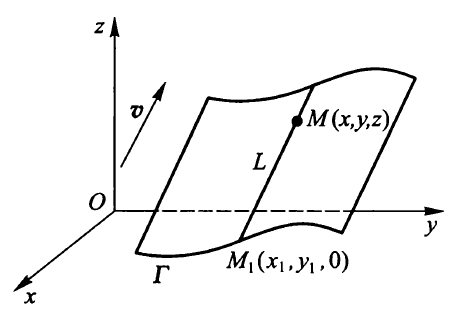
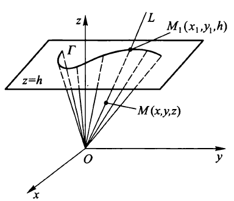
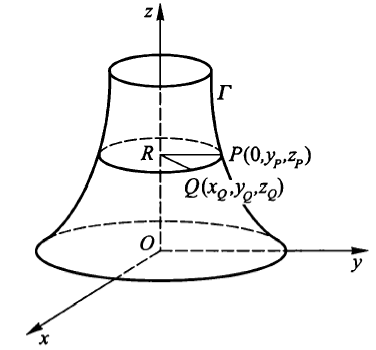
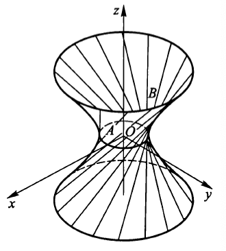

#! https://zhuanlan.zhihu.com/p/691365373
# 微积分II期中复习
## 级数
### 级数敛散性
#### p级数的敛散性
p级数$\displaystyle \sum_{n=1}^{\infty}\frac{1}{n}$在$p>1$时收敛，$p\leq1$的时候发散  
可以通过积分证明。此处不证
#### 数项级数的基本性质
1. 线性运算法则（比较显然）
2. 改变一个级数的有限项不影响级数的敛散性
3. 若级数$\displaystyle \sum_{n=1}^{\infty}u_n$收敛，则在级数中任意添加括号得到的新级数也收敛且其和不变
4. 若级数$\displaystyle \sum_{n=1}^{\infty}u_n$收敛，则$\displaystyle \lim_{n\rightarrow\infty}u_n=0$
#### 比较判别法
设$\displaystyle \sum_{n=1}^{\infty}u_n,\sum_{n=1}^{\infty}v_n$均为**正项**级数，且$u_n\leq v_n(n=1,2,3,...)$  
（1）若$\displaystyle \sum_{n=1}^{\infty}v_n$收敛，则$\displaystyle \sum_{n=1}^{\infty}u_n$收敛  
（2）若$\displaystyle \sum_{n=1}^{\infty}u_n$发散，则$\displaystyle \sum_{n=1}^{\infty}v_n$发散
#### 比较判别法的极限形式
设$\displaystyle \sum_{n=1}^{\infty}u_n,\sum_{n=1}^{\infty}v_n$均为**正项**级数，且
$$\displaystyle \lim_{n\rightarrow\infty}\frac{u_n}{v_n}=l$$
（1）当$0<l<+\infty$时，两个级数的敛散性相同  
（2）当$l=0$时，若$\displaystyle \sum_{n=1}^{\infty}v_n$收敛，则$\displaystyle \sum_{n=1}^{\infty}u_n$收敛  
（3）当$l=+\infty$时，若$\displaystyle \sum_{n=1}^{\infty}v_n$发散，则$\displaystyle \sum_{n=1}^{\infty}u_n$发散
#### 比值判别法
设$\displaystyle \sum_{n=1}^{\infty}u_n$是**正项**级数，并且
$$\displaystyle \lim_{n\rightarrow\infty}\frac{u_{n+1}}{u_{n}}=\gamma$$
（1）当$\gamma<1$时，级数收敛  
（2）当$\gamma>1$时，级数发散  
（3）当$\gamma=1$时，本判别法失效
#### 根值判别法
设$\displaystyle \sum_{n=1}^{\infty}u_n$是**正项**级数，且
$$\displaystyle \lim_{n\rightarrow\infty}\sqrt[n]{u_n}=\gamma$$  
（1）当$\gamma<1$时，级数收敛  
（2）当$\gamma>1$时，级数发散  
（3）当$\gamma=1$时，本判别法失效
#### 积分判别法
设$f(x)$在$[1,+\infty]$上是非负且递减的连续函数，记$u_n=f(n),n=1,2,3...$则级数$\displaystyle \sum_{n=1}^{\infty}u_n$与反常积分$\displaystyle\int_{1}^{+\infty}f(x)dx$的敛散性相同
#### 绝对收敛与条件收敛
如果$\displaystyle\sum^\infty_{n=1}|u_n|$收敛，则$\displaystyle\sum^\infty_{n=1}u_n$也收敛  
（1）如果$\displaystyle\sum^\infty_{n=1}|u_n|$收敛，则称$\displaystyle\sum^\infty_{n=1}u_n$**绝对收敛**
（2）如果$\displaystyle\sum^\infty_{n=1}|u_n|$发散，但$\displaystyle\sum^\infty_{n=1}u_n$收敛，则称$\displaystyle\sum^\infty_{n=1}u_n$**条件收敛**
#### 绝对值的比值判别法
设$\displaystyle \sum_{n=1}^{\infty}u_n$是一般级数，并且
$$\displaystyle \lim_{n\rightarrow\infty}\frac{\left|u_{n+1}\right|}{\left|u_{n}\right|}=\gamma$$
（1）当$\gamma<1$时，级数绝对收敛  
（2）当$\gamma>1$时，级数发散  
（3）当$\gamma=1$时，本判别法失效
#### 绝对值的根值判别法
设$\displaystyle \sum_{n=1}^{\infty}u_n$是一般级数，且
$$\displaystyle \lim_{n\rightarrow\infty}\sqrt[n]{\left|u_n\right|}=\gamma$$  
（1）当$\gamma<1$时，级数绝对收敛  
（2）当$\gamma>1$时，级数发散  
（3）当$\gamma=1$时，本判别法失效
#### 莱布尼兹定理
若交错级数$\displaystyle \sum_{n=1}^{\infty}(-1)^{n-1}u_n$满足下列条件：  
（1）$u_1\geq u_2\geq u_3\geq ...$  
（2）$\displaystyle \lim_{n\rightarrow \infty}u_n=0$  
则$\displaystyle \sum_{n=1}^{\infty}(-1)^{n-1}u_n$收敛且它的和$S\leq u_1$
### 幂级数
#### 阿贝尔定理
如果级数$\displaystyle \sum_{n=0}^{\infty}a_nx^n$当$x=x_0(x_0\neq 0)$时收敛，那么适合不等式$\left|x\right|<\left|x_0\right|$的一切$x$使该幂级数绝对收敛.  
反之，如果级数$\displaystyle \sum_{n=0}^{\infty}a_nx^n$当$x=x_0(x_0\neq 0)$时发散，那么适合不等式$\left|x\right|>\left|x_0\right|$的一切$x$使该幂级数发散.  
证明：
设$x_0$使幂级数收敛，则根据级数收敛的必要条件，有
$$\displaystyle \lim_{n\rightarrow\infty}a_nx_0^n=0$$
于是存在一个常数$M$，使得
$$\left|a_nx_0^n\right|\leq M(n=0,1,2,...)$$
则$\left|a_nx^n\right|=\left|a_nx_0^n\cdot \frac{x^n}{x_0^n}\right|\leq M\left|\frac{x}{x_0}\right|^n$  
当$\left|x\right|<\left|x_0\right|$时级数$\displaystyle \sum_{n=0}^\infty M\left|\frac{x}{x_0}\right|^n$收敛，所以级数$\displaystyle \sum_{n=0}^{\infty}a_nx^n$收敛。  
定理的后半部分用反证法即可。设级数$\displaystyle \sum_{n=0}^{\infty}a_nx^n$当$x=x_0$时发散且存在$x_1$使得$\left|x_1\right|>\left|x_0\right|$且使级数收敛，则由定理前半部分可知$\left|x\right|<\left|x_1\right|$的一切$x$使该幂级数绝对收敛.即$x_0$使幂级数绝对收敛，矛盾。
#### 收敛半径，收敛区间和收敛域
1. 收敛半径：使幂级数收敛的所有收敛点的上确界
2. 收敛区间：设收敛半径为$R$，则收敛区间为$(-R,R)$
3. 收敛域：收敛区间与收敛端点的并集
#### 柯西-阿达马公式
设幂级数$\displaystyle \sum_{n=0}^\infty a_nx^n$，若
$$\displaystyle \lim_{n\rightarrow\infty}\frac{\left|a_n\right|}{\left|a_{n+1}\right|}=R$$
（1）当$0<R<+\infty$时，级数$\displaystyle \sum_{n=0}^\infty a_nx^n$在$(-R,R)$内绝对收敛，当$\left|x\right|>R$时发散  
（2）当$R=0$时，级数$\displaystyle \sum_{n=0}^\infty a_nx^n$仅在$x=0$处收敛，在$x\neq 0$时发散  
（3）当$R=+\infty$时，级数$\displaystyle \sum_{n=0}^\infty a_nx^n$在$R$上绝对收敛
#### 根值公式
设幂级数$\displaystyle \sum_{n=0}^\infty a_nx^n$，若
$$\displaystyle \lim_{n\rightarrow\infty}\frac{1}{\sqrt[n]{\left|a_{n}\right|}}=R$$
（1）当$0<R<+\infty$时，级数$\displaystyle \sum_{n=0}^\infty a_nx^n$在$(-R,R)$内绝对收敛，当$\left|x\right|>R$时发散  
（2）当$R=0$时，级数$\displaystyle \sum_{n=0}^\infty a_nx^n$仅在$x=0$处收敛，在$x\neq 0$时发散  
（3）当$R=+\infty$时，级数$\displaystyle \sum_{n=0}^\infty a_nx^n$在$R$上绝对收敛
#### 常见的麦克劳林展开
1.$\displaystyle\frac{1}{1-x}= \sum^{\infty}_{n=0}x^n,\left|x\right|<1$
#### 性质
若幂级数$\displaystyle \sum_{n=0}^\infty a_nx^n$的收敛半径为$R(>0)$，则  
（1）级数在收敛域上的和函数$S(x)$是连续函数
（2）幂级数在$(-R,R)$上逐项可微，微分后得到的幂级数与原级数有相同的收敛半径
（3）幂级数在$(-R,R)$上逐项可积，积分后得到的幂级数与原级数有相同的收敛半径
### 傅里叶级数
#### 周期函数的傅里叶展开
（狄利克雷定理）如果$f(x)$是以$T=2l$为周期的周期函数，且$f(x)$在$[-l,l]$上逐段光滑，那么$f(x)$的傅里叶级数在任意点$x$处都收敛，并且收敛于$f(x)$在该点左右极限的平均值。
$$\frac{a_0}{2}+\displaystyle \sum^{\infty}_{n=1}\left(a_n\cos\frac{n\pi x}{l}+b_n\sin\frac{n\pi x}{l}\right)=S(x)=\frac{f(x-0)+f(x+0)}{2},x\in R$$
其中
$$a_n=\displaystyle\frac{1}{l}\int^l_{-l}f(x)\cos\frac{n\pi x}{l}dx,n=0,1,2,...$$
$$b_n=\displaystyle\frac{1}{l}\int^l_{-l}f(x)\sin\frac{n\pi x}{l}dx,n=1,2,3,...$$
#### $[-l,l]$上的傅里叶展开
$$\frac{a_0}{2}+\displaystyle \sum^{\infty}_{n=1}\left(a_n\cos\frac{n\pi x}{l}+b_n\sin\frac{n\pi x}{l}\right)=S(x)=\frac{f(x-0)+f(x+0)}{2},x\in (-l,l)$$
其中
$$a_n=\displaystyle\frac{1}{l}\int^l_{-l}f(x)\cos\frac{n\pi x}{l}dx,n=0,1,2,...$$
$$b_n=\displaystyle\frac{1}{l}\int^l_{-l}f(x)\sin\frac{n\pi x}{l}dx,n=1,2,3,...$$
#### $[0,l]$上的傅里叶展开
1. 奇延拓（正弦展开）  
令
$$F(x)=\begin{cases}
f(x),0<x \leq l\\
0,x=0\\
-f(-x),-l\leq x < 0
\end{cases}$$  
对其进行傅里叶展开  
$f(x)$在$[0,l]$上的正弦展开为
$$\displaystyle \sum^{\infty}_{n=1}b_n\sin\frac{n\pi x}{l}=S(x)=\frac{f(x-0)+f(x+0)}{2},x\in (0,l)$$
其中
$$b_n=\displaystyle\frac{2}{l}\int^l_{0}f(x)\sin\frac{n\pi x}{l}dx,n=1,2,3,...$$
1. 偶延拓（余弦展开）  
令
$$F(x)=\begin{cases}
f(x),0\leq x \leq l\\
f(-x),-l\leq x \leq 0
\end{cases}$$  
对其进行傅里叶展开  
$f(x)$在$[0,l]$上的余弦展开为
$$\frac{a_0}{2}+\displaystyle \sum^{\infty}_{n=1}a_n\cos\frac{n\pi x}{l}=S(x)=\frac{f(x-0)+f(x+0)}{2},x\in (0,l)$$
其中
$$a_n=\displaystyle\frac{2}{l}\int^l_{0}f(x)\cos\frac{n\pi x}{l}dx,n=0,1,2,...$$

## 矢量代数
### 矢量积
#### 结合律
$$m(\mathbf{a}\times\mathbf{b})=(m\mathbf{a})\times \mathbf{b}=\mathbf{a}\times(m\mathbf{b})$$
#### 分配率
$$\mathbf{a}\times(\mathbf{b}+\mathbf{c})=\mathbf{a}\times\mathbf{b}+\mathbf{a}\times\mathbf{c}\\
(\mathbf{a}+\mathbf{b})\times\mathbf{c}=\mathbf{a}\times\mathbf{c}+\mathbf{b}\times\mathbf{c}$$
### 混合积
#### 平行六面体的体积
起点相同的矢量$\mathbf{a},\mathbf{b},\mathbf{c}$所确定的平行六面体体积为
$$|\mathbf{a}\cdot(\mathbf{b}\times \mathbf{c})|$$
#### 三矢量共面
三矢量$\mathbf{a},\mathbf{b},\mathbf{c}$共面的充要条件是他们的混合积
$$\mathbf{a}\cdot(\mathbf{b}\times \mathbf{c})=0$$
其实可以视作上面的特例。
#### 改变顺序的结果
1. 顺次轮换，混合积不变，即
$$\mathbf{a}\cdot(\mathbf{b}\times \mathbf{c})=\mathbf{b}\cdot(\mathbf{c}\times \mathbf{a})=\mathbf{c}\cdot(\mathbf{a}\times \mathbf{b})$$
2. 任意对调两矢量顺序，符号相反，即
$$\mathbf{a}\cdot(\mathbf{b}\times \mathbf{c})=-\mathbf{a}\cdot(\mathbf{c}\times \mathbf{b})\\
\mathbf{a}\cdot(\mathbf{b}\times \mathbf{c})=-\mathbf{b}\cdot(\mathbf{a}\times \mathbf{c})\\
\mathbf{a}\cdot(\mathbf{b}\times \mathbf{c})=-\mathbf{c}\cdot(\mathbf{b}\times \mathbf{a})$$
### 二重矢积
$$\mathbf{a}\times(\mathbf{b}\times\mathbf{c})=(\mathbf{a}\cdot \mathbf{c})\mathbf{b}-(\mathbf{c}\cdot \mathbf{b})\mathbf{a}$$
## 空间解析几何
### 球面方程
$$(x-x_0)^2+(y-y_0)^2+(z-z_0)^2=R^2$$
### 柱面方程
由一条动直线$L$沿一定曲线$\Gamma$平行移动形成的曲面，称为**柱面**.并称动直线$L$为该柱面的**母线**，称定曲面$\Gamma$为该柱面的准线
  
以$Oxy$平面的曲线$\Gamma:F(x,y)=0$为准线，母线$L$的方向矢量为$\mathbf{v}=a\mathbf{i}+b\mathbf{j}+c\mathbf{k}(c\neq0)$的柱面方程为
$$F(x-\frac{a}{c}z,y-\frac{b}{c}z)=0$$
证明：  
设$M(x,y,z)$是柱面上一点，过$M$的母线与准线交于点$M_1$（如上图），$\overrightarrow{M_1M}//\mathbf{v}$，记$\overrightarrow{M_1M}=m\mathbf{v}$。而
$$\overrightarrow{M_1M}=(x-x_1)\mathbf{i}+(y-y_1)\mathbf{j}+(z-0)\mathbf{k}$$
可知$x-x_1=ma,y-y_1 =mb,z-0=mc$，消去$m$
$$x_1=x-\frac{a}{c}z,y_1=y-\frac{b}{c}z$$
由$F(x_1,y_1)=0$
知柱面方程为$F(x-\frac{a}{c}z,y-\frac{b}{c}z)=0$
### 锥面方程
过空间一定点$O$的动直线$L$，沿空间曲线$\Gamma$（不过定点$O$）移动所生成的曲线称为**锥面**，其中动直线$L$称为该锥面的**母线**，曲线$\Gamma$称为该锥面的**准线**，定点$O$称为该锥面的**顶点**。  
  
以$z=h(h\neq0)$平面上的曲线$\Gamma:F(x,y)=0$为准线，以原点为顶点的锥面方程为
$$F(\frac{h}{z}x,\frac{h}{z}y)=0$$
证明：  
显然$\overrightarrow{OM}$与$\overrightarrow{OM_1}$共线，即$\overrightarrow{OM_1}=m\overrightarrow{OM}$
$$x_1=mx,y_1=my,h=mz$$
消去$m$,得到$x_1=\frac{h}{z}x,y_1=\frac{h}{z}y$  
而$F(x_1,y_1)=0$  
即曲面方程为$F(\frac{h}{z}x,\frac{h}{z}y)=0$
### 旋转曲面方程
一曲线$\Gamma$ 绕一定直线$L$旋转生成的曲面叫做**旋转曲面**，其中定直线**L**称为该旋转曲面的轴
#### 平面上的曲线$\Gamma$绕坐标轴旋转所得的曲面方程  
$Oyz$平面上的曲线$\Gamma:F(y,z)=0$绕$Oz$轴旋转一周得到的旋转曲面方程为
$$F(\pm\sqrt{x^2+y^2},z)=0$$
先写出平面上的曲线方程，然后根据轴决定替换其中哪个未知量，如本例中通过$Oyz$平面确定了曲线的方程应为$F(y,z)=0$，然后根据$Oz$轴确定$y$应被替换成$\sqrt{x^2+y^2}$
  
证明：  
设$P(0,y_P,z_P)$是曲线$\Gamma$上任意一点，当曲线$\Gamma$绕$Oz$轴旋转一周时，点$P$的轨迹是一个圆，记圆心为$R$.设$Q(x_Q,y_Q,z_Q)$是这个圆上任意一点，则$z_P=z_Q$.
$$｜y_P｜=PR=QR=\sqrt{x_Q^2+y_Q^2}$$
将$y_P=\pm \sqrt{x_Q^2+y_Q^2},z_P=z_Q$代入$F(y_P,z_P)=0$
得到曲面方程$F(\pm\sqrt{x^2+y^2},z)=0$
#### 空间中任意直线绕坐标轴旋转所得的曲面方程
直线$\Gamma \begin{cases}
    x=x(t)\\
    y=y(t)\\
    z=z(t)\\
\end{cases}$绕$Oz$轴旋转生成的曲面方程为
$$x^2+y^2=[x(z^{-1}(z))]^2+[y(z^{-1}(z))]^2$$
    
证明：  
设$M(x,y,z)$为所求曲面上的任一点，则$M$必是直线$\Gamma$上某个点$M_1(x_1,y_1,z_1)$绕$Oz$轴旋转某个角度得到的，即
$$\begin{cases}
    x_1=x(t_1)\\
    y_1=y(t_1)\\
    z_1=z(t_1)\\
\end{cases}$$
且$z=z_1,x^2+y^2=x_1^2+y_1^2$  
由$z=z(t_1)$，知$t_1=z^{-1}(z)$,则
$$x_1=x[z^{-1}(z)],y_1=y[z^{-1}(z)]$$
所以旋转曲面方程为
$$x^2+y^2=[x(z^{-1}(z))]^2+[y(z^{-1}(z))]^2$$ 
### 矢值函数的导数
矢值函数$\mathbf{r}(t)=x(t)\mathbf{i}+y(t)\mathbf{j}+z(t)\mathbf{k}$
其导数$\mathbf{r}'(t)=x'(t)\mathbf{i}+y'(t)\mathbf{j}+z'(t)\mathbf{k}$，显然是平行于该点切线的矢量，也称为切矢量。
### 曲线的切线和法平面
由上知切线的方向矢量为$(x'(t),y'(t),z'(t))$
所以$P_0(x(t_0),y(t_0),z(t_0))$处曲线的切线为
$$\dfrac{x-x_0}{x'(t_0)}=\dfrac{y-y_0}{y'(t_0)}=\dfrac{z-z_0}{z'(t_0)}$$
与该直线垂直的平面称为曲线在$P_0$处的法平面
$$x'(t_0)(x-x_0)+y'(t_0)(y-y_0)+z'(t_0)(z-z_0)=0$$
### 曲面的切平面和法线
曲面的切平面
$$F'_x(x_0,y_0,z_0)(x-x_0)+F'_y(x_0,y_0,z_0)(y-y_0)+F'_z(x_0,y_0,z_0)(z-z_0)=0$$
切平面的法矢量即曲面在该点的法线
$$\dfrac{x-x_0}{F'_x(x_0,y_0,z_0)}=\dfrac{y-y_0}{F'_y(x_0,y_0,z_0)}=\dfrac{z-z_0}{F'_z(x_0,y_0,z_0)}$$
## 多元函数微分学
### 多元函数的极限与连续性
若累次极限$\displaystyle \lim_{x\rightarrow x_0}\lim_{y\rightarrow y_0}f(x,y),\displaystyle \lim_{y\rightarrow y_0}\lim_{x\rightarrow x_0}f(x,y)$与二重极限$\displaystyle \lim_{(x,y)\rightarrow (x_0,y_0)}f(x,y)$都存在，则三者相等。
   
(2023 T5)求极限$\displaystyle \lim_{(x,y)\rightarrow (0,0)}x^2y\ln(x^2+y^2)$  
解：  
实际上，取$y=0$，我们会发现这个极限与$\displaystyle \lim_{x\rightarrow 0}x^2\ln x^2=0$相等，但是我们无法确定该极限存在，所以不能直接给出答案。  
这种题目的通用做法是夹逼定理，为了去除正负的影响我们先取绝对值，也就是说我们需要证明
$$\displaystyle \lim_{(x,y)\rightarrow (0,0)}|x^2y\ln(x^2+y^2)|=0$$
我们想着化成$\displaystyle \lim_{x\rightarrow 0}x\ln x$的类似形式，因此有
$$0\leq|x^2y\ln(x^2+y^2)|\leq|x|\left|\frac{x^2+y^2}{2}\ln(x^2+y^2)\right|$$
$$\displaystyle \lim_{(x,y)\rightarrow (0.0)}|x|\left|\frac{x^2+y^2}{2}\ln(x^2+y^2)\right|=0\cdot 0 = 0$$
由夹逼定理，知  
$$\displaystyle \lim_{(x,y)\rightarrow (0,0)}|x^2y\ln(x^2+y^2)|=0$$
也即  
$$\displaystyle \lim_{(x,y)\rightarrow (0,0)}x^2y\ln(x^2+y^2)=0$$
### 偏导数
若函数$z=f(x,y)$的二阶偏导数$f''_{xy}(x,y),f''_{yx}(x,y)$都在点$P_0$处连续，则$f_{xy}''(x_0,y_0)=f_{yx}''(x_0,y_0)$  
很多时候会写作  
$$\frac{\partial ^2 z}{\partial x \partial y}=\frac{\partial ^2 z}{\partial y \partial x}$$
### 全微分
若二元函数$z=f(x,y)$在点$(x,y)$处的**全增量**$\Delta z = f(x+\Delta x,y+\Delta y)-f(x,y)$可以表示为
$$\Delta z = A\Delta x+ B \Delta y+o(\rho)(\rho = \sqrt{(\Delta x)^2+(\Delta y)^2}\rightarrow 0)$$
其中$A,B$与变量$x,y$的增量$\Delta x, \Delta y$无关，而仅与$x,y$有关，则称函数$f(x,y)$在点$(x,y)$处可微。其中
$$dz=A\Delta x+B\Delta y$$
称为函数$f(x,y)$在点$(x,y)$处的**全微分**，其中
$$A=f'_x(x,y),B=f'_y(x,y)$$
  
(2023 T7)设函数$f(x)=\begin{cases}\sqrt{|xy|}\sin\ln(x^2+y^2),(x,y)\neq(0,0)\\
0,(x,y)=(0,0)\end{cases}$，求$f_x'(0,0),f_y'(0,0)$，并讨论$f$在点$(0,0)$处的可微性  
解：  
$$f_x'(0,0)=\displaystyle\lim_{x\rightarrow 0}\frac{f(x,0)-f(0,0)}{x}=\frac{0-0}{x}=0$$
$$f_y'(0,0)=\displaystyle\lim_{y\rightarrow 0}\frac{f(0,y)-f(0,0)}{y}=\frac{0-0}{y}=0$$
要验证函数在此点是否可微，**只需看极限**$\displaystyle \lim_{\Delta x \rightarrow 0 \atop \Delta y \rightarrow 0 }\frac{\Delta z-(A\Delta x+B\Delta y)}{\rho}$**是否为0.** 
$$\displaystyle \lim_{\Delta x \rightarrow 0 \atop \Delta y \rightarrow 0 }\frac{\Delta z-(A\Delta x+B\Delta y)}{\rho}=\displaystyle \lim_{\Delta x \rightarrow 0 \atop \Delta y \rightarrow 0 }\frac{f(\Delta x,\Delta y)-f(0,0)-f_x'(0,0)\Delta x-f_y'(0,0)\Delta y}{\sqrt{(\Delta) x^2+(\Delta y)^2}}=\displaystyle \lim_{\Delta x \rightarrow 0 \atop \Delta y \rightarrow 0 }\frac{\sqrt{|\Delta x\Delta y|}\sin\ln((\Delta x)^2+(\Delta y)^2)}{\sqrt{(\Delta x)^2+(\Delta y)^2}}$$ 
若该极限存在，取$y=x$的方向趋于$(0,0)$点
$$\displaystyle \lim_{\Delta x \rightarrow 0 \atop \Delta y \rightarrow 0 }\frac{\sqrt{|\Delta x\Delta y|}\sin\ln((\Delta x)^2+(\Delta y)^2)}{\sqrt{(\Delta x)^2+(\Delta y)^2}}=\displaystyle \lim_{\Delta x \rightarrow 0 \atop \Delta y \rightarrow \Delta x }\frac{\sqrt{|\Delta x\Delta y|}\sin\ln((\Delta x)^2+(\Delta y)^2)}{\sqrt{(\Delta x)^2+(\Delta y)^2}}=\displaystyle \lim_{\Delta x \rightarrow0}\frac{\sin\ln 2(\Delta x)^2}{\sqrt{2}}$$
极限不存在，因此不可微。
### 复合函数的偏导数
若函数$u=\varphi(x,y),v=\psi(x,y)$在点$(x,y)$处的偏导数都存在，$z=f(u,v)$在点$(u,v)=(\varphi (x,y),\psi(x,y))$处可微，则复合函数$z=f[\phi(x,y),\psi(x,y)]$在点$(x,y)$处的偏导数存在
$$\frac{\partial z}{\partial x}=\frac{\partial z}{\partial u}\cdot\frac{\partial u}{\partial x}+\frac{\partial z}{\partial v}\cdot \frac{\partial v}{\partial x}$$
$$\frac{\partial z}{\partial y}=\frac{\partial z}{\partial u}\cdot\frac{\partial u}{\partial y}+\frac{\partial z}{\partial v}\cdot \frac{\partial v}{\partial y}$$
为简便起见，约定$f_1'$表示对第一个中间变量求偏导，$f_2'$表示对第二个中间变量求偏导，而$f''_{12}$表示先对第一个中间变量求偏导，再对第二个中间变量求偏导。
$$f''_{12}=f''_{21}$$
(2023 T8)
设$u=f(x,y)$有连续的二阶偏导数，引用新的自变量$s=x+y,t=x-y$化简方程
$$\frac{\partial^2u}{\partial x^2}-\frac{\partial^2u}{\partial y^2}+2\frac{\partial u}{\partial x}+2\frac{\partial u}{\partial y}=0$$
解：  
$$\displaystyle\frac{\partial u}{\partial x}=\frac{\partial u}{\partial s}\cdot\frac{\partial s}{\partial x}+\frac{\partial u}{\partial t}\cdot\frac{\partial t}{\partial x}=\frac{\partial u}{\partial s}+\frac{\partial u}{\partial t}$$
$$\displaystyle\frac{\partial u}{\partial y}=\frac{\partial u}{\partial s}\cdot\frac{\partial s}{\partial y}+\frac{\partial u}{\partial t}\cdot\frac{\partial t}{\partial y}=\frac{\partial u}{\partial s}-\frac{\partial u}{\partial t}$$
$$\displaystyle\frac{\partial^2u}{\partial x^2}=\frac{\partial}{\partial x}(\frac{\partial u}{\partial x})=\frac{\partial}{\partial s}(\frac{\partial u}{\partial x})\cdot\frac{\partial s}{\partial x}+\frac{\partial}{\partial t}(\frac{\partial u}{\partial x})\cdot\frac{\partial t}{\partial x}=\frac{\partial}{\partial s}(\frac{\partial u}{\partial x})+\frac{\partial}{\partial t}(\frac{\partial u}{\partial x})=\frac{\partial^2 u}{\partial s^2}+\frac{\partial^2 u}{\partial s \partial t}+\frac{\partial^2 u}{\partial t \partial s}+\frac{\partial^2 u}{\partial t^2}=\frac{\partial^2 u}{\partial s^2}+2\frac{\partial^2 u}{\partial s \partial t}+\frac{\partial^2 u}{\partial t^2}$$
$$\displaystyle\frac{\partial^2u}{\partial y^2}=\frac{\partial}{\partial y}(\frac{\partial u}{\partial y})=\frac{\partial}{\partial s}(\frac{\partial u}{\partial y})\cdot\frac{\partial s}{\partial y}+\frac{\partial}{\partial t}(\frac{\partial u}{\partial y})\cdot\frac{\partial t}{\partial y}=\frac{\partial}{\partial s}(\frac{\partial u}{\partial y})-\frac{\partial}{\partial t}(\frac{\partial u}{\partial y})=\frac{\partial^2 u}{\partial s^2}-\frac{\partial^2 u}{\partial s \partial t}-\frac{\partial^2 u}{\partial t \partial s}+\frac{\partial^2 u}{\partial t^2}=\frac{\partial^2 u}{\partial s^2}-2\frac{\partial^2 u}{\partial s \partial t}+\frac{\partial^2 u}{\partial t^2}$$
全部代入原方程得到
$$\displaystyle \frac{\partial^2 u}{\partial s \partial t}+\frac{\partial u}{\partial s}=0$$
### 复合函数的全微分
多元函数具有一阶微分形式不变性。  
若以$x,y$为自变量的函数$z=f(x,y)$可微，则有
$$dz=\frac{\partial z}{\partial x}dx+\frac{\partial z}{\partial y}dy$$
若以$s,t$为自变量的函数$z=f(x,y)$和$x=x(s,t),y=y(s,t)$都有连续的偏导数，则$z$可微，且
$$dz=\frac{\partial z}{\partial s}ds+\frac{\partial z}{\partial t}dt$$
$$dz=\frac{\partial z}{\partial x}dx+\frac{\partial z}{\partial y}dy$$