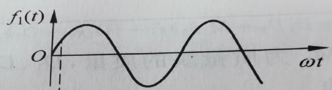
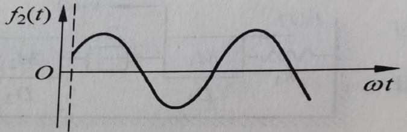
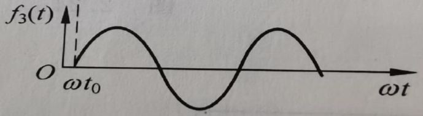
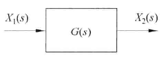
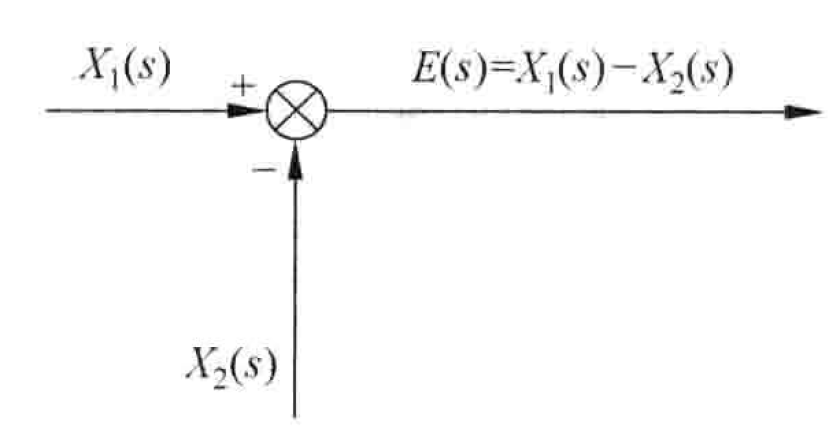
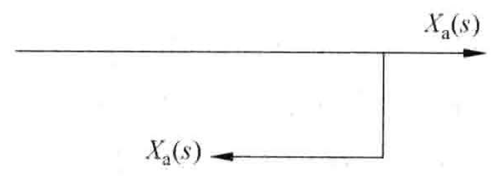
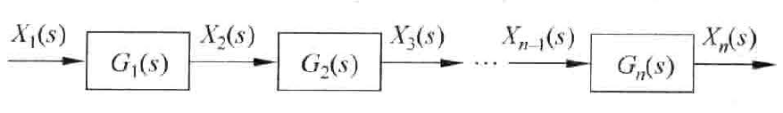
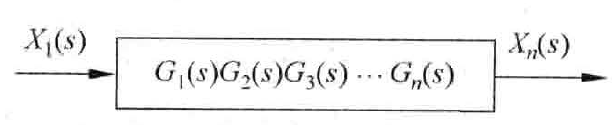
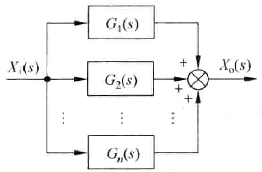
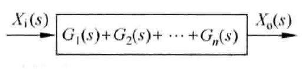

## 第二章 控制系统的动态数学模型
### 线性微分方程
1. 未知函数的各阶导数都是一次；
2. 各阶导数的系数可以是常数或是自变量的已知函数；
$$\frac{d^2\theta(t)}{dt^2} + 2\frac{d\theta(t)}{dt} = 1\\\frac{d^2\theta(t)}{dt^2} + 2\theta(t)\frac{d\theta(t)}{dt} = 1\\t\frac{d^2\theta(t)}{dt^2} + 2e^{3t}\frac{d\theta(t)}{dt} = \cos(4t) + 1\\\frac{d^2\theta(t)}{dt^2} + 2\left(\frac{d\theta(t)}{dt}\right)^2 = \cos(4t) + 1$$

从上至下为
线性、非线性、线性、非线性
### 拉普拉斯变换
对于指数级函数$x(t)$，有$\displaystyle\int_{0}^{\infty} x(t)e^{-\sigma t} dt < \infty$，则可定义$x(t)$的拉氏变换$X(s)$：
$$X(s) = L[x(t)] \triangleq \int_{0}^{\infty} x(t)e^{-st} dt$$
式中，称$X(s)$为象函数，$x(t)$为原函数。$s$为复变数，其量纲为时间的倒数，即频率。象函数$X(s)$的量纲为$x(t)$的量纲与时间量纲的乘积。
#### 常用的拉氏变换和反变换
| 时间函数 | 象函数 (Laplace) |
|:---:|:---:|
| 单位脉冲函数$\delta(t)=\begin{cases}\displaystyle\lim_{t_{0}\to0}\dfrac{1}{t_{0}}, & 0<t<t_{0}\\[6pt]0, & t\ge t_{0}\end{cases}$ | $1$ |
| 单位阶跃函数$l(t)=\begin{cases}0, & t<0\\[6pt]1, & t\ge 0\end{cases}$ | $\dfrac{1}{s}$ |
| $t^{n}\ (n\ge 0)$ | $\dfrac{n!}{s^{n+1}}$ |
| $\sin(\omega t)$ | $\dfrac{\omega}{s^{2}+\omega^{2}}$ |
| $\cos(\omega t)$ | $\dfrac{s}{s^{2}+\omega^{2}}$ |
|  $e^{at}$ | $\dfrac{1}{s-a}$ |
| 常数倍 $a\,x(t)$ | $a\,X(s)$ |
| 叠加定理 $a\,x_{1}(t)+b\,x_{2}(t)$ | $a\,X_{1}(s)+b\,X_{2}(s)$ |
| 微分 $\dfrac{d}{dt}x(t)$ | $s\,X(s)-x(0^{+})$ |
| 积分 $\displaystyle\int_{0}^{t} x(\tau)\,d\tau$ | $\dfrac{X(s)}{s}+\dfrac{x^{-1}(0^{+})}{s}$ |
| 衰减定理 $e^{-at}x(t)$ | $X(s+a)$ |
| 延时定理 $x(t-a)\cdot u(t-a)$ | $e^{-as}X(s)$ |
#### 信号的截取与时移
|图像|表达式|
|:---:|:---:|
||$f_1(t)=\sin(\omega t)\cdot l(t)$ |
||$f_2(t)=\sin(\omega t)\cdot l(t-t_0)$ |
||$f_3(t)=\sin\big(\omega (t-t_0)\big)\cdot l(t-t_0)$ |
#### 拉氏变换的常用基本性质
##### 叠加原理
若$L[f_1(t)]=F_1(s)$，$L[f_2(t)]=F_2(s)$，则有
$$L[af_1(t)+bf_2(t)]=aF_1(s)+bF_2(s)$$
##### 微分定理
$$L\left[\frac{df(t)}{dt}\right]=sF(s)-f(0)$$
根据数学归纳法不难推出
$$L\left[\frac{d^n}{dt^n}f(t)\right] = s^n F(s) - s^{n-1}f(0) - s^{n-2}\dot{f}(0) - \dots - sf^{(n-2)}(0) - f^{(n-1)}(0)$$
若$f(0)=\dot{f}(0)=\dots=f^{(n-2)}(0)=f^{(n-1)}(0)=0$，则有
$$L\left[\frac{d^n}{dt^n}f(t)\right] = s^n F(s)$$
##### 积分定理

这里$\displaystyle f^{-1}(t) \triangleq \int f(t)dt$
$$L\left[\int f(t)dt\right] = \frac{F(s)}{s} + \frac{f^{-1}(0)}{s}$$
同理有
$$ L\left[\underbrace{\int \dots \int}_{n} f(t)(dt)^n\right] = \frac{F(s)}{s^n} + \frac{f^{-1}(0)}{s^n} + \frac{f^{-2}(0)}{s^{n-1}} + \dots + \frac{f^{-n}(0)}{s}$$

若$ \quad f^{-1}(0) = f^{-2}(0) = \dots = f^{-n}(0) = 0$，则有
$$ L\left[\underbrace{\int \dots \int}_{n} f(t)(dt)^n\right] = \frac{F(s)}{s^n}$$
##### 衰减定理
$$L[e^{-at}f(t)]=F(s+a)$$
##### 延时定理
$$L\left[f(t-a) \cdot 1(t-a)\right] = e^{-as}F(s)$$
##### 初值定理
$$ \lim_{t \to 0} f(t)=\lim_{s \to \infty} sF(s) $$
##### 终值定理
$$ \lim _{t \rightarrow \infty} f(t)=\lim _{s \rightarrow 0} s F(s) $$
### 拉氏反变换
直接积分求拉氏反变换通常较繁，对于一般的问题，都可以避免积分，而通过将象函数转化为拉氏变换表中包含的形式（一般是分式）。
#### 例题
求$F(s)=\dfrac{s+1}{s^2+5s+6}$的反拉氏变换

易知$F(s)=\dfrac{2}{s+3}-\dfrac{1}{s+2}$
查表可得
$$f(t) = 2e^{-3t}-e^{-2t}$$

### 传递函数
传递函数为在零起始条件下，线性定常系统输出象函数$X_o(s)$与输入象函数$X_i(s)$之比
$$G(s)\triangleq\frac{X_o(s)}{X_i(s)}$$

具体地说，设线性定常系统的微分方程为：
$$a_0 x_o^{(n)}(t) + a_1 x_o^{(n-1)}(t) + \cdots + a_{n-1} \dot{x}_o(t) + a_n x_o(t) = b_0 x_i^{(m)}(t) + b_1 x_i^{(m-1)}(t) + \cdots + b_{m-1} \dot{x}_i(t) + b_m x_i(t) \quad (n \ge m)$$
设系统的输入输出函数及其各阶导数**初始值均为零**，将上式拉氏变换，由微分定理推论：
$$\left(a_0 s^n + a_1 s^{n-1} + \cdots + a_{n-1}s + a_n\right)X_o(s) = \left(b_0 s^m + b_1 s^{m-1} + \cdots + b_{m-1}s + b_m\right)X_i(s)$$
传递函数为
$$G(s) = \frac{X_o(s)}{X_i(s)} = \frac{b_0 s^m + b_1 s^{m-1} + \cdots + b_{m-1}s + b_m}{a_0 s^n + a_1 s^{n-1} + \cdots + a_{n-1}s + a_n}$$
#### 传递函数的特性
1. 传递函数是系统的固有特性，与输入情况无关。
2. 零点：传递函数分子为零时的s值
3. 极点：传递函数分母为零时的s值
#### 典型环节的传递函数
|环节|时间函数|相函数|传递函数|例子|
|:-:|:-:|:-:|:-:|:-:|
|比例环节|$x_o(t)=kx_i(t)$|$X_o(s)=kX_i(s)$|$G(s)=k$|运算放大器、齿轮传动副|
|积分环节|$x_o(t)=\displaystyle\int_{0}^{t} x_i(t)\,dt$|$X_o(s)=\dfrac{1}{s}X_i(s)$|$G(s)=\dfrac{1}{s}$|RC 有源积分网络|
|微分环节|$x_o(t)=\dfrac{d}{dt}x_i(t)$|$X_o(s)=sX_i(s)$| $G(s)=s$|永磁式直流测速机、阻尼器|
|一阶惯性环节（机械系统）|$T\dfrac{dx_o(t)}{dt}+x_o(t)=x_i(t)$|$X_o(s)=\dfrac{1}{T s+1}X_i(s)$|$G(s)=\dfrac{1}{T s+1}$|弹簧-阻尼系统|
|一阶惯性环节（滤波电路）|$\begin{cases}u_i(t)=i(t)R+\dfrac{1}{C}\displaystyle\int i(t)\,dt\\[4pt]u_o(t)=\dfrac{1}{C}\displaystyle\int i(t)\,dt\end{cases}$|$\begin{cases}U_i(s)=\left(R+\dfrac{1}{Cs}\right)I(s)=\dfrac{RCs+1}{Cs}I(s)\\[4pt]U_o(s)=\dfrac{1}{Cs}I(s)\\[4pt]\Rightarrow U_o(s)=\dfrac{1}{RCs+1}U_i(s)\end{cases}$|$G(s)=\dfrac{1}{RCs+1}$|RC 低通滤波电路（无源）|
|二阶振荡环节|$T^2\displaystyle\frac{d^2 x_o(t)}{dt^2} + 2\zeta T \displaystyle\frac{d x_o(t)}{dt} + x_o(t) = x_i(t)$|$X_o(s)=\dfrac{1}{T^2 s^2 + 2\zeta T s + 1}\,X_i(s)$|$G(s)=\dfrac{1}{T^2 s^2 + 2\zeta T s + 1}$|满足 $0<\zeta<1$ 时为振荡系统（弹簧-质量-阻尼、二阶滤波器）|
|近似微分环节|$T\displaystyle\frac{dx_o(t)}{dt}+x_o(t)=\displaystyle\frac{dx_i(t)}{dt}$|$X_o(s)=\dfrac{s}{Ts+1}X_i(s)$|$G(s)=\dfrac{s}{Ts+1}$|无源微分网络|
### 方块图
#### 组成部分
|组成部分|描述|图示|
|:-:|:-:|:-:|
|基本单元|图中指向方块的箭头表示输入，从方块出来的箭头表示输出，$G(s)$表示其传递函数。||
|比较点|代表两个或两个以上的输入信号进行相加或相减的元件||
|引出点|它表示信号引出和测量的位置，同一位置引出的几个信号，其大小和性质完全一样。||
#### 环节连接方式
|连接方式|原框图|等效|
|:-:|:-:|:-:|
|串联|||
|并联|||