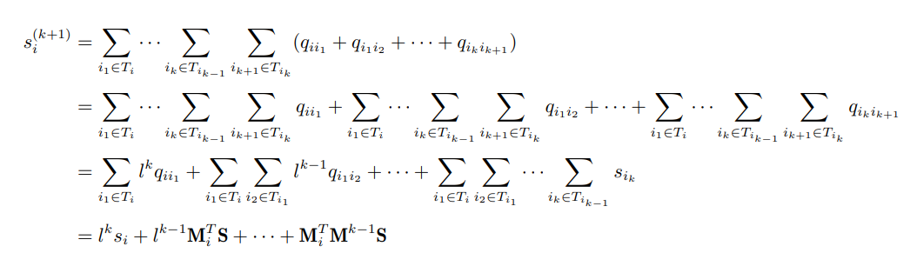

## 一
### (1)
为了使$\displaystyle L_1(\bm{\mu},\bm{\sigma_j})=\sum^k_{i=1}|\mu_j-\sigma_j^i|$最小，取$\bm{\sigma_j}$向量中各分量的中位数即可，记为$a_j$.
则使$\displaystyle \sum^{k}_{j=1}L_1(\bm{\mu},\bm{\sigma_j})=\sum^{k}_{j=1}\sum^k_{i=1}|\mu_j-\sigma_j^i|$最小，只需取$\bm{\mu}=(a_1,a_2,...,a_k)$即可。

此时$\bm{\mu}$各分量不一定为整数，可以自然地想到对其各分量进行排序，并将位次作为新的分量值，我们记这种排列为$\bm{\sigma}'$，接下来只需证明对于任意$\bm{x}$向量，有$L_1(\bm{\mu},\bm{\sigma}')\leq L_1(\bm{\mu},\bm{x})$

若$\bm{x}$不是$\bm{\sigma}'$，则 \( \bm{x} \) 不是对 \( \bm{\mu} \) 进行排序得到的向量，所以肯定至少有一组索引 \( i,j \)，满足 \( x_i > x_j \)，而 \( \sigma_i' < \sigma_j' \) 且 \( \mu_i < \mu_j \)。

我们记 \( \bm{x}' \) 为将 \( \bm{x} \) 的第 \( i \) 个分量与第 \( j \) 个分量交换后得到的向量，接下来证明 \( L_1(\bm{\mu}, \bm{x'}) \leq L_1(\bm{\mu}, \bm{x}) \)。

$$
\begin{align*}
    L_1(\mu, x') - L_1(\mu, x) &= \sum_{k=1}^{n} |x'_k - \mu_k| - \sum_{k=1}^{n} |x_k - \mu_k| \\
    &= |x'_j - \mu_j| + |x'_i - \mu_i| - |x_j - \mu_j| - |x_i - \mu_i| \\
    &= |x_j - \mu_j| + |x_i - \mu_i| - |x_j - \mu_j| - |x_i - \mu_i| \\
    &= |x_i - \mu_i| - |x_i - \mu_i| - (|x_j - \mu_j| - |x_j - \mu_j|) \leq 0
\end{align*}
$$

记$f(x)=|x-\mu_j|-|x-\mu_i|$，有$\mu_i<\mu_j$，则

显然$f(x)$不增。可知$\bm{\sigma}'$可以由$\bm{\mu}$得到

$\bm{\sigma}^*$ 不能从 $\bm{\mu}$ 得到，因为能取到最值的$\bm{\mu}$不唯一，不能保证最优。
### (2)
$$\begin{align*}
\sum_{i=1}^{k} |\beta_j - \sigma_j^i| &= \sum_{i=1}^{k} \frac{1}{k} \sum_{m=1}^{k} \sigma_j^m - \sigma_j^i \\
&= \frac{1}{k} \sum_{i=1}^{k} \sum_{m=1}^{k} |\sigma_j^m - \sigma_j^i| \\
&= \frac{1}{k} \sum_{i=1}^{k} \sum_{m=1}^{k} |\sigma_j^m - \mu_j + \mu_j - \sigma_j^i| \\
&\leq \frac{1}{k} \sum_{i=1}^{k} \sum_{m=1}^{k} (|\sigma_j^m - \mu_j| + |\mu_j - \sigma_j^i|) \\
&= \frac{1}{k} \sum_{i=1}^{k} \sum_{m=1}^{k} |\sigma_j^m - \mu_j| + \frac{1}{k} \sum_{i=1}^{k} \sum_{m=1}^{k} |\mu_j - \sigma_j^i| \\
&= \frac{1}{k} \sum_{m=1}^{k} \sum_{i=1}^{k} |\sigma_j^m - \mu_j| + \frac{1}{k} \sum_{i=1}^{k} \sum_{m=1}^{k} |\mu_j - \sigma_j^i| \\
&= \sum_{m=1}^{k} |\sigma_j^m - \mu_j| + \sum_{i=1}^{k} |\mu_j - \sigma_j^i| \\
&= 2 \sum_{i=1}^{k} |\mu_j - \sigma_j^i|
\end{align*}
$$
### (3)
#### \( d(\sigma', \Sigma) \leq 3d(\sigma^*, \Sigma) \)
$$
\begin{align*}
d(\sigma', \Sigma) &= \sum_{i=1}^{k} L_1(\sigma', \sigma_i) \\
&\leq \sum_{i=1}^{k} \left( L_1(\sigma', \mu) + L_1(\mu, \sigma_i) \right) \quad (\text{三角不等式易知}) \\
&\leq \sum_{i=1}^{k} \left( L_1(\sigma^*, \mu) + L_1(\mu, \sigma_i) \right) \quad (\forall x, L_1(\sigma', \mu) \leq L_1(x, \mu)) \\
&\leq \sum_{i=1}^{k} \left( L_1(\sigma^*, \sigma_i) + L_1(\mu, \sigma_i) + L_1(\sigma', \mu) \right) \quad (\text{三角不等式易知}) \\
&\leq 3 \sum_{i=1}^{k} L_1(\sigma^*, \sigma_i)
\end{align*}
$$
#### \( d(\sigma'', \Sigma) \leq 5d(\sigma^*, \Sigma) \)

对于 \( \sigma'' \)，由三角不等式有：

\[
L_1(\sigma'', \sigma_i) \leq L_1(\sigma'', \beta) + L_1(\beta, \sigma_i)
\]

由于 \( \sigma'' \) 是将 \( \beta_j \) 从小到大排序得到的排列，同理可得，

\[
L_1(\sigma'', \beta) = \min_{\sigma} L_1(\sigma, \beta)
\]

因此，

\[
L_1(\sigma'', \beta) \leq L_1(\sigma^*, \beta)
\]

故由三角不等式
\[
L_1(\sigma'', \sigma_i) \leq L_1(\sigma^*, \beta) + L_1(\beta, \sigma_i) \leq L_1(\sigma^*, \sigma_i) + 2L_1(\beta, \sigma_i)
\]
从而
\[
d(\sigma'', \Sigma) = \sum_{i=1}^{k} L_1(\sigma'', \sigma_i) \leq \sum_{i=1}^{k} L_1(\sigma^*, \sigma_i) + 2\sum_{i=1}^{k} L_1(\beta, \sigma_i)
\]

由第 (2) 问，我们有对于任意 \( j \)，

\[
\sum_{i=1}^{k} |\beta_j - \sigma_j^i| \leq 2 \sum_{i=1}^{k} |\mu_j - \sigma_j^i|
\]
将上述不等式对 \( j \) 求和：

\[
\sum_{j=1}^{n} \sum_{i=1}^{k} |\beta_j - \sigma_j^i| \leq 2 \sum_{j=1}^{n} \sum_{i=1}^{k} |\mu_j - \sigma_j^i|
\]

即，

\[
\sum_{i=1}^{k} L_1(\beta, \sigma_i) \leq 2d(\mu, \Sigma) \leq 2d(\sigma^*, \Sigma)
\]

综上
\[
d(\sigma'', \Sigma) \leq d(\sigma, \Sigma) + 4 d(\sigma, \Sigma) = 5 d(\sigma, \Sigma)
\]

 

## 二
### (1)
\( q_{AB} = 5 - 10 = -5 \)
\( q_{AD} = 57 - 45 = 12 \)
\( q_{BC} = 10 - 7 = 3 \)
\( q_{CD} = 3 - 10 = -7 \)

 \( q_{ji} = -q_{ij} \)

 \( q_{BA} = -q_{AB} = 5 \)
 \( q_{DA} = -q_{AD} = -12 \)
 \( q_{CB} = -q_{BC} = -3 \)
 \( q_{DC} = -q_{CD} = 7 \)

\( s_A = q_{AA} + q_{AB} + q_{AD} = 0 + (-5) + 12 = 7 \)
\( s_B = q_{BB} + q_{BA} + q_{BC} = 0 + 5 + 3 = 8 \)
\( s_C = q_{CC} + q_{CB} + q_{CD} = 0 + (-3) + (-7) = -10 \)
\( s_D = q_{DD} + q_{DA} + q_{DC} = 0 + (-12) + 7 = -5 \)

 \( S = (7, 8, -10, -5) \)。

### (2)

计算每个球队的二级分差 \( s_i^{(2)} \)。根据定义：

\[
s_i^{(2)} = \sum_{j \in T_i} \sum_{k \in T_j} (q_{ij} + q_{jk})
\]

即

\[
s_i^{(2)} = \sum_{j \in T_i} q_{ij} \cdot |T_j| + \sum_{j \in T_i} s_j
\]

 \( |T_j| = l = 3 \)，有：

  \[
  s_A^{(2)} = 3 \cdot s_A + \sum_{j \in T_A} s_j = 3 \cdot 7 + (7 + 8 - 5) = 21 + 10 = 31
  \]
  \[
  s_B^{(2)} = 3 \cdot s_B + \sum_{j \in T_B} s_j = 3 \cdot 8 + (8 + 7 -10) = 24 + 5 = 29
  \]
  \[
  s_C^{(2)} = 3 \cdot s_C + \sum_{j \in T_C} s_j = 3 \cdot (-10) + (-10 + 8 -5) = -30 -7 = -37
  \]
  \[
  s_D^{(2)} = 3 \cdot s_D + \sum_{j \in T_D} s_j = 3 \cdot (-5) + (-5 + 7 -10) = -15 -8 = -23
  \]

 \( S^{(2)} = (31, 29, -37, -23) \)。

### (3)

定义矩阵 \( M \)：

\[
M = \begin{pmatrix}
1 & 1 & 0 & 1 \\
1 & 1 & 1 & 0 \\
0 & 1 & 1 & 1 \\
1 & 0 & 1 & 1 \\
\end{pmatrix}
\]

其中，\( m_{ij} = 1 \) 当且仅当 \( j \in T_i \)。

根据之前的计算，我们有：

\[
s_i^{(2)} = l s_i + \sum_{j=1}^{n} m_{ij} s_j
\]

可以用矩阵形式表示为：

\[
S^{(2)} = (l E + M) S
\]

其中，\( E \) 是单位矩阵，\( S \) 是分差向量。

**关于 \( M^2 \) 的元素含义：**

矩阵 \( M^2 \) 的元素 \( (M^2)_{ik} \) 表示从球队 \( i \) 经过两步可以到达球队 \( k \) 的路径数。
这对应于球队 \( i \) 与球队 \( k \) 之间的二级比赛次数。

### (4)
实际上，$T_i$ 就是 $M$ 的第 $i$ 行的非零元素的索引集合。所以，类似于 $\sum_{a \in T_i} x_a$ 的形式，其实就等于 $M_i^T x$。如果再套一层，例如 $\sum_{a \in T_i} M_a^T x$，其实就等于 $M^T_i M x$。

我们取 $r = k + 1$，可以得到：

所以有：

$$
S^{(k+1)} = \sum_{i=0}^{k} l^{k-i} M^i S
$$

由 $M$ 和 $S$ 计算 $S^{(r)}$ 的公式为：

$$
S^{(r)} = \sum_{i=0}^{r-1} l^{r-1-i} M^i S
$$

