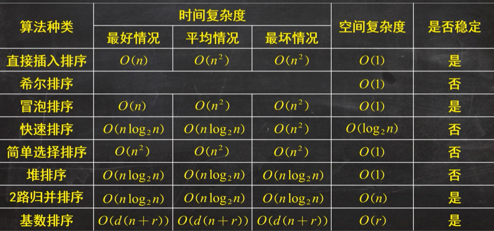

## 主方法
对于递归式$T(n) = aT(\dfrac{n}{b})+f(n)$
如果
$\Theta(f(n)) = \Theta(n^{\log_b a})$
则时间复杂度为$n^{\log_b a} \log n$

如果
$\Theta(f(n))> \Theta(n^{\log_b a})$
则时间复杂度为$\Theta(f(n))$

如果
$\Theta(f(n)) < \Theta(n^{\log_b a})$
则时间复杂度为$\Theta(n^{\log_b a})$

## 树 森林 二叉树
|树|森林|二叉树|
|-|-|-|
|pre-order traversal|pre-order traversal| pre-order traversal|
|post-order traversal|in-order traversal|in-order traversal|
|-|-|post-order traversal|
### 二叉树遍历
一定要有中序遍历才能唯一确定一颗二叉树
## 二叉查找树
左子树值大于根节点，右子树值小于根节点的树，中序遍历为升序。
### 删除
如果是叶子节点就直接删除。
如果只有左子树或者右子树就直接删除并把其左子树或右子树的根节点放在该位置。
如果有左右子树就找到右子树的最小值或者左子树的最大值，替换当前节点，然后删除该节点。
## 堆
我们通常学习的“堆”是二叉堆 (binary heap)，其中每个父节点最多有 2 个子节点。
d-堆是二叉堆的一般化形式，其中每个父节点最多可以有 d 个子节点。
记住：堆是完全二叉树。
最小堆中序遍历是无序的
### 堆的构造
从第一个非叶子节点开始，按序号顺序倒序调整子树。（在子树内进行交换操作）
### 堆的插入
放到最后一个之后逐步向上调整。
### 堆的删除
DeleteMin删除根，把最后一个元素放到根的位置，再进行调整

## 图
### kruskal 
1. 去掉所有边
2. 选取权最小且不构成回路的边
3. 直到所有顶点都并入

### prim
1. 去掉所有边，选取一个顶点加入顶点集合
2. 选取与当前顶点集合距离最近的顶点，并将该顶点和相应的边加入顶点集合，重复该操作，直到所有顶点都并入
### 排序

## 哈希
rehashing时table的大小需要扩大到原来的两倍，是一个大于原来两倍的质数
