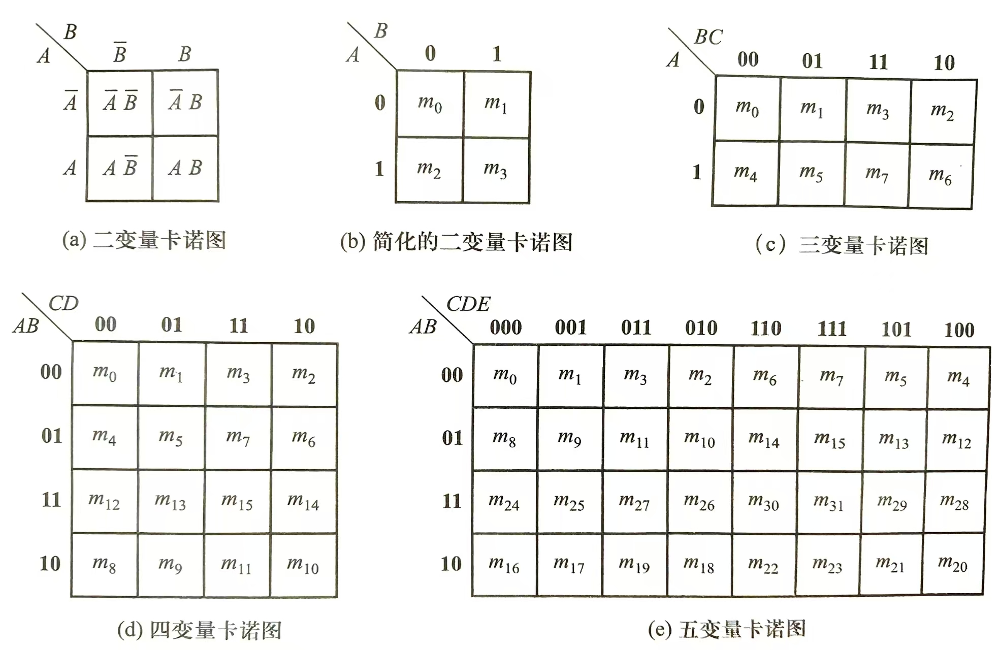
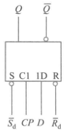
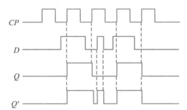
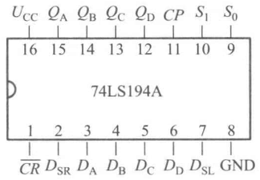
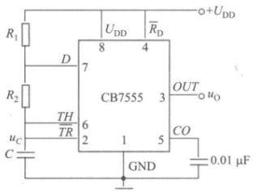

# 数电

## 数字逻辑基础

### 数制转换

#### 非十进制转十进制

按权展开即可。

#### 十进制转非十进制

整数部分和小数部分按不同方法分别进行转换。

以转换为二进制数为例

记$k_i$为二进制的各位数码，其中$k_0$为个位,$k_1$为十位，$k_{-1}$为小数点后第一位，以此类推

##### 整数部分转换

将十进制数的整数部分除以 2，所得余数即二进制数的$k_0$；
将上面得到的商再除以 2，所得余数即二进制数的$k_1$；
将上面得到的商再除以 2，所得余数即二进制数的$k_2$；
依此类推，直到所得商等于 0 为止，就得到了等值的二进制数。

##### 小数部分转换

将十进制数的小数部分乘以 2，所得乘积的整数部分即$k_{-1}$；
将上面得到的乘积的小数部分再乘以 2，所得乘积的整数部分即$k_{-2}$；
将上面得到的乘积的小数部分再乘以 2，所得乘积的整数部分即$k_{-3}$；
依此类推，直到求出要求的位数或小数部分为 0 为止，就得到了等值的二进制数。

转换为$i$进制时，将上述的 2 替换为$i$即可。

##### 例题

将十进制数$(273.69)_{10}$。转换为等值的二进制数，小数部分要求保留 4 位有效数字。

#### 二进制转十六进制或八进制

转十六进制时，从小数点为界，整数部分从右到左四位一组，小数部分从左到右四位一组，不足四位可以添 0 补全。然后将四位二进制数分别转换为对应的十六进制数后，再按顺序写在一起。
转八进制时，从小数点为界，整数部分从右到左三位一组，小数部分从左到右三位一组，不足三位可以添 0 补全。然后将三位二进制数分别转换为对应的八进制数后，再按顺序写在一起。

##### 例题

将二进制数$(1111110.1111)_2$转换为等值的十六进制数和八进制数。

$$
1110 = (14)_{10}=(E)_{16}\\
0111 = (7)_{10}=(7)_{16}\\
1111 = (15)_{10}=(F)_{16}
$$

$$
110 = (6)_{8}\\
111 = (7)_{8}\\
001 = (1)_{8}\\
100 = (4)_{8}
$$

因此，$(1111110.1111)_2=(7E.F)_{16}=(176.74)_{8}$

### 数字电路编码

#### 二-十进制码（BCD 码）

用四位二进制代码来表示一位十进制数码，这样的代码称为二-十进制码，或 BCD 码。
| 十进制数 | 8421 码 | 5421 码 | 2421 码 | 余 3 码 |
| -------- | ------- | ------- | ------- | ------- |
| 0 | 0000 | 0000 | 0000 | 0011 |
| 1 | 0001 | 0001 | 0001 | 0100 |
| 2 | 0010 | 0010 | 0010 | 0101 |
| 3 | 0011 | 0011 | 0011 | 0110 |
| 4 | 0100 | 0100 | 0100 | 0111 |
| 5 | 0101 | 1000 | 1011 | 1000 |
| 6 | 0110 | 1001 | 1100 | 1001 |
| 7 | 0111 | 1010 | 1101 | 1010 |
| 8 | 1000 | 1011 | 1110 | 1011 |
| 9 | 1001 | 1100 | 1111 | 1100 |

##### 有权 BCD 码和无权 BCD 码

有权 BCD 码：每位数码都有确定的位权的码。
其中 8421 码、5421 码、2421 码是有权 BCD 码。四个位的位权都写在名字上了。

无权 BCD 码：每位数码的位权不确定的码。
其中余 3 码、格雷码、奇偶校验码是无权 BCD 码。

##### 8421 码

8421BCD 码和代表 0~9 的二进制数一一对应

##### 5421 码

5421BCD 码的前 5 个码和 8421BCD 码相同，后 5 个码在前 5 个码的基础上加 1000 构成，这样的码前 5 个码和后 5 个码一一对应，仅高位不同；

##### 2421 码

2421BCD 码前 5 个码和 8421BCD 码相同，后 5 个码以中心对称取反，这样的码称为自反代码，如：4→0100，5→1011，显然这俩就是各位取反。0→0000，9→1111 也是如此。

##### 余 3 码

余 3 码就是 8421 码加 0011 得到的码。

##### 例题

有一数码 10010011，当作为普通二进制数时,等于十进制的（），当作为 8421BCD 码时，它表示十进制数（）

$10010011= (147)_{10}$
当转化为 8421BCD 码时，$1001=9,0011=3$，因此它表示十进制数$(93)_{10}$。

#### 原码、反码和补码

表示二进制数的方法有三种，即原码、反码和补码。在数字电路中是用加在二进制数绝对值前面的符号位表示正、负数的。习惯上用符号位的 0 表示正数，用符号位的 1 表示负数。用这种表示方法得到的数码叫做原码。同时还规定，正数的反码和补码与原码相同，所以正数不存在需要转换的问题。

##### 求负数的反码和补码

1. 保持符号位 1 不变，其余每一位求反，就得到反码。
2. 反码末位加 1 就得到补码。

##### 已知负数的补码求原码

补码的补码等于原码。

##### 补码系统下的加减法

按照二进制数的加法规则相加即可。如果补码相加过程中最后位数发生了变化，那么需要舍弃最高位让位数与原来保持一致。

值得一提的是，如果通过上述方法得到的结果是两个正数相加得到一个负数，或两个负数相加得到一个正数，那么说明发生了溢出（就像 C 语言里 int 数据类型溢出一样）。但是课本里并没有提到，所以估计不会考。

例如两个负数 10111 与 11100 相加，直接按二进制数的规则相加得到 110011，但是截断最高位，就得到 10011.

### 基本逻辑运算

#### 与、或、非及其衍生物

数字电路中，最基本的逻辑关系是与、或、非三种逻辑运算。

 

#### 异或

| $A$ | $ B$ | $F = A ⊕ B$ |
| :-: | :--: | :---------: |
|  0  |  0   |      0      |
|  0  |  1   |      1      |
|  1  |  0   |      1      |
|  1  |  1   |      0      |

异或逻辑函数表达式为
$$L = A \oplus B = \overline{A}B+A\overline{B}$$
功能为相同得 0，相异得 1.

#### 同或

| $A$ | $B$ | $F = A \odot B$ |
| :-: | :-: | :-------------: |
|  0  |  0  |        1        |
|  0  |  1  |        0        |
|  1  |  0  |        0        |
|  1  |  1  |        1        |

异或逻辑函数表达式为
$$L = A\odot B=\overline{A \oplus B }= \bar{A}\bar{B}+AB$$
功能为相同得 1，相异得 0.

### 逻辑代数

#### 基本定律

##### 自等律

$$A+0=A,A\cdot1=A$$

##### 0-1 律

$$A+1=1,A\cdot0=0$$

##### 重叠律

$$A+A=A,AA=A$$

##### 互补律

$$A+\bar{A}=1,A\bar{A}=0$$

##### 交换律

$$AB=BA$$
$$A+B=B+A$$

##### 吸收律

$$A+AB=A,A(A+B)=A,A+\bar{A}B=A+B$$

##### 分配律

$$A(B+C)=AB+AC,A+(BC)=(A+B)(A+C)$$

##### 结合律

$$A(BC)=(AB)C,A+(B+C)=(A+B)+C$$

##### 还原律

$$\overline{\overline{A}}=A$$

##### 反演律

$$\overline{A+B+C} = \bar{A}\bar{B}\bar{C} , \overline{ABC} = \bar{A}+\bar{B}+\bar{C}$$

##### 包含律

$$AB+\overline{A}C+BC = AB+\overline{A}C$$

#### 运算规则

##### 代入规则

任何一个含有变量$x$的等式，如果将所有出现$x$的位置，都用一个逻辑函数式$F$代替，则等式仍然成立。

##### 反演规则

设 F 为任意逻辑表达式，若将 F 中所有运算符常量及变量作如下变换:
| 运算符/变量 | 变换后 |
| :------------: | :------------: |
| • | + |
| + | • |
| 0 | 1 |
| 1 | 0 |
| $A$ | $\overline{A}$ |
| $\overline{A}$ | $A$ |

则所得新的逻辑式即为$F$的反函数，记为$\overline{F}$。

需要注意的是，当一个逻辑表达式中有不止一个非号的前提下，反演时只能去掉最外层的一个非号，而将该非号下面的部分看成一个组合变量，以原变量的形式代回反演式中，不需要做任何变换。

例如：$L = A+ \overline{B+\overline{C}+\overline{D+\overline{E}}}$

将最外层非号下的$B+\overline{C}+\overline{D+\overline{E}}$视为一个整体$F$，则$L = A+\overline{F}$
根据反演规则，$\overline{L} = \overline{A}\cdot F=\overline{A}(B+\overline{C}+\overline{D+\overline{E}})$

##### 对偶规则

设$F$为任意逻辑表达式，若将$F$中所有运算符和常量作如下变换:
| 运算符/变量 | 变换后 |
| :---------: | :----: |
| • | + |
| + | • |
| 0 | 1 |
| 1 | 0 |

则所得新的逻辑表达式即为$F$的对偶式，记为$F'$
例如：$L = A+ \overline{B+\overline{C}+\overline{D+\overline{E}}}$

$$L' = A\cdot \overline{B\cdot\overline{C}\cdot\overline{D\cdot\overline{E}}}$$
注意：求求对偶式时运算顺序不变。
例如：$L=\bar{A}\bar{B}+AB$

$$L' = (\bar{A}+\bar{B})\cdot (A+B)$$
要注意加上括号保持运算顺序。
如果逻辑表达式$L$成立，那么$L'$也成立，称为对偶规则。

#### 最小项

1. $n$个变量的逻辑函数的最小项，一定包含$n$个因子；
2. 在各个最小项中，每个变量必须以原变量或反变量形式作为因子出现一次，而且仅出现一次；
3. $n$个变量最多有$2^n$个最小项。

##### 最小项编号

任一个最小项用$m_i$表示，下标$i$为使该最小项为$\mathbf 1$的变量取值所对应的等效十进制数。

以三变量为例

|         最小项          | 对应二进制数 | 对应十进制数 | 编号  |
| :---------------------: | :----------: | :----------: | :---: |
| $\bar{A}\bar{B}\bar{C}$ |     000      |      0       | $m_0$ |
|    $\bar{A}\bar{B}C$    |     001      |      1       | $m_1$ |
|    $\bar{A}B\bar{C}$    |     010      |      2       | $m_2$ |
|       $\bar{A}BC$       |     011      |      3       | $m_3$ |
|    $A\bar{B}\bar{C}$    |     100      |      4       | $m_4$ |
|       $A\bar{B}C$       |     101      |      5       | $m_5$ |
|       $AB\bar{C}$       |     110      |      6       | $m_6$ |
|          $ABC$          |     111      |      7       | $m_7$ |

对于逻辑函数$F = ABC+A\bar{B}\bar{C}$
可以简化写为$F = \sum m(4,7)$，表示$F$为$m_4$与$m_7$相加

任何一个逻辑函数都可以表示成最小项之和的标准形式（又称为标准的与或表达式），且表示方法唯一。

最小项之和即列举出所有逻辑函数为'1'的情况并相加（也就是或运算）

#### 最大项

1. n 个变量构成的每个最大项，一定是包含 n 个因子的"或"项;
2. 在各个最大项中，每个变量必须以原变量或反变量形式作为因子出现一次，而且仅出现一次。

##### 最大项编号

任一个最大项用$M_i$表示，下标$i$为使该最大项为$\mathbf 0$的变量取值所对应的等效十进制数。

以三变量为例

|          最大项           | 对应二进制数 | 对应十进制数 | 编号  |
| :-----------------------: | :----------: | :----------: | :---: |
|          $A+B+C$          |     000      |      0       | $M_0$ |
|       $A+B+\bar{C}$       |     001      |      1       | $M_1$ |
|       $A+\bar{B}+C$       |     010      |      2       | $M_2$ |
|    $A+\bar{B}+\bar{C}$    |     011      |      3       | $M_3$ |
|       $\bar{A}+B+C$       |     100      |      4       | $M_4$ |
|    $\bar{A}+B+\bar{C}$    |     101      |      5       | $M_5$ |
|    $\bar{A}+\bar{B}+C$    |     110      |      6       | $M_6$ |
| $\bar{A}+\bar{B}+\bar{C}$ |     111      |      7       | $M_7$ |

对于逻辑函数$F = (A+B+C)(A+\bar{B}+\bar{C})$
可以简化写为$F = \prod M(0,3)$，表示$F$为$M_0$与$M_3$相乘

任何一个逻辑函数都可以表示成最大项之积的标准形式（又称为标准的或与表达式），且表示方法唯一。

最大项之积即列举出所有逻辑函数为'0'的情况并相乘（也就是与运算）

#### 最大项与最小项的对应关系

最大项与最小项互为反函数
$$m_{i} = \overline{M_i},M_i = \overline{m_i}$$

#### 与或式化简为其他形式

以$F = AB+\bar{A}C$为例

##### 或与式

由对偶式的定义可知式子求两次对偶就是原式。
与或式变或与式只需要求一次对偶后化简为与或式，再求一次对偶即可。
$$F' = (A+B)(\bar{A}+C)=A\bar{A}+AC+\bar{A}B+BC=AC+\bar{A}B$$
从而
$$F =(F')'=(A+C)(\bar{A}+B)$$

##### 与非-与非式

对与或式进行两次求反即可。
$$F = \overline{\overline{AB+\bar{A}C}}=\overline{\overline{AB}\cdot\overline{\bar{A}C}}$$

##### 或非-或非式

对或与式两次求反即可。
$$F = \overline{\overline{(A+C)(\bar{A}+B)}}=\overline{\overline{A+C}+\overline{\bar{A}+B}}$$

##### 与或非式

将$\overline{F}$化为最简与或式，再对该式求反。
$$\overline{F} = \overline{AB+\bar{A}C}=\overline{AB}\cdot\overline{\bar{A}C}=(\bar{A}+\bar{B})(A+\bar{C})=A\bar{B}+\bar{A}\bar{C}$$
$$F = \overline{\overline{F}} = \overline{A\bar{B}+\bar{A}\bar{C}}$$

#### 最简与或表达式

1. 所得与或表达式中，乘积项(与项)数目最少
2. 每个乘积中所含的变量数最少

#### 卡诺图

卡诺图中每个小方块称为一个单元，每个单元对应一个最小项。卡诺图中相邻方块代表的最小项只能有一个变量不同，其他变量都相同。卡诺图中最上面一行和最下面一行视作相邻，最左边一行和最右边一行也视作相邻。

下面是二三四五变量的卡诺图

##### 卡诺图合并最小项

n 变量卡诺图中：
卡诺图合并最小项即圈出含$2^m$个（**尽量多的**）相邻最小项的标 1 的矩形单元，所有的标 1 的最小项都必须被圈入**至少一个**矩形单元，也**可以被多个矩形单元共用**。每个矩形单元代表一个**最小项**（不一定是 n 次最小项）。每个单元**越大越好**。

1. 卡诺图上任何两个标 1 的方格相邻，可以合为 1 项，并可消去 1 个变量。
2. 卡诺图上任何四个标 1 方格相邻，可合并为一项，并可消去两个变量。
   四个标 1 方格相邻可以是:
   (1)同在一行或一列;
   (2)同在一田字格中。
3. 卡诺图上任何八个标 1 的方格相邻，可以并为一项，并可消去三个变量

##### 不完全确定的逻辑函数及其化简

在某些实际数字电路中，逻辑函数的输出只和一部分最小项有确定对应关系，而和余下的最小项无关。余下的最小项无论写入逻辑函数式还是不写入逻辑函数式，都不影响电路的逻辑功能。把这些最小项称为无关项。用英文字母 d 表示，对应的函数值记为“×”。

##### 例题 1

化简函数$F(A,B,C) = \sum m(0,1,2,4,6,7)$

如图。
$$F(A,B,C) =\bar{A}\bar{B}+AB+\bar{C}$$

 
 
 
 

##### 例题 2

化简函数$F(A,B,C,D) = \sum m(0,4,6,13,14,15)+\sum d(1,2,3,5,7,9,10,11)$

无关项作为 0 或 1 都不影响最终结果，也就是说卡诺图合并最小项时可以选择将无关项选入或这不选入。
如图
$$F(A,B,C,D)=\bar A +D + C$$

 
 
 
 

##### 例题 3

化简$\begin{cases}
Y = \bar B \bar C D + \bar A C \bar D\\ 
AB+AC=0
\end{cases}
$

此题不再做详细解答，想要说明的点是将$AB+AC=1$的项作为无关项即可。

## 逻辑门电路

### TTL 门电路

三极管-三极管逻辑门电路，是指输入端和输出端都用三极管的电路，简称 TTL 电路。一般由三部分组成：输入级、中间级和输出级。

对 TTL 电路而言,输入端的悬空状态和接逻辑高电平等效。
输入端经过电阻(通常取几十千欧以内)接电源电压时，与接逻辑高电平等效。
输入端经过电阻接地时，输入端的电平与电阻阻值的大小有关，当电阻阻值很小时(通常小于 1kΩ)，输入端相当于接逻辑低电平;当电阻阻值大到一定程度以后（通常大于 10kΩ），输入端电压将升高到逻辑高电平。

不能接 12V 电源，通常接 5V 电源。

#### TTL OC 门

OC 门是指输出端为开路集电极的门电路。工作时必须将输出端经上拉电阻$R_L$接到电源上。逻辑门上的菱形就是其代表符号。其最大的特点是可以**实现线与功能**。

 

1. 普通的 TTL 电路不能将输出端连在一起。输出端连在一起，可能使电路形成低阻通道，使电路因电流过大而烧毁；
2. 右图即为线与功能的实现，最终$L = \overline{AB}\cdot\overline{CD}$

 
 

#### TTL 三态门

三态门（TSL 门）的输出有三个状态，即：0，1 和高阻。在使用中，由使能控制端$\overline{EN}$来控制电路的输出状态。逻辑门上的三角形是三态门的标志符号。

1. 当$\overline{EN}=\mathbf{1}$时，等效为普通逻辑门
2. 当$\overline{EN}=\mathbf{0}$时，输出端为高阻状态。

### CMOS 门电路

对于 CMOS 门电路而言，不允许输入端工作在悬空状态。
输入端经过电阻接地时，与接逻辑低电平等效；
经过电阻接电源电压时，与接逻辑高电平等效。
可以接 12V 或 5V 电源。

#### CMOS OD 门

与 OC 门几乎一样，符号也是一样的，也是为了实现线与功能，也需要上拉电阻。

#### CMOS TG 门

CMOS 传输门，又叫 TG 门。
其特性为：

1. $C = \mathbf{1},\overline{C} = \mathbf{0}$时，TG 门为接通状态，可以理解为开关打开
2. $C = \mathbf{0},\overline{C} = \mathbf{1}$时，TG 门为断开状态，可以理解为开关关闭
3. 由于 MOS 为对称的，源极和漏极可以互换，输入和输出端也可以互
   换，即 CMOS 传输门为双向的；
4. 传输门和非门组合，可组成模拟开关；

### 输入信号噪声容限

低电平输入时的输入信号噪声容限:
$$V_{NL}=V_{IL(\max)}-V_{OL(\max)}$$
高电平输入时的输入信号噪声容限:
$$V_{NH}=V_{OH(\min)}-V_{IH(\min)}$$

### 扇出系数

即能驱动负载门的最大数目。
高电平的带负载门个数（取整数）
$$n_H=\frac{I_{OH(\max)}}{I_{IH}}$$
低电平的带负载门个数（取整数）
$$n_L=\frac{I_{OL(\max)}}{I_{IL}}$$
扇出系数是以上两者的小者。TTL 电路中扇出系数总是指$n_L$.

### 传输延迟时间

$$t_{pd} = \frac{t_{PHL}+t_{PLH}}{2}$$

## 组合逻辑电路

组合逻辑电路是由**基本逻辑门电路**构成的，其逻辑功能可以由一组逻辑函数确定。组合电路在任何时刻的输出信号的稳定值，仅仅与该时刻的输入信号有关，而**与该时刻以前的输入信号无关**。在理想情况下，若不计组合电路中各级逻辑门的延迟时间，则认为输出信号会随输入信号的变化而立即变化。因此，组合电路**没有记忆或存储功能**。
在进行电路分析之前，要先确认给定的电路是组合电路而非时序电路。组合电路只有逻辑门，没有反馈路径或存储单元。**一条反馈路径就是从一个门的输出到另一个门的输入的连接**，其中第二个门的输入是第一个门的输入的一部分。**有反馈路径的数字电路是时序电路**。

### 组合逻辑电路的设计

1. 由实际问题列出真值表。一般首先根据事件的因果关系确定输入、输出变量，进而对输入、输出进行逻辑赋值，即用 0、1 表示输入、输出各自的两种不同状态；再根据输入、输出之间的逻辑关系列出真值表。n 个输入变量，应用$2^n$个输入变量取值的组合，即真值表中有$2^n$行。但有些实际问题，只出现部分输入变量取值的组合。未出现者，在真值表中可以不列出。如果列出，可在相应的输出处标记“X”号，以示区别；化简逻辑函数时，可做无关项处理。
2. 由真值表写出输出函数逻辑表达式。
3. 第 3 步：化简、变换输出函数逻辑表达式。因为由真值表写出的函数逻辑表达式不一定是最简式，为使所设计的电路最简，需要运用第 1 章介绍的化简逻辑的数的方法，使输出表达式化为最简。同时根据实际要求（如级数限制等）和客观条件（如使用门电路的种类、输入有无反变量等）将输出表达式变换成适当的形式，例如要求用与非门来实现所设计的电路，则需将输出表达式变换成最简的与非-与非表达式。
4. 根据表达式画出电路图。

### 竞争-冒险

信号经过导线及门电路的传输都需要一定的响应时间，信号的变化也都存在一定的过渡时间，多个信号发生变化时，也可能有先后快慢的差别。因此，理想情况下设计出的逻辑电路，当考虑这些实际因素后，在输入信号变化的瞬间就可能产生错误的输出。竞争-冒险现象会导致输出产生毛刺（不应该出现的尖峰脉冲）

#### 判断依据

只要输出端的逻辑函数在一定情况下能简化为如下表达式：
$$Y=A+\bar A \ \ or \ \ Y=A\cdot\bar A$$
则可以判定该电路存在竞争-冒险。

#### 例题

判断下列逻辑函数表达式是否存在竞争-冒险现象

1. $Y = AB + \bar A C $
2. $Y = (A+\bar B)(B+C)$

第一题：先看表达式中存在一对互补变量$A$和$\bar A$，当$B=C=\mathbf{1}$时函数成为$Y=A+\bar A$。可知该电路存在竞争-冒险。
第二题：表达式中存在一对互补变量$B$和$\bar B$，当$A=C=\mathbf{0}$时函数成为$Y=\bar B B$。可知该电路存在竞争-冒险。

#### 消除方法

1. 引入选通脉冲
2. 输出端并联滤波电容
3. 修改逻辑设计，增加冗余项。

### 编码器

#### 二进制编码器

二进制编码器是用$n$位二进制代码对$N=2^n$个特定信息进行编码的逻辑电路。根据输入是否互相排斥，又可分为两类，一类称为**具有输入互相排斥的编码器**，另一类称为**优先编码器**。所谓输入互相排斥，是指在某一时刻，编码器的 N 个输入端中**仅有一个为有效电平**。换言之，编码器**在某一时刻只对一个输入信号编码，而且一个输入信号对应一个 n 位二进制代码**，不能重复。而优先编码器去除了输入互相排斥这一特殊的约束条件，它**允许在某个时刻有多个输入端为有效电平**，但只**对优先级最高的输入信号进行编码**。编码器的优先权一般遵循**高位优先**的原则。

#### 二-十进制编码器

二-十进制编码器，是用 BCD 码对$I_0\sim I_9$这 10 个输入信号进行编码的逻辑电路。显然，该电路有 10 根输入线，4 根输出线，故常称为 10 线-4 线编码器。10 线-4 线编码器也可分为输入信号互相排斥和优先编码两种。

#### 集成编码器

CD4532 是一片 8 线-3 线优先编码器。除了实现基本的编码功能外,可以发现芯片还具有一些控制管脚。EI 为该编码器的使能控制端,EI=1 编码器工作;EI=0 编码器不工作,输出无效,即 3 位输出代码$Y_2Y_1Y_0$为 000。只有在 EI=1,而且无编码对象输入时,输出 EO 为 1,它可以与相同芯片的 EI 相连,实现多片优先编码器的连接。当 EI=1,且有编码输入时,GS 端输出才为 1,表示编码器处于工作状态,其他情况下 GS 端输出为 0。
下图是 是两片 CD4532 组成的 16 线-4 线优先编码器。

#### 例题

8 线-3 线高位优先编码器的输入为$I_0\sim I_7$，当$I_0I_1I_2I_3I_4I_5I_6I_7=10101111$时，其输出的$\bar{Y_2}\bar{Y_1}\bar{Y_0}$的值是( )。
A.111 B.010 C.000 D.101

默认$I_0\sim I_7$对应十进制数 0~7，$I_7$的优先级最高，因此$Y_2Y_1Y_0=111$，即$\bar{Y_2}\bar{Y_1}\bar{Y_0}=000$，选 C。
注：字母上如果有横线代表其低电平有效，例如若输入为$\bar{I_0}~\bar{I_7}$，输出为$\bar Y_0\sim\bar Y_2$则输入输出都是以反码形式进行的，解题时需要进行转换。

### 译码器

#### 二进制译码器

二进制译码器把$n$位二进制代码代表的$2^n$个对象还原出来。

#### 显示译码器

八段半导体数码管的外形及显示字型

 

共阳极的数码管适用于配置低电平输出的译码器,而共阴极的数码管适用于高电平输出的译码器。

 

##### 例题

七段译码显示器，当译码器七个输出端状态为$abcdefg=1011111$时，高电平有效译码输入状态(8421BCD 码)应为:
由上图，1011111 应代表 6，也即 0110

#### 译码器的特点

1. 高电平输出时，输出为各输入的最小项；低电平输出时，输出为各输入最小项取反。即
   $$Y_i = m_i,\bar{Y_i}=\bar{m_i}$$
2. 利用使能控制输入端，既能使电路正常工作，也能使电路处于禁止工作状态;利用使能控制输入端，能实现**译码器容量扩展**。

#### 译码器容量扩展

2-4 译码器转 3-8 译码器
原理：$I_2 = \mathbf 1$时对应下面的低位译码器工作，对应十进制数 0~3; $I_2 = \mathbf 0$时对应上面的高位译码器工作，对应十进制数 4~7。

 

##### 例题

用**双**2 线-4 线译码器 74LS139 及最少量的与非门实现下列逻辑函数。下表是 74LS139 的功能表,右图是 74LS139 的简化逻辑图。

1. $Z_1 = \bar A \bar C+A\overline{B \oplus C}$
2. $Z_2=  AB+BC+AC$

| $\overline{ST}$ | $A_1$ | $A_0$ | $\overline{Y_3}$ | $\overline{Y_2}$ | $\overline{Y_1}$ | $\overline{Y_0}$ |
| :-------------: | :---: | :---: | :--------------: | :--------------: | :--------------: | :--------------: |
|        1        |   ×   |   ×   |        1         |        1         |        1         |        1         |
|        0        |   0   |   0   |        1         |        1         |        1         |        0         |
|        0        |   0   |   1   |        1         |        1         |        0         |        1         |
|        0        |   1   |   0   |        1         |        0         |        1         |        1         |
|        0        |   1   |   1   |        0         |        1         |        1         |        1         |

双 2 线-4 线译码器，即两个 2 线-4 线译码器。函数有三个变量，因此要先将两个 2 线-4 线译码器接为 3 线-8 线译码器。

由于是用与非门实现，所以要写成与非-与非式。

对照功能表有$\overline{Y_0}=\overline{A\bar B \bar C},\overline{Y_1}= \overline{A \bar B C},\overline{Y_2}=\overline{A B\bar C},\overline{Y_3}=\overline{A BC},\overline{Y_4} = \overline{\bar A \bar B \bar C},\overline{Y_5} = \overline{\bar A \bar B C},\overline{Y_6} = \overline{\bar A B \bar C},\overline{Y_7} = \overline{\bar A BC}$

$Z_1 = \bar A \bar C+A(\overline{\bar B C+B\bar C}) = \bar A \bar C+A(\overline{\bar B C}\cdot \overline{B\bar C})=\bar A \bar C+A(B+\bar C)(\bar B+C)=\bar A\bar C+ABC+A\bar B\bar C=\bar A B \bar C+\bar A \bar B\bar C+ABC+A\bar B\bar C=\overline{\overline{A\bar B \bar C}\cdot \overline{A BC}\cdot \overline{\bar A \bar B \bar C}\cdot  \overline{\bar A B \bar C}} = \overline{\bar{Y_0}\bar{Y_3}\bar{Y_4}\bar{Y_6}}$，把这四路输出用与非门连接即可
同理把$Z_2$写成最小项的形式
$Z_2 = ABC+AB\bar C+\bar ABC+A\bar B C = \overline{\bar Y_3 \bar Y_2 \bar Y_7 \bar Y_1}$

### 数据选择器

在数字系统中，经常需要从多路输入数据中选择其中一路送至输出端。完成这一功能的逻辑电路称为数据选择器。它的作用相当于多个输入的单刀多掷开关，其功能和数据分配器相反。通常把数据输入端的数目称为通道数，每个通道可以是一路，也可以是多路。数据选择器的缩写为 MUX。
四选一数据选择器的功能
| 输入 | 输入 | 输出 |
| :---: | :---: | :---: |
| $A_1$ | $A_0$ | $Y$ |
| 0 | 0 | D₀ |
| 0 | 1 | D₁ |
| 1 | 0 | D₂ |
| 1 | 1 | D₃ |

其逻辑表达式为
$$Y = \bar A_1\bar A_0 D_0+\bar A_1A_0D_1+A_1\bar A_0 D_2+A_1A_0D_3 = \sum m_iD_i$$

#### 例题

数据选择器 74LS153 如右图所示，试用 4 选 1 数据选择器产生逻辑函数$Y=ABC+AC+BC$

$Y=ABC+AC+BC=ABC+A\bar B C+\bar A BC $
令$A = A_1,B=A_0,D_1=D_2=D_3=C,D_0 = 0$即可。

 
 
 
 
 
 

### 数据分配器

数据分配器将一路串行输入数据,在位分配地址的控制下,依次送到$2^n$路输出通道上去。
每个输出通道的函数为

$$
\begin{align*}
\overline{D}_3 &= \overline{D}_i(\overline{A}_1 \overline{A}_0) = \overline{D}_i(m_3), \\
\overline{D}_2 &= \overline{D}_i(\overline{A_1 \overline{A}_0}) = \overline{D}_i(m_2) \\
\overline{D}_1 &= \overline{D}_i(\overline{\overline{A}_1 A_0)}= \overline{D}_i(m_1), \\
\overline{D}_0 &= \overline{D}_i(\overline{\overline{A}_1 \overline{A}_0}) = \overline{D}_i(m_0)
\end{align*}
$$

### 加法器

#### 半加器

如果仅仅考虑两个一位二进制数$A$和$B$相加，而不考虑低位的进位，称为半加。实现半加运算的电路叫做半加器。半加器有两个输入端$A$和$B$，两个输出端$S$和$C$，其中$S$为本位和，$C$为向高位的进位。
| $A$ | $B$ | $C$ | $S$ |
|:-------:|:-------:|:-------:|:-------:|
| 0 | 0 | 0 | 0 |
| 0 | 1 | 0 | 1 |
| 1 | 0 | 0 | 1 |
| 1 | 1 | 1 | 0 |

逻辑表达式
$$S = \bar A B+ A \bar B = A\oplus B\\ C = AB$$

#### 全加器

被加数、加数和相邻低位的进位分别为$A_i,B_i$和$C_{i-1}$,全加和以及向高位
的进位分别为$S$和$C$,

| \(A_i\) | \(B_i\) | \(C\_{i-1}\) | \(C_i\) | \(S_i\) |
| :-----: | :-----: | :----------: | :-----: | :-----: |
|    0    |    0    |      0       |    0    |    0    |
|    0    |    0    |      1       |    0    |    1    |
|    0    |    1    |      0       |    0    |    1    |
|    0    |    1    |      1       |    1    |    0    |
|    1    |    0    |      0       |    0    |    1    |
|    1    |    0    |      1       |    1    |    0    |
|    1    |    1    |      0       |    1    |    0    |
|    1    |    1    |      1       |    1    |    1    |

右图为由两个半加器和一个或门组成的全加器。
逻辑表达式

$$
S = A_i \oplus B_i \oplus C_{i-1} \\
C_i = A_i B_i + (A_i \oplus B_i) C_{i-1}
$$

 
 

#### 串行进位加法器

有了 1 位半加器和全加器电路以后,就可以实现任意位的二进制数相加了。
串行进位加法器的优点是电路结构比较简单，缺点是运算速度慢。
 
 

### 数值比较器

比较两个二进制数值的大小,可以用数值比较器来完成。

| \(A_i\) | \(B_i\) | \(L\_{A_i > B_i}\) | \(L\_{A_i < B_i}\) | \(L\_{A_i = B_i}\) |
| :-----: | :-----: | :----------------: | :----------------: | :----------------: |
|    0    |    0    |         0          |         0          |         1          |
|    0    |    1    |         0          |         1          |         0          |
|    1    |    0    |         1          |         0          |         0          |
|    1    |    1    |         0          |         0          |         1          |

## 时序逻辑电路

### 锁存器与触发器

#### 基本 RS 触发器

触发器具有 0 和 1 两个稳定状态，在触发信号作用下，可以从原来的一种稳定状态转换到另一种稳定状态。触发器的输出状态不仅和当时的输入有关，而且和以前的输出状态有关，这是触发器和门电路的最大区别。
</img>

RS 触发器是一种具有两个输入端的触发器，其输入端分别为$\overline{R}$和$\overline{S}$，$\overline{R}$为复位端(Reset)，$\overline{S}$为置位端(Set)。

 
 
 
 

基本 RS 触发器的逻辑状态转换表和图形符号

  
  

RS 触发器的特征：

1. 触发器的输出有**两个稳态**：$Q=\mathbf{0} ,\overline{Q}=\mathbf{1}$和$Q=\mathbf{1},\overline{Q}=\mathbf{0}$。这种有两个稳态的触发器通常称为**双稳态触发器**。若令$\overline{S}=\mathbf{1} ,\overline{R}=\mathbf{1}$，触发器的状态就可以保持,说明双稳态触发器具有**记忆**功能。
2. 利用加于$\overline{R},\overline{S}$端的负脉冲可使触发器**由一个稳态转换为另一稳态**。加入的负脉冲称**触发脉冲**。
3. 可以直接置位。当$\overline{R}=\mathbf{0}，\overline{S}=\mathbf{1}$时，$Q=\mathbf{0}$，所以$\overline{R}$端称为置$\mathbf{0}$端或复位端;而$\overline{R}=\mathbf{1},\overline{S}=\mathbf{0}$时，$Q=\mathbf{1}$所以$\overline{S}$端称为置$\mathbf{1}$端或置位端。$\overline{S},\overline{R}$上方的“$\bar{\quad}$”（非号）表示加负脉冲（低电平）时才有这个功能。图形符号中$\overline{S},\overline{R}$靠近方框处的小圆圈也表示该触发器是用低电平触发的。$\overline{Q}$引线靠近方框处的小圆圈表示该端状态和$Q$端相反
   
   基本 RS 触发器的波形图
   
   应用：RS 触发器消除机械开关的信号抖动

#### 同步 RS 触发器

在数字系统中往往要求触发器的动作时刻和其他部件相一致，这就必须有一个同步信号，以协调触发器和触发器 、触发器和其他数字逻辑部件的动作。同步信号是一种脉冲信号，通常称为时钟脉冲(Clock Pulse,简称 CP)
</img>

1. $R,S$端为输入端，$CP$端为时钟脉冲输入端，$\overline{S_d},\overline{R_d}$为直接置位、直接复位端。
2. 图形符号中、方框内文字符号$C1,1S,1R$中的$1$是一种关联标识，表示$C1$和$1S$、$1R$是相互关联的输入，即只有在$C1$是高电平时，$1S$、$1R$才起作用
3. $C1$外引线靠近框处加有一小圆圈，则表示是低电平有效，无小圆圈则表示是高电平有效
4. $\overline{S_d},\overline{R_d}$不受$CP$的控制和$SR$的影响，称为异步输入端，可以使触发器直接置位或复位。当$\overline{S_d}=0,\overline{R_d}=1$时，$Q=1$，直接置位，当$\overline{S_d}=1,\overline{R_d}=0$时，$Q=0$，直接复位。所以$\overline{S_d}$和$\overline{R_d}$分别称为直接置位输入端和直接复位输入端，它们都是低电平或负脉冲时有效。$\overline{S_d}$和$\overline{R_d}$常用来设置所需要的初始状态，一般应在时钟脉冲到来之前设定触发器的初始状态。不作用时，$\overline{S_d}$和$\overline{R_d}$应保持高电平。
5. 只有在$CP=\mathbf{1}$时，触发器状态才会根据$S,R$端的输入而改变。$S$和$R$称为同步输入端。把这种触发方式称为**电平触发方式**。电平触发方式的优点是**结构简单，动作比较快**。缺点是 CP=1 期间，输入状态的变化会引起输出状态的变化。因此电平触发方式的触发器**不能用于计数，只能用于锁存数据**。
   
6. 逻辑函数
   \[ Q^{n+1} = S + \overline{R} \cdot Q^n \]

\[ R \cdot S = 0 \quad \text{(约束条件)} \]

#### D 锁存器

这是一个单端输入的触发器，称为同步$D$触发器。又由于它只能用于锁存数据，故通常称为$D$锁存器。
</img>

当$CP=\mathbf{0}$时,$D$输入端被封锁,数据不能传人,$D$锁存器状态不变
当$CP=\mathbf{1}$时，$D$锁存器输出状态由$D$输入端电平决定，若$D=1$则$Q=1$,若$D=0$则 $Q=0$。一旦$CP$重新变为$\mathbf{0}$,$\mathbf{0}$数据就被锁存。

$D$锁存器的逻辑函数表达式（通常称为特性方程）为
$$Q^{n+1}=D$$

#### 正边沿触发的$D$触发器

</img>

在很多情况下（如计数），要求对应于一个时钟脉冲触发器只能翻转一次。用边沿触发的触发器，其次态仅由$CP$上升沿或下降沿到达时输入端的信号决定，而在此以前或以后输入信号的变化不会影响触发器的状态。边沿触发器分为正边沿（上升沿）触发器和负边沿（下降沿）触发器两类。
注意图中方框内$C1$处有一个符号“^”，标识$C_1$的输入由$\mathbf{0}$变$\mathbf{1}$时，$1D$的输入起作用，即正边沿触发。正边沿 D 触发器与 D 锁存器的特性方程是一致的，即
$$Q^{n+1}=D$$

#### 负边沿触发的$JK$触发器

</img>

$JK$触发器可能个有两个输入端，也可能有多个输入端。它们之间是**与**逻辑关系。即$J=J_1J_2,K=K_1K_2$。
$\overline{S_d},\overline{R_d}$为直接置位、直接复位端。$CP$是时钟脉冲输入端。$CP$端靠近方框处有一小圆圈，加上方框内的符号“^”，表示$CP$信号从高电平到低电平时有效，即属负边沿（下降沿）触发。
其特性方程为
$$Q^{n+1}=J\overline{Q^n}+\overline{K}Q^n$$

#### T 触发器

如果把触发器的$J$、$K$端连在一起 ，输入端用$T$表示，则称为$T$触发器
很容易由$JK$触发器的特性方程得出$T$触发器的特性方程为
$$Q^{n+1}=T \overline{Q^n}+\overline{T}Q^n$$

### 时序逻辑电路的分析与设计

Moore 型时序逻辑电路的输出仅仅与记忆电路的状态有关。而 Mealy 型时序逻辑电路的输出既与记忆电路的状态有关,还与外部输入信号相关。一般研究 Moore 型时序逻辑电路。
同步时序电路是有统一时钟控制的电路，异步时序电路是没有统一时钟控制的电路。同步时序电路的状态转换是由时钟脉冲的上升沿或下降沿触发的，而异步时序电路的状态转换是由输入信号的变化触发的。一般研究同步时序电路。

#### 分析

1. 组合逻辑电路对外输出的逻辑表达式，称为**输出方程**。
2. 各个触发器输入端的逻辑函数表达式，称为**驱动方程**。
3. 把各个触发器的驱动方程代入触发器的特性方程，得出各触发器的**状态方程**
4. **逻辑状态转换图**是用圆圈内的二进制数表示计数器的状态，圆圈与圆圈之间的箭头表示状态的转换方向的图。
5. 逻辑状态转换表不必多说。

##### 有效状态和无效状态

计数循环中出现的状态称为**有效状态**，计数循环中不出现的状态称为**无效状态。**

##### 自启动

**在任何初始状态下都能在时钟脉冲作用下使电路自动回到某一个有效状态（即进入循环），则称该电路能自启动。**

#### 设计

以下面这个例题来说明时序逻辑电路的设计过程
试用下降沿触发的 J-K 触发器设计 4 进制计数器,转换序列为 00-01→10→11→00，要求写出状态转换图，状态转换表，次态卡诺图，状态方程,驱动方程并画出逻辑图。

$$Q_1^{n+1} = \bar Q_1^n \\ Q_2^{n+1} = \bar Q_2^n Q_1^n + Q_2^n\bar Q_1^n$$
把它整理为$JK$触发器的对应形式
$$Q_1^{n+1} = 1\cdot \bar Q_1^n + 0 \cdot Q_1^n \\ Q_2^{n+1} =  \bar Q_2^n Q_1^n + Q_2^n\bar Q_1^n$$
驱动方程
$$J_1 = K_1 = \mathbf 1 \\ J_2 = K_2 = Q_1^n$$
电路图

### 计数器

#### 异步二进制计数器

每经过一级触发器，脉冲波形的周期就要增加一倍，因此二进制计数器具有 2 分频作用。对于 N 位二进制计数器，第 N 个触发器的输出脉冲频率为计数器输入脉冲频率的$\dfrac{1}{2^N}$。

异步计数器的优点是结构简单，缺点是各触发信号逐级传递，需要一定的传输延迟时间，所以计数速度较**慢**。为此可采用同步计数器。

#### 同步二进制计数器

1. 同步二进制计数器的模为$2^n$(n 为触发器的个数，也就是该计数器所用二进制编码的位数)，没有多余状态，因此状态利用率最高。
2. 用 T 触发器构成的同步二进制加法计数器，电路连接有以下两条规律，按这两条规律，可以很方便地构成任意位同步二进制计数器。
   1. $T_0=1$，即每输入一个计数脉冲，最低位的触发器状态翻转一次。其原因是二进制数只有 0 和 1 两个数码，而最低位每输入一个计数脉冲就必须加 1，导致该位翻转一次。
   2. $T_i = Q_{i-1}Q_{i-2}\cdots Q_0(i>0)$即除最低位外，其他各位的翻转条件是它的低位均为 1。原因是当所有低位均为 1 时，表明低位已计满，再增加 1 时，必须向高位进位加 1，导致此高位翻转一次。
3. 由于这种计数器属于同步时序电路，应该翻转的触发器直接受计数脉冲控制而同时翻转，所以工作速度较快。

#### 同步十进制计数器

同步十进制计数器，也称为 BCD 码计数器或模 10 计数器。由于 BCD 码种类较多，因而相应的十进制计数器电路也各式各样，最常见的为 8421BCD 码十进制计数器。
上图为 8421BCD 码同步十进制加法计数器的原理图。该电路实际上是在同步二进制计数器基础上修改而成的。在计数器的状态未到达 9(1001)之前，按二进制计数，一旦计数器状态到达 9(1001)，则在下一个计数脉冲输入后，计数器状态由 1001 变为 0000。

#### 集成计数器 74HC163

</img>

同步置数、同步清零。

##### 引脚功能

1. 同步清零。引脚$\overline{CR}$。$\overline{CR}=0$时，不管其他输入端的状态如何，当时钟脉冲$CP$上升沿来到后，计数器输出将被置零。由于清零和$CP$上升沿同步，称为同步清零。
2. 同步并行预置数。在$\overline{CR}=1$的条件下，当$\overline{LD}=0$、且有时钟脉冲$CP$的上升沿作用时，$D_3\sim D_0$输入端的数据将分别被$Q_3\sim Q_0$所接收。
3. 保持功能。在$\overline{CR}=\overline{LD}=1$的条件下，当$CT_T\cdot CT_P=0$，即两个使能端计数器中有 0 时,不管有无$CP$脉冲作用,都能保持原状态不变(禁止计数)。需要说明的是，当$CT_P=0，CT_T=1$时，进位输出$CO$也保持不变;而当$CT_T=0$时，不管状态如何，进位输出$CO = 0$
4. 计数。当$\overline{CR}=\overline{LD}=CT_T=CT_P=1$时，计数器正常计数。
5. 进位输出引脚$CO=CT_T\cdot Q_3Q_2Q_1Q_0$

| $CP$ | $\overline{CR}$ | $\overline{LD}$ | $CT_P$ | $CT_T$ | 功能                   |
| ---- | --------------- | --------------- | ------ | ------ | ---------------------- |
| ↑    | 0               | ×               | ×      | ×      | 同步清零               |
| ↑    | 1               | 0               | ×      | ×      | 同步置数               |
| ×    | 1               | 1               | 0      | 1      | 保持（包括 CO 的状态） |
| ×    | 1               | 1               | ×      | 0      | 保持（CO = 0）         |
| ↑    | 1               | 1               | 1      | 1      | 加计数                 |

而对于计数器 74HC161，同步计数、异步清零，也就是说**清零可以立即完成而不需要等待时钟的边沿。**

#### 可逆计数器 74LS192

#### 任意进制计数器

计数器的模数即是计数器在溢出之前能够达到的最大计数值。N 进制计数器的模数就是 N.

##### 反馈清零法

假设已有计数器从初始状态$S$。（通常是触发器全为 0 的状态）开始计数，当接收到 M 个计数脉冲后，电路进入$S_M$状态。如果这时利用$S_M$的二进制代码通过组合电路产生**异步清零**信号，并反馈到已有计数器的$\overline{CR}$端，于是电路仅在$S_M$状态短暂停留后就立即复位到 S。状态，这样就跳越了$N\sim M$个状态而获得 M 进制计数器。

##### 置数法

置数法是通过控制已有计数器的预置数控制端$\overline{LD}$(当然以计数器有预置数功能为前提)来获得任意进制计数器的一种方法，其基本原理是:利用给计数器重复置入某个数值来跳跃$N\sim M$个状态，从而获得 M 进制计数器
##### 例题

</img>

用 4 位同步二进制计数器 74LS161 接成十二进制计数器，
(1) 采用置零法
(2) 采用置数法，并从 C 端得到进位输出。可以附加必要的门电路。
注：这里的$CLK$对应$CP$，$ET$对应$CT_T$，$EP$对应$CT_P$。

(1) 置零法

(2)置数法

由上图可以看出，对于同步置数、异步清零的 74LS161 计数器，置零法采用的是异步清零，因此在$Q_3Q_2Q_1Q_0 = 1100 = (12)_{10}$时再清零
而置数法采用的是同步置数，需要等待下一个时钟脉冲的到来，因为在$Q_3Q_2Q_1Q_0 = 1011 = (11)_{10}$时就准备好下一个置数值。在下一个时钟脉冲到来时，计数器就会被置为$Q_3Q_2Q_1Q_0 =0000$。

#### 计数器连接
</img>

设第$i$级计数器的模为$M_i$，则多片级联后的计数器容量等于
$$N=\prod^n_{i=1}M_i$$
大容量计数器的设计可以分成两步:第一步是应用反馈清零法或反馈置数法设计模为M的计数器,第二步是完成各级间的整体连接。

例如：
试用中规模集成计数器74HC163设计一个8421码的六十进制计数器
##### 同步级联

##### 异步级联

##### 减法计数器
用中规模集成计数器74LS192设计8421码的六十进制减法计数器。

74LS192没有专门用于控制保持的引脚，因此采用异步级联方式。

#### 序列脉冲发生器
</img>
试用74HC163设计一个1100110001列脉冲发生器。

首先观察数据有几位，几位就是几进制计数器。先用163设计一个十进制计数器

然后列出状态图

然后一个状态对应一位的输出，画出卡诺图
 

  
  

由卡诺图得
$$Z = \bar Q_3 \bar Q_1 + Q_3Q_0$$
最后画出电路图

 

#### 序列检测电路
课本p207
<!-- ### 寄存器
#### 移位寄存器

移位寄存器不仅具有存放数码的功能，而且还具有移位的功能，这种寄存器称为移位寄存器。所谓移位，就是**在移位脉冲作用下使得寄存器的数码向左或向右移位**。通过对数码移位，可以实现两个二进制数的串行相加、相乘和其他的算术运算。

移位寄存器可分为单向移位寄存器和双向移位寄存器。按输入方式的不同，可分为串行输入和并行输入；按输出方式不同，可分为串行输出和并行输出。

##### 单向移位寄存器

向移位寄存器可分为右移寄存器和左移寄存器两种。数码自左向右移称为右移寄存器，数码自右向左移称为左移寄存器

单向右移寄存器逻辑图

##### 双向移位寄存器

</img>

图中$D_{_A},D_{_B},D_{_C},D_{_D}$为并行输入端；$Q_A,Q_B,Q_C,Q_D$为对应的并行输出端；$D_{SR}$和$D_{SL}$分别为右移和左移串行数据输入端；$\overline{CR}$为直接清零端；$S_{1},S_{0}$为工作模式控制端。

看一眼即可，感觉不会考

移位寄存器的应用很广，可用作数据转换，如把串行数据转换为并行数据,或把并行数据转换为串行数据；也可构成寄存器型计数器、顺序脉冲发生器、串行累加器等。 -->

### 计数器

#### 555 集成定时器

</img>

</img>

**回差的意思是两个输入引脚之间电压的差值**
**各引脚**：

1. 1 号引脚$GND$，接地。
2. 2 号引脚$\overline{TR}$(Trigger)，低触发端，低于参考电压$V_{R2}$有效
3. 3 号引脚$OUT$，输出$V_O$
4. 4 号引脚$\overline{R_D}$，置零输入端，若接低电平输出直接置零，因此**电路正常工作时接高电平**
5. 5 号引脚$CO$，(Control)外接电压时改变参考电压$U_{R1},U_{R2}$的值，**该引脚不用时传入一只$0.01\mu F$电容接地，以防引入高频干扰**
6. 6 号引脚$TH$(Threshold)，高触发端，高于参考电压$V_{R1}$有效
7. 7 号引脚$D$，(Discharge)放电端
8. 8 号引脚$U_{DD}$，接电源。
   

<!-- 给一些奇怪的记法：4 是 reset 口，是因为人 4 了就 reset 了
5（我，指 555）很有控制欲，所以是 control 口
7 是一个插头，所以是 discharge 口
8 翻一下是$\infty$，所以是电源口，对应的 1 是接地
**一拍脑袋想出来的，学电工电子学学疯了导致的** -->

判断准则（口诀）：

1. 有置零，先置零（置零信号有效时，输出信号置零）
2. 低有效，高截止（置零无效时，低触发信号低于低参考信号，则输出$\mathbf{1}$，即输出高电位且 MOS 管截止）
3. 高有效，低导通（置零、低触发信号均无效时，高触发信号高于高参考信号，则输出$\mathbf{0}$，即输出低电位且 MOS 管导通）
4. 都无效，则不变（置零、低触发信号、高触发信号均无效时，输出保持不变）
5. **不应该出现均有效的情况，这种情况下基本$RS$触发器输出状态不定。**

**以下三种 555 构成的电路都需要会分析原理**

#### 555 构成的多谐振荡器

</img>

**电容充电时间**$$T_1=(R_1+R_2)C\ln 2$$（充电时电流经过$R_1$和$R_2$）
**电流放电时间**$$T_2=R_2C \ln 2$$（放电时电流只经过$R_2$）
**周期**$$T=T_1+T_2=(R_1+2R_2)C \ln 2$$
**占空比**$$D=\frac{T_1}{T}=\frac{R_1+R_2}{R_1+2R_2}$$
多谐振荡器没有稳定状态，是**无稳态触发器**。
#####  555 构成的脉宽调制波发生器
</img>

如果在引脚4加上某一低频脉冲信号$\overline{R_D}$,电路将在$\overline{R_D}$为高电平时振荡,低电平时停振,输出为脉冲调制波。
##### 任意占空比的多谐振荡器

</img>

将电容的充放电回路分开,就可以实现占空比大范围调节,而周期不变
的多谐振荡器,即可以实现脉宽调制波 PWM 输出。
**电容充电时间**$$T_1=(R_1+R_w')C\ln 2$$（充电时电流经过$R_1$和$R_2$）
**电流放电时间**$$T_2=(R_2+R_w'')C \ln 2$$（放电时电流只经过$R_2$）
**周期**$$T=T_1+T_2=(R_1+R_2+R_w)C \ln 2$$
**占空比**$$D=\frac{T_1}{T}=\frac{R_1+R_w'}{R_1+R_w''}$$
可以任意调节占空比。

##### 充电、放电电容各自分开的多谐振荡器
</img>

合上电源后，$C_1,C_2$都充电。$C_1$充电回路为 $R、D_1、C_1$,充电快,但不决定电路状态翻转。$C_2$充电回路为$R_2,R_{w2},C_2$,充电慢,它决定电路状态翻转。电路翻转后,$C_1,C_2$ 都放电。但$C_2$放电快,它的放电不决定电路翻转,$C_1$放电慢,它决定电路状态转换。

**高电平**$$T_1=(R_2+R_{w2})C_2\ln 3$$
**低电平**$$T_2=(R_1+R_{w1})C_1\ln 3$$
**周期**$$T=T_1+T_2=(R_2+R_{w2})C_2\ln 3+(R_1+R_{w1})C_1\ln 3$$
**占空比**$$D=\frac{T_1}{T}=\frac{(R_2+R_{w2})C_2}{(R_1+R_2+R_{w1}+R_{w2})C_1}$$

#### 555 构成的单稳态触发器

单稳态触发器**只有一个稳态**，当无外加触发信号时，触发器即保持在这一稳态。当外加触发信号作用后，触发器翻转到一个**暂态**，持续一段时间后它又会自动**返回到原来的稳态**。

输出的脉冲宽度
$$t_w=RC\ln 3$$
555 构成的单稳态触发器，要求输入触发脉冲宽度一定要小于$t_w$。若触发脉冲是周期性的，它的周期必须大于$t_w+t_r$

单稳态触发器主要用于整形、定时和延时

#### 555 构成的施密特触发器

如果要使输出信号的高电平不同于$U_{DD}$，可以在放电端(7 脚)经一电阻与
另一电源$U_{DD}'$相接，这时输出信号$u_{o}'$的高电平为$U_{DD}'$。

施密特触发器能把变化非常缓慢的输入信号变化成边沿很陡的矩形脉冲输出。它所具有的**滞回**特性，使它在波形的变换、整形、幅度鉴别等方面得到广泛应用

## ADC与DAC
### 数模（D/A）转换器
数模转换器的作用是将数字信号转换成模拟信号。
#### 权电阻转换器
</img>

##### 工作原理
对于输入一个任意 4 位二进制数$D_3D_2D_1D_0$，有
$\displaystyle I_3=\frac{V_{REF}}{R}D_3，I_2=\frac{V_{REF}}{2R}D_2，I_1=\frac{V_{REF}}{2^2R}D_1，I_0=\frac{V_{REF}}{2^3R}D_0$。

则运放的输出电压可以表示为
$$U_o=-R_fi_{O}=-\frac{V_{REF}R_f}{2^3R}(D_32^3+D_22^2+D_12^1+D_02^0)=-\frac{V_{REF}R_f}{2^3R}(D_3D_2D_1D_0)_2$$

当$R_f=\dfrac{R}{2}$时，
$$U_o=-\frac{V_{REF}}{2^4}(D_3D_2D_1D_0)_2$$
**以此类推，对于 n 位的 D/A 转换器则有**
$$U_o=-\frac{V_{REF}R_f}{2^{n-1}R}\sum_{i=0}^{n-1}D_i2^i=-\frac{V_{REF}R_f}{2^{n-1}R}(D_3D_2D_1D_0)_2$$

#### 倒T型转换器

</img>

由电路图可知，从输入端看整个电阻网络的等效电阻为$2R$，总电流$I=\dfrac{V_{REF}}{2R}$。并且有$\displaystyle I_3=\frac{I}{2}，I_2=\frac{I}{2^2}，I_1=\frac{I}{2^3}，I_0=\frac{I}{2^4}$。
对于输入一个任意4位二进制数$D_3D_2D_1D_0$，有
$$I_{o1}=\frac{1}{2^4}(D_32^3+D_22^2+D_12^1+D_02^0)$$
运放的输出电压可以表示为
$$U_o=-R_fI_{out1}=-\frac{V_{REF}R_f}{2^4R}(D_32^3+D_22^2+D_12^1+D_02^0)=-\frac{V_{REF}R_f}{2^4R}(D_3D_2D_1D_0)_2$$
当$R_f=R$时
$$U_o=-\frac{V_{REF}}{2^4}(D_3D_2D_1D_0)_2$$
**以此类推，对于n位的D/A转换器则有**
$$U_o=-\frac{V_{REF}R_f}{2^nR}\sum_{i=0}^{n-1}D_i2^i=-\frac{V_{REF}R_f}{2^{n}R}(D_3D_2D_1D_0)_2$$

#### 主要参数
##### 分辨率
定义为最小输出电压$V_{LSB}$(此时输入数字代码中只有最低有效位为1，其余各位均为0)与最大输出电压$V_{OM}$(或称满量程输出电压，即此时输入数字代码中各位均为1)之比。 

如输入数字代码为10位的AD7520的分辨率为:$\dfrac{1}{2^{10}-1}$
### 模数(A/D)转换器

#### 逐次逼近型 A/D 转换器

在模拟量转换成数字量期间，输入模拟量应保持不变 ，因而输入信号$U_x$应是**经过取样-保持后才加到比较器**的。

计算类的题目应该只有两种题型

#### 例题 7.1

在 10 位逐次逼近型 A/D 转换器中，设时钟信号频率为 1MHz，试计算完成一次转换所需要的时间。

**对于 n 位 A/D 转换器，转换一次需要 n+2 个时钟脉冲周期。**
$$T=\frac{1}{f}=10^{-6}s$$
因此对于 10 位逐次逼近型 A/D 转换器，转换一次需要$1.2\times10^{-5}s$

#### 例题 7.2

在逐次逼近型 A/D 转换器中，如果已知 8 位 D/A 转换器的最大输出电压为 9.945V，则当输入电压为$U_x=6.435V$时，A/D 转换器输出的二进制数为？

直接记公式得了，有
$$\frac{2^n-1}{2^n}U_{REF}=U_{max},\frac{U_{REF}}{2^n}x=U_x$$
在这个题目中,
$$\frac{2^8-1}{2^8}U_{REF}=9.945V$$
解得$$U_{REF}=9.984V$$
$$\frac{9.984V}{2^8}x=6.435V$$
解得$x=165$
转换为二进制数为$10100101$
**注意：答案要舍去所有小数点后的数字。**

#### 双积分型 A/D 转换器

双积分型 A/D 转换器属于**间接** A/D 转换器。

$T_c$为计数脉冲周期，则**第一次积分时间**
$$T_1=2^nT_c$$

**第二次积分时间**
$$T_2=\frac{2^nT_c}{U_{REF}}U_x$$
**结果为**
$$D_{out}=\frac{T_2}{T_c}$$
计算题应该只有这一种题型

#### 例题 7.3

双积分型 A/D 转换器中，计数器为 8 位二进制计数器，时钟脉冲的频率为 200kHz，$U_{REF}=10V$，试求：
(1)$U_x=3.75V$时第一次和第二次积分的时间和转换完成后计数器的状态。
(2)$U_x=11.25V$时第一次和第二次积分的时间和转换完成后计数器的状态。

$$T_c=\frac{1}{f}=5\times 10^{-6}s$$
(1)
$$T_1=2^8T_c=1.28\times10^{-3}s$$
$$T_2=\frac{1.28\times10^{-3}s}{10}\cdot3.75=4.8\times10^{-4}s$$
$$D_{out}=\frac{T_2}{T_c}=96$$
转换为二进制为 01100000
(2)
$$T_1=1.28\times10^{-3}s$$
$$T_2=1.44\times10^{-3}s$$
$$D_{out}=\frac{T_2}{T_c}=288\text{溢出}$$
**8 位 A/D 转换器最高到 255，此时计数器溢出，工作不正常**
$$D_{out}=288-256=32$$
转换为二进制为 00100000

**因此，理论上要保证$U_x<U_R$即$T_2<T_1$该转换器才能正常工作**
