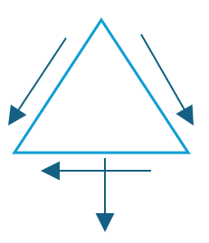
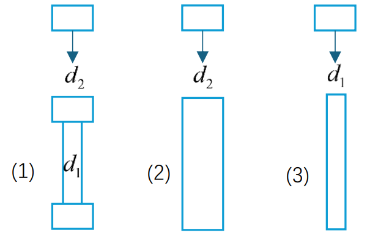
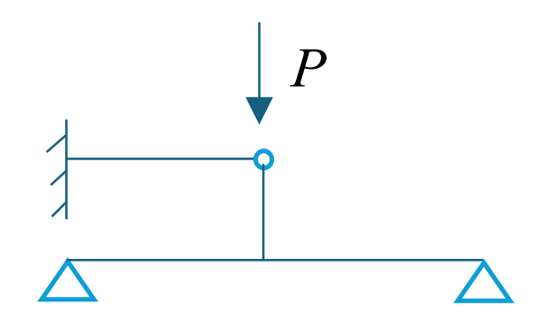
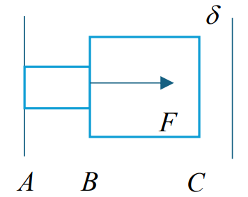
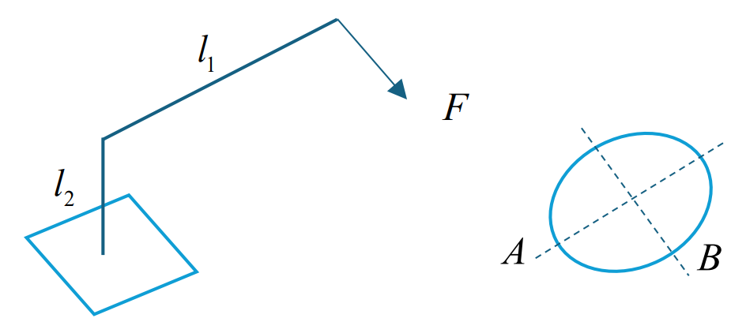
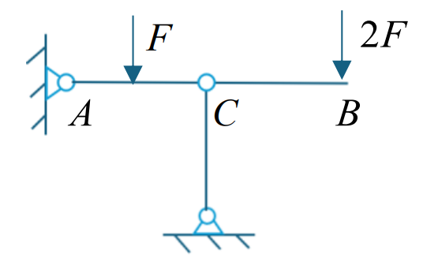
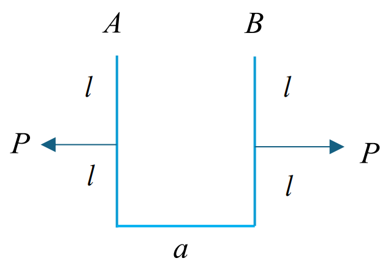

一、选择题
T1：对于低碳钢的塑性拉伸，以下说法错误的是（）
A. [冷作硬化]强化阶段重新加载曲线和卸载曲线重合
B. [弹性应变]强化阶段不发生弹性应变
C. [拉伸曲线]低碳钢在拉断前经历了线性、屈服、强化、缩颈断裂四个阶段
D. [冷作硬化]强化阶段的卸载曲线是一条平行于线弹性阶段的直线

T2：图示三角形为等腰直角三角形，直角边的正应力等于零、切应力τ不等于零，求斜边的正应力σ、切应力τ'（）
A. $σ=τ，τ'=0$
B. $σ=τ，τ'=τ$
C. $σ=\sqrt{2}τ$，$τ'=0$
D. $σ=\sqrt{2}τ$，$τ'=τ$

T3：以下说法正确的是（）
A. 卡氏第二定理可以用在线性构件也可以用在非线性构件
B. 力的互等定理可以用在线性构件也可以用在非线性构件
C. 莫尔定理只能用在线性构件
D. 忘了

T4：横截面形状与面积相同、长度相同的一根木棒和一根铁棒受同样的力作用，应力和应变能的关系是（）
忘记有哪些选项了，木棒和铁棒的应变能是需要比大小的

T5：横截面形状与面积相同、长度相同、材料不同的两根杆件受同样扭矩作用，他们的最大切应力与切应变的关系是（）
A. 相同，相同
B. 相同，不同
C. 不同，相同
D. 不同，不同

T6：以下三根棍子材料相同，直径d2>d1，受同样的物体在同样高度下落形成的冲击载荷，问（1）（2）（3）受到的冲击力大小的顺序是（）

 
 
 
 

T7：上杆是悬臂梁，下杆是简支梁，悬臂梁的右端与简支梁的中间铰接，在悬臂梁的右端施加载荷P，问简支梁右端的约束反力为（）
A.$\dfrac{2}{5}P$   B.$\dfrac{1}{4}P$  C.$\dfrac{1}{3}P$  D.$\dfrac{1}{5}P$ 

 

二、已知左半杆件的横截面积为A，右半杆件横截面积为2A，长度均为a，弹性模量为E，杆件未施力时与右边缝隙为$\delta$，$B$截面施加向右的力$F$后顶到右壁，求左右壁受力

 
 
 

三、如图是一个弯扭组合的机构，在手柄末端施加大小为F的力，手柄长度为L1，手柄末端到截面的长度为L2，截面是圆形，A是最左侧点，忽略弯曲剪力，求：
（1）A、B的正应力大小
（2）A、B的切应力大小
（3）用第四强度理论求截面危险点的相当应力

四、如图是一个简支梁与二力杆组合的机构，梁和杆的材料相同，$l_{AB} = 1m$，$C$为$AB$中点，$F$施加在$AC$中点，$2F$施加在$B$点，弹性模量$E=180GPa$，屈服应力$σ_s=250MPa$，比例极限$σ_p=200MPa$，泊松比$μ=0.3$，经验公式$σ_{cr}=306-1.12λ$，梁的横截面为正方形，边长$a=40mm$，杆的横截面为圆形，直径$d=20mm$，强度安全因数$n=2$，稳定性安全因数$n_{st}=3$，求许用力$[F]$。

五、用能量法求开口A、B的相对位移。
