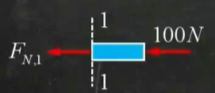
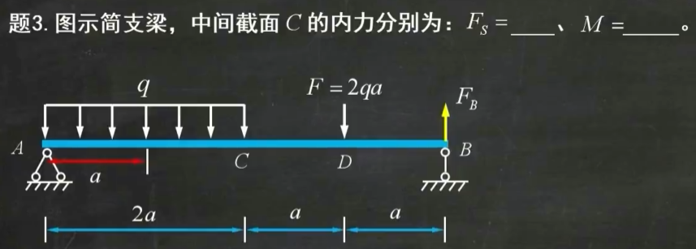

# 材料力学补天1

## 目录

<!-- @import "[TOC]" {cmd="toc" depthFrom=1 depthTo=6 orderedList=false} -->

<!-- code_chunk_output -->

- [材料力学补天1](#材料力学补天1)
  - [目录](#目录)
  - [2025 年期末考试说明：](#2025-年期末考试说明)
  - [内容概要](#内容概要)
  - [各种约束（理论力学）](#各种约束理论力学)
  - [截面法](#截面法)
    - [拉压](#拉压)
    - [弯曲](#弯曲)
  - [拉压变形](#拉压变形)
    - [轴力图](#轴力图)
    - [应力、应变与变形](#应力应变与变形)
      - [应力](#应力)
      - [应变](#应变)
      - [变形](#变形)
      - [轴向刚度](#轴向刚度)
      - [许用应力](#许用应力)
      - [应力集中](#应力集中)
      - [胡克定律](#胡克定律)
      - [泊松比](#泊松比)
      - [温度应力](#温度应力)
    - [应力应变曲线](#应力应变曲线)
      - [弹性阶段](#弹性阶段)
      - [屈服阶段](#屈服阶段)
      - [强化阶段](#强化阶段)
      - [局部变形阶段](#局部变形阶段)
      - [卸载定律及冷作硬化](#卸载定律及冷作硬化)
      - [例题](#例题)
    - [超静定问题](#超静定问题)
      - [例题](#例题-1)
  - [连接件](#连接件)
    - [剪切](#剪切)
      - [单剪切](#单剪切)
      - [双剪切](#双剪切)
    - [挤压](#挤压)
    - [例题](#例题-2)
  - [截面的几何性质](#截面的几何性质)
    - [静矩与形心](#静矩与形心)
      - [形心](#形心)
      - [静矩](#静矩)
        - [单一图形](#单一图形)
        - [组合图形](#组合图形)
    - [惯性矩](#惯性矩)
      - [极惯性矩（对点的惯性矩）](#极惯性矩对点的惯性矩)
      - [(对轴的)惯性矩](#对轴的惯性矩)
      - [平行轴定理](#平行轴定理)
  - [扭转变形](#扭转变形)
    - [扭矩图](#扭矩图)
    - [外力偶矩的计算](#外力偶矩的计算)
    - [扭转切应力](#扭转切应力)
      - [扭转截面系数](#扭转截面系数)
    - [扭转角](#扭转角)
      - [两截面之间的相对扭转角](#两截面之间的相对扭转角)
      - [单位扭转角](#单位扭转角)
      - [例题](#例题-3)
  - [弯曲内力图](#弯曲内力图)
    - [不同载荷形式下的内力图特征](#不同载荷形式下的内力图特征)
    - [一些经典的弯曲内力图](#一些经典的弯曲内力图)
    - [钢架与曲杆的内力图](#钢架与曲杆的内力图)
      - [钢架](#钢架)
      - [曲杆](#曲杆)
  - [弯曲应力](#弯曲应力)
    - [弯曲正应力](#弯曲正应力)
      - [抗弯截面系数](#抗弯截面系数)
    - [弯曲切应力](#弯曲切应力)
    - [强度条件](#强度条件)
      - [例题](#例题-4)

<!-- /code_chunk_output -->

## 2025 年期末考试说明：

考试闭卷，选择题 7 题 28 分，计算题 4 题 72 分。动载荷考一道大题，交变应力考一道小题，截面核心不考，水平载荷不考。

## 内容概要

- 为了保证工程构件的正常工作，构件应满足：
  1. 强度条件（抵抗破坏的能力）
  2. 刚度条件（抵抗变形的能力）
  3. 稳定性条件（保持原有平衡的能力）
- 在材料力学中，变形固体的三个基本假设为:
  1. 连续性假设（材料连续，没有孔洞）
  2. 均匀性假设（材料均匀，没有杂质）
  3. 各向同性假设（沿各方向力学性质相同）
- 在材料力学中，变形的四种基本形式为拉压（杆）、剪切（连接件）、扭转（轴）、弯曲（梁）。下图为四种情况下截面的内力与内力矩：
  

1. 规定背离截面的力为正，指向截面的力为负。我们一般设力的方向为背离截面的。
2. 规定扭矩用右手螺旋定则判断的方向为背离截面的扭矩为正。
3. 规定弯曲变形的弯矩使梁下侧受拉为正，反之为负。也就是说，左截面顺时针、右截面逆时针为正。
4. 规定弯曲变形的剪力使梁顺时针转动为正，逆时针转动为负。（左截面向上、右截面向下为正）
5. 一般而言，发生弯曲变形的梁凸的一侧受拉，凹的一侧受压。

## 各种约束（理论力学）

## 截面法

### 拉压

对 1-1 截面，有
$$F_{N,1}+100N=0$$
$$F_{N,1}=-100N$$
对 2-2 截面，有
$$F_{N,2}+100N-100N=0$$
$$F_{N,2}=0$$

### 弯曲

由于两边的支座反力都不知道，所以先求支座反力。
$$M_A=0 \Rightarrow q\cdot 2a\cdot a+2qa\cdot 3a-F_B\cdot 4a=0$$
解得
$$F_B=2qa(\uparrow)$$
取截面 C

$$
\begin{cases}
F_y=0\\
M_C=0
\end{cases}
$$

 

$$
\begin{cases}
F_s+2qa=2qa\\
M+2qa\cdot a - 2qa \cdot 2a=0
\end{cases}
$$

解得$F_S=0,M=2qa^2$

## 拉压变形

### 轴力图

$$F+20kN=30kN+40kN\\F=50kN$$
先用截面法求出各处轴力

求得$F_{N,1}=50kN,F_{N,2}=10kN,F_{N,3}=-20kN$

随后画出轴力沿轴方向的变化关系，画竖线、标正负即可。

### 应力、应变与变形

#### 应力

定义：单位面积的内力
$$\sigma=\frac{F_N}{A}$$
这里$F_N$为轴力，$A$为截面面积

#### 应变

定义：单位长度的变形
$$\varepsilon=\frac{\sigma}{E}=\frac{F_N}{EA}$$
这里$\sigma$为应力，$E$为弹性模量

#### 变形

定义：构件的总变形
$$\Delta l = \varepsilon \cdot l = \frac{F_N l}{EA} $$
这里$\varepsilon$为应变，$l$为总长度

#### 轴向刚度
我们知道有
$$F_N = k \Delta l$$
其中$k$为轴向刚度
由
$$\Delta l = \varepsilon \cdot l = \frac{F_N l}{EA} $$
可知
$$k = \frac{EA}{l}$$
#### 许用应力

定义：在工程应用中构件允许受到的最大应力，用$[\sigma]$表示。一般要求
$$\sigma \leq [\sigma]$$

#### 应力集中

由于截面尺寸急剧变化所引起的应力局部增大现象。

#### 胡克定律

$\sigma\leq\sigma_P$时（具体见应力应变曲线）有
$$\sigma = \varepsilon E$$

#### 泊松比

当材料服从胡克定律时，横向线应变$\varepsilon'$与纵向（受力方向）线应变$\varepsilon$之比的绝对值
$$\mu = \left|\frac{\varepsilon'}{\varepsilon}\right|=-\frac{\varepsilon'}{\varepsilon}$$
为常数,称为泊松比。（横向和纵向应变一般是相反的，为了保证泊松比为正取负号。当然也有反常的负泊松比材料，这里不做讨论。）

#### 温度应力

因为温度变化，热胀冷缩引起的应力变化。
温度变化时，材料长度的变化量
$$\Delta l = \alpha_l \Delta T \cdot l$$
其中$\alpha_l$为材料的线胀系数，$l$为材料总长度，$\Delta T$为变化的温度。上式常被用作超静定问题的补充方程。
又有
$$\Delta l = \varepsilon \cdot l = \frac{F_N l}{EA} $$
可以得到温度应力
$$\sigma = \frac{F_N}{A} =E\alpha_l\Delta T$$

### 应力应变曲线

| 材料      | 塑性材料       | 脆性材料       |
| --------- | -------------- | -------------- |
| 代表材料  | 低碳钢         | 铸铁           |
| 变形/失效 | 塑性屈服       | 脆性断裂       |
| 性能      | 抗拉>抗压>抗剪 | 抗压>抗剪>抗拉 |

#### 弹性阶段

弹性阶段通过改变应力的大小构件仍然能够恢复原状。此时的变形为弹性变形。

- $Oa$段为一条直线，$\sigma_P$称为比例极限
  这一段满足$\displaystyle\varepsilon = \frac{\sigma}{E}$，即
  $$\sigma = \varepsilon E$$
  该式又被称为胡克定律。
- $ab$段不是直线但变形仍为弹性变形，$\sigma_e$称为弹性极限。

#### 屈服阶段

即$bd$段。当应力超过$b$点增加到某一数值时,应变有非常明显的增加,而应力先是下降,然后作微小的波动,在$\sigma-\varepsilon$曲线上出现接近水平线的小锯齿形线段。
此阶段变形后撤销力已经不能恢复原状。此阶段的变形为塑性变形。

- 该阶段应力变化不大，应变显著增加，称为屈服现象。
- 将屈服阶段内最小的应力定义为下屈服极限，一般就称为屈服极限$\sigma_s$。
- 如果塑性材料达到屈服而发生显著的塑性变形时，就丧失了正常的工作能力。所以，通常取屈服极限作为**塑性材料的极限应力**。

#### 强化阶段

即$de$段。屈服阶段后,材料又恢复了抵抗变形的能力,要使它继续变形必须增加拉力。此阶段的变形为弹性变形和塑性变形。

- 强化阶段中的最高点$e$所对应的应力$\sigma_b$是材料所能承受的最大应力,称为强度极限或抗拉强度。在强化阶段中,试样的横向尺寸有明显的缩小。
- 对于脆性材料，由于材料在破坏前都不会产生明显的塑性变形，只有在断裂时才丧失正常工作能力。所以，应取强度极限为**脆性材料的极限应力**。

#### 局部变形阶段

过$e$点后,在试样的某一局部范围内,横向尺寸突然急剧缩小,形成缩颈现象。由于在缩颈部分横截面面积迅速减小,使试样继续伸长所需要的拉力也相应减少。$f$点试样被拉断。

- $f$点对应横坐标值越大，材料塑性越好。

#### 卸载定律及冷作硬化
- 把试样拉到超过屈服极限的$d$点,然后逐渐卸除拉力,应力和应变关系将沿着斜直线$dd'$回到$d'$点。斜直线 $dd'$近似地平行于$Oa$。这说明:在卸载过程中,应力和应变按直线规律变化。这就是卸载定律。
- 卸载后,如在短期内再次加载,则应力和应变大致上沿卸载时的斜直线$d'd$上升。直到$d$点后,又沿曲线$def$ 变化。可见在再次加载时,$d$点以前材料的变形是弹性的,过$d$点后才开始出现塑性变形。
- 在第二次加载时,其比例极限(弹性阶段)得到了提高,但塑性变形和伸长率却有所降低。这种现象称为冷作硬化。冷作硬化现象经退火后又可消除。
#### 例题

图示支架，由 1,2 两杆构成，从材料性质方面考虑，下列方案比较合理的是
  
 
 

A.1 杆为钢杆，2 杆为铸铁杆。
B.1 杆为铸铁杆，2 杆为钢杆。
C.两杆均为钢杆。
D.两杆均为铸铁杆。

此题判断压杆还是拉杆即可。答案为 A

### 超静定问题

未知力个数多于平衡方程个数的结构称之为超静定结构。

1. 根据静力学列平衡方程
2. 根据几何关系列出补充方程。
   

#### 例题

如图阶梯形钢杆的两端在$T=5℃$时被固定，杆件上下两段的面积别是$A_1=5cm^2,A_2=10cm^2$。当温度升高至$T_2=25℃$时，试求杆件各部分的温度应力。钢材的$α_l =12.5 \times 10^{-6}℃^{-1},E=200GPa$。

如图，设墙对两段的力分别为$F_A,F_C$（这里使用了设正法，截面向外为正）
由$F_y=0$，记$F_A=F_C=F$
对于截面 1，$F_{N,AB}=F_C=F$
对于截面 2，$F_{N,AC}=F_A=F$
应力引起的长度变化
$$\Delta l_{AB}=\frac{F_{N,AB}l_{{AB}}}{EA_2}\\ \  \\ \Delta l_{AC}=\frac{F_{N,AC}l_{{AC}}}{EA_1}$$
温度引起的长度变化

$$\Delta l_{t,AC}=\alpha_l\Delta T \cdot 2a$$
由于墙体的约束（补充方程），
$$\Delta l_{AB}+\Delta l_{AC}+\Delta l_{t,AC}=0$$
又有
$$A_2=2A_1$$
解得
$$F=-\frac{1}{3}\alpha_l\Delta TEA_2=-\frac{100}{3}kN$$
$$\sigma_{AB}=\frac{F}{A_2}=-\frac{100}{3}MPa\\\ \\\sigma_{BC}=\frac{F}{A_1}=-\frac{200}{3}MPa$$

## 连接件

连接件受到的应力可以分为剪切应力和挤压应力。

### 剪切

#### 单剪切

一个剪切面

有外力直接作用的板称为主板。没有外力直接作用的叫盖板。设有$n$个铆钉直接与一个主板相连。单个铆钉受到的剪力为
$$F_s=\frac{F}{n}$$
取剪切面上下部分其中之一进行分析，切应力为
$$\tau = \frac{F_s}{A}$$

#### 双剪切

两个剪切面

设有$n$个铆钉直接与一个主板相连。由受力分析，单个铆钉受到的剪力为
$$F_s=\frac{F}{2n}$$
切应力为
$$\tau = \frac{F_s}{A}$$
无论单剪切还是双剪切，剪切面都平行于力$F$作用线。

### 挤压

设有$n$个铆钉直接与一个主板相连。挤压力
$$F_{bs}=\frac{F}{n}$$
挤压应力
$$\sigma_{bs}=\frac{F_{bs}}{A_{bs}}$$
其中$A_{bs}$为挤压部分垂直于挤压力上的投影面积。
挤压面垂直于外力方向。

### 例题

请校核图示拉杆头部的剪切强度和挤压强度。已知图示尺寸$D=32mm$，$d=20mm$和$h=12mm$。杆的许用切应力$[\tau]=100MPa$，许用挤压应力$[\sigma_{bs}]= 240MPa$。

 
 
 
 

如右图所示，由剪切面与剪力平行，可以判断出剪切面为橙色圆柱与蓝色圆柱的接触面，面积为
$$A=\pi d h$$
易知剪力$F_s=F$
则有切应力
$$\tau=\frac{F}{A}=\frac{F}{πd h}=66.31MPa<[\tau]$$
而挤压面为圆环面
$$A_{bs}=\frac{1}{4}\pi(D^2-d^2)$$
易知挤压力$F_{bs}=F$
挤压应力
$$\sigma_{bs}=\frac{F_{bs}}{A_{bs}}=102.02MPa<[\sigma_{bs}]$$
剪切强度、挤压强度均满足条件。

## 截面的几何性质

### 静矩与形心

材料力学中形心是用来研究横截面的，而只有$y$轴和$z$轴与材料横截面共面，因此只研究形心的$y$和$z$坐标。

#### 形心

根据高等数学的定义
$$y_C=\frac{\displaystyle\int_AydA}{A}\\ \ \\ z_C=\frac{\displaystyle\int_AzdA}{A}$$

#### 静矩

静矩又叫一次矩

##### 单一图形

静矩定义为
$$S_y=\int_AzdA=z_CA\\ \ \\ S_z=\int_AydA=y_CA$$

##### 组合图形

对于组合图形而言，静矩即为将各个单一图形的静矩相加。考虑右图

$$S_z=y_{C_1}A_1+y_{C_2}A_2\\ S_y=z_{C_1}A_2+z_{C_2}A_2=0$$

从而有

$$y_C=\frac{S_z}{A}=\frac{y_{C_1}A_1+y_{C_2}A_2}{A_1+A_2}\\ \ \\  z_C=\frac{S_y}{A}=\frac{z_{C_1}A_1+z_{C_2}A_2}{A_1+A_2}=0$$

### 惯性矩

惯性矩又称二次矩。

#### 极惯性矩（对点的惯性矩）

极惯性矩的定义：设$\rho$为极径，极惯性矩
$$I_p=\int_A\rho^2dA$$
对于圆来说，
$$I_p=\int^\frac{D}{2}_0\rho^2d(\pi\rho^2)=\int^\frac{D}{2}_0\rho^2\cdot 2\pi\rho d\rho=\frac{1}{32}\pi D^4$$
这里直接给出圆环截面的极惯性矩
$$I_p=\frac{1}{32}\pi(D^4-d^4)$$

#### (对轴的)惯性矩

惯性矩定义为
$$I_y=\int_Az^2dA\\ \ \\ S_z=\int_Ay^2dA$$

以矩形截面为例，易知$d_A=b\ \text{d}y$
$$S_z=\int_{-\frac{h}{2}}^\frac{h}{2}y^2b\text{d}y=\frac{1}{12}hb^3$$
由对称性易知
$$S_y=\frac{1}{12}h^3b$$
常见图形的惯性矩

从而可以看出，对于复合图形（单一图形的加或减），惯性矩的计算可以由单一图形直接相加或直接相减得到。（参考圆环截面，一个大圆减一个小圆）

#### 平行轴定理

$$I_z=I_{z_C}+a^2A$$
至此你一定会惊奇地发现惯性矩就是转动惯量。

## 扭转变形

### 扭矩图

扭矩图作法基本与轴力图相同，唯一的区别是注意规定用右手螺旋定则判断的方向为背离截面的扭矩为正。

 
 

使用截面法求出扭矩，取 1-1 处左边部分进行分析，1-1 截面扭矩为$318N\cdot m$，以此类推。

### 外力偶矩的计算

$M_e$为外力偶矩，$P$为功率，$n$为转速。
$$M_e=9550\frac{P}{n}$$
此处$M_e$单位为$N\cdot m$,$P$单位为$kW$,转速$n$单位为$r/min$
此式在电工电子学中亦有记载。

### 扭转切应力

$$\tau = \frac{T\rho}{I_p}$$
式中$\tau$为扭转切应力，$T$为扭矩，$\rho$为该点到圆心的距离，$I_p$为截面对圆心的极惯性矩。

1. 公式适用条件：圆形截面轴
2. $\tau$的正负：由于$\rho$和$I_p$均为标量，所以与$T$相同。
3. $\tau$的方向：任何一点的切应力垂直于这个点与圆心的连线，且$\tau$与扭矩$T$的转向一致。
4. 对于一个确定的截面，$\displaystyle\frac{T}{I_p}$为常数，因此扭转切应力$\tau$与极径$\rho$成正比。也就是说切应力沿径向线性分布。
5. 
   切应力分布图

#### 扭转截面系数

$$W_p=\frac{T}{\tau_{max}}=\frac{I_p}{\rho_{\max}}$$
对于实心圆轴，
$$W_p = \frac{1}{16}\pi D^3$$
对于空心圆轴
$$W_p = \frac{1}{16}\pi D^3\left(1-\left(\frac{d}{D}\right)^4\right)$$

### 扭转角

#### 两截面之间的相对扭转角

$$\varphi = \frac{Tl}{GI_p}$$
$G$为切变模量，这里的$\varphi$单位为弧度。

#### 单位扭转角

$$\varphi' = \frac{\varphi}{l}=\frac{T}{GI_p}$$

#### 例题

图示圆轴受扭，若使两端面之间的相对扭转角为零，则$\dfrac{l_1}{l_2}=\underline{\ \ \ \ \ \ }$

题目条件即$\varphi_{AC}=0$
$$\varphi_{AB}=\frac{T_{AB}l_1}{GI_p}=\frac{3M_el_1}{GI_p}\\ \  \\ \varphi_{BC}=\frac{T_{BC}l_1}{GI_p}=-\frac{2M_el_2}{GI_p}$$
由$$\varphi_{AC}=\varphi_{AB}+\varphi_{BC}$$
可知$$3l_1-2l_2=0$$

## 弯曲内力图

**从零开始，到零结束。**

### 不同载荷形式下的内力图特征

<table style="text-align: center;">
<thead>
<tr>
<th>载荷形式</th>
<th>载荷方向</th>
<th>Fs 图</th>
<th>M 图</th>
</tr>
</thead>
<tbody>
<tr>
<td rowspan="2">集中力</td>
<td>↓</td>
<td>↓ 突变</td>
<td rowspan="2">折点</td>
</tr>
<tr>
<td>↑</td>
<td>↑ 突变</td>
</tr>
<tr>
<td rowspan="2">外力偶矩</td>
<td>⤵顺时针</td>
<td rowspan="2">无变化</td>
<td>↑ 突变</td>
</tr>
<tr>
<td>⤴逆时针</td>
<td>↓ 突变</td>
</tr>
<tr>
<td rowspan="2">均布载荷</td>
<td>↓</td>
<td>↘ 斜率：q</td>
<td>开口向下的抛物线</td>
</tr>
<tr>
<td>↑</td>
<td>↗ 斜率：q</td>
<td>开口向上的抛物线</td>
</tr>
<tr>
<td>无载荷段</td>
<td>无</td>
<td>→ 水平线</td>
<td>直线（Fs=0）或斜直线（Fs≠0）</td>
</tr>
</tbody>
</table>

### 一些经典的弯曲内力图

其实画扭矩图的方法就是先考虑剪力带来的扭矩$\displaystyle M_{F_s}=\int F_sx$，再考虑外力偶矩$M$，两者影响累加得到的结果$M_{F_s}+M$就是扭矩图上的值。

### 钢架与曲杆的内力图

<table style="text-align: center;">
<thead>
<tr>
<th rowspan ='2'>类型</th>
<th colspan="3">内力</th>
</tr>
<tr>
<th>轴力</th>
<th>剪力</th>
<th>弯矩</th>
</tr>
</thead>
<tbody>
<tr>
<td>平面刚架</td>
<td>拉为正 正的画在外侧</td>
<td>顺转为正 正的画在外侧</td>
<td>无规定，画在受压一侧</td>
</tr>
<tr>
<td>平面曲杆</td>
<td>拉为正 正的画在外侧</td>
<td>顺转为正 正的画在凸侧</td>
<td>曲率增大为正，画在受压一侧</td>
</tr>
</tbody>
</table>

曲率的定义为曲杆圆弧的直径的倒数，即
$$k=\frac{1}{d}$$

#### 钢架

钢架结构有三种内力：轴力$F_N$、剪力$F_s$和弯矩$M$。

试画出图示平面刚架结构的内力图。

$$
\begin{cases}
\sum M_A=0\\
\sum F_x=0\\
\sum F_y=0\\
\end{cases}
$$

即

$$
\begin{cases}
 qa\cdot \frac{a}{2}-F_C \cdot a=0\\
 F_{Ax}+qa =0\\
F_{Ay}-F_C=0\\
\end{cases}
$$

可以解得

$$
\begin{cases}
F_C=F_{Ay}=\frac{1}{2}qa\\
F_{Ax}=-qa
\end{cases}
$$

据此可以画出内力图。对于平面钢架而言，剪力图就是将杆架拆分为两根独立的杆件来画。而对于弯矩图，相同一点的弯矩相同（见下图中着重标注的点）

#### 曲杆

曲杆也有轴力$F_N$、剪力$F_s$和弯矩$M$。

我们仍然使用截面法。取一段圆心角为$\alpha$的圆弧曲杆$\overset{{\frown}}{BK}$，对其列平衡方程

$$
\begin{cases}
\sum M_K=0\\
\sum F_x=0\\
\sum F_y=0\\
\end{cases}
$$

即

$$
\begin{cases}
 M(\alpha)=FR\sin\alpha\\
 F_s(\alpha)\sin\alpha+F_N(\alpha)\cos\alpha=0\\
F+F_N(\alpha)\sin\alpha-F_s(\alpha)\cos\alpha=0\\
\end{cases}
$$

解得

$$
\begin{cases}
F_s(\alpha)=F\cos\alpha\\
F_N(\alpha)=-F\sin\alpha\\
 M(\alpha)=FR\sin\alpha
\end{cases}
$$

据此画出内力图即可。

注意，此处画的“竖线”应该方向是垂直于轴线的。

## 弯曲应力

我们知道弯曲变形有两种内力：剪力和弯矩。
|内力类型|剪力$F_s$|弯矩$M$|
|-|-|-|
|对应的应力|切应力$\tau$|正应力$\sigma$|
|内力/应力方向|与横截面共面|垂直于横截面|

### 弯曲正应力

在一个截面中，设$z$轴通过其形心（称为中性轴）

$$\sigma = \frac{My}{I_z}$$
其中$M$为弯矩，$I_z$为截面对中性轴的惯性矩，$y$为截面上任意一点到中性轴的距离。

1. 对应确定的截面$M$与$I_z$均为常数，因此$\sigma$与$y$成正比。
2. $M>0$时中性轴以上受压（指向截面），中性轴以下受拉（背离截面），反之相反。

#### 抗弯截面系数

$$W_z=\frac{M}{\sigma_{\max}}=\frac{I_z}{y_{\max}}$$

### 弯曲切应力

$$\tau = \frac{F_sS_z^*}{bI_z}$$

- 求某点 P 的切应力，先过点 P 作中性轴的平行线，平行线以外的部分为阴影部分
- $F_s$：对应截面的剪力
- $S_z^*$：阴影部分对中性轴$z$的静矩
- $b$：平行线与截面的交线长度
- $I_z$：截面对中性轴的惯性矩
- 矩形截面的弯曲切应力分布图的外轮廓线是一段二次曲线。

对于矩形截面，$\displaystyle\tau_{\max}=\frac{3}{2}\frac{F_{s,\max}}{A}$

对于圆形截面，$\displaystyle\tau_{\max}=\frac{4}{3}\frac{F_{s,\max}}{A}$

对于薄壁圆环截面（厚度$\delta<\dfrac{d}{10}$），$\displaystyle\tau_{\max}=2\frac{F_{s,\max}}{A}$
### 强度条件

$$\sigma_{\max} = \frac{My_{\max}}{I_z}\leq [\sigma]$$
对于关于中性轴对称的截面（矩形截面、圆形截面、圆环截面）
校核
$$\sigma_{\max} = \frac{|M_{\max}|}{W_z}\leq [\sigma]$$
即可。
对于关于中性轴不对称的截面（T 形截面、U 形截面），我们需要找到该结构的最大正弯矩和最大负弯矩，然后分别在最大正弯矩和最大负弯矩情况下校核最大拉应力$\sigma_{t,\max}$和最大压应力$\sigma\_{c,\max}$。

$$
\begin{cases}
  \sigma_{t,\max}\leq [\sigma]\\ \sigma_{c,\max}\leq [\sigma]
\end{cases}
$$

#### 例题

如图示槽形截面悬臂梁，已知中性轴$z$距上边缘的距离为$53mm$，截面对中性轴的惯性矩为$I_z=29\times10^6mm²$，载荷$F=8kN$。求梁内最大拉伸正应力$\sigma_{t,\max}$，最大压缩正应力$\sigma_{c,max}$和最大切应力$\tau_{\max}$。

平衡方程等过程省略。直接给出剪力图和弯矩图

最大正弯矩在$A$处，最大负弯矩在$B$处
对于$A$截面，弯矩为正，下侧受拉，上侧受压
中性轴以下$y_{\max 1} = 147mm$
$\displaystyle\sigma_{t}=\frac{M_{A}y_{\max 1}}{I_z}\\=32.44MPa$
$\displaystyle\sigma_{c}=\frac{M_A y_{\max 2}}{I_z}\\=-11.7MPa$
对于$B$截面，弯矩为负，下侧受压，上侧受拉
$\displaystyle\sigma_{t}=\frac{M_{A}y_{\max 2}}{I_z}\\=8.77MPa$
$\displaystyle\sigma_{c}=\frac{M_A y_{\max 1}}{I_z}\\=-24.33MPa$
因此，$$\sigma_{t,\max}=32.44MPa,\sigma_{c,\max}=-24.33MPa$$

