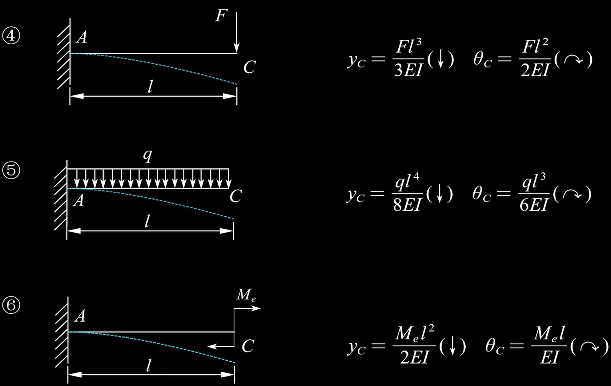
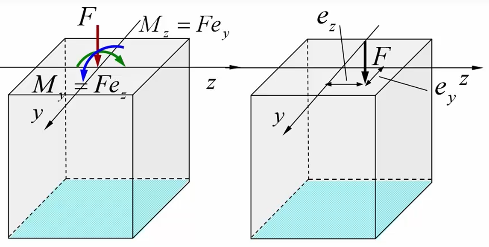

# 材料力学补天2

## 目录

<!-- @import "[TOC]" {cmd="toc" depthFrom=1 depthTo=6 orderedList=false} -->

<!-- code_chunk_output -->

- [材料力学补天2](#材料力学补天2)
  - [目录](#目录)
  - [弯曲变形](#弯曲变形)
    - [挠度与转角](#挠度与转角)
    - [简支梁的挠度与转角](#简支梁的挠度与转角)
    - [悬臂梁的挠度与转角](#悬臂梁的挠度与转角)
      - [例题](#例题)
    - [积分法求变形](#积分法求变形)
      - [转角](#转角)
      - [挠度](#挠度)
      - [举例](#举例)
    - [推论](#推论)
    - [叠加法求变形](#叠加法求变形)
    - [超静定](#超静定)
      - [例 1](#例-1)
      - [例 2](#例-2)
  - [应力状态](#应力状态)
    - [主平面与三种应力状态](#主平面与三种应力状态)
      - [主平面](#主平面)
      - [主应力](#主应力)
      - [应力状态](#应力状态-1)
        - [单轴应力状态](#单轴应力状态)
        - [平面应力状态](#平面应力状态)
        - [三向应力状态](#三向应力状态)
    - [封闭管内压公式](#封闭管内压公式)
    - [斜截面上的应力](#斜截面上的应力)
      - [正应力](#正应力)
        - [断定试样的断裂面](#断定试样的断裂面)
    - [主应力与最大切应力](#主应力与最大切应力)
      - [解析法](#解析法)
        - [平面应力状态的主应力](#平面应力状态的主应力)
        - [主平面方位角](#主平面方位角)
        - [最大切应力](#最大切应力)
        - [主单元体的画法](#主单元体的画法)
      - [图解法（应力圆）](#图解法应力圆)
  - [强度理论与广义胡克定律](#强度理论与广义胡克定律)
    - [第一类强度理论（脆性材料）](#第一类强度理论脆性材料)
      - [第一强度理论（最大拉力应力理论）](#第一强度理论最大拉力应力理论)
      - [第二强度理论（最大伸长线应变理论）](#第二强度理论最大伸长线应变理论)
    - [第二类强度理论（塑性材料）](#第二类强度理论塑性材料)
      - [第三强度理论（最大切应力理论）](#第三强度理论最大切应力理论)
      - [第四强度理论（形状改变比能理论）](#第四强度理论形状改变比能理论)
    - [广义胡克定律](#广义胡克定律)
      - [例题](#例题-1)
  - [组合变形](#组合变形)
    - [拉（压）弯组合变形](#拉压弯组合变形)
    - [拉扭组合变形](#拉扭组合变形)
    - [弯扭组合变形](#弯扭组合变形)
    - [偏心拉压](#偏心拉压)
      - [任意截面的内力](#任意截面的内力)
      - [应力计算](#应力计算)
      - [危险点分析](#危险点分析)
      - [中性轴](#中性轴)
      - [例题](#例题-2)
  - [压杆稳定](#压杆稳定)
    - [临界压力](#临界压力)
      - [欧拉公式](#欧拉公式)
      - [例题](#例题-3)
    - [稳定性计算](#稳定性计算)
      - [临界应力总图](#临界应力总图)
      - [解题步骤](#解题步骤)
  - [冲击载荷与交变应力](#冲击载荷与交变应力)
    - [冲击载荷](#冲击载荷)
      - [竖直冲击](#竖直冲击)
        - [带有弹簧的情况](#带有弹簧的情况)
    - [交变应力](#交变应力)
      - [应力比](#应力比)
      - [应力幅](#应力幅)
      - [平均应力](#平均应力)
  - [能量法](#能量法)
    - [应变能](#应变能)
      - [拉压变形](#拉压变形)
      - [扭转变形](#扭转变形)
      - [弯曲变形](#弯曲变形-1)
      - [应变能密度](#应变能密度)
      - [应变能的应用](#应变能的应用)
        - [例 1](#例-1-1)
    - [卡氏第二定理](#卡氏第二定理)
      - [广义力和广义位移](#广义力和广义位移)
        - [广义力与广义位移的对应](#广义力与广义位移的对应)
      - [卡氏第二定理](#卡氏第二定理-1)
      - [解题步骤](#解题步骤-1)
      - [钢架](#钢架)
    - [一些概念](#一些概念)
  - [单位载荷法](#单位载荷法)
    - [杆结构](#杆结构)
    - [梁结构（图乘法）](#梁结构图乘法)
    - [钢架（图乘法）](#钢架图乘法)
    - [曲杆](#曲杆)
    - [常见图形的面积和形心位置](#常见图形的面积和形心位置)
  - [力法正则求解超静定方程](#力法正则求解超静定方程)
    - [梁结构与钢架结构](#梁结构与钢架结构)
  - [正对称结构与反对称结构](#正对称结构与反对称结构)

<!-- /code_chunk_output -->

## 弯曲变形

### 挠度与转角

对于梁上任意一点，其竖直位移就是挠度$w$（图中写作$y$，向上为正），过该点做曲线的切线，切线与水平方向的夹角就是转角$\theta$（逆时针为正）。

### 简支梁的挠度与转角

### 悬臂梁的挠度与转角

#### 例题

一外伸梁受力如图示，抗弯刚度为$EI$。求截面$D$的挠度。

$AB$段发生弯曲变形同上面简支梁情况 ①，而 BD 段由于没有受到外力载荷因此不发生变形，如右图绿色曲线。B 截面的转角$\theta = -\dfrac{Fl^2}{16EI}$
小变形情况$\theta \approx \tan\theta$
$$w_D=|BD|\tan\theta = \frac{Fl^3}{32EI}$$

### 积分法求变形

#### 转角

$$\theta(x) = \frac{1}{EI}\int_0^x M(x) dx$$
可以看出，**弯矩越大的地方**转角越大，即切线斜率越大，也即**曲率越大**。

#### 挠度

$$w(x) = \int_0^x\theta(x) dx$$

#### 举例

以最简单的简支梁为例，由前面的知识易知$[0,\dfrac{l}{2}]$上$M(x)=\dfrac{F}{2}x$
$$\theta(x) = \frac{1}{EI}\int M(x) dx=\frac{Fx^2}{4EI}+C$$
$$w(x) = \int\theta(x) dx=\frac{Fx^3}{12EI}+Cx+D$$
根据位移边界条件，$w_A=w_B=0$，根据连续性条件，$\theta(\dfrac{l}{2})=0$
代入上式可以解得$C = -\dfrac{Fl^2}{16EI},D=0$
### 推论
| 物理量 | 中文名称 | 计算公式 | 物理意义 |
| :--- | :--- | :--- | :--- |
| **`w(x)`** | **挠度** | $w(x)$| 梁上各点向下（或向上）的位移 |
| **`θ(x)`** | **转角** | $θ(x) = w'(x)$| 截面法线转过的角度，即挠曲线的斜率 |
| **`M(x)`** | **弯矩** | $M(x) = EI \cdot w''(x)$ | 抵抗弯曲变形的内力矩 |
| **`V(x)`** | **剪力** | $V(x) = EI \cdot w'''(x)$ | 抵抗剪切变形的内力 |
| **`q(x)`** | **分布载荷** | $q(x) = EI \cdot w''''(x)$ | 导致梁弯曲的外部垂直分布力 |

如果要判断有没有集中力或者集中力偶等，只需要看对应的值会不会在某一点发生突变。
### 叠加法求变形

多种不同载荷的情况，可以利用叠加法求解。设$w_i(x)$为第 i 个载荷单独作用时某点的挠度
$$w = \sum w_i$$
适用条件：**线弹性 （$\sigma<\sigma_P$），小变形（无需特别验证）**。

### 超静定
同样大小力的作用下，梁弯曲的挠度数量级远大于轴力造成的变形，因此在计算弯曲的超静定问题时，有时可以不需要考虑收到拉压变形杆件的形变。（看条件）
#### 例 1

如图所示梁结构的抗弯刚度为$EI$，求其所有支座反力。

$A$处固定端约束，支座反力有水平竖直和一个力矩；$B$处活动铰链支座一个竖直方向支座反力，共 4 个未知量。此时需要列出补充方程
此处的补充方程为$B$点的竖直位移为 0，即 B 点支座反力单独作用下的挠度与均匀载荷单独作用下的挠度之和为 0，此处不再赘述。

#### 例 2

补充方程为$\Delta l_{BD}+w_{B1}+w_{B2}=0$
其中$w_{B1}$为悬臂梁在中间受力情况下的挠度（该情况$CB$段为直线）
$w_{B_2}$为在末端受力的挠度
其余不再赘述。

## 应力状态

### 主平面与三种应力状态

#### 主平面

单元体上没有切应力的面叫做主平面

#### 主应力

主应力：主平面上的正应力称为主应力$\sigma_1,\sigma_2,\sigma_3$

大小关系：$\sigma_1\geq\sigma_2\geq\sigma_3$  
位置关系$\sigma_1\perp\sigma_2\perp\sigma_3$

#### 应力状态

正负号规定
正应力：拉为正,压为负
切应力：对单元体内任意点的矩顺时针转向为正，反之为负

##### 单轴应力状态

只有一个主应力不为 0

拉伸的杆件和弯曲的梁的上下两个面取出的单元体都只有正应力，没有切应力。这些单元体都是单向应力状态。

##### 平面应力状态

三个主应力有两个不为 0.一个为 0

扭转的轴和弯曲的梁中性轴上取出的单元体都只有切应力，没有正应力。以上图扭转的轴为例，可以判断其扭矩为正，扭矩与横截面切应力方向相同，因此左右两面（$x$面）的切应力应该是让单元体顺时针转动。然后根据切应力互等定理（两个相互垂直的平面上切应力成对存在，且大小相等，方向要么共同背离二平面交线，要么共同指向。）即可得到其应力状态。
这种只有切应力，没有正应力的状态时平面应力状态的一种特例，称为纯剪切应力状态。
弯曲梁除了上下两边和中性轴以外的部分既有正应力又有切应力

考虑弯曲情况的中间部分，由于横截面的弯矩为逆时针，即$M<0$可知横截面上侧受拉，下侧受压。这里取中性轴上侧的点所以受拉。可知左右侧面有背离截面的正应力。同时通过截面法可以知道剪力$F_s>0$，因此$\tau>0$，也就可以画出上图。

##### 三向应力状态

三个主应力都不为 0 的情况。基本变形中不涉及三向应力状态。

### 封闭管内压公式

内径为$d$，壁厚为$\delta$的圆管，其内压$P$与正应力的关系为：
$$\sigma_x = \frac{Pd}{4\delta}\\ \ \\ \sigma_y = \frac{Pd}{2\delta}$$

### 斜截面上的应力

#### 正应力

$$
\sigma_{\alpha} = \frac{\sigma_x+\sigma_y}{2}+\frac{\sigma_x-\sigma_y}{2}\cos2 \alpha-\tau_{xy}\sin 2\alpha\\ \ \\
\tau_{\alpha} = \frac{\sigma_x-\sigma_y}{2}\sin 2\alpha+\tau_{xy}\cos 2\alpha
$$

1. $\alpha$的正负规定：从$x$方向转到斜截面的外法线方向，逆为正，顺为负
2. $\alpha \in (-90^\circ,90^\circ)$
3. 基本变形中，$\sigma_y=0$

##### 断定试样的断裂面

对于拉伸变形
横截面只有$\sigma_x$，假设$\sigma_x>0$
$\sigma_y=0,\tau_{xy}=0$，代入上式

$$
\sigma_{\alpha} = \frac{\sigma_x}{2}(1+\cos 2 \alpha)\\ \ \\
\tau_{\alpha} = \frac{\sigma_x}{2}\sin 2\alpha
$$

$\alpha = 0^\circ$时，$\sigma_{\max} = \sigma_x$
$\alpha = 45^\circ$时，$\tau_{\max} = \dfrac{\sigma_x}{2}$

对于扭转变形
横截面只有$\tau_{xy}$，假设$\tau_{xy}>0$

$$
\sigma_{\alpha} = -\tau_{xy}\sin 2\alpha\\ \ \\
\tau_{\alpha} = \tau_{xy}\cos 2\alpha
$$

$\alpha = -45^\circ$时，$\sigma_{\max} = \tau_{xy}$
$\alpha = 0^\circ$时，$\tau_{\max} = \tau_{xy}$

| 材料           | 塑性材料            | 脆性材料                                                            |
| -------------- | ------------------- | ------------------------------------------------------------------- |
| 代表材料       | 低碳钢              | 铸铁                                                                |
| 变形/失效      | 塑性屈服            | 脆性断裂                                                            |
| 性能           | 抗拉>抗压>抗剪      | 抗压>抗剪>抗拉                                                      |
| 破坏           | 剪切破坏            | 拉伸破坏                                                            |
| 决定参数       | $\tau_{\max}$       | $\sigma_{\max}$                                                     |
| 拉伸时的破坏面 | $45^\circ$横截面    | （$0^\circ$）横截面                                                 |
| 扭转时的破坏面 | （$0^\circ$）横截面 | $-45^\circ$横截面$(\tau_{xy}>0)$ $45^\circ$横截面$(\tau_{xy}<0)$ |

### 主应力与最大切应力

#### 解析法

##### 平面应力状态的主应力

$$\sigma^{\prime}=\frac{\sigma_x+\sigma_y}{2}+\sqrt{\left(\frac{\sigma_x-\sigma_y}{2}\right)^2+{\tau_{xy}}^2} \\ \ \\ \sigma^{\prime\prime}=\frac{\sigma_x+\sigma_y}{2}-\sqrt{\left(\frac{\sigma_x-\sigma_y}{2}\right)^2+{\tau_{xy}}^2}$$
剩下一个$\sigma_z = 0$

##### 主平面方位角

令$$\tau_{\alpha} = \frac{\sigma_x-\sigma_y}{2}\sin 2\alpha+\tau_{xy}\cos 2\alpha = 0$$
解得$\alpha_1 = \arctan \left(\dfrac{-2\tau_{xy}}{\sigma_x-\sigma_y}\right)$
若$\alpha_1 > 0 $，则$\alpha_2 = \alpha_1 - 90^\circ$
若$\alpha_1 < 0 $，则$\alpha_2 = \alpha_1 + 90^\circ$

##### 最大切应力

$$\tau_{max}=\dfrac{\sigma_1-\sigma_3}{2}$$

##### 主单元体的画法

假设解得了$\sigma_1>0,\sigma_2=0,\sigma_3<0$（给出平面图默认主应力有一个为 0）
由方位角的公式很容易看出$\alpha_1,\alpha_2$必然一正一负。不妨设$\alpha_1>0,\alpha_2<0$。

首先过原单元体的形心做一条水平辅助线（$x$轴），$\alpha_1>0$，也即沿$x$轴逆时针旋转$\alpha_1$角，同理沿$x$轴顺时针旋转$\alpha_2$角，这就是主单元体的两条外法线。垂直这两条外法线做一个矩形（图中蓝色矩形）那么这个矩形的两组对边就代表两个主平面。

$\alpha$与$\sigma$对应关系的判断准则：
$\tau_{xy}>0$时，负角对应最大的不为零的主应力，正角对应最小的不为零的主应力。
$\tau_{xy}<0$时，负角对应最小的不为零的主应力，正角对应最大的不为零的主应力。

如果给出的是空间的单元体图，那么一般会给出一个主平面和对应主应力，也就是说，只需要在平面内再求另两个主应力即可。

  
  

上左图$z$方向主平面主应力已给出，直接“从前往后拍扁”再按平面求解。  
同理，上右图“从上往下拍扁”按平面求解即可。

#### 图解法（应力圆）

圆心坐标$\left(\dfrac{\sigma_x+\sigma_y}{2},0\right)$
半径$R=\displaystyle\sqrt{\left(\dfrac{\sigma_x-\sigma_y}{2}\right)^2+\tau_{xy}^2}$

## 强度理论与广义胡克定律

$\sigma_r$称为相当应力，是强度理论中由各主应力经过计算得到的用于校核强度的值。

### 第一类强度理论（脆性材料）

#### 第一强度理论（最大拉力应力理论）

$$\sigma_{r1}=\sigma_1$$

#### 第二强度理论（最大伸长线应变理论）

$$\sigma_{r2}=\sigma_1-\mu(\sigma_2+\sigma_3)$$
$\mu$为材料的泊松比

### 第二类强度理论（塑性材料）

#### 第三强度理论（最大切应力理论）

下式普遍适用
$$\sigma_{r3}=\sigma_1-\sigma_3$$
下式适用条件：单元体上最多只有一个方向的正应力。
$$\sigma_{r3}=\sqrt{\sigma^2+4\tau^2}$$

#### 第四强度理论（形状改变比能理论）

下式普遍适用
$$\sigma_{r4}=\sqrt{\frac{1}{2}\left[(\sigma_1-\sigma_2)^2+(\sigma_2-\sigma_3)^2+(\sigma_1-\sigma_3)^2\right]}$$
下式适用条件：单元体上最多只有一个方向的正应力。
$$\sigma_{r4}=\sqrt{\sigma^2+3\tau^2}$$

### 广义胡克定律

$$\varepsilon_\alpha = \frac{1}{E}\left[\sigma_\alpha - \mu(\sigma_{\alpha+90^\circ}+\sigma_z)\right]$$
对于平面应力状态而言，$\sigma_z = 0$
可以简单理解为$\sigma_\alpha = \sigma_x,\sigma_{\alpha+90^\circ}=\sigma_y$。
而主应变$\varepsilon_1$就是将$\sigma_1,\sigma_2,\sigma_3$分别代入$\sigma_\alpha$，$\sigma_{\alpha+90^\circ}$和$\sigma_z$。

#### 例题

图示圆轴面轴，测得其侧表面与轴线成$45°$方向的线应变$\varepsilon_{45°}$,试求作用于轴端的外力偶矩$M_e$。已知材料的弹性模量$E$，泊松比$\mu$和杆的直径$d$。

由前面的知识我们知道扭转轴的应力状态为纯剪切应力状态。$\sigma_z = 0$。
$$\varepsilon_{45°} = \frac{1}{E}\left[\sigma_{45°} - \mu(\sigma_{135°}+\sigma_z)\right]$$

$$
\sigma_{45°} = \frac{\sigma_x+\sigma_y}{2}+\frac{\sigma_x-\sigma_y}{2}\cos 90^\circ-\tau_{xy}\sin 90^\circ=-\tau_{xy}\\ \ \\
\sigma_{135°} = \frac{\sigma_x+\sigma_y}{2}-\frac{\sigma_x-\sigma_y}{2}\cos 270^\circ+\tau_{xy}\sin 270^\circ=\tau_{xy}
$$

由扭转变形的知识
$$\tau_{xy} = \frac{T\rho}{I_p}=-\frac{16M_e}{\pi d^3}$$
综合以上各式
$$M_e = \frac{\varepsilon_{45^\circ}E\pi d^3}{16(1+\mu)}$$

## 组合变形

两种或两种以上不同类型基本变形的组合形式。

1. 判定组合变形的组合形式
2. 画出组合变形所对应的各个基本变形的内力图，基本变形的内力同时达到最大的截面即为危险截面
3. 在危险截面上找到不同形式的内力所对应的应力同时达到最大的点，该点即为危险点。
4. 计算求得最大应力值或相当应力值。

### 拉（压）弯组合变形

不校核剪力，只校核轴力和弯矩。

悬臂吊车如图所示。横梁用 20a 工字钢制成。其截面系数$W_z=237cm^3$，横截面面积$A=35.5cm²$，荷载$P=34kN$，横梁材料的许用应力$[σ]=125MPa$。试校核该横梁$AC$的强度。
$$\sum M_A=0\Rightarrow F_{BC} = 34kN\\ F_{BCx}=17\sqrt 3 N,F_{BCy}= 17 N $$

  
  

据此画出轴力图和弯矩图，可以看到 D 截面为危险截面。
由图可知$M>0$，则上侧受压，下侧受拉。
轴力为压力，因此只用考虑上侧，最上侧的边有最大的压应力。危险点在最上侧的边。
$$\sigma_{\max} = \frac{F_{BCx}}{A}+\frac{M_{max}}{W_z}=94.37MPa<[\sigma]$$
$AC$满足强度条件。

### 拉扭组合变形

如图所示圆轴，直径为$d$，轴的两端作用有$M_e$，$F$,材料的许用应力为$[σ]$，试用第三强度理论校核轴的强度。

所有点的轴力和扭矩情况都一样，都是危险点。

$$
\sigma_x = \frac{F}{A}=\frac{4F}{\pi d^2}\\ \ \\
\tau_{xy} = \tau_{\max} = \frac{T}{W_p}=\frac{16M_e}{\pi d^3}
$$

显然单元体上只有一个正应力
$$\sigma_{r3}=\sqrt{\sigma^2+4\tau^2}<[\sigma] $$

### 弯扭组合变形

先考虑弯曲。由于受到力$F$后梁向下弯曲，知其中性轴以上受拉，中性轴以下受压。
力$F$在$A$端产生的外扭矩最大，因此在$A$端有最大的弯矩值。（也可以画弯矩图）
再考虑扭转。$AB$段的扭矩都相同。因此弯矩和扭矩同时到达最大值的截面就是$A$截面。

我们假设截面为圆截面。中性轴以上最上端的点有最大拉应力$\sigma_{t,\max}$，中性轴以下最下端的点有最大压应力$\sigma_{c,\max}$，圆边缘一圈上的点有最大切应力$\tau_{\max}$。只需取最上端和最下端两个点进行校核。
单元体上只有一个方向的正应力。根据第三强度理论，
$$\sigma_{r3}=\sqrt{\sigma_{\max}^2+4\tau_{\max}^2}=\sqrt{\left(\frac{M_{\max}}{W_z}\right)^2+4\left(\frac{T_{\max}}{W_p}\right)^2}$$
对于圆截面而言，有
$$W_p = \frac{1}{16}\pi d^3, W_z = \frac{1}{32}\pi d^3\Rightarrow W_p=2W_z$$
则有
$$\sigma_{r3}=\frac{\sqrt{W_{\max}^2+T_{\max}^2}}{W_z}$$
同理
$$\sigma_{r4}=\frac{\sqrt{W_{\max}^2+0.75T_{\max}^2}}{W_z}$$

### 偏心拉压

作用在杆件上的压（拉）力与杆的轴线平行但不重合的情况。偏心拉压的本质是拉（压）弯组合变形。

#### 任意截面的内力

如右图，先将压力$F$转化为中心的力$F$与两个弯矩$M_y,M_z$，对于任意一个横截面有

$$
\begin{cases}
  F_N = F\\
M_z = Fy\\
M_y = F z
\end{cases}
$$

#### 应力计算

三个载荷分别作用下的正应力：

$$
\begin{cases}
  \sigma' = -\dfrac{F_N}{A}\\ \ \\
  \sigma'' = -\dfrac{M_zy}{I_z}\\ \ \\
  \sigma''' = -\dfrac{M_yz}{I_y}
\end{cases}
$$

叠加得到的正应力$$\sigma_k = \sigma' + \sigma'' + \sigma'''=  -\dfrac{F_N}{A}-\dfrac{M_zy}{I_z}-\dfrac{M_yz}{I_y}$$

#### 危险点分析

用'-'表示压力，'+'表示拉力，可以画出右图，很容易可以看出$d$点拉应力最大，$b$点拉应力最大
从而有

$$
\sigma_{t,max} = -\dfrac{F_N}{A}+\dfrac{M_{z\max}y}{I_z}+\dfrac{M_{y\max}z}{I_y}=-\dfrac{F_N}{A}+\dfrac{M_{z\max}}{W_z}+\dfrac{M_{y\max}}{W_y}
\\ \ \\
\sigma_{c,max} = -\dfrac{F_N}{A}-\dfrac{M_{z\max}y}{I_z}-\dfrac{M_{y\max}z}{I_y}=-\dfrac{F_N}{A}-\dfrac{M_{z\max}}{W_z}-\dfrac{M_{y\max}}{W_y}
$$

最后校核最大压应力和最大拉应力即可。
#### 中性轴
中性轴是截面上正应力为零的点的轨迹。
$$-\dfrac{F_N}{A}-\dfrac{M_zy}{I_z}-\dfrac{M_yz}{I_y}=0$$

即为中性轴。
#### 例题

用应变片测得杆件上、下表面的纵向线应变分别为$\varepsilon_{a}=1\times10^{-3},\varepsilon_{b}=0.4\times10^{-3},E=210$GPa。 
1)试绘出横截面上的正应力分布图； 
2)求拉力$F$及偏心距$\delta$的距离。

$M=F\delta,F_N=F$

$$
\sigma_a = \frac{F_N}{A}+\frac{M}{W}=\frac{F}{bh}+\frac{6F\delta}{bh^2}\\ \ \\
\sigma_b = \frac{F_N}{A}-\frac{M}{W}=\frac{F}{bh}-\frac{6F\delta}{bh^2}
$$

又有
$$\sigma_{a}=E\varepsilon_{a}=210\mathrm{MPa},\sigma_{b}=E\varepsilon_{b}=84\mathrm{MPa}$$
解得$$\begin{cases}
  F=18.38kN\\
  \delta=1.786mm
\end{cases}$$

## 压杆稳定

### 临界压力

使压杆直线形式的平衡，开始稳定转变为不稳定的轴向压力值，用$F_{cr}$表示。

#### 欧拉公式

对于大柔度杆（细长杆），可以用欧拉公式计算临界压力：
$$F_{cr} = \frac{\pi^2EI}{(\mu l)^2}$$
其中$E$为弹性模量，$I$为惯性矩，$\mu$为长度因数，$l$为压杆长度。
其中$\mu$的取值：
|约束情况|两端铰支|一端自由一端固定|两端固定|一端铰支一端固定|
|-|-|-|-|-|
|$\mu$|1|2|0.5|0.7|

记$i^2=\dfrac{I}{A}$，$i$称为惯性半径；$\lambda = \dfrac{\mu l }{i}$称为柔度系数。
$$\sigma_{cr}=\frac{F_{cr}}{A}=\frac{\pi^2EI}{(\mu l)^2A}=\frac{\pi^2Ei^2}{(\mu l)^2}=\frac{\pi^2E}{\lambda^2}$$
也就是说
$$F_{cr}=\frac{\pi^2E}{\lambda^2}A$$

#### 例题

图示压杆,一端固定一端自由,横截面为矩形,且$h>b$,压杆失稳时首先

A.在 yoz 面内弯曲
B.在 xoy 面内弯曲
C.在 xoz 面内弯曲

由$$F_{cr} = \frac{\pi^2EI}{(\mu l)^2}$$
此处仅$I$不同。$I_z=\dfrac{1}{2}bh^3>I_y=\dfrac{1}{2}hb^3$
因此在 xoz 平面内先弯曲。

### 稳定性计算

#### 临界应力总图

从图中可以看出：

1. $\lambda\leq \lambda_s$时杆件为小柔度杆，$\sigma_{cr} = \sigma_s$
2. $\lambda_s < \lambda < \lambda_p$时，杆件为中柔度杆，$\sigma_{cr} = a-b\lambda$
3. $\lambda\geq \lambda_p$时，杆件为大柔度杆，$\sigma_{cr} = \dfrac{\pi^2E}{\lambda^2}$

由曲线得到连续性显然有
$$\lambda_s = \dfrac{a-\sigma_s}{b},\lambda_p = \sqrt{\dfrac{\pi^2E}{\sigma_p}}$$

#### 解题步骤

1. 计算惯性半径$$i = \sqrt{\dfrac{I_{\min}}{A}}$$
   常见横截面的惯性半径（也可以通过计算得到）

| 截面     | 惯性半径                                     |
| -------- | -------------------------------------------- |
| 圆截面   | $i = \dfrac{d}{4}$                           |
| 圆环截面 | $i = \dfrac{\sqrt{D^2+d^2}}{4}$              |
| 矩形截面 | $i = \dfrac{h}{\sqrt{12}}$ $h$ 为较小边长 |

2. 计算柔度系数$$\lambda = \dfrac{\mu l }{i}$$
3. 计算$$\lambda_s = \dfrac{a-\sigma_s}{b},\lambda_p = \sqrt{\dfrac{\pi^2E}{\sigma_p}}$$
4. 通过$\lambda$与$\lambda_s,\lambda_p$的比较，判断杆件为大柔度杆、中柔度杆还是小柔度杆，从而计算临界压力$F_{cr}$
5. 临界许用应力$$[F_{cr}] = \frac{F_{cr}}{n_{st}}$$
   其中$n_{st}$为稳定安全系数。

## 冲击载荷与交变应力

### 冲击载荷

若已知冲击载荷因数$K_d$
有
$$\text{动物理量}= K_d \cdot \text{静物理量}$$
例如最大弯矩：
$$M_{\max,d} = K_d \cdot M_{\max,st}$$

#### 竖直冲击

冲击载荷因数
$$K_d = 1+\sqrt{1+\frac{2h}{\Delta_{st}}}$$
其中$h$为自由下落的高度，$\Delta_{st}$为冲击点处的静位移（就是重力$G$直接加在梁上时 C 点的挠度$w_C$）。

##### 带有弹簧的情况

如果冲击点在弹簧上，那么式中的$h$就是物体原始位置到弹簧顶端（冲击点）的高度。$\Delta_{st}$是冲击点的位移，由梁上该处的挠度和弹簧的位移组成，即
$$\Delta_{st} = w_C +  \frac{G}{k} $$

### 交变应力

#### 应力比

又称为循环特征
$$r = \frac{\sigma_{\min}}{\sigma_{\max}}$$

- $r=-1$时为对称循环
- $r<0$时为拉压循环
- $r>0$时为压压循环或拉拉循环

#### 应力幅

$$\Delta_\sigma = \frac{1}{2}(\sigma_{\max} - \sigma_{\min})$$

#### 平均应力

$$\sigma_m = \frac{1}{2}(\sigma_{\max} + \sigma_{\min})$$

## 能量法

### 应变能

材料受力而变形时所积蓄的能量。以下的公式默认材料为线弹性材料。
注意：轴力、变形可以对各载荷的影响进行累加，但应变能不可以。即应变能不能对外力分组叠加，但可以对长度分段累加。
材料力学中所加的外力都是渐加荷载，即外力从零开始逐渐增大到最大值。所以算功和能量时一般都要除以 2。

#### 拉压变形

$$V_{\varepsilon}=\frac{1}{2}F\Delta l = \frac{F^2l}{2EA} = \frac{EA\Delta l^2}{2l}$$

#### 扭转变形

$$V_\varepsilon=\frac{1}{2}M_\mathrm{e}\phi=\frac{M_\mathrm{e}^2l}{2GI_\mathrm{p}}=\frac{GI_\mathrm{p}\phi^2}{2l}$$

#### 弯曲变形

$$V_\varepsilon=\frac{1}{2}M_\mathrm{e}\theta=\frac{M_\mathrm{e}^2l}{2EI_z}=\frac{EI_z\theta^2}{2l}$$
这个公式只有在梁横截面上的弯矩$M(x)$恒为常量时才可以使用，但是一般的梁弯矩不为常量。因此要用下面的公式积分。
$$\mathrm{d}V_{\varepsilon}=\frac{M^{2}(x)\mathrm{d}x}{2EI}\\ \ \\V_\varepsilon=\int_0^l\mathrm{d}V_\varepsilon=\int_0^l\frac{M^2(x)}{2EI}\mathrm{d}x$$
#### 应变能密度
对于拉压变形，有
$$U = \frac{1}{2}\sigma\varepsilon = \frac{\sigma^2}{2E}$$
对于扭转变形，有
$$U = \frac{1}{2}\tau\gamma = \frac{\tau^2}{2G}$$
#### 应变能的应用

##### 例 1

已知两杆的拉压刚度均为$EA$，求结点$A$的铅垂位移

外力功$$\displaystyle W = \frac{1}{2}F\Delta y$$
应变能
$$V_\varepsilon = V_{\varepsilon 1}+V_{\varepsilon 2} = \frac{F_{\mathrm{N}1}^2l_1}{2EA_1}+\frac{F_{\mathrm{N}2}^2l_2}{2EA_2}$$
由能量守恒，有$W=V_{\varepsilon}$
从而可以求出$\Delta y $的值。

值得注意的是，这种方法只能求出沿$F$方向的位移分量。

### 卡氏第二定理

#### 广义力和广义位移

注意到上面应变能的公式具有很强的相似性，可以将其写为一种通式：
$$V_\varepsilon = \frac{1}{2}F\Delta$$
其中$F$称为广义力，$\Delta$称为广义位移

##### 广义力与广义位移的对应

条件：

1. 在同一点或者同一截面上。
2. 力对线，力偶对角
3. 方向相同

| 广义力       | 广义位移   |
| ------------ | ---------- |
| 集中力       | 线位移     |
| 集中力偶     | 角位移     |
| 一对集中力   | 相对线位移 |
| 一对集中力偶 | 相对角位移 |

#### 卡氏第二定理

对广义力$F_i$对应的广义位移$\Delta_i$满足
$$\Delta_i = \frac{\partial V_{\varepsilon}}{\partial F_i}$$
对于弯曲变形，有
$$\Delta_i=\frac{\partial V_\varepsilon}{\partial F_i}=\frac{1}{2EI}\frac{\partial}{\partial F_i}\int_0^lM(x)^2\mathrm{d}x = \frac{1}{EI}\int_0^lM(x)\frac{\partial M(x)}{\partial F_i}\mathrm{d}x$$

卡氏定理解题时可以不在乎弯矩的正负，因为式中含有$M(x)\partial M(x)$，值恒为正。

#### 解题步骤

1. 确定广义力
2. 区分同名载荷
3. 求弯矩方程及其对广义力的偏导数
4. 代入卡氏第二定理

#### 钢架

求$A$截面的铅垂位移和水平位移。（各杆的$EI$已知）

区分同名载荷：将作用于$A$点的力记作$F_A$，作用于$C$点的力记作$F_C$。
$AB$段：$M(x) = F_Ax,\dfrac{\partial M(x)}{\partial F_A} = x$
$BC$段：$M(x) = F_Al,\dfrac{\partial M(x)}{\partial F_A} = l$
$CD$段：$M(x) = F_Al+F_C(y-l),\dfrac{\partial M(x)}{\partial F_A} = l$

$$
\delta_{Ay}=\frac{1}{EI}\int_0^lM(x)\frac{\partial M(x)}{\partial F_A}\mathrm{d}x \\
= \frac{1}{EI}\left\{\int_{0}^{l}Fxx\mathrm{d}x+\int_{0}^{l}Fll\mathrm{d}y+\int_l^{2l}[Fl+F(y-l)]l\mathrm{d}y\right\}=\frac{17Fl^3}{6EI}
$$
$\delta_{Ay}>0$,说明 $\delta_{Ay}$与对应的广义力$F_A$同向。

添加虚拟广义力P。
$AB$段：$M(x) = Fx,\dfrac{\partial M(x)}{\partial P} = 0$
$BC$段：$M(x) = Fl+Py,\dfrac{\partial M(x)}{\partial P} = y$
$CD$段：$M(x) = Fl+F(y-l)+Py,\dfrac{\partial M(x)}{\partial P} = y$

$$\delta_{Ax} = \frac{1}{EI}\left\{\int_{0}^{l}Fly\mathrm{d}y+\int_l^{2l}[Fl+F(y-l)]y\mathrm{d}y\right\}=\frac{17Fl^3}{6EI}$$

$\delta_{Ax}>0$,说明 $\delta_{Ax}$与对应的广义力$F_A$同向。
### 一些概念
- 卡氏第一定理和余能定理适用于线性和非线性的弹性结构,但是卡氏第二定理仅适用于线弹性结构。
- 互等定理和莫尔定理仅适用于线弹性结构。
## 单位载荷法

### 杆结构

所有构件都发生拉压变形
$$\Delta=\sum_{i=1}^n\frac{F_{Ni}\overline{F_{Ni}}l_i}{E_iA_i}$$

- 原力系作用下第$i$根杆的轴力
- $\overline {F_{Ni}}:$单位载荷 1 作用下第$i$根杆的轴力
- $l_i、E_i$和$A_i$分别为第$i$ 根杆的长度、弹性模量和横截面面积

解题步骤：

1. 求出原力系下每根杆的轴力
2. 在位移待求的点上加单位载荷，载荷的方向与其指定位移的方向相同（比如要求水平方向的位移就在水平方向上加单位载荷）
3. 在单位力系下求出每个杆件的轴力
4. 代入公式

### 梁结构（图乘法）

$$\Delta=\sum_{i=1}^n\frac{\omega_i\overline{M_{ci}}}{E_iI_i}$$

- $\omega_i$表示梁某一段弯矩图的面积
- $\overline{M_{ci}}$表示原力系作用下弯矩图某一段的形心位置对应到单位载荷作用下的弯矩图上的弯矩值。
- 使用条件是单位载荷作用下的弯矩图线性图。如果不是需要分割。
- 图乘时，如果原力系作用下弯矩图与单位载荷作用下的弯矩图在坐标轴的同一侧，则该项取正值。否则取负值。
- 画原力系下弯矩图时，如果有多个载荷，最好将各个载荷作用下的剪力图单独画出再进行求解。例如下图，由均布载荷和力两个载荷的作用，将其弯矩图分别画出，再分成三部分求和。
  
  以下面求 C 点的竖直位移为例，画出原力系下的弯矩图和单位载荷作用下的弯矩图，发现由两段直线构成，分割为两块，此时$\omega_1,\omega_2$分别代表左右两边三角形的面积，两个三角形形心对应到下图中弯矩值就是$\overline{M_{c1}},\overline{M_{c2}}$。随后代入计算即可。
  

### 钢架（图乘法）

$$\Delta=\sum_{i=1}^n\frac{\omega_i\overline{M_{ci}}}{E_iI_i}$$
水平方向与水平方向图乘，竖直方向与竖直方向图乘即可。

### 曲杆

$$\Delta=\int_l\frac{M\left(\varphi\right)\cdot\overline{M\left(\varphi\right)}}{EI}Rd\varphi$$
其中$M\left(\varphi\right)$为原载荷作用下的弯矩方程，$\overline{M\left(\varphi\right)}$为单位载荷作用下的弯矩方程。

### 常见图形的面积和形心位置

## 力法正则求解超静定方程
### 梁结构与钢架结构
对于梁与刚架超静定结构，可以采用力法正则方程求解，步骤如下
1. 判断超静定次数
2. 建立相当系统（将$X_1,X_2,\cdots$等表示多余约束力，几次超静定就有几个$X_i$）
3. 列力法正则方程
    1. 一次超静定：$\delta_{11}X_1+\Delta_{1外}=0$
    2. 二次超静定：$\begin{cases}
      \delta_{11}X_1+\delta_{12}X_2+\Delta_{1外}=0\\
      \delta_{21}X_1+\delta_{22}X_2+\Delta_{2外}=0
    \end{cases}$

字母解释：
1. $\delta_{11}$表示在$X_1$对应的单位力1作用下，在$X_1$作用点处沿着$X_1$作用方向产生的位移;
2. $\Delta_{1外}$表示在外力作用下，在$X_1$作用点处沿$X_1$作用方向产生的位移。

求解：
1. $\delta_{11}$为在$X_1$对应的单位力1作用下的内力图自乘:
2. $\Delta_{1外}$为在$X_1$对应的单位力1作用下的内力图与外力作用下的内力图相乘。
3. 将系数代入力法正则方程求解多余约束力
4. 图乘的公式为$\displaystyle\sum_{i=1}^n\frac{\omega_i\overline{M_{ci}}}{E_iI_i}$

## 正对称结构与反对称结构
1. 对于正对称与反对称超静定结构，先取等效半结构，再采用力法正则方程
2. 结构与受力均对称的结构系统称为正对称结构，正对称结构在对称面上只有正对称的力
3. 结构对称，受力反对称的结构系统称为反对称结构，反对称结构在对称面上只有反对称的力。

