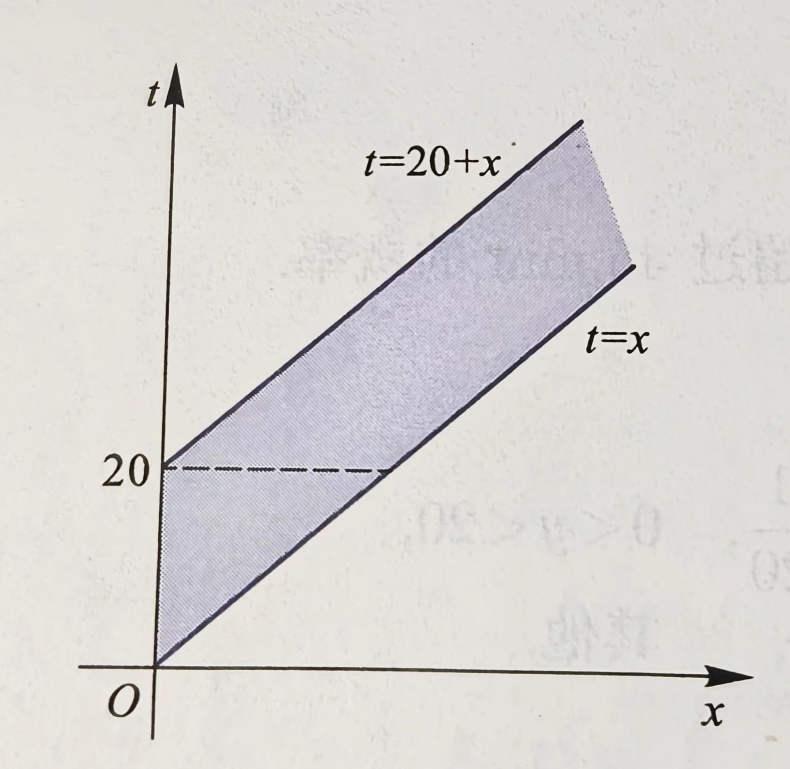

# 概率论与数理统计
## 随机变量的分布
### 分布函数
$$F(x)=P\left\{ X\leq k \right\}$$
可推知
$$P\left\{ x_1<X\leq x_2 \right\}=F(x_2)-F(x_1)$$
二元情况下有
$$F(x,y)=P\{X\leq x,Y\leq y\}$$
$$P\{x_1<X\leq x_2,y_1<Y\leq y_2\}=F(x_2,y_2)-F(x_1,y_2)-F(x_2,y_1)+F(x_1,y_1)$$
### 密度函数
$$F(x)=\displaystyle \int^x_{-\infty}f(t)dt$$
称$f(x)$为$X$的概率密度函数
$$f(x)=F'(x)$$
二元情况下有
$$F(x,y)=\displaystyle \int^x_{-\infty}\int^y_{-\infty}f(u,v)dudv$$
$$P\{(X,Y)\in D\}= \iint \limits_Df(x,y)dxdy$$
$$\dfrac{\partial^2F(x,y)}{\partial x \partial y}=f(x,y)$$
### 边际密度函数
$$f_X(x)=\displaystyle\int^{+\infty}_{-\infty}f(x,y)dy\\
f_Y(y)=\displaystyle\int^{+\infty}_{-\infty}f(x,y)dx$$
### 条件密度函数
给定$\{X=x\}$的情况下$Y$的条件密度函数
$$f_{Y|X}(y|x)=\frac{f(x,y)}{f_X(x)}$$
$$P(X\leq x|Y=y)=\displaystyle\int^x_{-\infty}f_{X|Y}(x|y)dx$$
### 反函数的密度函数
$Y=g(X)$，若函数$g$是一处处可导的严格单调函数，其值域为$D$，记$y=g(x)$的反函数为$x=h(y)$，则$Y$的密度函数为
$$f_Y(y)=\begin{cases}
    f_X(h(y))\cdot|h'(y)|,y\in D\\
    0,y\notin D
\end{cases}$$
### 联合分布律
$$P\{X = x_i,Y = y_j\}=p_{ij},i,j=1,2,...$$
### 边际分布律
$$P\{X=x_i\}=\displaystyle \sum^{+\infty}_{j=1}p_{ij}=p_i\\
P\{Y=y_j\}=\displaystyle \sum^{+\infty}_{i=1}p_{ij}=p_j$$
### 条件分布律
$$P\{X=x_i|Y=y_j\}=\frac{P\{X=x_i,Y=y_j\}}{P\{Y=y_j\}},i=1,2,...$$
即给定给定$Y=y_j$条件下的条件分布律
### 独立性
1. $X,Y$相互独立当且仅当对任意实数$x,y$有
$$F(x,y)=F_X(x)F_Y(y)$$
2. $X,Y$相互独立当且仅当对任意实数$x_i,x_j$都有
$$P\{X=x_i,Y=y_j\}=P\{X=x_i\}P\{X=x_j\}$$
3. $X,Y$相互独立当且仅当下式几乎处处成立（即面积等于0的区域可以不成立，具体参见课本。）
$$f(x,y)=f_X(x)f_Y(y)$$
### 独立充要条件的定理
二维连续型随机变量$X,Y$相互独立的充要条件是$X,Y$的联合密度函数$f(x,y)$几乎处处可以写成$x$的函数$m(x)$和$y$的函数$n(y)$的乘积，即
$$f(x,y)=m(x)\cdot n(y),-\infty<x,y<+\infty,$$
### $Z=X+Y$的分布
#### 二维离散型随机变量
显然有
$$P\{Z=z_k\}=P\{X+Y=z_k\}=\displaystyle\sum^{+\infty}_{i=1}P\{X=x_i,Y=z_k-x_i\},k=1,2,...$$
同理
$$P\{Z=z_k\}=P\{X+Y=z_k\}=\displaystyle\sum^{+\infty}_{i=1}P\{X=z_k-y_i,Y=y_i\},k=1,2,...$$
当$X,Y$相互独立时有
$$P\{Z=z_k\}=P\{X=x_i\}P\{Y=z_k-y_i\}$$
$$P\{Z=z_k\}=P\{X=z_k-y_i\}P\{Y=y_i\}$$
#### 二维连续型随机变量
$$f_z(z)=\displaystyle\int^{+\infty}_{-\infty}f(x,z-x)dy$$
$$f_z(z)=\displaystyle\int^{+\infty}_{-\infty}f(z-y,y)dy$$
当$X,Y$相互独立时有
$$f_Z(z)=\displaystyle\int^{+\infty}_{-\infty}f_X(x)f_Y(z-x)dx$$
$$f_Z(z)=\displaystyle\int^{+\infty}_{-\infty}f_X(z-y)f_Y(y)dy$$
#### 例题
设某服务台顾客等待时间（以min计）$X$服从参数为$\lambda$的指数分布，接受服务的时间$Y$服从区间$(0.20)$上的均匀分布，且设$X,Y$相互独立。记$Z=X+Y$.  
(1)求$Z$的密度函数$f_Z(t)$  
(2)设$\lambda=\frac{1}{20}$，求等待与接收服务的总时间不超过45min的概率。

(1)由题意知
$$f_X(x)=\begin{cases}
    \lambda e^{-\lambda x},x>0\\
    0,x\leq 0
\end{cases},f_Y(y)=\begin{cases}
    \dfrac{1}{20},0<y<20\\
    0,其他
\end{cases}$$
由$X,Y$相互独立，可知$X,Y$的联合密度函数为
$$f(x,y)=f_X(x)f_Y(y)=\begin{cases}
    \dfrac{1}{20}\lambda e^{-\lambda x},x>0,0<y<20\\
    0,其他
\end{cases}$$
即
$$f(x,t-x)=\begin{cases}
    \dfrac{1}{20}\lambda e^{-\lambda x},x>0,0<t-x<20\\
    0,其他
\end{cases}$$
$$f_Z(t)=\displaystyle\int^{+\infty}_{-\infty}f(x,t-x)dx$$

如图  
当$t\leq 0$时，$f_Z(t)=0$  

当$0<t<20$时，$f_Z(t)=\displaystyle\int^{t}_{0}\frac{1}{20}\lambda e^{-\lambda x}=\frac{1}{20}(1-e^{-\lambda t})$

当$t\geq20$时，$f_Z(t)=\displaystyle\int^{t}_{t-20}\frac{1}{20}\lambda e^{-\lambda x}=\frac{1}{20}e^{-\lambda t}(e^{20\lambda }-1)$  

(2)$P\{X\leq 45\}=\displaystyle \int^{45}_{-\infty}f_Z(t)=0.8189$
### $M=max\{X,Y\},m=min\{X,Y\}$的分布
$$F_M(t)=P\{max\{X,Y\}\leq t\}=P\{X\leq t,Y\leq t\}=F(t,t)$$
当$X,Y$独立时
$$F_M(t)=F_X(t)\cdot F_Y(t)$$  

$$F_N(t)=P\{min\{X,Y\}\leq t\}=P\{(X\leq t)\cup (Y\leq t)\}=F_X(t)+F_Y(t)-F(t,t)$$
或者
$$F_N(t)=1-P\{X>t,Y>t\}$$
当$X,Y$独立时
$$F_N(t)=F_X(t)+F_Y(t)-F_X(t)F_Y(t)$$
推广到$n$元
$$F_M(t)=\displaystyle\prod^n_{i=1}F_i(t)$$
$$F_N(t)=\displaystyle1-\prod^n_{i=1}\left[1-F_i(t)\right]$$
## 随机变量的数字特征
### 期望
对于离散型随机变量$X$  
$$P\{X=x_i\}=p_i,i=1,2,3$$
若级数$\displaystyle x_ip_i$绝对收敛，则称级数$\displaystyle x_ip_i$为$X$的期望  
对于连续型随机变量$X$，若
$$\displaystyle\int^{+\infty}_{-\infty}|x|f(x)<+\infty$$
则称$\displaystyle\int^{+\infty}_{-\infty}xf(x)<+\infty$为$X$的期望  
$$E(g(X))=\displaystyle\sum^n_{i=1}g(x_i)p_i$$
$$E(g(X))=\displaystyle\int^{+\infty}_{-\infty}g(x)f(x)dx$$
其中$f(x)$是$X$的密度函数
$$E(h(X,Y))=\displaystyle\int^{+\infty}_{-\infty}\int^{+\infty}_{-\infty}h(x,y)f(x,y)dxdy$$
其中$f(x,y)$是$X,Y$的联合密度函数
### 期望的性质
1. 
$$E\left(c_0+\displaystyle\sum^n_{i=1}c_iX_i\right)=c_0+\displaystyle\sum^n_{i=1} c_iE(X_i)$$
2. 若$X_i(i=1,2,...,n)$相互独立，且数学期望都存在，则有
$$E\left(\prod^n_{i=1}X_i\right)=\prod^n_{i=1}E(X_i)$$
### 条件期望
给定$X=x$
$$E\{Y|x\}=E\{Y|X=x\}=\displaystyle\sum^{+\infty}_{j=1}y_jp_j(x)$$
$$E\{Y|x\}=E\{Y|X=x\}=\displaystyle\int^{+\infty}_{-\infty}yf_{Y|X}(y|x)dy$$
### 全期望公式
$$E(Y)=E[E(Y|X)]$$
当(X,Y)为二维离散型随机变量时
$$E(Y)=\displaystyle\sum^{+\infty}_{i=1}E(Y|X=i)P\{X=i\}$$
当(X,Y)为二维连续型随机变量时
$$E(Y)=\displaystyle\int^{+\infty}_{-\infty}E(Y|X=x)f_X(x)dx$$
### 方差
$$Var(X)=E[(X-E(X))^2]$$
对于离散变量
$$Var(X)=\displaystyle\sum^{+\infty}_{i=0}(x_i-E(X))^2p_i$$
对于连续变量
$$Var(X)=\displaystyle\int^{+\infty}_{-\infty}(x-E(X))^2f(x)dx$$
$$Var(X)=E(X^2)-E(X)^2$$
推论：若某一随机变量平方的数学期望存在，则一定保证了这个随机变量数学期望的存在性。
### 方差的性质
1. $Var(cX)=c^2Var(X)$
2. $Var(X+c)=Var(X)$
3. 推广：$Var\left(c_0+\displaystyle\sum^n_{i=1}c_iX_i\right)=\displaystyle\sum^n_{i=1}c_i^2Var(X_i)$
4. $Var(X)\leq E[(X-c)^2]$，当且仅当$E(X)=c$时等号成立
5. 若$X_1,X_2,...,X_n$为两两独立的随机变量，方差都存在，则
$$Var\left(\displaystyle\sum^n_{i=1}X_i\right)=\displaystyle\sum^{n}_{i=1}Var(X_i)$$
6. $X$的方差存在时，$Var(x)=0$当且仅当$P\{X=c\}=1$，其中$c=E(X)$
### 协方差
$$Cov(X,Y)=E[(X-E(X))(Y-E(Y))]$$
对二维离散型变量
$$Cov(X,Y)=\displaystyle\sum^{+\infty}_{i=1}\sum^{+\infty}_{j=1}(x_i-E(X))(y_j-E(Y))p_{ij}$$
对二维连续型变量
$$Cov(x,y)=\displaystyle\int^{+\infty}_{-\infty}\displaystyle\int^{+\infty}_{-\infty}(x-E(X))(y-E(Y))f(x,y)dxdy$$
通常使用以下公式
$$Cov(X,Y)=E(XY)-E(X)E(Y)$$
### 协方差的性质
1. 
$$Var(\displaystyle\sum^{n}_{i=1}X_i)=\displaystyle\sum_{i=1}^{n}Var(X_i)+2\sum_{1\leq i < j \leq n}Cov(X_i,X_j)$$
2. $Cov(X,Y)=Cov(Y,X)$
3. $Cov(X,X)=Var(X)$
4. $Cov(aX,bY)=abCov(X,Y)$
5. $Cov(X_1+X_2,Y)=Cov(X_1,Y)+Cov(X_2,Y)$
6. 当$Var(X)\cdot Var(Y)\neq 0 时，有(Cov(X,Y))^2\leq Var(X)Var(Y)$，其中等号成立当且仅当$X,Y$有严格的线性关系
### 独立与相关
#### 相关系数
$$\rho_{XY}=\frac{Cov(X,Y)}{\sqrt{Var(X)}\sqrt{Var(Y)}}$$
若$\rho_{XY}=0$则称$X,Y$不相关  
- $|\rho(X,Y)|\leq 1$，其中等号成立当且仅当$X与$Y$之间有严格的线性关系。越接近1$X,Y$线性关系就越强
- $|\rho(X,Y)|>0$时$X,Y$正相关；$|\rho(X,Y)|<0$时$X,Y$负相关；
#### 不相关
1. $\rho(X,Y)=0$
2. $Cov(X,Y)=0$
3. $E(XY)=E(X)E(Y)$
4. $Var(X+Y)=Var(X)+Var(Y)$
5. 独立一定不相关，但反之不然。
## 重要随机变量的概率分布
### 0-1(p)分布，两点分布
- 符号: $X\sim 0-1(p)$
- 概率分布律：
$$P\left\{ X=k \right\}=p^k(1-p)^{1-k}, k=0,1...$$
### 二项分布，n重伯努利实验
- 符号： $X\sim B(n,p)$
- 概率分布律：
$$P\left\{ X=k \right\}=C_n^kp^k(1-p)^{n-k},k=0,1,2,...,n.$$
- 期望：$E(X)=np$
### 泊松分布
- 符号： $X\sim P(\lambda)$
- 概率分布律：
$$P\left\{ X=k \right\}=\frac{e^{-\lambda}\lambda^k}{k!},k=0,1,2,...$$
- 代数和性质：$n$个相互独立的服从泊松分布的随机变量的和仍服从泊松分布，其参数为$n$个分布的参数之和
- 期望和方差：若$X\sim P(\lambda)$，则$E(X)=\lambda,Var(X)=\lambda$
### 均匀分布
- 符号：$X\sim U(a,b)$
- 概率密度函数
$$f(x)=\begin{cases}
\dfrac{1}{b-a},x\in(a,b)\\
0,其他    
\end{cases}$$
- 分布函数
$$F(x)=\begin{cases}
    0,x<a\\
    \dfrac{x-a}{b-a},a\leq x<b\\
    1,x\geq b
\end{cases}$$
### 正态分布
- 符号：$X\sim N(\mu,\sigma)$
- 概率密度函数$f(x)=\dfrac{1}{\sqrt{2\pi}\sigma}e^{-\dfrac{(x-\mu)^2}{2\sigma^2}}$（标准正态分布$f(x)=\dfrac{1}{\sqrt{2\pi}}e^{-\dfrac{x^2}{2}}$）
- 代数和性质：$n$个相互独立的正态变量之和仍为正态变量。且若$X_i\sim N(\mu_i,\sigma_i^2)$，则$\displaystyle\sum^n_{i=1}X_i\sim N\left(\displaystyle\sum^n_{i=1}\mu_i,\sum^n_{i=1}\sigma_i^2\right)$，甚至可以进一步证明$n$个相互独立的正态变量的线性组合仍为正态变量
- 期望和方差：若$X\sim N(\mu,\sigma)$，则$E(X)=\mu,Var(X)=\sigma^2$
### 指数分布
- 符号：$X\sim E(\lambda)$
- 密度函数
$$f(x)=\begin{cases}
    \lambda e^{-\lambda x},x>0\\
    0,x\leq 0
\end{cases}$$
- 分布函数
$$F(x)=\displaystyle \int^x_{-\infty}f(t)dt=\begin{cases}
    1-e^{-\lambda x},x>0\\
    0,x\leq 0
\end{cases}$$
- 期望和方差：若$X\sim E(\lambda)$，则$E(X)=\dfrac{1}{\lambda},Var(X)=\dfrac{1}{\lambda^2}$
### 二元均匀分布
- 密度函数
$$f(x,y)=\begin{cases}
    \dfrac{1}{S_D},(x,y)\in D\\
    0,其他
\end{cases}$$
### 二元正态分布
- 符号：$(X,Y)\sim N(\mu_1,\mu_2;\sigma_1^2,\sigma_2^2;\rho)$
- 密度函数
$$ f(x,y)=\frac{1}{2\pi \rho_1 \rho_2}\sqrt{1-\rho^2}\cdot e^{\displaystyle -\dfrac{1}{2(1-\rho^2)}\left[\dfrac{(x-\mu_1)^2}{\sigma_1^2} - 2\rho \dfrac{(x-\mu_1)(y-\mu_2)}{\sigma_1\sigma_2} + \dfrac{(y-\mu_2)^2}{\sigma_2^2}\right]}$$
- 边际密度函数
$$f_X(x)=\dfrac{1}{\sqrt{2\pi}\sigma_1}e^{-\dfrac{(x-\mu_1)^2}{2\sigma_1^2}}$$
$$f_Y(y)=\dfrac{1}{\sqrt{2\pi}\sigma_2}e^{-\dfrac{(x-\mu_2)^2}{2\sigma_2^2}}$$
即$X\sim N(\mu_1,\sigma_1^2),Y\sim N(\mu_2,\sigma_2^2)$
- 条件密度函数   

给定$X=x$
$$Y\sim N(\mu_2+\rho\frac{\sigma_2}{\sigma_1}(x-\mu_1),(\sqrt{1-\rho^2}\sigma_2)^2)$$
给定$Y=y$
$$Y\sim N(\mu_1+\rho\frac{\sigma_1}{\sigma_2}(y-\mu_2),(\sqrt{1-\rho^2}\sigma_1)^2)$$
## 大数定律和中心极限定理
### 马尔科夫不等式
对任意的$\epsilon>0$，有
$$P\{|Y|\geq \epsilon\}\leq \frac{E(|Y|^k)}{\epsilon ^k}$$

### 切比雪夫不等式
$$P\{|X-\mu|\geq \epsilon\}\geq\frac{\sigma^2}{\epsilon^2}$$