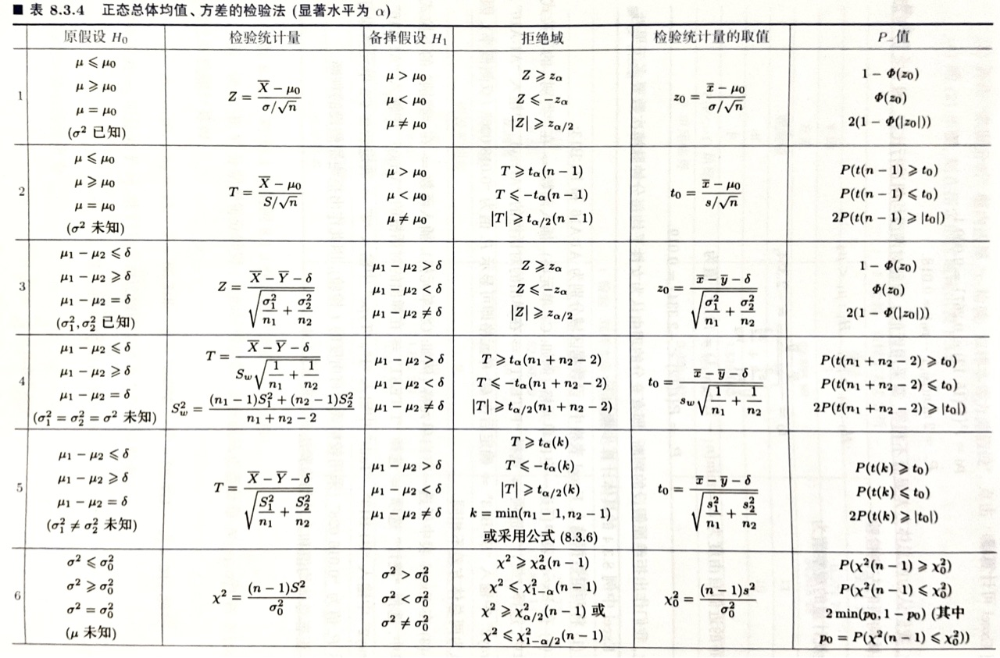

# 概率论与数理统计
## 随机变量的分布
### 分布函数
$$F(x)=P\left\{ X\leq k \right\}$$
可推知
$$P\left\{ x_1<X\leq x_2 \right\}=F(x_2)-F(x_1)$$
二元情况下有
$$F(x,y)=P\{X\leq x,Y\leq y\}$$
$$P\{x_1<X\leq x_2,y_1<Y\leq y_2\}=F(x_2,y_2)-F(x_1,y_2)-F(x_2,y_1)+F(x_1,y_1)$$
### 密度函数
$$F(x)=\displaystyle \int^x_{-\infty}f(t)dt$$
称$f(x)$为$X$的概率密度函数
$$f(x)=F'(x)$$
二元情况下有
$$F(x,y)=\displaystyle \int^x_{-\infty}\int^y_{-\infty}f(u,v)dudv$$
$$P\{(X,Y)\in D\}= \iint \limits_Df(x,y)dxdy$$
$$\dfrac{\partial^2F(x,y)}{\partial x \partial y}=f(x,y)$$
### 边际密度函数
$$f_X(x)=\displaystyle\int^{+\infty}_{-\infty}f(x,y)dy\\
f_Y(y)=\displaystyle\int^{+\infty}_{-\infty}f(x,y)dx$$
### 条件密度函数
给定$\{X=x\}$的情况下$Y$的条件密度函数
$$f_{Y|X}(y|x)=\frac{f(x,y)}{f_X(x)}$$
$$P(X\leq x|Y=y)=\displaystyle\int^x_{-\infty}f_{X|Y}(x|y)dx$$
### 反函数的密度函数
$Y=g(X)$，若函数$g$是一处处可导的严格单调函数，其值域为$D$，记$y=g(x)$的反函数为$x=h(y)$，则$Y$的密度函数为
$$f_Y(y)=\begin{cases}
    f_X(h(y))\cdot|h'(y)|,y\in D\\
    0,y\notin D
\end{cases}$$
### 联合分布律
$$P\{X = x_i,Y = y_j\}=p_{ij},i,j=1,2,...$$
### 边际分布律
$$P\{X=x_i\}=\displaystyle \sum^{+\infty}_{j=1}p_{ij}=p_i\\
P\{Y=y_j\}=\displaystyle \sum^{+\infty}_{i=1}p_{ij}=p_j$$
### 条件分布律
$$P\{X=x_i|Y=y_j\}=\frac{P\{X=x_i,Y=y_j\}}{P\{Y=y_j\}},i=1,2,...$$
即给定给定$Y=y_j$条件下的条件分布律
### 独立性
1. $X,Y$相互独立当且仅当对任意实数$x,y$有
$$F(x,y)=F_X(x)F_Y(y)$$
2. $X,Y$相互独立当且仅当对任意实数$x_i,x_j$都有
$$P\{X=x_i,Y=y_j\}=P\{X=x_i\}P\{X=x_j\}$$
3. $X,Y$相互独立当且仅当下式几乎处处成立（即面积等于0的区域可以不成立，具体参见课本。）
$$f(x,y)=f_X(x)f_Y(y)$$
### 独立充要条件的定理
二维连续型随机变量$X,Y$相互独立的充要条件是$X,Y$的联合密度函数$f(x,y)$几乎处处可以写成$x$的函数$m(x)$和$y$的函数$n(y)$的乘积，即
$$f(x,y)=m(x)\cdot n(y),-\infty<x,y<+\infty,$$
### $Z=X+Y$的分布
#### 二维离散型随机变量
显然有
$$P\{Z=z_k\}=P\{X+Y=z_k\}=\displaystyle\sum^{+\infty}_{i=1}P\{X=x_i,Y=z_k-x_i\},k=1,2,...$$
同理
$$P\{Z=z_k\}=P\{X+Y=z_k\}=\displaystyle\sum^{+\infty}_{i=1}P\{X=z_k-y_i,Y=y_i\},k=1,2,...$$
当$X,Y$相互独立时有
$$P\{Z=z_k\}=P\{X=x_i\}P\{Y=z_k-y_i\}$$
$$P\{Z=z_k\}=P\{X=z_k-y_i\}P\{Y=y_i\}$$
#### 二维连续型随机变量
$$f_z(z)=\displaystyle\int^{+\infty}_{-\infty}f(x,z-x)dy$$
$$f_z(z)=\displaystyle\int^{+\infty}_{-\infty}f(z-y,y)dy$$
当$X,Y$相互独立时有
$$f_Z(z)=\displaystyle\int^{+\infty}_{-\infty}f_X(x)f_Y(z-x)dx$$
$$f_Z(z)=\displaystyle\int^{+\infty}_{-\infty}f_X(z-y)f_Y(y)dy$$
#### 例题
设某服务台顾客等待时间（以min计）$X$服从参数为$\lambda$的指数分布，接受服务的时间$Y$服从区间$(0.20)$上的均匀分布，且设$X,Y$相互独立。记$Z=X+Y$.  
(1)求$Z$的密度函数$f_Z(t)$  
(2)设$\lambda=\frac{1}{20}$，求等待与接收服务的总时间不超过45min的概率。

(1)由题意知
$$f_X(x)=\begin{cases}
    \lambda e^{-\lambda x},x>0\\
    0,x\leq 0
\end{cases},f_Y(y)=\begin{cases}
    \dfrac{1}{20},0<y<20\\
    0,其他
\end{cases}$$
由$X,Y$相互独立，可知$X,Y$的联合密度函数为
$$f(x,y)=f_X(x)f_Y(y)=\begin{cases}
    \dfrac{1}{20}\lambda e^{-\lambda x},x>0,0<y<20\\
    0,其他
\end{cases}$$
即
$$f(x,t-x)=\begin{cases}
    \dfrac{1}{20}\lambda e^{-\lambda x},x>0,0<t-x<20\\
    0,其他
\end{cases}$$
$$f_Z(t)=\displaystyle\int^{+\infty}_{-\infty}f(x,t-x)dx$$

如图  
当$t\leq 0$时，$f_Z(t)=0$  

当$0<t<20$时，$f_Z(t)=\displaystyle\int^{t}_{0}\frac{1}{20}\lambda e^{-\lambda x}=\frac{1}{20}(1-e^{-\lambda t})$

当$t\geq20$时，$f_Z(t)=\displaystyle\int^{t}_{t-20}\frac{1}{20}\lambda e^{-\lambda x}=\frac{1}{20}e^{-\lambda t}(e^{20\lambda }-1)$  

(2)$P\{X\leq 45\}=\displaystyle \int^{45}_{-\infty}f_Z(t)=0.8189$
### $M=max\{X,Y\},m=min\{X,Y\}$的分布
$$F_M(t)=P\{max\{X,Y\}\leq t\}=P\{X\leq t,Y\leq t\}=F(t,t)$$
当$X,Y$独立时
$$F_M(t)=F_X(t)\cdot F_Y(t)$$  

$$F_N(t)=P\{min\{X,Y\}\leq t\}=P\{(X\leq t)\cup (Y\leq t)\}=F_X(t)+F_Y(t)-F(t,t)$$
或者
$$F_N(t)=1-P\{X>t,Y>t\}$$
当$X,Y$独立时
$$F_N(t)=F_X(t)+F_Y(t)-F_X(t)F_Y(t)$$
推广到$n$元
$$F_M(t)=\displaystyle\prod^n_{i=1}F_i(t)$$
$$F_N(t)=\displaystyle1-\prod^n_{i=1}\left[1-F_i(t)\right]$$
## 随机变量的数字特征
### 期望
对于离散型随机变量$X$  
$$P\{X=x_i\}=p_i,i=1,2,3$$
若级数$\displaystyle x_ip_i$绝对收敛，则称级数$\displaystyle x_ip_i$为$X$的期望  
对于连续型随机变量$X$，若
$$\displaystyle\int^{+\infty}_{-\infty}|x|f(x)<+\infty$$
则称$\displaystyle\int^{+\infty}_{-\infty}xf(x)<+\infty$为$X$的期望  
$$E(g(X))=\displaystyle\sum^n_{i=1}g(x_i)p_i$$
$$E(g(X))=\displaystyle\int^{+\infty}_{-\infty}g(x)f(x)dx$$
其中$f(x)$是$X$的密度函数
$$E(h(X,Y))=\displaystyle\int^{+\infty}_{-\infty}\int^{+\infty}_{-\infty}h(x,y)f(x,y)dxdy$$
其中$f(x,y)$是$X,Y$的联合密度函数
### 期望的性质
1. 
$$E\left(c_0+\displaystyle\sum^n_{i=1}c_iX_i\right)=c_0+\displaystyle\sum^n_{i=1} c_iE(X_i)$$
2. 若$X_i(i=1,2,...,n)$相互独立，且数学期望都存在，则有
$$E\left(\prod^n_{i=1}X_i\right)=\prod^n_{i=1}E(X_i)$$
### 条件期望
给定$X=x$
$$E\{Y|x\}=E\{Y|X=x\}=\displaystyle\sum^{+\infty}_{j=1}y_jp_j(x)$$
$$E\{Y|x\}=E\{Y|X=x\}=\displaystyle\int^{+\infty}_{-\infty}yf_{Y|X}(y|x)dy$$
### 全期望公式
$$E(Y)=E[E(Y|X)]$$
当(X,Y)为二维离散型随机变量时
$$E(Y)=\displaystyle\sum^{+\infty}_{i=1}E(Y|X=i)P\{X=i\}$$
当(X,Y)为二维连续型随机变量时
$$E(Y)=\displaystyle\int^{+\infty}_{-\infty}E(Y|X=x)f_X(x)dx$$
### 方差
$$Var(X)=E[(X-E(X))^2]$$
对于离散变量
$$Var(X)=\displaystyle\sum^{+\infty}_{i=0}(x_i-E(X))^2p_i$$
对于连续变量
$$Var(X)=\displaystyle\int^{+\infty}_{-\infty}(x-E(X))^2f(x)dx$$
$$Var(X)=E(X^2)-E(X)^2$$
推论：若某一随机变量平方的数学期望存在，则一定保证了这个随机变量数学期望的存在性。
### 方差的性质
1. $Var(cX)=c^2Var(X)$
2. $Var(X+c)=Var(X)$
3. 推广：$Var\left(c_0+\displaystyle\sum^n_{i=1}c_iX_i\right)=\displaystyle\sum^n_{i=1}c_i^2Var(X_i)$
4. $Var(X)\leq E[(X-c)^2]$，当且仅当$E(X)=c$时等号成立
5. 若$X_1,X_2,...,X_n$为两两独立的随机变量，方差都存在，则
$$Var\left(\displaystyle\sum^n_{i=1}X_i\right)=\displaystyle\sum^{n}_{i=1}Var(X_i)$$
6. $X$的方差存在时，$Var(x)=0$当且仅当$P\{X=c\}=1$，其中$c=E(X)$
### 协方差
$$Cov(X,Y)=E[(X-E(X))(Y-E(Y))]$$
对二维离散型变量
$$Cov(X,Y)=\displaystyle\sum^{+\infty}_{i=1}\sum^{+\infty}_{j=1}(x_i-E(X))(y_j-E(Y))p_{ij}$$
对二维连续型变量
$$Cov(x,y)=\displaystyle\int^{+\infty}_{-\infty}\displaystyle\int^{+\infty}_{-\infty}(x-E(X))(y-E(Y))f(x,y)dxdy$$
通常使用以下公式
$$Cov(X,Y)=E(XY)-E(X)E(Y)$$
### 协方差的性质
1. 
$$Var(\displaystyle\sum^{n}_{i=1}X_i)=\displaystyle\sum_{i=1}^{n}Var(X_i)+2\sum_{1\leq i < j \leq n}Cov(X_i,X_j)$$
2. $Cov(X,Y)=Cov(Y,X)$
3. $Cov(X,X)=Var(X)$
4. $Cov(aX,bY)=abCov(X,Y)$
5. $Cov(X_1+X_2,Y)=Cov(X_1,Y)+Cov(X_2,Y)$
6. 当$Var(X)\cdot Var(Y)\neq 0 时，有(Cov(X,Y))^2\leq Var(X)Var(Y)$，其中等号成立当且仅当$X,Y$有严格的线性关系
### 独立与相关
#### 相关系数
$$\rho_{XY}=\frac{Cov(X,Y)}{\sqrt{Var(X)}\sqrt{Var(Y)}}$$
若$\rho_{XY}=0$则称$X,Y$不相关  
- $|\rho(X,Y)|\leq 1$，其中等号成立当且仅当$X与$Y$之间有严格的线性关系。越接近1$X,Y$线性关系就越强
- $|\rho(X,Y)|>0$时$X,Y$正相关；$|\rho(X,Y)|<0$时$X,Y$负相关；
#### 不相关
1. $\rho(X,Y)=0$
2. $Cov(X,Y)=0$
3. $E(XY)=E(X)E(Y)$
4. $Var(X+Y)=Var(X)+Var(Y)$
5. 独立一定不相关，但反之不然。
## 重要随机变量的概率分布
### 0-1(p)分布，两点分布
- 符号: $X\sim 0-1(p)$
- 概率分布律：
$$P\left\{ X=k \right\}=p^k(1-p)^{1-k}, k=0,1...$$
### 二项分布，n重伯努利实验
- 符号： $X\sim B(n,p)$
- 概率分布律：
$$P\left\{ X=k \right\}=C_n^kp^k(1-p)^{n-k},k=0,1,2,...,n.$$
- 期望：$E(X)=np$
### 泊松分布
- 符号： $X\sim P(\lambda)$
- 概率分布律：
$$P\left\{ X=k \right\}=\frac{e^{-\lambda}\lambda^k}{k!},k=0,1,2,...$$
- 代数和性质：$n$个相互独立的服从泊松分布的随机变量的和仍服从泊松分布，其参数为$n$个分布的参数之和
- 期望和方差：若$X\sim P(\lambda)$，则$E(X)=\lambda,Var(X)=\lambda$
### 均匀分布
- 符号：$X\sim U(a,b)$
- 概率密度函数
$$f(x)=\begin{cases}
\dfrac{1}{b-a},x\in(a,b)\\
0,其他    
\end{cases}$$
- 分布函数
$$F(x)=\begin{cases}
    0,x<a\\
    \dfrac{x-a}{b-a},a\leq x<b\\
    1,x\geq b
\end{cases}$$
### 正态分布
- 符号：$X\sim N(\mu,\sigma)$
- 概率密度函数$f(x)=\dfrac{1}{\sqrt{2\pi}\sigma}e^{-\dfrac{(x-\mu)^2}{2\sigma^2}}$（标准正态分布$f(x)=\dfrac{1}{\sqrt{2\pi}}e^{-\dfrac{x^2}{2}}$）
- 代数和性质：$n$个相互独立的正态变量之和仍为正态变量。且若$X_i\sim N(\mu_i,\sigma_i^2)$，则$\displaystyle\sum^n_{i=1}X_i\sim N\left(\displaystyle\sum^n_{i=1}\mu_i,\sum^n_{i=1}\sigma_i^2\right)$，甚至可以进一步证明$n$个相互独立的正态变量的线性组合仍为正态变量
- 期望和方差：若$X\sim N(\mu,\sigma)$，则$E(X)=\mu,Var(X)=\sigma^2$
### 指数分布
- 符号：$X\sim E(\lambda)$
- 密度函数
$$f(x)=\begin{cases}
    \lambda e^{-\lambda x},x>0\\
    0,x\leq 0
\end{cases}$$
- 分布函数
$$F(x)=\displaystyle \int^x_{-\infty}f(t)dt=\begin{cases}
    1-e^{-\lambda x},x>0\\
    0,x\leq 0
\end{cases}$$
- 期望和方差：若$X\sim E(\lambda)$，则$E(X)=\dfrac{1}{\lambda},Var(X)=\dfrac{1}{\lambda^2}$
### 二元均匀分布
- 密度函数
$$f(x,y)=\begin{cases}
    \dfrac{1}{S_D},(x,y)\in D\\
    0,其他
\end{cases}$$
### 二元正态分布
- 符号：$(X,Y)\sim N(\mu_1,\mu_2;\sigma_1^2,\sigma_2^2;\rho)$
- 密度函数
$$ f(x,y)=\frac{1}{2\pi \rho_1 \rho_2}\sqrt{1-\rho^2}\cdot e^{\displaystyle -\dfrac{1}{2(1-\rho^2)}\left[\dfrac{(x-\mu_1)^2}{\sigma_1^2} - 2\rho \dfrac{(x-\mu_1)(y-\mu_2)}{\sigma_1\sigma_2} + \dfrac{(y-\mu_2)^2}{\sigma_2^2}\right]}$$
- 边际密度函数
$$f_X(x)=\dfrac{1}{\sqrt{2\pi}\sigma_1}e^{-\dfrac{(x-\mu_1)^2}{2\sigma_1^2}}$$
$$f_Y(y)=\dfrac{1}{\sqrt{2\pi}\sigma_2}e^{-\dfrac{(x-\mu_2)^2}{2\sigma_2^2}}$$
即$X\sim N(\mu_1,\sigma_1^2),Y\sim N(\mu_2,\sigma_2^2)$
- 条件密度函数   

给定$X=x$
$$Y\sim N(\mu_2+\rho\frac{\sigma_2}{\sigma_1}(x-\mu_1),(\sqrt{1-\rho^2}\sigma_2)^2)$$
给定$Y=y$
$$Y\sim N(\mu_1+\rho\frac{\sigma_1}{\sigma_2}(y-\mu_2),(\sqrt{1-\rho^2}\sigma_1)^2)$$
## 大数定律和中心极限定理
### 大数定律
#### 切比雪夫不等式
$$P\{|X-\mu|\geq \epsilon\}\geq\frac{\sigma^2}{\epsilon^2}$$
#### 伯努利大数定律
设$n_A$为$n$重伯努利实验中事件$A$发生的次数，$p(0<p<1)$是事件$A$在每次实验中发生的概率，即$P(A)=p$，则对任意的$\epsilon > 0$，有
$$\displaystyle\lim_{n\rightarrow + \infty}P\left\{\left|\frac{n_A}{n}-p\right|\geq \epsilon\right\}=0$$
#### 辛钦大数定律
设$\{X_i,i\geq1\}$为独立同分布的随机变量序列，且数学期望存在，记为$\mu$，则对任意的$\epsilon>0$，有
$$\displaystyle\lim_{n\rightarrow + \infty}P\left\{\left|\frac{1}{n}\sum^n_{i=1}X_i-\mu\right|\geq \epsilon\right\}=0$$
即$\displaystyle\frac{1}{n}X_i\sum^n_{i=1}\overset{P}{\rightarrow}\mu(n\rightarrow+\infty)$，并认为此时随机变量序列$\{X_i,i\geq1\}$服从大数定律。
##### 推论
设$\{X_i,i\geq1\}$为独立同分布的随机变量序列，若$h(x)$为一连续函数，且$E(h(|X_1|))<+\infty$则对任意的$\epsilon>0$，$a=E(h(X_1))$有
$$\displaystyle\lim_{n\rightarrow + \infty}P\left\{\left|\frac{1}{n}\sum^n_{i=1}X_i-a\right|\geq \epsilon\right\}=0$$
即$\displaystyle\frac{1}{n}\sum^n_{i=1}h(X_i)\overset{P}{\rightarrow}a(n\rightarrow+\infty)$，并认为此时随机变量序列$\{X_i,i\geq1\}$服从大数定律。
### 中心极限定理
#### 林德伯格-莱维中心极限定理
设$\{X_i,i\geq1\}$为独立同分布的随机变量序列，且数学期望$E(X_i)=\mu$和方差$Var(X_i)=\sigma^2$均存在($\sigma>0$)，则对任意的$x\in R$，有
$$\displaystyle \lim_{n\rightarrow +\infty}P\left\{ \dfrac{\displaystyle\sum^n_{i=1}X_i-n\mu}{\sigma\sqrt n}\leq x \right\}=\frac{1}{\sqrt{2\pi}}\displaystyle\int^x_{-\infty}e^{-\frac{t^2}{2}}dt=\varPhi(x)$$
即
$$\dfrac{\displaystyle\sum^n_{i=1}X_i-n\mu}{\sigma\sqrt n}\overset{近似地}{\sim}N(0,1)$$
#### 棣莫弗-拉普拉斯中心极限定理
设$n_A$为在$n$重伯努利试验中事件$A$发生的次数，$p$为事件$A$在每次试验中发生的概率，即$P(A)=p(0<p<1)$，则对任意的$x\in R$，有
$$\displaystyle \lim_{n\rightarrow +\infty}P\left\{\frac{n_A-np}{\sqrt{np(1-p)}}\leq x\right\}=\frac{1}{\sqrt{2\pi}}\displaystyle\int^x_{-\infty}e^{-\frac{t^2}{2}}dt=\varPhi(x)$$
## 统计量和抽样分布
### 统计量
#### 样本均值
$$\bar{X}=\frac{1}{n}\sum^n_{i=1}X_i$$
#### 样本方差
$$S^2=\frac{1}{n-1}\sum^n_{i=1}(X_i-\bar{X})^2=\frac{1}{n-1}\left(\sum^{n}_{i=1}X_i^2-n\bar{X}^2\right)$$
#### 样本标准差
$$S=\sqrt{S^2}=\sqrt{\frac{1}{n-1}\left(\sum^{n}_{i=1}X_i^2-n\bar{X}^2\right)}$$
#### 样本k阶原点矩
$$A_k=\frac{1}{n}\sum^n_{i=1}X_i^k,k=1,2,...$$
#### 样本k阶中心矩
$$B_k=\frac{1}{n}\sum^n_{i=1}(X_i-\bar{X})^k,k=2,3,...$$
## $\chi^2$分布，$t$分布，$F$分布
### $\chi^2$分布
设$X_1,X_2,...,X_n$为独立同分布的随机变量，且都服从正态分布$N(0,1)$。记
$$Y=X_1^2+X^2_2+...+X_n^2$$
则称$Y$服从自由度为$n$的$\chi^2$分布，记为$Y\sim \chi^2(n)$
#### 性质
##### 可加性
设$Y_1\sim\chi^2(m),Y_2\sim\chi^2(n),m,n\geq 1$，且两者相互独立，则$Y_1+Y_2\sim\chi^2(m+n)$
##### 期望和方差
设$Y\sim\chi^2(n)$，则
$$E(Y)=n,Var(Y)=2n$$
##### $\chi^2$分布分位数
对于给定的正数$\alpha,0<\alpha<1$，称满足条件
$$P\{\chi^2>\chi^2_\alpha(n)\}=\int^{+\infty}_{\chi^2_\alpha(n)}f_{\chi^2}(x)dx=\alpha$$
的$\chi^2_\alpha(n)$为$\chi^2(n)$分布的上（侧）$\alpha$分位数
### $t$分布
设$X\sim N(0,1),Y\sim \chi^2(n)$，且$X,Y$相互独立，则称随机变量
$$t=\frac{X}{\sqrt{Y/n}}$$
服从自由度为$n$的$t$分布，又称为学生氏分布，记为$t\sim t(n)$
#### $t$分布分位数
对于给定的正数$\alpha,0<\alpha<1$，称满足条件
$$P\{\chi>t_\alpha(n)\}=\int^{+\infty}_{t_\alpha(n)}f_{t}(x)dx=\alpha$$
的$t_\alpha(n)$为$t(n)$分布的上（侧）$\alpha$分位数
#### 性质
1. $n$足够大时，$t$分布近似于标准正态分布$N(0,1)$
2. 密度函数是偶函数，可知$t_{1-\alpha}(n)=-t_\alpha(n)$
### $F$分布
设 $U\sim\chi^2(n_1)$，$V\sim \chi^2(n_2)$，且 $U,V$ 相互独立，则称随机变量 
$$F=\frac{U/n_1}{V/n_2}$$ 
服从自由度为 $(n_1,n_2)$ 的 $F$ 分布，记 $F\sim F(n_1,n_2)$。
#### $F$分布分位数
对于给定的正数$\alpha,0<\alpha<1$，称满足条件
$$P\{\chi>F_\alpha(n)\}=\int^{+\infty}_{F_\alpha(n)}f_{F}(x)dx=\alpha$$
的$t_\alpha(n)$为$t(n)$分布的上（侧）$\alpha$分位数
#### 性质
1. 设 $F\sim F(n_1,n_2)$，则 $F^{-1}\sim F(n_2,n_1)$
2. 设 $X\sim t(n)$，则 $X^2\sim F(1,n)$
3. $F_{1-\alpha}(n_1,n_2)=\frac{1}{F_{\alpha}(n_2,n_1)}$
## 正态总体下的抽样分布

设 $X_1,X_2,...,X_n$ 是来自正态总体 $N(\mu,\sigma^2)$ 的样本，$\overline{X}$ 是样本均值，$S^2$ 是样本方差，则有：

1. $\overline{X}\sim N(\mu,\frac{\sigma^2}{n})$
2. $\displaystyle \frac{(n-1)S^2}{\sigma^2}\sim \chi^2(n-1)$
3. $\overline{X}$ 与 $S^2$ 相互独立
4. $\displaystyle\frac{\overline{X} - \mu}{S/\sqrt{n}}\sim t(n-1)$

*注意：$\displaystyle\frac{\overline{X} - \mu}{\sigma/\sqrt{n}}\sim N(0,1)$

设 $X_1,X_2,...,X_n$ 和 $Y_1,Y_2,...,Y_n$ 是分别来自正态总体 $N(\mu_1,\sigma_1^2)$ 和 $N(\mu_2,\sigma_2^2)$，并且它们相互独立，$\overline{X},\overline{Y}$ 是样本均值，$S_1^2,S_2^2$ 是样本方差，则有：

1. $\displaystyle\frac{S_1^2/\sigma_1^2}{S_2^2/\sigma^2_2}\sim F(n_1-1,n_2-1)$
2. $\displaystyle\frac{(\overline{X}-\overline{Y})-(\mu_{1}-\mu_{2})}{\sqrt{\frac{\sigma_{1}^{2}}{n_1}+\frac{\sigma_{2}^{2}}{n_2}}} \sim N(0,1)$
3. 当 $\sigma_1^2=\sigma_2^2=\sigma^2$ 时：

   $\displaystyle\frac{(\overline X - \overline Y) - (\mu_1-\mu_2)}{S_\omega\sqrt{\frac{1}{n_1}+\frac{1}{n_2}}}\sim t(n_1+n_2-2)$，其中 $\displaystyle S^2_\omega=\frac{(n_1-1)S_1^2+(n_2-1)S^2_2}{n_1+n_2-2}$
## Chapter 7 参数估计

### 点估计

设总体 $X$ 的分布函数为 $F(x;\theta)$，$\theta=(\theta_{1},\theta_{2},...,\theta_{k})$ 是未知的待估参数，$X_1,X_2,...,X_n$ 是 $X$ 的一个样本。点估计就是要对每一个未知参数 $\theta_{i}$ 构造一个适当的统计量 $\hat{\theta_{i}}=\theta_{i}(X_1,X_2,...,X_n)$，用作对未知参数 $\theta_{i}$ 的估计，称为 $\theta_{i}$ 的**估计量**。

若已知样本的观察值为 $x_1,x_2,...,x_n$，则称 $\hat{\theta_{i}}=\theta_{i}(X_1,X_2,...,X_n)$ 为 $\theta$ 的一个**估计值**。

#### 矩法

思想：用样本矩去估计相应的总体矩，换言之，用原点矩 $A_k$ 去估计 $\mu_{k}$，用中心距 $B_k$ 去估计 $\nu_{k}$。

具体步骤如下（假设有 $k$ 个待求未知参数）：

1. 列出总体的前 $k$ 阶矩

   $\mu_{i}=E(X^i)=h_i(\theta_{1},\theta_{2},...,\theta_{k})\;\;,\;\;i=1,2,...,k$

2. 从方程组中解出这 $k$ 个参数

   $\theta_{i}=g_i(\mu_{1},\mu_{2},...,\mu_{k})\;\;,\;\;i=1,2,...,k$

3. 将上一步解出的参数的表达式中出现的总体矩用相应的样本矩替换

   $\hat{\theta_{i}}=g_i(A_{1},A_{2},...,A_{k})\;\;,\;\;i=1,2,...,k$

值得注意的是：

- 如果方程中存在恒等式，则可以顺延求 $\mu_{k+1},\mu_{k+2},...$
- 理论上任意 $k$ 个关于 $\mu_{i}$ 的方程组都可以，但考试要求前 $k$ 个才算对

#### 极大似然法

思想：用“最像” $\theta$ 真值的值去估计 $\theta$，换言之，在参数空间中找一个 $\theta$，使得 $L(\theta)$ 达到最大。

具体步骤如下（若待估参数不止一个，则对每个待估参数 $\theta_{i}$ 均执行如下操作）：

1. 构造似然函数 $L(\theta)=L(\theta;x_1,x_2,...,x_n)=\prod_{i=1}^{n}f(x_i;\theta)$
2. 求解 $\theta$，使得 $L(\theta)$ 达到最大值，称这个 $\theta$ 为极大似然估计量，记作 $\hat{\theta}$

**求解似然函数最大值点**的常用方法：

- 解似然方程 $\frac{\partial L(\theta)}{\partial \theta_i}=0$，检验极大值点
- 或者也可以解对数似然方程 $\frac{\partial \ln L(\theta)}{\partial \theta_i}=0$，检验极大值点
- 若 $L(\theta)$ 关于某个 $\theta_i$ 是单调的，则最大值在边界取得

极大似然估计法的性质：

- 不变原则：设参数 $\theta$ 的极大似然估计为 $\hat\theta$ 若 $g(\cdot)$ 为连续函数，则 $g(\theta)$ 的极大似然估计为 $g(\hat{\theta})$

### 估计量的评价准则

#### 无偏性准则

若参数 $\theta$ 估计量 $\hat{\theta}=\theta(X_1,X_2,...,X_n)$ 的数学期望存在，且满足 $E(\hat{\theta})=\theta$，则称 $\hat{\theta}$ 是 $\theta$ 的一个**无偏估计量**或**无偏估计(Unbiased Estimation)**。

- 若 $E(\hat{\theta})\not=\theta$，则称 $|E(\hat{\theta})-\theta|$ 为估计量 $\hat\theta$ 的**偏差**
- 若 $\lim_{n\to+\infty}E(\hat{\theta})=0$，则称 $\hat{\theta}$ 是 $\theta$ 的**渐进无偏估计(Asymptotic Unbiased Estimation)**

#### 有效性准则

设 $\theta_1$ 和 $\theta_2$ 是参数 $\theta$ 的两个无偏估计，如果对于 $\forall \theta\in\Theta$，$Var(\theta_1)\leq Var(\theta_2)$，且不恒取等，则称 $\theta_1$ 比 $\theta_2$ **有效**。

#### 均方误差准则

$E[(\hat\theta-\theta)^2]$ 是估计量 $\hat\theta$ 的**均方误差(Mean Square Error)**，记为 $Mse(\hat\theta)$。

在均方误差准则下，估计量的均方误差越小越好。若 $Mse(\hat\theta_1)\leq Mse(\hat\theta_2)$ 且不恒取等，则称 $\hat\theta_1$ 优于 $\hat\theta_2$。

- 若 $\hat\theta$ 是参数 $\theta$ 的无偏估计量，则有 $Mse(\hat\theta)=Var(\hat\theta)$
- 均方误差有分解式 $E[(\hat\theta-\theta)^2]=Var(\hat\theta)+(E(\hat\theta)-\theta)^2$
- 均方误差准则常用于有偏估计量之间，或有偏估计量与无偏估计量之间的比较；实际应用中，有时均方误差准则比无偏性准则更加重要

#### 相合性准则

若对于 $\forall \varepsilon >0$，有 $\lim_{n\to+\infty}P\{|\hat\theta_n-\theta|<\varepsilon\}=1$，即 $\hat\theta _n \xrightarrow{P}\theta$，则称 $\hat\theta_n$ 是 $\theta$ 的**相合估计量(Consistent Estimation)**或**一致估计量**。

有如下定理：

- 设 $\hat\theta_n$ 是 $\theta$ 的一个估计量，若 $\lim_{n\to \infty}E(\hat\theta)=\theta$，$\lim_{n\to\infty}Var(\hat\theta_n)=0$，则 $\hat\theta_n$ 是 $\theta$ 的相合估计。

### 区间估计

**点估计**是由样本求出未知参数 $\theta$ 的一个估计值 $\hat{\theta}$，而**区间估计**则要由样本给出参数 $\theta$ 的一个估计范围，并指出该区间包含 $\theta$ 的可靠程度。

下面给出区间估计的一些基本概念：

- 置信区间：设总体 $X$ 的分布函数 $F(x;\theta)$ 含有一个未知参数 $\theta$，对于给定的值 $\alpha$，如果有两个统计量 $\theta_{L}=\theta_{L}(X_1,X_2,...,X_n)$，$\theta_{U}=\theta_{U}(X_1,X_2,...,X_n)$，$\theta_{L}<\theta_{U}$，使得 $P\{ \theta_{L}(X_1,X_2,...,X_n) < \theta < \theta_{U}(X_1,X_2,...,X_n) \}\geq 1-\alpha \;\;,\;\; \forall \theta \in \Theta$，则称随机区间 $[\theta_{L},\theta_{U}]$ 是 $\theta$ 的置信水平为 $1-\alpha$ 的**双侧置信区间**，简称**置信区间**
- 置信下限和置信上限：分别是 $\theta_{L}$ 和 $\theta_{U}$
- 置信度（置信水平）：$1-\alpha$
- 单侧置信区间：在置信区间的定义中，如果修改为 $P\{ \theta_{L}(X_1,X_2,...,X_n) < \theta \}\geq 1-\alpha \;\;,\;\; \forall \theta \in \Theta$，则称随机区间 $[\theta_{L},+\infty]$ 是 $\theta$ 的置信水平为 $1-\alpha$ 的**单侧置信区间**
    - 相应地，我们还可以定义单侧置信下限，以及具有单侧置信上限的单侧置信区间 $(-\infty,\theta_{U})$

双侧置信区间和单侧置信区间的关系：

设 $\theta_{L}=\theta_{L}(X_1,X_2,...,X_n)$，$\theta_{U}=\theta_{U}(X_1,X_2,...,X_n)$ 分别是 $\theta$ 的置信水平为 $1-\alpha_{1}$ 和 $1-\alpha_{2}$ 的单侧置信下限及上限，且对于任何样本都满足 $\theta_{L}<\theta_{U}$，则 $(\theta_{L},\theta_{U})$ 是 $\theta$ 的置信水平为 $1-\alpha_{1}-\alpha_{2}$ 的双侧置信区间。

#### 评价区间估计的原则

- **置信度原则**：

  希望随机区间 $[\theta_{L},\theta_{U}]$ 包含真值 $\theta$ 的概率越大越好
- **精确度原则**：

  可以用随机区间的平均长度 $E(\theta_{U}-\theta_{L})$ 去衡量，希望其越短越好；并称二分之一区间的平均长度为置信区间的**误差限**
- 这是一对矛盾的标准，现实应用中我们通常希望在保证置信度的前提下，尽可能提高精确度

#### 枢轴量法

枢轴量法是寻求区间估计的常用方法。

**枢轴量**是样本 $X=(X_1,X_2,...,X_n)$ 和待估参数 $\theta$ 的函数，即 $G=G(X_1,X_2,...,X_n;\theta)$，并且要求 $G$ 的分布已知且不依赖于任何未知参数。

具体步骤如下：

1. 构造枢轴量 $G(X;\theta)$
2. 对于给定的置信度 $1-\alpha$，确定两个常数 $a,b$，使得：

   $$P\{ a<G(X;\theta)<b \}\geq 1-\alpha$$
3. 若能从 $a<G(X;\theta)<b$ 反解出不等式：

   $$\theta_{L}(X)<\theta<\theta_{U}(X)$$

   那么 $[\theta_{L},\theta_{U}]$ 就是 $\theta$ 的置信水平为 $1-\alpha$ 的置信区间，也称**同等置信区间**

值得注意的是：

- 若要求单侧置信限，只需要将 $P\{ a<G(X;\theta)<b \}\geq 1-\alpha$ 相应地改为 $P\{ a<G(X;\theta) \}\geq 1-\alpha$ 或 $P\{ G(X;\theta)<b \}\geq 1-\alpha$ 即可
- 枢轴量和统计量的区别：
    - 枢轴量是样本和待估参数的函数，其分布不依赖于任何未知参数
    - 统计量只是样本的函数，其分布常依赖于未知参数

### 正态总体参数的区间估计

#### 单个正态总体的情形

设 $X_1,X_2,...,X_n$ 来自总体 $N(\mu,\sigma_{2})$，$\overline{X}$ 和 $S^2$ 分别为样本均值和样本方差，置信度为 $1-\alpha$：

1.&nbsp;$\sigma^2$ 已知时 $\mu$ 的置信区间：

取枢轴量 $\frac{\overline X-\mu}{\sigma/\sqrt{n}}\sim N(0,1)$，置信区间为 $\left(\overline X-\frac{\sigma}{\sqrt{n}}z_{\alpha/2},\overline X + \frac{\sigma}{\sqrt{n}}z_{\alpha/2}\right)$。

若只考虑单侧置信限，以单侧置信下限为例，单侧置信区间为 $\left(\overline X-\frac{\sigma}{\sqrt{n}}z_{\alpha},+\infty\right)$。

---

2.&nbsp;$\sigma^2$ 未知时 $\mu$ 的置信区间:

取枢轴量 $\frac{\overline X-\mu}{S/\sqrt{n}}\sim t(n-1)$，置信区间为 $\left(\overline X - \frac{S}{\sqrt{n}}t_{\alpha/2}(n-1),\overline X + \frac{S}{\sqrt{n}}t_{\alpha/2}(n-1)\right)$。

---

3.&nbsp;$\sigma^2$ 的置信区间（当作 $\mu$ 未知）：

取枢轴量 $\frac{(n-1)S^2}{\sigma^2}\sim \chi^2(n-1)$，置信区间为 $\left(\frac{(n-1)S^2}{\chi^2_{\alpha/2}(n-1)},\frac{(n-1)S^2}{\chi^2_{1-\alpha/2}(n-1)}\right)$。

#### 两个正态总体的情形
设 $X_1,X_2,...,X_{n_1}$ 来自 $N(\mu_{1},\sigma_{1}^{2})$，$Y_1,Y_2,...,Y_{n_2}$ 来自 $N(\mu_{2},\sigma_{2}^{2})$，这两个样本相互独立，$\overline{X}=\frac{1}{n_1}\sum\limits_{i=1}^{n_1}X_i$，$\overline{Y}=\frac{1}{n_2}\sum\limits_{i=1}^{n_2}Y_i$，$S_1^2$ 和 $S_2^2$ 分别为它们的样本均值和样本方差，置信度为 $1-\alpha$：

- 比较均值（估计 $\mu_1-\mu_2$，也称为 Behrens-Fisher 问题）
- 比较方差（估计 $\frac{\sigma_1^2}{\sigma_2^2}$）

1.&nbsp;$\sigma_1^2,\sigma_2^2$ 已知时 $\mu_1-\mu_2$ 的置信区间：

取枢轴量 $\frac{(\overline{X}-\overline{Y})-(\mu_{1}-\mu_{2})}{\sqrt{\frac{\sigma_{1}^{2}}{n_1}+\frac{\sigma_{2}^{2}}{n_2}}} \sim N(0,1)$，置信区间为 $\left(\overline X - \overline Y\pm z_{\alpha/2}\sqrt{\frac{\sigma_1^2}{n_1}+\frac{\sigma_2^2}{n_2}}\right)$。

---

2.&nbsp;$\sigma_1^2=\sigma_2^2=\sigma^2$ 未知时 $\mu_1-\mu_2$ 的置信区间：

取枢轴量 $\frac{(\overline X - \overline Y) - (\mu_1-\mu_2)}{S_\omega\sqrt{\frac{1}{n_1}+\frac{1}{n_2}}}\sim t(n_1+n_2-2)$，置信区间为 $\left(\overline X - \overline Y\pm t_{\alpha/2}(n_1+n_2-2)S_w\sqrt{\frac{1}{n_1}+\frac{1}{n_2}}\right)$。

---

3.&nbsp;$\sigma_1^2\not =\sigma_2^2$ 且未知时 $\mu_1-\mu_2$ 的置信区间：

当样本容量 $n_1$ 和 $n_2$ 都充分大时（一般要大于 $50$），取枢轴量 $\frac{(\overline{X}-\overline{Y})-(\mu_{1}-\mu_{2})}{\sqrt{\frac{S_{1}^{2}}{n_1}+\frac{S_{2}^{2}}{n_2}}} \sim N(0,1)$，置信区间为 $\left(\overline X - \overline Y\pm z_{\alpha/2}\sqrt{\frac{S_1^2}{n_1}+\frac{S_2^2}{n_2}}\right)$。

对于有限小样本，仍取枢轴量 $\frac{(\overline{X}-\overline{Y})-(\mu_{1}-\mu_{2})}{\sqrt{\frac{S_{1}^{2}}{n_1}+\frac{S_{2}^{2}}{n_2}}}$，可以证明其近似服从自由度为 $k$ 的 $t$ 分布，其中 $k=\frac{(\frac{S_1^2}{n_1}+\frac{S_2^2}{n_2})^2}{\frac{(S_1^2)^2}{n_1^2(n_1-1)}+\frac{(S_2^2)^2}{n_2^2(n_2-1)}}$，置信区间为 $\left(\overline X - \overline Y\pm t_{\alpha/2}(k)\sqrt{\frac{S_1^2}{n_1}+\frac{S_2^2}{n_2}}\right)$。

实际使用中，也常用 $min(n_1-1,n_2-1)$ 近似代替上述自由度 $k$。

---

4.&nbsp;$\frac{\sigma_1^2}{\sigma_2^2}$ 的置信区间（当作 $\mu_1,\mu_2$ 未知）：

取枢轴量 $\frac{S_1^2/S_2^2}{\sigma_1^2/\sigma_2^2}\sim F(n_1-1,n_2-1)$，置信区间为 $\left(\frac{S_1^2/S_2^2}{F_{\alpha/2}(n_1-1,n_2-1)},\frac{S_1^2/S_2^2}{F_{1-\alpha/2}(n_1-1,n_2-1)}\right)$。

### 非正态总体参数的区间估计

通常把这个非正态分布根据中心极限定理近似成一个正态分布，从而利用上文的方法构造枢轴量，并求解置信区间。
# Chapter 8 假设检验

- 橙书 P314
- 绿书 P211

# 处理假设检验问题的基本步骤

1. 提出原假设和备择假设；
2. 选择检验同计量，给出拒绝域形式；
3. 选择显著性水平，求拒绝域中的临界值（给出拒绝域）；
4. 根据实际样本作出判断；

**或者**

1. 提出原假设和备择假设；
2. 选择检验同计量，给出拒绝域形式；
3. 计算检验统计量的观察值和$P\_$值；
4. 根据给定的显著水平$\alpha$作出判断；

