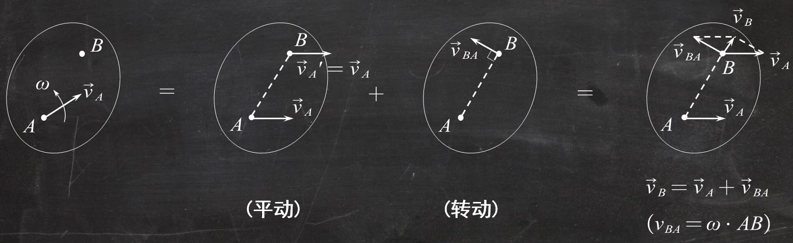

# 理论力学
## 第一章 静力学公理和物体的受力分析
### 各种约束

### 例题1 
机构如图所示，不计各杆自重，试画出AB杆、CD杆的受力图

注意到CD杆是二力杆

点C受到$F_C$的反作用力$F_C'$，A点受到固定铰链支座约束，其约束力为一对正交分力
AB杆在A,B,C三点受到三个力。由三力汇交原理三力交于一点

## 第二章 平面力系
### 平面力偶系

力偶就是等值、反向不共线的两个力

力偶矩$M=\pm Fd$（逆时针为正，顺时针为负）

#### 平面力偶矩的性质
1. 力偶在任意坐标轴上投影为0
2. 力偶没有合力，只能由力偶来平衡
3. 力偶对任意点取矩都等于力偶矩，不因矩心改变而改变
4. 只要保持力偶矩不变，力偶可以在其作用面内任意移转，且可以改变力偶中力的大小与力偶臂的长短，对刚体的作用效果不变。

#### 力偶矩的合成与平衡
合力偶矩 $M=\sum M_i$

### 力的平移定理
作用在刚体上一点的力$\mathbf{F}$可以平移到另一点，但必须同时附加一个力偶，这个附加力偶的矩等于原来的力对新作用点的矩。

### 平面任意力系

主矢$\mathbf{F_R'}=\sum\mathbf{F_i}$，与简化中心无关
主矩$\mathbf{M_O}=\sum\mathbf{M_O}(\mathbf{F_i})$，与简化中心有关
#### 向一点简化的结果

#### 平面任意力系的平衡

由此可知，平面任意力系的平衡方程最多求解出三个未知量。因此，选取研究对象时应选择**未知量小于等于三个**的。
### 例题2

如图所示，已知$F=20kN,M=8kN·m，a=0.8m，q=100kN/m$。求支座B、C的反力。

B处为固定铰链支座约束，C处为活动铰链支座约束

如图所示
$$\left\{\begin{array}{l}
\sum F_{x}=0 \quad\quad F_{Bx}=0\\
\sum F_{y}=0 \quad\quad qa+F-F_{By}-F_C=0\\
\sum M_{B}=0 \quad -F\cdot 3a + F_C\cdot2a+qa\cdot \frac{1}{2}a=0
\end{array}\right.\\\quad\\
\Rightarrow
\left\{\begin{array}{l}
F_{Bx}=0 \\
F_{By}=95kN \\
F_C=5kN 
\end{array}\right.$$
### 例题3

连续梁由AB和BC两部分组成，其所受载荷如图所示，求固定端A和铰链支座C的约束反力。

A处为固定端约束，受到一对正交约束力和一对力偶的作用，即三个未知量；C处为活动铰链支座约束，受到一个正交约束力作用，共有四个未知量，以整体为研究对象不可取。

以BC梁为研究对象时B处为中间铰链约束，受到一对正交约束力作用，C处为活动铰链支座约束，共三个未知量
 

$$\left\{\begin{array}{l}
\sum F_{x}=0 \quad\quad F_{Bx}-P\cdot\cos60^\circ-F_C\cdot\sin30^\circ=0\\
\sum F_{y}=0 \quad\quad F_{By}-P\cdot\sin60^\circ+F_C\cdot\cos30^\circ=0\\
\sum M_{B}=0 \quad -M-P\cdot\sin60^\circ\cdot a+F_C\cdot\cos30^\circ\cdot2a=0
\end{array}\right.$$

$$F_{Bx}=\frac{3}{4}P+\frac{M}{2\sqrt{3}\alpha}\quad F_{By}=\frac{\sqrt{3}}{4}P-\frac{M}{2\alpha}\quad F_C=\frac{M}{\sqrt{3}\alpha}+\frac{1}{2}P$$ 

三角形分布载荷的大小为$\dfrac{1}{2}\cdot2qa$，作用点等效与距离$A$点$\dfrac{1}{3}\cdot 2a$处
$$\left\{\begin{array}{l}
\sum F_{x}=0 \quad\quad F_{Ax}-F_{Bx}^{\prime}=0\\
\sum F_{y}=0 \quad\quad F_{Ay}-q\cdot2a\cdot\frac{1}{2}-F_{By}^{\prime}=0\\
\sum M_{A}=0 \quad -M_A-2qa\cdot\frac{1}{2}\cdot\frac{1}{3}\cdot2a-F_{By}^{\prime}\cdot2a=0
\end{array}\right.$$
$$F_{Ax}=\frac{3}{4}P+\frac{M}{2\sqrt{3}a}\quad F_{Ay}=\frac{\sqrt{3}}{4}P-\frac{M}{2a}+qa\quad M_A=M-\frac{\sqrt{3}}{2}Pa-\frac{2}{3}qa^2$$
### 例题4

图示结构中物体$Q$重$1.2kN,AD=DB=2m，CD=DE=1.5m$，不计杆与滑轮自重，求$A,B$处的支座反力及杆$BC$的内力。

对整体而言，A处为固定铰链支座约束，有两个未知力，B点为活动铰链支座约束，有一个未知力，其余外力已知

画出约束力如右图
 

$$F_T=P=1.2kN$$
可以列出平面任意力系的平衡方程
$$\left\{\begin{array}{l}
\sum F_{x}=0 \quad\quad F_{Ax}-F_T=0\\
\sum F_{y}=0 \quad\quad F_{Ay}+F_B-P=0\\
\sum M_{A}=0 \quad F_B\cdot4-P(2+r)-F_T(1.5-r)=0
\end{array}\right.$$
$$F_{Ax}=F_T=1.2kN\quad F_{B}=1.05kN\quad F_{Ay}=0.15kN$$
下面求$BC$杆的内力，显然$BC$杆是二力杆。

将CDE杆以及重物分离出来，对$D$点取矩（因为$D$点的两个力不需要求解）
$$\sum M_D=0\\-F_{BC}\cdot\sin\theta\times1.5-p\cdot r-F_T(1.5-r)=0\\F_{BC}=-\frac{P}{\sin\theta}=-\frac{1.2kN}{\frac{2}{\sqrt{2^{2}+1.5^{2}}}}=-1.5kN$$
### 桁架内力计算
#### 节点法
节点法适用于求桁架中所有杆件内力情况

平面汇交力系只有两个独立的平衡方程，一般选取不超过两个未知力的节点作为研究对象
##### 解题步骤
1. 取整体为研究对象求约束反力
2. 选取节点，列平衡方程求内力
#### 例题5

如图平面桁架,求杆AF、AC的内力。已知铅垂力$F_C=4kN$,水平力$F_E=2kN$。

先取整体为研究对象

$$\left\{\begin{array}{l}
\sum F_{x}=0 \quad\quad F_{Ax}-F_E=0\\
\sum F_{y}=0 \quad\quad F_{Ay}+F_B-F_C=0\\
\sum M_{A}=0 \quad F_B\cdot3a-F_E\cdot a-F_C\cdot a=0
\end{array}\right.\\\quad\\
F_{Ax}=-2kN\quad F_{Ay}=2kN\quad F_B=2kN$$

取点A
$$\begin{cases}\sum F_x=0\\\sum F_y=0&\end{cases}\quad\Rightarrow\quad\begin{cases}F_{Ax}+F_{AC}+F_{AF}\cos45^\circ=0\\F_{Ay}+F_{AF}\sin45^\circ=0&\end{cases}$$
解得
$$\begin{cases}F_{AF}=-2\sqrt{2}kN\\F_{AC}=4kN&\end{cases}$$
#### 截面法
适用于求桁架中几根杆内力情况

平面任意力系只有3个独立平衡方程，一般截断的杆件不超过三根
### 静定与超静定问题
未知量数目等于独立方程数目，是静定问题:
未知量数目超过独立方程数目，是静不定(超静定)问题
#### 例题6

图示平面桁架,各杆长度均为1m,在节点E、G、F上分别作用载荷$F_E=10kN,F_G=7kN,F_F=5kN$，计算1,2,3杆的内力

先以桁架整体为研究对象

$$\begin{cases}\sum F_x=0\quad\quad F_{Ax}+F_F=0\\
\sum F_y=0\quad \quad F_{Ay}+F_B-F_E-F_G=0\\
\sum M_B(F)=0\quad F_E\cdot 2+F_G\cdot 1-F_{Ay}\cdot 3 -F_F\sin 60^\circ\cdot 1=0&\end{cases}$$
解得 
$$\left.\left\{\begin{array}{c}F_{Ax}=-5kN\\F_{Ay}=7.557kN\\F_{B}=9.44kN\end{array}\right.\right.$$

取截面左半部分为研究对象
$$\begin{cases}\sum M_E\left(F\right)=0\\\sum F_y=0\\\sum M_D\left(F\right)=0&\end{cases}  $$
$$\begin{cases}-F_1\cdot\sin60^\circ\cdot1-F_{Ay}\cdot1=0\\F_{Ay}+F_2\cdot\sin60^\circ-F_E=0\\F_E\cdot\frac{1}{2}+F_3\cdot\sin60^\circ\cdot1-F_{Ay}\cdot1.5+F_{Ax}\cdot\sin60^\circ\cdot1=0&\end{cases}$$
解得$$F_{1}=-8.726kN\quad F_{2}=2.821kN\quad F_{3}=12.32kN$$

## 第三章 空间力系
### 力对点的矩

$$\vec{M}_o(\vec{F})=\vec{r}\times\vec{F}$$

### 力对轴的矩
 
 

$$M_x(\vec{F})=yF_z-zF_y\quad M_y(\vec{F})=zF_x-xF_z\quad M_z(\vec{F})=xF_y-yF_x$$
$x,y,z$表示力的作用点的坐标
### 重心（形心）
#### 半圆形重心

## 第四章 摩擦
### 滚动摩擦
还没写
## 第六章

## 第七章 点的合成运动
### 相对运动 牵连运动 绝对运动
习惯把固定在地球上的参考系称为**定参考系**，简称**定系**，以$Oxyz$坐标表示
固定在其他相对于地球运动的参考系上的坐标系称为**动坐标系**，简称**动系**，以$Ox'y'z'$坐标系表示
动点相对于定系的运动称为**绝对运动**（点的运动）
动点相对于动系的运动称为**相对运动**（点的运动）
动系相对于定系的运动称为**牵连运动**（刚体的运动）
### 点的绝对运动和相对运动之间的关系

$Oxy$是定参考系，$O'x'y'$是动参考系，$M$是动点，如图所示。动点$M$的绝对运动方程为
$$x=x(t),y=y(t)$$
动点$M$的相对运动方程为
$$x'=x'(t),y'=y'(t)$$
动参考系相对于定参考系的运动可以由如下三个方程完全描述：
$$x_{O'}=x_{O'}(t),y_{O'}=y_{O'}(t),\varphi=\varphi(t)$$
这三个方程称为牵连运动方程，其中$\varphi$角是从$x$轴到$x'$轴的转角，逆时针为正。动参考系与定参考系的坐标变换关系为
$$\begin{cases}
    x=x_{O'}+x'\cos\varphi-y'\sin\varphi\\
    y=y_{O'}+x'\sin\varphi+y'\cos\varphi
\end{cases}$$
### 一般动点和动系的选取原则
1. 动点时两个刚体的接触点
2. 动点和动系不在同一刚体上（要有相对运动）
3. 相对运动和牵连运动轨迹容易看出（一般选带滑槽或相当于带滑槽的刚体选为动系）
### 点的速度合成定理
$$\mathbf{v}_a=\mathbf{v}_e+\mathbf{v}_r$$
动点在某瞬时的**绝对速度**等于它在该瞬时的**牵连速度**和**相对速度**的矢量和
- 共含大小和方向六个元素，一般来说已知四个可以求另外两个（使用角度）
- 共含大小和方向六个元素，一般来说已知四个可以求另外两个（使用角度）
### 点的加速度合成定理
$$\mathbf{a}_a=\mathbf{a}_r+\mathbf{a}_e+\mathbf{a}_C$$
动点在某瞬时的**绝对加速度**等于它在该瞬时的**牵连加速度**、**相对加速度**和**科氏加速度**的矢量和
$$\mathbf{a}_C=2\mathbf{\omega}\times\mathbf{v}_r$$
其中$\mathbf{\omega}$为动系绕定轴转动的角速度矢量（若动系做平动则为0）
### 例题7

图示机构中，已知$O_1O_2=O_1A=20cm$,$O_1O_2=O_1A=20cm$,$O_1A$杆以匀角速度$ω =3rad/s$绕$O_1$轴转动，求图示位置时套筒$A$相对于$O_2A$杆的速度、$O_2A$杆的角速度和$O_2A$杆的角加速度

先进行运动分析。显然会选择$A$点作为动点，由于$O_2A$杆有套筒，类似滑槽结构，因此选择$O_2A$杆作为动系。

绝对运动：以$O_1$点为圆心的圆周运动
相对运动：沿$O_2A$杆的直线运动
牵连运动：以$O_2$点为圆心的定轴转动
$$\vec{v_a}=\vec{v_e}+\vec{v_r}$$

$v_a=O_1A\cdot \omega_1=60cm/s$
$v_r=v_a\cdot\sin30^\circ=30cm/s$
$v_e=v_a\cdot\cos30^\circ=30\sqrt3cm/s$
$\omega_{O_2A}=\frac{v_e}{O_2A}=1.5rad/s$
$$\vec{a}_a^\tau+\vec{a}_a^n=\vec{a}_e^\tau+\vec{a}_e^n+\vec{a}_r+\vec{a}_c$$

$\vec{a}_a^n=O_1A\cdot \omega_1^2=180cm/s^2$
$\vec{a}_e^n=O_2A\cdot \omega_2^2=45\sqrt3cm/s^2$
$\vec{a}_c=2\omega_2\times\vec{v}_r=90cm/s^2$
将加速度沿$\vec{a}_c$方向投影
$$a_a^n\cdot \sin 30^\circ = -a_e^{\tau}+a_c\Rightarrow a_e^\tau = 0$$
因此角加速度$$\alpha_2=0$$
### 特例（偏心轮）

## 第八章 刚体的平面运动
刚体平面运动 = 随基点的平动 + 绕基点的转动
### 基点法

### 速度投影法

$$\left(\vec{v}_{B}\right)_{AB}=\left(\vec{v}_{A}\right)_{AB}$$
即$$v_{B}\cos\alpha=v_{A}\cos\theta$$
### 例题8
 

图中$AB$长$l$，滑倒时$B$端靠铅垂墙壁，已知$A$点以速度$u$沿水平轴线运动。求图示位置杆端$B$点的速度及杆的角速度

#### 基点法
以$A$点为基点
$$\vec{v}_{B}=\vec{v}_{A}+\vec{v}_{B A}$$
||$\vec{v}_{B}$|$\vec{v}_{A}$|$\vec{v}_{B A}$|
|-|-|-|-|
|方向|√|√|√|
|大小|?|√|?|

$\displaystyle v_B=\frac{u}{\tan\varphi}\quad v_{BA}=\frac{u}{\sin\varphi}$
$$\omega_{BA}=\frac{v_{BA}}{l}=\frac{u}{l}\cdot\frac{1}{\sin\varphi}$$
#### 速度投影法
由速度投影定理
$$\nu_B\cdot\sin\varphi=\nu_A\cdot\cos\varphi$$

$\displaystyle v_B=\frac{u}{\tan\varphi}$
### 瞬心法
速度瞬心：只要$\omega\neq 0$，任一瞬时平面图形上都存在唯一一个速度等于0的点
 
 

右图其上任意一点$P$:$\quad v_P=CP\cdot\omega\quad\omega = \dfrac{v_A}{AC}$
#### 几种特殊的瞬心

### 例题9

如右图所示曲轴$OA$以角速度$\omega = 2rad/ s$绕轴$O$转动，并带动等边三角形板$ABC$作平面运动。板上点$B$与杆$O_1B$, 点$C$与套管$C$连接，而套管$C$可在绕$O_2$转动的杆$O_2D$上滑动，已知
$OA=AB=O_{2}C=1m$,当$OA$水平$,AB$、$O_2D$铅直，$O_1B$与$BC$在同一直线上，求杆$O_2D$的角速度

以套筒$C$为动点，杆$O_2D$为动系
$$\vec{v_a}=\vec{v_e}+\vec{v_r}$$
||$\vec{v_a}$|$\vec{v_e}$|$\vec{v_r}$|
|-|-|-|-|
|方向|?|√|√|
|大小|?|?|?|

由此，我们必须求出$\vec{v_a}$的速度和方向
$v_A=OA\cdot\omega=2m/s$
由图可知$P$点为刚体的速度瞬心
$\omega_{ABC}=\dfrac{v_A}{PA}=\dfrac{2}{\sqrt3}rad/s$
$v_C=PC\cdot\omega_{ABC}=\dfrac{2}{\sqrt3}m/s$
从而$\vec{v_a}$的速度和方向都已知，就可以求出$\vec{v_e}$和$\vec{v_r}$的大小

$\nu_e=\nu_a\cdot\cos60°=\dfrac{\sqrt{3}}{3}m/s\quad\omega_{O_2D}=\dfrac{\nu_e}{O_2C}=\dfrac{\sqrt{3}}{3}rad/s$
### 加速度分析（主要使用基点法）
即$$\vec{a}_B=\vec{a}_A+\vec{a}_{BA}=\vec{a}_A+\vec{a}^\tau_{BA}+\vec{a}^n_{BA}$$
其中$$\vec{a}^\tau_{BA}=AB\cdot\alpha\quad\vec{a}^n_{BA}=AB\cdot\omega^2$$
### 例题10

如图所示,在椭圆规机构中，曲柄$OD$以匀角速度$\omega$绕$O$轴转动,$OD=AD=BD=L$,求当$\varphi=60°$时，尺$AB$的角加速度和点$A$的加速度。

以$D$为基点，求$A$点的加速度
$$\vec{a}_A=\vec{a}_D+\vec{a}^\tau_{AD}+\vec{a}^n_{AD}$$
||$\vec{a}_A$|$\vec{a}_D$|$\vec{a}^\tau_{AD}$|$\vec{a}^n_{AD}$|
|-|-|-|-|-|
|方向|√|√|√|√|
|大小|?|√|?|?|

由于$\vec{a}_A$和$\vec{a}^\tau_{AD}$都是我们要求的量，我们必须求出$\vec{a}^n_{AD}$
$$a^n_{AD}=\omega_{AB}^2\cdot AD$$
找到杆$AB$的瞬心$C$，可以求得$\displaystyle\omega_{AB}=\frac{v_D}{DC}=\frac{\omega l}{l}=\omega$
$$a^n_{AD}=\omega^2\cdot AD=\omega^2\cdot l$$

回到加速度分析

$$\begin{cases}
a_A \cdot \cos 60^\circ = a_D \cos 60^\circ - a_{AD}^n \\
a_A \cdot \sin 60^\circ = -a_D \cdot \sin 60^\circ + a_{AD}^\tau
\end{cases}$$

$$\begin{cases}
a_A = -l\omega^2 \\
a_{AD}^\tau = 0
\end{cases}$$

$\alpha_{AB} = \dfrac{a_{AD}^\tau}{AD}=0$
### 例题11

曲柄$OA$以恒定的角速度$ω=2rad/s$绕轴$O$转动，并借助连杆$AB$驱动半径为$r$的轮子在半径为$R$的圆弧槽中作无滑动的滚动，设$OA=AB=R=2r=1m$，求图示瞬时点$B$和$C$的速度与加速度。

易知图示位置$A$点速度水平向左，大小为$v_A=OA\cdot\omega=R\cdot\omega=2m/s$
而$B$点与瞬心的连线竖直，也就是说，$B$点的速度方向水平
因此此时$v_{BA}=0$，$AB$杆此瞬时平动，也即$\omega_{BA}=0$
$v_A=v_B=2m/s$

$D$点为速度瞬心，$\omega_B=\dfrac{v_B}{r}=4rad/s$
$$v_{C}=\omega_{B}\cdot\sqrt{2}r=2\sqrt{2}m/s$$
此处$B$点绕$O_1$点做圆周运动，因此其加速度也可分为切向和法向进行分析
$$\vec{a}_{B}^{\tau}+\vec{a}_{B}^{n}=\vec{a}_{A}+\vec{a}_{BA}^{\tau}+\vec{a}_{BA}^{n}$$

$$a_A=\omega^2\cdot OA=4m/s^2$$
$$a_B^n=\dfrac{v_B^2}{R-r}=8m/s^2$$
$$a_{BA}^n=\omega_{AB}^2\cdot AB = 0$$
||$\vec{a}_{B}^{\tau}$|$\vec{a}_{B}^n$|$\vec{a}_{A}$|$\vec{a}_{BA}^{\tau}$|$\vec{a}_{BA}^{n}$|
|-|-|-|-|-|-|
|方向|√|√|√|√|√|
|大小|?|√|√|?|√|

由图，$\vec{a}_{B}^{\tau}=\vec{a}_{BA}^{n}=0$
可知$a_B=a_B^n=8m/s^2$
以$B$点为基点，求$C$点的加速度
$$\vec{a}_C=\vec{a}_B+\vec{a}_{CB}^t+\vec{a}_{CB}^n$$
由$a_B^\tau=0$，可知$\alpha_B=0$，刚体旋转的角加速度为0，故$a_{CB}^\tau=0$
$a_{CB}^n=\omega_{B}^2\cdot CB=8m/s^2$

||$\vec{a}_C$|$\vec{a}_B$|$\vec{a}_{CB}^t$|$\vec{a}_{CB}^n$|
|-|-|-|-|-|
|方向|?|√|√|√|
|大小|?|√|√|√|

$a_{C}=\sqrt{a_{B}^{2}+\left(a_{CB}^{n}\right)^{2}}=8\sqrt{2}m/s$
## 第十章 动量定理
质心的位置
$$x_{c}=\frac{\sum m_{i} x_{i}}{\sum m_{i}}=\frac{\sum m_{i} x_{i}}{m} \quad y_{c}=\frac{\sum m_{i} y_{i}}{\sum m_{i}}=\frac{\sum m_{i} y_{i}}{m}$$
质点系和刚体的动量$\vec{p}=m\vec{v}_c$，此处$\vec{v}_c$为质点系或刚体质心的速度
### 例题12

杆重$G$，长为$L$，已知图示瞬间的$ω、α$，求该瞬时$O$点的约束反力。
$$a_{C}{}^{t}=\frac{L}{2}\cdot\alpha\quad a_{C}{}^{n}=\frac{L}{2}\cdot\omega^{2}$$
由质心运动定理，$$\begin{cases}ma_{Cx}=\sum F_x^{(e)}\quad F_{Ox}=-ma_C^n\\ma_{Cy}=\sum F_y^{(e)}\quad G-F_{Oy}=m\cdot a_C^t&\end{cases}$$
解得
$$\begin{cases}F_{Ox}=-\frac{GL\omega^{2}}{2g}\\F_{Oy}=G-\frac{GL}{2g}\alpha&\end{cases}$$
注：求约束反力可以考虑使用质心运动定理
## 第十一章 动量矩定理
### 常见均质物体的转动惯量

### 回转半径
回转半径$\rho_z$满足
$$J_z=\rho_z^2\cdot m$$
### 平行轴定理

$$J_z=J_{zc}+md^2$$
### 质点的动量矩
$$\vec{M}_O=\vec{r}\times m\vec{v}$$
### 刚体的动量矩
#### 平动刚体对O点的动量矩
$$\vec{L}_{O}=\vec{r}_{C}\times m\vec{v}_{C}$$
#### 定轴转动转动刚体
$$L_z=J_z\cdot\omega$$
#### 一般情况
$$\vec{L}_O=\vec{r}_C\times m\vec{v}_C+J_C\cdot\omega$$
### 动量矩定理
$$\frac{d}{dt}\vec{M}_O(m\vec{v})=\vec{M}_O(\vec{F})$$
### 例题13

匀质圆轮半径为$R$，质量为$m$，圆轮在重物$P$带动下绕固定轴$O$转动。已知重物重量为$W$，求重物下落的加速度

取整体为对象，设圆轮的角速度、角加速度分别为$\omega$、$\alpha$，重物的速度、加速度分别为$v$、$a_P$，则
圆轮对轴$O$：$L_{O1}=J_O\omega=\frac{1}{2}mR^2\omega$
重物对轴$O$：$L_{O2}=mvR=\frac{W}{g}vR$
整体对轴$O$：$L_{O3}=\frac{W}{g}vR+\frac{1}{2}mR^2\omega$
由动量矩定理，$$\frac{dL_{O3}}{dt}=W\cdot R$$
也即$$\frac{1}{2} m R^2 \cdot \alpha + \frac{W}{g} a_P \cdot R = W R$$
解得$\displaystyle a_P=\frac{W}{\frac{m}{2}+\frac{W}{g}}$
