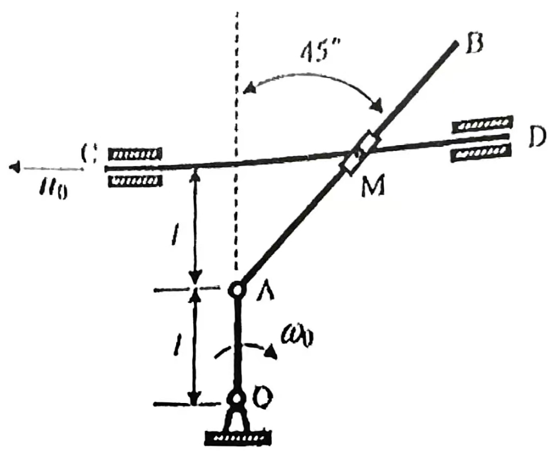
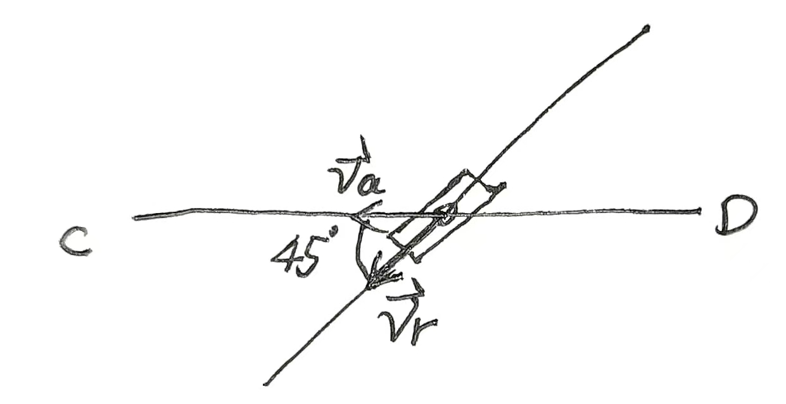
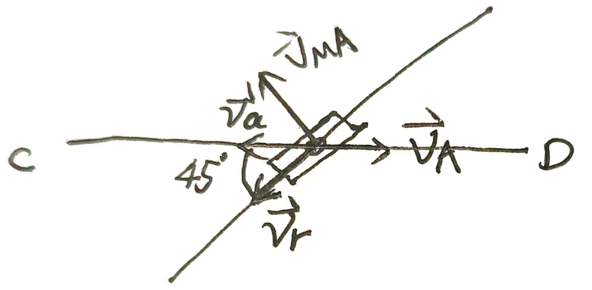
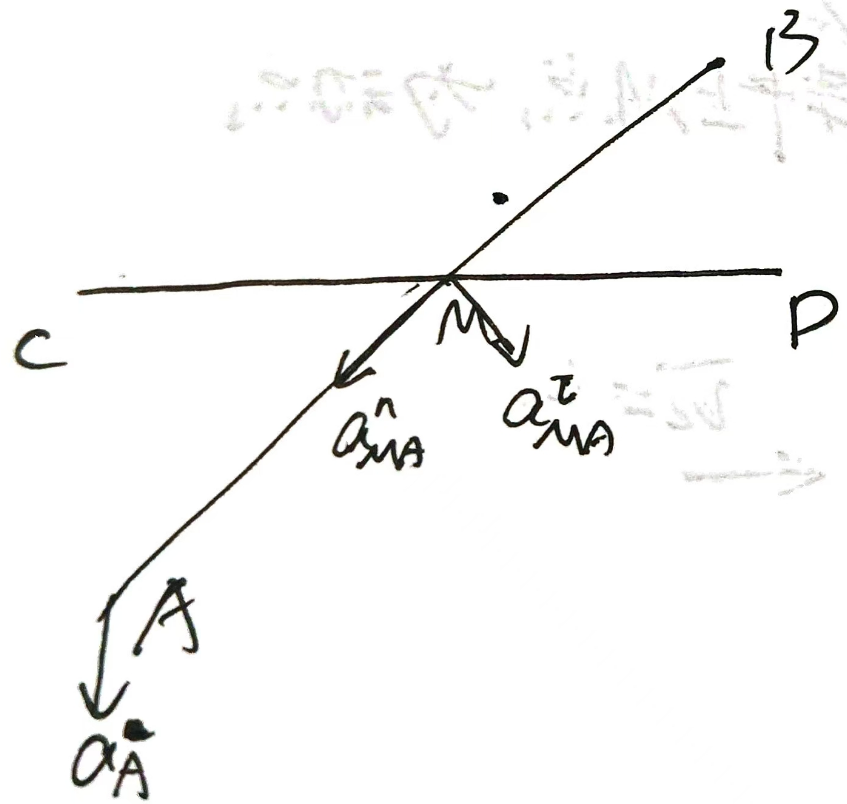
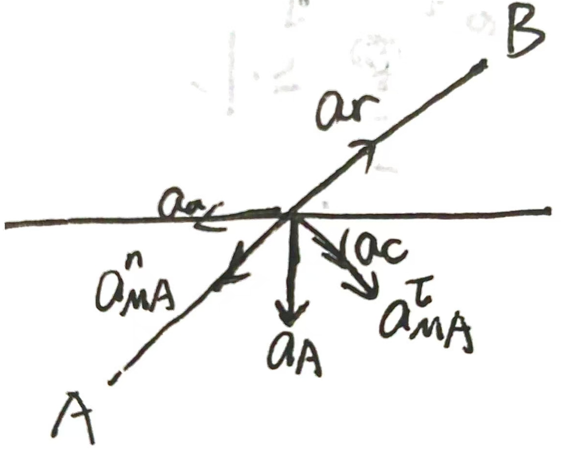

以杆$AB$为动系，$AB$上的套筒$M$为动点进行运动分析

||$\vec{v}_a$|$\vec{v}_e$|$\vec{v}_r$|
|-|-|-|-|
|方向|√|?|√|
|大小|√|?|?|

$$\vec{v}_a = \vec{v}_e+\vec{v}_r\quad \vec{v}_a=u_0$$
三个未知数无法求解，必须先求出$\vec{v}_e$，也即$AB$杆上点$M'$的速度
由基点法，$\vec{v}_{M'}=\vec{v}_A+\vec{v}_{MA}$，而$\vec{v}_e=\vec{v}_{M'}$
$$v_A=\omega_0 l\quad v_{MA}=\omega_{AB}\cdot\sqrt2 l$$
且二者方向全部已知，唯一的未知量为$v_{MA}$大小，可知此时$v_e$只需求解一个未知量，可以代入$\vec{v}_a=\vec{v}_e+\vec{v}_r$

将所有速度分解到垂直$AB$和$AB$两个方向上
$$\begin{cases}
    v_a\cos 45^\circ=v_{MA} -v_A\sin 45^\circ
    \\v_a\sin45^\circ=v_r-v_A\cos 45^\circ
\end{cases}$$
解得
$$\boxed{\omega_{AB}=\frac{1}{2}\omega_0+\frac{u_0}{2l}}\quad v_r = \frac{\sqrt2}{2}(\omega_0l+u_0)$$
**方向为逆时针**
接下来考虑加速度，$a_a=a_e+a_r+a_C$
||$a_a$|$a_e$|$a_r$|$a_C$|
|-|-|-|-|-|
|方向|√|?|√|√|
|大小|√|?|?|√|

同样的，我们先考虑$a_e$，这里的牵连运动不是简单的圆周运动。因此需要用$\vec{a}_e=\vec{a}_A+\vec{a}_{MA}$求解

其中，
$$a_A=\omega_0^2l\quad a_{MA}^n=\omega_{AB}^2\cdot\sqrt2 l \quad a_{MA}^\tau=\alpha_{AB}\cdot\sqrt2 l$$
画出其余加速度

显然，$$a_a=0\quad \quad a_C=2\omega_0\times\mathbf{v_r}=\frac{\sqrt{2}}{2}\frac{\omega_0^2l^2-u_0^2}{l}$$
将所有加速度分解到垂直$AB$和$AB$两个方向上
$$\begin{cases}
    0=a_{MA}^n+a_A\sin 45^\circ-a_r
    \\0=-a_A\cos 45^\circ-a_C-a_{MA}^{\tau}
\end{cases}$$
解得
$$\boxed{\alpha_{AB}=\omega_0^2+\frac{u_0^2}{2l^2}+\frac{w_0u_0}{l}}$$
方向为逆时针