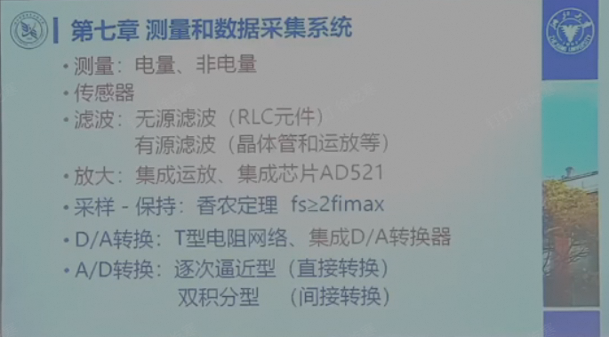

## 大题
2、4、5、8章重点复习
## 其他
### 第一章 电路与电路元件
1. 功率的判断：当电压与电流参考方向关联时，若根据$p=ui$算出的功率为正，则表示该元件吸收（输入）功率（也即消耗或吸收电能）；若为负值则表示输出功率（即送出电能）
2. 电阻电容电感的伏安特性（就是书本上的特性方程），耗能元件和储能元件。**1.2.4不用看**电阻是即时元件，电容电感是记忆元件（2022讲了，2023没讲）
3. 实际电压源、理想电压源的意义；电压源和电流源的转化，实际电压源的端电流是由外部负载决定，实际电流源的端电压由外部负载决定。
4. 会分析给二极管的电路，判断导通性。**载流子不考**
5. 稳压二极管：最小稳定电流、最大稳定电流、什么时候流过稳压管的电流是最大的（看他回放，有例子）（2023）知道工作区在哪（二极管的反向击穿区）（2022）
6. 三极管：NPN和PNP管如何根据三个极的点位判断管子的工作状态（倒置肯定不会出现）两节正偏饱和，两节反偏截止，发射结正偏，集电结反偏放大。三极管输入、输出曲线描述的分别是哪两对量之间的关系。三极管输出特性曲线中截止放大和饱和区的位置。
7. 三极管是电流控制电流器件
8. 简化的小信号模型（画交流通路和微变等效电路）
9. 四种理想受控源
10. 绝缘栅场效晶体管：电压控制电流型器件（栅源电压控制漏极电流）
11. 不管是NMOS还是PMOS都有两种类型：增强型和耗尽型。增强型的参数：开启电压；耗尽型的参数：饱和漏极电流和夹断电压。会根据输出特性曲线取判断是增强型还是耗尽型；是NMOS还是PMOS(这里的微变等效电路、简化小信号模型、应用电路都不需要管)，（2023）N沟道还是P沟道。（2022）
### 第二章 电路分析基础
1. 基尔霍夫定理（直流电路分析）注意基尔霍夫定律的广义形式：画一个闭合面，所有经过该闭合面的电流代数和为0（2023，估计是考了）
2. 叠加定理和等效电源定理
3. 正弦交流电路（重点）代数法和向量法都要会。考虑相位差时注意频率相等，相量表示法忽略了频率（就是默认频率相等的意思）。
4. 有功功率是电阻消耗的功率
5. 谐振：串谐、并谐，谐振电路呈什么性，失谐成什么性，串谐阻抗小电流大，并谐阻抗大电流小
6. 三相交流电路：相电压和线电压的概念和之间的关系，相电流（流过负载的电流）和线电流的关系，尤其是三角形和星型连接的时候。**只要求会对称的**（plp也说了）。注意负载的相电压和电源的相电压。三相电路的功率（2022说不考，2023说考）。阻抗角：负载两端电压和负载两端电流的相位差。如何求有功无功视在功率。（2023）功率因数的提高，**非正弦交流电路不考**(plp)
7. 为什么并联来提高功率因数：串联会改变电路负载的性质，负载两端的一些参数，所以我们一般采用并联电路的，对负载侧来说，没有发生变化。然后接并联提高功率因数的原理（还没学）
8. 2.5节扫一眼即可
9. 电路瞬态分析：必考内容。首先要会求解三要素。知道时间常数的物理意义。（求$0^+$）
### 第三章 分立元件基本电路
1. 一个放大电路能不能放大一个信号，从直流电路和交流电路都去看看，直流电路能不能提供合适的静态工作点，有没有合适的直流通路，交流通路有没有问题，信号有没有被短接。静态分析（计算静态工作点）。动态分析。给一个交流通路，用三极管的小信号模型带进去，画出其微变等效电路。求三个重要指标：放大倍数、输入电阻、输出电阻。不会很复杂。把例题搞清楚。工作点过高/过低对应饱和失真、截止失真。如果要提高静态工作点，要降低静态工作点怎么办？
2. （2022）直接写出各种电路的输入电阻，放大倍数，输出电阻
3. 三个组态的特点：共集电极、共发射极、共基极。如果哪个极是交流接地的那就一定是共哪个极。
4. 共集电极放大电路又叫射极输出器。它的放大倍数、输入电阻、输出电阻的特点。通常用在多级放大电路的输入级和输出级。**其计算不做要求**
5. 3.1.5频率特性不用看。共集电极电路输出电阻公式，输入电阻公式，可以不记。**例题的两级耦合和多级耦合可以不看（plp说肯定不会考）。**
6. **基极放大电路不做要求，MOS管放大电路不做要求**
7. 3.3不看
8. 基本门电路稍微看看，懂原理
### 第四章 数字集成电路
1. 逻辑代数化简，大概率1分
2. 分析和设计一般的组合逻辑电路，时序逻辑电路会分析就够了
3. 4.3的重点在4.3.1的表，即所有的门。异或门不要搞错。
4. 三态门的概念（高电平，低电平，高阻，高阻即悬空），符号和意义。低电平使能和高电平使能。三代门不只有与非门，任何门都有三态门。（两年都说了，**plp也说了**）其他的4.3.2不要看
5. 编码器和译码器的概念，特别是有几个输入端几个输出端。低电平译码和高电平
6. 数字显示就一句话：有共阴极接法和共阳极接法。那么相应的七段显示译码器应该是配低电平译码还是高电平译码。共阳配低电平译码，共阴配高电平译码。
7. RS触发器的不定状态，**T触发器不考（plp）**，注意两种D触发器。JK触发器一定有大题。悬空等于1。好好看例题4.6。有效状态和无效状态，具不具有自启动判断。
8. **集成计数器不做要求（plp）**
9. 移位寄存器的概念（左移右移）。163、193等具体芯片不用看。**4.7，4.8，4.9不考**（plp）
10. 半加器全加器等   
### 第五章 集成运算放大器
1. 基本组成：输入极做什么用的，输出极做什么用的，中间级做什么用的，不是去看具体的电路，就看这些概念做什么用的
2.  差分放大电路：什么是差模信号，什么是共模信号。用作输入级，最主要的作用是防止零点漂移。核心用处不是放大信号而是减小零点漂移。这个电路对差模信号正常放大，对共模信号强烈抑制。零点漂移信号就是共模信号。（2023）共模抑制比看看，它越大抗干扰能力越强，也就是抑制共模信号能力越强（2022）输出级采用互补对称，为了减少静态功耗
3. 中间级就是放大。
4. 输出级互补对称电路，实现的是功率放大。带负载能力强。它不是放大信号幅度，也不是为了减小零点漂移。中间级的目的就是为了有一定的驱动能力，或者说有一定的功率放大。
5. 5.2 集成运放的理想特性。
6. 5.3 放大电路的负反馈。主要就是结论性的东西。特别强调5.3.3负反馈对放大电路影响的第四点:对输入电阻和对输出电阻的影响。什么反馈增加输入电阻，什么反馈减少输出电阻。什么反馈增加输出电阻，什么反馈减少输出电阻。输出电阻的变化实际上就应就是意味着对输出电压或者说输出电流稳定性的影响。特别是第四点好好看看。（2023）电压负反馈具有稳定电压的作用，减小输出电阻，电流负反馈具有稳定电流
7. 要知道四种负反馈的概念。
8. 5.4 肯定有运放的大题。最好记一记基本电路。滞回比较器**这次**不要考（两次都说了）。看开环工作的比较器。
### 第六章 波形产生和变换
1. 自激振荡的基本原理。正反馈。首先平衡条件包括相位平衡、幅值平衡。其次，起振条件也要知道。
2. 正弦波振荡电路（正反馈放大电路？）里面必须包含有哪四个环节
3. 产生低频才会选用RC正弦波振荡电路。 6.1.2电路图多看几眼，公式6.1.5要记牢。（输出正弦波频率）稳幅的时候，$R_f=2R_1$稳定，$R_f>2R_1$起振
4. LC振荡电路选频环节为LC电路，适合于产生高频正弦波震荡。具体电路内容不要看。
5. 运放多谐振荡器6.2.1，6.2.2都不要看，（两次都说了）从6.2.3 555 开始看。555三个电路一定要掌握，包括其波形，包括它的整个电路的形式要会分析，尤其是555的基本功能表要牢记。
6. 单稳态，施密特，多谐振荡器，也就是6.3都要搞的很清楚，哪个是无稳态触发器，哪个有几个输出几个稳态几个暂态
### 第七章 测量与数据采集系统

红色不考,但是滤波的概念要求掌握，这章分值应该很小。
### 第八章 功率电子电路
1. 低频功率放大电路会算最大输入输出功率，会算OCL、OTL对应最大输出功率、输出电压，甲类乙类特点
2. 8.1.3集成功率放大器不要看
3. 8.2开始到最后的可控整流电路都要搞的很清楚，书本，小测等都要看。整流滤波等的公式、波形什么都要弄得很清楚。开关型稳压电源不用看，不要求。
4. cw117，cw137可以不看。交流调压不做要求。就到可控整流。
### 第九章 变压器与电动机
1. 磁路里关于损耗的概念，比如铁损铜损。铁损耗包括什么。铁磁材料的三性：磁饱和性 高保磁性 磁滞性
2. 磁路的欧姆定律。
3. 变压器三变的公式和概念（变电压 变电流 变阻抗）变压器特性里损耗有哪些。变压器损耗和效率那一段话看看。9.2.4不要
4. 软磁材料和硬磁材料。磁滞回线面积大的是哪种。硬磁材料做磁铁。软磁材料制作铁芯
5. 异步电动机的绕组也就是连接要知道。旋转磁场它的同步转速的公式。磁极对数和磁极数的关系，磁极数除以2才是磁极对数。9.3.1的公式要知道。频率为50赫兹的时候，磁极对数分别为1234的时候，同步转速为多少？
6. 工作原理，转差公式很重要。同步转速和异步转速的概念。同步转速相对转子的转速就是转差。公式9.3.3转差率公式很重要。同步转速公式。要知道启动的时候转差率是多少。特性曲线。启动转差率、启动转矩，对应最大转矩时转差率叫什么；电源电压的改变对启动转矩、最大转矩、临界转差率、转矩的影响。还有两个公式，公式9.3.9的额定转矩和额定效率。（2022）三相异步电机的铭牌参数。电动机效率的计算。
7. 三相异步电动机的启动、调速、制动。第九章到三相异步电动机为止。
### 第十章 电气控制技术
5-6分
1. 常用低压电器的每个器件的作用。比如熔断器短路保护，热继电器过载保护，交流接触器限压保护。时间继电器好好看。手动的、自动的。给一个常用机电接触控制电路，分析回答出一些问题。（电工电子学实验）
2. 电子保护器之后不用看。正反转控制。
3. 可编程控制器：只要看工作原理。很有可能最多就是一道判断题。给你一个程序，给你比如说输入输出的接线图，给你一个程序，读懂PLC输出输入变化。会画输出波形图。
4. 安全用电：触电方式、保护接地和保护接零，不会有计算。
