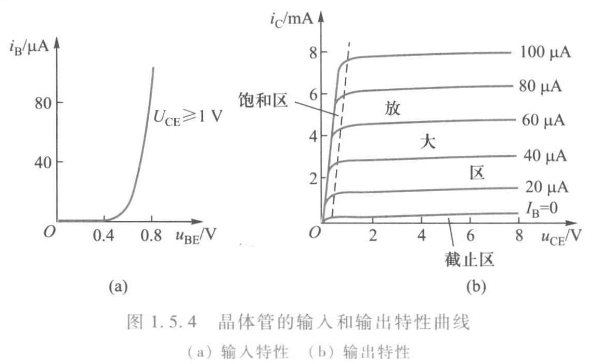
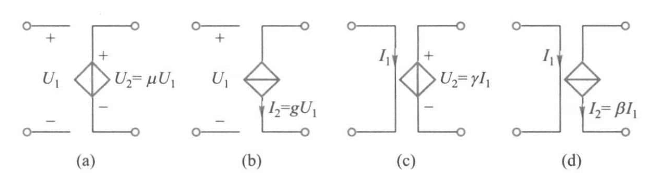
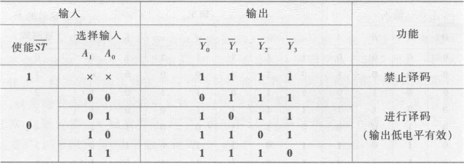
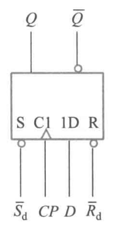
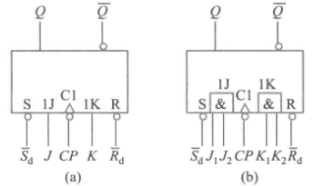
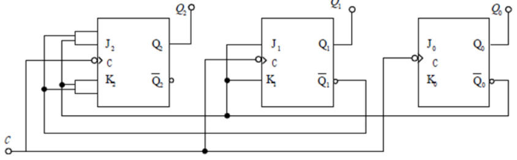

# 电工电子学期末补天 part1
## 第一章 电路与电路元件
### 电路功率
功率是电路分析中常用的另一个物理量。如果某个元件（或某段电路）的电流和电压为$i$和$u$，且电流和电压的参考方向相关联，则功率$p=ui$。
在电压和电流参考方向关联时，根据上式计算的功率为正值表示该元件（或该段电路）吸收功率（即消耗电能或吸收电能）；若为负值则表示输出功率（即送出电能）。
$1kWh=3.6\times 10^6J$
### 电阻，电感和电容
#### 电阻元件
电阻是一个**耗能元件**。
线性电阻元件服从欧姆定律
$$u=Ri$$
若电阻元件的电压与电流之间不是线性函数关系，则称为非线性电阻，如二极管。非线性电阻的伏安特性曲线可以是通过坐标原点或不通过坐标原点的曲线。
#### 电感元件

电感是一个**储能元件**
若电感线圈共有$N$匝，通过每匝线圈的磁通为$\varPhi$，如果电感元件中的磁通和电流之间是线性函数关系，则称为线性电感。若电感元件中的磁通与电流之间不是线性函数关系，则称为非线性电感。在线性电感的情况下，电感元件的特性方程为
$$N\varPhi=Li$$
$$u=\frac{dN\varPhi}{dt}=L\frac{di}{dt}$$
流过电感的电流$i$由0变到$I$时，其储存的能量为
$$W_L=\frac{1}{2}LI^2$$
电感元件在某一时刻的储能只取决于该时刻的电流值，而与电流的过去变化进程无关。
#### 电容元件

电感是一个**储能元件**
当电容元件两端加有电压$u$时，它的极板上就会储存电荷$q$。如果电荷$q$和电压$u$之间是线性函数关系，则称为线性电容。若电容元件的电荷与电压之间不是线性函数关系，则称为非线性电容。线性电容元件的特性方程
$$q=Cu$$
$$i=\frac{dq}{dt}=C\frac{du}{dt}$$
电容两端的电压$u$由0变到$U$时，其储存的能量为
$$W_C=\frac{1}{2}CU^2$$
电容元件在某一时刻的储能只取决于该时刻的电压值，而与电压的过去变化进程无关。
### 独立电源元件

电源内阻$R_0$越大，实际电源的特性越接近电流源。

电源内阻$R_0=\dfrac{U_S}{I_S}$，其中$U_S$为开路电压，$I_S$为短路电流。

电压源模型可以等效转换为电流源模型，条件是$R_0$不变，$I_S=\dfrac{U_S}{R_0}$。电流源模型也可以等效转换为电压源模型，条件是$R_0$不变，$U_S=R_0I_S$。
### 普通二极管
#### 伏安特性

二极管的静态电阻：$R_D=\dfrac{U_D}{I_D}$
动态电阻：$r_D=\dfrac{1}{\tan\beta}$
#### 分析二极管工作情况
考查分析二极管的工作情况
判断原则：共阳极时，阴极电位低的先导通；共阴极时，阳极电位高的先导通。

设二极管导通时的正向压降为$0.7V$，$R=3k\Omega,U_{S2}=12V,U_{S1}=3V$，试分析$D_1,D_2$的工作情况并求$I$值

观察两个二极管，$D_1,D_2$共阳极，$D_1$阴极电位$-3V$，$D_2$阴极电位$0V$,$D_1$先导通，可知$U_a=U_{D_1}+U_{S1}=-3V+0.7V=-2.3V$，可知$D_2$反向截止。
$$I=\frac{U_{S2}-U_a}{R}=4.77mA$$
### 稳压二极管

稳压二极管和普通二极管的主要区别在于，稳压二极管工作在 PN 结的**反向击穿状态**。
重要参数：
稳定电流$I_Z$：工作电压等于稳定电压时的反向电流；
最小稳定电流$I_{Zm}$：工作于稳定电压时所需的最小反向电流；
最大稳定电流$I_{ZM}$：允许通过的最大反向电流
### 三极管

**三极管是一种电流控制电流器件**

三极管有三极：发射极E(emitter)，基极B(base)，集电极C(collector)，每两级之间形成一个PN结。BC形成的PN结称为集电结，BE形成的结称为发射结。发射极在图中表现为一个箭头，即“发射”电流。P极为正极(positive)，N极为负极(negative)。正极电位高于负极我们称为正偏。
如右图，左边为NPN形三极管，右边为PNP形三极管。PNP的意思是C、B、E三极分别对应N、P、N。以NPN管为例，BE形成的PN结正偏时B极电位高于E，电流从B流向E，从而从图中可以判断此为NPN管。
|工作状态|发射结|集电结|
|-|-|-|
|放大|正偏|反偏|
|饱和|正偏|正偏|
|截止|反偏|反偏|

显然，对于三极管三极的电流，有
$$I_E=I_B+I_C$$

输入特性曲线是指以$u_{CE}$为参变量时，**$i_B$与$u_{BE}$之间的关系**。
输出特性曲线是指以$i_B$为参变量时，**$i_C$与$u_{CE}$之间的关系。**
**注意输出特性曲线的三个区域。**
正常工作时，有
$$I_C=\beta I_B$$
#### 小信号模型

电压控制电压源，电压控制电流源、电流控制电压源和电流控制电流源。

常温下小功率晶体管的动态电阻
$$r_{be}=r_b+(1+\beta)\frac{26}{I_E}=r_b+\frac{26}{I_B}$$
式中$r_b$为基区电阻，在$I_E<5mA$时$r_b$约为$200\Omega$
**注意：这个公式里的$I_E$单位是$mA$**
### 绝缘栅场效晶体管（MOS管）
MOS管是**电压控制电流元件**（栅源电压控制漏极电流）

MOS管按其导电类型，可分为 **N 沟道**和 **P 沟道**两种。同样有三个极，源极S(source)，栅极G(gate)，漏极D(drain)。各种MOS管的分辨如右图。
 
 

**增强型** MOS 管使漏极和源极之间开始有电流流过的栅源电压称为**开启电压$u_{GS(th)}$**。（左图）

**耗尽型**MOS管使栅极和源极之间电压为0的漏极电流称为**饱和漏极电流**$I_{DSS}$。$i_D\approx 0 $时的栅源电压称为**栅源夹断电压**$U_{GS(off)}$。
## 第二章 电路分析基础
### 基尔霍夫定律
#### 基尔霍夫电流定律(KCL)
在任何电路中，任何节点上的所有支路电流的代数和在任何时刻都等于零。
**基尔霍夫电流定律不仅适用于节点，也适用于任一闭合面。这种闭合面有时称为广义节点。**
#### 基尔霍夫电压定律(KVL)
在任何电路中，形成任何一个回路的所有支路沿同一循行方向电压的代数和在任何时刻都等于零。

对于m个节点，b个支路的电路，可列m-1个KCL，b-m+1个KVL方程
### 叠加定理
对于一个**线性**电路来说，由几个独立电源共同作用所产生的某一支路的电流或电压，等于各个独立电源单独作用时分别在该支路所产生的电流或电压的代数和。当其中某一个独立电源单独作用时，其余的独立电源应除去 **(电压源予以短路，电流源予以开路)**。（其实很简单，把电路图中电源的圈去掉就可以看出来是短路还是断路了）

在含有受控源的电路中，因受控源不是独立电源，不能单独作用。在某个独立电源单独作用而除去其余独立电源时，**受控源不能除去，仍要保留在电路中。**
### 等效电源定理
#### 戴维南定理
</img>

对外电路来说,一个线性有源二端网络可用一个电压源和一个电阻串联的电路来等效，该电压源的电压等于此有源二端网络的开路电压$U_{OC}$，串联电阻等于此有源二端网络除去独立电源 **(将电压源短路，电流源断路)** 后在其端口处的等效电阻$R_0$

当有源二端网络中**含有受控源**时，除去独立电源以后，受控源仍保留在网络中，这时应该用以下方法：
要求出有源二端网络的开路电压$U_{OC}$和短路电流$I_{SC}$，显然有
$$R_0=\frac{U_{OC}}{I_{SC}}$$
或者除去独立电源以后的端口处外加一个电压$U$，求其端口处的电流$I$，其端口处的等效电阻即为$$R_0=\frac{U}{I}$$
#### 诺顿定理
</img>

对外电路来说，一个线性有源二端网络可用一个电流源和一个电阻并联的电路来等效，该电流源的电流等于此有源二端网络的短路电流$I_{SC}$，并联电阻等于此有源二端网络除去独立电源后在其端口处的等效电阻$R_0$。
含有受控源的时候与戴维南定理同理。

### 正弦交流电路
### 正弦量的三要素
#### 周期、频率和角频率
#### 相位 、初相位和相位差
两个**同频率**正弦量的相位之差称为相位差。
#### 瞬时值、最大值和有效值
- 正弦交流电在某一瞬时的量值，称为瞬时值。
- 正弦交流电在变化过程中出现的最大瞬时值称为最大值。
- 有效值是从**电流热效应的角度**规定的。
#### 相量表示法
设有个正弦电压为$u=\sqrt 2\sin(\omega t+\varphi)$，那么相量法表示该电压即为$\dot{U}=U\angle\varphi$，这里$U$表示正弦电压的有效值。
**只有在各个正弦量均为同一频率时，各正弦量变换成相量进行运算才有意义。**
#### 电阻
$$\dot{U}=R\dot{I}$$
#### 电感
$$\dot{U}=jX_L\dot{I}$$
其中$X_L=\omega L=2\pi fL$，称为感抗。$X_L$是电压有效值与电流有效值之比，而不是它们的瞬时值之比。当电流的频率为零即直流时，感抗为零，故电感在直流稳态时相当于短路。
#### 电容
$$\dot{U}=-jX_C\dot{I}$$
其中$X_C=\frac{1}{\omega C}=\frac{1}{2\pi fC}$，称为容抗。对于一定的$C$来说，频率越高 ，则容抗越小，对正弦电流的“阻止”能力越弱，即意味着**高频电流容易通过电容**。直流时频率为零，容抗为无穷大，故电容在直流电路处于稳定状态时不能通过电流,相当于开路。
#### 阻抗
欧姆定律的相量形式
$$\dot{U}=Z\dot{I}$$
$Z$称为阻抗
$$Z=R+j(X_L-X_C)$$
阻抗的模$|Z|=\sqrt{R^2+(X_L-X_C)^2}$称为阻抗模
辐角$$\varphi=\arctan\left(\dfrac{X_L-X_C}{R}\right)$$称为阻抗角
#### 基尔霍夫的相量形式
KCL的相量形式为
$$\sum\dot{I}=0$$
在电路任一节点上的电流相量代数和为零。

KVL的相量形式为
$$\sum\dot{U}=0$$
沿任一回路，各支路电压相量的代数和为零。
#### 电路的电感性和电容性
若$X_L>X_C$，则该电路为**电容性**；若$X_L<X_C$，则该电路为**电感性**；若$X_L=X_C$，则该电路为**电阻性**，也称**谐振**。
#### 例题2.1
</img>

有时为了测量电感线圈的电感和电阻,将它和一个电阻$R$串联后接在工频交流电源上,如右图所示。现测得$U=220V,U_R=79V,U_L=193V,I=0.4A$。试求线圈的电阻$R_L$和电感$L$。
 
 
</img>

以电流为参考相量作出电路的相量图。
$$\cos\varphi =\frac{U^2+U_R^2-U_L^2}{2UU_R}=0.5,\varphi=60^\circ$$
由$U\sin\varphi=\omega LI$，可知
$$L=\frac{U\sin\varphi}{\omega I}=1.517H$$
又由$U_R+R_LI=U\cos\varphi$，可知
$$R_L=\frac{U\cos\varphi-U_R}{I}=77.5\Omega$$
#### 例题2.2

</img>

如右图所示电路中含有一个晶体管的小信号模型。已知$r_{be}=700\Omega,\beta=30,R_E=30\Omega,R_C=2.4k\Omega,C=5\mu F,\dot{U}_i=20\angle0^\circ mV$，求外加信号$u_i$的频率为$1000Hz$时的$\dot{U}_b$和$\dot{U}_o$

$f=1000Hz$时
$$X_C=\frac{1}{2\pi fC}=31.8\Omega$$

$$\dot{I_e}=\dot{I_b}+\beta\dot{I_b}=(1+\beta)\dot{I}_b$$

$$\dot{U}_i=(r_{be}-jX_C)\dot{I}_b+R_E\dot{I}_e =1630.3\angle-1.1^\circ \dot{I}_b$$

$$\dot{I}_b=12.27\times10^{-6}\angle1.1^\circ$$

$$\dot{U}_b=[r_{be}+(1+\beta)R_E]\dot{I}_b=0.02\angle1.1^\circ$$

$$\dot{U}_o=-R_C\dot{I}_c=-\beta R_C\dot{I}_b=0.88\angle-178.9^\circ$$
#### 瞬时功率
</img>

设如右图所示的无源二端网络的电流和电压分别为$i=\sqrt2I\sin\omega t和u=\sqrt 2U\sin(\omega t + \varphi)$
$$p=ui$$
#### 有功功率
电路中的电感和电容并不消耗功率,只是起能量吞吐作用。电路中的平均功率等于电阻所消耗的功率，因此平均功率又称为有功功率。
对于正弦电路，其平均功率
$$P=UI\cos\varphi$$
$\cos\varphi$称为功率因数(用$\lambda$表示)，$\varphi$称为功率因数角（其实就是电流和电压的相位差）
#### 无功功率
无功功率为正弦交流电路中储能元件与电源进行能量交换的瞬时功率最大值，单位为乏（var）
$$Q=UI\sin\varphi$$
感性无功功率与容性无功功率可以相互补偿，故有
$$Q=Q_L-Q_C$$
#### 视在功率
电路的电压有效值与电流有效值的乘积，称为电路的视在功率，用S表示：
$$S=UI$$
单位为伏·安$(V\cdot A)$。视在功率通常用来表示电源设备的容量。
由上可知，交流电路中的有功功率、无功功率和视在功率三者的关系为
$$P=S\cos\varphi,Q=S\sin\varphi,S=\sqrt{P^2+Q^2}$$
#### 功率因数的提高
由于**工业上大量的设备均为感性负载**，因此常采用**并联电容器**的方法来提高功率因数。**不是提高有功功率**。为什么不串联：串联会改变电路负载两端的一些参数，并联不会。
#### 例题2.3
</img>

一台单相异步电动机接到$50Hz,220V$的供电线路上，如右图所示。电动机吸收有功功率$700W$,功率因数$\lambda_1=\cos\varphi_1=0.7$（电感性）。今并联一电容器使电路的功率因数提高至$\lambda_2=\cos\varphi_2=0.9$,求所需电容量。

由$\cos\varphi_1=0.7,\cos\varphi_2=0.9$知$\tan\varphi_1=1.02,\tan\varphi_2=0.484$
未接入电容时$P,Q$之间的关系是  
$Q_L=UI\sin\varphi_1=UI\cos\varphi_1\tan\varphi_1=P\tan\varphi_1$
接入电容之后**有功功率不变**，无功功率$Q=Q_L-Q_C$
$Q=P\tan\varphi_2$
则$Q_C=Q_L-Q=P(\tan\varphi_1-\tan\varphi_2)=375.2var$
又$Q_C=\dfrac{U^2}{X_C}=U^2\cdot2\pi f C$
解得$C=24.7\mu F$
#### 串联谐振
</img>

在右图的$RLC$串联电路中，当$X_L=X_C$时$\dot{U}$和$\dot{I}$同相，整个电路呈**电阻性**，电路的这种工作状态称为串联谐振。

1. 串联谐振时**阻抗$Z=R+j(X_L-X_C)=R$最小**，在电**压一定时，电流有效值最大**，即
$$I_0=\frac{U}{R}$$
$I_0$称为串联谐振电流。
2. 设串联谐振时的频率为$f_0$，则$\frac{1}{2\pi f_0 C}=2\pi f_0 L$
$$f_0=\frac{1}{2\pi\sqrt{LC}}$$
3. 串联谐振时的感抗或容抗称为谐振电路的特性阻抗，用$\rho$表示，即
$$\rho=2\pi f_0 L = \sqrt{\frac{L}{C}}$$
4. 通常把串联谐振时$U_L$或$U_C$与$U$之比称为串联谐振电路的品质因数，也称为$Q$值，即
$$Q=\frac{U_L}{U}=\frac{2\pi f_0 L}{R}=\frac{1}{R}\sqrt{\frac{L}{C}}$$
</img>

5. 将电源电压有效值不变时电流随频率变化的曲线称为电流谐振曲线。
当$I=\dfrac{I_0}{\sqrt2}$时在谐振曲线上两个对应点的频率$f_L$和$f_H$之间的范围，称为电路的通频带$f_{BW}$，通频带与品质因数的关系为
$$f_{BW}=f_H-f_L=\frac{f_0}{Q}$$
因此通频带的大小与品质因数$Q$有关。$Q$越大，通频带宽度越小，谐振曲线越
尖锐，电路对频率的选择性越好。

 
 

#### 并联谐振
</img>

线圈和电容器并联的电路如右图，图中$L$是线圈的电感，$R$ 是线圈的电阻。当电路中的总电流$\dot{I}$和总电压$\dot{U}$同相时，称为并联谐振。
电路的总电流$\dot{I}$为
$$\begin{align*}
\dot{I} &= \dot{I_{RL}} + \dot{I}_C\\
&=\frac{\dot{U}}{R+j2\pi fL}+\frac{\dot{U}}{-j\frac{1}{2\pi fC}}\\
&=\left[\frac{R}{R^2+(2\pi fL)^2}-j\left(\frac{2\pi fL}{R^2+(2\pi fL)^2}-2\pi fC\right)\right]
\end{align*}$$
1. 设并联谐振时的频率为$f_0$，谐振时括号内的虚部为零，即
$$\frac{2\pi f_0L}{R^2+(2\pi f_0L)^2}-2\pi f_0C=0$$
得
$$f_0=\frac{1}{2\pi\sqrt{LC}}\sqrt{1-\frac{C}{L}R^2}\quad \text{(1)}$$
当$R\ll 2\pi f_0L$时可近似表达为 **（plp说就按这个）**
$$f_0\approx\frac{1}{2\pi\sqrt{LC}}$$
2. 并联谐振电路的**等效阻抗较大**且具有纯电阻性质，由式(1)可知其等效阻抗
$$Z_0=\frac{\dot{U}}{\dot{I}}=\frac{R^2+(2\pi f_0 L)^2}{R}\overset{(1)}{=}\frac{L}{RC}$$
1. 电路中的**总电流很小**。由于谐振时电感支路的电流分量$I_{RL}\sin\varphi$和电容支路的电流有效值$I_C$相等，相位相反，故并联谐振也称为电流谐振。

### 三相交流电路
由三个幅值相等、频率相同、相位互差$120^\circ$的单相交流电源所构成的电源,称为三相电源。由三相电源构成的电路，称为三相电路。
#### 三相交流电源
</img>

三个绕组的连接点称为**中性点或零点**。从中性点引出的导线，称为**中性线或零线**，有时中性线接地。中性线用字母$N$表示。三相绕组的三个始端引出的线称为**相线或端线**，又称为火线。引出中性线的电源称为三相四线制电源，其供电方式称为**三相四线制**。不引出中性线的供电方式，称为三相三线制。
三相电源相电压的相量表达式
$$
\begin{align*}
\left\{
\begin{array}{l}
\dot{U}_U = U_P \angle 0^\circ \\
\dot{U}_V = U_P \angle -120^\circ \\
\dot{U}_W = U_P \angle -240^\circ
\end{array}
\right.
\end{align*}$$
</img>

$U_P$为相电压有效值。
相线之间的电压$\dot{U}_{UV}、\dot{U}_{VW}、\dot{U}_{WU}$称为线电压，他们的有效值用$U_L$表示。
$$
\begin{align*}
\left\{
\begin{array}{l}
\dot{U}_{UV} = \sqrt3 U_P \angle 30^\circ \\
\dot{U}_{VW} = \sqrt3 U_P \angle -90^\circ \\
\dot{U}_{WU} = \sqrt3 U_P \angle -210^\circ
\end{array}
\right.
\end{align*}$$
**三个线电压有效值相等，都等于$\sqrt 3$倍的相电压，即$U_L=\sqrt3 U_P$，在相位上分别超前于相应相电压$30^\circ$**
#### 负载星形联结
</img>

当各相负载阻抗的模与阻抗角完全相等，即$Z_u=Z_v=Z_w$时，称为对称负载，此时中性线电流为0，三相绕组对称。

**在三相电路中,星型不对称负载必须要有中性线,且中性线上不允许装熔断器。**
 
 

#### 负载三角形联结
</img>

右图是负载作三角形联结时的三相电路,此时负载的相电压等于电源的线电压,即$U_p=U_L$。

图中$\dot{I}_{uv},\dot{I}_{vw},\dot{I}_{wu}$称为相电流，$\dot{I}_{U},\dot{I}_{V},\dot{I}_{W}$称为线电流。

如果负载是对称的，即$Z_{uv}=Z_{vw}=Z_{wu}=Z$，则各相电流的大小相等，相位差依次互为$120^\circ$。设$\dot{U}_{UV}=U_{UV}\angle 0^\circ$，并设负载是感性的，即$Z=|Z|\angle\varphi$，画出相量图如右图所示。
 
</img>

**在数值上，线电流等于相电流的$\sqrt 3$倍，即$I_L=\sqrt 3 I_P$.
相位上线电流落后对应相电流$30^\circ$**
#### 三相电路的功率
三相电路的有功功率等于各相有功功率之和。因为三相电路中测量线电压和线电流比较方便，所以三相功率通常不用相电压和相电流表示。通常所说的三相电压和三相电流都是指线电压和线电流值。

当三相负载对称时，各相有功功率相同，设每相相电压为$U_p$，相电流为$I_p$，线电压为$U_L$，线电流为$I_L$,相电压和相电流的相位差为$\varphi$。当负载为星形联结时，$U_p=\dfrac{U_L}{\sqrt3},I_p=I_L$，三角形联结时，$U_p=U_L,I_p=\dfrac{I_L}{\sqrt3}$，因而在两种情况下
$$P=3U_PI_P\cos\varphi=\sqrt3U_LI_L\cos\varphi$$
同样，对称三相负载的无功功率也等于各相无功功率之和,
$$Q=3U_PI_P\sin\varphi=\sqrt3U_LI_L\sin\varphi$$
对称三相负载的视在功率为
$$S=\sqrt{P^2+Q^2}=\sqrt3U_LI_L
$$
### 一阶电路的瞬态分析
#### 换路定律
1. 换路前后，电容上的电压不能突变，即
$$u_C(0^+)=u_C(0^-)$$
2. 换路前后，电感上的电流不能突变,即
$$i_L(0^+)=i_L(0^-)$$
#### RC电路的瞬态分析
$\tau=RC$称为RC电路的**时间常数**

一阶$RC$电路求电容电压的通式
$$u_C(t)=u_C(\infty)+[u_C(0^+)-u_C(\infty)]e^{-\frac{t}{\tau}}\quad(t>0,\tau=RC)$$
在一阶$RC$电路中，其他支路电压或电流的全解也是上式的形式，可改写为一般形式。若换路发生在$t=t_0$时刻
$$f(t)=f(\infty)+[f(t_0^+)-f(\infty)]e^{-\frac{t-t_0}{\tau}}\quad(t>t_0,\tau=RC)$$
- 储能元件无初始能量而仅由外部输入产生的电压或电流称为**零状态响应**。
- 储能元件释放能量而不是由外部输入产生的电压或电流称为**零输入响应**。
- 既有储能元件初始储能，又有外部输入时产生的电压或电流则称为**全响应**。

- $\tau\ll t_w$时输出电压$u_o$与输入电压$u_I$近似成**微分关系**，电路称为**微分电路**
- $\tau\gg t_w$时电路的作用是**隔断信号中的直流分量而传输其交流分量**。这种电路是$RC$耦合电路，常用于**交流放大电路**。
#### RL电路的瞬态分析
$\tau=\dfrac{L}{R}$称为RC电路的**时间常数**

一阶$RL$电路求电感电流表达式的通式
$$i_L(t)=i_L(\infty)+[i_L(0^+)-i_L(\infty)]e^{-\frac{t}{\tau}}\quad(t>0,\tau=\frac{L}{R})$$
在一阶$RC$电路中，其他支路电压或电流的全解。若换路发生在$t=t_0$时刻
$$f(t)=f(\infty)+[f(t_0^+)-f(\infty)]e^{-\frac{t-t_0}{\tau}}\quad(t>t_0,\tau=\frac{L}{R})$$
## 第三章 分立元件基本电路
判断一个放大电路能不能放大一个信号：看直流通路和交流通路
1. 直流通路能不能提供合适的静态工作点。
2. 交流通路信号有没有被短接。
### 共发射极放大电路
</img>

#### 电路组成
1. 三极管T，具有电流放大作用，是整个电路的核心
2. 直流电源$+U_{CC}$为晶体管提供放大所需的能量。
3. $R_B$是偏置电阻，调节$R_B$可以调节基极电流大小。
4. $R_C$是集电极负载电阻，作用是将集电极电流的变化转换成电压的变化送到输出端,以实现将晶体管的电流放大作用转换为电路的电压放大作用。没有$R_C$晶体管集电极的电位始终等于直流电源电压，就不会有信号输出。
5. 电容$C_1$称为耦合电容，电容足够大，对信号呈现的容抗很小，作用是将输入信号$u_i$的绝大部分传送到晶体管的基极，同时隔断信号源与晶体管基极之间的直流联系，因此也称为隔直电容。
6. 电容$C_2$将$u_{CE}$中的交流分量传递到输出端，同时隔断信号源与基极之间的直流联系。
7. **在电子电路中，常把输入与输出的公共端称为“地”端，并以“地”端作为零电位点。也即“哪个极交流接地就共哪个极。”**
#### 静态分析
</img>

当放大器没有输入信号（$u_i= 0$）时，电路中各处的电压 、电流都是直流恒定值，称为直流工作状态或静止状态，简称静态。
在静态时，由于电容$C_1,C_2$的隔直作用.因此只要考虑$C_1,C_2$之间的电路。为分析方便，把直流电源$U_{CC}$分别画于输入电路和输出电路中。如右图。

对输入电路，其电压方程为
$$U_{BE}=U_{CC}-I_BR_B$$

$I_B$和$U_{BE}$的关系是一条直线（称为偏置线）。另一方面，$I_B$和$U_{BE}$的关系又要符合晶体管的输入特性曲线。
 
</img>

故偏置线和输入特性曲线的交点$Q_B$就称为输入电路的静态工作点，如图(a)所示。

同理$I_C$和$U_{CE}$的关系是一条直线（称为负载线）
$$U_{CE}=U_{CC}-I_CR_C$$
负载线与基极电流$I_B$所对应的晶体管输出特性曲线交点$Q_C$就是输出电路的静态工作点 
#### 动态分析
为了便于区分，通常直流分量**用大写字母和大写下标表示**，交流分量**用小写字母和小写下标表示**，总的电压、电流瞬时值**用小写字母和大写下标表示**
 
 
 
 
 
 
 

##### 输入电路的图解
</img>

$$u_{BE}=U_{BE}+u_i\\i_B=I_B+i_b$$
即$u_{BE},i_B$可人为视为由直流分量$U_{BE},I_B$和交流分量$u_{be}$（即$u_i$）$,i_b$组成。其中，直流分量就是上述**静态工作点**，而交流分量则是输人信号$u_i$引起的。
 

* 由于输入特性曲线的非线性，故只有在**动态范围较小**时，才可认为$i_b$随$u_i$按正弦变化
 
 
 

##### 输出电路的图解
</img>

由于电容的隔直和交流耦合作用，$u_{CE}$中的直流分量$U_{CE}$被电容$C_2$隔断，而交流分量$u_{ce}$则可经$C_2$传送到输出端，故输出电压
$$u_o=u_{CE}-U_{CE}=u_{ce}$$
同理$$u_{CE}=U_{CE}+u_{ce}\\i_C=I_C+i_c$$
 
 
 

##### 电路的交流通路
</img>

如果忽略耦合电容$C_1,C2$对交流分量的容抗和直流电源$U_{CC}$的内阻，即认为$C_1,C_2$和**直流电源**对交流信号不产生压降，可视为**短路**，就可以画出只考虑交流量传递路径的交流通路
$$u_{ce}=-R_Ci_c$$
 
 

##### 失真
</img>

如果静态工作点**选得过高**，在$u_i$的正半周，晶体管很快进入饱和区，输出波形就产生失真，这种失真称为**饱和失真**。如图中的$i_C'$和$u_o'$波形
如果静态工作点**选得过低**，在$u_i$的负半周，晶体管进入截止区，这种失真称为**截止失真**。如图中的$i_C''$和$u_o''$波形

##### 总结
1. 没输入信号时，晶体管的电流、电压都是直流量。当放大电路输入信号电压后，$i_B,i_C$和$u_{CE}$都在原来静态值的基础上叠加了一个交流量。它们的方向是始终不变的
2. 输出电压$u_o$为与$u_i$同频率的正弦波，且输出电压$u_o$的幅度比输入电压$u_i$大得多
3. 电流$i_b,i_c$与输入电压$u_i$同相，而输出电压$u_o$与输入电压$u_i$反相，即共发射极放大电路具有倒相作用。
4. 静态工作点的选择必须合适。
#### 微变等效电路分析法
当放大电路的输入信号较小，且静态工作点选择合适时，晶体管的工作情况接近于线性状态，电路中各电流、电压的波形基本上是正弦波，因而可以把晶体管这个非线性元件组成的电路当作线性电路来处理，这就是微变等效电路分析法。

对左图所示的共发射极放大电路，它的交流通路如中间图所示，再把晶体管用小信号模型来代替，就可得到微变等效电路，如右图所示。
下面对电路的动态指标做定量分析。
##### 电压放大倍数$A_u$
放大电路输入正弦信号时，可表示为
$$A_u=\frac{\dot{U}_o}{\dot{U_i}}$$
对于共发射极放大电路，由上图所示的微变等效电路可得输入电压$\dot{U}_i=r_{be}\dot{I}_b$，输出电压$\dot{U}_o=-R_C\dot{I}_c=-\beta R_C\dot{I}_b$，

因此**电压放大倍数**
$$A_u=\frac{\dot{U}_o}{\dot{U}_i}=\frac{-\beta R_C \dot{I}_b}{r_{be}\dot{I}_b}=-\frac{\beta R_C}{r_{be}}$$
式中，负号表示输出电压$\dot{U}_o$和$\dot{U}_i$反相
**若负载端接上电阻$R_L$，则上式中的$R_C$就应该变为$R_C//R_L$，可知接上负载后，电压放大倍数将下降。**
##### 输入电阻$r_i$
当输入信号电压加到放大电路的输入端时，放大电路就相当于信号源的一个负载电阻，这个负载电阻就是放大电路本身的输入电阻。在输入正弦信号时
$$r_i=\frac{\dot{U}_i}{\dot{I}_i}$$
由于$$\dot{U}_i=\frac{r_i}{R_S+r_i}\dot{U}_S$$
说明输入电压受到一定的衰减。**因此$r_i$是衡量放大电路对输入电压衰减程度的重要指标。**

**对上述共发射极放大电路，**$$r_i=R_B//r_{be}=\frac{R_Br_{be}}{R_Br_{be}}$$
通常$r_{be}\ll R_B$，因此$r_i\approx r_{be}$
##### 输出电阻$r_o$
</img>

从输出端看，整个放大电路可看成是一个内阻为$r_o$、源电压为$\dot{U}_o'$的电阻
在不知放大器电路结构或电路已知但相当复杂时，往往用实验测量的办法来得到$r_o$。如果在输入端加正弦电压信号.用电压表测得空载时的输出电压$U_o'$和接入已知负载电阻$R_L$时的输出电压$U_o$，则有
$$U_o=\frac{R_L}{r_o+R_L}U_o'$$
也即
$$r_o=\left(\frac{U_o'}{U_o}-1\right)R_L$$
$r_o$越小，接入负载前后输出电压相差越小，亦即放大电路受负载影响的程度越小，所以一般用$r_o$来衡量放大电路带负载的能力。**$r_o$越小，则放大电路带负载的能力越强。**

**共发射极放大电路的输出电阻等于集电极负载电阻$R_C$，即**
$$r_o=R_C$$
#### 静态工作点的稳定
</img>

$\beta,I_{CEO},U_{BE}$会随着环境温度而变化，导致电路的静态工作点不稳定，甚至移到不合适的位置使放大电路无法正常工作。

右图是一种常用的静态工作点稳定的放大电路。

原理为$I_C$增加时$I_E$增加，$U_E=I_ER_E$增加，$U_B=U_{CC}\cdot\dfrac{R_{B2}}{R_{B_1}+R_{B_2}}$不变，故$U_{BE}$降低，$I_E=\dfrac{U_{BE}}{r_{be}}$降低，从而$I_C$也降低。
##### 例3.1
上图所示电路中，设$U_{CC}=12V,R_{B1}=47k\Omega,R_{B2}=22k\Omega,R_C=3.3k\Omega,R_E=2.2k\Omega,R_L=5.1k\Omega$，晶体管$U_{BE}=0.7V,\beta=80$试求：
(1)电路的静态工作点（求静态工作点的意思是求$I_B,I_C,U_{CE}$）
(2)电压放大倍数
(3)输入和输出电阻
</img>

画出直流通路如右图(a)所示
(1)
$R_{B1},R_{B2}$和$U_{CC}$组成一个有源二端网络。应用戴维南定理，该网络可用一个等效电压源表示，如图(b)
$$U_{BB}=\frac{R_{B2}}{R_{B1}+R_{B2}}U_{CC}=3.83V\\$$
$$R_B'=R_{B1}//R_{B_2}=14.99k\Omega$$
$$U_{BB}=U_{BE}+R_B'I_B+(1+\beta)R_EI_B$$
故$$I_B=\frac{U_{BB}-U_{BE}}{R_B'+(1+\beta)R_E}=0.0162mA$$
$$I_C=\beta I_B=1.30mA$$
$$I_E=I_C+I_B=1.3162mA$$
$$U_{CE}=U_{CC}-I_CR_C-I_ER_E=4.83V$$

</img>

(2)
三极管输入电阻$$r_{be}=\left[r_b+(1+\beta)\frac{26}{I_E}\right]=1.81k\Omega$$
微变等效电路如右图所示
电路等效负载电阻
$$R_L'=R_C//R_L=2k\Omega$$
电压放大倍数
$$A_u = -\beta \frac{R_L'}{r_{be}}=-88.4$$
(3)
$$r_i=R_{B1}//R_{B2}//r_{be}=1.61k\Omega$$
$$r_o=R_C=3.3k\Omega$$
### 共集电极放大电路
信号是从发射极输出，所以共集电极电路又称为**射极输出器**。
#### 共集电极放大电路的特点
1. **$A_u>0$，说明输出电压与输入电压同相**
2. **$A_u<1$，说明电路没有电压放大作用，只有电流放大作用。实际上$A_u\approx 1$，也就是说，射极输出器的输出波形与输入波形相同，输出电压总是跟随输入电压而变。**因此这种电路也称为**射极跟随器。**
3. **与共发射极基本放大电路比较，共集电极放大电路的输入电阻要大得多。**
4. **输出电阻$r_o$很小**（一般为几十到几百欧）。
5. **射极输出器的输入电阻高，可减小对信号源电流的吸取，使信号源的负担较轻，因此常用作多级放大电路的输入级**
6. **输出电阻低，电压放大倍数随负载的变化小，这说明电路的输出电压稳定，带负载能力强，因此也常用作多级放大电路的输出级。**
**7. 因为$r_i$大，$r_o$小，$A_u \approx 1$，射极输出器也可用作隔离级（或称缓冲级），以隔断前级电路与后级电路或信号与负载之间的相互影响**
### 共基极放大电路
输出信号与输入信号同相，电路的输入电阻小，输出电阻大。
共基极电路有更高的工作频率，在高频放大电路宽频带放大电路，例如调频收音机或电视系统的射频放大电路中得到广泛的应用。
### 分立元件构成的基本门电路
#### 门电路
基本的逻辑关系有三种：与、或、非。

#### 非门电路的分析
图中$A$为输人端，$F$为输出端。电路参数的选择必须保证晶体管工作在**开关（即饱和或截止）状态**。当晶体管处于截止状态时，要求发射结处于**反向偏置**($U_{BE}<0$)
如果出有关计算判断晶体管的输出状态，先计算集电极饱和电流
$$I_{CS}=\frac{U_{CC}}{R_C}$$
再计算此时的基极电流至少为
$$I_{BS}=\frac{I_{CS}}{\beta}$$
要保证晶体管工作于饱和状态
$$I_B\geq I_{BS}$$
具体见例题3.4.1
## 第四章 数字集成电路
### 逻辑代数运算规则
逻辑代数有三种基本的逻辑运算——与运算($\cdot$)、或运算(+)和非运算($\bar{\quad}$)
#### 自等律
$$A+0=A,A\cdot1=A$$
#### 0-1律
$$A+1=1,A\cdot0=0$$
#### 重叠律
$$A+A=A,AA=A$$
#### 互补律
$$A+\bar{A}=1,A\bar{A}=0$$
#### 交换律
$$AB=BA$$
$$A+B=B+A$$
#### 吸收律
$$A+AB=A,A(A+B)=A,A+\bar{A}B=A+B$$
#### 分配律
$$A(B+C)=AB+AC,A+(BC)=(A+B)(A+C)$$
#### 结合律
$$A(BC)=(AB)C,A+(B+C)=(A+B)+C$$
#### 还原律
$$\overline{\overline{A}}=A$$
#### 反演律
$$\overline{A+B+C} = \bar{A}\bar{B}\bar{C} , \overline{ABC} = \bar{A}+\bar{B}+\bar{C}$$
### 逻辑函数
逻辑函数可以分别用逻辑状态表、逻辑表达式及逻辑图来表示。
### 逻辑状态表

逻辑状态表来比较直观地表示一个逻辑关系
### 逻辑表达式
逻辑状态表中输出等于1的各状态表示成全部输入变量（正变量及反变量）的**与函数**。（例如表中，当$ABC=011$时，$F=1$，可写成$F=\overline{A}BC$，因为$ABC=011$时，只有$\overline{A}BC=1$），并把总输出表示成这些**与项的或函数**。
$$F=\overline{A}BC+A\overline{B}C+AB\overline{C}+\bar{A}\bar{B}\bar{C}$$
代数化简法的实质就是对逻辑函数作等值变换，通过变换，使与非或表达式的与项数目最少，以及在满足与项最少的条件下，每个与项的变量数最少。
#### 合并项法
利用公式$AB+A\bar{B}=A$
$$F=ABC+AB \overline{C}+A \overline{B}=AB ( C+\overline{C} )+A \overline{B}=AB+A \overline{B}=A$$
#### 吸收法
利用公式$A+AB=A$，消去多余项。
$$F=\overline{AB}+\overline{A} C+\overline{B} D=\overline{A}+\overline{B}+\overline{A} C+\overline{B} D\\=\overline{A}\left(\begin{array}{c}1+C\end{array}\right)+\overline{B}\left(\begin{array}{c}1+D\end{array}\right)=\overline{A}+\overline{B}$$
#### 消去法
利用公式$A+\overline{A}B=A+B$，消去多余变量。
$$F=AC+\overline{A}B+B\overline{C}+\overline{B}D=AC+(\overline{A}+\overline{C})B+\overline{B}D\\=AC+\overline{AC}B+\overline{B}D=AC+B+\overline{B}D=AC+B+D$$
#### 配项法
利用$A+{\bar{A}}=1,$可在某一与项中乘以$A+{\bar{A}}$，展开后消去多余项。也可利用$A+A=A$，将某一与项重复配置，分别和有关与项合并，进行化简。
$$\begin{aligned}
\text{F}& =A \overline{C}+\overline{A} C+\overline{B} C+B \overline{C}=A \overline{C} ( B+\overline{B} )+\overline{A} C+\overline{B} C ( A+\overline{A} )+B \overline{C} \\
&=AB \overline{C}+A \overline{B} \overline{C}+A C+A \overline{B} C+A \overline{B} C+B \overline{C} \\
&=B \overline{C} ( A+1 )+A \overline{B} ( \overline{C}+C )+\overline{A} C ( 1+\overline{B} ) \\
&=B \overline{C}+A \overline{B}+\overline{A}C
\end{aligned}$$
#### 例题4.1
试化简逻辑函数
$$F=AB+A\overline{B}+AD+\overline{A}C+BD+ACEF+\overline{B}EF$$

$$\begin{aligned}F&=AB+A\:\overline{B}+AD+\overline{A}C+BD+A\:CEF+\overline{B}EF\\&=A\:(\:B+\overline{B}\:)+AD+\overline{A}C+BD+A\:CEF+\overline{B}EF\\&=A+AD+\overline{A}C+BD+ACEF+\overline{B}EF\\&=A\:(\:1+D+CEF\:)+\overline{A}C+BD+\overline{B}EF\\&=A+\overline{A}C+BD+\overline{B}EF\\&=A+C+BD+\overline{B}EF\end{aligned}$$
### 集成门电路

### 三态门

不止是与非门，所有逻辑门都有三态门。
以右图中(a)类三态门为例，称$\overline{EN}$为**控制端或使能端**，控制信号$\overline{EN}=0$时，三态门与普通三态门一样。$\overline{EN}=1$时，三态门为高阻态。所以三态门有三种状态：**高阻态、低电平和高电平**。

(b)类则完全相反，$\overline{EN}=1$时，三态门与普通三态门一样。$\overline{EN}=0$时，三态门为高阻态。

实际上，$\overline{EN}$的上划线代表该输入端**低电平生效**。
### 组合逻辑电路
#### 设计组合逻辑电路（例4.2.2）
设计一个逻辑电路供3人表决使用，表决按少数服从多数的原则通过。

1. 设3人各有一按钮，用变量$A、B、C$表示，同意时按下按钮，变量取值为$1$,不同意时不按按钮，变量取值为$0$。$F$表示表决结果，$F=1$表示通过,$F=0$表示不通过
2. 列出逻辑状态表

3. 由逻辑状态表写出逻辑函数表达式，并化简
$$\begin{aligned}F&=\overline{A}BC+A\overline{B}C+AB\overline{C}+ABC\\&=(\overline{A}+A)BC+(\overline{B}+B)AC+(\overline{C}+C)AB=AB+BC+AC\end{aligned}$$
4. 根据化简后的逻辑函数表达式可以画出逻辑图

#### 半加器
加法器是算术运算电路中的基本运算单元，用于二进制数的加法运算

两个 1 位二进制数相加，若**不考虑低位来的进位**，称为半加器
半加器的逻辑状态表，逻辑图和图形符号

$A,B$是两个相加的数,$C$表示进位数,$S$表示和数。
#### 全加器
两个1位二进制数相加，若考虑低位来的进位，称为全加器
全加器的逻辑状态表和图形符号

其中$A_n,B_n$是本位的加数和被加数，$C_{n-1}$是低位来的进位数，$S_n$为和数，$C_n$为进位数。

**全加器是构成计算机运算器的基本单元**
#### 编码器
编码就是用二进制代码来表示一个给定的十进制数或字符。完成这一功能的逻辑电路称为编码器。
用二进制代码来表示十进制数，称为二-十进制编码(binary coded decimal,简称 BCD 码)。最常用的一种二-十进制编码是 8421 BCD 码，其编码表如下表所示。
只要将拨码开关拨到需编码的十进制数对应的位置，输出端 DCBA 就会输出相应的 8421 BCD 码。

由表可知，这种编码是用一个**4 位**二进制数表示一个十进制数。8、4、2、1 分别代表 4 位二进制数从高位到低位各位的权。
#### 译码器
译码是编码的逆过程，即是将代码所表示的信息翻译过来的过程。实现译码功能的电路称为译码器。
将二进制代码翻译成相应信息的电路，称为二进制译码器，**其输入是$N$位二进制码，有$N$个输入端，有$2^N$组输入状态，译码器的每一个输出对应于一组输入组合（即一个代码），所以有$2^N$个输出端**，通常称为$N$线-$2^N$线译码器

（以下内容理解即可）
以CT74LS139为例，是双2线-4线译码器（双的意思是其内部包含两个独立的2线-4线译码器），左边一列引脚名称带1的是同一个译码器的引脚，$A_0,A_1$是输入端，$\overline{Y_1},\overline{Y_2},\overline{Y_3},\overline{Y_4}$是输出端。$\overline{ST}$是使能端，也叫控制端，如三态门处所说，低电平时有效，元件正常工作（图中引脚号1~16 是**从半圆标志开始，逆时针方向标号**，其他集成块也都是这样标识的）

#### 数字显示
半导体发光数码管是常用的一种七段显示器件，其内部的 7 个条状发光二极管有**共阳极和共阴极**两种接法。共阳极接法各二极管输入**低电平**有效，即**搭配低电平译码**。共阴极接法各二极管输入**高电平**有效，即**搭配高电平译码**。
### 时序逻辑电路
#### 基本RS触发器
触发器具有0和1两个稳定状态，在触发信号作用下，可以从原来的一种稳定状态转换到另一种稳定状态。触发器的输出状态不仅和当时的输入有关，而且和以前的输出状态有关，这是触发器和门电路的最大区别。
</img>

RS触发器是一种具有两个输入端的触发器，其输入端分别为$\overline{R}$和$\overline{S}$，$\overline{R}$为复位端(Reset)，$\overline{S}$为置位端(Set)。

 
 
 
 

基本RS触发器的逻辑状态转换表和图形符号

  
  

RS触发器的特征：
1. 触发器的输出有**两个稳态**：$Q=\mathbf{0} ,\overline{Q}=\mathbf{1}$和$Q=\mathbf{1},\overline{Q}=\mathbf{0}$。这种有两个稳态的触发器通常称为**双稳态触发器**。若令$\overline{S}=\mathbf{1} ,\overline{R}=\mathbf{1}$，触发器的状态就可以保持,说明双稳态触发器具有**记忆**功能。
2. 利用加于$\overline{R},\overline{S}$端的负脉冲可使触发器**由一个稳态转换为另一稳态**。加入的负脉冲称**触发脉冲**。
3. 可以直接置位。当$\overline{R}=\mathbf{0}，\overline{S}=\mathbf{1}$时，$Q=\mathbf{0}$，所以$\overline{R}$端称为置$\mathbf{0}$端或复位端;而$\overline{R}=\mathbf{1},\overline{S}=\mathbf{0}$时，$Q=\mathbf{1}$所以$\overline{S}$端称为置$\mathbf{1}$端或置位端。$\overline{S},\overline{R}$上方的“$\bar{\quad}$”（非号）表示加负脉冲（低电平）时才有这个功能。图形符号中$\overline{S},\overline{R}$靠近方框处的小圆圈也表示该触发器是用低电平触发的。$\overline{Q}$引线靠近方框处的小圆圈表示该端状态和$Q$端相反

基本RS触发器的波形图
#### 同步RS触发器
在数字系统中往往要求触发器的动作时刻和其他部件相一致，这就必须有一个同步信号，以协调触发器和触发器 、触发器和其他数字逻辑部件的动作。同步信号是一种脉冲信号，通常称为时钟脉冲(Clock Pulse,简称CP)
</img>

1. $R,S$端为输入端，$CP$端为时钟脉冲输入端，$\overline{S_d},\overline{R_d}$为直接置位、直接复位端。
2. 图形符号中、方框内文字符号$C1,1S,1R$中的$1$是一种关联标识，表示$C1$和$1S$、$1R$是相互关联的输入，即只有在$C1$是高电平时，$1S$、$1R$才起作用
3. $C1$外引线靠近框处加有一小圆圈，则表示是低电平有效，无小圆圈则表示是高电平有效
4. $\overline{S_d},\overline{R_d}$不受$CP$的控制和$SR$的影响，称为异步输入端，可以使触发器直接置位或复位。当$\overline{S_d}=0,\overline{R_d}=1$时，$Q=1$，直接置位，当$\overline{S_d}=1,\overline{R_d}=0$时，$Q=0$，直接复位。所以$\overline{S_d}$和$\overline{R_d}$分别称为直接置位输入端和直接复位输入端，它们都是低电平或负脉冲时有效。$\overline{S_d}$和$\overline{R_d}$常用来设置所需要的初始状态，一般应在时钟脉冲到来之前设定触发器的初始状态。不作用时，$\overline{S_d}$和$\overline{R_d}$应保持高电平。
5. 只有在$CP=\mathbf{1}$时，触发器状态才会根据$S,R$端的输入而改变。$S$和$R$称为同步输入端。把这种触发方式称为**电平触发方式**。电平触发方式的优点是**结构简单，动作比较快**。缺点是 CP=1期间，输入状态的变化会引起输出状态的变化。因此电平触发方式的触发器**不能用于计数，只能用于锁存数据**。

#### D锁存器
这是一个单端输入的触发器，称为同步$D$触发器。又由于它只能用于锁存数据，故通常称为$D$锁存器。
</img>

当$CP=\mathbf{0}$时,$D$输入端被封锁,数据不能传人,$D$锁存器状态不变
当$CP=\mathbf{1}$时，$D$锁存器输出状态由$D$输入端电平决定，若$D=1$则$Q=1$,若$D=0$则 $Q=0$。一旦$CP$重新变为$\mathbf{0}$,$\mathbf{0}$数据就被锁存。

$D$锁存器的逻辑函数表达式（通常称为特性方程）为
$$Q^{n+1}=D$$
#### 正边沿触发的$D$触发器
</img>

在很多情况下（如计数），要求对应于一个时钟脉冲触发器只能翻转一次。用边沿触发的触发器，其次态仅由$CP$上升沿或下降沿到达时输入端的信号决定，而在此以前或以后输入信号的变化不会影响触发器的状态。边沿触发器分为正边沿（上升沿）触发器和负边沿（下降沿）触发器两类。
注意图中方框内$C1$处有一个符号“^”，标识$C_1$的输入由$\mathbf{0}$变$\mathbf{1}$时，$1D$的输入起作用，即正边沿触发。正边沿D触发器与D锁存器的特性方程是一致的，即
$$Q^{n+1}=D$$

#### 负边沿触发的$JK$触发器
</img>

$JK$触发器可能个有两个输入端，也可能有多个输入端。它们之间是**与**逻辑关系。即$J=J_1J_2,K=K_1K_2$。
$\overline{S_d},\overline{R_d}$为直接置位、直接复位端。$CP$是时钟脉冲输入端。$CP$端靠近方框处有一小圆圈，加上方框内的符号“^”，表示$CP$信号从高电平到低电平时有效，即属负边沿（下降沿）触发。
其特性方程为
$$Q^{n+1}=J\overline{Q^n}+\overline{K}Q^n$$
#### T触发器
如果把触发器的$J$、$K$端连在一起 ，输入端用$T$表示，则称为$T$触发器
很容易由$JK$触发器的特性方程得出$T$触发器的特性方程为
$$Q^{n+1}=T \overline{Q^n}+\overline{T}Q^n$$
#### 时序逻辑电路的分析方法
1. 组合逻辑电路对外输出的逻辑表达式，称为**输出方程**。
2. 各个触发器输入端的逻辑函数表达式，称为**驱动方程**。
3. 把各个触发器的驱动方程代入触发器的特性方程，得出各触发器的**状态方程**
4. **逻辑状态转换图**是用圆圈内的二进制数表示计数器的状态，圆圈与圆圈之间的箭头表示状态的转换方向的图。
5. 逻辑状态转换表不必多说。
#### 有效状态和无效状态
计数循环中出现的状态称为**有效状态**，计数循环中不出现的状态称为**无效状态。**
#### 自启动
**在任何初始状态下都能在时钟脉冲作用下使电路自动回到某一个有效状态（即进入循环），则称该电路能自启动。**
#### 例题4.2（第二次大测）
时序逻辑电路如下图所示：
(1)写出各触发器的驱动方程、状态方程
(2)设$Q_2Q_1Q_0$初态为$111$，列出状态转换图（包括无效状态、检查自启动）
(3)请画出八个$CP$脉冲下$Q_2,Q_1,Q_0$的波形图

(1)驱动方程为
$$\begin{cases}
    J_2=K_2=\bar{Q_0^n}\bar{Q_1^n}\\
    J_1=K_1=\bar{Q_0^n}\\
    J_0=K_0=1
\end{cases}$$
由$JK$触发器的特征方程
$$ Q_2^{n+1}=\bar{Q_0^n}\bar{Q_1^n}\bar{Q_2^n}+\overline{\bar{Q_0^n}\bar{Q_1^n}}Q_2^n=\bar{Q_0^n}\bar{Q_1^n}\bar{Q_2^n}+(Q_0^n+Q_1^n)Q_2^n$$
状态方程为
$$\begin{cases}
    Q_2^{n+1}=\bar{Q_0^n}\bar{Q_1^n}\bar{Q_2^n}+(Q_0^n+Q_1^n)Q_2^n\\
    Q_1^{n+1}=\bar{Q_0^n}\bar{Q_1^n}+Q_0^nQ_1^n\\
    Q_0^{n+1}=\bar{Q_0^n}
\end{cases}$$
(2)列出逻辑状态转化表
|序号|$Q_0^n$|$Q_1^n$|$Q_2^n$|$Q_0^{n+1}$|$Q_1^{n+1}$|$Q_2^{n+1}$|
|:---:|:---:|:---:|:---:|:---:|:---:|:---:|
|1|1|1|1|0|1|1|
|2|0|1|1|1|0|1|
|3|1|0|1|0|0|1|
|4|0|0|1|1|1|0|
|5|1|1|0|0|1|0|
|6|0|1|0|1|0|0|
|7|1|0|0|0|0|0|
|8|0|0|0|1|1|1|

状态转换图

(3)略
#### 移位寄存器
移位寄存器不仅具有存放数码的功能，而且还具有移位的功能，这种寄存器称为移位寄存器。所谓移位，就是**在移位脉冲作用下使得寄存器的数码向左或向右移位**。通过对数码移位，可以实现两个二进制数的串行相加、相乘和其他的算术运算。

移位寄存器可分为单向移位寄存器和双向移位寄存器。按输入方式的不同，可分为串行输入和并行输入；按输出方式不同，可分为串行输出和并行输出。
##### 单向移位寄存器
向移位寄存器可分为右移寄存器和左移寄存器两种。数码自左向右移称为右移寄存器，数码自右向左移称为左移寄存器

单向右移寄存器逻辑图

##### 双向移位寄存器
</img>

图中$D_{_A},D_{_B},D_{_C},D_{_D}$为并行输入端；$Q_A,Q_B,Q_C,Q_D$为对应的并行输出端；$D_{SR}$和$D_{SL}$分别为右移和左移串行数据输入端；$\overline{CR}$为直接清零端；$S_{1},S_{0}$为工作模式控制端。

看一眼即可，感觉不会考

移位寄存器的应用很广，可用作数据转换，如把串行数据转换为并行数据,或把并行数据转换为串行数据；也可构成寄存器型计数器、顺序脉冲发生器、串行累加器等。
#### 计数器
#### 二进制计数器
二进制计数器是各种计数器的基础。图中 C 是进位信号。

每经过一级触发器，脉冲波形的周期就要增加一倍，因此二进制计数器具有**2分频**作用。对于 N 位二进制计数器，第 N 个触发器的输出脉冲频率为计数器输入脉冲频率的$\dfrac{1}{2^N}$。

异步计数器的优点是结构简单，缺点是各触发信号逐级传递，需要一定的传输延迟时间，所以计数速度较**慢**。为此可采用同步计数器。
