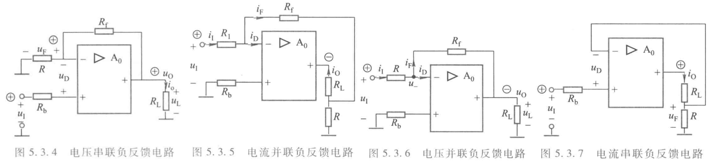

# 电工电子学期末补天 part2
## 第五章 集成运算放大器
### 基本组成
集成运放基本组成主要有四个部分：**输入级、中间级、输出级和偏置电路**。
- 输入级是组成集成运放的关键部分，通常要求有**高输入电阻、低漂移和高抗干扰能力**等，常采用**差分放大电路**
- **中间级**亦称**电压放大级**，主要使集成运放获得**很高的电压放大倍数**，常由**一级或多级电压放大电路**组成
- **输出级**主要使集成运放有**较强的带负载能力**。此，要求输出级**能提供一定的输出电压和输出电流，并且要求输出电阻尽可能小，使输出电压稳定。**输出级通常采用**互补对称式电路**
- 偏置电路的作用是**为各级电路提供偏置电流**。

在集成运放中级与级之间采用**直接耦合**，也即直接用导线连接。直接耦合电路的主要问题是**零点漂移**现象。对一个电压放大倍数很高的多级直接耦合放大电路，由于晶体管特性、参数随温度变化或电源电压不稳定等影响，即使输入端短路,在输出端也会出现电压波动，即输出端电压会偏离原来的值而上下变动，这种现象称为**零点漂移**。
在多级直接耦合放大电路中，由于输入级本身的波动会因直接耦合而逐级放大，因此当放大电路有输入信号时，这种电压波动会与有用信号混合而无法辨别，严重时使放大电路丧失工作能力。
#### 输入级 差分放大电路
其最主要的作用是。**抑制零点漂移**，即**放大差模信号，抑制共模信号**
##### 差模信号
当两个输入端对地分别加入输入信号$u_{I1}$和$u_{I2}$时，若$u_{I1}$与$u_{I2}$**大小相等、极性相反**，即$u_{I1}=-u_{I2}$,则称为**差模信号**。
两个输入端之间的电压$u_I=u_{I1}-u_{I2}$，在差模信号作用下，输出电压$u_o$与输入信号$u_I$之比称为**差模电压放大倍数**。
##### 共模信号
在差分放大电路中，两个输入端输入**大小相等、极性相同**的信号(即$u_{I1}=u_{I2}$)称为**共模信号**。电路中的**零点漂移可用输入端施加共模信号来模拟。**、
此时输入电压为$u_I=\dfrac{u_{I1}+u_{I2}}{2}$，在共模信号作用下，输出电压$u_o$与输入信号$u_I$之比称为**共模电压放大倍数**。

通常将差模电压放大倍数$A_d$与共模电压放大倍数$A_e$之比定义为共模抑制比$K_{CMB}$
$$K_{CMB}=\frac{A_d}{A_e}$$
**共模抑制比反映了差分放大电路抑制共模信号的能力，其值越大，电路抑制共模信号(零点漂移)的能力越强。**
#### 输出级 互补对称电路
因为射级输出器的输出电阻很小，带负载能力较强，因此输出级采用**射极输出器**构成的**互补对称式电路**作为基本形式。采用互补对称式电路是为了**减小静态功耗**。
#### 概述
</img>

集成运放有两个输入端,一个输出端，其中$IN_-$称为反向输入端，用“-”号表示，当输入信号从反向输入端输入时，输出信号与输入信号反相；$IN_+$称为同向输入端，用“+”号表示。当输入信号从同相输入端输人时，输出信号与输入信号同相。OUT为输出端。集成运放在使用时，通常需加正、负电源，图中正、负电源端未画出。

若同相输入端接地，信号从反相端与地之间输入，称为反相输入方式；若反相输入端接地，信号从同相端与地之间输入，称为同相输入方式；若信号从两输入端之间输入或两输入端都有信号输入，称为差分输入方式。
### 集成运放的电压传输特性和电路模型
</img>

集成运放的电压传输特性是指开环时输出电压与输入电压的关系曲线
在线性区工作时，即$U_i^-<u_I<U_i^+$，输出电压$u_o$与两输入端之间的电压$u_i$成线性关系
$$u_O=A_0u_I=A_0(u_+-u_-)$$
式中，$u_+$和$u_-$分别是同相输入端和反相输入端对地的电压。

在饱和区工作时，输出电压$u_{O}=U_{0}^{+}$或$u_O=U_0^-$,这里$U_o^+$和$U_o^-$分别为输出正饱和电压和负饱和电压，其绝对值分别略低于正、负电源电压。

</img>

由于集成运放的开环电压增益很大,而输出电压为有限值,因此传输特性中的线性区是很窄的,即$(U_i^+-U_i^-)$极小(微伏级)。

右图为集成运放**线性区**的电路模型，可用**电压控制电压源**的模型等效。
### 理想特性
1. 开环电压增益$A_0\rightarrow \infty$
2. 输入电阻$r_i\rightarrow \infty$
3. 输出电阻$r_o\rightarrow 0$
4. 共模抑制比$K_{CMB}\rightarrow \infty$
5. 由于集成运放的输入电阻$r_i$很大，所以当集成运放工作在线性区时,反相输入端电流$i^-$和同相输入端电流$i_+$均近似为零。（虚断）即
$$i_-=i_+\approx0$$
此式当集成运放工作在非线性区时也基本适用。
6. **当且仅当集成运放工作在线性区时**，**（即负反馈时）** 输入电压$u_I=u_+-u_-=\dfrac{u_o}{A_0}\approx 0$，于是可认为同相输入端对地电压$u_+$和同相输入端对地电压$u_-$近似相等。（虚短）即
$$u_+\approx u_-$$
### 负反馈
运放的输出端连接到反向输入端即为负反馈电路。

辨别技巧：
- **输入端与反馈端同侧即为并联反馈，输入端与反馈端异侧即为串联反馈。** 口诀：串反并同。
- $R_L$两端电压与输出端电压相同即为**电压反馈**，反之为**电流反馈**。
#### 负反馈对放大电路性能的影响
1. 提高放大倍数的稳定性
2. 减小非线性失真
3. 扩展通频带
4. **对输入电阻和输出电阻的影响**
##### 对输入电阻和输出电阻的影响
**电压负反馈**具有**稳定输出电压**的作用，即使输出电压趋向于恒定，故使**输出电阻减小**。对于**电流负反馈**，反馈信号正比于输出电流，具有**稳定输出电流**的作用，即使输出电流趋向于恒定，故使**输出电阻增大**
### 例5.1（大概率不会考大题，扫一眼）
</img>

如右图所示的电压串联负反馈电路中，设$R_f=100k\Omega,R=R_B=10k\Omega$,负载电阻$R_L$不接，输入电压$u_I$为直流电压$0.1V$，集成运放的开环电压放大倍数$A_0=10000$，输入电阻$r_i=500k\Omega$，输出电阻$r_o=500k\Omega$。求此电路的输出电压$u_O$、闭环电压放大倍数$A_f$和输出电阻$R_{of}$。

 

$$\begin{cases}
i_R -i_I - i_F = 0 \\
(R_b + r_i)I_i + RI_R = u_i \\
(R_f + r_o)I_F + RI_R = A_0(u_+ - u_-) = A_0r_iI_i
\end{cases}$$
</img>

代入已知参数可解得
$$\begin{align*}
i_I &\approx 22.07 \times 10^{-5} \ \mu A \\
i_F &\approx 9.99 \ \mu A \\
i_R &= i_I + i_F \approx i_F \approx 9.99 \ \mu A \\
u_O &= A_0 r_i i_I - r_o i_F \approx 1.099 \ V
\end{align*}$$
闭环电压放大倍数
$$A_f = \frac{u_O}{u_I} = 10.99$$
输入电阻
$$r_{if}=\frac{u_I}{i_I}\approx 453M\Omega$$
</img>

电路的输出电阻可按求二端网络等效电阻的方法求得。为此令$u_I=0$，得图所示无源二端网络，在端口处加电压$u$，得
$$i = i_1 + i_2 = \frac{u - A_0(u_+ - u_-)}{r_o} + \frac{u}{R_f + \left[ (r_i + R_b) // R \right]}$$
$$r_{of} = \frac{u}{i} \approx 0.6 \, \Omega$$
### 模拟信号运算
做模拟信号运算时，集成运放外加负反馈使其**闭环工作在线性区**。
#### 反相比例运算电路
</img>

为了使集成运放两输入端的外接等效电阻对称，同相输入端所接平衡电阻$R_B$于反相输入端对地的等效电阻，即$R_b=R//R_f$
虚断：$i_+=i_-=0$，虚短：$u_+=u_-=R_bI_+=0$。
$$u_O=u_--i_FR_f=-i_FR_f\\i_F=i_I-i_-=i_I=\frac{u_I-u_-}{R}=\frac{u_I}{R}$$
从而
$$u_O=-\frac{R_f}{R}u_I$$

通常可用闭环电压放大倍数$A_f$来表示这种比例关系
$$A_f=\frac{u_O}{u_I}=-\frac{R_f}{R}$$

若取$R_f=R$，则输入电压与输出电压大小相等，相位相反，称为反相器
$$r_i=\frac{u_I}{i_I}=R$$
由于电路为**电压负反馈**，故**输出电阻很小**。
</img>

分析下图的反向输入比例运算电路
$$i_F = i_I=\frac{u_I}{R_I}$$
$$i_2=-\frac{u_a}{R_2}=-\frac{-R_fi_F}{R_2}=\frac{R_f}{R_1R_2u_I}$$
$$i_3 = i_F+i_2 = \frac{1}{R_1}\left(1+\frac{R_f}{R_2}\right)$$
所以
$$u_O=-R_3i_3-R_2i_2=-\left[\frac{R_f}{R_1}+\left(1+\frac{R_f}{R_2}\frac{R_3}{R_{I1}}\right)\right]u_I$$
闭环电压放大倍数
$$A_{\mathrm{f}}=\frac{u_{O}}{u_{I}}=-\left[\frac{R_{\mathrm{f}}}{R_{1}}+\left(1+\frac{R_{\mathrm{f}}}{R_{2}}\right) \frac{R_{3}}{R_{1}}\right]=-\frac{1}{R_{1}}\left(R_{\mathrm{f}}+R_{3}+\frac{R_{\mathrm{f}} R_{3}}{R_{2}}\right)$$
反相输入比例运算电路的**输入电阻通常较小**，欲希望比例运算电路有**较大的输入电阻**，可采用**同相输入**。
#### 同相输入比例运算电路
</img>

虚短$$u_-=u_+=u_I-R_bi_I=u_I$$
$$u_O=u_-+R_ii_F=u_I+R_fi_F$$
$$i_F=i_R=\frac{u_-}{R}=\frac{u_I}{R}$$
$$u_O=u_1+\frac{R_f}{R}u_I$$
闭环电压放大倍数
$$A_f=\frac{u_O}{u_I}=1+\frac{R_f}{R}$$

该电路的$R_f=0$或$R=\infty$时，$u_O=u_I,A_f=1$，输出电压与输入电压大小相等、相位相同，故此时的电路称为**电压跟随器**。
#### 加法运算电路
</img>

平衡电阻$R_b=R_1//R_2//R_f$
（虚断）$i_-=0$，因此
$$i_1+i_2=i_F$$
即
$$\frac{u_{I1}-u_-}{R_1}+\frac{u_{I2}-u_-}{R_2}=\frac{u_--u_O}{R_f}$$
（虚短）由$u_+=u_-=0$，有
$$\frac{u_{I1}}{R_1}+\frac{u_{I2}}{R_2}=-\frac{u_O}{R_f}$$
故
$$u_O=-\left(\frac{R_f}{R_1}u_{I1}+\frac{R_f}{R_2}u_{I2}\right)$$
加法运算电路不限于两个输入，它可实现多个输入信号相加。
加法电路的输入信号也可以从同相端输入，但由于运算关系和平衡电阻的选取比较复杂，并且同相输入时集成运放的两输入端承受共模电压，它不允许超过集成运放的最大共模输入电压。因此一般**很少使用同相输入的加法电路。**
#### 减法运算电路
</img>

电压负反馈，使集成运放工作在线性区。
当只有$u_{I1}$作用时，即为反相输入比例运算电路
$$u_O'=-\frac{R_f}{R_1}u_{I1}$$
当只有$u_{I2}$作用时，即为同相输入比例运算电路
$$u_{O}''=\frac{R_1+R_f}{R_1}\frac{R_3}{R_2+R_3}u_{I2}$$
共同作用时输出电压
$$u_O=u_O'+u_O''=-\frac{R_f}{R_1}u_{I1}+\frac{R_1+R_f}{R_1}\frac{R_3}{R_2+R_3}u_{I2}$$
为使集成运放两输入端的外接电阻平衡，常取$R_1=R_2,R_3=R_f$
则有
$$u_O=u_{I2}-u_{I1}$$
#### 积分运算电路
</img>

虚断$i_+=i_-=0$，虚短$u_+=u_-=0$
输出电压
$$u_O=u_--u_C=-u_C=-u_C(0)-\frac{1}{C}\int i_cdt=-u_C(0)-\frac{1}{C}\int i_Idt$$
由于$i_I=\frac{u_I}{R}$，所以
$$u_O=-u_C(0)-\frac{1}{RC}\int u_Idt$$
如果电容电压的初始值$u_C(0)=0$时，输出电压
$$u_O=-\frac{1}{RC}\int u_Idt$$
可见输出电压与输入电压的积分成比例。
#### 比例-积分运算电路
</img>

$$u_O=-\left(\frac{R_f}{R}u_I+\frac{1}{RC}\int u_Idt\right)$$
 
 
 
 

#### 和-积分运算电路
</img>

$$\begin{aligned}
u_0&=-\frac{1}{C}\int i_C\mathrm{d}t=-\frac{1}{C}\int(i_1+i_2)\mathrm{d}t\\&=-\frac{1}{C}\int\left(\frac{u_{11}}{R_1}+\frac{u_{12}}{R_2}\right)\mathrm{d}t
\end{aligned}$$
 
 
 

#### 微分运算电路
</img>

$$u_0=u_--R_\mathrm{f}i_\mathrm{F}=-R_\mathrm{f}i_\mathrm{F}=-R_\mathrm{f}i_C$$
$$\begin{aligned}
i_{c} & =C\frac{\mathrm{d}u_{C}}{\mathrm{d}t} \\
 & =C\frac{\mathrm{d}u_{1}}{\mathrm{d}t}\quad(u_{C}=u_{1}-u_{-}=u_{1})
\end{aligned}$$
所以
$$u_0=-R_1C\frac{\mathrm{d}u_1}{\mathrm{d}t}$$
### 幅值比较
$u_+>u_-$时比较器输出高电平$U_{OH}$,$u_+<u_-$时输出低电平$U_{OL}$
#### 开环工作的比较器
做比较器时，集成运放处于**开环**状态，因此工作在正、负**饱和区**。
简单比较器如果不会自行看书，比较简单。

图中两个限幅稳压管的稳定电压分别为$U_{Z1}$和$U_{Z2}$，正向压降分别为$U_{D1}$和$U_{D2}$。
#### 过零比较器
</img>

可以使用过零比较器将正弦波变换为方波。
开环工作的比较器输出不稳定。为了提高电路的性能，常采用具有**正反馈**的滞回比较器。
## 第六章 波形产生和变换
正弦波振荡电路由**放大、反馈、选频和稳幅环节**组成，属于**正反馈电路**。
### 反馈的基本概念
对于负反馈放大电路，$x_F$与$x_1$的极性相反，基本放大电路的净输入信号
$$x_D=x_I-x_F$$

</img>

开环放大倍数
$$A_o=\frac{x_o}{x_D}$$
闭环放大倍数
$$A_f=\frac{x_o}{x_I}$$
反馈系数
$$F=\frac{x_F}{x_o}$$
综合以上几式可得
$$A_f=\frac{A_0}{1+FA_0}$$
这是反馈放大电路的基本关系式。

放大电路引入负反馈后，使放大倍数减小，即$|A_f|<|A_o|$。即$|1+AF_o|>1$。$|1+AF_o|$愈大，$A_f$愈小，表明负反馈愈强。所以常称$|1+AF_o|$为反馈深度。当$|1+AF_o|\gg 1$时，称为深度负反馈。
### 自激振荡
</img>

#### 平衡条件
右图(a)为正反馈放大电路的原理方框图。若撤去$\dot{U}_s$后放大电路仍保持输出电压不变，这时正反馈放大电路就变成为自激振荡电路。
电路要维持自激振荡，则显然有
$$\dot{U}_f=\dot{U}_i$$
而$$\dot{U}_i=\frac{\dot{U}_o}{A},\quad \dot{U}_f=\dot{U}_oF$$
可以得到$$\dot{U}_oAF=\dot{U}_o$$
这里$A$为开环放大倍数，$F$为反馈系数。
**所以维持自激振荡的平衡条件为**
$$AF=1$$
记$A=|A|\angle \varphi_A,F=|F|\angle \varphi_F$，则可以推出两个平衡条件
1. 相位平衡条件$\varphi_A+\varphi_F=2n\pi\quad n=0,1,2,...$
2. 幅值平衡条件$|AF|=1$

**相位平衡条件**保证**反馈极性为正反馈**，而**幅值平衡条件**保证**反馈有足够的强度**。
这两个平衡条件是指振荡已经建立，输出的正弦波已经产生，电路已进入稳态，为维持等幅自激振荡必须满足的条件。**它是必要条件，但不是充分的。**
#### 起振条件
电路接通电源时，要保证电路从小到大建立起振荡的**幅值条件**是
$$|AF|>1$$
而**相位条件不变**。
### RC正弦波振荡电路
</img>

右图是一个用集成运放组成的RC串并联正弦波振荡电路。电阻R和电容C构成**串并联选频网络**，$Z_1,Z_2$**连接到集成运放同相输入端**提供**正反馈**。电阻$R_f,R_1$**连接到集成运放反相输入端**，引入**负反馈**，作为**稳幅**环节。

以下为结论性内容
当**信号频率为**$$f_0=\frac{1}{2\pi RC}$$时，$Z_2$的电压为
$$U_f=\frac{1}{3}U_o$$且二者同相（满足相位平衡条件）。
反馈系数满足
$$F=\frac{U_f}{U_o}=\frac{1}{3}$$
要满足幅值条件$AF=1$，可知$$A=3$$
由于放大电路接成同相输入比例放大形式，故电压放大倍数
$$A=1+\frac{R_f}{R_1}$$
**所以幅值平衡条件为**$$R_f=2R_1$$
考虑到起振条件$|AF|>1$，**一般选取$R_f$略大于$2R_2$**。但是如果这个比值取得**过大**，会引起振荡波形**严重畸变**。

上图电路需要熟记，有以下例题：

</img>

右图是采用二极管实现稳幅的振荡电路，利用二极管伏安特性的**非线性**特点进行**自动稳幅**。其电路图其实基本与上图一致。因此其起振条件为$R_{f1}+R_{f2}>2R_1$。$R_{f1}$并联两个极性反接的二极管的目的是保证**正弦波正负半周总有一个二极管导通。**

**RC 正弦波振荡电路所产生的频率通常在200 kHz 以下。(输出低频正弦波用RC电路)**
### LC正弦波振荡电路
LC正弦波振荡电路以 LC 谐振回路作为**选频**网络，可产生频率高于1GHz的正弦波形（**适合产生高频正弦波**）。
### 555集成定时器
</img>

</img>

**回差的意思是两个输入引脚之间电压的差值**
**各引脚**：
1. 1号引脚$GND$，接地。
2. 2号引脚$\overline{TR}$(Trigger)，低触发端，低于参考电压$V_{R2}$有效
3. 3号引脚$OUT$，输出$V_O$
4. 4号引脚$\overline{R_D}$，置零输入端，若接低电平输出直接置零，因此**电路正常工作时接高电平**
5. 5号引脚$CO$，(Control)外接电压时改变参考电压$U_{R1},U_{R2}$的值，**该引脚不用时传入一只$0.01\mu F$电容接地，以防引入高频干扰**
6. 6号引脚$TH$(Threshold)，高触发端，高于参考电压$V_{R1}$有效
7. 7号引脚$D$，(Discharge)放电端
8. 8号引脚$U_{DD}$，接电源。

给一些奇怪的记法：4是reset口，是因为人4了就reset了
5（我，指555）很有控制欲，所以是control口
7是一个插头，所以是discharge口
8翻一下是$\infty$，所以是电源口，对应的1是接地
**一拍脑袋想出来的，学电工电子学学疯了导致的**

判断准则（口诀）：
1. 有置零，先置零（置零信号有效时，输出信号置零）
2. 低有效，高截止（置零无效时，低触发信号低于低参考信号，则输出$\mathbf{1}$，即输出高电位且MOS管截止）
3. 高有效，低导通（置零、低触发信号均无效时，高触发信号高于高参考信号，则输出$\mathbf{0}$，即输出低电位且MOS管导通）
4. 都无效，则不变（置零、低触发信号、高触发信号均无效时，输出保持不变）
5. **不应该出现均有效的情况，这种情况下基本$RS$触发器输出状态不定。**

**以下三种555构成的电路都需要会分析原理**
#### 555构成的多谐振荡器
</img>
原理在书本p230。以下左图为波形，右图为电路图。

**电容充电时间**$$T_1=0.693(R_1+R_2)C$$（充电时电流经过$R_1$和$R_2$）
**电流放电时间**$$T_2=0.693R_2C$$（放电时电流只经过$R_2$）
**周期**$$T=T_1+T_2=0.693(R_1+2R_2)C$$

多谐振荡器没有稳定状态，是**无稳态触发器**。
#### 555构成的单稳态触发器 

单稳态触发器**只有一个稳态**，当无外加触发信号时，触发器即保持在这一稳态。当外加触发信号作用后，触发器翻转到一个**暂态**，持续一段时间后它又会自动**返回到原来的稳态**。

原理在书本p232
输出的脉冲宽度
$$t_w=1.1RC$$
555 构成的单稳态触发器，要求输入触发脉冲宽度一定要小于$t_w$。若触发脉冲是周期性的，它的周期必须大于$t_w+t_r$

单稳态触发器主要用于整形、定时和延时
#### 555构成的施密特触发器

如果要使输出信号的高电平不同于$U_{DD}$，可以在放电端(7脚)经一电阻与
另一电源$U_{DD}'$相接，这时输出信号$u_{o}'$的高电平为$U_{DD}'$。

施密特触发器能把变化非常缓慢的输入信号变化成边沿很陡的矩形脉冲输出。它所具有的**滞回**特性，使它在波形的变换、整形、幅度鉴别等方面得到广泛应用
## 第七章 测量与数据采集系统
### 滤波
滤波电路是一种允许某一频率范围内的信号顺利通过，而抑制此频率范围以外的其他频率信号的电路。按通过或抑制的信号频率范围，可分为低通、高通 、带通和带阻等滤波电路。按组成元件的性质，可分为**无源滤波**电路（仅含有无源元件 R、L、C）和**有源滤波**电路（含有晶体管或集成运放等有源元件）。与无源滤波电路相比，含有集成运放的**有源滤波电路**具有**放大**作用，通过运放**使输入与负载隔离**，**带负载能力强**等特点。
### 取样定理
取样-保持电路是在取样脉冲控制下，处于“取样”或“保持”两种状态的电路。在取样状态时，电路的输出跟随输入模拟电压；转为保持状态时，电路的输出保持前一次取样结束瞬时的模拟信号电压，直至进入下一次取样为止。在一个系统中，是否使用取样-保持电路**完全取决于输入信号的频率**。**变化缓慢**的信号可以**不加**取样-保持电路。若被测信号是**快速变化**的，则应在 A/D 转换之前加取样-保持电路。并且为了使取样-保持电路输出的信号能不失真地复现为原输入信号，必须满足
$$f_s\geq 2f_{imax}$$
其中$f_s$为取样脉冲频率；$f_{imax}$为信号$u_i$的最高频率谐波分量的频率。以上被称为采样定理。
### 数模（D/A）转换器
</img>
数模转换器的作用是将数字信号转换成模拟信号。

#### 组成部分
T形电阻数模转换器主要由四部分构成
1. T形电阻网络。由若干个R和2R的电阻构成。
2. 模拟开关。模拟开关$S_i$的状态受数字信号$D_i$（i=1,2,3,4,...）控制，当$D_i=1$时，$S_i$合向左边；当$D_i=0$时，$S_i$合向右边。
3. 电流求和放大器。（运放）
4. 基准电源。用作基准的高精度电压$U_{ref}$，**电压稳定度要求极高**，一般通过专门设计的稳压电路获得。
#### 工作原理
由电路图可知，从输入端看整个电阻网络的等效电阻为$R$，总电流$I=\dfrac{U_{REF}}{R}$。并且有$\displaystyle I_3=\frac{I}{2}，I_2=\frac{I}{2^2}，I_1=\frac{I}{2^3}，I_0=\frac{I}{2^4}$。
对于输入一个任意4位二进制数$D_3D_2D_1D_0$，有
$$I_{out1}=\frac{1}{2^4}(D_32^3+D_22^2+D_12^1+D_02^0)$$
则运放的输出电压可以表示为
$$U_o=-R_fI_{out1}=-\frac{U_{REF}R_f}{2^4R}(D_32^3+D_22^2+D_12^1+D_02^0)$$
**以此类推，对于n位的D/A转换器则有**
$$U_o=-\frac{R_fU_{REF}}{2^nR}\sum_{i=0}^{n-1}D_i2^i$$
### 模数(A/D)转换器
模拟信号经取样-保持电路后得到的取样信号在**时间上是离散的，但在幅度上仍是连续变化的**。为了用数字量来表示它，则须将它在幅度上也离散化，**即将保持期间的信号幅度值取整为最接近的离散电平**。这个转化过程称为**量化**。离散电平是已规定的某个**最小数量单位（称量化单位）的整数倍值**。由于真实信号幅度与离散电平之间存在误差，量化时就会带来**量化误差**。因此**量化单位取得越小（离散电平分层越多），量化误差就越小。**量化后的数值用二进制代码表示称为**编码**。
量化和编码由 A/D 转换器完成。目前应用的 A/D 转换器主要有两大类。一类是**直接** A/D 转换器，它是将输入模拟电压直接转换成数字量，不经过任何中间变量。这类转换器主要有**逐次逼近型** A/D 转换器、并联比较型 A/D 转换器、电荷再分配型 A/D 转换器等。另一类是**间接** A/D 转换器，它是先将输人的模拟电压转换成某一中间变量如时间、频率等，再将这个中间变量转换成数字代码。这类转换器主要有单积分 A/D 转换器 、**双积分** A/D 转换器 、四重积分 A/D转换器、U/f转换器等
#### 逐次逼近型A/D转换器

在模拟量转换成数字量期间，输入模拟量应保持不变 ，因而输入信号$U_x$应是**经过取样-保持后才加到比较器**的。

计算类的题目应该只有两种题型
#### 例题7.1
在10位逐次逼近型A/D转换器中，设时钟信号频率为1MHz，试计算完成一次转换所需要的时间。

**对于n位 A/D 转换器，转换一次需要n+2个时钟脉冲周期。**
$$T=\frac{1}{f}=10^{-6}s$$
因此对于10位逐次逼近型A/D转换器，转换一次需要$1.2\times10^{-5}s$
#### 例题7.2
在逐次逼近型A/D转换器中，如果已知8位D/A转换器的最大输出电压为9.945V，则当输入电压为$U_x=6.435V$时，A/D转换器输出的二进制数为？

直接记公式得了，有
$$\frac{2^n-1}{2^n}U_{REF}=U_{max},\frac{U_{REF}}{2^n}x=U_x$$
在这个题目中,
$$\frac{2^8-1}{2^8}U_{REF}=9.945V$$
解得$$U_{REF}=9.984V$$
$$\frac{9.984V}{2^8}x=6.435V$$
解得$x=165$
转换为二进制数为$10100101$
**注意：答案要舍去所有小数点后的数字。**
#### 双积分型A/D转换器
双积分型 A/D 转换器属于**间接** A/D 转换器。

$T_c$为计数脉冲周期，则**第一次积分时间**
$$T_1=2^nT_c$$

**第二次积分时间**
$$T_2=\frac{2^nT_c}{U_{REF}}U_x$$
**结果为**
$$D_{out}=\frac{T_2}{T_c}$$
计算题应该只有这一种题型
#### 例题7.3
双积分型A/D转换器中，计数器为8位二进制计数器，时钟脉冲的频率为200kHz，$U_{REF}=10V$，试求：
(1)$U_x=3.75V$时第一次和第二次积分的时间和转换完成后计数器的状态。
(2)$U_x=11.25V$时第一次和第二次积分的时间和转换完成后计数器的状态。

$$T_c=\frac{1}{f}=5\times 10^{-6}s$$
(1)
$$T_1=2^8T_c=1.28\times10^{-3}s$$
$$T_2=\frac{1.28\times10^{-3}s}{10}\cdot3.75=4.8\times10^{-4}s$$
$$D_{out}=\frac{T_2}{T_c}=96$$
转换为二进制为01100000
(2)
$$T_1=1.28\times10^{-3}s$$
$$T_2=1.44\times10^{-3}s$$
$$D_{out}=\frac{T_2}{T_c}=288\text{溢出}$$
**8位A/D转换器最高到255，此时计数器溢出，工作不正常**
$$D_{out}=288-256=32$$
转换为二进制为00100000

**因此，理论上要保证$U_x<U_R$即$T_2<T_1$该转换器才能正常工作**

双积分 A/D 转换器的主要优点是**转换精度高，抗干扰能力强**。这是因为采用**两次积分比较**，转换结果与时间常数无关，因此 **R、C 的缓慢变化不会影转换精度**。此外，在一般控制系统中碰到的干扰主要来自电网电压，**通常积分器选用的取样时间 T, 等于工频电压周期的整数倍，如 20 ms、40 ms 等**。这样，积分器在取样时间对输人的正负对称工频干扰信号的积分输出值等于零，故可有效地**抑制工频干扰**。但是双积分型 A/D 转换器需进行二次积分，工作速度较**慢**，常用在**慢速测量系统**中