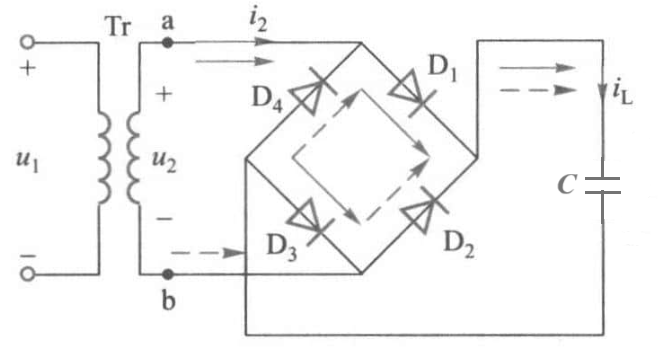
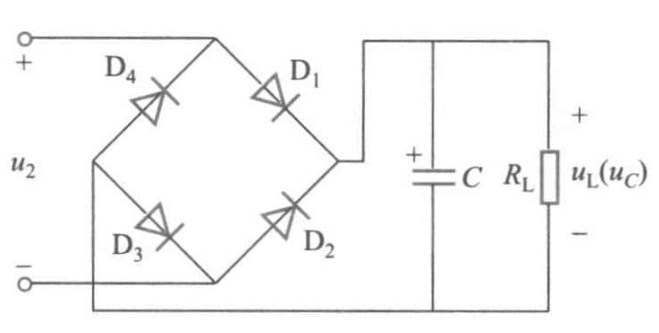
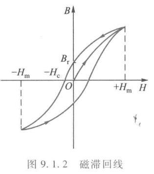

# 电工电子学期末补天 part3
## 第八章 功率电子电路
### 低频功率放大电路
#### 特点
1. 输出功率尽可能大，使负载能获得所需的功率。这就要求输出电流和输出电压尽可能大，因此**功率管常常工作在接近于极限状态**。功率晶体管的极限工作区域受极限参数的限制，这些极限参数包括**集电极最大允许耗散功率$P_{CM}$、集电极最大允许电流$I_{CM}$、集电极与发射极之间的反向击穿电压$U_{(BR)CEO}$等**。为了避免严重的非线性失真，**输出电压和电流的幅度也不应进入饱和区和截止区**。因此功率放大电路是在充分利用晶体管的安全工作区的前提下工作的，是**大信号工作状态**。
2. 线性失真尽可能小。因为工作在大信号状态，不可避免地会产生**非线性失真**，通常采用**负反馈**等措施来尽量减少波形失真。
3. 效率要高。功率放大电路是一个能量转换电路，它将直流电源功率转换成信号功率输送给负载。在转换过程中，部分功率被电路本身所消耗。功率放大电路的效率是指输出的信号功率$P_o$与电源功率$P_S$的百分比$$\eta =\frac{P_o}{P_S}\times 100\%$$

为了提高效率，就必须减少功率管的管耗。**功率管的集电极功耗**
$$P_C=\frac{1}{T}\int^T_0u_{CE}i_Cdt$$
$u_{CE}$为集电极与发射极之间的电压，$i_C$为集电极电流，$T$为周期。上式表明，只要减小功率管在一个周期内的导通时间，或降低静态工作点（$I_C$减小）就可以减小管耗，提高效率。

互补对称电路是集成功率放大电路输出级电路的基本形式。
#### 导通角
导通角是指在一个周期内，由器件（如晶闸管）控制其导通的角度（相位）。
#### 晶体管工作状态

##### 甲类工作状态
采用**射极输出器**作为功率放大电路，**把静态工作点设置在负载线的中点**，晶体管在输入信号的**整个周期内都导通**，这种工作状态称为**甲类工作状态**。工作状态的晶体管**静态集电极电流较大，波形好，但管耗大，效率也低。**
**易知其导通角为$360^\circ$**
##### 乙类工作状态
降低静态工作点使静态时$I_C=0$，此时晶体管只在输入信号的**半个周期内导通**，这种工作状态称为**乙类工作状态**。乙类工作状态的晶体管**静态集电极电流为零，因此管耗小，但波形严重失真。**
**易知其导通角为$180^\circ$**
##### 甲乙类工作状态
采用互补对称电路，在输出波形过零点附近会出现失真，称为**交越失真**。为了消除交越失真，可将静态工作点提高一些,$u_i=0$时仍有很小的$I_C$。功率放大电路常采用甲乙类工作状态。

由于功率放大电路中的晶体管工作在**大信号**状态下，因此分析电压放大电路所用的**微变等效电路就不再适用**。
**易知其导通角为$180^\circ\sim 360^\circ$**
#### OCL电路 
OCL电路，即无输出电容电路，其采用**双电源供电**。电路如下图。

为了使输出波形正、负半周对称，要求两互补晶体管管$T_1,T_2$的**特性一致**。

$T_1,T_2$导通时都是射极输出器，若忽略交越失真，且$T_1,T_2$均属于放大状态时，可以近似认为$u_o=u_i$。**（相位也一致）**$T_1,T_2$的集电极最大允许耗散功率$P_{CM}$的大小应**根据OCL电路输出功率的大小**来选择。由于该电路的输出电阻很小，且叫两晶体管特性完全相同，静态时$U_E=0$,所以可直接驱动电阻负载。（如果不为0则静态浪费功率）

设输入信号足够大，$T_1,T_2$极限运用，饱和压降为$U_{CES}$，则**输出电压$u_o$的最大值**
$$U_{om}=U_{CC}-U_{CES}$$
$u_o$的有效值为$\dfrac{U_{om}}{\sqrt2}$，因此**最大输出功率**
$$P_{omax}=\frac{(\dfrac{U_{om}}{\sqrt 2})^2}{R_L}=\frac{1}{2}\frac{(U_{CC}-U_{CES})^2}{R_L}$$
流过直流电源$+U_{CC}$的电流$i_{C1}$是**半波电流**（$u_i$正半周$T_1$导通$T_2$截止，反之相反），最大值为
$$I_{cm}=\frac{U_{om}}{R_L}=\frac{U_{CC}-U_{CES}}{R_L}$$
而
$$i_{C1}=\begin{cases}
    I_{cm}\sin\omega t,&\omega t\in[0,\pi]\\[2ex]
    0,&\omega t\in[\pi,2\pi]
\end{cases}$$
因此，一个直流电源提供的平均功率
$$P_{S+}=\frac{1}{\dfrac{2\pi}{\omega}}\int^\pi_0U_{CC}I_{cm}\sin\omega t dt = \frac{1}{\pi}U_{CC}I_{cm}$$
直流电源$-U_{CC}$提供的平均功率$P_{S-}=P_{S+}$，故两个电源提供的**总平均功率**
$$P_S=2P_{S+}=\frac{2}{\pi}U_{CC}I_{cm} = \frac{2}{\pi}\frac{U_{CC}(U_{CC}-U_{CES})}{R_L}$$
所以电路在输出达到最大功率时相应的效率为
$$\eta_{max}=\frac{P_{omax}}{P_S}=\frac{\pi}{4}\frac{U_{CC}-U_{CES}}{U_{CC}}$$
若忽略$T_1,T_2$的饱和压降$U_{CES}$，电路**理想的最大输出功率$P_{omax}$和相应的效率$\eta_{max}$分别为**
$$P_{omax}=\frac{1}{2}\frac{U_{CC}^2}{R_L}$$
$$\eta_{max}=\frac{\pi}{4}\times 100\%=78.5\%$$
由于饱和压降不可能等于0，所以电路的实际效率总低于78.5%

右图为集成运放和OCL 电路组成的功率放大电路。其中$D_1,D_2$为$T_1,T_2$的发射结提供偏置电压，用来**消除交越失真**。静态分析，$R_{E1},R_{E2}$起电流串联负反馈作用，可以稳定静态工作电流，并改善输出波形，动态分析，$R_1,R_2$起电压串联负反馈作用，使放大电路的工作比较稳定，具有较好的放大性能。
**整个电路动态时的电压放大倍数为**
$$A_f\approx 1+\frac{R_2}{R_1}$$
#### OTL电路

OTL电路，即**无输出变压器**电路，其采用**单电源供电**。电路如右图。两互补管发射极**静态电位不为零**而不能直接与负载相连，因此在输出端**接入电容**。由对称性，静态时两晶体管的基极电位$U_{B}=\dfrac{1}{2}U_{CC}$，发射极电位$U_{E}$也为$\dfrac{1}{2}U_{CC}$。电容$C$被充电到两端电压为$\dfrac{1}{2}U_{CC}$,电容$C$的容量**足够大**，使得$R_LC$远远大于输入信号的周期，因此信号作用期间，可认为电容$C$上的电压保持$U_C=\frac{1}{2}U_{CC}$不变。$u_i$正半周$T_1$导通$T_2$截止，输出正半周电压；负半轴$T_1$截止$T_2$导通，$C$通过$T_2$向$R_L$放电，输出负半周电压。此时$C$**起到了负电源的作用。**

显而易见，OTL电路**只能放大交流信号，而不能放大直流信号。**（因为电容隔直）

设输入信号足够大，$T_1,T_2$极限运用，饱和压降为$U_{CES}$，则**输出电压$u_o$的最大值**
$$U_{omax}=\frac{1}{2}U_{CC}-U_{CES}$$
有效值为$\dfrac{\dfrac{1}{2}U_{CC}-U_{CES}}{\sqrt 2}$
**最大输出功率**
$$P_{omax}=\frac{(\dfrac{\dfrac{1}{2}U_{CC}-U_{CES}}{\sqrt 2})^2}{R_L}=\frac{1}{8}\frac{(U_{CC}-2U_{CES})^2}{R_L}$$

流过直流电源$+U_{CC}$的电流最大值$I_{cm}$为
$$I_{cm}=\frac{U_{omax}}{R_L}=\frac{U_{CC}-2U_{CES}}{2R_L}$$
由于直流电源仅在$u_i$正半周时提供半波电流$i_{C1}$，因此**直流电源$U_{CC}$提供的平均功率为**
$$P_s=\frac{1}{\pi}U_{CC}I_{cm}=\frac{1}{2\pi}\frac{U_{CC}(U_{CC}-2U_{CES})}{R_L}$$
所以在**电路达到最大功率时相应的效率为**
$$\eta_{max}=\frac{P_{omax}}{P_S}=\frac{\pi}{4}\frac{U_{CC}-2U_{CES}}{U_{CC}}$$
若忽略$T_1,T_2$的饱和压降$U_{CES}$，电路**理想的最大输出功率$P_{omax}$和相应的效率$\eta_{max}$分别为**
$$P_{omax}=\frac{1}{8}\frac{U_{CC}^2}{R_L}$$
$$\eta_{max}=\frac{\pi}{4}\times 100\%=78.5\%$$

理想效率与OCL电路一致。
右图是一个由集成运放和 OTL 电路组成的功率放大电路。图中用两个电阻 R 的分压使集成运放输入端的静态电位为$\dfrac{1}{2}U_{CC}$，$R_3$用来增加输入电阻，$C_1,C_2$为隔直电容，其他元件作用与OCL功率放大电路一样。
动态时该电路的**电压放大倍数**$$A_u=1+\frac{R_2}{R_1}$$
### 直流稳压电源
#### 单相桥式整流电路

四个整流二极管$D_1-D_4$组成电桥的形式，故称为桥式整流电路（四个整流二极管按桥式整流电路的形式连接并封装而成的器件，称为整流桥堆），**注意整流桥堆中二极管的方向**。

负载电阻$R_L$上所得的单向脉动电压的**平均值**（即直流分量）
$$U_L=0.9U_2$$

流过负载电阻$R_L$的**电流$i_L$的平均值**
$$i_L=\frac{U_L}{R_L}=0.9\frac{U_2}{R_L}$$
通过**每个二极管**的电流平均值为负载电流平均值的一半，即
$$i_D=\frac{i_L}{2}=0.45\frac{U_2}{R_L}$$
每个整流二极管所承受的**最大反向电压**为
$$U_{DRM}=\sqrt 2 U_2$$
通过变压器二次侧的电流(图中$I_2$)仍为正弦波，其**有效值**
$$I_2=\frac{U_2}{R_L}=1.11I_L$$
电源变压器的**容量（即视在功率）**
$$S=U_2I_2$$
考虑到二极管的正向压降和变压器绕组中电阻的影响，在实际电路中应适当增加变压器输出电压$U_2$与容量$S$

若将电阻改为电容 **(2023-2024春夏原题)**

显然有$u_L$的幅值与$u_2$的幅值相等，也即$$U_{Lmax}=\sqrt2 U_2$$
观察电路可知电容不存在放电电路
可知最终状态下有$$U_L=\sqrt 2 U_2$$
#### 滤波电路

滤波电路的作用是将整流后脉动的单向电压、电流变换为比较平滑的电压、电流。常用的滤波电路有电容滤波电路和电感滤波电路。当$R_LC\geq(3\sim 5)T/2$（T为$U_2$周期）时，负**载电压的平均值可按下式估算**
$$U_L\approx 1.2U_2$$

实际上，1.2是一个工程值，据以上分析，当$R_L\rightarrow \infty$时，$U_L= \sqrt 2U_2$，$R_L\rightarrow 0$时，$U_L= 0.9U_2$，真正的值介于这二者之间。

电容滤波的优点是**电路简单**，在$R_LC$满足要求时**滤波效果明显**。但从分析中也可以看出，**电路的输出电压受负载变化影响较大**。**$R_LC$减小时输出脉动增加**。因此电容滤波适合于要求**输出电压较高、负载电流较小(即$R_L$大)且负载变化较小**的场合。若忽略电感线圈内阻和整流二极管的压降，则**负载电压平均值**
$$U_L=0.9U_2$$

电感滤波电路利用了电感线圈具有阻止电流变化这一特性进行滤波。$X_L\geq R_L$时，整流电压的交流分量大部分降在线圈上，而直流分量大部分降在负载端。
电感滤波电路的主要优点是**带负载能力强**，特别适宜于**大电流或负载变化大**的场合，但**电感元件体积大，比较笨重，成本也高，元件本身的电阻还会引起直流电压损失和功率损耗。**
为了进一步提高滤波效果，使输出电压脉动更小,可以采用**多级滤波**的方法。
#### 串联型稳压电路

假定电压比较放大器为理想运放，即$A_u\rightarrow \infty$，则由虚短，$U_F=U_{REF}$，从而有
$$U_{F}=U_{REF}=\frac{R_2}{R_1+R_2}U_o$$
则**输出电压**
$$U_o=\frac{R_1+R_2}{R_2}U_{REF}$$
#### 例题 8.1

(1)放大状态
(2)稳压管电压$8V$，由虚短虚断
$$u_+=u_-=8V,i_+=i_-=0$$ 
由此可知$$U_o=\frac{R_2+R_3}{R_2}u_-=16V$$
(3)$$P_o=\frac{U_o^2}{R_L}=1.6W$$
(4)$$U_{CE}=U_C-U_E=U_1-U_o=4V$$
通过$R_3$的电流$I_3=\dfrac{U_o}{R_2+R_3}=0.008A$，通过$R_L$的电流$I_L=\dfrac{U_o}{R_L}=0.1A$，则$I_E=I_L+I_3=0.108A$
$$I_C=\frac{\beta}{1+\beta}I_E=0.107A$$
从而$$P_T=U_{CE}I_C=0.428W$$
#### 集成稳压电路
常用的有三端式集成稳压器有三个接线端:一个不稳定电压输入端、一个稳定电压输出端和一个公共端。
### 功率半导体器件
#### 晶闸管

晶闸管有**三个电极：阳极A、阴极K和门极（也称为控制极）G。**它由$P_1N_1P_2N_2$**四层半导体**构成，具有**三个 PN 结**：$J_1,J_2,J_3$

1. $U_{AK}<0$，无论控制极是否加电压晶闸管**都不导通，呈反向阻断状态**
2. $U_{AK}>0,U_{GK}\leq 0$，晶闸管不能导通，处于**正向阻断状态**；
3. $U_{AK}>0,U_{GK}>0$且为适当数值时，**晶闸管全导通**。必须指出，晶闸管内部的正反馈必须由一定的阳极电流 $I_A$来维持，能够维持的最小电流$I_H$称为晶闸管的**维持电流**。

晶闸管一旦导通后，即使去掉依然能依**靠内部正反馈维持导通**，因而在实际应用中，$U_{GK}$常为**触发脉冲**
### 可控整流电路

可控整流电路的功能就是将交流电能变换成电压大小可调的直流电能。这里仅介绍单相桥式可控整流电路。在单相桥式整流电路中，如把四只整流二极管全部换成某一种可控功率器件，就构成了单相桥式可控整流电路。

图中$T_1,T_2,T_3,T_4$均为晶闸管，所以称为**全控式电路**；若$T_1,T_2$采用晶闸管，而$T_1,T_2$采用功率二极管，则叫**半控式整流电路**。
#### 电路原理
如上电路图和波形图所示，当$u_2$在正半周时，在$\omega t = \alpha$(**$\alpha$称为控制角**)的瞬间给$T_1$和$T_4$的门极加触发脉冲，由于此时$a$点电位高于$b$点电位，$T_1,T_4$导通，$T_2,T_3$承受反压截止。当$u_2$过零时，电流也降到零,$T_1,T_4$阻断。同理，当$u_2$在负半周时，在$\omega t = \pi + \alpha$的瞬间给$T_2$和$T_3$的门极加触发脉冲，由于此时$b$点电位高于$a$点电位，$T_2,T_3$导通，$T_1,T_4$承受反压截止。一直循环、

为了简化分析，可以认为晶闸管正向导通时的正向压降为零，正向和反向阻断时漏电流为零，得到**负载电压$u_L$和负载电流$i_L$的平均值**
$$U_L=0.9U_2\frac{1+\cos\alpha}{2}$$
$$i_L=\frac{U_L}{R_L}$$
从以上分析可知，$u_L$的平均值与控制角$\alpha$有关，即与晶闸管的导通角$\theta$有关。由于$\cos\alpha\in [-1,1]$，可知 **$U_L$的可调范围为$0\sim 0.9U_2$**

每个晶闸管的平均电流为$\dfrac{I_L}{2}$，每个晶闸管承受的最大反向电压为$\sqrt 2 U_2$,$i_2$的有效值$$\begin{aligned}I_{2}&=\sqrt{\frac{1}{\pi}\int_{\alpha}^{\pi}\left(\frac{\sqrt{2}U_{2}}{R_{1.}}\mathrm{sin}\omega t\right)^{2}\mathrm{d}(\omega t)}\\&=\frac{U_{2}}{R_{1.}}\sqrt{\frac{1}{2\pi}\mathrm{sin}2\alpha+\frac{\pi-\alpha}{\pi}}\end{aligned}$$
## 第九章 变压器和电动机

### 铁磁材料的磁性能
#### 磁化曲线与磁滞回线

将铁磁材料放入磁场强度为H的磁场内，会受到强烈的磁化。当磁场强度H由零逐渐增加时，磁感应强度B随之变化的曲线称为磁化曲线。开始时，随着H的增加B增加较快，后来随着H的增加B增加缓慢，逐渐出现饱和现象，即具有 **磁饱和性。** 在磁化曲线上任一点的B和H之比就是磁导率$\mu$，它是表征物质导磁性能的一个物理量。显然在该磁化曲线上各点的$\mu$不是一个常数，它随H而变，并在接近饱和时逐渐减小。也就是说，**铁磁材料的磁导率是非线性的。**

每一种铁磁材料的$\mu$值都大于真空磁导率$\mu_0$，具有**高导磁性**。

铁磁材料在交变磁化过程中，H和B的变化规律如右图。当磁场强度由零增加到某个值($+H_m$)后如减少H，此时B并不沿着原来的曲线返回而是沿着位于其上部的另一条轨迹减弱。当$H=0$时$B=B_r$，$B_r$称为**剩磁**。只有当H反方向变化到$-H_c$时B才下降到0.$H_c$称为**矫顽力**。**磁感应强度B的变化滞后于磁场强度H的变化**，这种现象称为**磁滞现象**。即铁磁材料具有**磁滞性**。如图所示的曲线称为**磁滞回线**。

磁滞回线较狭窄的材料剩磁感应感应强度$B_r$低，矫顽力$H_c$小。这一类铁磁材料称为**软磁材料**，通常用来制造变压器、电机和电器(电磁系统)的**铁心**。
磁滞回线较宽的材料剩磁感应感应强度$B_r$高，矫顽力$H_c$大。这类材料称为**硬磁材料或永磁材料**，通常用来制造**永久磁铁**。
#### 磁滞损耗和涡流损耗（铁损耗）
磁滞现象使铁磁材料在交变磁化的过程中产生磁滞损耗，它是铁磁物质内分子反复取向所产生的功率损耗。铁磁材料交变磁化一个循环在单位体积内的磁滞损耗**与磁滞回线的面积成正比**，因此**软磁材料的磁滞损耗较小，常用在交变磁化的场合。**

当整块铁心中的磁通发生交变时，铁心中会产生感应电动势，在垂直于磁通的平面上产生围绕磁通流动的电流，由此产生的功率损耗称**涡流损耗。** 涡流损耗**和铁心厚度的平方成正比**。
像右图(b)一样沿着**垂直于涡流面**的方向把整块铁心分成许多薄片并**彼此绝缘**，这样就可以减少涡流损耗。因此交流电机和变压器的铁心都用**硅钢片叠成**。此外，硅钢中因**含有少量的硅**，使铁心中的**电阻增大而涡流减小**。

磁滞损耗和涡流损耗合称为**铁损耗**。使铁心发热，使交流电机、变压器及其他交流电器的功率损耗增加，温升增加，效率降低。但在某些场合，涡流可加以利用，例如可以利用涡流效应来加热或冶炼金属。
### 变压器
变压器分为**铁心和绕组**两部分，具有**变换电压、变换电流和变换阻抗**的作用。两绕组中电压高的一方为该变压器的**高压绕组**。
#### 简单磁路分析
变压器工作时，外加电压u和主磁通产生的感应电动势e相平衡，且其**有效值**$$U=E=4.44fN\varPhi_m$$

上式表明，当电源频率$f$和线圈匝数$N$不变时，主磁通$\varPhi_m$与外加电压$U$成正比关系，$U$不变则$\varPhi_m$也不变。
当磁路中出现空气隙而使**磁阻增大**时，由**磁路欧姆定律**（这里$R_m$表示磁阻）
$$\varPhi = \frac{NI}{\sum{R_m}}$$
因为电压不变，$\varPhi_m$不变，因此$\sum{R_m}$增大时**电流也随之增大。**
#### 极性判断

如图所示，由右手螺旋定则$i_0$产生的磁感应强度向上，由楞次定律可知感应电动势带来的电流方向与$i_0$相反，从而判断出感应电动势如图$e_1$所示方向。右边二次绕组的铁心中磁感应强度向下，由楞次定律可以知道感应电动势如图中$e_2$所示方向。

图中端点$U_2$和$u_2$，$U_1$和$u_1$电位瞬时极性相同，也就是说，将同极性端的数字记为一样的。大写字母表示一次绕组，小写字母表示二次绕组。同极性端也称为同名端。

#### 三相变压器
三相变压器中$U_1,V_1,W_1$和$u_1,v_1,w_1$，$U_2,V_2,W_2$和$u_2,v_2,w_2$应互为同极性端。

三相变压器有四种可能的接法：“Y,y”“Y,d”“D,d”“D,y”。每组符号里前一符号（大写字母）表示一次绕组的接法，后一符号（小写字母）表示二次绕组的接法。Y和y表示星形联结，D和d表示三角形联结。其中星形联结又分三线制和四线制两种。三线制用 Y或y 表示，四线制用 $Y_N$或$Y_n$ 表示。
#### 电压变换

$$\frac{U_1}{U_2}=\frac{E_1}{E_2}=\frac{N_1}{N_2}=k$$
#### 电压变换
$$\frac{I_1}{I_2}=\frac{N_2}{N_1}=\frac{1}{k}$$
方向上来看$I_1$和$I_2$相反，可以通过楞次定律判断。
#### 阻抗变换

$$Z'_L=\frac{\dot{U}_1}{\dot{I}_1}=\frac{-k\dot{U}_2}{-\dfrac{1}{k}\dot{I}_2}=k^2Z_L=\left(\frac{N_1}{N_2}\right)^2Z_L$$
#### 变压器的外特性

变压器一次电压$U_1$为额定值时，$U_2=f(I_2)$的关系曲线称为变压器的外特性。$U_{20}$时空载时的二次电压，称为空载电压，
$\varphi_2$为$\dot{U}_2$和$\dot{I}_2$的相位差。

如图，当负载为电阻或电感性时，二次电压$U_2$将随电流$I_2$的增加而降低，这是**二次绕组的电阻电压降和漏磁通感应电动势增大**而造成的。

电力变压器的电压变化率$$\Delta U\% =\frac{U_{20}-U_2}{U_{20}}\times100\%$$
一般为$3\%\sim 6\%$
#### 变压器的损耗

变压器的损耗包括铁损耗$P_{Fe}$和铜损耗$P_{Cu}$。铁损耗是由交变磁通铁心产生的，包括**磁滞损耗和涡流损耗**。当外加电压$U_1$和频率$f$一定时，主磁通$\varPhi_m$基本不变，铁损耗也基本不变，故铁损耗又称为**固定损耗**。铜损耗是由电流$I_1,I_2$流过一次、二次绕组的电阻所产生的损耗，它随电流的变化而变化，故称为**可变损耗**。由于变压器空载运行时**铜损耗很小**，此时从电源输入的功率（称为**空载损耗**）基本上损耗在铁心上，故可认为**空载损耗等于铁损耗**。

变压器的输出功率和和输入功率之比称为变压器的效率

$$\eta = \frac{P_2}{P_1}\times 100\% =\frac{P_2}{P_2+P_{Fe}+P_{Cu}}\times 100\%$$

由上图可见，效率随输出功率而变，并有一最大值。变压器效率一般较高，大型电力变压器的效率可达$99\%$以上。这类变压器往往不是一直在满载下运行,因此在设计时通常使最大效率出现在$50\%\sim60\%$额定负载
#### 变压器的额定值
1. 额定电压：在供电系统中，变压器二次空载电压要**略高于**负载的额定电压。
2. 额定电流：在三相变压器中都是指**线电流**
3. 额定容量Sn。额定容量即额定视在功率
4. 额定频率fn。我国的标准工业频率为50 Hz,有些国家的工业频率为60 Hz。

#### 自耦变压器
自耦变压器常常用在**变比不太大**的场合，由于是单绕组变压器，一次、二次绕组之间既有磁的联系，也有电的联系。
### 三相异步电动机
三相异步电动机由**定子和转子**两个基本部分组成。定子主要由机座 、定子铁心和定子绕组构成。转子主要由转轴、转子铁心和转子绕组构成。
#### 三相定子绕组

三相定子绕组引出六个出线端$U_1,U_2,V_1,V_2,W_1,W_2$，其中$U_1,V_1,W_1$为首端，$U_2,V_2,W_2$为末端。使用时三相绕组可以采用星形或三角形联结两种方式。如果三相电源的**线电压等于电动机每相绕组的额定电压**，那么三相定子绕组应采用**三角形联结**，如图(b)。如果电源**线电压等于电动机每相绕组额定电压的$\sqrt 3$倍**，那么三相定子绕组应采用**星形联结**，如图(c)。
如果觉得奇怪其实现实中接线是这样。

#### 旋转磁场

可以看出，旋转磁场的旋转方向是$U_1,V_1,W_1$，即与通入三相绕组的三相电流相序$i_U,i_V,i_W$是一致的。
如果把三相绕组接至电源的三根引线中的任意两根对调，例如把$i_U$通入$V$相绕组，$i_V$通入$U$相绕组，$i_W$通入$W$相绕组，可以得到此时旋转磁场的旋转方向会是$V_1\rightarrow U_1\rightarrow W_1$，也即**逆时针**旋转。
由此可以得出结论：**旋转磁场的旋转方向与三相电流的相序一致。**

**合成磁场的转速为（同步转速）**
$$n_1=\frac{f}{p}$$
$p$为**磁极对数**（不是磁极数），$f$是电源频率，采用国际单位制**转/秒**
课本中给出的公式为
$$n_1=\frac{60f}{p}$$，单位为转/分
#### 工作原理
电动机只有在**转子转速$n$低于同步转速$n_1$** 的情况下，才能产生电磁转矩（切割磁感线）并驱动负载，维持稳定运行。因此这种电动机称为**异步电动机**。（因为速度是从零开始增加，因此最终转子转速$n$一定低于同步转速$n_1$，因为从零开始到达$n_1$的时候已经没有切割磁感线了，这种情况下一定会减速。）
异步电动机的转子转速$n$与旋转磁场的同步转速$n_1$之差是保证异步电动机工作的必要因素。这**两个转速之差称为转差，用$\Delta n$ 表示，即**
$$\Delta n= n_1 - n$$
**转差与同步转速之比称为转差率$s$**
$$s=\frac{\Delta n}{n_1}=\frac{n_1-n}{n_1}$$
显然$0<n<n_1$，可知$0<s<1$。对于常用的异步电动机，在额定负载时的额定转速$n_N$很接近同步转速，所以**其额定转差率很小**

#### 特性

**当转差率$s=1$即$n=0$时，电动机刚起动**，这时的电磁转矩$T_st$称为**起动转矩**。当$s=s_{er}$时，电磁转矩$T_m$为**最大转矩**，$s_{er}$称为**临界转差率**

$T_N$为额定转矩，$T_{st}$为启动转矩，启动转矩倍数
$$k_{st}=\frac{T_{st}}{T_N}$$

在机械特性的BD 区段，当转矩有较大变化时，三相异步电机的转速变化并不大，这种特性称为**硬机械特性**。

过载系数(最大转矩倍数)$\lambda_T$为
$$\lambda_T=\frac{T_{m}}{T_N}$$

当电动机的电源电压下降时，**最大转矩和起动转矩都明显下降。临界转差率不变。与最大转矩对应的转速不变。在相同负载转矩下，转速降低。**
当电动机转子电阻上升时，**临界转差率增大，最大转矩不变，与最大转矩对应的转速下降，起动转矩增大，在相同负载转矩下，转速降低。**

#### 额定值
##### 额定转矩
**在忽略电动机的机械损耗时，额定转速$n_N$，额定功率$P_N$和额定转矩$T_N$之间的关系为**
$$T_N=9550\frac{P_N}{n_N}$$
式中$P_N$的单位为千瓦，$n_N$的单位为转/分,$T_N$的单位为N·m
##### 额定效率
$$\eta_N=\frac{P_N}{P_S}=\frac{P_N}{\sqrt 3 U_NI_N\cos\varphi_N}$$
#### 启动
三相异步电动机与电源接通以后，如果电动机的起动转矩大于负载反转矩则启动。
##### 直接启动
直接起动是在起动时把电动机的定子绕组**直接接入电网**。电动机在起动瞬间，由于旋转磁场与转子之间相对速度很大，转子电路中的感应电动势及电流都很大。**这样大的起动电流会使供电线路上产生过大的电压降，不仅会使电动机本身起动时转矩减小，还会使接在同一电网上的其他负载因电压下降而工作不正常。**
直接起动的主要优点是简单、方便、经济、起动过程快，是一种适用于**中小型**笼型异步电动机起动的常用方法。当**电源容量**相对于电动机的功率**足够大**时,应尽量采用此法。
##### 降压启动
降压起动的目的是为了**减小电动机起动时的起动电流**，以减小对电网的影响，其方法是在**起动时降低电动机的电源电压**，待电动机转速接近稳定时，再把电压恢复到正常值。由于电动机的转矩与其电压平方成正比，所以**降压起动时转矩亦会相应减小**。
1. 星形-三角形换接起动。这种方法适用于**正常运行时定子绕组为三角形联结** 的笼型电动机。**起动时**，使电动机的**定子绕组**为**星形联结**，这时每相绕组上的起动电压只有它的额定电压的$\dfrac{1}{\sqrt3}$，当电动机**到达一定转速后**，**定子绕组**转换成**三角形联结**，使电动机在额定电压下运行。采用这种起动方式，电动机的起动电流是直接起动时$\dfrac{1}{3}$，但是起动转矩也降低到直接起动时的$\dfrac{1}{3}$，使用时必须注意起动转矩能否满足要求。
2. 自耦减压起动。此法**对正常运行时定子绕组为星形联结和正常运行时定子绕组为三角形联结**的笼型三相异步电动机都适用。
3. 转子串接电阻起动。这种方法仅适用于**绕线转子异步电动机**。
#### 反转
三相异步电动机的旋转方向是与旋转磁场的旋转方向一致的。于旋转磁场的旋转方向决定于产生旋转磁场的三相电流的相序，因此要改变电动机的旋转方向只需改变三相电流的相序。**实际上只要把电动机与电源的三根连接线中的任意两根对调，电动机的转向便与原来相反了。**
#### 调速
电动机的调速是指在负载不变的情况下，用人为的方法改变电动机的转速。
可推出异步电动机的转速为
$$n=(1-s)\frac{60f}{p}$$
p为磁极对数，s为转差率，f为电源频率。改变这三者都能调速。
##### 改变磁极对数

可以采用改变每相绕组中各线圈的连接方法(串联或并联)来改变磁极对数。
一般异步电动机制造出来后，其磁极对数是不能随意改变的。这种调速方法简单，但只能进行速度挡数不多的有级调速。
##### 改变电源频率调速
这是一种性能最好的调速方法，但需要专门的变频装置。
##### 改变转差率调速
改变**转子电路电阻**，即可改变电动机机械特性曲线的位置，因此在同一负载转矩下有不同的转速。这种调速方法线路简单，但只有绕线转子异步电动机可以在转子电路中串接外部可调电阻来实现调速。缺点是**功率损耗较大**
#### 制动
由于运行中的电动机及其拖动的生产机械具有惯性，因此电动机切断电源后并不能立即停转，需要采取制动措施。制动措施分**机械制动和电气制动**两类。机械制动是利用制动装置的机械摩擦力使电动机迅速停车。电气制动是利用电磁原理产生一个与原来转动方向相反的电磁转矩(称为制动转矩)迫使电动机迅速停车。下面两种是电气制动
##### 反接制动
将原接入电动机的三根电源线中的任意两根对调，产生与转动方向相反的旋转磁场和制动转矩，使电动机快速减速，起到制动作用。当电动机转速接近零时，利用其他控制电器(如速度继电器)将三相电源切断，不然电动机将反转。
反接制动时旋转磁场方向与转子转向相反，刚开始制动时，转子和定子绕组的电流很大。为限制电流大小，通常制动时在定子电路中串入限流电阻(也称制动电阻)。

反接制动**方法简单，效果好，但冲击大，能量消耗也较大**，通常用于**容量较小**的电动机的制动。
##### 能耗制动
能耗制动。所谓能耗制动，是在电动机断开三相交流电源后，立即在电动机三个电源接线端中的任意二端之间加入一个**直流电源**U。
## 第十章 电气控制技术
自动控制系统中发出指令或信号的电器，称为**控制器**。
低压电器一般是指交流 1200 V直流 1500 V 以下的电器。低压电器按其动作方式可分为手动电器和自动电器。电子电器已成为自动电器的重要组成部分。
这种制动方式是将转子动能转换为电能(转子电流)，再消耗在转子导体电阻上，所以称为能耗制动。**能耗制动电源能量消耗小，制动过程平稳**，但需要**直流电源**。
### 常用低压电器
#### 低压断路器
低压断路器也称为**自动空气开关**，可用来接通和分断负载电路，控制不频繁起动的电动机，在线路或电动机发生**过载、短路或欠电压**等故障时，能自动切断电路，予以保护。
因此低压断路器具有**过载，短路和欠压保护**功能。
#### 闸刀开关
闸刀开关是一种**手动控制**电器。由刀片（动触点）和刀座（静触点）组成。闸刀开关**一般不宜在负载下切断电源**，常用作电源的隔离开关，以便对负载端的设备进行检修。在负载功率比较小的场合也可以用作电源开关。
因此，**刀开关和断路器组合使用时，通电先合刀开关，断电先断断路器。**

**刀开关安装时，手柄朝上为合，朝下为分。**
*（下头男分手）*
#### 交流接触器（KM）
**欠压保护，可以用来分断带有大电流负载的交流电路。**
接触器必须采用灭弧装置。
#### 热继电器（FR）
**过载保护**
#### 熔断器(FU)
熔断器是最简便而有效的**短路保护**电器。
#### 剩余电流动作保护装置
剩余电流动作保护装置以前称为漏电保护器用以**对低压电网直接触电和间接触电**进行有效保护。
#### 时间继电器

**朝大开口的方向延时**