# 电工电子学复习提纲
## 第一章 电路与电路元件
### 二极管
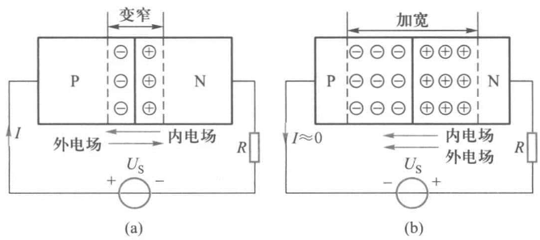</img>

$PN$结具有单向导电的特性。$PN$结两侧外加正电压($P$区一侧接外电源的正极，$N$区一侧接负极)，也称为**正向偏置**。$PN$结导通时呈现的电阻称为正向电阻，其数值很小，一般为几欧到几百欧。

$PN$结外加反向电压，也称为**反向偏置**。可以认为$PN$结基本上不导电，处于截止状态。此时的电阻称为反向电阻，其数值很大，一般为几千欧到十几兆欧。
### 三极管
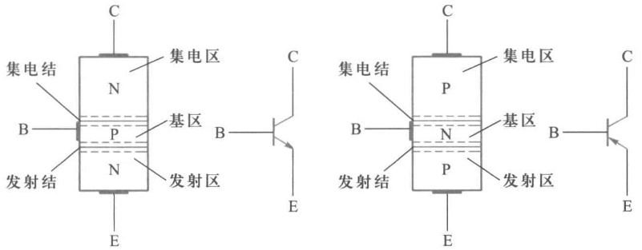</img>

$$I_E=I_C+I_B$$
由于晶体管制成后其内部尺寸和杂质浓度是确定的，所以发射区所发射的电子在基区复合的百分数和被集电极收集的百分数大体上是确定的。
即$I_C$和$I_B$分别占$I_E$的一定比例

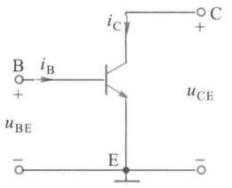</img>

基极是输入端，基极电流为$i_B$，基极和发射极之间的电压为$u_{BE}$，集电极是输出端，集电极电流为$i_C$，电极和发射极之间的电压为$u_{CE}$

**如下是晶体管的输入和输出特性曲线**
根据晶体管的工作状态，输出特性可分为三个区域
1. 截止区。**发射结和集电结均处于反向偏置。**$I_B=0$时的$i_C-u_{CE}$曲线以下的区域称为截止区。$I_B=0$时的集电极电流用$I_{CEO}$表示。$I_{CEO}$很小，若忽略不计，则集电极和发射极之间相当于开路，即晶体管相当于一个处于断开状态的开关。
2. 饱和区。**发射结和集电结均为正向偏置**。下右图中虚线以左的区域为饱和区，此区域内所有不同$I_B$的特性曲线几乎是重合的.
   当$u_{CE}<u_{BE}$时，集电结处于正向偏置，晶体管处于饱和状态。$u_{CE}=u_{BE}$时的状态称为临界饱和。
3. 放大区 **发射结正向偏置、集电结反向偏置**在。这里$I_C$主要由$I_B$控制

#### 电流放大系数$\beta$
$$\beta=\frac{I_C-I_{CEO}}{I_B}\approx\frac{I_C}{I_B}$$
### 简化的小信号模型
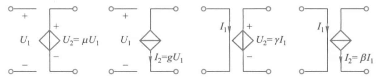
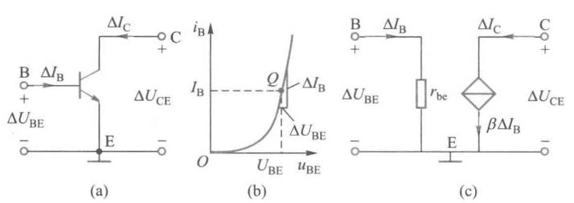</img>

常温下小功率晶体管的动态电阻
$$r_{be}=r_b+(1+\beta)\frac{26}{I_E}=r_b+\frac{26}{I_B}$$
式中$r_b$为基区电阻，在$I_E<5mA$时$r_b$约为$200\Omega$
### MOS管（场效晶体管）
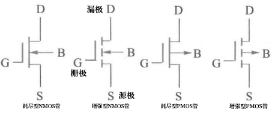</img>

#### 特性曲线
$MOS$管的栅极是绝缘的，栅极电流$I_G\approx 0$。$I_D$和$U_{DS},U_{GS}$之间的关系可以用输出特性和转移特性来表示。
 
 

##### 输出特性
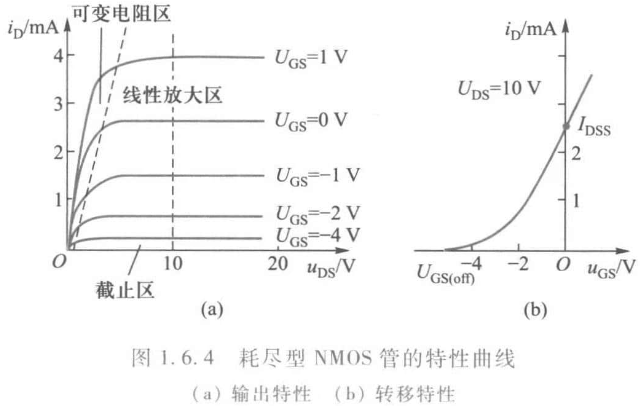</img>

输出特性指的是$u_{GS}$为参变量时$i_D$和$u_{DS}$之间的关系。输出特性曲线也称为漏极特性曲线。它是以$u_{GS}$为参变量的一族曲线。

当$u_{DS}$较小时，在一定的$u_{GS}$下，$i_D$几乎随$u_{DS}$的增大而线性增大。$i_D$增长的斜率取决于$U_{GS}$的大小。在这个区域内$MOS$管$D,S$间可看作一个受$u_{GS}$控制的可变电阻，故称为可变电阻区。

当$u_{DS}$增大时，$i_D$几乎不随$u_{DS}$的增大而变化，但在一定的$u_{DS}$下$i_D$随$u_{GS}$的增加而增长，故这个区域称为线性放大区或恒流区，场效晶体管用于放大时就工作在这个区域

当$u_{GS}$负向增大到某一数值时，$i_D\approx 0$称为场效晶体管处于夹断状态（即截止）。
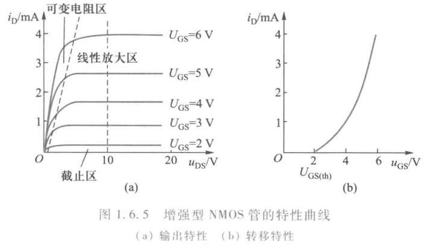</img>

通常定义$i_D$为某一微小电流（几十微安）时的栅源电压为栅源夹断电压$U_{GS(off)}$
##### 转移特性
耗尽型MOS管$u_{GS}=0$时的漏极电流用$I_{DSS}$表示，称为饱和漏极电流

在$u_{GS}>U_{GS(off)}$的范围内，转移特性可以近似表示为
$$I_D=I_{DSS}\left(1-\frac{U_{GS}}{U_{GS}(off)}\right)^2$$

增强型MOS管使用时必须施加一定的$u_{GS}$才会导电。使漏极和源极之间开始有电流流过的栅源电压称为开启电压$U_{GS(th)}$。通常把$|I_D|=10mA$时的$U_{GS}$的值规定为开启电压。
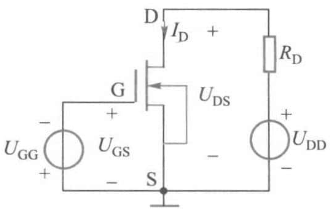</img>

PMOS管电流与电压方向与NMOS管不同。以增强型PMOS管为例，它的漏极电源，栅极电源的极性均和增强型NMOS管相反，故其转移特性在第三象限。也就是说,增强型PMOS管漏极和源极间要加负极性电源$(U_{DS}<0)$，栅极电位比源极电位低$|U_{GS(th)}|$$(U_{GS}<-U_{GS(th)})$时，管子才导通，电流从源极流向漏极。
#### 简化的小信号模型
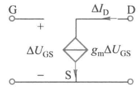</img>

场效晶体管的输出特性曲线在线性放大区内比较平坦，可以近似地认为是一族和横轴平行的直线，故$I_D$仅受$U_{GS}$控制，与$U_{DS}$无关。$$\Delta I_D = g_m\Delta U_{GS}$$
由于 MOS 管的栅源输入电阻很大，故可认为 G、S 间是开路的。
## 第二章 电路分析基础
### 等效电源定理
在电路分析计算中，常常会碰到这样的情况：只需知道一个二端网络对电路其余部分（外电路）的影响，而对二端网络内部的电压电流情况并不关心。这时希望用一个最简单的电路（等效电路）来替代复杂的二端网络，使计算得到简化。
#### 戴维南定理
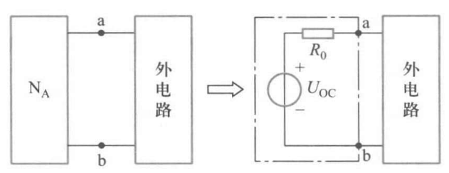</img>

对外电路来说,一个线性有源二端网络可用一个电压源和一个电阻串联的电路来等效，该电压源的电压等于此有源二端网络的开路电压$U_{OC}$，串联电阻等于此有源二端网络除去独立电源（将电压源短路，电流源断路）后在其端口处的等效电阻$R_0$
当有源二端网络中含有受控源时，除去独立电源以后，受控源仍保留在网络中，这时应该用以下方法：
要求出有源二端网络的开路电压$U_{OC}$和短路电流$I_{SC}$，显然有
$$R_0=\frac{U_{OC}}{I_{SC}}$$
#### 诺顿定理
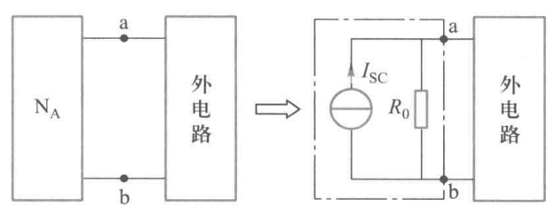</img>

对外电路来说，一个线性有源二端网络可用一个电流源和一个电阻并联的电路来等效，该电流源的电流等于此有源二端网络的短路电流$I_{SC}$，并联电阻等于此有源二端网络除去独立电源后在其端口处的等效电阻$R_0$。
含有受控源的时候与戴维南定理同理。
### 正弦交流电路
#### 相量表示法
设有个正弦电压为$u=\sqrt 2\sin(\omega t+\varphi)$，那么相量法表示该电压即为$\dot{U}=U\angle\varphi$，这里$U$表示正弦电压的有效值。
**只有在各个正弦量均为同一频率时，各正弦量变换成相量进行运算才有意义。**
#### 电阻
$$\dot{U}=R\dot{I}$$
#### 电感
$$\dot{U}=jX_L\dot{I}$$
其中$X_L=\omega L=2\pi fL$，称为感抗。$X_L$是电压有效值与电流有效值之比，而不是它们的瞬时值之比。当电流的频率为零即直流时，感抗为零，故电感在直流稳态时相当于短路。
#### 电容
$$\dot{U}=-jX_C\dot{I}$$
其中$X_C=\frac{1}{\omega C}=\frac{1}{2\pi fC}$，称为容抗。对于一定的$C$来说，频率越高 ，则容抗越小，对正弦电流的“阻止”能力越弱，即意味着高频电流容易通过电容。直流时频率为零，容抗为无穷大，故电容在直流电路处于稳定状态时不能通过电流,相当于开路。
#### 阻抗
欧姆定律的相量形式
$$\dot{U}=Z\dot{I}$$
$Z$称为阻抗
$$Z=R+j(X_L-X_C)$$
阻抗的模$|Z|=\sqrt{R^2+(X_L-X_C)^2}$称为阻抗模
辐角$\varphi=\arctan\left(\dfrac{X_L-X_C}{R}\right)$称为阻抗角
#### 基尔霍夫的相量形式
KCL的相量形式为
$$\sum\dot{I}=0$$
在电路任一节点上的电流相量代数和为零。

KVL的相量形式为
$$\sum\dot{U}=0$$
沿任一回路，各支路电压相量的代数和为零。

#### 例题2.1
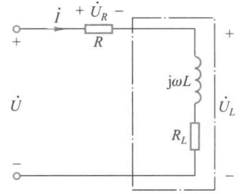</img>

有时为了测量电感线圈的电感和电阻,将它和一个电阻$R$串联后接在工频交流电源上,如右图所示。现测得$U=220V,U_R=79V,U_L=193V,I=0.4A$。试求线圈的电阻$R_L$和电感$L$。
 
 
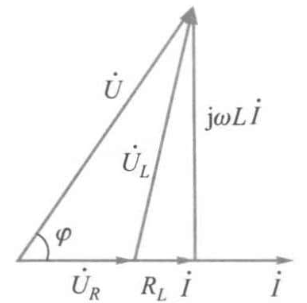</img>

以电流为参考相量作出电路的相量图。
$$\cos\varphi =\frac{U^2+U_R^2-U_L^2}{2UU_R}=0.5,\varphi=60^\circ$$
由$U\sin\varphi=\omega LI$，可知
$$L=\frac{U\sin\varphi}{\omega I}=1.517H$$
又由$U_R+R_LI=U\cos\varphi$，可知
$$R_L=\frac{U\cos\varphi-U_R}{I}=77.5\Omega$$
#### 例题2.2

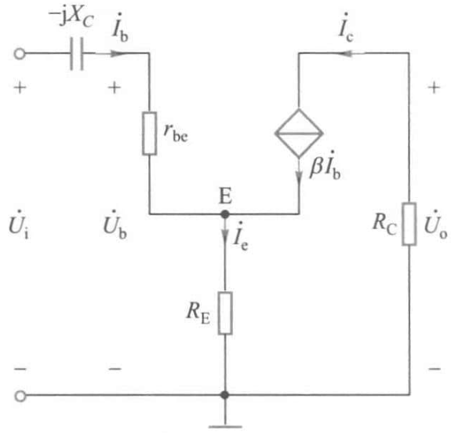</img>

如右图所示电路中含有一个晶体管的小信号模型。已知$r_{be}=700\Omega,\beta=30,R_E=30\Omega,R_C=2.4k\Omega,C=5\mu F,\dot{U}_i=20\angle0^\circ mV$，求外加信号$u_i$的频率为$1000Hz$时的$\dot{U}_b$和$\dot{U}_o$

$f=1000Hz$时
$$X_C=\frac{1}{2\pi fC}=31.8\Omega$$

$$\dot{I_e}=\dot{I_b}+\beta\dot{I_b}=(1+\beta)\dot{I}_b$$

$$\dot{U}_i=(r_{be}-jX_C)\dot{I}_b+R_E\dot{I}_e =1630.3\angle-1.1^\circ \dot{I}_b$$

$$\dot{I}_b=12.27\times10^{-6}\angle1.1^\circ$$

$$\dot{U}_b=[r_{be}+(1+\beta)R_E]\dot{I}_b=0.02\angle1.1^\circ$$

$$\dot{U}_o=-R_C\dot{I}_c=-\beta R_C\dot{I}_b=0.88\angle-178.9^\circ$$
#### 瞬时功率
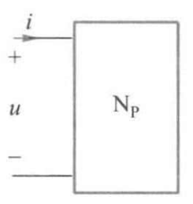</img>

设如右图所示的无源二端网络的电流和电压分别为$i=\sqrt2I\sin\omega t和u=\sqrt 2U\sin(\omega t + \varphi)$
$$p=ui=UI\cos\varphi(1-\cos2\omega t)+UI\sin\varphi\sin2\omega t$$
#### 有功功率
电路中的电感和电容并不消耗功率,只是起能量吞吐作用。电路中的平均功率等于电阻所消耗的功率，因此平均功率又称为有功功率。
对于正弦电路，其平均功率
$$P=UI\cos\varphi$$
$\cos\varphi$称为功率因数(用$\lambda$表示)，$\varphi$称为功率因数角
#### 无功功率
无功功率为正弦交流电路中储能元件与电源进行能量交换的瞬时功率最大值，单位为乏（var）
$$Q=UI\sin\varphi$$
感性无功功率与容性无功功率可以相互补偿，故有
$$Q=Q_L-Q_C$$
#### 视在功率
电路的电压有效值与电流有效值的乘积，称为电路的视在功率，用S表示：
$$S=UI$$
单位为伏·安$(V\cdot A)$。视在功率通常用来表示电源设备的容量。
由上可知，交流电路中的有功功率、无功功率和视在功率三者的关系为
$$P=S\cos\varphi,Q=S\sin\varphi,S=\sqrt{P^2+Q^2}$$
#### 功率因数的提高
由于工业上大量的设备均为感性负载，因此常采用并联电容器的方法来提高功率因数。
#### 例题2.3
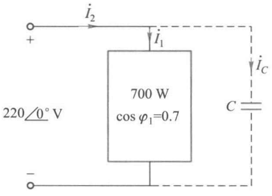</img>

一台单相异步电动机接到$50Hz,220V$的供电线路上，如右图所示。电动机吸收有功功率$700W$,功率因数$\lambda_1=\cos\varphi_1=0.7$（电感性）。今并联一电容器使电路的功率因数提高至$\lambda_2=\cos\varphi_2=0.9$,求所需电容量。

由$\cos\varphi_1=0.7,\cos\varphi_2=0.9$知$\tan\varphi_1=1.02,\tan\varphi_2=0.484$
未接入电容时$P,Q$之间的关系是  
$Q_L=UI\sin\varphi_1=UI\cos\varphi_1\tan\varphi_1=P\tan\varphi_1$
接入电容之后有功功率不变，无功功率$Q=Q_L-Q_C$
$Q=P\tan\varphi_2$
则$Q_C=Q_L-Q=P(\tan\varphi_1-\tan\varphi_2)=375.2var$
又$Q_C=\dfrac{U^2}{X_C}=U^2\cdot2\pi f C$
解得$C=24.7\mu F$
#### 串联谐振
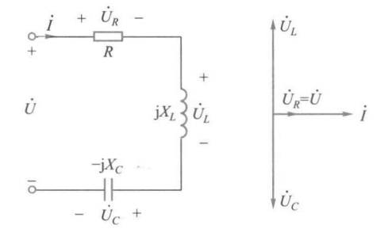</img>

在右图的$RLC$串联电路中，当$X_L=X_C$时$\dot{U}$和$\dot{I}$同相，整个电路呈电阻性，电路的这种工作状态称为串联谐振。

1. 串联谐振时阻抗$Z=R+j(X_L-X_C)=R$最小，在电压一定时，电流有效值最大，即
$$I_0=\frac{U}{R}$$
$I_0$称为串联谐振电流。
2. 设串联谐振时的频率为$f_0$，则$\frac{1}{2\pi f_0 C}=2\pi f_0 L$
$$f_0=\frac{1}{2\pi\sqrt{LC}}$$
3. 串联谐振时的感抗或容抗称为谐振电路的特性阻抗，用$\rho$表示，即
$$\rho=2\pi f_0 L = \sqrt{\frac{L}{C}}$$
4. 通常把串联谐振时$U_L$或$U_C$与$U$之比称为串联谐振电路的品质因数，也称为$Q$值，即
$$Q=\frac{U_L}{U}=\frac{2\pi f_0 L}{R}=\frac{1}{R}\sqrt{\frac{L}{C}}$$
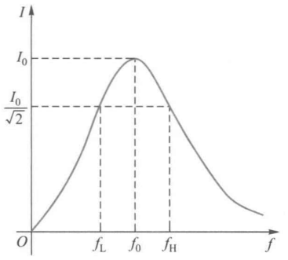</img>

5. 将电源电压有效值不变时电流随频率变化的曲线称为电流谐振曲线。
当$I=\frac{I_0}{\sqrt2}$时在谐振曲线上两个对应点的频率$f_L$和$f_H$之间的范围，称为电路的通频带$f_{BW}$，通频带与品质因数的关系为
$$f_{BW}=f_H-f_L=\frac{f_0}{Q}$$
因此通频带的大小与品质因数$Q$有关。$Q$越大，通频带宽度越小，谐振曲线越
尖锐，电路对频率的选择性越好。
 
 

#### 并联谐振
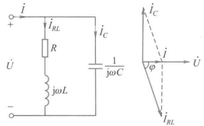</img>

线圈和电容器并联的电路如右图，图中$L$是线圈的电感，$R$ 是线圈的电阻。当电路中的总电流$\dot{I}$和总电压$\dot{U}$同相时，称为并联谐振。
电路的总电流$\dot{I}$为
$$\begin{align*}
\dot{I} &= \dot{I_{RL}} + \dot{I}_C\\
&=\frac{\dot{U}}{R+j2\pi fL}+\frac{\dot{U}}{-j\frac{1}{2\pi fC}}\\
&=\left[\frac{R}{R^2+(2\pi fL)^2}-j\left(\frac{2\pi fL}{R^2+(2\pi fL)^2}-2\pi fC\right)\right]
\end{align*}$$
1. 设并联谐振时的频率为$f_0$，谐振时括号内的虚部为零，即
$$\frac{2\pi f_0L}{R^2+(2\pi f_0L)^2}-2\pi f_0C=0$$
得
$$f_0=\frac{1}{2\pi\sqrt{LC}}\sqrt{1-\frac{C}{L}R^2}\quad \text{(1)}$$
当$R\ll 2\pi f_0L$时可近似表达为
$$f_0\approx\frac{1}{2\pi\sqrt{LC}}$$
2. 并联谐振电路的等效阻抗较大且具有纯电阻性质，由式(1)可知其等效阻抗
$$Z_0=\frac{\dot{U}}{\dot{I}}=\frac{R^2+(2\pi f_0 L)^2}{R}\overset{(1)}{=}\frac{L}{RC}$$
1. 电路中的总电流很小。
### 三相交流电路
由三个幅值相等、频率相同、相位互差$120^\circ$的单相交流电源所构成的电源,称为三相电源。由三相电源构成的电路，称为三相电路。
#### 三相交流电源
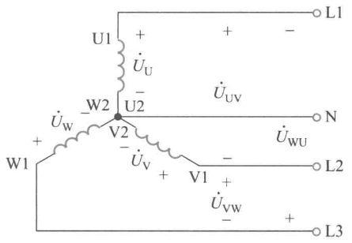</img>

三个绕组的连接点称为中性点或零点。从中性点引出的导线，称为中性线或零线，有时中性线接地。中性线用字母$N$表示。三相绕组的三个始端引出的线称为相线或端线，又称为火线。引出中性线的电源称为三相四线制电源，其供电方式称为三相四线制。不引出中性线的供电方式，称为三相三线制。
三相电源相电压的相量表达式
$$
\begin{align*}
\left\{
\begin{array}{l}
\dot{U}_U = U_P \angle 0^\circ \\
\dot{U}_V = U_P \angle -120^\circ \\
\dot{U}_W = U_P \angle -240^\circ
\end{array}
\right.
\end{align*}$$
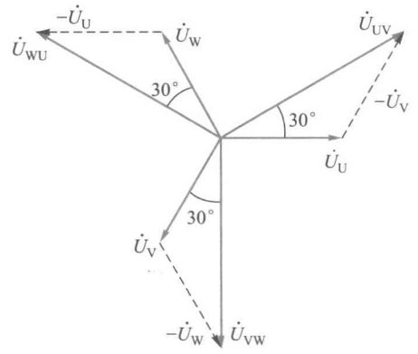</img>

$U_P$为相电压有效值。
相线之间的电压$\dot{U}_{UV}、\dot{U}_{VW}、\dot{U}_{WU}$称为线电压，他们的有效值用$U_L$表示。
$$
\begin{align*}
\left\{
\begin{array}{l}
\dot{U}_{UV} = \sqrt3 U_P \angle 30^\circ \\
\dot{U}_{VW} = \sqrt3 U_P \angle -90^\circ \\
\dot{U}_{WU} = \sqrt3 U_P \angle -210^\circ
\end{array}
\right.
\end{align*}$$
三个线电压有效值相等，都等于$\sqrt 3$倍的相电压，即$U_L=\sqrt3 U_P$，在相位上分别超前于相应相电压$30^\circ$
#### 负载星形联结
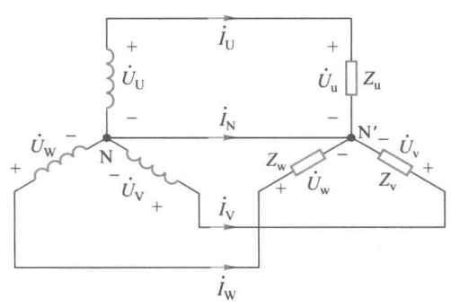</img>

当各相负载阻抗的模与阻抗角完全相等，即$Z_u=Z_v=Z_w$时，称为对称负载，此时中性线电流为0，三相绕组对称。

若三相负载中至少有一相负载阻抗的模或阻抗角与其他相不相等，称为不对称负载。

在有中性线时，每相的负载电压等于电源的相电压。

若中性线断开，负载中性点$N'$与电源中性点$N$的电位不相等，由基尔霍夫定律
$$
\begin{align*}
\left\{
\begin{array}{l}
\dot{I}_U+\dot{I}_V+\dot{I}_W=0 \\
\dot{U}_U=Z_u\dot{I}_U+\dot{U}_{N'N}\\
\dot{U}_V=Z_v\dot{I}_V+\dot{U}_{N'N}\\
\dot{U}_W=Z_w\dot{I}_W+\dot{U}_{N'N}\\
\end{array}
\right.
\end{align*}$$
可得
$$\dot{U}_{N'N}=\frac{\displaystyle\frac{\dot{U}_U}{Z_u}+\frac{\dot{U}_V}{Z_v}+\frac{\dot{U}_W}{Z_w}}{\displaystyle\frac{1}{Z_u}+\frac{1}{Z_v}+\frac{1}{Z_w}}$$
#### 例题2.4
</img>

如图所示的三相电路中，已知电源$\dot{U}_U=220\angle0^\circ V,\dot{U}_V=220\angle-120^\circ,\dot{U}_W=220\angle{-240^\circ}$，各负载的额定电压为$220V$求：
(1) 当$Z_u=Z_v=Z_w=22\Omega$时，各相及中性线电流。
(2) $Z_u=22\Omega,Z_v=44\Omega,Z_w=88\Omega$时各相及中性线电流。
(3) 负载阻抗与(2)相同，中性线$N'N$断开，各相负载实际承受的电压。

(1) 根据对称关系，可得
$$\dot{I}_u=\frac{\dot{U}_u}{Z_u}=10\angle0^\circ A,\dot{I}_v=10\angle-120^\circ A,\dot{I}_w=10\angle-240^\circ A,\dot{I}_N=0$$
(2) 
$$\dot{I}_u=\frac{\dot{U}_u}{Z_u}=10\angle0^\circ A,\dot{I}_v=\frac{\dot{U}_v}{Z_v}=5\angle-120^\circ A,\dot{I}_w=\frac{\dot{U}_w}{Z_w}=2.5\angle-240^\circ A$$
$$\dot{I}_N=-(\dot{I}_u+\dot{I}_v+\dot{I}_w)=6.61\angle160.9^\circ A$$
(3)
$$\dot{U}_{N'N}=\frac{\displaystyle\frac{\dot{U}_U}{Z_u}+\frac{\dot{U}_V}{Z_v}+\frac{\dot{U}_W}{Z_w}}{\displaystyle\frac{1}{Z_u}+\frac{1}{Z_v}+\frac{1}{Z_w}}=83.15\angle-19.1^\circ V$$
$$\dot{U}_u=\dot{U}_U-\dot{U}_{N'N}=144.0\angle10.9^\circ V$$
$$\dot{U}_v=\dot{U}_V-\dot{U}_{N'N}=249.4\angle-139.1^\circ V$$
$$\dot{U}_w=\dot{U}_W-\dot{U}_{N'N}=288.0\angle130.9^\circ V$$
由计算结果可见,各相负载电压中,$U_u$远低于额定电压,而$U_v、U_w$远高于额定电压,这使得各相负载不能正常工作,甚至损坏,这是不允许的。因此在三相电路中,星型不对称负载必须要有中性线,且中性线上不允许装熔断器。

#### 负载三角形联结
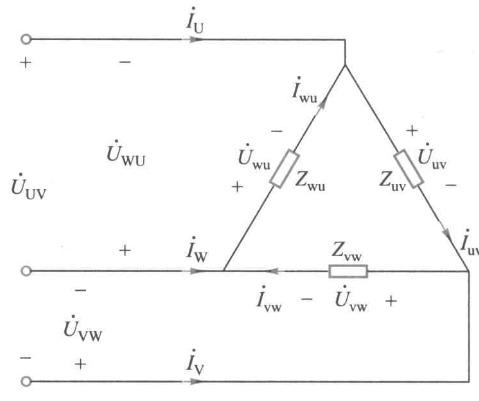</img>

右图是负载作三角形联结时的三相电路,此时负载的相电压等于电源的线电压,即$U_p=U_L$。从图中可得
$$
\begin{align*}
\left\{
\begin{array}{l}
\dot{I}_{uv} = \dfrac{\dot{U}_{UV}}{Z_{uv}} \\
\dot{I}_{vw} = \dfrac{\dot{U}_{VW}}{Z_{vw}} \\
\dot{I}_{wu} = \dfrac{\dot{U}_{WU}}{Z_{wu}} 
\end{array}
\right.
\end{align*},\begin{align*}
\left\{
\begin{array}{l}
\dot{I}_{U} = \dot{I}_{uv}-\dot{I}_{wu} \\
\dot{I}_{V} = \dot{I}_{vw}-\dot{I}_{uv} \\
\dot{I}_{W} = \dot{I}_{wu}-\dot{I}_{vw} 
\end{array}
\right.
\end{align*}$$
其中$\dot{I}_{uv},\dot{I}_{vw},\dot{I}_{wu}$称为相电流，$\dot{I}_{U},\dot{I}_{V},\dot{I}_{W}$称为线电流。
 
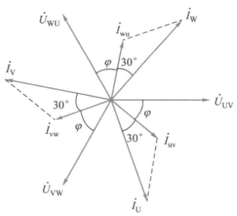</img>

如果负载是对称的，即$Z_{uv}=Z_{vw}=Z_{wu}=Z$，则各相电流的大小相等，相位差依次互为$120^\circ$。设$\dot{U}_{UV}=U_{UV}\angle 0^\circ$，并设负载是感性的，即$Z=|Z|\angle\varphi$，画出相量图如右图所示。
在数值上，线电流等于相电流的$\sqrt 3$倍，即$I_L=\sqrt 3 I_P$.相位上线电流落后对应相电流$30^\circ$
#### 三相电路的功率
三相电路的有功功率等于各相有功功率之和。因为三相电路中测量线电压和线电流比较方便，所以三相功率通常不用相电压和相电流表示。通常所说的三相电压和三相电流都是指线电压和线电流值。

当三相负载对称时，各相有功功率相同，设每相相电压为$U_p$，相电流为$I_p$，线电压为$U_L$，线电流为$I_L$,相电压和相电流的相位差为$\varphi$。当负载为星形联结时，$U_p=\dfrac{U_L}{\sqrt3},I_p=I_L$，三角形联结时，$U_p=U_L,I_p=\dfrac{I_L}{\sqrt3}$，因而在两种情况下
$$P=3U_PI_P\cos\varphi=\sqrt3U_LI_L\cos\varphi$$
同样，对称三相负载的无功功率也等于各相无功功率之和,
$$Q=3U_PI_P\sin\varphi=\sqrt3U_LI_L\sin\varphi$$
对称三相负载的视在功率为
$$S=\sqrt{P^2+Q^2}=\sqrt3U_LI_L
$$
### 非正弦交流电路
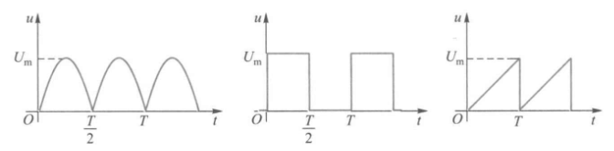
对于非正弦线性电路，通常是将非正弦周期信号进行分解，然后利用叠加定理进行分析计算。
$a_0$称为直流分量，$A_{1m}\sin(k\omega t+\varphi_1)$称为一次谐波或基波，$k=2,3,4,...$的项分别称为二、三、四...次谐波，除直流分量和一次谐波外，其余的统称为高次谐波。
将非正弦周期信号傅里叶展开
$$f(t)=a_0+\sum^\infty_{k=1}A_{km}\sin(k\omega t+\varphi_k)$$
对全波整流电压：
$$u\left( t \right)=\frac{4U_m}{\pi}\biggl(\frac{1}{2}-\frac{1}{3}\cos 2\omega t-\frac{1}{15}\mathrm{cos} 4\omega t-\frac{1}{35}\mathrm{cos} 6\omega t-\cdots\biggr)$$
对方波电压：
$$u\left( t \right)=\frac{U_m}{2}+\frac{2U_m}{\pi}\Bigg(\sin \omega t+\frac{1}{3}\sin 3\omega t+\frac{1}{5}\sin 5\omega t+\cdots\Bigg)$$
对锯齿波电压：
$$u\left( t \right)=\frac{U_{m}}{2}-\frac{U_{m}}{\pi}\Bigg(\sin \omega t+\frac{1}{2}\sin 2\omega t+\frac{1}{3}\sin 3\omega t+\cdots\Bigg)$$
周期信号的有效值等于其直流分量及各次谐波有效值平方和的平方根，而与
各次谐波的初相位无关。
$$U=\sqrt{\sum^\infty_{k=0}U_k^2}$$
### 一阶电路的瞬态分析
#### 换路定律
1. 换路前后，电容上的电压不能突变，即
$$u_C(0^+)=u_C(0^-)$$
2. 换路前后，电感上的电流不能突变,即
$$i_L(0^+)=i_L(0^-)$$
#### RC电路的瞬态分析
一阶$RC$电路求电容电压的通式
$$u_C(t)=u_C(\infty)+[u_C(0^+)-u_C(\infty)]e^{-\frac{t}{\tau}}\quad(t>0,\tau=RC)$$
在一阶$RC$电路中，其他支路电压或电流的全解也是上式的形式，可改写为一般形式。若换路发生在$t=t_0$时刻
$$f(t)=f(\infty)+[f(t_0^+)-f(\infty)]e^{-\frac{t-t_0}{\tau}}\quad(t>t_0,\tau=RC)$$
#### RL电路的瞬态分析
一阶$RL$电路求电感电流表达式的通式
$$i_L(t)=i_L(\infty)+[i_L(0^+)-i_L(\infty)]e^{-\frac{t}{\tau}}\quad(t>0,\tau=\frac{L}{R})$$
在一阶$RC$电路中，其他支路电压或电流的全解。若换路发生在$t=t_0$时刻
$$f(t)=f(\infty)+[f(t_0^+)-f(\infty)]e^{-\frac{t-t_0}{\tau}}\quad(t>t_0,\tau=\frac{L}{R})$$
## 第三章 分立元件基本电路
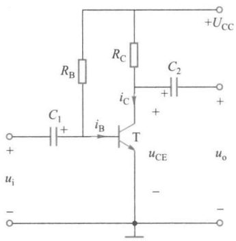</img>

### 共发射极放大电路
#### 电路组成
 
 
 
 
 
 

#### 静态分析
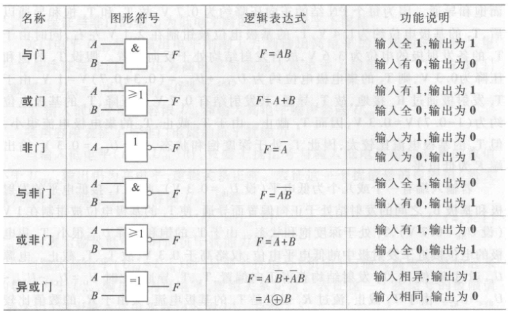</img>

当放大器没有输入信号（$u_i= 0$）时，电路中各处的电压 、电流都是直流恒定值，称为直流工作状态或静止状态，简称静态。
在静态时，由于电容$C_1,C_2$的隔直作用.因此只要考虑$C_1,C_2$之间的电路。为分析方便，把直流电源$U_{CC}$分别画于输入电路和输出电路中。如右图。

对输入电路，其电压方程为
$$U_{BE}=U_{CC}-I_BR_B$$

$I_B$和$U_{BE}$的关系是一条直线（称为偏置线）。另一方面，$I_B$和$U_{BE}$的关系又要符合晶体管的输入特性曲线。
 
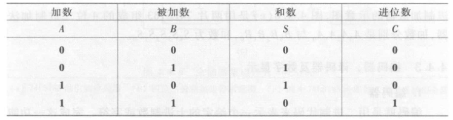</img>

故偏置线和输入特性曲线的交点$Q_B$就称为输入电路的静态工作点，如图(a)所示。

同理$I_C$和$U_{CE}$的关系是一条直线（称为负载线）
$$U_{CE}=U_{CC}-I_CR_C$$
负载线与基极电流$I_B$所对应的晶体管输出特性曲线交点$Q_C$就是输出电路的静态工作点 
#### 动态分析
为了便于区分，通常直流分量**用大写字母和大写下标表示**，交流分量**用小写字母和小写下标表示**，总的电压、电流瞬时值**用小写字母和大写下标表示**
##### 输入电路的图解
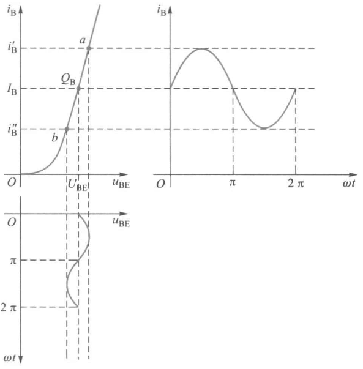</img>

$$u_{BE}=U_{BE}+u_i\\i_B=I_B+i_b$$
即$u_{BE},i_B$可人为视为由直流分量$U_{BE},I_B$和交流分量$u_{be}$（即$u_i$）$,i_b$组成。其中，直流分量就是上述**静态工作点**，而交流分量则是输人信号$u_i$引起的。
 

* 由于输人特性曲线的非线性，故只有在动态范围较小时，才可认为$i_b$, 随$u_i$按正弦变化

 
 
 
 

##### 输出电路的图解
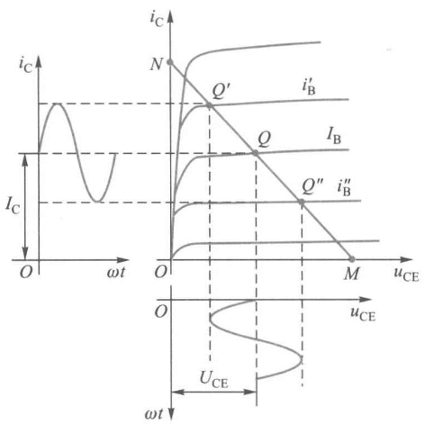</img>

由于电容的隔直和交流耦合作用，$u_{CE}$中的直流分量$U_{CE}$被电容$C_2$隔断，而交流分量$u_{ce}$则可经$C_2$传送到输出端，故输出电压
$$u_o=u_{CE}-U_{CE}=u_{ce}$$
同理$$u_{CE}=U_{CE}+u_{ce}\\i_C=I_C+i_c$$
 
 
 

##### 电路的交流通路
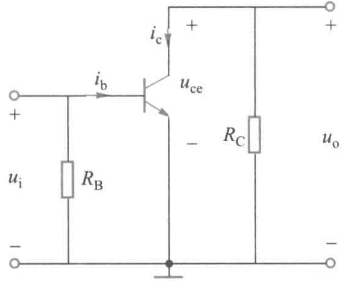</img>

如果忽略耦合电容$C_1,C2$对交流分量的容抗和直流电源$U_{CC}$的内阻，即认为$C_1,C_2$和**直流电源**对交流信号不产生压降，可视为**短路**，就可以画出只考虑交流量传递路径的交流通路
$$u_{ce}=-R_Ci_c$$
 
 

##### 失真
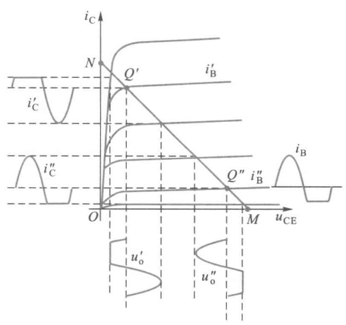</img>

如果静态工作点选得过高，在$u_i$的正半周，晶体管很快进入饱和区，输出波形就产生失真，这种失真称为饱和失真。如图中的$i_C'$和$u_o'$波形
如果静态工作点选得过低，在$u_i$的负半周，晶体管进入截止区，这种失真称为截止失真。如图中的$i_C''$和$u_o''$波形

##### 总结
1. 输入信号时，晶体管的电流、电压都是直流量。当放大电路输入信号电压后，$i_B,i_C$和$u_{CE}$都在原来静态值的基础上叠加了一个交流量。它们的方向是始终不变的
2. 输出电压$u_o$为与$u_i$同频率的正弦波，且输出电压$u_o$的幅度比输入电压$u_i$大得多
3. 电流$i_b,i_c$与输入电压$u_i$同相，而输出电压$u_o$与输入电压$u_i$反相，即共发射极放大电路具有倒相作用。
4. 静态工作点的选择必须合适。
#### 微变等效电路分析法
当放大电路的输入信号较小，且静态工作点选择合适时，晶体管的工作情况接近于线性状态，电路中各电流、电压的波形基本上是正弦波，因而可以把晶体管这个非线性元件组成的电路当作线性电路来处理，这就是微变等效电路分析法。
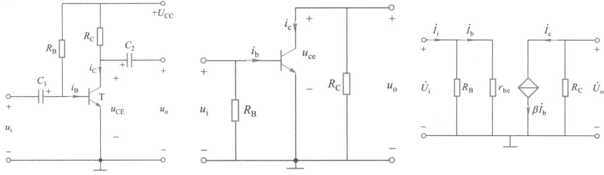
对左图所示的共发射极放大电路，它的交流通路如中间图所示，再把晶体管用小信号模型来代替，就可得到微变等效电路，如右图所示。
下面对电路的动态指标做定量分析。
##### 电压放大倍数$A_u$
放大电路输入正弦信号时，可表示为
$$A_u=\frac{\dot{U}_o}{\dot{U_i}}$$
对于共发射极放大电路，由上图所示的微变等效电路可得输入电压$\dot{U}_i=r_{be}\dot{I}_b$，输出电压$\dot{U}_o=-R_C\dot{I}_c=-\beta R_C\dot{I}_b$，因此电压放大倍数
$$A_u=\frac{\dot{U}_o}{\dot{U}_i}=\frac{-\beta R_C \dot{I}_b}{r_{be}\dot{I}_b}=-\frac{\beta R_C}{r_{be}}$$
式中，负号表示输出电压$\dot{U}_o$和$\dot{U}_i$反相
若负载端接上电阻$R_L$，则上式中的$R_C$就应该变为$R_C//R_L$，可知接上负载后，电压放大倍数将下降。
##### 输入电阻$r_i$
当输入信号电压加到放大电路的输入端时，放大电路就相当于信号源的一个负载电阻，这个负载电阻就是放大电路本身的输入电阻。在输入正弦信号时
$$r_i=\frac{\dot{U}_i}{\dot{I}_i}$$
由于$$\dot{U}_i=\frac{r_i}{R_S+r_i}\dot{U}_S$$
说明输入电压受到一定的衰减。因此$r_i$是衡量放大电路对输入电压衰减程度的重要指标。
对上述共发射极放大电路，$$r_i=R_B//r_{be}=\frac{R_Br_{be}}{R_Br_{be}}$$
通常$r_{be}\ll R_B$，因此$r_i\approx r_{be}$
##### 输出电阻$r_o$
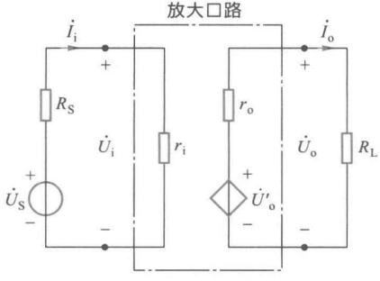</img>

从输出端看，整个放大电路可看成是一个内阻为$r_o$、源电压为$\dot{U}_o'$的电阻
在不知放大器电路结构或电路已知但相当复杂时，往往用实验测量的办法来得到$r_o$。如果在输入端加正弦电压信号.用电压表测得空载时的输出电压$U_o'$和接入已知负载电阻$R_L$时的输出电压$U_o$，则有
$$U_o=\frac{R_L}{r_o+R_L}U_o'$$
也即
$$r_o=\left(\frac{U_o'}{U_o}-1\right)R_L$$
$r_o$越小，接入负载前后输出电压相差越小，亦即放大电路受负载影响的程度越小，所以一般用$r_o$来衡量放大电路带负载的能力。$r_o$越小，则放大电路带负载的能力越强。

共发射极放大电路的输出电阻等于集电极负载电阻$R_C$，即
$$r_o=R_C$$
#### 静态工作点的稳定
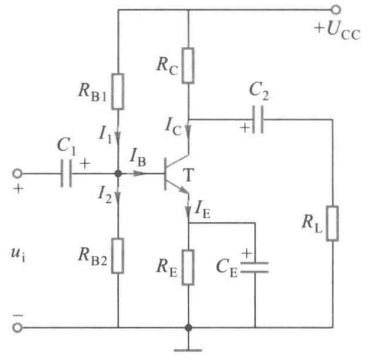</img>

$\beta,I_{CEO},U_{BE}$会随着环境温度而变化，导致电路的静态工作点不稳定，甚至移到不合适的位置使放大电路无法正常工作。

右图是一种常用的静态工作点稳定的放大电路。
##### 例3.1
上图所示电路中，设$U_{CC}=12V,R_{B1}=47k\Omega,R_{B2}=22k\Omega,R_C=3.3k\Omega,R_E=2.2k\Omega,R_L=5.1k\Omega$，晶体管$U_{BE}=0.7V,\beta=80$试求：
(1)电路的静态工作点
(2)电压放大倍数
(3)输入和输出电阻
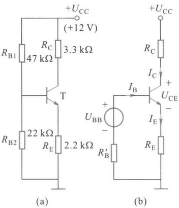</img>

画出直流通路如右图(a)所示
(1)
$R_{B1},R_{B2}$和$U_CC$组成一个有源二端网络。应用戴维南定理，该网络可用一个等效电压源表示，如图(b)
$$U_{BB}=\frac{R_{B2}}{R_{B1}+R_{B2}}U_{CC}=3.83V\\$$
$$R_B'=R_{B1}//R_{B_2}=14.99k\Omega$$
$$U_{BB}=U_{BE}+R_B'I_B+(1+\beta)R_EI_B$$
故$$I_B=\frac{U_{BB}-U_{BE}}{R_B'+(1+\beta)R_E}=0.0162mA$$
$$I_C=\beta I_B=1.30mA$$
$$I_E=I_C+I_B=1.3162mA$$
$$U_{CE}=U_{CC}-I_CR_C-I_ER_E=4.83V$$
输入电阻$$r_{be}=\left[r_{be}=r_b+(1+\beta)\frac{26}{I_E}\right]=1.81k\Omega$$
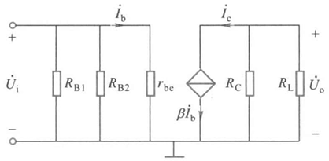</img>

集电极是输入、输出回路的公共端，故称为共集电极电路。
(2)
微变等效电路如右图所示
电路等效负载电阻
$$R_L'=R_C//R_L=2k\Omega$$
电压放大倍数
$$A_u = -\beta \frac{R_L'}{r_{be}}=-88.4$$
(3)
$$r_i=R_{B1}//R_{B2}//r_{be}=1.61k\Omega$$
$$r_o=R_C=3.3k\Omega$$
#### 频率特性
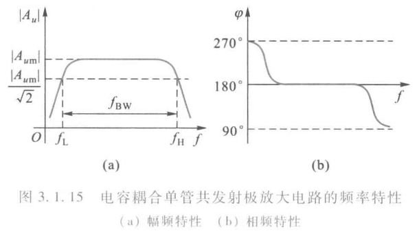
### 共集电极放大电路
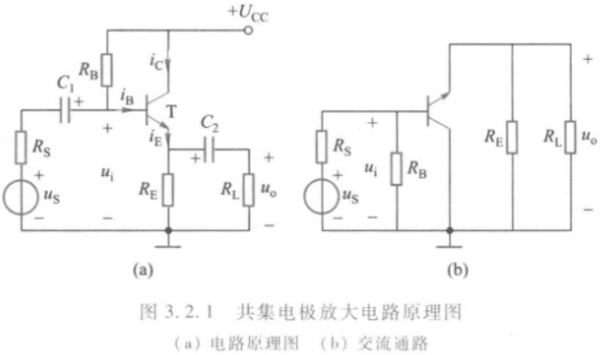</img>

集电极是输入、输出回路的公共端，故称为共集电极电路。由于信号是从发射极输出，所以共集电极电路又称为**射极输出器**。
#### 静态分析
当输入信号$u_i$为零(静态)时，可将图中所示电路中的电容$C_1,C_2$看成断开，中间由晶体管、$R_B$、$R_E$和$+U_{CC}$组成的部分电路即为直流通路，因此可列出确定静态工作点的回路方程
$$U_{CC}=R_BI_B+U_{BE}+R_EI_E=R_BI_B+U_{BE}+(1+\beta)R_EI_B$$
故
$$I_B=\frac{U_{CC}-U_{BE}}{R_B+(1+\beta)R_E}\\I_E=(1+\beta)R_E\\U_{CE}=U_{CC}-R_EI_E$$
#### 微变等效电路
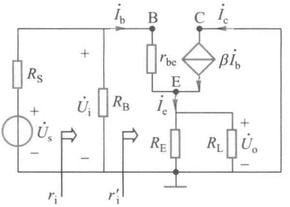</img>

当电路输入交流信号$u_i$(即动态)时，可先画出微变等效电路如右图所示。由微变等效电路可求得电路的电压放大倍数和输入、输出电阻。
##### 电压放大倍数$A_u$
记$R_L'=R_E//R_L$
输入电路回路方程
$$\dot{U}_i=r_{be}\dot{I}_b+R_L'\dot{I}_e=r_{be}\dot{I}_b+(1+\beta)R_L'\dot{I}_b$$
输出电路回路方程
$$\dot{U}_o=(R_L')\dot{I}_e=(1+\beta)R_L'\dot{I}_b$$
所以电压放大倍数
$$A_u=\frac{\dot{U}_o}{\dot{U}_i}=\frac{(1+\beta)R_L'}{r_{be}+(1+\beta)R_L'}$$

1. $A_u>0$，说明输出电压与输入电压同相
2. $A_u<1$，说明电路没有电压放大作用，没有电流放大作用。一般$(1+\beta)R_L'\gg r_{be}$，所以$A_u$接近于1，说明输出电压的大小和输入电压的大小近似相等。也就是说，射极输出器的输出波形与输入波形相同，输出电压总是跟随输入电压而变。因此这种电路也称为**射极跟随器**。
##### 输入电阻$r_i$
电路的输入电阻
$$r_i=\frac{\dot{U}_i}{\dot{I}_i}$$
如上图，$r_i' = \dfrac{\dot{U}_i}{\dot{I}_b}=r_{be}+(1+\beta)R_L'$
$$r_i = R_B//r_i'$$
与共发射极基本放大电路比较，共集电极放大电路的输入电阻要大得多
##### 输出电阻$r_o$
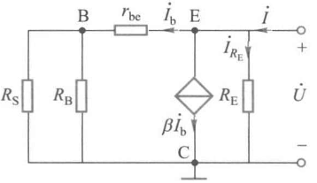</img>

射极输出器的输出电阻可按有源二端网络求除源等效电阻的方法得到。将$\dot{U}_S$短路，同时去除负载电阻$R_L$，在输出端外加一电压$\dot{U}$
记$R_S' = R_S//R_B$
$$\begin{align*}
  \dot{I}&=\dot{I}_{R_E}+\dot{I}_b+\beta\dot{I}_b\\
  &=\frac{\dot{U}}{R_E}+(1+\beta)\frac{\dot{U}}{r_{be}+R_S'}\\
  &=\left(\frac{1}{R_E}+\frac{1+\beta}{r_{be}+R_S'}\right)\dot{U}
\end{align*}$$
从而输出电阻
$$r_o = \frac{\dot{U}}{\dot{I}}=\frac{1}{\dfrac{1}{R_E}+\dfrac{1+\beta}{r_{be}+R_S'}}=R_E//\dfrac{r_{be}+R_S'}{1+\beta}$$
上式说明，射极输出器的输出电阻$r_o$由$R_E$和$\dfrac{r_{be}+R_S'}{1+\beta}$两部分并联组成，后一部分是基极回路电阻折合到发射极回路的等效电阻。通常情况下，$r_{be}+R_S'$较小而且$\beta\gg 1$，故$\dfrac{r_{be}+R_S'}{1+\beta}$很小。因此，射极输出器的输出电阻很小。一般为几十到几百欧

射极输出器的输人电阻高，可减小对信号源电流的吸取，使信号源的负担较轻，因此常用作多级放大电路的输入级；输出电阻低，电压放大倍数随负载的变化小，这说明电路的输出电压稳定，带负载能力强，因此也常用作多级放大电路的输出级。
### 共基极放大电路
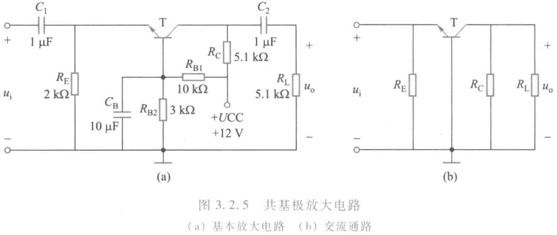</img>

电路只能放大电压信号，不能放大电流。其输出信号与输入信号同相
#### 动态分析
##### 电压放大倍数$A_u$
$$A_u=\frac{\beta R_L'}{r_{be}}$$
##### 输入电阻
$$r_i = R_E//\frac{r_{be}}{1+\beta}$$
##### 输出电阻
$$r_o \approx R_C$$

共基极放大电路的主要优点是晶体管的截止频率比共发射极放大电路提高了$1+\beta$倍，故共基极电路有更高的工作频率，在高频放大电路宽频带放大电路，例如调频收音机或电视系统的射频放大电路中得到广泛的应用。
### 共源极放大电路
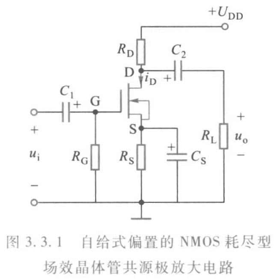</img>

场效晶体管放大电路的偏置电路形式较多，常用的有自给式偏置和分压式自偏置两种。
#### 自给式偏置
##### 静态分析
晶体管放大电路依靠调整基极偏流$I_B$来获得合适的静态工作点；而场效晶体管放大电路是依靠调节栅源之间的偏压$U_{GS}$来获得合适的静态工作点。
由于栅极电阻$R_G$中无电流，因此栅极对地电压$U_G=0$。
而源极对地电压$U_S=R_SI_D$，所以$$U_{GS}=-R_SI_D$$
可见，栅源偏压是由场效晶体管自身的电流提供的，故称**自给式偏置**。
#### 分压式自偏置
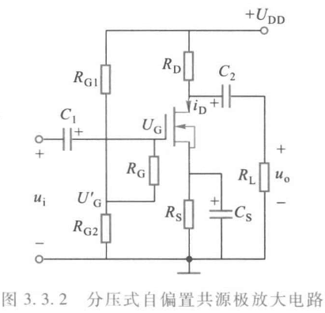</img>

##### 静态分析
$R_G$上无压降
$$U_G=U_{G'}=\frac{R_{G2}}{R_{G1}+R_{G2}}U_{DD}$$
栅源偏压
$$U_{GS}=U_G-U_S=\frac{R_{G2}}{R_{G1}+R_{G2}}U_{DD}-R_S I_D$$
由于NMOS增强型场效晶体管必须使$U_{GS}$大于开启电压才能工作在放大区，因此不能采用自给式偏置。而NMOS耗尽型场效晶体管栅源极之间可以是正偏压，也可以是负偏压，所以两种方式均可采用。
对耗尽型NMOS管的估算，$$I_D=I_{DSS}\left(1-\frac{U_{GS}}{U_{GS}(off)}\right)^2$$
##### 动态分析
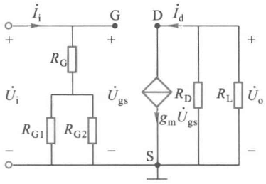</img>

$$\dot{U}_o=-R_L'\dot{I}_d=-g_mR_L'\dot{U}_{gs}$$
记$R_L'=R_L//R_D$
$$\dot{A}_u=\frac{\dot{U}_o}{\dot{U}_i}=\frac{g_mR_L'\dot{U}_{gs}}{\dot{U}_{gs}}=-g_mR_L'$$
$$r_i=\frac{\dot{U}_i}{\dot{I}_i}=R_G + \frac{R_{G1}R_{G2}}{R_{G1}+R_{G2}}$$
$$r_o = R_D$$
### 门电路
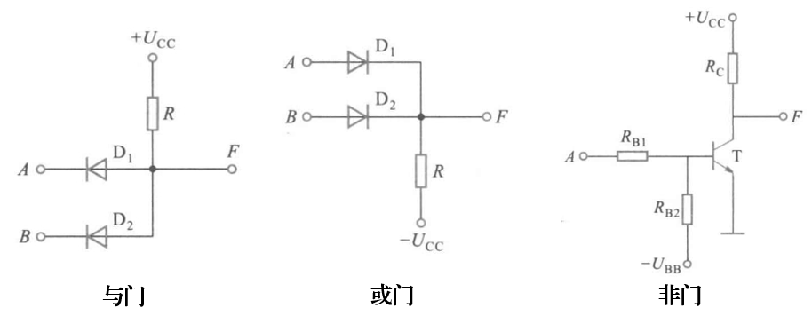
## 第四章
### 逻辑代数运算规则
逻辑代数有三种基本的逻辑运算——与运算($\cdot$)、或运算(+)和非运算($\bar{\quad}$)
#### 自等律
$$A+0=A,A\cdot1=A$$
#### 0-1律
$$A+1=1,A\cdot0=0$$
#### 重叠律
$$A+A=A,AA=A$$
#### 互补律
$$A+\bar{A}=1,A\bar{A}=0$$
#### 交换律
$$AB=BA$$
$$A+B=B+A$$
#### 吸收律
$$A+AB=A,A(A+B)=A,A+\bar{A}B=A+B$$
#### 分配律
$$A(B+C)=AB+AC,A+(BC)=(A+B)(A+C)$$
#### 结合律
$$A(BC)=(AB)C,A+(B+C)=(A+B)+C$$
#### 还原律
$$\overline{\overline{A}}=A$$
#### 反演律
$$\overline{A+B+C} = \bar{A}\bar{B}\bar{C} , \overline{ABC} = \bar{A}+\bar{B}+\bar{C}$$
### 逻辑函数
逻辑函数可以分别用逻辑状态表、逻辑表达式及逻辑图来表示。
### 逻辑状态表
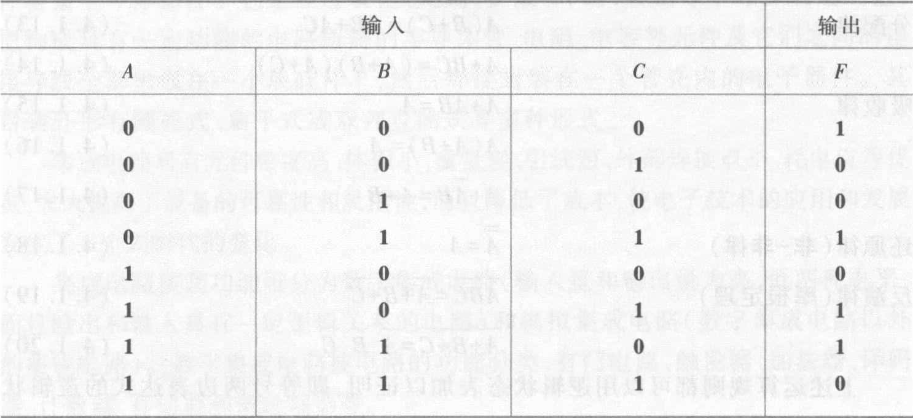
逻辑状态表来比较直观地表示一个逻辑关系
### 逻辑表达式
逻辑状态表中输出等于1的各状态表示成全部输入变量（正变量及反变量）的**与函数**。（例如表中，当$ABC=011$时，$F=1$，可写成$F=\overline{A}BC$，因为$ABC=011$时，只有$\overline{A}BC=1$），并把总输出表示成这些**与项的或函数**。
$$F=\overline{A}BC+A\overline{B}C+AB\overline{C}+\bar{A}\bar{B}\bar{C}$$
代数化简法的实质就是对逻辑函数作等值变换，通过变换，使与非或表达式的与项数目最少，以及在满足与项最少的条件下，每个与项的变量数最少。
#### 合并项法
利用公式$AB+A\bar{B}=A$
$$F=ABC+AB \overline{C}+A \overline{B}=AB ( C+\overline{C} )+A \overline{B}=AB+A \overline{B}=A$$
#### 吸收法
利用公式$A+AB=A$，消去多余项。
$$F=\overline{AB}+\overline{A} C+\overline{B} D=\overline{A}+\overline{B}+\overline{A} C+\overline{B} D\\=\overline{A}\left(\begin{array}{c}1+C\end{array}\right)+\overline{B}\left(\begin{array}{c}1+D\end{array}\right)=\overline{A}+\overline{B}$$
#### 消去法
利用公式$A+\overline{A}B=A+B$，消去多余变量。
$$F=AC+\overline{A}B+B\overline{C}+\overline{B}D=AC+(\overline{A}+\overline{C})B+\overline{B}D\\=AC+\overline{AC}B+\overline{B}D=AC+B+\overline{B}D=AC+B+D$$
#### 配项法
利用$A+{\bar{A}}=1,$可在某一与项中乘以$A+{\bar{A}}$，展开后消去多余项。也可利用$A+A=A$，将某一与项重复配置，分别和有关与项合并，进行化简。
$$\begin{aligned}
\text{F}& =A \overline{C}+\overline{A} C+\overline{B} C+B \overline{C}=A \overline{C} ( B+\overline{B} )+\overline{A} C+\overline{B} C ( A+\overline{A} )+B \overline{C} \\
&=AB \overline{C}+A \overline{B} \overline{C}+A C+A \overline{B} C+A \overline{B} C+B \overline{C} \\
&=B \overline{C} ( A+1 )+A \overline{B} ( \overline{C}+C )+\overline{A} C ( 1+\overline{B} ) \\
&=B \overline{C}+A \overline{B}+\overline{A}C
\end{aligned}$$
#### 例题4.1
试化简逻辑函数
$$F=AB+A\overline{B}+AD+\overline{A}C+BD+ACEF+\overline{B}EF$$

$$\begin{aligned}F&=AB+A\:\overline{B}+AD+\overline{A}C+BD+A\:CEF+\overline{B}EF\\&=A\:(\:B+\overline{B}\:)+AD+\overline{A}C+BD+A\:CEF+\overline{B}EF\\&=A+AD+\overline{A}C+BD+ACEF+\overline{B}EF\\&=A\:(\:1+D+CEF\:)+\overline{A}C+BD+\overline{B}EF\\&=A+\overline{A}C+BD+\overline{B}EF\\&=A+C+BD+\overline{B}EF\end{aligned}$$
### 集成门电路
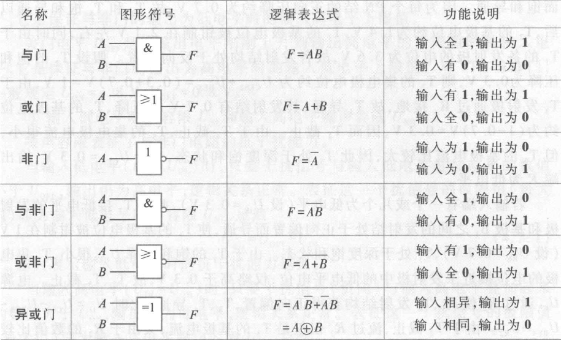
### 组合逻辑电路
#### 半加器
两个 1 位二进制数相加，若不考虑低位来的进位，称为半加器
半加器的逻辑状态表，逻辑图和图形符号
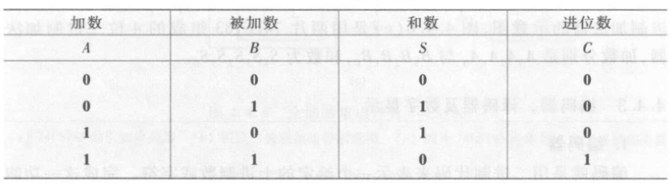

$A,B$是两个相加的数,$C$表示进位数,$S$表示和数。
#### 全加器
两个1位二进制数相加，若考虑低位来的进位，称为全加器
全加器的逻辑状态表和图形符号

其中$A_n,B_n$是本位的加数和被加数，$C_{n-1}$是低位来的进位数，$S_n$为和数，$C_n$为进位数。
#### 编码器
编码就是用二进制代码来表示一个给定的十进制数或字符。完成这一功能的逻辑电路称为编码器。
用二进制代码来表示十进制数，称为二-十进制编码(binary coded decimal,简称 BCD 码)。最常用的一种二-十进制编码是 8421 BCD 码，其编码表如下表所示。

由表可知，这种编码是用一个 4 位二进制数表示一个十进制数。8、4、2、1 分别代表 4 位二进制数从高位到低位各位的权。
#### 译码器
译码是编码的逆过程，即是将代码所表示的信息翻译过来的过程。实现译码功能的电路称为译码器。
将二进制代码翻译成相应信息的电路，称为二进制译码器，其输入是$N$位二进制码，有$N$个输入端，有$2^N$组输入状态，译码器的每一个输出对应于一组输入组合（即一个代码），所以有$2^N$个输出端，通常称为$N$线-$2^N$线译码器
#### 数字显示（略）
 
 
 
 
 
 
 

#### 基本RS触发器
触发器具有0和1两个稳定状态，在触发信号作用下，可以从原来的一种稳定状态转换到另一种稳定状态。触发器的输出状态不仅和当时的输入有关，而且和以前的输出状态有关，这是触发器和门电路的最大区别。
</img>

RS触发器是一种具有两个输入端的触发器，其输入端分别为$R$和$S$，$R$为复位端，$S$为置位端。
当$R=1$时，触发器输出$Q=0$；
当$S=1$时，触发器输出$Q=1$；
当$R=S=1$时，触发器输出$Q$保持不变。

基本RS触发器的逻辑状态转换表和图形符号

  
  

RS触发器的特征：
1. 触发器的输出有两个稳态：$Q=\mathbf{0} ,\overline{Q}=\mathbf{1}$和$Q=\mathbf{1},\overline{Q}=\mathbf{0}$。这种有两个稳态的触发器通常称为双稳态触发器。若令$\overline{S}=\mathbf{1} ,\overline{R}=\mathbf{1}$，触发器的状态就可以保持,说明双稳态触发器具有记忆功能。
2. 利用加于$\overline{R},\overline{S}$端的负脉冲可使触发器由一个稳态转换为另一稳态。加入的负脉冲称触发脉冲。
3. 可以直接置位。当$\overline{R}=\mathbf{0}，\overline{S}=\mathbf{1}$时，$Q=\mathbf{0}$，所以$\overline{R}$端称为置$\mathbf{0}$端或复位端;而$\overline{R}=\mathbf{1},\overline{S}=\mathbf{0}$时，$Q=\mathbf{1}$所以$\overline{S}$端称为置$\mathbf{1}$端或置位端。$\overline{S},\overline{R}$上方的“$\bar{\quad}$”（非号）表示加负脉冲（低电平）时才有这个功能。图形符号中$\overline{S},\overline{R}$靠近方框处的小圆圈也表示该触发器是用低电平触发的。$\overline{Q}$引线靠近方框处的小圆圈表示该端状态和$Q$端相反

基本RS触发器的波形图
#### 同步RS触发器
在数字系统中往往要求触发器的动作时刻和其他部件相一致，这就必须有一个同步信号，以协调触发器和触发器 、触发器和其他数字逻辑部件的动作。同步信号是一种脉冲信号，通常称为时钟脉冲(Clock Pulse,简称CP)
</img>

1. $R,S$端为输入端，$CP$端为时钟脉冲输入端，$\overline{S_d},\overline{R_d}$为直接置位、直接复位端。
2. 图形符号中、方框内文字符号$C1,1S,1R$中的$1$是一种关联标识，表示$C1$和$1S$、$1R$是相互关联的输入，即只有在$C1$是高电平时，$1S$、$1R$才起作用
3. $C1$外引线靠近框处加有一小圆圈，则表示是低电平有效，无小圆圈则表示是高电平有效
4. $\overline{S_d},\overline{R_d}$不受$CP$的控制和$SR$的影响，称为异步输入端，可以使触发器直接置位或复位。当$\overline{S_d}=0,\overline{R_d}=1$时，$Q=1$，直接置位，当$\overline{S_d}=1,\overline{R_d}=0$时，$Q=0$，直接复位。所以$\overline{S_d}$和$\overline{R_d}$分别称为直接置位输入端和直接复位输入端，它们都是低电平或负脉冲时有效。$\overline{S_d}$和$\overline{R_d}$常用来设置所需要的初始状态，一般应在时钟脉冲到来之前设定触发器的初始状态。不作用时，$\overline{S_d}$和$\overline{R_d}$应保持高电平。
5. 只有在$CP=\mathbf{1}$时，触发器状态才会根据$S,R$端的输入而改变。$S$和$R$称为同步输入端

#### D锁存器
这是一个单端输入的触发器，称为同步$D$触发器。又由于它只能用于锁存数据，故通常称为$D$锁存器。
</img>

当$CP=\mathbf{0}$时,$D$输入端被封锁,数据不能传人,$D$锁存器状态不变
当$CP=\mathbf{1}$时，$D$锁存器输出状态由$D$输入端电平决定，若$D=1$则$Q=1$,若$D=0$则 $Q=0$。一旦$CP$重新变为$\mathbf{0}$,$\mathbf{0}$数据就被锁存。

$D$锁存器的逻辑函数表达式（通常称为特性方程）为
$$Q^{n+1}=D$$
#### 正边沿触发的$D$触发器
</img>

在很多情况下（如计数），要求对应于一个时钟脉冲触发器只能翻转一次。用边沿触发的触发器，其次态仅由$CP$上升沿或下降沿到达时输入端的信号决定，而在此以前或以后输入信号的变化不会影响触发器的状态。边沿触发器分为正边沿（上升沿）触发器和负边沿（下降沿）触发器两类。
注意图中方框内$C1$处有一个符号“^”，标识$C_1$的输入由$\mathbf{0}$变$\mathbf{1}$时，$1D$的输入起作用。

#### 负边沿触发的$JK$触发器
</img>

$JK$触发器可能个有两个输入端，也可能有多个输入端。它们之间是**与**逻辑关系。即$J=J_1J_2,K=K_1K_2$。
$\overline{S_d},\overline{R_d}$为直接置位、直接复位端。$CP$是时钟脉冲输入端。$CP$端靠近方框处有一小圆圈，加上方框内的符号“^”，表示$CP$信号从高电平到低电平时有效，即属负边沿（下降沿）触发。
其特性方程为
$$Q^{n+1}=J\overline{Q^n}+\overline{K}Q^n$$
#### T触发器
如果把触发器的$J$、$K$端连在一起 ，输入端用$T$表示，则称为$T$触发器
很容易由$JK$触发器的特性方程得出$T$触发器的特性方程为
$$Q^{n+1}=T \overline{Q^n}+\overline{T}Q^n$$
### 时序逻辑电路
若逻辑电路由触发器或触发器加组合逻辑电路组成，则它的输出不仅与当前时刻的输入状态有关，而且与电路原来状态（触发器的状态）有关，这种电路称为时序逻辑电路。
时序逻辑电路根据时钟脉冲加入方式的不同，分为同步时序逻辑电路和异步时序逻辑电路。同步时序逻辑电路中各触发器共用同一个时钟脉冲，因而各触发器的动作均与时钟脉冲同步。异步时序逻辑电路中各触发器不共用同一个时钟脉冲，因而各触发器的动作时间不同步。
#### 移位寄存器
移位寄存器不仅具有存放数码的功能，而且还具有移位的功能，这种寄存器称为移位寄存器。
移位寄存器可分为单向移位寄存器和双向移位寄存器。按输入方式的不同，可分为串行输入和并行输入；按输出方式不同，可分为串行输出和并行输出。
##### 单向移位寄存器
向移位寄存器可分为右移寄存器和左移寄存器两种。数码自左向右移称为右移寄存器，数码自右向左移称为左移寄存器

##### 双向移位寄存器
</img>

图中$D_{_A},D_{_B},D_{_C},D_{_D}$为并行输人端；$Q_A,Q_B,Q_C,Q_D$为对应的并行输出端；$D_{SR}$和$D_{SL}$分别为右移和左移串行数据输入端；$\overline{CR}$为宜接清零端；$S_{1},S_{0}$为工作模式控制端。

#### 计数器

## 第五章 集成运算放大器