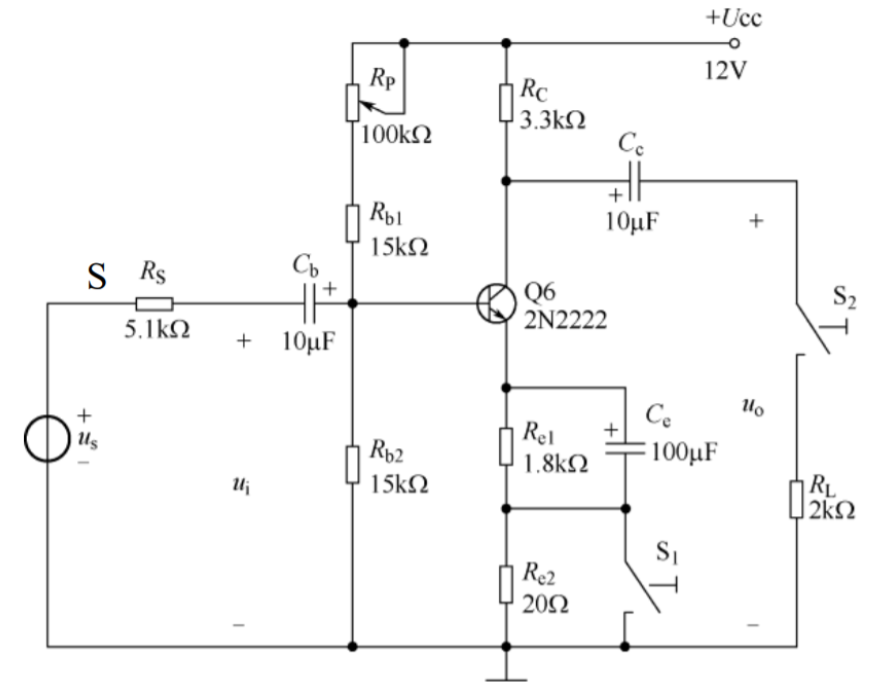

# 电工电子学实验复习
1. 通常用”分压法”来测量电压表的内阻，即将一电阻和电压表串联。
2. 通常用“分流法”来测量电流表的内阻，即将一电阻和电流表并联。
3. 万用表测量小电阻时，电阻的测量值是表头读数减去表笔短接读数。
4. 函数信号发生器作为信号源，它的输出不允许短路。
5. 测量元件伏安特性时，当电压表内阻远远大于待测元件内阻时，应采用电流表外接法。当电流表内阻远远小于待测元件内阻时，应采用电流表内接法。
6. 为减少测量误差，完成某项实验任务时应尽量保持电压表和电流表的量程不变。
7. 对于电感性负载，可以采用并联电容器的方法来提高电路的功率因数，并联电容越大，功率因数越高。（错的）
8. 功率表读取的电压值是指电压的有效值
9. 实际电感可以等效为一个电感L和电阻R的串联。
10. 晶体管共射放大电路的输出电压uo可用数字万用表的交流电压挡测量。（错）
11. 晶体管共射放大电路，当静态工作电流IC增大时，电路容易出现饱和失真。
12. 如图所示晶体管共射放大电路，当可调电位器RP的中间抽头上移时，集电极电流IC的大小会相应减小

13. D 触发器中不用的清零端可以悬空。（错）
14. 应用161芯片搭建计数器时，芯片中的使能端EP和ET应该保持高电平
15. 集成运放电路中的平衡电阻值约等于放大器另一输入端的对地等效电阻。
16. 555组成的多谐振荡器电路属于无稳态电路。
17. 555组成的多谐振荡器电路属于自激振荡电路。
18. 555的4号脚是复位端，低电平有效。
19. 单相桥式整流电路中，整流后（未经过滤波电路）负载上的电压平均值UL与变压器副边电压的有效值U2的关系为$U_L=0.9U_2$
20. 滤波电路中，$U_L=1.2U_2$
21. 单稳态触发器输出的脉冲宽度$t_w=1.1RC$
22. 多谐振荡器$T_1=0.693(R_1+R_2)C,T_2=0.693R_2C$ 
23. 纹波系数γ是整流电路输出电压的主要性能指标，它的值应该越小越好。
24. 在直流稳压的性能指标中，输出电阻ro通常指由于负载变化而引起的输出电压变化量与输出电流变化量之比
25. 一台额定电压为220V的三相异步电动机定子绕组Δ接线，若起动时定子绕组改成Y接线，且接在380V的交流电源上，则电机的起动转矩不变
26. 三相异步电动机的旋转方向决定于定子电流的相序 
27. 采用星－三角降压起动的电动机，正常工作时定子绕组接成三角形
28. 热继电器在电路中的文字符号是FR
29. 在电路中能同时起到短路保护、欠电压保护和过载保护的电器是断路器
30. 下列电器中不能实现短路保护的是热继电器
31. 起过载保护作用的电器是热继电器
32. 甲乙两个接触器，欲实现互锁控制，则应两接触器的线圈电路中互串对方的动断触点
33. 要求两个电器不能同时工作，当其中一个工作时另一个必须不工作，这种控制关系称互锁控制
34. 某一电器必须在另一电器后才能起动，这种控制关系称为顺序控制
35. 在电气传动中，起位置控制或终端保护作用的低压电器是行程开关
36. 时间继电器的文字符号是KT
37. 如图所示时间继电器的图形符号是延时断开的动合触头

（阻碍开关往从粗端到细端的方向走）