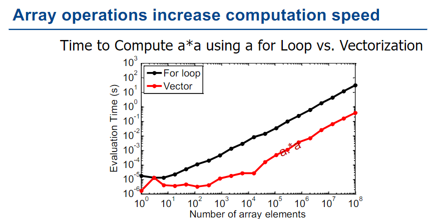
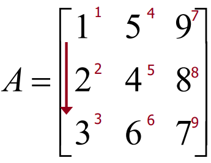

# Introduction to Scientific Computing
## Statements
```matlab
foo = x^2 + sin(5*y) / exp(67*z);
```
The semicolon at the end is optional. 
## Built-in MATLAB functions
`sin(x)`,`cos(x)`,`exp(x)`,`log(x)`,`atan(x)`,`cosh(x)`,`sinh(x)`,`mean(x)`,`median(x)`,etc.
## Array
```matlab
x = [1,3,9,11,-10.2];
foo = x(3); % extracts third element in the array
x(2) = 27; % reassign element in the array

x = 1:15 % creates an array with the number 1 through 15
x = 4:2:28; % creates an array starting at 4 and going up by 2 until it gets to 28
x = -1.3:0.1:1.3; %creates an array starting at -1.3 and going up by 0.1 until it gets to 1.3

x = 1:2:6; % x = [1,3,5]
x = [1:2:6]; % x = [1,3,5]
```

## Operations on arrays
```matlab
x = 0:0.1:10;
y = exp(5*x).*sin(x); % evaluate an expression on every element in the array x producing a new array called y
plot(x,y);

x = [1,2,3,4,5];
y = [7,8,9,10,11];
z = x + y; % element-wise addition adds corresponding elements
z = x.*y; % element-wise multiplication
z = x./y; % element-wise division
```
## Overflow
```matlab
X = uint8(78); Y = uint8(190);
Z = X + Y;
% overflow - value will be clipped to 255
```

## Scientific notation
Note that numbers in scientific notation have the following components
- A sign - positive or negative
- A mantissa(尾数) - ex. 2.13
- An exponent - ex. 17
e.g. +2.13e17

## Arrays and numerical types
When an array variable is created all of the numeric values in that array share the same numeric type. For example we can talk about an array of `uint16`s or an array of doubles.   
`x = single(0:0.1:100);`make an array of single precision（单精度） numbers

## A few useful MATLAB commands
- `whos`
Lists all of the variables currently in your workspace and shows you their types
- `clear`
Clears all of the variables in your workspace – you can also use this to clear specific variables
- `clc`
Just clears the command window – has no effect on the workspace

## Function
```matlab
function f = fact(n)
    f = prod(1:n);
end

function [output1,output2,output3] = myFunction(input1,input2,input3)
```
### Naming a Function
Must start with a letter from the alphabet
### Special Functions
```matlab
function out1 = testFunction(in1)
% A test function
% this would report, in the help function, all of functionality of the function
% in1 = function input (units: not specified)
% out2 = function output (units : not specified)
```
(in the command window)
```matlab
lookfor 'a test function'

% testFunction            - A test function

help testFunction

% A test 
% this would report, in the help function, all of functionality of the function
% in1 = function input (units: not specified)
% out2 = function output (units : not specified)
```
## Search paths
- The working folder at startup can be changed using the userpath function
```matlab
userpath('C:\ATRI')
```
- Paths can also be “permanently” added to the search path using the `addpath()` function
- Paths can be removed using the `rmpath()` function
## Commenting
- Highlight a selection or place your cursor on a line and press “ctrl+r” to comment a section or line of code, respectively
- “ctrl+t” uncomments the code
## Anonymous Function
```matlab
function_name = @ (arguments) expression

FtoC = @ (F) 5*(F-32)./9

% examples
FA = @ (x) exp(x^2)/sqrt(x^2+5)
FA(2)
FA = @ (x) exp(x.^2)./sqrt(x.^2+5)
FA([1 0.5 2])
```
## Function Handles
```matlab
f = @sin;
m = fminbnd(f,0,2*pi)

q = integral(@cubicPoly,0,1);
```

## Vectors(Arrays)
```matlab
% Linspace and logspace
x = linspace(1,5,5)
x = logspace(1,5,5)

x = [5, 9, 4, 1, 7, 3, 4, 8]
% Accessing vector elements
y = x(1)
y = x(1:3)
y = x(end)
y = x(end-2)
y = x([1,3,6])  % y = [5,4,3]

% The indices start at 1, not 0.

% Overwriting
x(end) = 1;

%Add ending indices
x(end+1) = 8
x(end+1:end+2) = [6,9]

%Removing elements 
x(1) = []; % Remove the first element
x(end-3,end) = [];
```

## Iteration
```matlab
for jj = 1:20
    disp(jj)
end

a = 1;
while a < 10
    a = a + 1;
end

% Iterate through the array
x = [1,2,3]
for element = x
    disp(element);
end
```

## Array Operation vs Iteration


## The `if` statement
```matlab
a = 1;
b = 2;
if a == 1;
    disp('a is equal to 1! Yeah');
end

elseif a == 1 && b == 2;
    disp('...')
end
```
## Logical Operators
|Logical Operator(Scalars)|Logical Operator(Vectors)|Function Call|
|-|-|-|
|&&|&|and(a,b)|
|\|\||\||or(a,b)|
|~|~|not(a)|
|none|none|xor(a,b)|
Attention: `~=` in matlab equals to `!=` in other languages

## Logical Vectors
```matlab
a = [1 6 5] < 2
% a = [1,0,0]

x = [5 9 2 4 3];
v = logical([1 0 1 0 1]);
xp = x(v);
% xp = [5,2,3]
```

## Creating matrices
</img>

```matlab
A = [1 2 3;4 5 6];

A = ones(2,5);
A = zeros(2,3);
A = eye(3);  % Create a identity matrix

B = A'  % Rows become columns and columns become rows.

% Expressions used to initialize arrays can include algebraic operations and (all or portions of) previously defined arrays
a = [0 13*2];
b = [a(2) 13 a];

A = [1 5 9;2 4 8;3 6 7];
c = A[3,1]; % c == 3
c = A[4]; % Matrix indices may also be accessed using a single subscript 
```

## Subarrays
```matlab
% Vectors
va =[1:5]
va(:) % all elements
va(m:n) % elements m through n

% Matrix
A = [1 2 3; 4 5 6; 7 8 9];
A(:,n) % all elements in column n
A(n,:) % all elements in row n
A(:,m:n) % elements in columns m through n
A(m:n,:) % elements in rows m through n
A(m:n,p:q)

b = [1 2 3 4; 5 6 7 8; 9 10 11 12];
b(2:2:end,2:end); % [6 7 8]
```
## Manipulating Matrices
|Built-in function|description|
|-|-|
|`length(v)`|returns length of largest array dimension|
|`size(A)`|returns[m,n] where m and n are the size of A|
|`numel(A)`|returns the total number of elements in the array|
|`reshape(A,m,n)`|rearrange A to have m rows and n colomns|
|`diag(v)`|creates square matrix with elements on the diagonal|
|`diag(A)`|creates vector from the diagonal elements|

## Resizing a Matrix
```matlab
A(:,2) = []; % deleting rows or columns from an array
A = [B C; D E;] % Arrays can be concatenated to form larger arrays.
```

## Strings
- An array of characters typed between single quotes (‘),e.g.`'Hello World'`
- char built-in function `My_string = char('string 1','string 2','string 3')`
- Work with strings `lower`;`isspace`;`isletter`

## Matrix Addition and Subtraction
1. Scalars may be added to any array, and the scalar value is added to all elements of the array
2. Arrays may be added and subtracted so long as they have the same dimensions

## Element-by-Element Operations
- Addition(+) and subtraction (-) 
- Multiplication (.*) and division (./) 
- Exponentiation (.^) 
- Functions applied over arrays (`sin`, `log`,…)
- evaluating a function e.g.$y=x^2-4x$
## Matrix Multiplication
- `a*B` Matrices may be multiplied by a scalar:Element-by-Element Multiplication
- `A.*B` Element-by-Element Multiplication
- `A*B` Matrix multiplication
- `cross(X,Y)` Cross product, special operation on two vectors.

## Matrix division
### Inverse of a matrix
- `inv` function or raise to -1 power
- matrix must be square and invertible
### Left Division
Solve $AX=B$ where $X$ and $B$ are column vectors.  
$$X=A^{-1}B$$
```matlab
X=A\B
```
### Right Division
Solve $XC=D$ where $X$ and $D$ are column vectors.  
$$X=DC^{-1}$$
```matlab
X=D/C
```
### Rotating and flipping arrays
- `rot90`:Rotate counterclockwise by 90 degrees
- `fliplr` or `flipdim(A,1)`: Reverse the matrix by treating a row as a whole.
- `flipud` or `flipdim(A,2)`: Reverse the matrix by treating a column as a whole.
$$A= \left[ \begin{matrix}
    1&2&3\\
    4&5&6
\end{matrix} \right] 
\begin{cases}
\xrightarrow{rot90(A)}\left[ \begin{matrix}
    3&6\\
    2&5\\
    1&4
\end{matrix} \right] \\
\\
\xrightarrow{fliplr(A)\ or flipdim(A,1)}\left[ \begin{matrix}
    3&2&1\\
    6&5&4
\end{matrix} \right]\\
\\
\xrightarrow{flipud(A)\ or flipdim(A,2)}
\left[ \begin{matrix}
    4&5&6\\
    1&2&3
\end{matrix} \right]
\end{cases}$$
Actually, we use `flip` instead of `flipdim` now. And the grammer is absolutely the same.  
The second parameter of `flip`(or `flipdim`) is the dimension that is manipulated. It can be set to 3 or more when the dimension of array is above 2.
## Built-in Matrices
- `zeros(n)` returns an n-by-n matrix with all the elements equal to zero
- `ones(n)` returns an n-by-n matrix with all the elements equal to one
- `magic(n)` returns an n-by-n matrix constructed from the integers 1 through n*n with equal row and column sums. The order n must be a scalar greater than or equal to 3 in order to create a valid magic square.
- `eye(n)` return an n-by-n identity matrix
## Sparse arrays
Sparse matrices are defined by a list of elements containing non-zero elements while all other elements are assumed to be zero
```matlab
% conventional way to create a matrix
A = zeros(1000,2000);
A(3,4) = 15;
A(100,1500) = 5;
A(1000,2000) = 9;

% create using a sparse matrix
A = sparse([3,100,1000],...
    [4,1500,2000],...
    [15,5,9],1000,2000);

%The original (full) matrix A could also be converted to a sparse matrix via the following
A = sparse(A);
```

|Matrix type|Memory(MB)|Time to compute $A^2$(ms)|
|-|-|-|
|Full|15.2|4|
|Sparse|0.015|0.04|
## Summing array elements
Consider the following 3D array
$$A=\left[\begin{matrix}
    1&1&1\\
1&1&1
\end{matrix}\right]
\left[\begin{matrix}
    2&2&2\\
2&2&2
\end{matrix}\right]
\left[\begin{matrix}
    3&3&3\\
3&3&3
\end{matrix}\right]$$
$$sum(A)=\left[\begin{matrix}
2&2&2
\end{matrix}\right]\left[\begin{matrix}
4&4&4
\end{matrix}\right]\left[\begin{matrix}
6&6&6
\end{matrix}\right]$$
$$sum(sum(A))=[6][12][18]$$
$$sum(sum(sum(A)))=[36]$$
$$sum(A,3)=\left[\begin{matrix}
    6&6&6\\
6&6&6
\end{matrix}\right]$$
manipulate the matrix in the same way:
1. treat a row as a whole
2. treat a column as a whole
3. treat the 3rd dimension a whole
## Cumulative sums
- `cumsum()` sums cumulatively along a vector or some dimension of an array
- unless a dimension is specified, it works on the first non-singleton dimension 
```matlab
cumsum([1 2 3 4 5]);
% [1 3 6 10 15]

cumsum([1 2 3; 4 5 6]);
% ([1 2 3; 5 7 9])
```
## Product
```matlab
x(:,:,1) = [1 2 3; 4 5 6];
x(:,:,2) = [6 5 4; 3 2 1];
y = prod(x)

% y(:,:,1) == [4 10 18] and
% y(:,:,2) == [18 10 4]
```

## Cumulative product
`cumprod()` calculates the cumulative product of array elements along the first non-singleton dimension
```matlab
x(:,:,1) = [1; 2; 3];
x(:,:,2) = [2; 2; 2];
y = cumprod(x)

% y(:,:,1) = [1; 2; 6] and
% y(:,:,2) = [2; 4; 8]
```
## Vocabulary
- Scalars 标量
- portions 部分