# Introduction to Scientific Computing
## Statements
```matlab
foo = x^2 + sin(5*y) / exp(67*z);
```
The semicolon at the end is optional. 
## Built-in MATLAB functions
`sin(x)`,`cos(x)`,`exp(x)`,`log(x)`,`atan(x)`,`cosh(x)`,`sinh(x)`,`mean(x)`,`median(x)`,etc.
## Array
```matlab
x = [1,3,9,11,-10.2];
foo = x(3); % extracts third element in the array
x(2) = 27; % reassign element in the array

x = 1:15 % creates an array with the number 1 through 15
x = 4:2:28; % creates an array starting at 4 and going up by 2 until it gets to 28
x = -1.3:0.1:1.3; %creates an array starting at -1.3 and going up by 0.1 until it gets to 1.3

x = 1:2:6; % x = [1,3,5]
x = [1:2:6]; % x = [1,3,5]
```

## Operations on arrays
```matlab
x = 0:0.1:10;
y = exp(5*x).*sin(x); % evaluate an expression on every element in the array x producing a new array called y
plot(x,y);

x = [1,2,3,4,5];
y = [7,8,9,10,11];
z = x + y; % element-wise addition adds corresponding elements
z = x.*y; % element-wise multiplication
z = x./y; % element-wise division
```
## Overflow
```matlab
X = uint8(78); Y = uint8(190);
Z = X + Y;
% overflow - value will be clipped to 255
```

## Scientific notation
Note that numbers in scientific notation have the following components
- A sign - positive or negative
- A mantissa(尾数) - ex. 2.13
- An exponent - ex. 17
e.g. +2.13e17

## Arrays and numerical types
When an array variable is created all of the numeric values in that array share the same numeric type. For example we can talk about an array of `uint16`s or an array of doubles.   
`x = single(0:0.1:100);`make an array of single precision（单精度） numbers

## A few useful MATLAB commands
- `whos`
Lists all of the variables currently in your workspace and shows you their types
- `clear`
Clears all of the variables in your workspace – you can also use this to clear specific variables
- `clc`
Just clears the command window – has no effect on the workspace

## Function
```matlab
function f = fact(n)
    f = prod(1:n);
end

function [output1,output2,output3] = myFunction(input1,input2,input3)
```
### Naming a Function
Must start with a letter from the alphabet
### Special Functions
```matlab
function out1 = testFunction(in1)
% A test function
% this would report, in the help function, all of functionality of the function
% in1 = function input (units: not specified)
% out2 = function output (units : not specified)
```
(in the command window)
```matlab
lookfor 'a test function'

% testFunction            - A test function

help testFunction

% A test 
% this would report, in the help function, all of functionality of the function
% in1 = function input (units: not specified)
% out2 = function output (units : not specified)
```
## Search paths
- The working folder at startup can be changed using the userpath function
```matlab
userpath('C:\ATRI')
```
- Paths can also be “permanently” added to the search path using the `addpath()` function
- Paths can be removed using the `rmpath()` function
## Commenting
- Highlight a selection or place your cursor on a line and press “ctrl+r” to comment a section or line of code, respectively
- “ctrl+t” uncomments the code
## Anonymous Function
```matlab
function_name = @ (arguments) expression

FtoC = @ (F) 5*(F-32)./9

% examples
FA = @ (x) exp(x^2)/sqrt(x^2+5)
FA(2)
FA = @ (x) exp(x.^2)./sqrt(x.^2+5)
FA([1 0.5 2])
```
## Function Handles
```matlab
f = @sin;
m = fminbnd(f,0,2*pi)

q = integral(@cubicPoly,0,1);
```

## Vectors(Arrays)
```matlab
% Linspace and logspace
x = linspace(1,5,5)
x = logspace(1,5,5)

x = [5, 9, 4, 1, 7, 3, 4, 8]
% Accessing vector elements
y = x(1)
y = x(1:3)
y = x(end)
y = x(end-2)
y = x([1,3,6])  % y = [5,4,3]

% The indices start at 1, not 0.

% Overwriting
x(end) = 1;

%Add ending indices
x(end+1) = 8
x(end+1:end+2) = [6,9]

%Removing elements 
x(1) = []; % Remove the first element
x(end-3,end) = [];
```

## Iteration
```matlab
for jj = 1:20
    disp(jj)
end

a = 1;
while a < 10
    a = a + 1;
end

% Iterate through the array
x = [1,2,3]
for element = x
    disp(element);
end
```

## Array Operation vs Iteration


## The `if` statement
```matlab
a = 1;
b = 2;
if a == 1;
    disp('a is equal to 1! Yeah');
end

elseif a == 1 && b == 2;
    disp('...')
end
```
## Logical Operators
|Logical Operator(Scalars)|Logical Operator(Vectors)|Function Call|
|-|-|-|
|&&|&|and(a,b)|
|\|\||\||or(a,b)|
|~|~|not(a)|
|none|none|xor(a,b)|
Attention: `~=` in matlab equals to `!=` in other languages

## Logical Vectors
```matlab
a = [1 6 5] < 2
% a = [1,0,0]

x = [5 9 2 4 3];
v = logical([1 0 1 0 1]);
xp = x(v);
% xp = [5,2,3]
```

## Creating matrices
</img>

```matlab
A = [1 2 3;4 5 6];

A = ones(2,5);
A = zeros(2,3);
A = eye(3);  % Create a identity matrix

B = A'  % Rows become columns and columns become rows.

% Expressions used to initialize arrays can include algebraic operations and (all or portions of) previously defined arrays
a = [0 13*2];
b = [a(2) 13 a];

A = [1 5 9;2 4 8;3 6 7];
c = A[3,1]; % c == 3
c = A[4]; % Matrix indices may also be accessed using a single subscript 
```

## Subarrays
```matlab
% Vectors
va =[1:5]
va(:) % all elements
va(m:n) % elements m through n

% Matrix
A = [1 2 3; 4 5 6; 7 8 9];
A(:,n) % all elements in column n
A(n,:) % all elements in row n
A(:,m:n) % elements in columns m through n
A(m:n,:) % elements in rows m through n
A(m:n,p:q)

b = [1 2 3 4; 5 6 7 8; 9 10 11 12];
b(2:2:end,2:end); % [6 7 8]
```
## Manipulating Matrices
|Built-in function|description|
|-|-|
|`length(v)`|returns length of largest array dimension|
|`size(A)`|returns[m,n] where m and n are the size of A|
|`numel(A)`|returns the total number of elements in the array|
|`reshape(A,m,n)`|rearrange A to have m rows and n colomns|
|`diag(v)`|creates square matrix with elements on the diagonal|
|`diag(A)`|creates vector from the diagonal elements|

## Resizing a Matrix
```matlab
A(:,2) = []; % deleting rows or columns from an array
A = [B C; D E;] % Arrays can be concatenated to form larger arrays.
```

## Strings
- An array of characters typed between single quotes (‘),e.g.`'Hello World'`
- char built-in function `My_string = char('string 1','string 2','string 3')`
- Work with strings `lower`;`isspace`;`isletter`

## Matrix Addition and Subtraction
1. Scalars may be added to any array, and the scalar value is added to all elements of the array
2. Arrays may be added and subtracted so long as they have the same dimensions

## Element-by-Element Operations
- Addition(+) and subtraction (-) 
- Multiplication (.*) and division (./) 
- Exponentiation (.^) 
- Functions applied over arrays (`sin`, `log`,…)
- evaluating a function e.g.$y=x^2-4x$
## Matrix Multiplication
- `a*B` Matrices may be multiplied by a scalar:Element-by-Element Multiplication
- `A.*B` Element-by-Element Multiplication
- `A*B` Matrix multiplication
- `cross(X,Y)` Cross product, special operation on two vectors.

## Matrix division
### Inverse of a matrix
- `inv` function or raise to -1 power
- matrix must be square and invertible
### Left Division
Solve $AX=B$ where $X$ and $B$ are column vectors.  
$$X=A^{-1}B$$
```matlab
X=A\B
```
### Right Division
Solve $XC=D$ where $X$ and $D$ are column vectors.  
$$X=DC^{-1}$$
```matlab
X=D/C
```
### Rotating and flipping arrays
- `rot90`:Rotate counterclockwise by 90 degrees
- `fliplr` or `flipdim(A,1)`: Reverse the matrix by treating a row as a whole.
- `flipud` or `flipdim(A,2)`: Reverse the matrix by treating a column as a whole.
$$A= \left[ \begin{matrix}
    1&2&3\\
    4&5&6
\end{matrix} \right] 
\begin{cases}
\xrightarrow{rot90(A)}\left[ \begin{matrix}
    3&6\\
    2&5\\
    1&4
\end{matrix} \right] \\
\\
\xrightarrow{fliplr(A)\ or flipdim(A,1)}\left[ \begin{matrix}
    3&2&1\\
    6&5&4
\end{matrix} \right]\\
\\
\xrightarrow{flipud(A)\ or flipdim(A,2)}
\left[ \begin{matrix}
    4&5&6\\
    1&2&3
\end{matrix} \right]
\end{cases}$$
Actually, we use `flip` instead of `flipdim` now. And the grammer is absolutely the same.  
The second parameter of `flip`(or `flipdim`) is the dimension that is manipulated. It can be set to 3 or more when the dimension of array is above 2.
## Built-in Matrices
- `zeros(n)` returns an n-by-n matrix with all the elements equal to zero
- `ones(n)` returns an n-by-n matrix with all the elements equal to one
- `magic(n)` returns an n-by-n matrix constructed from the integers 1 through n*n with equal row and column sums. The order n must be a scalar greater than or equal to 3 in order to create a valid magic square.
- `eye(n)` return an n-by-n identity matrix
## Sparse arrays
Sparse matrices are defined by a list of elements containing non-zero elements while all other elements are assumed to be zero
```matlab
% conventional way to create a matrix
A = zeros(1000,2000);
A(3,4) = 15;
A(100,1500) = 5;
A(1000,2000) = 9;

% create using a sparse matrix
A = sparse([3,100,1000],...
    [4,1500,2000],...
    [15,5,9],1000,2000);

%The original (full) matrix A could also be converted to a sparse matrix via the following
A = sparse(A);
```

|Matrix type|Memory(MB)|Time to compute $A^2$(ms)|
|-|-|-|
|Full|15.2|4|
|Sparse|0.015|0.04|
## Summing array elements
Consider the following 3D array
$$A=\left[\begin{matrix}
    1&1&1\\
1&1&1
\end{matrix}\right]
\left[\begin{matrix}
    2&2&2\\
2&2&2
\end{matrix}\right]
\left[\begin{matrix}
    3&3&3\\
3&3&3
\end{matrix}\right]$$
$$sum(A)=\left[\begin{matrix}
2&2&2
\end{matrix}\right]\left[\begin{matrix}
4&4&4
\end{matrix}\right]\left[\begin{matrix}
6&6&6
\end{matrix}\right]$$
$$sum(sum(A))=[6][12][18]$$
$$sum(sum(sum(A)))=[36]$$
$$sum(A,3)=\left[\begin{matrix}
    6&6&6\\
6&6&6
\end{matrix}\right]$$
manipulate the matrix in the same way:
1. treat a row as a whole
2. treat a column as a whole
3. treat the 3rd dimension a whole
## Cumulative sums
- `cumsum()` sums cumulatively along a vector or some dimension of an array
- unless a dimension is specified, it works on the first non-singleton dimension 
```matlab
cumsum([1 2 3 4 5]);
% [1 3 6 10 15]

cumsum([1 2 3; 4 5 6]);
% ([1 2 3; 5 7 9])
```
## Product
```matlab
x(:,:,1) = [1 2 3; 4 5 6];
x(:,:,2) = [6 5 4; 3 2 1];
y = prod(x)

% y(:,:,1) == [4 10 18] and
% y(:,:,2) == [18 10 4]
```

## Cumulative product
`cumprod()` calculates the cumulative product of array elements along the first non-singleton dimension
```matlab
x(:,:,1) = [1; 2; 3];
x(:,:,2) = [2; 2; 2];
y = cumprod(x)

% y(:,:,1) = [1; 2; 6] and
% y(:,:,2) = [2; 4; 8]
```

## Input Commands
### `input` command
```matlab
in1 = input('Enter data:');
% Stores input value as a numerical value or array of values of type double

in2 = input('Enter data:','s');
% Stores input value as a string (an array of characters)
```

## Output Commands
### `disp` command
```matlab
disp(variable);
disp('text to print')
```
### `fprintf` command
```matlab
fprintf(format,data);
```
Formatted output placed on screen or saved to a file 
## Manipulate the files
### `save`
% Save all variables in the workspace to a file 
```matlab
save('file_name');
save file_name;
% Writes file_name.mat file in binary format

% Save a few variables
save file_name var1 var2;

% Save in readable format 
save -ascii file_name;
% Easy way to transfer data
```

### `load`
```matlab
% Load the variables in a file
load('file_name'); 
load file_name;
% Reads file_name.mat in binary format and restores variables

load file_name var1 var2;
% Load a few variables
load file_name var1 var2;

% Load from a text(.txt) file
load file_name.txt;
var = load('file_name.txt');

% Options
% mat, -ascii
```

## Cell Arrays
```matlab
c = {42,rand(5),'abcd'}

% c = 
%     1x3 cell array
%         {[42]}   {5x5 double}   {['abcd']}   
```
## A pleasing plot
several objective measures of a good plot
- Labels with units
- Minimum amount of information to convey the objective (don’t double label objects unless necessary, extraneous callouts should be avoided)
- Avoid overuse of eye candy
- Scatter plots for measured data and line plots for fits or closed form equations
- Sufficient resolution on domain to represent solution
- Line widths, data point sizes, and text large enough to read
## 2D plot commands
### `plot` and `scatter`
```matlab
x = -2*pi:pi/20:2*pi;
y = sin(x);
```
|commands|`plot()`|`scatter()`|
|-|-|-|
|picture|||
- `p;ot()` and `scatter` require vectors of equal length
- The default plot attributes are blue lines or circular blue data points, respectively
- These attributes can be modified be adjusting the line specifications of the plot `linespec`
- Straight lines may also be plotted by specifying the beginning 
and end points of the line
```matlab
plot([0,20],[-5,5],'r-');
```
</img>

### Double y plot `plotyy()`
```matlab
x = -2*pi:pi/20:2*pi;
y1 = sin(x);
y2 = cos(x);
plotyy(x,y1,x,y2);
```
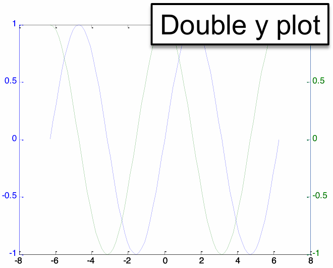</img>

### Logarithmic plot
```matlab
 x = logspace(0,5,25);
 y = x.^5;
 loglog(x,y,'LineWidth',4)
```
|commands|`semilogy()`|`semilogx()`|`loglog()`|
|-|-|-|-|
|picture||||
### `polar()` and `Error Bars`
```matlab
theta = 0:0.01:2*pi;
rho = sin(2*theta).*cos(2*theta);
polar(theta,rho)

 x = 1:25; 
 y = randi(25,1,length(x));
 y_err = 0.25*y;
 errorbar(x,y,y_err)
```
|commands|`polar()`|`errorbar()`|
|-|-|-|
|picture||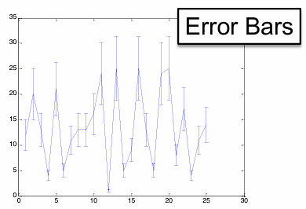|
### `ezplot`
`ezplot` produces simple plots without the need for discrete input of x/y vectors
|commands|`ezplot('1/x')`|`ezplot('1/x',[0 2*pi])`|
|-|-|-|
|picture||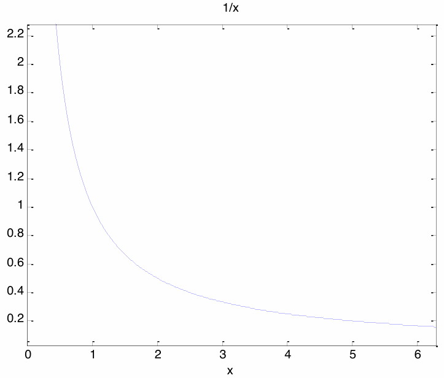|
|discription| The default domain is -2π to 2π|The domain may also be specified by a two element vector|
### `fplot`
`fplot` intelligently selects x values based on changes to a function and may be used for rapidly changing functions
```matlab
x = 0:.05:0.5*pi;
y = sin(1./x);
plot(x,y)

fplot('sin(1/x)',[0 0.5*pi]);
```
|commands|`plot()`|`fplot()`|
|-|-|-|
|picture|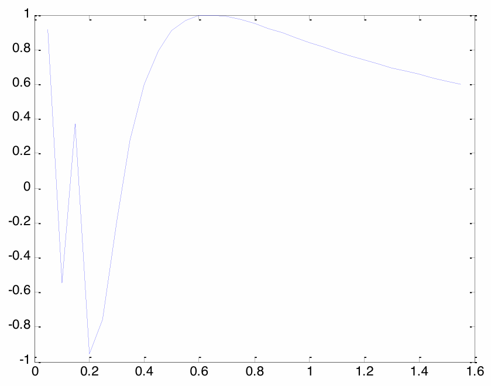||
### Plotting a vector
Most 2D plot commands can be called with a single vector, which is often useful for debugging   
The x values are then assigned the index location
```matlab
r = logspace(0,3,25)
plot(r,'ko','MarkerFaceColor','k')
```
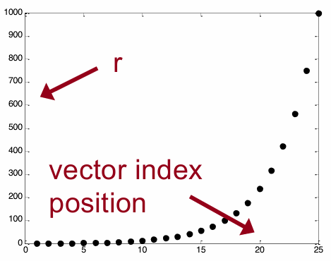
### Specifying plot attributes
```matlab
plot(x,y,'LineSpecifiers','PropertyName',PropertyValue)
```
Line specifiers include line style, line color and marker.(e.g. `ro-`)  
Property names include `LineWidth`, `MarkerSize`, `MarkerEdgeColor`, `MarkerFaceColor`
### Overlaid plots
```matlab
x = -2*pi:pi/20:2*pi;
y1 = sin(x);
y2 = cos(x)

% first method
plot(x,y1,'r-',x,y2,'b-','LineWidth',5)

% second method
plot(x,y1,'r-','LineWidth',5)
hold on
plot(x,y2,'b-','LineWidth',5)
hold off
```
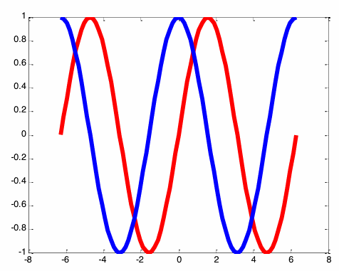
- Plot color may be specified for each vector, but line specifications such as `LineWidth `invoked within the plot function will be applied to all data series
- `hold on` is invoked after the first plot command and indicates that more data will be attributed to the existing axes;
- `hold off` indicates that additional plotting will overwrite the axes
### Setting axes or figure properties
```matlab
set(gca,'Fontsize',20)
```
</img>
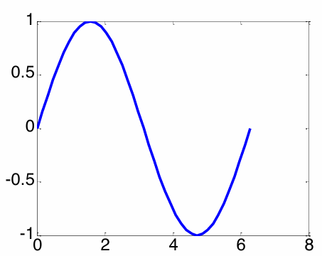</img>
```matlab
 set(gcf,'Color','w')
```
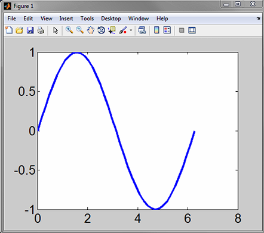</img>
</img>

### Plotting multiple figures
The second plot command executed (without specifying hold on) will overwrite the first plot.  
You need to specify a new figure establish a new parent figure window
```matlab
x = -2*pi:pi/20:2*pi;
y1 = sin(x);
y2 = cos(x);
plot(x,y1,'k-','LineWidth',5)
figure
plot(x,y2,'k-','LineWidth',5)
```
Figures numbers may also be specified with a figure number, ex. `figure(3)`  

Plots may then be closed using the close command  
`close`: closes the last figure  
`close(n)`: closes figure number n  
`close all`: closes all figures

### Multiple axes on a figure
Multiple axes may be assigned to a single figure using the `subplot` command or by specifying the `position` of multiple axes  

`subplot(rows,columns,position)`
- rows: rows of axes
- columns: columns of axes
- position: position of current axes (counted along rows)
```matlab
x = 0:pi/20:2*pi;
y1 = sin(x-0);
y2 = sin(x-0.5);
y3 = sin(x-1);
y4 = sin(x-1.5);
y5 = sin(x-2);
y6 = sin(x-2.5);

subplot(2,3,1)
plot(x,y1)
axis tight

subplot(2,3,2)
plot(x,y2)
axis tight

subplot(2,3,3)
plot(x,y3)
axis tight

subplot(2,3,4)
plot(x,y4)
axis tight

subplot(2,3,5)
plot(x,y5)
axis tight

subplot(2,3,6)
plot(x,y6)
axis tight
```


`axes('Position',[x,y,w,h])`
- x: lower left hand corner x coordinate
- y: lower left hand corner y coordinate
- w: width of axes
- h: height of axes
```matlab
axes('Position',[.1 .1 .5 .3])
plot(x,y1)

axes('Position',[.5 .5 .2 .4])
plot(x,y3)
```
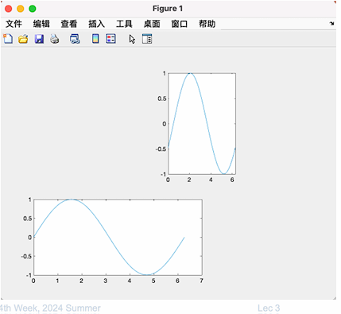
### Specifying the domain and range
A specific domain and range may be specified using `axis` or `xlim/ylim`   

`axis([xmin xmax ymin ymax])` or 
```matlab
xlim([xmin xmax])
ylim([ymin ymax])
```
e.g.
```matlab
plot(x,y1,'LineWidth',5)
axis([0 1.5*pi 0 1.5])
set(gca,'FontSize',20)
```
The axis command offers many predefined axis scaling/sizing operations.

### Labeling and titling axes
```matlab
plot(x,y1,'LineWidth',5)
set(gca,'FontSize',20)
xlabel('Time (s)')
ylabel('Voltage (V)')
title('Generator Output')
axis([0 2*pi -1.2 1.2])
```
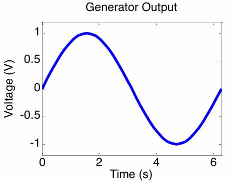
### Adding a legend
```matlab
legend('sin(x)','cos(x)','Location','NorthEast')
```
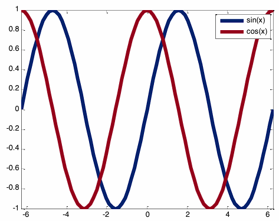
### Placing text on a plot
```matlab
text(pi,0.2,'Text string','Color','b')
```

## 3D plot
Three steps 
1. Make a grid in the x-y plane 
2. Find the value of z for each point of the grid 
3. Draw the mesh or surface plot  

` plot3(x, y, z, 'line specifiers','PropertyName', PropertyValue)`
### meshgrid
`[X, Y] = meshgrid (x, y)`
```matlab
x = linspace(-1, 3);
y = linspace(4, 1, -1);
[X, Y] = meshgrid(x, y);
```
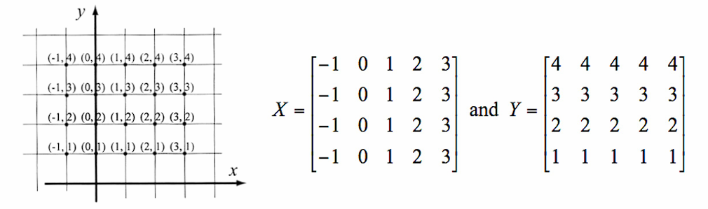
- X, Y: matrices of x and y coordinates, respectively 
- x, y: vectors that define the domain of the grid

### Mesh and surface plots
- `mesh(X,Y,Z)` lines connecting the points 
- `surf(X,Y,Z)` areas colored
### Other 3D Plots
- Sphere 
- Cylinder 
- 3D bar 
- 3D stem 
- 3D scatter 
- 3D pie
### Controlling the View in 3D
`view(az, el)` or `view([az, el])`  
`az`: azimuth relative to negative y-axis (default is -37.5°)   
`el`: elevation from x-y plane (default is 30°)  
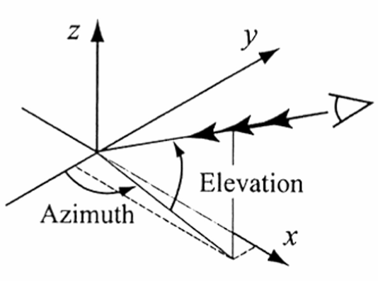

## Graphics handles
Figures, axes, and plots can all be assigned handles  
These handles look a lot like “variables” and serve as a pointer to the object
```matlab
myHandle1 = plot(x,y);
myFig = figure;
h = axes;
```
### `set`
`set(<handle>,<property>,<propertyValue>)`  
e.g.
```matlab
pl1 = plot(x,y);
set(pl1,'LineWidth',2)
```
### `get`
`get(<handle>,<property>)`  
e.g.
```matlab
fig1 = figure
pl1 = plot(x,y);
get(fig1,‘Position')
```
## ODE
say we have an equation of the form  
$$\overset{...}{y}+p\ddot{y}+q\dot{y}+ry=0$$
We start by assigning generalized variables (say x) to derivatives of y of increasing order as such  
$$x_1 = y , x_2 = \dot{y} , x_3 = \ddot{y}$$
Next, we rearrange the ODE to get the variable of highest order on the left side of the equation and divide out any coefficients on this variable   
$$\overset{...}{y} = -p\ddot{y}-q\dot{y}-ry$$
Next, we rewrite the derivatives of the generalized variables with respect to each other and the ODE
$$\dot{x_1} = x_2,\dot{x_2} = x_3, \dot{x_3} = -px_3 -qx_2 -rx_1$$
```matlab
function xout = thirdOrderODE(t,x)
% time and initial condition serve as inputs
p = 2;
q = 1.5;
r = 0.1;

dx1 = x(2);
dx2 = x(3);
dx3 = -p*x(3)-q*x(2)-r*x(1);

xout = [dx1; dx2; dx3];
%  the derivatives of the generalized variables are returned as a column vector
end

[t,x] = ode45(@thirdOrderODE,[0 10],[10 1 2]);
% [0 10] indicates the start and end time of the solution
% [10 1 2] indicates initial conditions. x(1) = 10, x(2) = 1, etc.
```
## Polynimials
MATLAB represents polynomials as a vector
```matlab
p = [8 5]  % 8x+5
p = [5 0 0 6 -7 0] % 5x^5+6x^2-7x
```
Value of a polynomial
```matlab
v = polyval(p,x)
% p is vector of coefficients
% x is the point to evaluate, it can be scalar, vector or matrix 
```
### Polynomial Functions
- Roots of a polynomial
`r = roots(p)`
- Polynomial from its roots
`p = poly(r)`
- Polynomial multiplication(convolution)
`c = conv(a,b)`
- Polynomial division (deconvolution)
`[q, r] = deconv(a,b) `
- Derivatives of polynomials
`pd = polyder(p)`
## Curve Fitting
### The Method of Least Square
Minimize sum of squares of residuals at all data points   
`p = polyfit(x, y, n)`  
`x, y`: vectors of data coordinates
`n`:degree of polynomial 
`p`:vector of coefficients for polynomial fit
### Fitting with other than Polynomials
|Fitting Methods|relationship|linear form|code|
|-|-|-|-|
|Power|$y=bx^m$|$\ln y=m\ln x+\ln b$|`p=polyfit(log(x),log(y),1)`|
|Exponential|$y=be^{mx}\\y=b10^{mx}$|$\ln y = mx+\ln b\\\log y = mx + \log b$|`p=polyfit(x,log(y),1)`<br>`p=polyfit(x,log10(y),1)`|
|Logarithmic|$y=m\ln x + b\\y=m\log x + b$||`p=polyfit(log(x),y,1)`<br>`p=polyfit(log10(x),y,1`|
|Reciprocal|$\dfrac{1}{mx+b}$|$\dfrac{1}{y}=mx+b$|`p=polyfit(x,1./y,1)`|
## Interpolation
` yi = interp1(x, y, xi, 'method')`
`x, y`: vectors of data coordinates
`xi`: horizontal coordinate of interpolation point 
`method`: method to use for interpolation 
### methods
`nearest` value of data point nearest 
`linear` linear spline 
`spline` cubic spline interpolation 
`pchip` piecewise cubic Hermite interpolation 
## Probability and Statistics
### The basics
`avg` = mean(x) 
`med` = median(x)
</img>

### Histograms
Histograms plot the frequency of occurrence of the data values not the data themselves
`hist(y)` Data divided into 10 bins 
`hist(y,n)` Data divided into n (scalar) bins 
`hist(y,x)` Vector x specifies bin centers 

`n = hist(y)` Vector of number of points in each bin
### Error Function
$$erf(x) = \dfrac{2}{\sqrt\pi}\displaystyle\int^{x}_{0}e^{-t^2}dt$$
*高斯函数是正态分布的密度函数
### Random Numbers
## Vocabulary
- Scalars 标量
- portions 部分
- extraneous 无关的
- eye candy 视觉上具吸引力，但没什么实质内容的东西
- resolution 分辨率
- domain 范围，领域
- consecutive 连续的
- convolution 卷积
- interpolate 插值