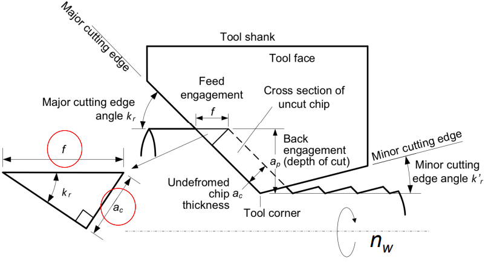
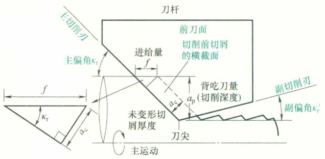
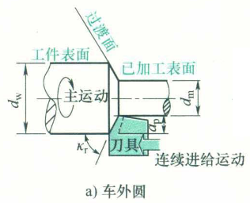
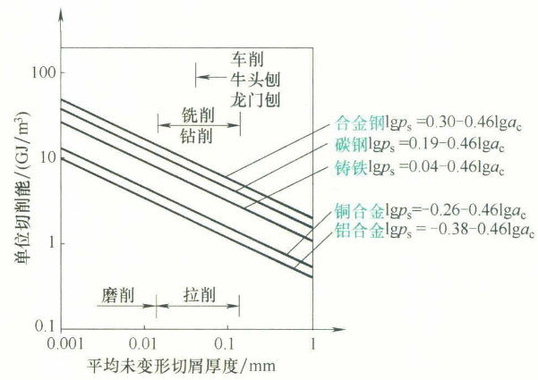
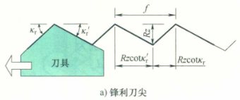
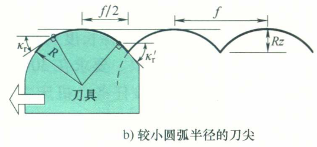

# Design and Manufacturing I
## Ch2 Single Point Cutting

### Turning
$a_c$ is the undeformed chip thickness, f is feed（进给量，即工件每转一圈刀具相对于工件的轴向位移量）, $\kappa_r$ is the major cutting edge angle
$$a_c=f\sin\kappa_r$$
$A_c$ is the cross-sectional area, $a_p$ is depth of cut
$$A_c=fa_p$$
$l_w$ is the length of cylindrical surface, $n_w$ is the rotational frequency of the workpiece. Machine time
$$t=\frac{l_w}{fn_w}$$

$d_m$ is the diameter of machined surface, $d_w$ is the diameter of workpiece. Average cutting speed
$$v=\frac{\pi n_w(d_w+d_m)}{2}=\pi n_w(d_m+a_p)$$
Material removal rate
$$Z_w=A_c v=a_p f \pi n_w(d_m+a_p)=\pi(d_w-a_p)n_wa_pf$$
$V_0$ is the volume of material removed
$$Z_w=\frac{V_0}{t}$$
where t is machine time.

$p_s$ is energy per unit volume of work-material (Related to un-deformed chip thickness)
Power for primary motion
$$P_m=Z_wp_s$$
 

$R_a$:Arithmetic average or centerline average roughness
$R_t$:Maximum (peak to valley) height roughness
$$R_t=\frac{f}{\cot\kappa_r+\cot\kappa'_r},R_a=\frac{R_t}{4}=\frac{f}{4(\cot\kappa_r+\cot\kappa'_r)}$$ 

if $\dfrac{f}{2}\leq R\sin\kappa'_r$
$$R_t\approx\frac{f^2}{8R},R_a\approx\frac{f^2}{32R}$$
### Facing
Machining time $t_m=\dfrac{d_w}{2fn_w}$
Maximum cutting speed: $v_{max}=\pi n_wd_w$
Maximum metal removal rate when f is constant $Z_{w,max}=\pi fa_pn_wd_w$
